---

session_ids: [10111]

---

# WWDC23 10111 - 使用 ImmersiveSpace 让 SwiftUI 跃出屏幕

本文基于 [Session 10111](https://developer.apple.com/videos/play/wwdc2023/10111/) 梳理。

在 visionOS 上通过一些功能强大且易于使用的 API，我们能够轻松创造完全沉浸式的体验。所有这一切都可以通过我们已经熟悉的工具、框架和模式来实现。其核心是 SwiftUI 的 [`ImmersiveSpace`](https://developer.apple.com/documentation/swiftui/immersivespace)。本文我们将围绕 Space 展开，介绍包括 Space 的信息、如何在 Space 中展示内容和更好的管理 Space，此外，还会介绍一些自定义功能。

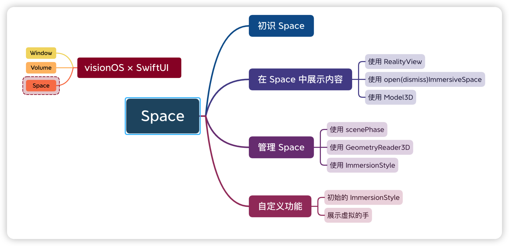

## 进入沉浸式体验

在过去的几年中，Apple 引入和完善了许多工具及框架，用于为 iOS 和 iPadOS 等构建 AR 应用程序，例如 [ARKit](https://developer.apple.com/augmented-reality/arkit/)、[RealityKit](https://developer.apple.com/augmented-reality/realitykit/) 等。这些应用程序通过交互式的用户界面和虚拟对象来增强用户环境，模糊现实世界与想象之间的界限，创造了丰富的 AR 体验。

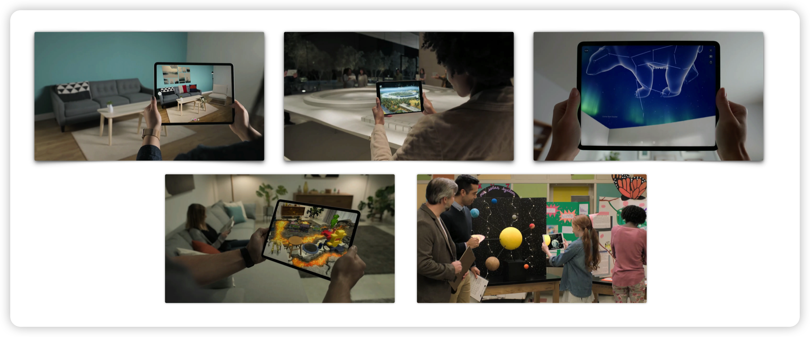

在 SwiftUI2.0 中，Apple 提供了全新的 [`App`](https://developer.apple.com/documentation/swiftui/app)、[`Scene`](https://developer.apple.com/documentation/swiftui/scene) 协议，使代码变得更清晰：

```swift
@main
struct WorldApp: App {
    var body: some Scene {
        WindowGroup {
            Text("Hello world")
        }
    }
}
```

通在符合 `App` 协议的结构的声明之前加上 [`@main`](https://docs.swift.org/swift-book/ReferenceManual/Attributes.html#ID626) 属性，以指示该结构提供进入应用程序的入口点。`Scene` 是视图层次结构的容器，通过在 `App` 实例的 `body`中组合一个或多个符合 `Scene` 协议的实例来呈现具体程序。SwiftUI2.0 提供了预置的 Scene，此外，用户也可以自己编写符合 `Scene` 协议的场景。预置的 Scene 包括 [`WindowGroup`](https://developer.apple.com/documentation/swiftui/windowgroup)、[`DocumentGroup`](https://developer.apple.com/documentation/swiftui/documentgroup)，macOS 使用的 [`Window`](https://developer.apple.com/documentation/swiftui/window)、[`Settings`](https://developer.apple.com/documentation/swiftui/settings)，watchOS 使用的 [`WKNotificationScene`](https://developer.apple.com/documentation/swiftui/wknotificationscene)。

在 WWDC23  [Take SwiftUI to the next dimension](https://developer.apple.com/videos/play/wwdc2023/10113) Session 中，Apple 详细介绍了 SwiftUI 中的第三维，可以在 visionOS 上呈现 Window 或 Volume。

- Window：我们可以在 visionOS 应用中创建一个或多个的窗口。可以包含传统的视图或者控件，也可以通过添加 3D 内容来增加深度上的体验。如下左图的紫色、蓝色、红色 Window。Window 即常规的 `WindowGroup` 在 visionOS 上的表现。
- Volume：Volume 为我们提供了一个固定比例的容器，在任何距离都保持相同的大小，支持从任何角度查看。Volume 是在应用程序中显示 3D 内容的好方法，同时不会占用整个空间。如下左图的绿色 Volume。创建 Volume 非常简单，只需在创建 Scene 时使用新的 [`.volumetric`](https://developer.apple.com/documentation/swiftui/windowstyle/volumetric/) 的  [`windowStyle(_:)`](https://developer.apple.com/documentation/swiftui/scene/windowstyle(_:)) 样式：

```swift
// A volume that displays a globe.
WindowGroup {
    GlobeView()
}
.windowStyle(.volumetric)
```

| 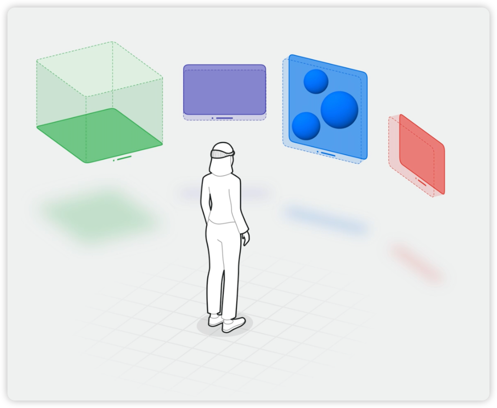 | 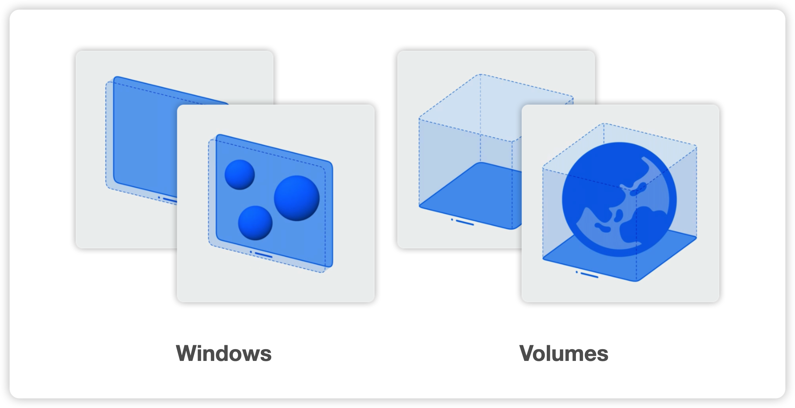 |
| ------------------------------------------------------------ | ------------------------------------------------------- |

> 符合 `WindowStyle` 协议的样式，包括只服务于 macOS 的 [`hiddentitlebar`](https://developer.apple.com/documentation/swiftui/windowstyle/hiddentitlebar)、[`titleBar`](https://developer.apple.com/documentation/swiftui/windowstyle/titlebar)，服务于 macOS 和 visionOS 的  [`automatic`](https://developer.apple.com/documentation/swiftui/windowstyle/automatic)、以及只服务于 visionOS [`plain`](https://developer.apple.com/documentation/swiftui/windowstyle/plain)、[`volumetric`](https://developer.apple.com/documentation/swiftui/windowstyle/volumetric)。`automatic` 和 `plain` 即我们上文提到的 Window，但 `automatic` 作为普通 Window，与 `plain` 的差异在于是否在 visionOS 中展示玻璃背景效果。

但 Volume 并不是“只能达到”的体验，我们还可以更充分的利用 visionOS 提供的无限空间，创造身临其境的体验。比如说我们想把物体放在 Window 之外、用户周围—— **Space** 是另一种在 visionOS 上呈现用户界面的容器，可以为用户创建身临其境的体验。

| 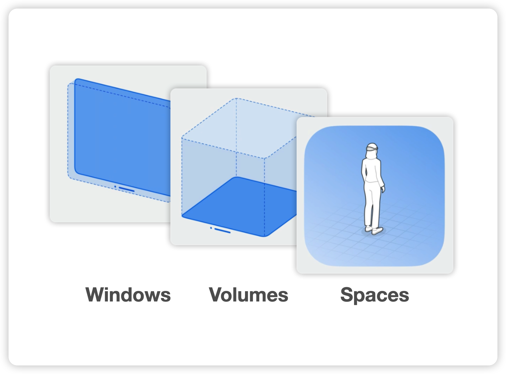 | 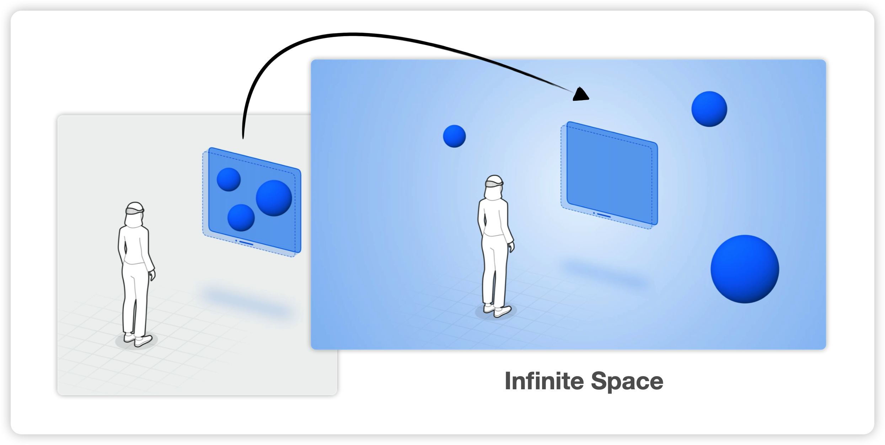 |
| ------------------------------------------------------------ | ---------------------------------------- |

通过 Space，Apple 将 AR 提升到一个全新的水平 —— **沉浸式体验(Immersive experience)**。应用程序会在用户周围显示窗口、三维内容等。开发者可以将虚拟对象或效果等锚定到物体表面，从而增强和丰富现实世界。同时，用户所处的现实环境也会作为用户体验的一部分，对用户仍然可见。

更进一步的是**完全沉浸式体验(Fully immersive experience)**，应用程序可以完全控制用户所看到的内容，覆盖整个空间，这将解锁所有的可能！

| 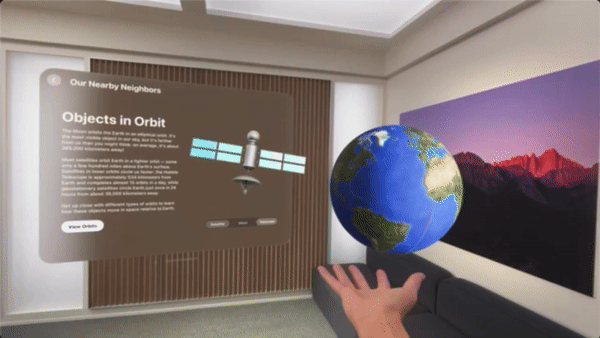 |  |
| :-----------------------------------------------: | :---------------------------------------------------------: |
|         沉浸式体验(Immersive experience)          |         完全沉浸式体验((Fully immersive experience)         |

我们将围绕沉浸式体验的核心—— SwiftUI 的 `ImmersiveSpace` 展开。

## 初识 Space

我们以太空探索主题的 World 应用程序为例，增加一个探索太空的 Space。Space 是 SwiftUI 中的一种新的 Scene Type，称为 **`ImmersiveSpace`**。我们可以在应用程序中定义一个 `ImmersiveSpace`：

```swift
@main
struct WorldApp: App {
    var body: some Scene {
        ImmersiveSpace {
            SolarSystem()
        }
    }
}
```

与其他 Scene 类型类似，我们需要将视图层次结构放置在 Scene 的 `body` 中。整个应用程序可以只包含 Space，也可以通过在已有的 Window 或 Volume 旁边添加一个或多个 Space 从而扩展现有的应用程序。但需要注意，在打开另一个 Space 之前，需要关闭当前 Space，即一个应用程序同时只可以打开一个 Space。

通过将 `SolarSystem()` 放置在 `ImmersiveSpace` 中，视图将在没有任何裁剪边界的情况下被渲染。仅通过以上几行，我们就将我们的 `SolarSystem` 带入了丰富的沉浸式体验中：


当多个应用程序并排运行时，它们都显示在同一个 Space 中，我们称之为**共享空间(Shared Space)**。打开一个应用程序的 Space 会导致一些特殊行为，使这个 Scene 从其他 Scene 类型中脱颖而出。一旦应用程序显示 `ImmersiveSpace` Scene，应用程序就会进入**全空间(Full Space)**。被选择的应用程序将成为用户唯一可见的应用程序，所有其他应用程序都将消失，来为 Space 腾出空间。一旦用户关闭该 Space，其他应用程序将重新出现。

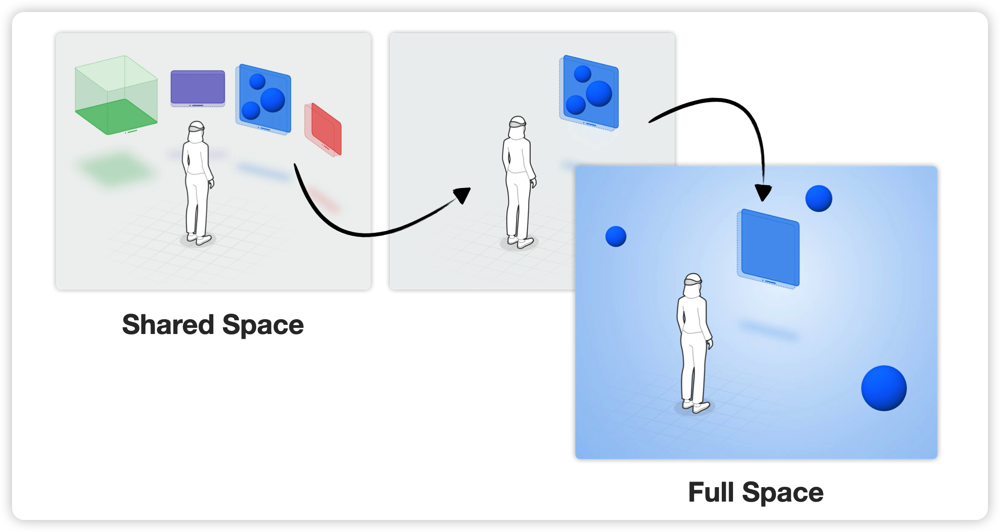

此外，由于 `ImmersiveSpace` 是一个 Scene，因此有自己的坐标系。放置在 Space 中的所有内容都相对于 Space 的原点。而一个 Space 的原点在用户正下方，在用户第一次打开 Space 时靠近自己双脚中心的位置：

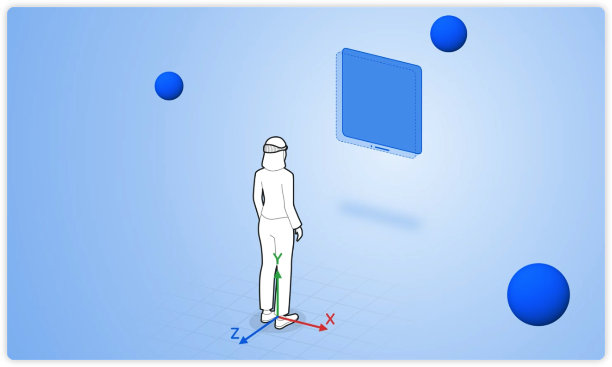

## 在 Space 中展示内容

### 使用 RealityView

`ImmersiveSpace` 作为一种 Scene 类型，也可以将视图层次结构放在其中：

```swift
// View hierarchies and layout
ImmersiveSpace {
    VStack {
        Text("Hello, WWDC")
            .foregroundStyle(.primary)
        Text("Welcome to a new dimension")
            .foregroundStyle(.secondary)
    }
}
```

`ImmersiveSpace` 可以展示任何 SwiftUI 视图，放置在 Space 中的任何内容都使用我们熟悉的 SwiftUI 布局系统。但由于 Space 的原点位于用户的正下方，我们可能不想只是将内容放在那里 ——让我们谈谈 `RealityView`。

如果我们想充分利用 SwiftUI、ARKit 和 RealityKit，Apple 鼓励我们将 `ImmersiveSpace` 与新的具有强大功能的 `RealityView` 结合使用。两者结合在一起以提供我们需要的功能，从而构建出色的沉浸式体验。例如，`RealityView` 内置了对资源异步加载的支持：

```swift
ImmersiveSpace {
    RealityView { content in
        let starfield = await loadStarfield()
        content.add(starfield)
    }
}
```

`RealityView` 使用 RealityKit 来显示其内容，因此需要注意，`RealityView`  与 SwiftUI 的坐标空间有些差异。在 SwiftUI 中，y 轴指向下方，z 轴指向屏幕。这适用于 Window、Volume 和 Space，而在 RealityKit 中，y 轴指向上方：

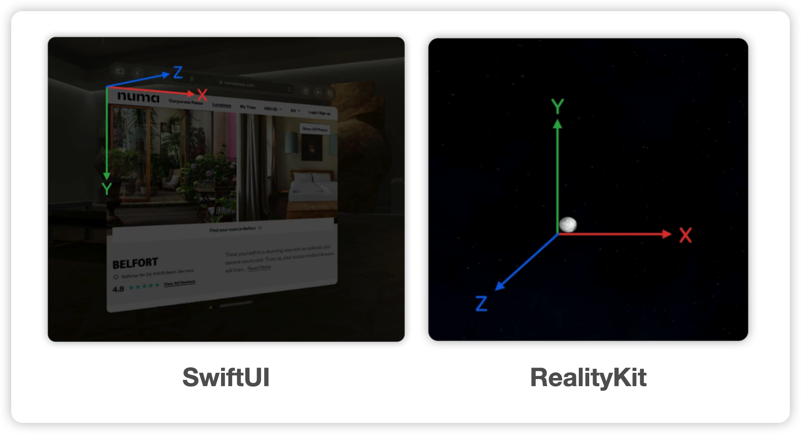

除了异步加载，将 `RealityView` 放置在 `ImmersiveSpace` Scene 中还可以实现更多不一样的功能。例如我们可以将元素放置在 `RealityView`  上。或者在 Space 开启时，我们可以使用用户的手部和头部姿势数据，在 `RealityView` 中定位 Entity。关于 `RealityView` 的更多内容，可以从 WWDC 23  [Enhance your spatial computing app with RealityKit](https://developer.apple.com/videos/play/wwdc2023/10081/) Session 中了解。

### 使用 open(dismiss)ImmersiveSpace

我们为  World 应用程序新增一些元素。我们首先定义一个 `ImmersiveSpace`。与 `WindowGroup` 类似，我们可以为其分配 Identifier 或 Value Type。稍后我们将使用此 identifier 来打开 Space：

```swift
@main
struct WorldApp: App {
    var body: some Scene {
        ImmersiveSpace(id: "solar") {
            SolarSystem()
        }
    }
}
```

我们还使用 `WindowGroup` 为我们的应用程序定义一个简单的 Window，在应用程序启动时显示该 Window，并带有一个控按钮以打开 Space 查看 SolarSystem：

```swift
struct LaunchWindow: Scene {
    var body: some Scene {
        WindowGroup {
            VStack {
                Text("The Solar System")
                    .font(.largeTitle)
                Text("Every 365.25 days, the planet and its satellites [...]")
                SpaceControl()
            }
        }
    }
}
```

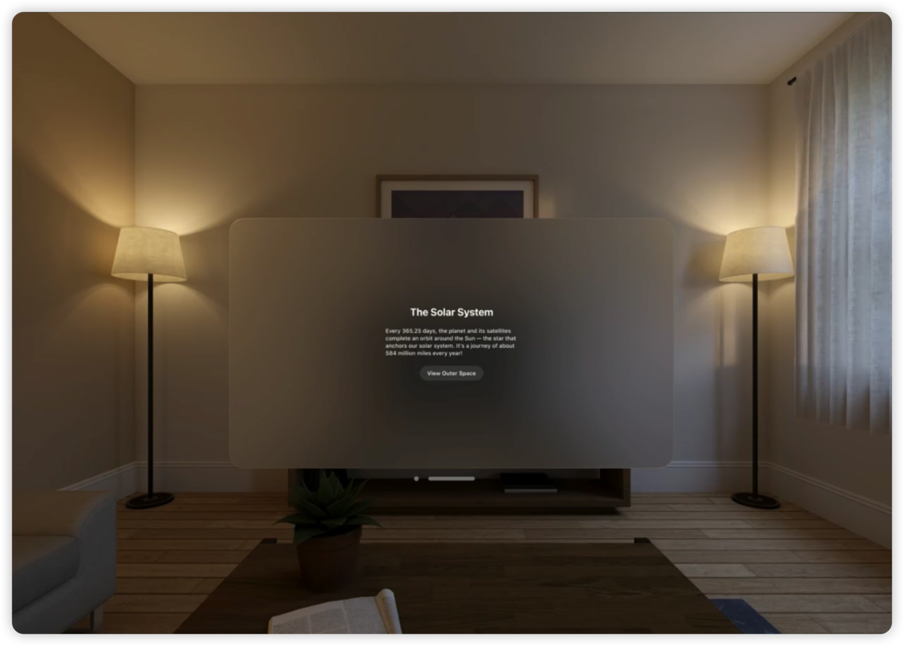

单击该按钮时，我们将改按钮标题并打开 Space。此前，SwiftUI 为了控制 Window，提供了 `openWindow` 和 `dismissWindow` 的 Environment Action。对于 `ImmersiveSpace`，SwiftUI 添加了新的 [`openImmersiveSpace`](https://developer.apple.com/documentation/swiftui/environmentvalues/openimmersivespace) 和 [`dismissImmersiveSpace`](https://developer.apple.com/documentation/swiftui/dismissimmersivespaceaction) Action。

顾名思义，`openImmersiveSpace` 是呈现 Space 的 Action，`dismissImmersiveSpace` 是消除 Space 的 Action。我们可以在按钮响应时使用这些 Action：

```swift
struct SpaceControl: View {
    @Environment(\.openImmersiveSpace) private var openImmersiveSpace
    @Environment(\.dismissImmersiveSpace) private var dismissImmersiveSpace
    // ...
}
```

打开 Space 的时候，我们需要传入之前定义的 Identifier。由于一次只能打开一个 Space，因此 `dismissImmersiveSpace` 操作不需要任何参数。

系统会以一定的持续时间动画来展现 Space 进出。这些 Action 是异步的，这样我们就可以对动画的完成做出响应。打开 Space 可能会失败，`openImmersiveSpace` 会通过它的结果告诉我们调用的结果，以确保有正确的错误处理：

```swift
struct SpaceControl: View {
    // ...
    @State private var isSpaceHidden: Bool = true
    var body: some View {
        Button(isSpaceHidden ? "View Outer Space" : "Exit the solar system") {
            Task {
                if isSpaceHidden {
                    let result = await openImmersiveSpace(id: "solar")
                    switch result {
                        // Handle result
                    }
                } else {
                    await dismissImmersiveSpace()
                    isSpaceHidden = true
                }
            }
        }
    }
}
```

回到应用程序入口，我们现在可以在这里添加 `LaunchWindow`。这里需要注意两个 Scene 的顺序。`LaunchWindow` 是我们 Scene 列表中的第一个，因此 SwiftUI 将在应用程序启动时显示 `LaunchWindow`。Space 在应用程序启动时不可见，只会在用户单击按钮后显示：

```swift
@main
struct WorldApp: App {
    var body: some Scene {
        LaunchWindow()
        ImmersiveSpace(id: "solar") {
            SolarSystem()
        }
    }
}
```

当我们在模拟器上运行应用程序时，我们会看到 `LaunchWindow`。然后只要点击“View Outer Space”按钮，`SolarSystem` 就会出现在我们的眼前：


我们可以回顾下文章最初提到的概念，如果此时有多个应用程序并排运行时，在点击按钮时，我们的 Space 将在其中脱颖而出。其他应用程序将暂时消失。

### 使用 Model3D

现在我们已经定义了一个多场景应用程序，其中包含一个标准的 Window 和一个 Space。我们已经看到 World 应用程序中使用了地球模型。在构建沉浸式体验的应用程序时，我们肯定会希望在 Space 中显示一些具有大量细节的 3D 资源。需要注意的是，这些资源可能需要一些时间才能完全加载和呈现。

如果我们想在 SwiftUI 应用程序中嵌入 USD 文件或 Reality 文件的 3D 模型，为获得最佳用户体验，可以利用新 [`Model3D`](https://developer.apple.com/documentation/realitykit/model3d/)  API，这是一个新的 View 视图，用于异步加载 3D 资源：

```swift
Model3D(named: "Earth") { phase in
    switch phase {
        case .empty:
            Text( "Waiting" )
        case .failure(let error):
            Text("Error \(error.localizedDescription)")
        case .success(let model):
            model.resizable()
    }
}
```

在此代码中，资源的加载被划分了不同的阶段，在模型仍在加载时或出现问题时显示提示。

此外，我们可以使用标准的 ViewModifier 来调整模型的大小。 例如，使用 [`resizable(_:)`](https://developer.apple.com/documentation/realitykit/resolvedmodel3d/resizable(_:)) 方法缩放模型，适应当前视图的大小。使用 [`aspectRatio(_:contentMode:)`](https://developer.apple.com/documentation/SwiftUI/View/aspectRatio(_:contentMode:)-771ow) 方法调整大小，保持模型的原始纵横比：

```swift
 Model3D(named: "Robot-Drummer") { model in
     model
         .resizable()
         .aspectRatio(contentMode: .fit)
 } placeholder: {
     ProgressView()
 }
```

如果我们希望从指定的 URL 加载模型：

```swift
 Model3D(url: URL(string: "https://example.com/robot.usdz")!)
     .frame(width: 300, height: 600)
```

在模型加载之前，`Model3D` 会显示一个填充可用空间的标准占位符，即我们在上文图片中看到的、地球在加载时展示的“空白地球”。加载成功完成后，视图将更新以显示模型。此外，我们也可以指定自定义占位符：

```swift
 let url = URL(string: "https://example.com/robot.usdz")!
 Model3D(url: url) { model in
     model.resizable()
 } placeholder: {
     ProgressView()
 }
 .frame(width: 50, height: 50)
```

## 管理 Space

将沉浸式的体验带入我们的应用程序还离不开开发者与系统的管理，包括处理 [`scenePhase`](https://developer.apple.com/documentation/swiftui/scenephase)、使用 `GeometryReader3D` 进行 Scene 间协调、使用 `ImmersionStyle` 呈现不同样式。

### 使用 scenePhase

与其他 SwiftUI 的 Scene 类型类似，Space 也支持相同的 `scenePhase`。通过打开 Space，它将转变到 [`active`](https://developer.apple.com/documentation/swiftui/scenephase/active)。并且在任何时间点，其都可能变更为 [`inactive`](https://developer.apple.com/documentation/swiftui/scenephase/inactive)。

例如用户走出系统定义的边界或系统 Alert 显示 `scenePhase` 将变成为 `inactive`。一旦用户重新进入， Space 和 Window 将再次变得可见，更新 `scenePhase` 以再次激活。此外，用户还可以随时使用硬件或软件方式关闭 Space。

对于 World 应用程序，我们可以快速添加几行代码来处理 `inactive`，将地球模型缩小一半，以表明 Space 的 `scenePhase` 已发生变化。我们还要确保处理 `active` 以正确恢复内容：

```swift
@main
struct WorldApp: App {
    @EnvironmentObject private var model: ViewModel
    @Environment(\.scenePhase) private var scenePhase
    ImmersiveSpace(id: "solar") {
        SolarSystem()
            .onChange(of: scenePhase) {
                switch scenePhase {
                case .inactive, .background:
                    model.solarEarth.scale = 0.5
                case .active:
                    model.solarEarth.scale = 1
                }
            }
    }
}
```

由于上述示例代码，在出现 Alert 时，内容的比例发生了变化。当我们移除 Alert 时，Space 将恢复。SwiftUI 使处理这些过渡变得非常简单和方便：

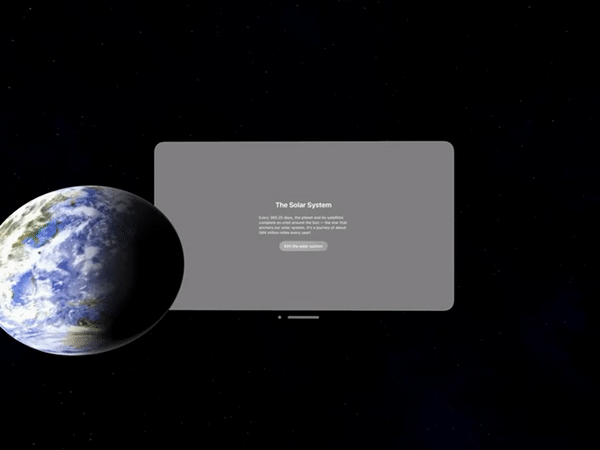

### 使用 GeometryReader3D

管理 Space 的另一种方式是将来自其他 Window 的内容与 Space 集成。例如，如果我们想将地球模型定位在 Window 旁边，我们需要知道 Window 在 Space 中的位置。为了解决这个问题，SwiftUI 提供了一个新坐标空间，代表了 Space 的坐标系。为了访问这个坐标系，Apple 将 `GeometryReader` 封装到 3D 上下文中。然后通过使用现有的 API，如 `transform(in:)`，传入 `.immersiveSpace` 类型，我们就可以得到新坐标系下的坐标：

```swift
var body: some View {
    GeometryReader3D { proxy in
        ZStack {
            Earth(/*...*/)
            .onTapGesture {
                model.solarEarth.position = proxy.transform(in: .immersiveSpace).center
            }
        }
    }
}
```

使用上述代码，我们可以轻松地将内容精确定位到想要的位置上。重新打开 Space，当地球被点击时，它会被定位到我们预期的位置：

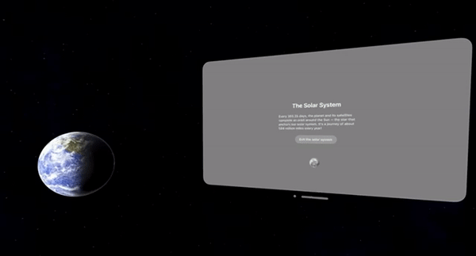

在 SharePlay 的场景下，我们可以管理内容在 Private Space 和 Group Space 中的位置。如果我们的应用程序支持 SharePlay 和 Group Space，当其他参与者加入时，系统可能会将 Space 的原点移动到 Space 模板定义的共享位置原点。有关详细信息，可以查看 WWDC 23 [Build spatial SharePlay experiences](https://developer.apple.com/videos/play/wwdc2023/10087/) Session。

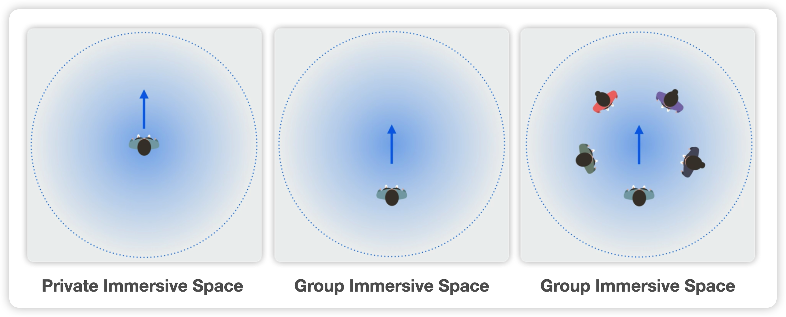

### 使用 ImmersionStyle

`ImmersionStyle` 以不同的方式呈现 Space 内容。我们可以将内容以**混合样式 Mixed**、**渐进样式 Progressive** 或**完整样式 Full** 呈现。同时，`ImmersionStyle` 是动态可改的：

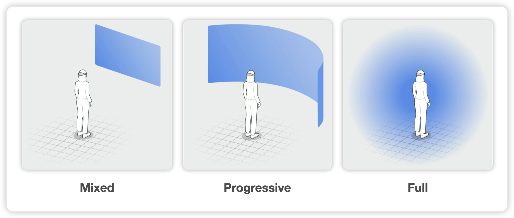

让我们利用所有这些样式更新应用程序。。首先，添加一个新的 `ImmersionStyle` 状态变量，分配 `.mixed` 默认值，应用程序的 Space 默认以 `mixed` 呈现内容。使用 `immersionStyle(selection:in:)`  的 SceneModifier 定义我们希望应用程序支持的 Space `ImmersionStyle`列表：

```swift
@main
struct WorldApp: App {
   @State private var currentStyle: ImmersionStyle = .mixed
   var body: some Scene {
        ImmersiveSpace(id: "solar") {
            SolarSystem()
        }
       .immersionStyle(selection:$currentStyle, in: .mixed, .progressive, .full)
   }
}
```

我们可以将 `currentStyle` 传递给 `SolarSystem`，或者直接控制 `currentStyle` 转换为任何样式。在这里，我们将放大手势 `MagnifyGesture` 添加到 `SolarSystem`，在手势被触发时更新不同的样式：

```swift
@main
struct WorldApp: App {
   @State private var currentStyle: ImmersionStyle = .mixed
   var body: some Scene {
        ImmersiveSpace(id: "solar") {
            SolarSystem()
                .simultaneousGesture(MagnifyGesture()
                    .onChanged { value in
                        let scale = value.magnification
                        if scale > 5 {
                            currentStyle = .progressive
                        } else if scale > 10 {
                            currentStyle = .full
                        } else {
                            currentStyle = .mixed
                        }
                    }
                )
        }
        .immersionStyle(selection:$currentStyle, in: .mixed, .progressive, .full)
   }
}
```

运行应用程序，以默认的 `.mixed`样式打开 Space：


这种样式很棒，但用户可能希望更加沉浸在内容中，也许还能看到一些星空。继续执行放大手势，随着内容越来越大，Space 最终会过渡到 `progressive` 样式。`progressive` 是沉浸式体验和完全沉浸式体验之间的桥梁，它允许我们在用户面前的呈现沉浸式体验内容以及用户现实的周围环境。让用户身临其境的同时，也能让用户意识到周围的事物。用户可以与附近的人聊天、知道坐在哪里更舒服，甚至可以与周围环境互动等。

一旦用户通过转动数码表冠，将会增加 Space 的沉浸感。现在用户像银河系中的宇航员一样漂浮在宇宙。如果用户想再次看看周围的环境，只需将数码表冠转回即可。这使用户可以快速轻松地控制内容在 Space 中的沉浸感。

| 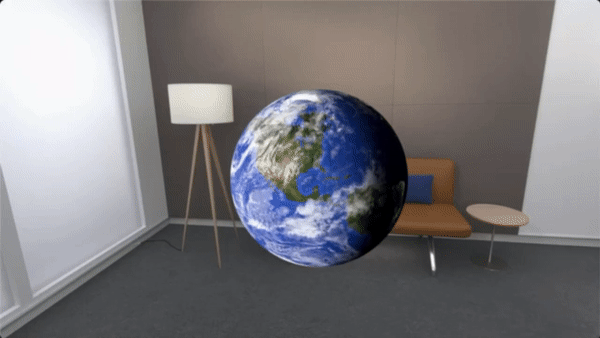 | 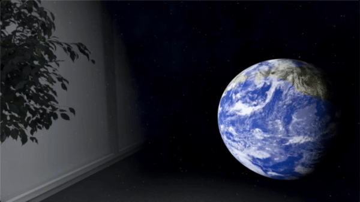 |
| :----------------------------------------------------------: | :---------------------------------------------------------: |
|            从 `.mixed` 样式到 `.progressive` 样式            |            从 `.progressive` 样式到 `.full` 样式            |

到目前为止，我们已经了解到根据手势转换到不同样式是多么容易。使用 SwiftUI，只需几行代码 Space 已经是完全身临其境的体验。

## 自定义功能

我们刚刚展示了通过响应 `scenePhase` 变化和控制 `ImmersionStyle` 来管理 Space 的不同方法。现在让我们添加一些增强功能，将 Space 的体验提升到一个新的水平。设备上的空间计算功能可以轻松增强我们的 Space，使其更加精彩。我们接着来看直接启动 Space、为周围环境添加效果和展示虚拟的手。

### 初始的 ImmersionStyle

到目前为止，我们的应用程序允许我们通过单击按钮打开 Space。如果我们想在应用程序启动时立即启动 Space 该怎么办？为了直接进入 Space，我们需要为应用程序的 Info.plist 配置 Scene Configuration：

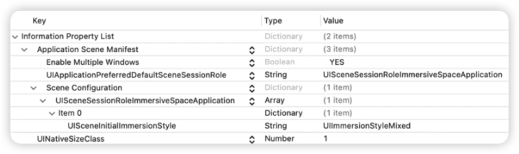

只需设置  `UISceneSessionRoleImmersiveSpaceApplication` 的 `UISceneInitialImmersionStyle` 为期望的 `ImmersionStyle` 即可。包括 `UIImmersionStyleMixed`、`UIImmersionStyleFull`、`UIImmersionStyleProgressive`。但从开发者角度看，当前使用 Info.plist 作为配置，这个单一不可选的实现方式导致灵活性也受到了一些限制。

`preferredSurroundingsEffect` 允许我们调整背景明暗，使 Space 内容更加清晰。当 Space 的 `ImmersionStyle` 切换为 `Progressive` 时，我们设置了 `preferredSurroundingEffects` 为 `.systemDark`，所以当 `SolarSystem` 出现时，用户的周围会自动变暗。

```swift
@main
struct WorldApp: App {
  // ...
    var body: some Scene {
        ImmersiveSpace(id: "solar") {
            SolarSystem()
                .preferredSurroundingsEffect( .systemDark)
        }
     }
}
```

| 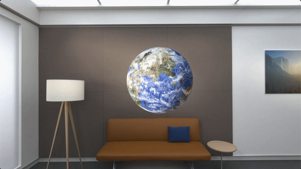 | 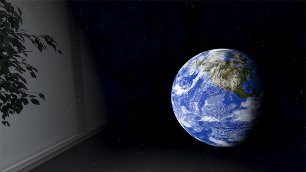 |
| :-------------------------------------------: | :----------------------------------------------------------: |
|               以 `.mixed` 启动                |                     将用户的周围环境变暗                     |

### 展示虚拟的手

`upperLimbVisibility`  Modifier 允许我们在`ImmersionStyle` 为  `fully`  时，隐藏用户的手：

```swift
@main
struct WorldApp: App {
    // ...
    var body: some Scene {
        ImmersiveSpace(id: "solar") {
            SolarSystem()
        }
        .upperLimbVisibility(.hidden)
    }
}
```

回到 World 应用程序，将 `upperLimbVisibility` 设置为 `.hidden`。这意味着我们可以为用户展示虚拟的手——太空手套。

我们从创建一个名为 `SpaceGloves` 的新视图开始。添加一个 `RealityView` 来渲染手套。然后在 `RealityView` 中创建一个 `root` Entity 来添加其他 Entity，这样它们都可以被渲染：

```swift
struct SpaceGloves: View {
    var body: some View {
        RealityView { content in
            let root = Entity()
            content.add(root)
        }
    }
}
```

然后我们将资源加载到 Entity 上并将其添加为 `root` 的子项：

```swift
struct SpaceGloves: View {
    var body: some View {
        RealityView { content in
            let root = Entity()
            content.add(root)
            let leftGlove = try! Entity.loadModel(named: "LefttGlove")
            root.addChild(leftGlove)
            let rightGlove = try! Entity.loadModel(named: "RightGlove")
            root.addChild(rightGlove)
        }
    }
}
```

要正确放置 Entity，我们需要使用 ARKit 及其手部跟踪 API，我们还需要启动手部跟踪系统：

```swift
struct SpaceGloves: View {
    let arSession = ARKitSession()
    let handTracking = HandTrackingProvider()
    var body: some View {
        RealityView { content in
            // ...
        }
    }
}
```

未了确保资源正确地锚定在用户手中，需要检查手部跟踪锚更新：

```swift
struct SpaceGloves: View {
    let arSession = ARKitSession()
    let handTracking = HandTrackingProvider()
    var body: some View {
        RealityView { content in
            // Add root and childs
            // ...
            do {
                try await arSession.run([handTracking])
            } catch let error {
                print("Encountered an unexpected error: \(error.localizedDescription)")
            }
        }
    }
}
```

接下来，检查[手征性(Chirality，物理学中的概念)](https://zh.wikipedia.org/wiki/%E6%89%8B%E5%BE%B5%E6%80%A7)，确保虚拟的手的 `transform` 与锚点相同，在这个例子中，还需确资源具有与 ARKit 提供的相同的 `jointName`。这样，我们就可以正确映射锚骨架关节名称，手套 Entity 将自动锚定用户的手：

```swift
struct SpaceGloves: View {
    let arSession = ARKitSession()
    let handTracking = HandTrackingProvider()
    var body: some View {
        RealityView { content in
            // Add root and childs
            // ...
            // Await arSession run
            // ...
            for await anchorUpdate in handTracking.anchorUpdates {
                let anchor = anchorUpdate.anchor
                switch anchor.chirality {
                    case .left:
                        if let leftGlove = Entity.leftHand {
                            leftGlove.transform = Transform(matrix: anchor.transform)
                            for (index, jointName) in 
                                anchor.skeleton.definition.jointNames.enumerated() {
                                leftGlove.jointTransforms[index].rotation = 
                                simd_quatf(anchor.skeleton.joint(named: jointName).localTransform)
                            }
                        }
                    case .right:
                    // ..
                }
            }
        }
    }
}
```

在上述代码中，`.right` 与 `.left` 同理。回到定义 Space 的位置，添加 `SpaceGloves` 视图。这就是我们所需要的虚拟手：

```swift
@main
struct WorldApp: App {
    @State private var currentStyle: ImmersionStyle = .full
    var body: some Scene {
        ImmersiveSpace(id: "solar") {
            SolarSystem()
            SpaceGloves()
        }
        .immersionStyle(selection: $currentStyle, in: .full)
        .upperLimbVisibility(.hidden)
    }
}
```

有关更多 ARKit 定制和深入的详细信息，可以查看 WWDC 23 [volve your ARKit app for spatial experiences](https://developer.apple.com/videos/play/wwdc2023/10091/) Session。

当用户从到 `.full` 的 `ImmersionStyle` 样式时，用户的手将消失，虚拟手套将出现在用户的手所在的位置，这要归功于手部跟踪：


通过将 `RealityView` 与 ARKit 结合使用并启用手部追踪，我们能让用户像虚拟宇航员体验太空，感觉真的很棒！

## 总结

visionOS 作为 Apple 推出的新的空间计算操作系统，通过结合 SwiftUI、ARKit、RealityKit 等技术，为开发者提供了构建具有沉浸式体验的应用程序的能力。通过一些功能强大且易于使用的 API，我们能够轻松创造完全沉浸式体验。期待着大家使用 ImmersiveSpace 让 SwiftUI 跃出屏幕！
