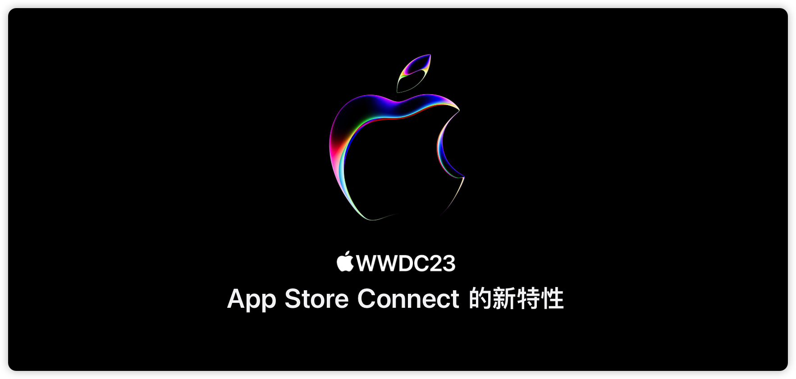

## 个人介绍

> iHTCboy，目前就职于三七互娱集团旗下 37 手游，从事多年游戏 SDK 开发，对 IAP 和 SDK 架构有丰富的实践经验。

## 审核介绍

> SeaHub，目前任职于腾讯 TEG 计费平台部，负责搭建服务于腾讯系业务的支付系统，主导国内 IAP 前后端相关内容，对 IAP 整体设计有一定的经验。
>
> 黄骋志：老司机技术轮值主编，目前就职于字节跳动，参与西瓜视频质量与稳定性工作。对 OOM/Watchdog 较为了解并长期投入。

## 不超过 120 个字的文章简介

> 本文介绍了 App Store Connect 的新特性，包括隐私保护、新增的数据类型、按地区预购、产品页优化和通过 API 实现自动化等方面。其中，仅限内部测试人员访问的 TestFlight 测试更早安全可控；按地区预购可以为现有 App 拓展新的市场；通过 API 实现自动化流程以节省时间。最后建议开发者尽早尝试新功能，优化产品页面，激发用户的兴趣，获取更多用户。

## 公众号/小专栏图文头图

