# WWDC23 10117 - App Store Connect 的新特性

本文基于 [Session 10117](https://developer.apple.com/videos/play/wwdc2023/10117/) 梳理。

## 1、前言

App Store Connect 是苹果提供给开发者用来管理 App 信息、提交审核、查看 App 数据等功能的平台。本次 WDCC23 中苹果对 App Store Connect 做了不少的改进和优化，如 StoreKit for SwiftUI、TestFlight for visionOS、沙盒测试功能、按地区预购等，主要是从 4 个方法归纳总结如下图所示：

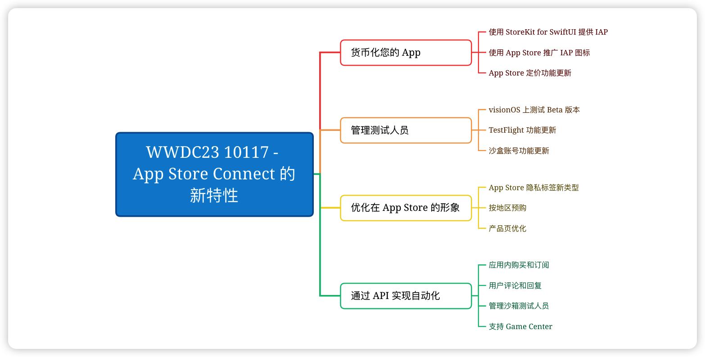

## 2、货币化您的 App

无论您是一个独立开发者还是一家大公司，当您开发 App 时，您都需要考虑是否包含 IAP（应用内购买）功能以及如何设定价格等。今年新推出的功能可以快速帮助您在 App Store 上推广和销售您的 App。

### 2.1 使用 StoreKit for SwiftUI 提供 IAP

大家都知道，StoreKit 的功能繁多，支付流程和逻辑复杂，自己从零开始搭建一个 IAP 支付流程非常不容易。现在，苹果推出 StoreKit for SwiftUI 新功能，它可以让您快速轻松地在应用程序中提供应用内购买和订阅功能。您只需在 App Store Connect 中创建商品，然后在 Xcode 中添加以下几行代码，就可以在 App 中创建购买商品的视图。

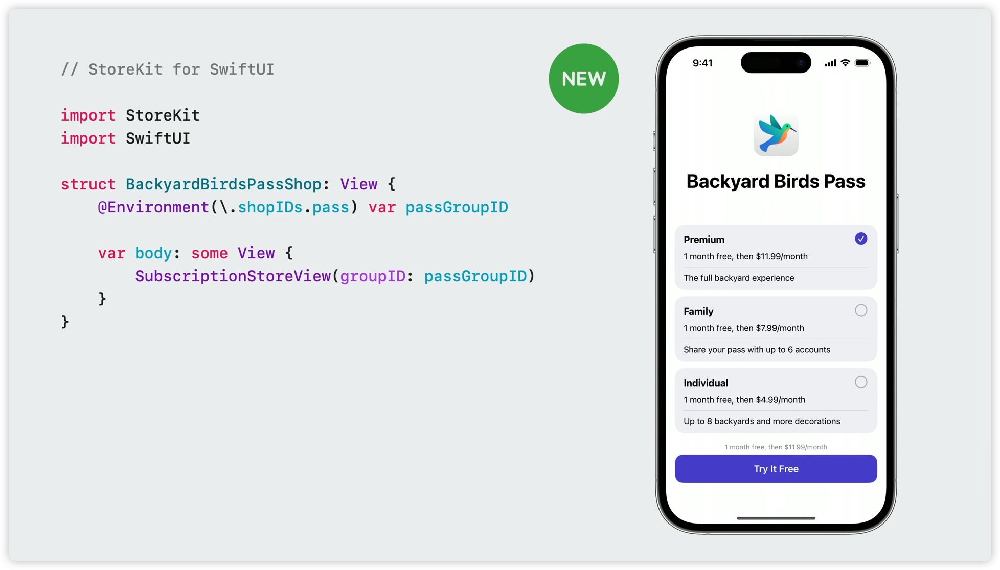

如上图，通过 [SubscriptionStoreView](https://developer.apple.com/documentation/storekit/subscriptionstoreview) API 就能创建一个最简单的商品订阅组的购买视图。当然，苹果提供一些 API 实现自定义背景、按钮和样式等元素，并且这个商品信息会自动显示本地化的语言，以实现与开发者 App 界面设计风格的无缝衔接，如下图就是一个自定义风格的代码示例：

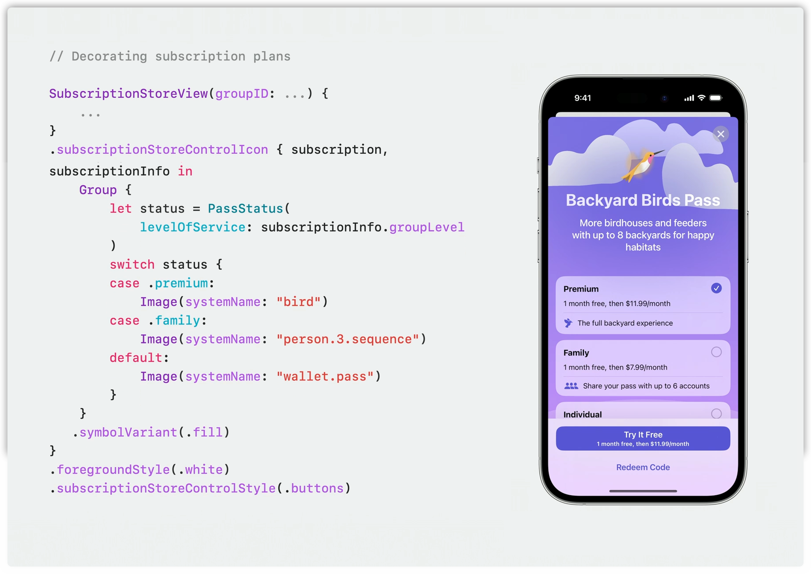

借助 StoreKit 提供的全新 SwiftUI 视图，打造出色的 App 内购买项目和订阅陈列体验变得比以往更加容易。利用三种不同的 StoreKit 视图在各种 Apple 平台上展示你的产品：[StoreView](https://developer.apple.com/documentation/storekit/storeview)、[ProductView](https://developer.apple.com/documentation/storekit/productview) 和 [SubscriptionStoreView](https://developer.apple.com/documentation/storekit/subscriptionstoreview) ，它们可帮助你以比以往更快地将陈列设置完毕并投入使用。只需使用短短一行代码，即可向用户清楚地显示各级服务的描述、价格和时限。

- 借助内建的本地化支持，你能够以不同的语言和货币提供 App 内购买项目。
- 轻松提供遵循了 Apple 设计最佳做法的安全 App 内购买项目体验。
- 自定 StoreKit 视图，以便与你 App 的外观和使用感受完美契合。

### 2.2 使用 App Store 推广 IAP 图标

[App Store 推广 IAP 图标](https://developer.apple.com/cn/app-store/promoting-in-app-purchases/)，让用户能直接在 App Store 上浏览 App 内购买项目，并能在下载 App 之前就开始购买这些项目，从而帮助开发者提升 App 内容的曝光度。开发者可以在自己的 App 产品页上推广最多 20 个 App 内购买项目，其中可包括订阅服务。

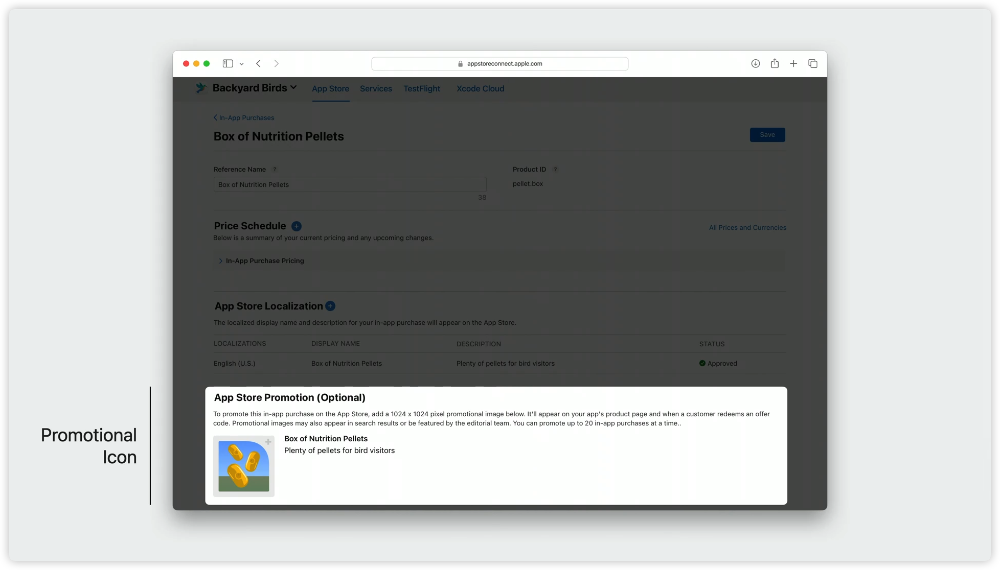

使用 App 内购买项目推广功能之前，开发者需要在 App Store Connect 为准备推广的 App 内购买项目上传宣传图标，并且之前在开发者的 App 内是无法直接读取 App Store Connect 配置的推广图标。

现在，利用 [ProductView](https://developer.apple.com/documentation/storekit/productview) API 就可以创建一个商品视图，通过 `prefersPromotionalIcon` 字段设置为 `true` 就可以使用推广图标。

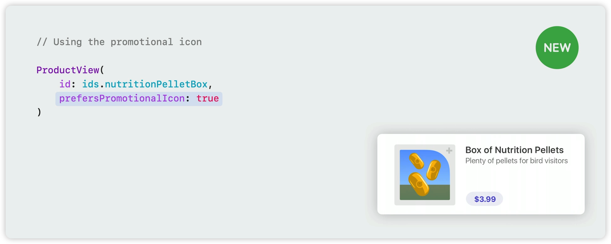

> 如果想要深入了解 StoreKit for SwiftUI 的内容，推荐参考以下内容：
> - [WWDC23 10013 - Meet StoreKit for SwiftUI](https://xiaozhuanlan.com/topic/0579631284)

### 2.3 App Store 定价功能更新

如果您的 App 面向全球市场，那么您将需要考虑如何设定价格以及如何定价。今年 5 月 9 号，苹果升级了 [App Store 定价功能](https://developer.apple.com/cn/news/?id=74739es1)，使管理应用、应用内购买和订阅的价格变得更加容易。

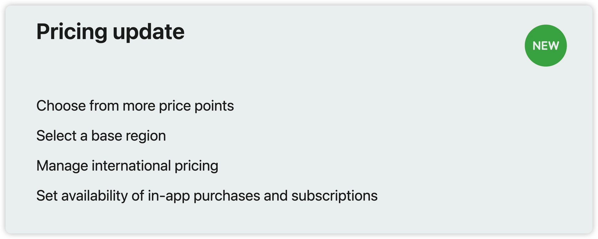

**定价更新**

- 更多价格点：900 个价格点可供选择。
- 选择基准区域：选择一个国家或地区后，苹果会自动生成其他国家或地区的销售价格。
- 管理国际定价：允许 App Store 在汇率或税收变化时调整您的价格，或自行手动管理。
- 设置应用内购买和订阅的可用性：允许按不同国家或地区设置用户是否可以购买。

> 如果想要深入了解 App Store 定价功能更新的内容，推荐参考以下内容：
> - [What’s new in App Store pricing - WWDC23](https://developer.apple.com/videos/play/wwdc2023/10014/)

## 3、管理测试人员

### 3.1 visionOS 上测试 Beta 版本

TestFlight 是苹果旗下的 App 测试平台，能帮助开发者邀请用户对 App 进行测试，方便开发者更好地改进和完善 App。

去年 TestFlight 支持 macOS app 测试，今年苹果推出 visionOS，所以，现在 TestFlight 可以轻松地在 iOS、watchOS、tvOS、macOS 和最新的 visionOS 上测试预发布版本的 App。

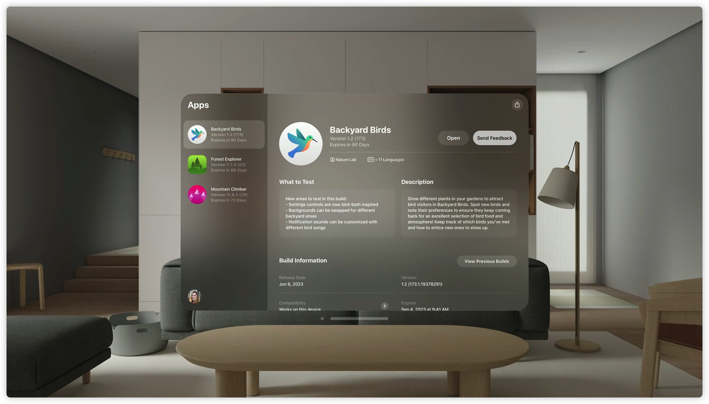

在 visionOS 中的 TestFlight app，如反馈问题的交互操作可能因平台特性而不同，其它功能与其它平台大致相同。

> 如果想要深入了解 TestFlight for visionOS 的内容，推荐参考以下内容：
> - [Explore App Store Connect for spatial computing - WWDC23](https://developer.apple.com/videos/play/wwdc2023/10012/)

### 3.2 TestFlight 功能更新

借助对测试员管理功能所做的更新，充分利用 TestFlight 中的 Beta 版测试流程，这些更新有助于你更好地了解测试员并获取有价值的新详情。

**可获取测试人员的设备型号和操作系统版本**

查看最近安装的设备类型和测试员在测试 App 时使用的 OS。

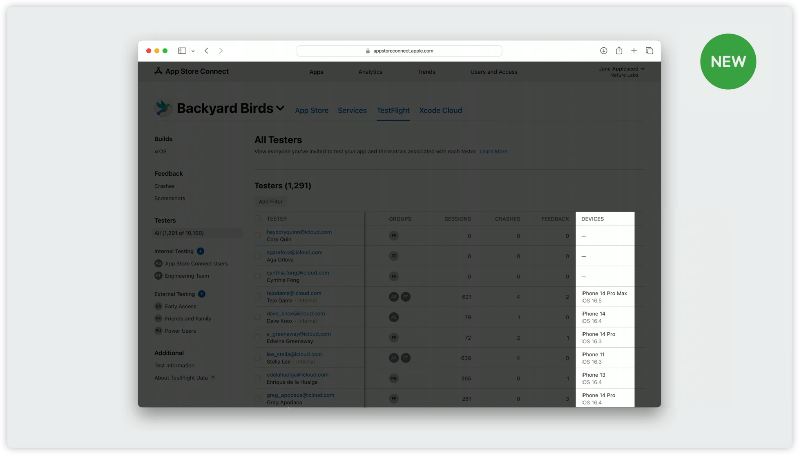

**测试人员批量分组管理**

根据测试员的参与程度 (由 App 使用次数，App 崩溃次数和反馈量指示)，对测试员进行过滤和排序。并且可以同时对多名测试员执行重要操作，如重新发送邀请、添加到组或完全删除测试人员等。当然 App Store Connect API 也支持这些功能。

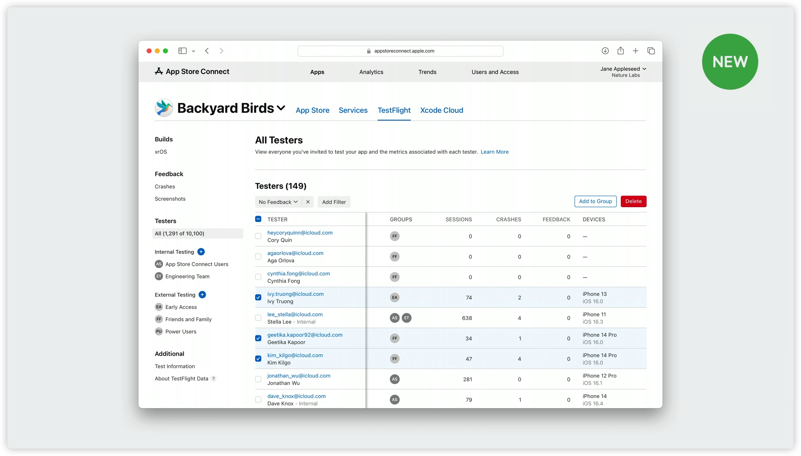

**仅限内部测试人员访问的 Beta 版本**

以往，开发者构建 App 时，同一个版本包体可以用于 TestFlight 测试和 App Store 审核，但是这样，可能会导致管理测试人员和版本时容易出错。比如，你构建了一个临时的分发版本，您可能不想将其分发到内部团队之外。所以，Xcode 15 苹果提供了 `TestFlight Internal Only` 选项，它将确保这个版本无法发布用于外部 TestFlight，也无法提交到 App Store 审核。

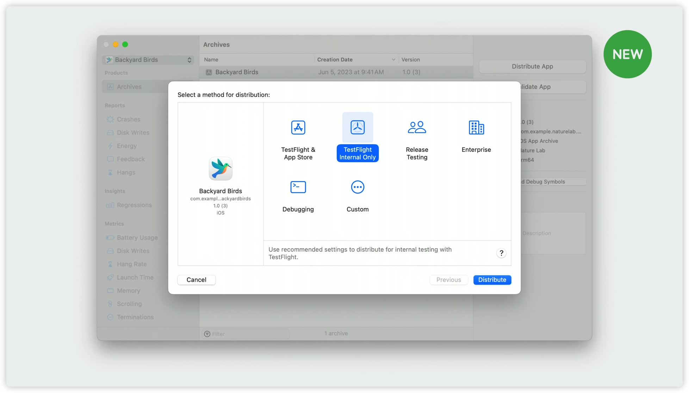

在 App Store Connect 中，这些内部测试版本将被清晰标记为 `Internal`，以便您可以轻松查看哪些版本可以分发到哪里。

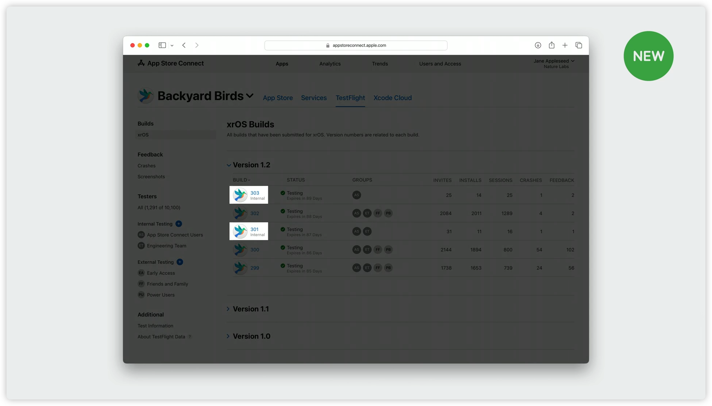

最后，可以利用 Xcode Cloud 在构建时上传 TestFlight 测试内容信息，详细参考文档：[Including notes for testers with a beta release of your app](https://developer.apple.com/documentation/Xcode/including-notes-for-testers-with-a-beta-release-of-your-app) 。

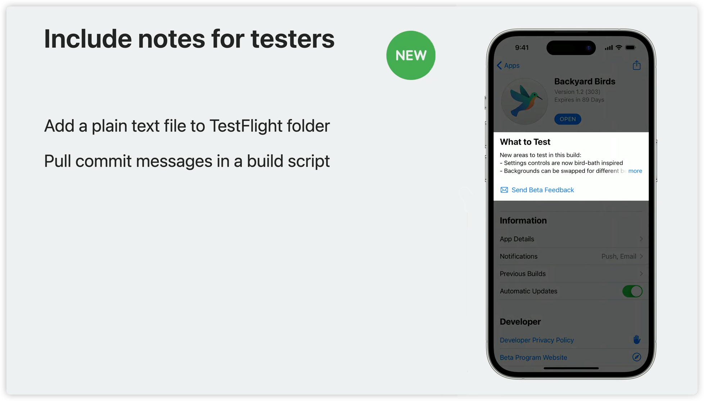

当然，也可以在 App Store Connect 后台填写，或者使用 App Store Connect API 提交测试内容。

> 如果想要深入了解 Xcode 15 for TestFlight 的内容，推荐参考以下内容：
> - [Simplify distribution in Xcode and Xcode Cloud - WWDC23](https://developer.apple.com/videos/play/wwdc2023/10224/)

### 3.3 沙盒账号功能更新

**创建家庭共享的沙盒测试**

> 借助“家人共享”，用户可与另外最多五名家庭成员共享 iCloud+、Apple Music、Apple TV+、Apple Fitness+、Apple News+ 和 Apple Arcade 等 Apple 服务的访问权限。用户的群组还可以共享 iTunes、Apple Books 和 App Store 购买项目。你们甚至可以协助定位彼此丢失的设备。
> - [什么是“家人共享”？ - Apple 支持](https://support.apple.com/zh-cn/HT201060)

借助“家人共享”，主账号可以共享 Apple 订阅项目。现在为了使开发者能够在发布之前测试此功能，苹果添加了将沙箱测试帐户合并到家庭组中的功能。开发者可以在 App Store Connect 中配置这些帐户，一个家庭分组最多可以有六个测试帐户。

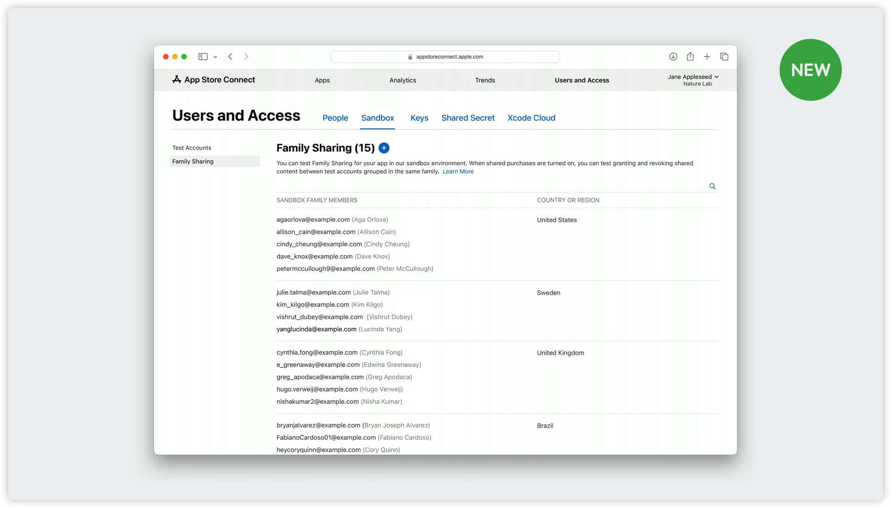

**设备上的沙盒账号**

苹果在 iOS 17 上添加了以下沙盒设备增强功能：

- 查看家庭组成员并选择停止与家庭共享自动续订订阅或非消耗订阅。
- 修改订阅的续订速率。
- 测试中断的购买。
- 清除购买历史记录。

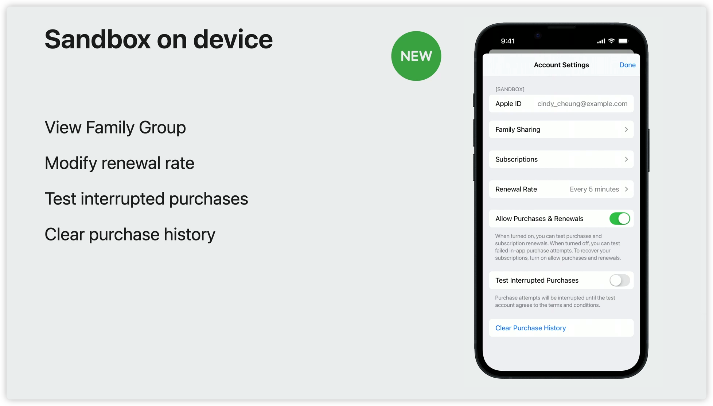

> 如果想要深入了解 StoreKit testing in sandbox 的内容，推荐参考以下内容：
> - [Explore testing in-app purchases - WWDC23](https://developer.apple.com/videos/play/wwdc2023/10142/)

## 4、优化在 App Store 的形象

接着，我们介绍一些构建 App Store 形象的方法。您的 App Store 产品页面是您向用户介绍 App 功能的地方。App Store Connect 可以帮助您配置产品页面、激发用户兴趣、并获取用户等。 

### 4.1 App Store 隐私标签新类型

App Store 可以帮助用户在下载 App 之前更好地了解 App 的隐私保护做法。在每个 App 的产品页上，用户可以了解 App 可能收集的一些数据类型，知道相关信息是否用于跟踪用户，以及是否关联到用户的身份信息或设备，以便用户在下载您的 App 时可以依赖你，并做出明智的决定。

随着 visionOS 的推出，苹果新增了一些新的数据类型。

- 收集用户周围环境的数据，则应选择 `Environment Scanning`（环境扫描）；
- 收集手部结构或动作，则应选择`Hands`（手部）；
- 如果收集头部运动，则应选择 `Head`（头部）。

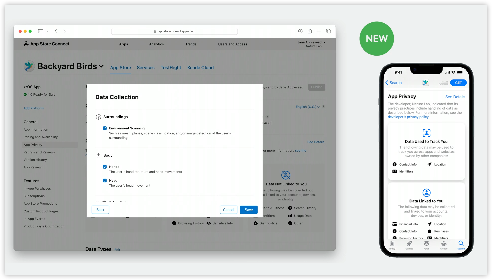

例如，如果您的 App 教用户如何弹钢琴并收集其手部运动的数据以指导他们改进，则您应该选择 “Hands” 数据类型进行数据收集。这些新数据类型与 visionOS 应用程序特别相关，但也可以应用于其他平台。（笔者注：如 iOS app 通过 VisionKit 识别用户手势。）

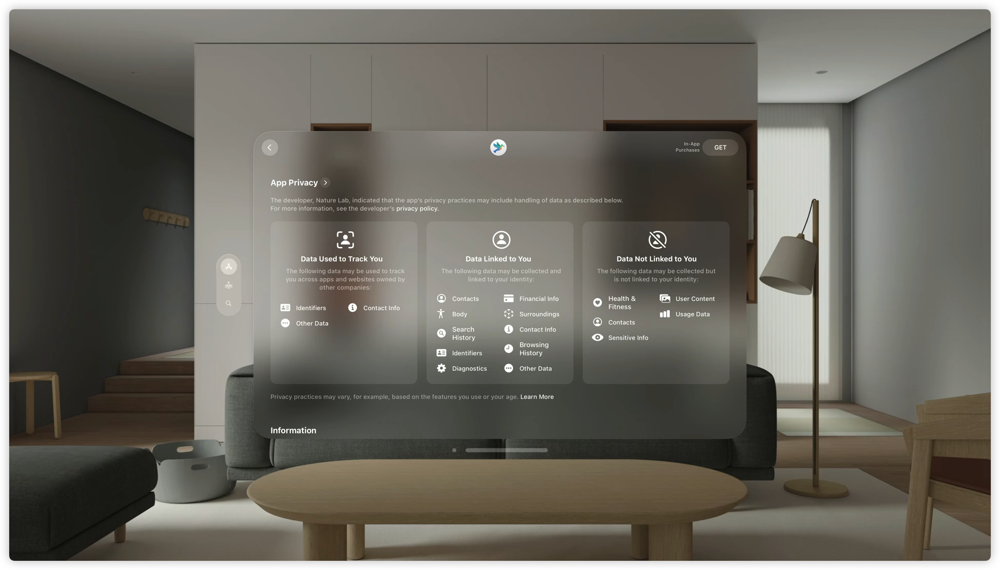

这些新数据类型将展示在 visionOS App Store 以及上架发布的所有其他平台。

### 4.2 按地区预购

以预购的形式提供 App 是在发布之前提高知名度并提升用户期待值的绝佳方式。

今年，开发者可以按地区以预购的形式提供 App。这功能带来了新的灵活性，让你能够在有限的地区内试发布新的 App，同时在其他地区以预购的形式提供 App。你甚至可以为每个地区设置不同的发布日期。如果你想要为现有 App 拓展新的市场，可以在这些新的地区以预购的形式发布 App。

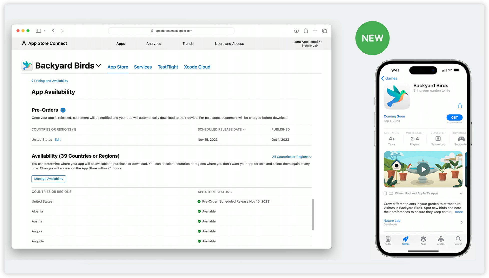

按地区预购，笔者在完成本文时，苹果还没有正式推出。如果在某个地区发布上线，苹果称为 `soft launch`（软启动），然后其它未上架的国家地区，还可以提供预购。但对于已经上架过全球地区的 App，是否还可以重新按地区预购，目前看是不可以。但具体的规则和流程是如何，还需要等上线后测试。

### 4.3 产品页优化

通过[产品页优化](https://developer.apple.com/cn/app-store/product-page-optimization/)，开发者可以测试 App Store 产品页的不同元素，了解哪些元素带来的用户参与度最高。

有了按地区预购的功能后，App 不同地区的版本管理可能变得复杂，同时产品页优化，可能针对不同国家或地区进行测试，但已经上架的地区可以要更新版本，会导致正在测试的版本停止。现在，你可以发布新的 App 版本而不中断正在运行的测试，这让你可以更加灵活地制定 App 发布计划。

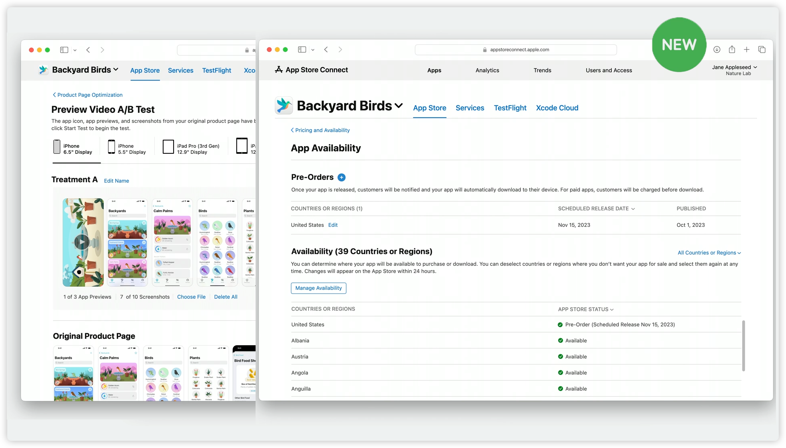

所以，开发者能够查看和监控当前正在测试的产品页，同时根据需要更新您的 App。但请记住，产品页优化的目的是将测试组与对照组进行比较，因此新版本产品页面的任何更改都可能会影响正在运行的测试的结果。

**小结**

- 让您的 App 为 visionOS 做好准备
- 准确提供隐私标签，并改进软件供应链的完整性：第三方 SDK 和隐私清单
- 按地区阶段性提供预购

> 如果想要深入了解 visionOS、privacy 和按地区预购的内容，推荐参考以下内容：
> - [Explore App Store Connect for spatial computing - WWDC23](https://developer.apple.com/videos/play/wwdc2023/10012/)
> - [What’s new in privacy - WWDC23](https://developer.apple.com/videos/play/wwdc2023/10053/)
> - [What’s new in App Store pre-orders - WWDC23](https://developer.apple.com/videos/play/wwdc2023/10015/)

## 5、通过 API 实现自动化

[App Store Connect API](https://developer.apple.com/cn/app-store-connect/api/) 提供了用于自定义工作流程，可以实现与开发者内部系统保持同步，最终通过自动化流程以节省时间。

### 5.1 新增的 API

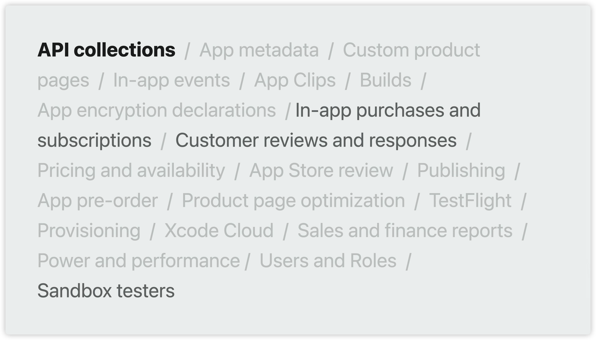

今年，苹果推出了应用内购买和订阅、用户评论和回复以及管理沙箱测试人员的功能的 API。还有很多 API 调整细节，如 [List All Price Points for an In-App Purchase](https://developer.apple.com/documentation/appstoreconnectapi/list_all_price_points_for_an_in-app_purchase) 和 [List All Price Points for a Subscription](https://developer.apple.com/documentation/appstoreconnectapi/list_all_price_points_for_a_subscription) 请求最大数量从 200 提升到 8000。更多更新内容，参考文档：[App Store Connect API 2.4 release notes](https://developer.apple.com/documentation/appstoreconnectapi/app_store_connect_api_release_notes/app_store_connect_api_2_4_release_notes) 。

### 5.2 支持 Game Center

[Game Center](https://developer.apple.com/cn/game-center/) 是 Apple 的社交游戏网络，旨在帮助玩家与朋友一起体验游戏的乐趣。

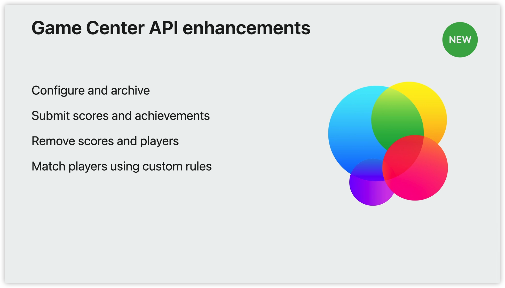

使用增强的 Game Center API，更轻松地设置和管理成就以及排行榜。

- 对你不希望再显示的成就和排行榜进行归档。
- 配置和管理成就以及排行榜元数据，将分数和成就数据直接提交到 Game Center。
- 从排行榜中删除分数和玩家，以自动管理欺诈活动。
- 在多人竞赛中自定你的配对规则。例如，你可以根据技能或地区自动匹配玩家，以获得更好的多人游戏体验。另外的几项增强功能提升了多人竞赛的速度和可靠性。

### 5.3 API 权限

生成 App Store Connect API 密钥，以前只支持创建以下角色的权限：

- 管理
- App 管理
- 开发者
- 财务
- 销售和报告

> 具体角色的权限，可参考文档：[Apple Developer Program 职能](https://developer.apple.com/cn/support/roles/) 。

API 的权限有点大，现在增加 `营销` 和 `客户支持` 权限。比如，客户支持就是只能查看评分与评论和回复顾客评论，权限颗粒度更细，更加安全。另外，还可以创建基于用户的密钥，也就是无论您担任什么角色，这个 API 密钥具有与您相同角色的权限，而不是固定不变的权限。

## 6、总结

**小结**

- 尝试新功能
- 联系我们，获得无限制的全天候（24/7）支持
- 提交反馈

苹果鼓励大家尝试新功能，多学习多使用新特性，并分享您的想法。如果您遇到问题，可以通过 Apple 开发者网站 [联系我们](https://developer.apple.com/contact/)，网站上可通过电话或电子邮件获取无限支持。苹果有 9 种语言服务支持，并且是 24 小时随时联系。

另外，如有以下情况：遇到与 Apple 软件或硬件相关的问题、想要提出 SDK 功能请求、发现 Apple 提供的 API 存在代码级错误和问题，或者注意到开发者文档中有错误或缺漏。开发者使用 “[反馈助理](https://developer.apple.com/cn/bug-reporting/)” App 提交反馈。

> 注：启动和下载 “反馈助理” App 的方法：
> **iPhone 和 iPad**。在 Beta 版 iOS 和 iPadOS 中，主屏幕上会默认显示该 App。在公开发行版 iOS 和 iPadOS 中，该 App 可以通过安装 Beta 版描述文件来启用；或是通过 applefeedback:// URL 方案来启动。
> **Mac**。在所有版本的 macOS 上，都可以在 CoreServices 文件夹中找到该 App，并可以通过 applefeedback:// URL 方案或在“聚焦”中搜索“反馈助理”来启动它。

最后，以上很多的功能，苹果今年晚些时候推出，所以最终的效果以官方同步为准。

App Store Connect 提供了苹果全平台的功能，包含 iOS、iPadOS、watchOS、tvOS、macOS、visionOS 的管理，所以系统相当复杂，同时平台功能又开始趋于统一。功能越来越多，希望开发者尽早尝试新功能，优化产品页面，激发用户的兴趣，获取更多用户！
