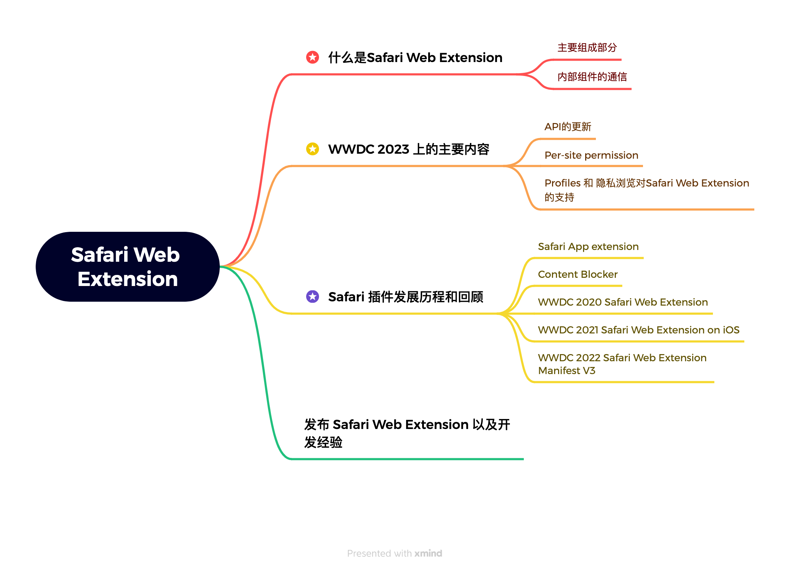
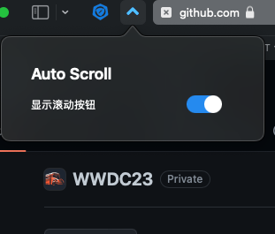
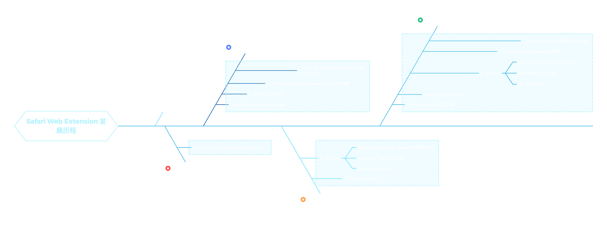
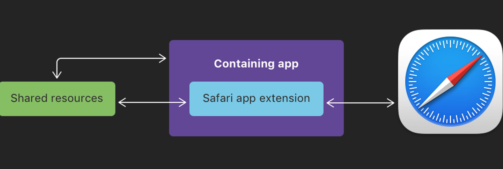
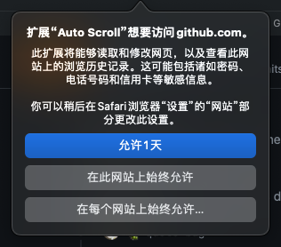
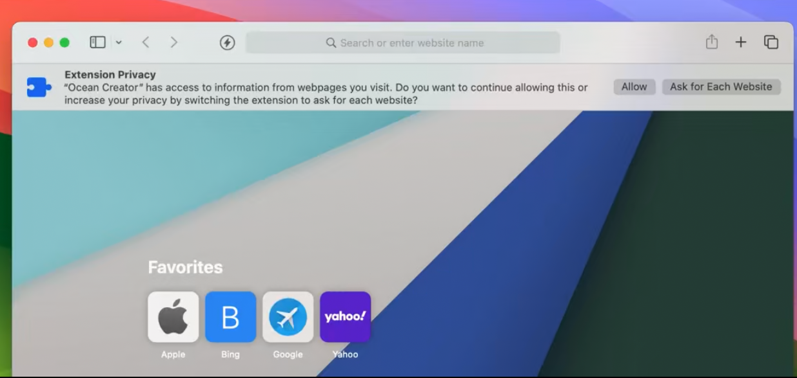

# WWDC23 10119 - 在 Safari 上开发浏览器插件

> 摘要：本文在介绍 WWDC 2023 关于 Safari Web Extension 的同时，也介绍了 Safari Web Extension 从 2020 年开始的更新和发展.

本文基于[Session 10119](https://developer.apple.com/videos/play/wwdc2023/10119/)梳理。

> 作者：
>
> Gareth Ng, 任职于 Trend Micro，开发过 Safari 和 Chrome 上的插件的前 iOS 和 macOS 开发者。 即使工作离开了苹果生态，但是对于苹果生态的热爱依然不减。
>
> 审核：
>
> zhangferry，摸鱼周报编辑，就职于抖音 iOS 基础技术团队，从事研发效能相关工作。



## 前言

在 WWDC 2020 和 WWDC 2021，苹果宣布了支持 Chrome 风格的 Safari Web 插件。开发者现在可以在 macOS 和 iOS 的 Safari 上使用 Chrome 插件。在 WWDC 2022 上，Safari Web 插件又有了新的变化，引入了 Manifest V3，并且支持了 declarative net request。这使得 Safari Web 插件越来越接近 Chrome 插件。本文将介绍 WWDC 2023 Safari Web 插件的新特性，以及 Safari Web 插件的发展历程。最后，我们将介绍 Safari Web Extension 和 Chrome Extension 之间的区别。

本文将实现一个简单的 macOS 上的 Safari Web Extension，这个插件的功能是在网页上添加一个按钮，点击按钮后，可以前往网页的最顶端，暂时命名为 [autoScroll](https://github.com/garethng/autoScroll)。

## 什么是 Safari Web Extension

Safari Web Extension 使用和 Google Chrome、Mozilla Firefox 和 Microsoft Edge 浏览器相同的 JavaScript API，为 Safari 添加自定义功能，基于 JavaScript、HTML 和 CSS 构建 Safari Web Extension，同时还可将其重新打包以在其他浏览器中运行。

要开始创建 Safari Web Extension，有以下两种方式：

- 将现有其他平台的插件转换为 Safari Web Extension，以便在 macOS 和 iOS 的 Safari 中使用，并在 App Store 中分发。Xcode 包含了一个命令行工具，可简化此过程。
- 在 Xcode 中使用内置模板构建新的 Safari Web Extension。

目前在 macOS 上，Safari 14 之后的版本都支持 Safari Web Extension，而在 iOS 上，Safari 15 之后的版本才支持 Safari Web Extension。

在开发 Safari Web Extension 的过程中，完全可以参考[Mozilla 的文档](https://developer.mozilla.org/en-US/docs/Mozilla/Add-ons/WebExtensions) 或者[Google 的文档](https://developer.chrome.com/docs/extensions/)来了解相关 API，虽然可能有一些差异（主要是 Safari Web Extension 支持的 API 更少），但是使用方法基本会保持一致。


### Safari Web Extention 的组成

了解一种类型的 app，最快的方式就是打开 Xcode，迅速创建一个新的项目，从自动生成的文件，就可以很清晰地看出整体的结构。


Safari Web Extension 的目录结构如上图所示，从目录结构可以看出，Safari Web Extension 主要由以下几部分组成：

- 宿主 App
- Extension Native 部分
- Extension 部分

宿主应用（Host App）通常是指常见的应用程序（App），根据苹果公司的要求，每个浏览器插件都必须依附于一个主要的应用程序才能在 App Store 中发布。这一点与 Chrome 的插件有所不同。

Extension Native（扩展原生部分）也是一个独立的组件，它具有自己独立的沙盒环境，并能执行 macOS 和 iOS 的 API。通过 Extension Native，扩展能够直接与原生 API 进行通信，并且还可以通过类似于 App Group 的机制与宿主应用进行信息交互。Extension Native 在这三个组件的通信中充当了一个中介的角色，而 SafariWebExtension.swift 则是其中最主要的部分之一。

通过实现```SafariWebExtensionHandler```这个类的```beginRequest``` 回调，实现上述通信。

```swift

func beginRequest(with context: NSExtensionContext) {
        let item = context.inputItems[0] as! NSExtensionItem
        let message = item.userInfo?[SFExtensionMessageKey]
        os_log(.default, "Received message from browser.runtime.sendNativeMessage: %@", message as! CVarArg)

        let response = NSExtensionItem()
        response.userInfo = [ SFExtensionMessageKey: [ "Response to": message ] ]

        context.completeRequest(returningItems: [response], completionHandler: nil)
}

```

这里的功能是接受来自 Extension 的消息，同时把 message 以 oslog 的形式打印出来，并返回一个 response。

Extension 是整个架构中最重要的部分。它通过 JavaScript 与网页进行交互，实现了改变网页内容、丰富网页功能、自定义网页 UI、修改网页请求内容等功能，这也是用户需要浏览器插件的原因之一。同时，Extension 还可以提供一个可交互的弹出式界面（popup），这是一个独立的网页，也是每个 Safari Web Extension 与用户进行交互的页面。这个弹出式界面通过基础的前端技术（HTML、CSS、JavaScript）来实现。

在上面 Xcode 生成的项目文件架构中可以看到，为 Extension 生成的 JS 文件主要包括三个，```background.js```、```content.js```以及```popup.js```。

其中 background.js 是指在 Safari 运行期间，独立于每一个网页生命周期运行的 JS 代码，这些代码可以使用所有的 Web Extension API，background 在 extension 被 Safari 加载时便立即加载，直到 extension 被卸载或禁用被销毁。

background 的运行方式可以被指定为非持久化，如果这样的话，background 就会使用 on-demand 的形式来加载，在 iOS 上，由于性能和资源的限制，background 只能通过这种方式运行。以非持久化方式运行的 background 的生命周期是通过事件来建立和销毁，也就说可以在其中注册各种事件监听器，当需要对这些事件做出响应时，浏览器就会加载 background， 当事件结束或者通信完成之后，background 进入空闲状态，如果在一定时间内，background 不再接受到消息或者被事件唤起，那么浏览器就会将 background 销毁。这种模式下，即使是全局变量，也会在页面被销毁时被销毁，所以关键的全局变量，需要及时通过 Storage API 写入磁盘。 例如：

```javascript

browser.runtime.onMessage.addListener(function (request, sender, sendResponse) {
  if (request.cmd === "checkStatus") {
    getSettings((item) => {
      sendResponse({
        all: item.all
      })
    })
  } else if (request.cmd === "setStatus") {
    setSettings({
      all: request.all
    })
  }
  return true;
})

function getSettings(successHandler) {
  browser.storage.local.get((item) => {
    successHandler(item)
  })
}

function setSettings(config) {
    browser.storage.local.set(config)
}

```

在 autoscroll 中，用户可以自由选择是否要添加这个前往网页顶端的按钮，所以我把网页的状态保存在本地的 storage 中。每次用户打开网页的时候，就会给 background 发送一个消息，询问当前网页的状态，然后根据返回的状态，决定是否添加按钮。或者当用户设定当前状态的时候，也会给 background 发送一个消息，告诉 background 当前的状态，background 把这个状态保存起来。background 通过 ```browser.runtime.onMessage.addListener``` 来监听这些消息。


content.js 本身是 extension 的一部分，与 background 不同之处在于它可以运行在指定的网页当中，即通过指定 URL 或者 Domain，使不同网页运行完全不同的 content。

background 虽然可以使用全部的 WebExtension JavaScript API，但不能直接访问网页的内容。 这时候，就需要通过 content 来实现这一功能，就像网页中被 ```<script>``` 元素加载的脚本一样，content 可以使用 DOM API，并且修改网页的内容。但是相较于 background，content 可以使用的 WebExtension JavaScript API 比较少。

在 autoscroll 中，content 主要负责当用户点击按钮时，把网页翻页至最顶端或最底端，当按钮的状态发生变化时，设置按钮的状态。这些操作都是通过修改网页的 DOM 来实现的。

popup 就是当用户点击浏览器中 extension 的图标时，会出现的弹窗页面。 popup.js 就是在这个页面中加载的脚本，主要用于处理用户在这个页面上操作逻辑。
如下图，这就是 autoscroll 的 popup 页面，用户可以在这个页面上选择是否添加按钮。



在 autoscroll 中，```popup.js```只负责两段逻辑，一是当用户点开弹窗时，发送 checkStatus 消息，查询用户对按钮是否展示的设置，从而设置开关的状态，另一个是当用户点击开关时，发送 setStatus 消息，改变存储的状态值。

关于这部分具体的代码，将放在下面介绍不同组件的通信方式时，详细介绍。

### Safari Web Extention 的内部通信

因为 Safari Web Extension 的组件比较多，不同组件的权限和功能各不相同，当这些组件之间需要共享一些内容或者状态的时候，就需要通过各种 API 实现各个组件之间的通信。


上图是 Safari Web Extension 各个组件可以实现的通信，其中 injected iframe 在上面没有提到，这指的是通过插件，插入在各个网页中的```<iframe>```元素，它可以被看成是运行在原始页面中的子页面，它不是 Extension 的一部分，却是因为 Extension 的行为而产生的，所以也被列入其中。

按照上图中的箭头，Safari Web Extention 的内部通信主要有以下几种

#### 宿主 App 与 Extension App

这两个 App 完全属于两个进程，所以可以像其他类型的 Extension App 一样，可以通过 App group 或者 NSXPCConnection 来进行通信。

#### Extension App 与 background、Extension App 与 popup

这种通信方式是一种重要的通信方式，主要作用是把插件内的配置等同步给 Extension，进而同步给宿主 App，实现在 UI 上展现等功能，这种通信方式是其他平台的 Web Extension 所不具备的。

在使用时，popup 和 background 需要使用 `browser.runtime.sendNativeMessage` API

```javascript

browser.runtime.sendNativeMessage("application.id", {
  "messages":"content"
})

```

这里需要提到的一点是，application.id 不是一种 id，而是一个 default value 而且不需要更改。 Extension App 则使用上文提到的 beginRequest 来接受发出的消息，并可以在其中加入 response，因为```sendNativeMessage```是一个 Promise，可以使用 Promise.then 来接受这个返回值。

#### content 与 background、 content 与 popup

在 autoscroll 中，content ，background 和 popup 需要相互通信，从而共享当前按钮的状态，是否要把按钮展示在页面上，以及在 popup 中设置是否显示这个按钮。

这是在 background 中接受到的消息，用于查询和设置存储中的按钮状态。

```javascript

browser.runtime.onMessage.addListener(function (request, sender, sendResponse) {
  if (request.cmd === "checkStatus") {
    getSettings((item) => {
      sendResponse({
        all: item.all
      })
    })
  } else if (request.cmd === "setStatus") {
    setSettings({
      all: request.all
    })
  }
  return true;
})

```

这是 popup 和 content 中发送消息的方式。

```javascript

//content.js
browser.runtime.sendMessage({
        cmd: "checkStatus",
        domain: document.domain
    }, function (res){

})
//popup.js
$("#allToggle").click(function () {

    browser.runtime.sendMessage({
        "cmd": "setStatus",
        all: $("#allToggle")[0].checked
    })
    browser.tabs.query({
        currentWindow: true,
        active: true
    }, function (tabs) {
        browser.tabs.sendMessage(tabs[0].id, {
            cmd: "checkStatus",
            all: $("#allToggle")[0].checked
        }, function (res) {})
    })
})

browser.runtime.sendMessage({
    "cmd": "checkStatus"
},item => {
    if (item.all === undefined) {
        $("#allToggle")[0].checked = true
        browser.runtime.sendMessage({
            "cmd": "setStatus",
            all: true
        })
    }
    $("#allToggle")[0].checked = item.all
})

```

#### injected iframe 与 content

injected iframe 与 content 的通信，autoscroll 没有使用到这个场景，这也不完全算是 Safari Web Extension 的内部通信。 主要涉及到的 API 是下面两种

content 通过 contentWindow.postMessage 向 iframe 发送消息。

```javascript

document.getElementById("frameID").contentWindow.postMessage({
        msg: message,
        ele: ele,
      }, '*')

```

iframe 则通过 window.parent.postMessage 向 content 发送消息

```javascript

window.parent.postMessage({
    msg: 'message'
  }, '*')

```

这部分内容可以参考[这篇博客](https://greenfavo.github.io/blog/docs/05.html) 或者 具体的 [MDN 文档](https://developer.mozilla.org/en-US/docs/Web/API/Window/postMessage)


## Safari 插件发展历程

苹果生态的浏览器插件经历了 Safari Extension，Safari App Extension 到 Safari Web Extension 的发展，其中除了 Safari Extension 已经废弃了，Safari App Extension 和 Safari Web Extension 仍然都苹果生态中的浏览器插件支持的实现方式。除此之外，Safari 还支持 Content Blocker（内容拦截器），这也是一种浏览器插件，虽然其功能有限，只能拦截网络请求，这是 Safari 上绝大多数的广告拦截器的实现方式。


### Safari App Extension

> [Safari App Extension](https://developer.apple.com/documentation/safariservices/safari_app_extensions)官方文档
  
Safari App Extension 可以通过读取和修改网页内容来为 Safari 添加新功能。Safari App Extension 的独特之处在于它可以与宿主 App 进行通信，可以将应用程序内容整合到 Safari 中，或将 Web 数据发送回应用程序，



上图是 Safari 应用扩展在包含应用程序和 Safari 浏览器之间进行通信的情况。一个标有"Safari App Extension"的方框嵌套在一个标有"Containing app"的方框中。箭头表示 Safari App Extension 和主 App 通过共享资源相互传递信息。另一个箭头表示应用扩展和 Safari 之间相互传递信息。这里的通讯方式相较于 Safari Web Extension 更简单。

Safari App Extension 最大的不同点就在于其 Extension 部分主要运用的都是苹果的原生技术，即 Swift 和 Objective-C，也就是说可以使用很多原生接口，不需要掌握很多 JavaScript 的技术，这对苹果的开发者很友好，但事实上，熟悉 JavaScript、HTML 和 CSS 的 web 开发者要比熟悉 Objective-C 或者 Swift 的开发者多的多。苹果需要吸收更多的血液。

当然，如果你不熟悉苹果的原生技术，或者已经有一款其他平台的浏览器插件，Safari Web Extension 应该还是更适合的选择。
同时，如果你已经有一款 Safari App Extension，想要把它转化成 Safari Web Extension，苹果也提供了[方案](https://developer.apple.com/documentation/safariservices/safari_web_extensions/converting_a_safari_app_extension_to_a_safari_web_extension)，可以将 Safari App Extension 转化为 Safari Web Extension。

### WWDC 2020 Safari Web Extension

> WWDC 2020 session 10665 [Meet Safari Web Extensions](https://developer.apple.com/videos/play/wwdc2020/10665/)  
  WWDC 2020 内参 [用 Web 技术为 Safari 编写扩展](https://xiaozhuanlan.com/topic/2746058139)
  
2020 年的 WWDC 上，苹果首次将 Safari Web Extension 引入的 macOS 上，苹果应该是希望以此为契机，拯救其多年来停滞不前的浏览器插件生态，吸引更多的开发者来增强 Safari。 但事实上，三年过去了，Safari 上好用的插件依然屈指可数，且很多仍然是 Safari App extension。想想看，主要的原因可能还是即使使用了 Web Extension 技术，苹果仍然有过多的限制，有些实用的 API 都被禁止使用，且由于苹果对隐私的严格把控（这不是坏事），开发者在开发的过程中总有种处处被掣肘的感觉。条条框框很难吸引很多更 hack 的浏览器插件开发者。同时，即使在 Mac 上，也有很多用户选择使用 Chrome，更不要说 Chrome 在其他平台上庞大的用户群体。

可以在这里查看 Safari 对 Web Extension 的 API 限制。 [Safari Web Extensionde API 使用](https://developer.apple.com/documentation/safariservices/safari_web_extensions/assessing_your_safari_web_extension_s_browser_compatibility)

### WWDC 2021 Safari Web Extension on iOS

> WWDC21 sessions [10027: Explore Safari Web Extension Improvements](https://developer.apple.com/wwdc21/10027/) 和 [10104: Meet Safari Web Extensions on iOS](https://developer.apple.com/wwdc21/10104/).  
  WWDC 2021 内参 [iOS Safari Web Extensions 实践小记](https://xiaozhuanlan.com/topic/4926530871)

在 WWDC 2021 上，苹果顺理成章的将 Safari Web Extension 带到了 iOS 和 iPad OS 上，几乎换汤不换药，和 Mac 上一样的开发流程，一样的分发方式，甚至不需要太多的修改，一款 macOS Safari 的插件就可以在 iOS 上发布，也就是一份代码可以分别分发到 macOS 和 iOS 上。

同时，在 WWDC 2021 上，苹果引进了三个 API, 非持久性后台页, declarative net request 与自定义选项卡。

非持久性后台页就是在 2.1 中提到的非持久化 background。这是为了降低内存和 CPU 的消耗，尤其是在 iOS 设备上。
  
declarative net request 是一种拦截网络请求的方式，因为苹果在 Safari Web Extension 上限制了 webRequest API 的使用，这使得浏览器插件的一个大门类，Ad Block 类插件想用原生方式实现非常困难。declarative net request 可以让用户只提供一份符合要求的规则 JSON，即可拦截网络请求，并且这一规则可以在 Chrome 上使用。但其实，Chrome 上的 Ad Block 类插件几乎没有使用这种方式来实现，因为这一 API 的限制十分大，并且只能通过有限的正则表达式拦截网络请求，完全无法拦截网络上形形色色的广告。这是关于这一 API 的[文档](https://developer.apple.com/documentation/safariservices/safari_web_extensions/blocking_content_with_your_safari_web_extension)。

自定义选项卡允许扩展接管 Safari 中的新 tab 页并对其进行完全定制, 且使用起来非常简单。只需要在 manifest 文件中指定和自定义选项卡的 html 文件即可。
  
```javascripton
  
  "browser_url_overrides": {
    "newtab": "new_tab_page.html"
  
  }
```

虽然全新的 Safari Web extension 在 Safari 上体验不够完美，Safari 的插件也没能像 Chrome FireFox 上那样百花齐放，但仍然有一些插件可以让 Safari 的使用体验更加友善。如类似油猴的[Stay](https://apps.apple.com/cn/app/stay-safari%E6%B5%8F%E8%A7%88%E5%99%A8%E4%BC%B4%E4%BE%A3/id1591620171), 使所有网页支持暗黑模式的[Dark reader](https://apps.apple.com/cn/app/dark-reader-for-safari/id1438243180)等等

### Content Blocker（内容拦截器）

上面提到，苹果在 WWDC 2021 上，才在 Safari 上开发 declarative net request 的使用，从而实现内容拦截的功能，但这并不意味着 Safari 上没有 Ad Block 类的内容拦截器。相反，苹果开放了一个自己独有的插件 Content Blocker（内容拦截器）来支持这一功能。

Content Blocker 也是一种插件，和上面提到的 Safari App Extension 一样，是一种包在主 App 内的扩展，
  

它也是基于规则的拦截器，在使用时，只需要在其回调中，指明包括所有规则的 JSON 文件位置即可。在这份规则文件中，需要包含拦截触发的条件（如某个 url 的正则表达式）和拦截的行为（block，ignore 或者 css-display-none 等。示例：

```JSON
  
[
  {
      "trigger": {
          "url-filter": ".*",
          "resource-type": ["image", "style-sheet"],
          "unless-domain": ["your-content-server.com", "trusted-content-server.com"]
      },
      "action": {
          "type": "css-display-none",
          "selector": "#newsletter, :matches(.main-page, .article) .news-overlay"
      }
  },
  {
      "trigger": {
          ...
      },
      "action": {
          ...
      }
  }
]

```

相比于使用 declarative net request 和 更常用的 webRequest API 拦截广告，content blocker 的的优势在于更简单，只需要找到一份可以使用的规则即可，几乎没有门槛。另外，在一份规则中，content blocker 同时兼顾了 网络请求的拦截和 css 样式的隐藏，满足了绝大多数场景下 Ad Block 的使用。并且因为规则是从本地加载，无需直接包在主 App 的 package 内，所以可以进行热更新，不需要更新 App。最后，Content Blocker 还可以通过 API 直接与 Safari App Extension 和宿主 App 进行数据共享和状态展示，从而使 UI 上的展现更加方便。

但是它的缺点也有，一是只能在 Safari 上使用，无法做到跨平台开发，另外，每一个 Content Blocker 支持的规则数是有限的，大概只能支持三万条规则（据 AdGuard 的开发者在论坛内说，经过他们与苹果的不断交涉，这一数量提高到了十五万），且每条规则的长度也有限。 所以开发者们会在一款 App 内包上很多 Content Blocker，这就是为什么几乎 Safari 上的 Ad Block 类应用，都会在一开始让你在 Safari 内打无数的勾。如 AdGuard：


但即使如此，绝大多数 Safari 上（无论 macOS 还是 iOS）的 Ad Block 类软件，都使用了 Content Blocker 作为实现形式。如 [AdGuard](https://apps.apple.com/cn/app/adguard-for-safari/id1440147259)，[AdBlock Pro](https://apps.apple.com/cn/app/adblock-pro-safari-ad-blocker/id1018301773) , [Ad Block One](https://link.zhihu.com/?target=https%3A//apps.apple.com/app/apple-store/id1491889901%3Fpt%3D444218%26ct%3Ddriver%26mt%3D8)，[1Blocker](https://apps.apple.com/cn/app/1blocker-ad-blocker/id1365531024)等

### WWDC 2022 Safari Web Extension Manifest V3

> WWDC 2022 session 10099 [What’s new in Safari Web Extensions](https://developer.apple.com/videos/play/wwdc2022/10099/)

在 WWDC 2022 上，苹果也同样带来了 Safari Web Extension 的新特性，主要包括：支持 Manifest V3，丰富 declarative net reques API，支持 externally_connectable 和 unlimited storage，已经在 iOS 和 macOS 上同步插件等等。这些新特性对于 Safari Web Extension 来说，可以说是一种挤牙膏的更新了。

#### Manifest V3

Manifest 是 Web Extension 的一种描述文件，有点类似于苹果开发流程中的 Info.plist。 V3 就是指一个新版本，支持全新 API 的版本。从 Chrome 88 开始，Chrome 就已经开始支持 Manifest V3，并一度计划从 2023 年 1 月开始，不再接受 Manifest V2 的新插件，并从 2024 年开始移除所有 Manifest V2 的 chrome 插件。 但这一计划已经被推迟，并且没有公布新的 timeline。 具体可以参考[Manifest V2 support timeline](https://developer.chrome.com/docs/extensions/migrating/mv2-sunset/) 。 不过对于想从头开始开发一款通用的插件的开发者来说，还是建议使用 Manifest V3， 毕竟 Manifest V2 是趋势， 而且在 Chrome Web Store 上， 符合 Google 最佳规范的的插件才有可能被标志为 "Feature"， 而规范中的一条便是使用 Manifest V3。另外，对于 Manifest V2 的插件，在调试工程中，Chrome 会不断提示 ```Manifest version 2 is deprecated, and support will be removed in 2023. See https://developer.chrome.com/blog/mv2-transition/ for more details.```

Manifest V3 的主要变化在于，在实现网络请求的拦截时， 将只使用支持上文提到的 declarative net request，并取消了对 webRequest API 的支持。这一 API 相较于 webRequest API, 权限更加严格，且只能拦截网络请求，无法拦截其他类型的请求，如 websocket 等。 受这一改动影响最大的便是广大的 Ad Block 类插件，所以甚至有说法说 Manifest V3 是广告拦截器的终结。所以，目前 Chrome Web Store 上支持这一特性的 Ad blocker 类插件寥寥无几，比较出名的厂商中，只有 AdGuard 推出了一款试验性的[AdGuard AdBlocker MV3 Experimental](https://chrome.google.com/webstore/detail/adguard-adblocker-mv3-exp/apjcbfpjihpedihablmalmbbhjpklbdf?hl=en)

除此之外，Manifest V3 使用 service worker 代替了原先的 background page，主要的改动在于 service worker 是的工作方式是按需启动，只能在主线程运行, 这种运行方式更加节省资源。 但这也意味着，原先使用 background 可以一直运行在后台这一特性的插件，需要做出重大更改，以适应新的运行方式。

但是在 Apple 上来说，由于 content blocker 的存在，以及苹果即使在 Manifest V2 下，也限制了 webRequest API 的使用，导致这一更新带来的影响并不是很大，同时苹果在 WWDC 2021 上引入了非持久化 background，并在 iOS 上强制使用这一模式。

总的来说，对 Manifest V3 的支持，使得 Safari Web Extension 更加接近 Chrome Web Extension，同时由于苹果对 webRequest API 的限制，使得这一更新对 Safari Web Extension 的影响并不是很大。

#### Declarative net request

在这次更新中，苹果为 Declarative net request 增加了规则的数量上限，同时增加了在代码中更新规则的 api，但这种更新并不能存储下来，这就意味着使用 Declarative net request 来实现广告拦截，规则更新必须和 App 一起更新。所以 Declarative net request 的使用场景仍然是有限的。无论在 Chrome 还是 Safari 上，Declarative net request 都不是广告拦截的最佳实践，但却有可能成为唯一的方式。

#### externally_connectable

这个 API 的作用是可以让插件和网页本身进行通信，这和前文介绍的通信不同，因为他不局限于插件的各个组件，而是可以和网页本身进行通信。这一特性在 Chrome 上已经存在了很久，但在 Safari 上却一直没有实现，这也是 Safari Web Extension 和 Chrome Web Extension 的一个差异。但是这一特性的使用场景也是有限的，因为很少有网页需要和第三方的插件进行这种形式的通信。

#### unlimited_storage

这个更新是指在调用 storage API 时，存储的内容不再被限制为 10M。 这个 API 需要在 Manifest 中申明。

#### 同步插件

这个指的是当开发者同时拥有同一款 iOS 和 macOS Safari Web Extension 时，苹果会在系统设置里主动向用户进行跨平台推荐，让用户知道这一插件同时支持 iOS 和 macOS。


如上图，当我在 Mac 上安装了 Ad Block One 这款插件后， 打开 iPad 的 Safari 菜单， 会看到由系统主动展示的推荐。

## WWDC 2023 上的 Safari Web Extension

  终于来到对 WWDC 2023 上苹果对 Safari Web Extension 的更新。首先苹果继续同时支持 ManifestV2 和 Manifest V3。然后苹果宣布了在未来的 xrOS 上，也将支持 Safari Web Extension。但这应该就意味着 xrOS 将和 iOS 一样，不会支持 Safari App extension。如果需要开发一款支持苹果全家桶的浏览器插件，Safari Web Extension 是唯一的选择。 此外，苹果还宣布了在 Safari Web Extension 上的一些新特性，主要包括全新的 API，per-site permissions，Profiles and Private Browsing 等等。

### 全新的 API

#### Content Blocker 支持新规则

令我感到吃惊的是，苹果竟然更新了 Content Blocker，支持了 ```:has()``` 语法，这是一个强大的选择器，可以基于子元素的 css 样式隐藏其父元素。 这将使 content blocker 的拦截更加灵活。可能 Safari 上的 Ad Block 的开发者们更加会坚持使用 Content Blocker 来实现广告拦截。比如下面例子中，如果一个元素的 class 包含 post， 且它有一个子元素的 class 包含 paid-promo，那么这个元素就会被隐藏。

```json
{
  "trigger":{
    "url-filter": ".*"
  },
  "action":{
    "type": "css-display-none",
    "selector": ".post:has(.paid-promo)"
  }
}
```

#### Declarative net request 的更新

Declarative net request 也迎来更新。首先是支持对请求的 header 进行修改，可以对 HTTP 请求的 header 进行增删改，但是这一功能需要得到用户的授权。比如在下面这个例子中，当用户访问 example.com 的时候，会把 header 中的 User-Agent 修改为 My custom user agent。

```json
{
  "id":1,
  "action":{
    "type": "modifyHeaders",
    "requestHeaders":[
      { "headers": "User-Agent", "operation": "set", "value": "My custom user agent"}
    ]
  },
  "condition":{
    "urlFilter": "example.com",
    "resourceTypes": ["main_frame"]
  }
}
```

其次是支持了```declarativeNetRequest.setExtensionActionOptions```，这一 API 的功能是可以在插件对应的小图标上，获取拦截的请求数量，并以 badge 的形式展示。这一 API 可以丰富拦截的 UI 的展示，但是也限制了展现形式，对于很多有统计功能的插件来说，可能并不是很友好。另外，被拦截的请求有些可能只是一个 ping，这样的请求数量会很多，但是展示的时候并不能过滤掉这些请求，从而导致显示的数字非常大，这也会影响用户的观感。下面是这个 API 具体的使用方法

```javascript
browser.declarativeNetRequest.setExtensionActionOptions({
  displayActionCountAsBadgeText: true
})
```

#### 支持 regiesterContentScript API

这一系列 API 指的是当往网页内植入 content 脚本时，此前只能植入 manifest 中指定的 JS 脚本，不能够修改。用了这一系列 API 后，可以对 content 脚本进行动态注册，修改和删除。这可以大大提高 extension 的扩展性，丰富 extension 的功能。例如下面的样例，可以在执行到某段逻辑时，如用户打开开关时，执行 regiesterContentScript 这个 API， 从而在 example.com 网页中植入 content-script.js 这个脚本

```javascript
let scriptToRegister = {
  "id": "my-script",
  "js": ["content-script.js"],
  "matches": ["https://*.example.com/*"],
  "persistAcrossSession": true
}

await browser.scripting.registerContentScript([scriptToRegister]) ;
```

#### 支持 session storage

因为苹果对非持久化 background 的使用，使得 background 的生命周期不稳定，有些需要存储的全局变量必须得存入 local storage。增加了 session storage 后，可以使得一部分不需要持久化的存储不再存入硬盘，而是在浏览器的 session 周期内存储进内存，既可以减少对硬盘的占用，也可以大大的提高读写速度。在 Safari 退出时，这些数据会被清除。使用方法如下

```javascript

//store
await browser.storage.session.set({"key": "value"})

//retrieve
await browser.storage.session.get("key")

```

#### 统一尺寸的图标

可以使用一张 SVG 格式的图标，代替此前需要提供多种尺寸的图标，这可以减少开发者的工作量，同时也可以减少插件的体积。

### per-site permissions

这一个更新主要是针对 Safari App Extension。此前 Safari App Extension 只要用户一次授权，便可以拥有对所有网页的权限，而 Safari Web Extension 需要用户选择只对当前网站还是所有网站授权，以及授权时间是一天还是永久。从 Safari 17 开始，Safari App Extension 的权限管理将和 Safari Web Extension 进行统一，增强了用户对插件权限的管理，同时也增强了用户对隐私的保护。

如下图，当插件第一次访问某个网页时，会有这样的提示和提供给用户的选项。



当 Safari 打开时， 也可能会在浏览器顶端出现这样的提示，提醒用户是够给某个插件授权。



### Profiles 和隐私浏览对 Safari Web Extension 的支持

针对隐私浏览，主要的更新点在于，对于可以读取网页内容和植入脚本的插件，当用户开启隐私览器时，将不再有权限直接开启，而是需要得到用户的授权，但是对于类似于 content blocker 这样的插件，因为不可以读取网页内容，所以可以默认开启，但用户依然可以关闭其权限。

在 Safari17 上，苹果为 Safari 引入了 Profile 的概念，不同的 Profile 类似于不同的账户，彼此之间的信息时不互通的。所以对于 Safari 上的插件而言，不同 Profile 中的同一个插件，其 UUID，background 以及 存储都是不互通的，是独立的实例。更没有权限去获取其他 Profile 中的网页内容。

这次 WWDC 中关于 Safari 插件的更新可以使其更好用，但苹果这样每一年添加几个 chrome 和 firefox 上一直都存在的 API，很难吸引 Chrome 上优秀的插件开发者。截止到此次 WWDC，Safari 上拥有 2000 多款插件，但其中包括了很多一直存在的 Safari Web Extension。所以三年来，Safari 一直不像 Chrome 的插件一样百花齐放。
  
## 发布 Safari Web Extension

> Apple Tech talk [Build and deploy Safari Extensions for iOS](https://developer.apple.com/videos/play/tech-talks/110148/)

对于不了解 Safari Extension 的苹果开发者来说，更多需要做的是熟悉 JavaScript 等前端技术，其他的流程就与开发 iOS App 类似了，同时也非常建议去选择 Safari Web Extension，因为其跨平台的属性，基本上能保证一套代码同时发布在所有平台上，包括 Chrome，Firefox 和 Edge。
但这里需要注意的是，如果需要接入收费的功能，插件内不要包含 web 端的付费功能，要做付费功能的话需要在宿主 app 通过 IAP 实现, 这一点自然很符合苹果的一贯策略。

对于没有接触过 Apple 开发的插件开发者而言，首先需要支付 99 美元每年的开发者账户的费用，然后下载 Xcode，苹果提供一个工具，可以将已有的插件转化为 Safari Web Extension，使用命令

```shell

xcrun safari-web-extension-converter /path/to/extension

```

这步操作 Xcode 会自动生成一个简单的 App UI 页面，如果不想修改的话，这是可以直接上架的，但要注意检查一下使用到的 API，在 Safari 里是否支持，如果不支持，需要在 manifest 文件中删除这些 API 的使用。 如果需要修改 UI，那就要了解一些简单的 Apple 原生技术，例如 Swift 和 SwiftUI。

总体来说，苹果在做了很多限制的前提下，也为开发者提供了一些便利，方便不熟悉苹果平台的开发者，快速的将插件带到苹果生态中。

## 开发经验

笔者曾经参与开发过 macOS 和 iOS 上的一款 AdBlock 类应用 [Ad Block One](https://link.zhihu.com/?target=https%3A//apps.apple.com/app/apple-store/id1491889901%3Fpt%3D444218%26ct%3Ddriver%26mt%3D8)。 其中，mac 端由于开发较早，使用的是 Safari App extension，iOS 端则第一时间支持了 Safari Web Extension。

开发一款 Safari Web Extension 相较于其他的 App，并不会非常复杂，特别是 Chrome 和 Firefox 已经提供了大量的成功样例，单从技术来说，在了解一些前端知识之后并熟悉相关的 API 后，开发起来并不会非常困难。在开发过程中，遇到的比较多的一个问题可能是由于苹果对一些 API 对严格限制，不得不放弃了一部分设想的功能。

除此之外，最困难的点反而不在技术上，而是如果推广自己的应用。 如前文所说，Safari 的用户量远少于 Chrome，开发者很难为其创建良好的生态。同时对于苹果用户 ，尤其是 iOS 的用户来说，并没有非常好的使用 Safari 的习惯，Mac 的用户也会使用 Chrome，iOS 的用户不会重度使用 Safari 。在参与开发和推广的过程中，我们发现即使使用了我们的插件， 但仍用超过半数的用户同时也安装了 Chrome。

最终我们的想法是在 macOS 上，把拦截广告作为另外产品的一个功能，把插件作为丰富已有应用的一个重要手段。在 iOS 上，把 Safari 拦截广告作为一个主要功能，但提供更为强大的全局拦截功能，同时也基于 Safari Web Extension 实现类似于网页深色模式等功能，不断吸引用户。但从最终效果而看，仍然不是很理想。

## 总结

以上就是关于 WWDC 2023 Safari Web Extension 的介绍，以及和 Safari Web Extension 的一些额外知识，可以看到，苹果在 Safari 插件方面正在日趋完善，以每年增加 API 的速度，不断接近其他平台。虽然仍然达不到 Chrome 平台那样的高度定制化，但是这就是苹果的做派，开发者只能带着“镣铐”把舞蹈跳好，希望 Safari 上能出现更多更好的插件，也希望苹果能够在 Safari Web Extension 上继续努力，为开发者提供更好的支持。
