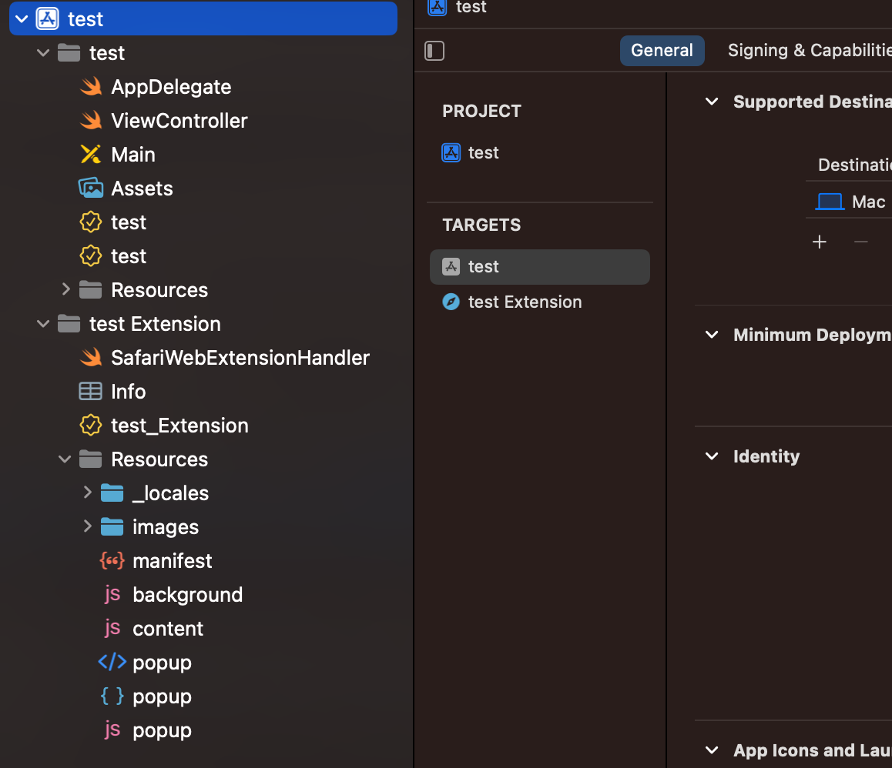
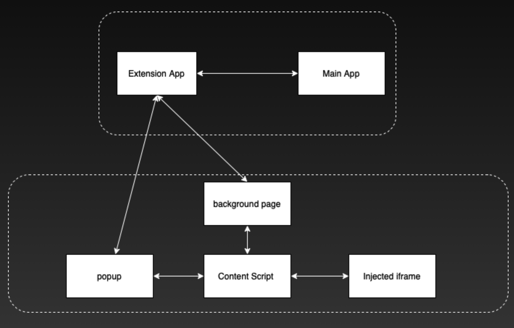
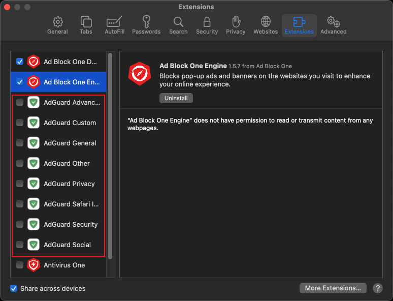

Session 10119 - 在 Safari 上开发浏览器插件

本文基于[Session 10119](https://developer.apple.com/videos/play/wwdc2023/10119/)梳理。

- [1. 前言](#1-前言)
- [2. 什么是Safari Web Extension](#2-什么是safari-web-extension)
  - [2.1. Safari Web Extention 的组成](#21-safari-web-extention-的组成)
  - [2.2. Safari Web Extention 的内部通信](#22-safari-web-extention-的内部通信)
    - [2.2.1. 宿主App与Extension App](#221-宿主app与extension-app)
    - [2.2.2. Extension App与backgroud、Extension App与popup](#222-extension-app与backgroudextension-app与popup)
    - [2.2.3. content与background、 content与popup](#223-content与background-content与popup)
    - [2.2.4. injected iframe与content](#224-injected-iframe与content)
- [3. Safari 插件发展历程](#3-safari-插件发展历程)
  - [3.1. Safari App 插件](#31-safari-app-插件)
  - [3.2. WWDC 2020 Safari Web Extension](#32-wwdc-2020-safari-web-extension)
  - [3.3. WWDC 2021 Safari Web Extension on iOS](#33-wwdc-2021-safari-web-extension-on-ios)
  - [3.4. Content Blocker（内容拦截器）](#34-content-blocker内容拦截器)
  - [3.5. WWDC 2022 Safari Web Extension Manifest V3](#35-wwdc-2022-safari-web-extension-manifest-v3)
- [4. What's new in WWDC 2023 Safari 插件](#4-whats-new-in-wwdc-2023-safari-插件)
  - [4.1. 全新的API](#41-全新的api)
  - [4.2. per-site peermissions](#42-per-site-peermissions)
  - [4.3. Profiles and Private Browsing](#43-profiles-and-private-browsing)
- [5. Safari web 插件 \& Chrome web 插件](#5-safari-web-插件--chrome-web-插件)
  - [5.1. 关于Manifest V2 和Manifest V3](#51-关于manifest-v2-和manifest-v3)
  - [5.2. 关于实现AdBlock功能](#52-关于实现adblock功能)
  - [5.3. 关于把Chrome插件带到Safari上来](#53-关于把chrome插件带到safari上来)
- [6. 发布Safari 插件](#6-发布safari-插件)
- [7. 总结](#7-总结)


## 1. 前言

在WWDC 2020和WWDC 2021，苹果宣布了支持Chrome风格的Safari Web插件。开发者现在可以在macOS和iOS的Safari上使用Chrome插件。在WWDC 2022上， Safari Web插件又有了新的变化，引入了Manifest V3，并且支持了declarative net request。这使得Safari Web插件越来越接近Chrome插件。本文将介绍WWDC 2023 Safari Web插件的新特性，以及Safari Web插件的发展历程。最后，我们将介绍Safari Web Extension和Chrome Extension之间的区别。

## 2. 什么是Safari Web Extension
Safari Web Extension使用和Google Chrome、Mozilla Firefox和Microsoft Edge浏览器相同的Javascript API，为Safari添加自定义功能，基于JavaScript、HTML和CSS构建Safari Web Extension，同时还可将其重新打包以在其他浏览器中运行。

要开始创建Safari Web Extension，有以下两种方式：
- 将现有其他平台的插件转换为Safari Web Extension，以便在macOS和iOS的Safari中使用，并在App Store中分发。Xcode包含了一个命令行工具，可简化此过程。
- 在Xcode中使用内置模板构建新的Safari Web Extension。

目前Safari Web Extension可在macOS 11及更高版本、安装了Safari 14的macOS 10.14.6或10.15.6以及iOS 15及更高版本中使用。

在开发Safari Web Extension的过程中， 完全可以参考[Mozilla的文档](https://developer.mozilla.org/en-US/docs/Mozilla/Add-ons/WebExtensions) 或者[Google的文档](https://developer.chrome.com/docs/extensions/)来了解相关API，虽然可能有一些差异（主要是Safari Web Extension支持的API更少）， 但是使用方法基本会保持一致。


### 2.1. Safari Web Extention 的组成
了解一种类型的app， 最快的方式就是打开Xcode， 迅速创建一个新的项目，从自动生成的文件，就可以很清晰地看出整体的结构。


Safari Web Extension的目录结构如上图所示， 从目录结构可以看出， Safari Web Extension主要由以下几部分组成：
- 宿主App
- Extension Native 部分
- Extension 部分

宿主应用（Host App）通常是指常见的应用程序（App），根据苹果公司的要求，每个浏览器插件都必须依附于一个主要的应用程序才能在App Store中发布。这一点与Chrome的插件有所不同。

Extension Native（扩展原生部分）也是一个独立的组件，它具有自己独立的沙盒环境，并能执行macOS和iOS的API。通过Extension Native，扩展能够直接与原生API进行通信，并且还可以通过类似于App Group的机制与宿主应用进行信息交互。Extension Native在这三个组件的通信中充当了一个中介的角色，而SafariWebExtension.swift则是其中最主要的部分之一。

通过实现```SafariWebExtensionHandler```这个类的```beginRequest``` 回调， 实现上述通信。
```swift
func beginRequest(with context: NSExtensionContext) {
        let item = context.inputItems[0] as! NSExtensionItem
        let message = item.userInfo?[SFExtensionMessageKey]
        os_log(.default, "Received message from browser.runtime.sendNativeMessage: %@", message as! CVarArg)

        let response = NSExtensionItem()
        response.userInfo = [ SFExtensionMessageKey: [ "Response to": message ] ]

        context.completeRequest(returningItems: [response], completionHandler: nil)
}
```
Extension是整个架构中最重要的部分。它通过JavaScript与网页进行交互，实现了改变网页内容、丰富网页功能、自定义网页UI、修改网页请求内容等功能，这也是用户需要浏览器插件的原因之一。同时，Extension还可以提供一个可交互的弹出式界面（popup），这是一个独立的网页，也是每个Safari Web Extension与用户进行交互的页面。这个弹出式界面通过基础的前端技术（HTML、CSS、JavaScript）来实现。

在上面Xcode生成的项目文件架构中可以看到，为Extension生成的JS文件主要包括三个，```background.js```、```content.js```以及```popup.js```。

其中background.js是指在 Safari运行期间，独立于每一个网页生命周期运行的JS代码，这些代码可以使用所有的Web Extension API，background在extension被Safari加载时便立即加载， 直到extension被卸载或禁用。

但是， background的运行方式可以被指定为non-persistent， 如果这样的话，background就会使用on- demand的形式来加载，在iOS上，由于性能和资源的限制，background只能通过这种方式运行。以non- persistent方式运行的background的生命周期是通过事件来建立和销毁。可以在其中注册各种事件监听器，从而在有需要的时候才会被调用。例如：
```javascript
browser.runtime.onMessage.addListener((request) => {

});
```
这是一个监听消息的事件，可以监听其他模块发送的消息，当接收到消息时，background会被加载， 当其中的逻辑被处理完之后，则会被销毁。
这种模式下，即使时全局变量，也会在页面被销毁时被销毁，所以关键的全局变量，需要及时通过Storage API写入磁盘。

content.js本身使extension的一部分，但可以运行在指定的网页当中，与background不同，可以通过指定URL或者Domain，使不同网页运行完全不同的content。
因为background虽然可以使用全部的WebExtension JavaScript API，但不能直接访问网页的内容。 这时候，就需要通过content来实现这一功能，就像网页中被 ```<script>``` 元素加载的脚本一样，content可以使用DOM API， 并且修改网页的内容。但是相较于background， content可以使用的WebExtension JavaScript API比较少。

popup就是当用户点击浏览器中extension的图标时，会出现的弹窗页面。 popup.js就是在这个页面中加载的脚本， 主要用于处理用户在这个页面上操作逻辑。
### 2.2. Safari Web Extention 的内部通信
因为Safari Web Extension的组件比较多，不同组件的权限和功能各不相同，当这些组件之间需要共享一些内容或者状态的时候，就需要通过各种API实现各个组件之间的通信。


上图是Safari Web Extension各个组件可以实现的通信，其中injected iframe在上面没有提到，这指的是通过插件，插入在各个网页中的```<iframe>```元素，它可以被看成是运行在原始页面中的子页面， 它不是Extension的一部分，却是因为Extension的行为而产生的，所以也被列入其中。

按照上图中的箭头，Safari Web Extention 的内部通信主要有以下几种
#### 2.2.1. 宿主App与Extension App
这两个App完全属于两个进程，所以可以像其他类型的Extension App一样，可以通过App group 或者NSXPCConnection来进行通信。

#### 2.2.2. Extension App与backgroud、Extension App与popup
这种通信方式是一种重要的通信方式，主要作用是把插件内的配置等同步给Extension，进而同步给宿主App，实现在UI上展现等功能，这种通信方式是其他平台的Web Extension所不具备的。

在使用时，popup和background需要使用
```js
browser.runtime.sendNativeMessage("application.id", {
  "messages":"content"
})

```
这里需要提到的一点是，application.id 不是一种id，而是一个default value而且不需要更改。 Extension App则使用上文提到的beginRequest来接受发出的消息，并可以在其中加入response， 因为```sendNativeMessage```是一个Promise， 可以使用Promise.then来接受这个返回值。

#### 2.2.3. content与background、 content与popup
```js
browser.runtime.sendMessage(
  extensionId,             // optional string
  message,                 // any
  options                  // optional object
)
browser.runtime.onMessage.addListener(listener)
```

通过sendMessage和addListener来发送和监听消息

#### 2.2.4. injected iframe与content
content 通过contentWindow.postMessage向iframe发送消息
```js
document.getElementById("frameID").contentWindow.postMessage({
        msg: message,
        ele: ele,
      }, '*')
```

iframe则通过window.parent.postMessage向content发送消息
```js
window.parent.postMessage({
    msg: 'message'
  }, '*')

```
## 3. Safari 插件发展历程
苹果生态的浏览器插件经历了Safari Extension， Safari App Extension到Safari Web Extension的发展， 其中除了Safari Exttension已经废弃了， Safari App Extension和Safari Web Extension仍然都苹果生态中的浏览器插件支持的实现方式。这两者的区别主要在于Safari App Extension使用苹果原生技术在实现插件的主要功能，而不是JavaScript。 但是如果想要支持开发一款支持苹果全家桶（iOS，macOS，iPadOS，xrOS）的浏览器插件，或者把其他平台的浏览器插件带到苹果生态中， Safari Web Extension是唯一的选择。除此之外，Safari还支持Content Blocker（内容拦截器）， 这也是一种浏览器插件， 但是其功能有限， 只能拦截网络请求， 这也是Safari 上绝大多数的广告拦截器的实现方式。

  ### 3.1. Safari App 插件
  > [Safari App Extension](https://developer.apple.com/documentation/safariservices/safari_app_extensions)官方文档
  
  Safari App Extension可以通过读取和修改网页内容来为Safari添加新功能。Safari App Extension的独特之处在于它可以与宿主App进行通信，可以将应用程序内容整合到Safari中，或将Web数据发送回应用程序，

上图是Safari应用扩展在包含应用程序和Safari浏览器之间进行通信的情况。一个标有"Safari App Extension"的方框嵌套在一个标有"Containing app"的方框中。箭头表示Safari App Extension和主App通过共享资源相互传递信息。另一个箭头表示应用扩展和Safari之间相互传递信息。这里的通讯方式相较于Safari Web Extension更简单。

Safari App Extension最大的不同点就在于其Extension部分主要运用的都是苹果的原生技术，即Swift和Objective-C， 也就是说可以使用很多原生接口，不需要掌握很多JavaScript的技术， 这对苹果的开发者很友好， 但事实上，熟悉 JavaScript、HTML 和 CSS 的 web 开发者要比熟悉 Objective-C 或者 Swift 的开发者多的多。苹果需要吸收更多的血液。

当然，如果你不熟悉苹果的原生技术，或者已经有一款其他平台的浏览器插件， Safari Web Extension应该还是更适合的选择。
同时，如果你已经有一款Safari App Extension， 想要把它转化成Safari Web Extension， 苹果也提供了[方案](https://developer.apple.com/documentation/safariservices/safari_web_extensions/converting_a_safari_app_extension_to_a_safari_web_extension)， 可以将Safari App Extension转化为Safari Web Extension。

  ### 3.2. WWDC 2020 Safari Web Extension
  > WWDC 2020 session 10665 [Meet Safari Web Extensions ](https://developer.apple.com/videos/play/wwdc2020/10665/)<br>WWDC 2020内参 [用 Web 技术为 Safari 编写扩展](https://xiaozhuanlan.com/topic/2746058139)
  
  2020年的WWDC上，苹果首次将Safari Web Extension引入的macOS上，苹果应该是希望以此为契机，拯救其多年来停滞不前的浏览器插件生态，吸引更多的开发者来增强Safari。 但事实上，三年过去了，Safari 上好用的插件依然屈指可数，且很多仍然是Safari App extension。想想看， 主要的原因可能还是即使使用了Web Extension技术，苹果仍然有过多的限制，有些实用的API都被禁止使用，且由于苹果对隐私的严格把控（这不是坏事），开发者在开发的过程中总有种处处被掣肘的感觉。条条框框的原属很难吸引很多更hack 的浏览器插件开发者，更不用说每年99美元的开发者费用（相比下， Chrome的费用是5美元永久）。 

  可以在这里查看Safari 对Web Extension的API限制。 [Safari Web Extensionde API使用](https://developer.apple.com/documentation/safariservices/safari_web_extensions/assessing_your_safari_web_extension_s_browser_compatibility)
  ### 3.3. WWDC 2021 Safari Web Extension on iOS
  > WWDC21 sessions [10027: Explore Safari Web Extension Improvements](https://developer.apple.com/wwdc21/10027/) 和 [10104: Meet Safari Web Extensions on iOS](https://developer.apple.com/wwdc21/10104/).
  <br>WWDC 2021内参 [iOS Safari Web Extensions 实践小记](https://xiaozhuanlan.com/topic/4926530871)

  在WWDC 2021上，苹果顺理成章的将Safari Web Extension带到了iOS和iPad OS上，几乎换汤不换药，和Mac上一样的开发流程，一样的分发方式，甚至不需要太多的修改，一款macOS Safari的插件就可以在iOS上发布， 也就是一份代码可以分别分发到macOS和iOS上。

  同时，在WWDC 2021上， 苹果引进了三个API, 非持久性后台页, declarative net request 与自定义选项卡。

  非持久性后台页就是在2.1 中提到的non-persistent background。这是为了降低内存和CPU的消耗，尤其是在iSO设备上。
  
  declarative net request是一种拦截网络请求的方式，因为苹果在Safari Web Extension上限制了webRequest API的使用，这使得浏览器插件的一个大门类，Ad Block类插件想用原生方式实现非常困难。declarative net request 可以让用户只提供一份符合要求的规则JSON，即刻拦截网络请求， 并且这一规则可以在Chrome上使用。但其实，Chrome 上的Ad Block类插件几乎没有使用这种方式来实现，因为这一API的限制十分大，并且只能通过有限的正则表达式拦截网络请求，完全无法拦截网络上形形色色的广告。这是关于这一API的[文档](https://developer.apple.com/documentation/safariservices/safari_web_extensions/blocking_content_with_your_safari_web_extension)。

  自定义选项卡允许扩展接管 Safari 中的新 tab 页并对其进行完全定制, 且使用起来非常简单。只需要在manifest文件中指定和自定义选项卡的html文件即可。
  ```json
  "browser_url_overrides": {
    "newtab": "new_tab_page.html"
  }
  ```

  虽然全新的Safari Web extension在Safari上体验不够完美，Safari的插件也没能像Chrome FireFox上那样百花齐放，但仍然有一些插件可以让Safari的使用体验更加友善。如类似油猴的[Stay](https://apps.apple.com/cn/app/stay-safari%E6%B5%8F%E8%A7%88%E5%99%A8%E4%BC%B4%E4%BE%A3/id1591620171), 使所有网页支持暗黑模式的[Dark reader](https://apps.apple.com/cn/app/dark-reader-for-safari/id1438243180)等等
  ### 3.4. Content Blocker（内容拦截器）
  上面提到，苹果在WWDC 2021上， 才在Safari 上开发declarative net request的使用，从而实现内容拦截的功能， 但这并不意味着Safari上没有Ad Block类的内容拦截器。相反，苹果开放了一些自己独有的插件， Content Blocker（内容拦截器）来支持这一功能。

  Content Blocker也是一种插件，和上面提到的Safari App Extension一样，是一种包在主App内的扩展，
  

  它也是基于规则的拦截器，在使用时，只需要在其回调中，指明包括所有规则的JSON文件位置即可。在这份规则文件中，需要包含拦截触发的条件（如某个url的正则表达式）和拦截的行为（block，ignore或者css-display-none等。示例：
  ```json
  [
    {
        "trigger": {
            "url-filter": ".*",
            "resource-type": ["image", "style-sheet"],
            "unless-domain": ["your-content-server.com", "trusted-content-server.com"]
        },
        "action": {
            "type": "css-display-none",
            "selector": "#newsletter, :matches(.main-page, .article) .news-overlay"
        }
    },
    {
        "trigger": {
            ...
        },
        "action": {
            ...
        }
    }
]
  ```
相比于使用declarative net request 和 更常用的webRequest API拦截广告，content blocker的的优势在于更简单，只需要找到一份可以使用的规则即可，几乎没有门槛。另外，在一份规则中，content blocker同时兼顾了 网络请求的拦截和css 样式的隐藏， 满足了绝大多数场景下Ad Block的使用。并且因为规则是从本地加载，无需直接包在主App的package内，所以可以进行热更新，不需要更新App。最后，Content Blocker还可以通过API直接与Safari App Extension和宿主App进行数据共享和状态展示，从而使UI上的展现更加方便。

但是它的缺点也有，一是只能在Safari上使用，无法做到跨平台开发，另外， 每一个Content Blocker支持的规则数是有限的，大概只能支持三万条规则（据AdGuard的开发者在论坛内说，经过他们与苹果的不断交涉，这一数量提高到了十五万），且每条规则的长度也有限。 所以开发者们会在一款App内包上很多Content Blocker，这就是为什么几乎Safari上的Ad Block类应用，都会在一开始让你在Safari内打无数的勾。如Adguard：


但即使如此，绝大多数Safari上（无论macOS还是iOS）的Ad Block类软件，都使用了Content Blocker作为实现形式。如 [AdGuard](https://apps.apple.com/cn/app/adguard-for-safari/id1440147259)， [AdBlock Pro](https://apps.apple.com/cn/app/adblock-pro-safari-ad-blocker/id1018301773) , [Ad Block One](https://link.zhihu.com/?target=https%3A//apps.apple.com/app/apple-store/id1491889901%3Fpt%3D444218%26ct%3Ddriver%26mt%3D8)， [1Blocker](https://apps.apple.com/cn/app/1blocker-ad-blocker/id1365531024)等
  ### 3.5. WWDC 2022 Safari Web Extension Manifest V3
  Manifest V3
  丰富declarative net reques API， 支持更多的规则， update rules
  externally_connectable
  unlimited storage
  syncing extensions
## 4. What's new in WWDC 2023 Safari 插件

### 4.1. 全新的API
### 4.2. per-site peermissions
### 4.3. Profiles and Private Browsing


## 5. Safari web 插件 & Chrome web 插件
 到这一次的wwdc， Safari平台的浏览器插件已经和Chrome平台的愈加相像了， 开发者可以轻松的把一些Chrome平台的插件带到Safari上来，但是其中自然也有一些区别，这些区别可能也是当下Safari平台生态仍然不够百花齐放的原因。

 ### 5.1. 关于Manifest V2 和Manifest V3
 ### 5.2. 关于实现AdBlock功能
 ### 5.3. 关于把Chrome插件带到Safari上来

## 6. 发布Safari 插件
## 7. 总结
以上就是关于WWDC 2023 Safari Web 插件的介绍， 以及和Safari Web 插件的一些额外知识，可以看到， 苹果在Safari 插件方面正在日趋完善， 虽然仍然达不到 Chrome平台那样的高度定制化，但是这就是苹果的做派，开发者只能带着“镣铐”把舞蹈跳好， 希望Safari上能出现更多更好的插件， 也希望苹果能够在Safari Web 插件上继续努力， 为开发者提供更好的支持。
