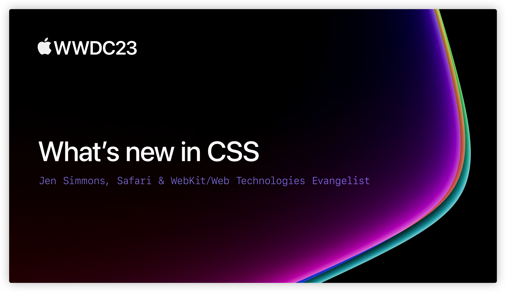
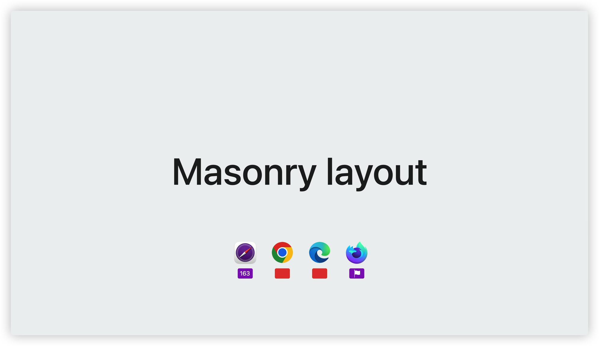
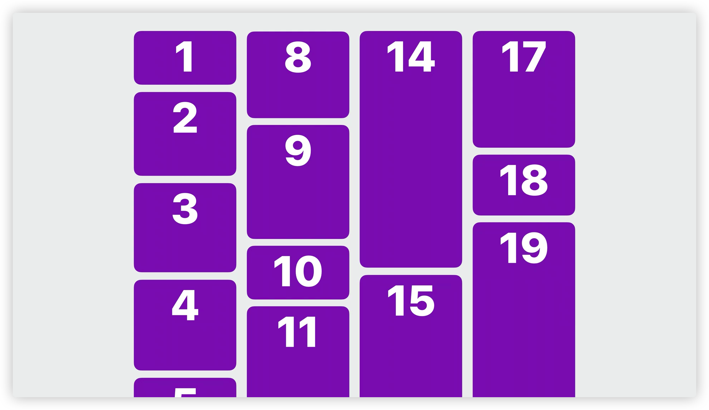
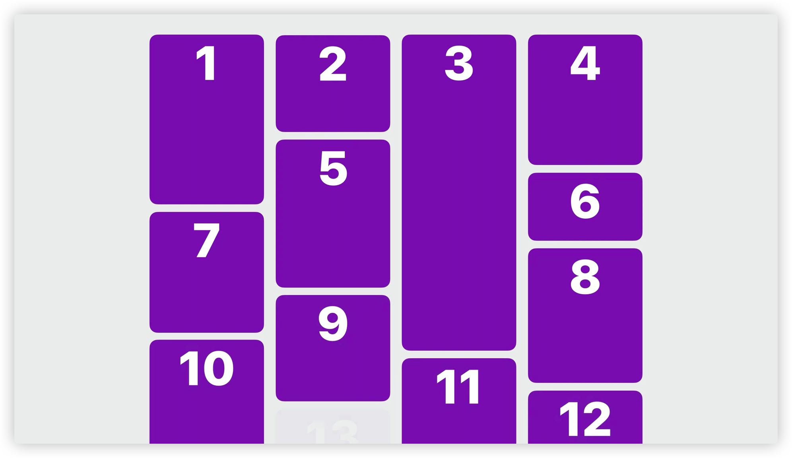
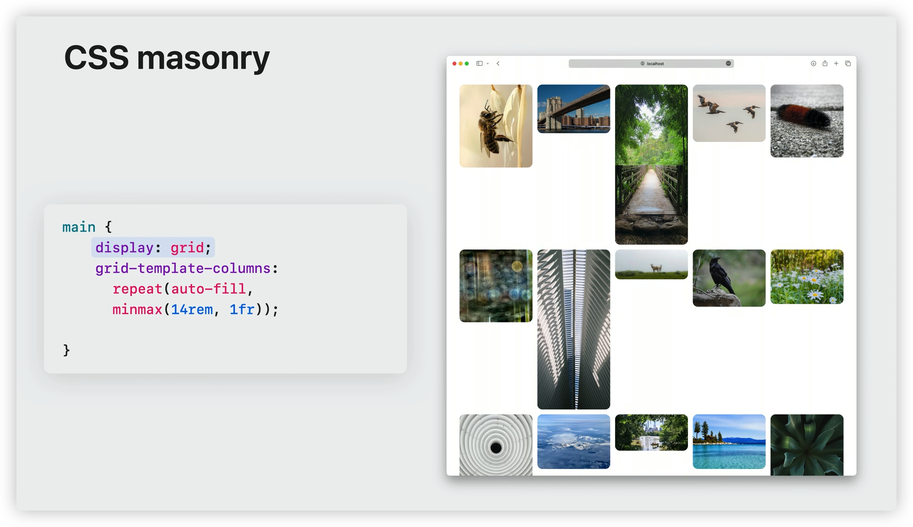
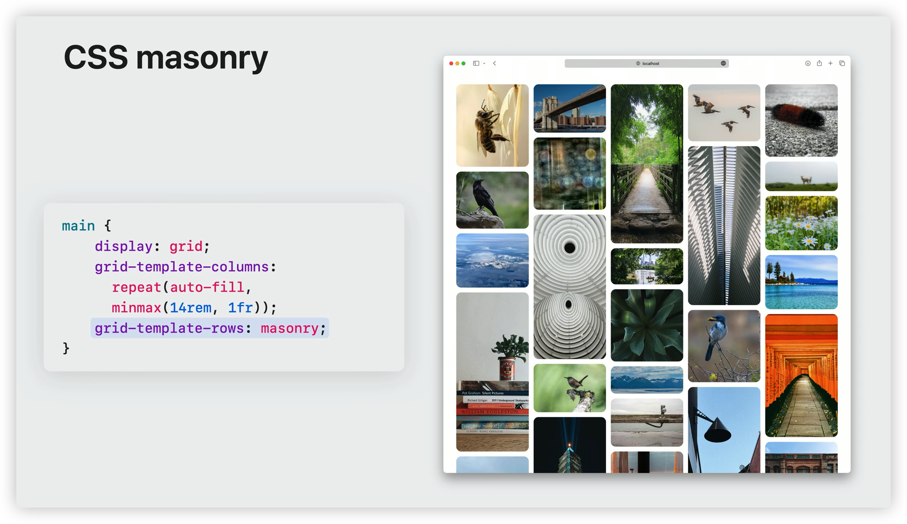
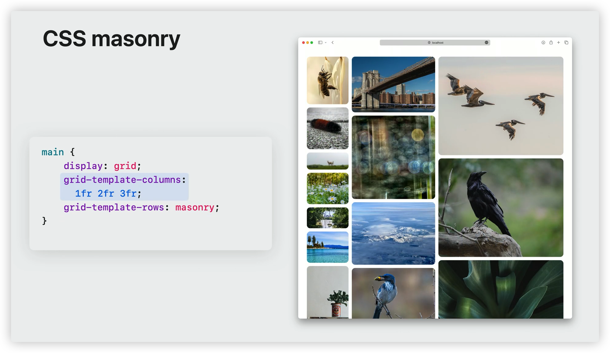
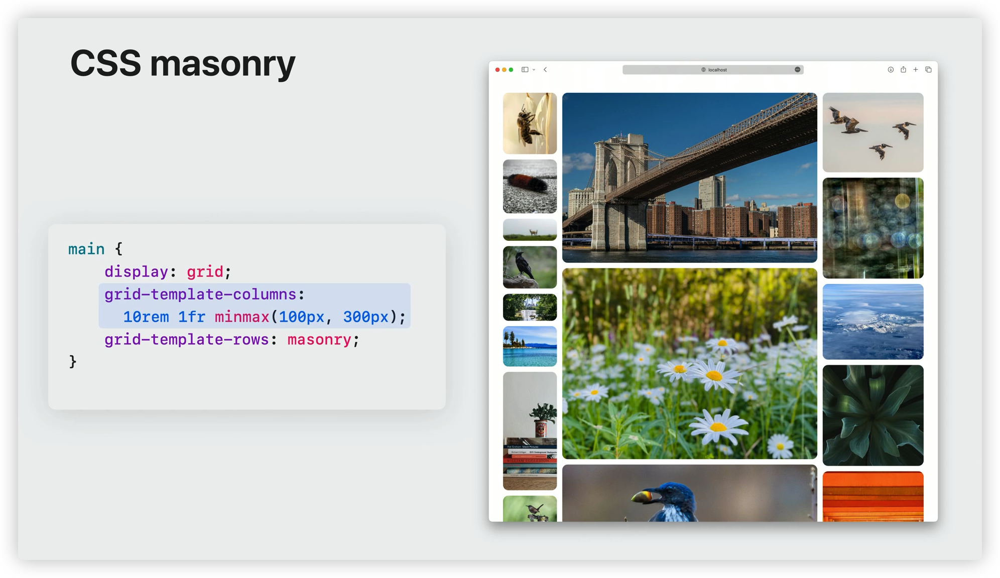
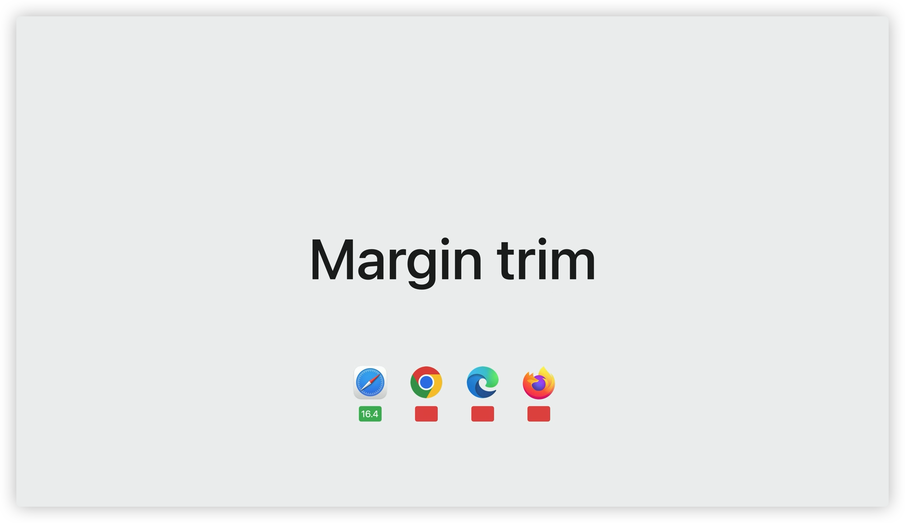

# WWDC23 - What's new in CSS

本文基于 [Session 10121](https://developer.apple.com/videos/play/wwdc2023/10121/) 梳理。

## Layout

### Masonry Layout

> Masonry Layout 目前仅在 Safari 163 版本及以上可用，Chrome 和 Edge 不可用，而 FireFox 中则需要开启 `layout.css.grid-template-masonry-value.enabled` 的 Flag。

#### 什么是 Masonry Layout?

砖石布局（Masonry Layout）是一种在网页设计中常用的布局方式，也称为瀑布流布局（Waterfall Flow Layout）或砌砖式布局。它的特点是以不规则的方式将内容块排列在页面上，就像是用砖块砌墙一样。这种布局可以使得网页呈现出自适应和动态的外观。

在砖石布局中，每个内容块（如图像、文字、视频等）都被视为一个砖块，它们的高度可以不同。这些砖块会依次排列在网页上，每一列的宽度是相等的。当一列的空间被填满后，下一个砖块会自动放置在空闲的最短列上，以保持整体布局的平衡。

由于砖石布局可以自动调整和适应不同尺寸的屏幕，因此在响应式网页设计中被广泛应用。它在展示图片库、社交媒体流、新闻网站等需要展示大量内容的页面上效果良好，能够提供更好的用户体验。此外，砖石布局还可以通过动画效果来优化内容的加载和展示过程。

总之，砖石布局是一种流行的网页设计布局方式，通过不规则排列的砖块形式展示内容，具有适应性强、动态美观等特点。

#### 如何实现 Mansonry Layout?

##### 自顶向下、自左往右

图中的内容顺序从第一列开始往下排列，一直延伸到 `viewport` 之外，第二列又从顶部开始，接着往下延伸，第三列之后以此类推。

对于这种内容从上往下，从左至右排列的场景可以通过 `CSS MultiColumn` 实现。

##### 自左往右、自顶向下

如图所示，数据从左往右，从上往下排列，这也是我们日常生活中最常见的「瀑布流」布局，比如用户手指滚动页面到底部之后加载更多数据。要实现这个效果之前只能通过 `JavaScript` 来实现，如著名的 [Masonry](https://github.com/desandro/masonry) 库。虽然 `JavaScript` 可以实现瀑布流的布局效果，但是性能肯定是比不上原生的 `CSS` 支持。

#### CSS masonry

在 CSS 中使用 `masonry` 布局很简单，首先设置 `display` 属性为 `grid` ，然后设置 `grid-template-columns` 属性为 `repeat(auto-fill), minmax(14rem, 1fr)`

> `grid-template-columns`
>
> `repeat` 
>
> `fr`: fr 是一个 CSS 网格单位,它代表网格容器中可用空间的一等份。它允许我们按比例划分网格容器中的可用空间,而不用给出具体的长度单位。

重点来了，通过设置 `grid-template-rows` 属性值为 `masonry` 之后，可以实现

1. 根据容器宽度和每列元素的高度,自动计算出行数和每行的高度
2. 使得每列的高度尽量相近,同时填充容器空间
3. 当窗口大小改变时,自动重新计算行数和每行高度,以保持瀑布流效果

水平方向排列方式设置为 `masonry` 之后，垂直方向我们利用强大的 CSS Grid 布局系统在垂直方向上自定义各种效果。

如上图，垂直方向上设置为 `1fr 2fr 3fr` 来实现三列，每列宽度 1:2:3 的效果。

如上图，垂直方向上设置为 `10rem 1fr minmax(100px, 300px)` 来实现第一列宽度固定，第三列宽度在 100 - 300px 之间，第二列撑满剩余空间的效果。

### Margin trim

> `Margin trim` 特性在 Safari 16.4 及以上版本可用，Chrome、Edge、FireFox 目前均不可用。