# WWDC23 10121 - What's new in CSS

> 摘要：Web 上的发展日新月异，CSS 也不例外。Apple 今年在 Safari 上支持了许多的 CSS 新特性。本文主要介绍了四个维度的 CSS 新特性，分别是布局、颜色、选择器和字体排版。与此同时本文还介绍了 Safari Technology Preview 中可以体验到的 WebKit 新特性，以及全新改版的 Safari 开发者菜单。

本文基于 [Session 10121](https://developer.apple.com/videos/play/wwdc2023/10121/) 梳理。

> 作者：
>
> leejunhui，就职于杭州云梯科技公司，iOS / React Native / React 开发者，目前专注于大前端技术栈，曾参与 [WWDC21 内参 - 探索 Foundation 新增功能](https://mp.weixin.qq.com/s/pNICAta3qsgFJXGwJ6QKcg) 、[WWDC22 内参 - App 包大小优化和 Runtime 上的性能提升](https://mp.weixin.qq.com/s/9rBlEvwFOEVznN_WbRu3ng)的创作。
>
> 审核：
>
> zhangferry，摸鱼周报编辑，就职于抖音 iOS 基础技术团队，从事研发效能相关工作。

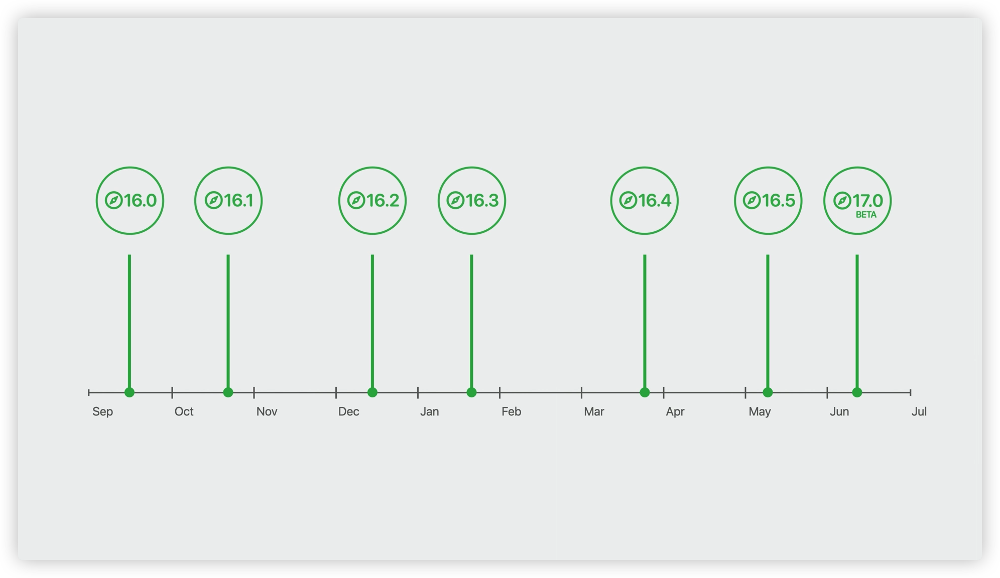

自 WWDC22 以来至今，Safari 已经从 16.x 跨越到了 17.x，在迭代过程中支持了 140 多个 WEB 上的新特性。

由于新特性太多，限于篇幅，本 Session 聚焦于 CSS 相关的新特性，Session 大纲参见下图：

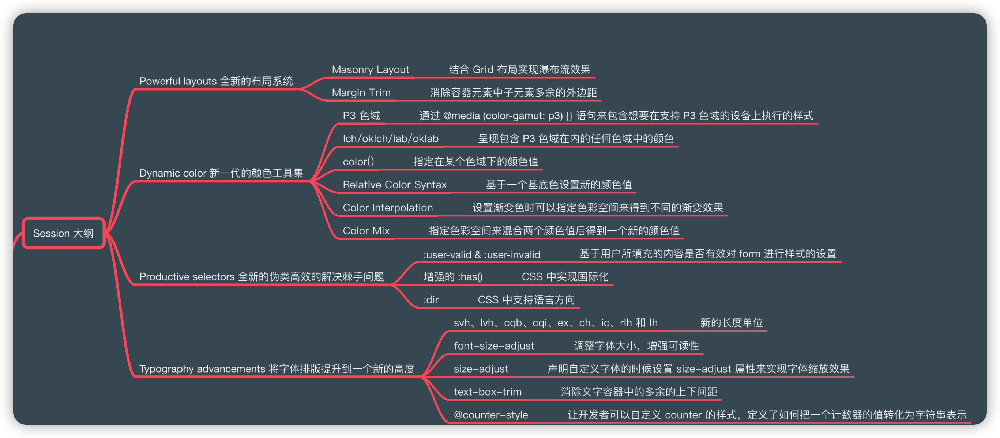

## Layout

### Masonry Layout


> Masonry Layout 目前仅在 [Safari Technology Preview 163 版本](https://developer.apple.com/documentation/safari-technology-preview-release-notes/stp-release-163) 及以上可用，Chrome 和 Edge 不可用，而 FireFox 中则需要开启 `layout.css.grid-template-masonry-value.enabled` 的 Flag。

#### 什么是 Masonry Layout

砖石布局（Masonry Layout）是一种在网页设计中常用的布局方式，也称为瀑布流布局（Waterfall Flow Layout）或砌砖式布局。它的特点是以不规则的方式将内容块排列在页面上，就像是用砖块砌墙一样。这种布局可以使得网页呈现出自适应和动态的外观。

在砖石布局中，每个内容块（如图像、文字、视频等）都被视为一个砖块，它们的高度可以不同。这些砖块会依次排列在网页上，每一列的宽度是相等的。当一列的空间被填满后，下一个砖块会自动放置在空闲的最短列上，以保持整体布局的平衡。

由于砖石布局可以自动调整和适应不同尺寸的屏幕，因此在响应式网页设计中被广泛应用。它在展示图片库、社交媒体流、新闻网站等需要展示大量内容的页面上效果良好，能够提供更好的用户体验。此外，砖石布局还可以通过动画效果来优化内容的加载和展示过程。

总之，砖石布局是一种流行的网页设计布局方式，通过不规则排列的砖块形式展示内容，具有适应性强、动态美观等特点。

#### 如何实现 Mansonry Layout

##### 自顶向下、自左往右


图中的内容顺序从第一列开始往下排列，一直延伸到 `viewport` 之外，第二列又从顶部开始，接着往下延伸，第三列之后以此类推。

> 视口代表当前可见的计算机图形区域。在 Web 浏览器术语中，通常与浏览器窗口相同，但不包括浏览器的 UI，菜单栏等——即指你正在浏览的文档的那一部分。
>
> 视口又分为两种，一种是布局视口（Layout Viewport），一种是视觉视口（Viusal Viewport）。
>
> - 布局视口：指网页的实际布局大小，即网页在屏幕上占据的空间。它通常是由网页的内容决定的，可以**超过设备的可见区域**。在桌面浏览器上，布局视口通常比屏幕宽度更宽，使得用户可以水平滚动查看整个网页内容。在移动设备上，布局视口的宽度可能与设备屏幕的宽度相同或稍微大一些。
>
> - 视觉视口：是用户当前可见的网页区域，即**用户实际能看到的部分**。它是通过**屏幕的大小和缩放级别**来确定的，用户可以通过滚动来改变视觉视口。在桌面浏览器上，视觉视口通常与布局视口的大小相同，因为网页通常可以完全显示在屏幕上。在移动设备上，由于屏幕尺寸较小，视觉视口可能只显示布局视口的一部分，用户需要通过滚动来查看整个网页。
>
> - 理想视口：是为了在移动设备上优化网页显示而提出的概念。它指的是设置网页的布局和渲染参数，使得网页在移动设备上以最佳方式呈现，无需用户缩放或水平滚动。理想视口的宽度通常与设备屏幕的宽度相同，并且通过使用 meta 标签在网页头部进行设置。通过设置理想视口，网页可以根据设备的屏幕尺寸自动适应布局和字体大小，提供更好的用户体验。
>
>   ```html
>   <meta
>     name="viewport"
>     content="width=device-width, initial-scale=1.0, maximum-scale=1.0, minimum-scale=1.0, user-scalable=no"
>   />
>   ```
>
>   这个 meta 标签告诉浏览器如何设置视口
>
>   - `width=device-width` ：将视口的宽度设置为设备的宽度。这样可以确保网页的布局与设备屏幕的宽度相匹配，避免缩放或者水平滚动。
>   - `initial-scale=1.0`：将初始缩放级别设置为 1.0。这个属性确保网页以原始大小显示，不会被自动缩放。
>   - `maximum-scale=1.0`：限制用户对网页进行缩放的最大比例为 1.0
>   - `minimum-scale=1.0`：限制用户对网页进行缩放的最小比例为 1.0
>   - `user-scalable=no`：禁用用户对网页的缩放操作
>
>   当将`user-scalable`属性设置为`no`时，表示禁止用户对网页进行缩放操作。在这种情况下，如果不设置`maximum-scale`和`minimum-scale`属性，浏览器会默认将其设置为 1.0，即不允许进行缩放。
>
>   尽管`maximum-scale`和`minimum-scale`属性在禁用用户缩放时可能看起来多余，但为了保持一致性和清晰度，建议仍然设置这些属性。
>
> 更多视口相关内容请参考 [Viewport - MDN](https://developer.mozilla.org/zh-CN/docs/Web/CSS/Viewport_concepts)

对于这种内容从上往下，从左至右排列的场景可以通过 `CSS MultiColumn` 实现。

> [CSS MultiColumn - MDN](https://developer.mozilla.org/zh-CN/docs/Web/CSS/CSS_multicol_layout)
>
> [CSS MultiColumn 在线 Demo](https://stackblitz.com/edit/js-cpwkm3?file=index.js)

##### 自左往右、自顶向下


如图所示，数据从左往右，从上往下排列，这也是我们日常生活中最常见的「瀑布流」布局，比如用户手指滚动页面到底部之后加载更多数据。要实现这个效果之前只能通过 `JavaScript` 来实现，如著名的 [Masonry](https://github.com/desandro/masonry) 库。虽然 `JavaScript` 可以实现瀑布流的布局效果，但是性能肯定是比不上原生的 `CSS` 支持。

#### 基于 CSS 实现自左往右、自定向下的 masonry 效果

在七年前，基于 CSS Grid 的 Mansonry [提案](https://drafts.csswg.org/css-grid-3/) 就已启动，详细的使用方式可以参考 [Masonry Layout - MDN](https://developer.mozilla.org/en-US/docs/Web/CSS/CSS_grid_layout/Masonry_layout)。


- 首先设置 `display` 属性为 `grid`，开启 [Grid 布局 - MDN](https://developer.mozilla.org/zh-CN/docs/Web/CSS/CSS_grid_layout)
- 然后设置 `grid-template-columns` 属性为 `repeat(auto-fill), minmax(14rem, 1fr)`，这个时候我们可以看到图片都按列展示了，不过有一些图片底部的间距过大，下面的图片并没有顶上来

> [grid-template-columns - MDN](https://developer.mozilla.org/zh-CN/docs/Web/CSS/grid-template-columns) 是 CSS Grid 布局中定义行列结构的属性。
>
> - repeat(auto-fill, ...) 表示自动填充，将自动创建尽可能多的列，以填充容器。
> - minmax(14rem, 1fr) 表示每列的宽度为 14rem 到 1fr 之间。也就是说:
>   - 如果容器的宽度可以放得下很多 14rem 列，就会创建很多列，每个列 14rem 宽。
>   - 如果容器的宽度放不下很多 14rem 列，那么就创建少一些列，每个列会大于 14rem，但总宽仍然填充满容器(因为最后一列是 1fr，所以会拉伸)。
>   - 所以这个值会创建一个响应式的栅格系统，当视口宽度增加时，会自动创建更多的列，但每列的最小宽度是 14rem。
>
> [fr](https://developer.mozilla.org/zh-CN/docs/Web/CSS/CSS_grid_layout/Basic_concepts_of_grid_layout#fr_%E5%8D%95%E4%BD%8D) 是 CSS Grid 布局中的一个特殊的长度单位。它代表容器中可用空间的一等份。
>
> 例如，如果你的容器有 3 列，宽度为:
>
> ```css
> grid-template-columns: 1fr 2fr 1fr;
> ```
>
> 这表示:
>
> - 第一列占容器宽度的 1 份
>
> - 第二列占容器宽度的 2 份，即第二列是第一列的两倍宽
>
> - 第三列也占 1 份
>
>   所以如果容器是 800px，每份就是 200px，三列的实际宽度为:
>
>   - 第一列:200px
>   - 第二列:400px
>   - 第三列:200px
>   - 总宽度 800px

> [rem](https://developer.mozilla.org/zh-CN/docs/Learn/CSS/Building_blocks/Values_and_units#%E6%95%B0%E5%AD%97%E3%80%81%E9%95%BF%E5%BA%A6%E5%92%8C%E7%99%BE%E5%88%86%E6%AF%94) 是一个相对长度单位，表示的是根元素的字体的大小，一般用作响应式布局。感兴趣的读者可以参考 [Rem 布局的原理解析 - 颜海镜](https://yanhaijing.com/css/2017/09/29/principle-of-rem-layout/) 一文。


重点来了，通过设置 `grid-template-rows` 属性值为 `masonry` 之后，可以实现

1. 根据容器宽度和每列元素的高度，自动计算出行数和每行的高度

2. 使得每列的高度尽量相近，同时填充容器空间

3. 当窗口大小改变时，自动重新计算行数和每行高度，以保持瀑布流效果

   > [在线 Demo](https://stackblitz.com/edit/web-platform-gxeyfm?file=styles.css)，请使用 Safari Technology Preview 163 及以上或使用 FireFox 并开启 `layout.css.grid-template-masonry-value.enabled` 体验。

水平方向排列方式设置为 `masonry` 之后，垂直方向我们利用强大的 CSS Grid 布局系统在垂直方向上自定义各种效果。


如上图，垂直方向上设置为 `1fr 2fr 3fr` 来实现三列，每列宽度 1:2:3 的效果。


如上图，垂直方向上设置为 `10rem 1fr minmax(100px, 300px)` 来实现第一列宽度固定，第三列宽度在 100 - 300px 之间，第二列撑满剩余空间的效果。

结合 Grid 布局使用 Masonry 属性相比较于使用 JavaScript 来实现瀑布流的各种自定义效果更加灵活和简单，不过 Masonry 提案尚未定稿，当 Masonry 真正可用的时候，Safari 将会在第一时间支持。

### Margin trim


> `Margin trim` 特性在 Safari 16.4 及以上版本可用，Chrome、Edge、FireFox 目前均不可用。

`margin-trim` 属性可以帮助我们消除一个容器元素中子元素多余的外边距，我们来看下面这个场景。

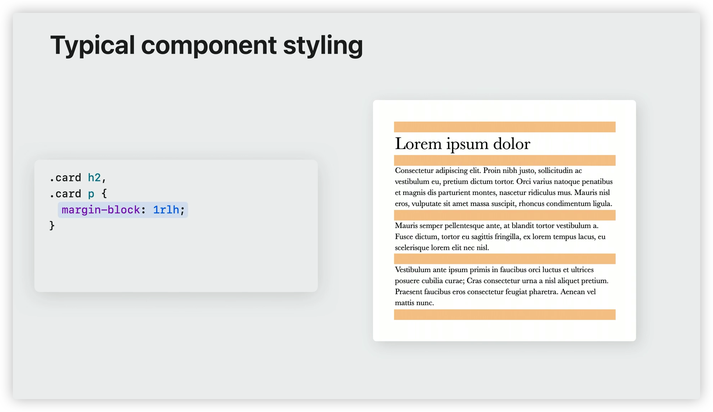

如上图所示，我们需要展示一个主标题和三段正文。它们各自都有顶部和底部的外边距（通过 margin-block: 1rlh 实现）。

> margin-block: 定义了元素的逻辑块首和块末外边距，并根据元素的书写模式、行内方向和文本朝向对应至实体外边距。 [margin-block - MDN](https://developer.mozilla.org/zh-CN/docs/Web/CSS/margin-block) [margin-inline 和 margin-block 的区别 - 张鑫旭](https://www.zhangxinxu.com/wordpress/2018/10/diff-css-margin-inline-margin-block/)
>
> rlh: root element line height，表示根元素的行高，同样的还有 lh，即当前元素的行高。[rlh - MDN](https://developer.mozilla.org/zh-CN/docs/Web/CSS/length#%E5%8D%95%E4%BD%8D)

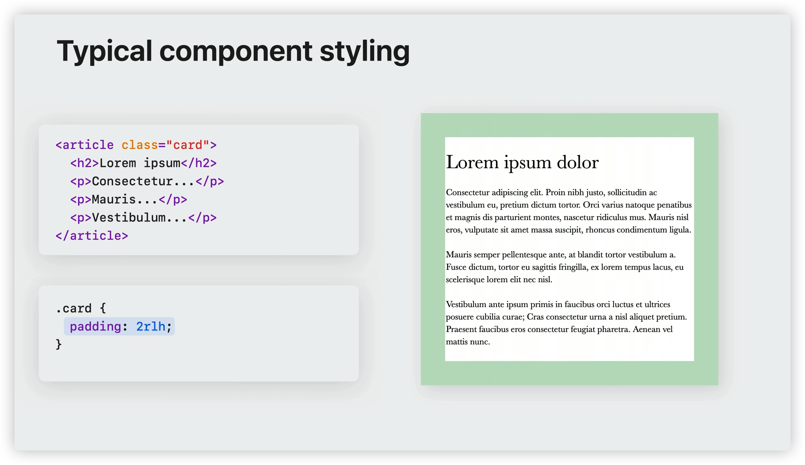

在标题和正文的外层，我们定义了 2rlh 单位长度的内边距。

但是烦人的问题出现了，主标题顶部和最后一段正文底部的外边距其实并不是我们所期望的。

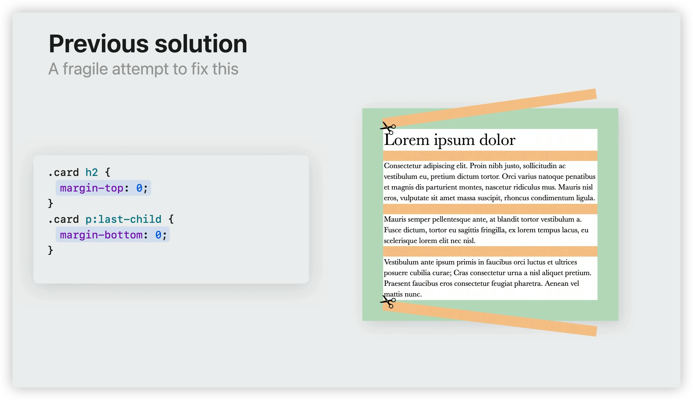

一般来说，我们可以通过 CSS 选择器选中标题和最后一段正文，分别将顶部外边距和底部外边距设置为 0 来达到期望的效果。但是这样的解决方案存在潜在的扩展性问题，比如这部分内容开头不再是 h2 标签，而是 h3 标签，那么 CSS 也需要同步做出改动，又比如说 h2 被放到了中间位置，这样 h2 顶部的外边距就不存在了从而导致样式错乱。

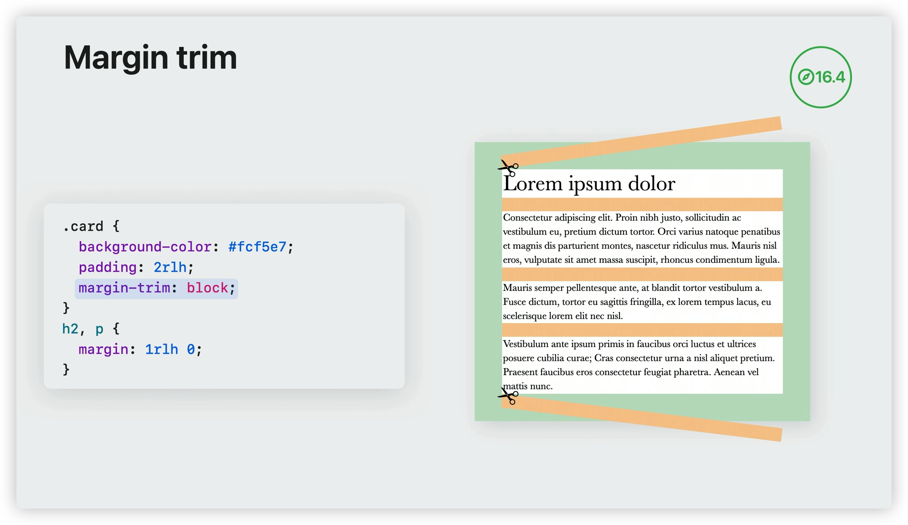

margin-trim 属性提供给了我们一个更好的解决方案，如上图所示，我们在容器元素上设置 margin-trim: block 来裁剪掉容器元素内顶部和底部额外的边距。

[在线 Demo - 请使用 Safari 16.4 及以上版本访问](https://stackblitz.com/edit/web-platform-kczpxp?file=index.html)

## Color

自从 2017 年 CSS Grid 布局面世之后，过去六年里 CSS 布局系统的发展十分迅速，和十年前的布局方案相比，今天的布局系统更加现代和易用，是一个巨大的进步。在同样的时间维度里，其实还有一块内容也发生了巨大的改变但却并不为大部分 Web 开发者和设计师所察觉 - Color 色彩。

### P3 色域

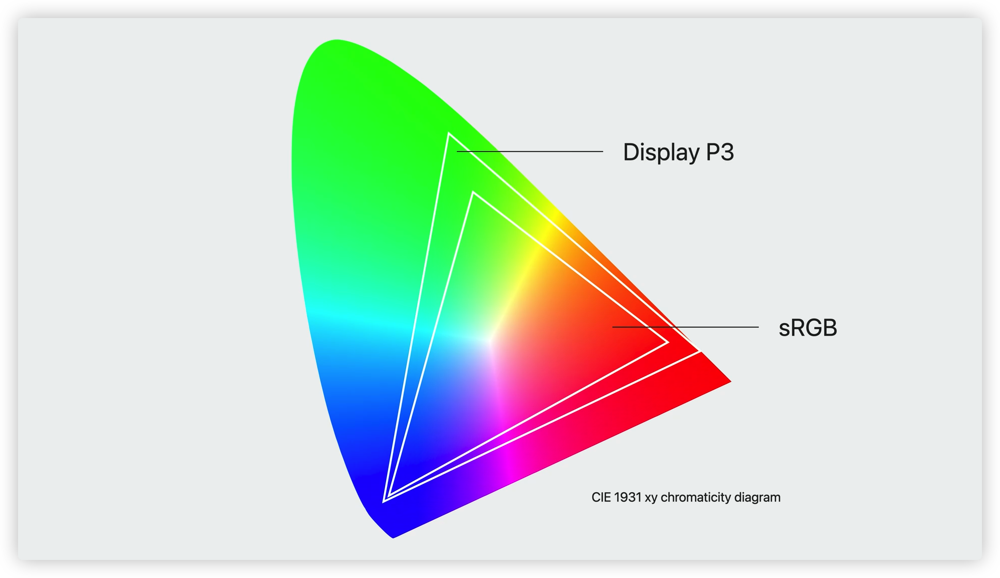

假设上面的色彩图谱是人类肉眼可以观察到的所有的颜色，sRGB 作为当前 WEB 上默认的色域包含了比较多的色彩，相比于 90 年代的显示效果肯定是要丰富多彩的。但是 P3 色域更胜一筹，Apple 七年前就在软硬件层面支持了 P3 广色域。P3 广色域具有以下特点：

- 可以比 sRGB 多显示 50% 的颜色
- 更亮的显示效果
- 更深的饱和度

CSS 中可以通过媒体查询测试当前设备是否支持 P3 广色域：

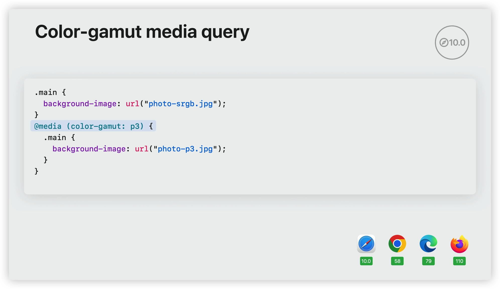

通过 `@media (color-gamut: p3) {}` 语句来包含想要在支持 P3 色域的设备上执行的样式。Apple 从 Safari 10.0 就支持了这个特性。

> [色域 - MDN](https://developer.mozilla.org/en-US/docs/Web/CSS/@media/color-gamut)

### 定义颜色

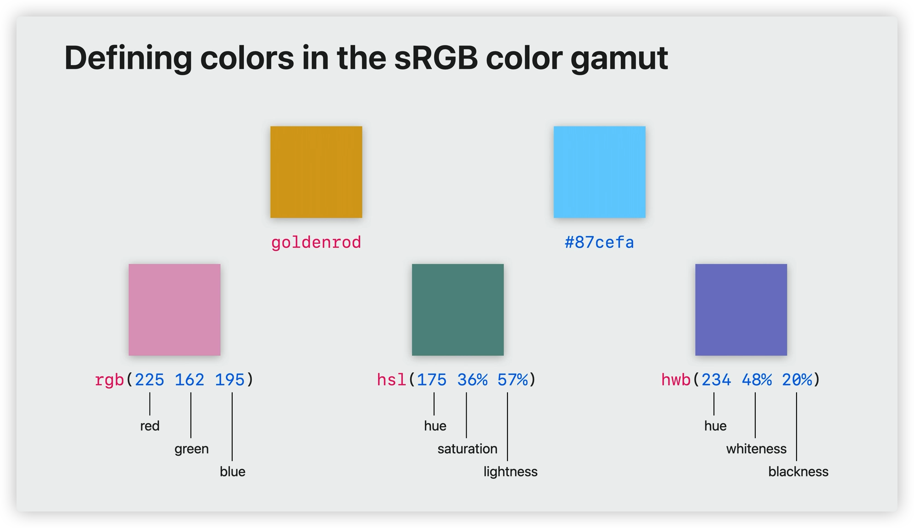

WEB 中常见定义颜色的方式有如上图所示的五种：

- 预设的颜色值，比如 white、green、black [named-color - MDN](https://developer.mozilla.org/en-US/docs/Web/CSS/named-color)
- 十六进制值 [hex-colors - MDN](https://developer.mozilla.org/en-US/docs/Web/CSS/hex-color)
- rgb 函数，接收三个参数，分别对应红色值，绿色值，蓝色值，每个值范围都是 0 - 255。[rgb - MDN](https://developer.mozilla.org/en-US/docs/Web/CSS/color_value/rgb)
- [hsl 函数](https://developer.mozilla.org/en-US/docs/Web/CSS/color_value/hsl)，接收三个参数，分别对应[色相](https://developer.mozilla.org/en-US/docs/Web/CSS/hue)、饱和度(范围 0% - 100%)、亮度(范围 0% - 100%)
- [hwb 函数](https://developer.mozilla.org/en-US/docs/Web/CSS/color_value/hwb)，接受三个参数，分别对应色相、白度，黑度。

上面这五种方式可以定义出相同的色值，但是都局限于 sRGB 色域中，如果想要定义仅存在于 P3 色域的颜色，需要用到新的色值定义方式。

它们分别是

- [lch](https://developer.mozilla.org/zh-CN/docs/Web/CSS/color_value/lch)
- [oklch](https://developer.mozilla.org/zh-CN/docs/Web/CSS/color_value/oklch)
- [lab](https://developer.mozilla.org/zh-CN/docs/Web/CSS/color_value/lab)
- [oklab](https://developer.mozilla.org/zh-CN/docs/Web/CSS/color_value/oklab)

这四种色值定义方法可以呈现包含 P3 色域在内的任何色域中的颜色。

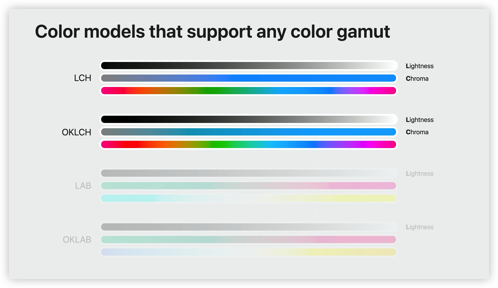

- 所有方法中的 L 代表了色彩的亮度（Lightness）
- lch 和 oklch 中的 c 衡量了色度（Chroma）
- lch 和 oklch 中的 h 代表了色相

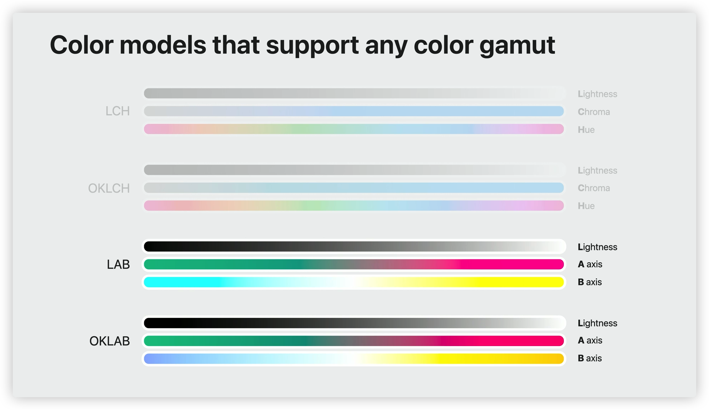

- lab 和 oklab 中的 a 为介于 -125 和 125 之间的数值或者是介于 -100% 和 100% 之间的百分比，指定了在 Lab 色彩空间中沿 a 轴的距离，即颜色绿或红的程度。
- lab 和 oklab 中的 b 为介于 -125 和 125 之间的数值或者是介于 -100% 和 100% 之间的百分比，指定了在 Lab 色彩空间中沿 b 轴的距离，即颜色蓝或黄的程度。

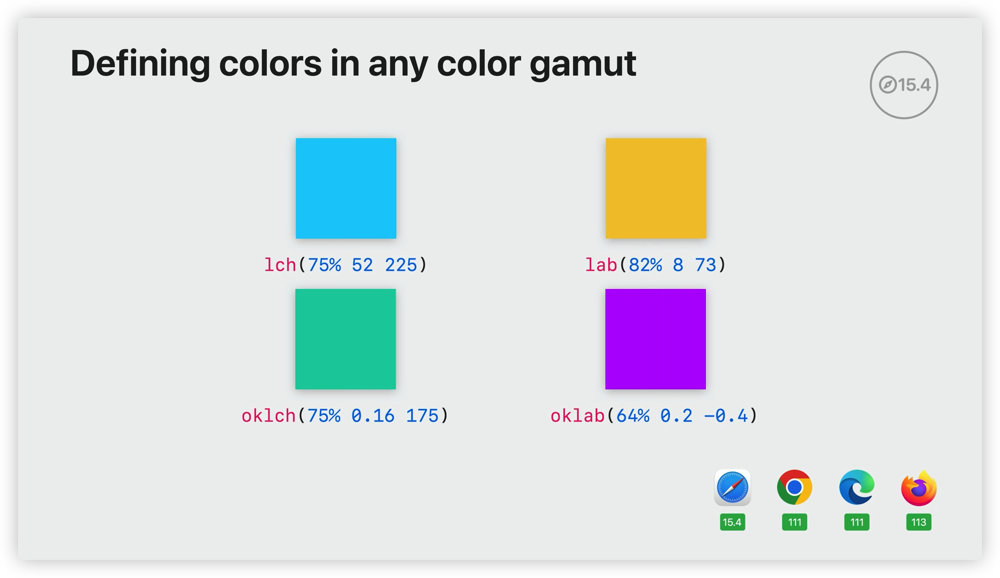

Safari 15.4 开始支持这四种颜色定义函数，可以用来定义任何色域中的颜色。Chrome、Edge 和 Firefox 在今年也支持了上述四种色彩定义函数。

初次之外，还可以使用 color() 函数来定义颜色。

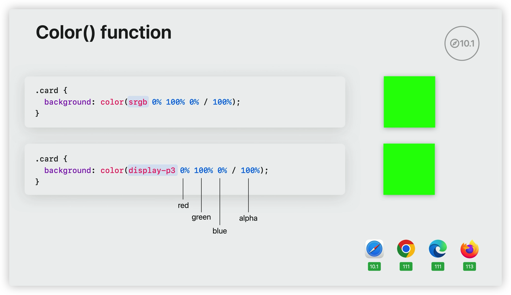

[color()](https://developer.mozilla.org/en-US/docs/Web/CSS/color_value/color) 接收以下参数：

- 色域：包括 `srgb`、`display-p3`、`srgb-linear` 等
- p1、p2、p3：指定色域所接收的值
- alpha: 透明度，取值范围 (0-1/0%-100%)

Safari 从 10.1 开始就已经支持了 color() 函数来指定在某个色域下的颜色值了。

关于 CSS 工作组对于色彩更多的定义请参考 [CSS Color Module Level 5](https://drafts.csswg.org/css-color-5/)。

### 引用颜色

在以前，如果想要在 CSS 中引用之前已经定义过的颜色一般来说是通过 CSS 预处理器来实现的，而 [Relative Color syntax](https://www.w3.org/TR/css-color-5/#relative-colors) 也可以达到同样的效果了。

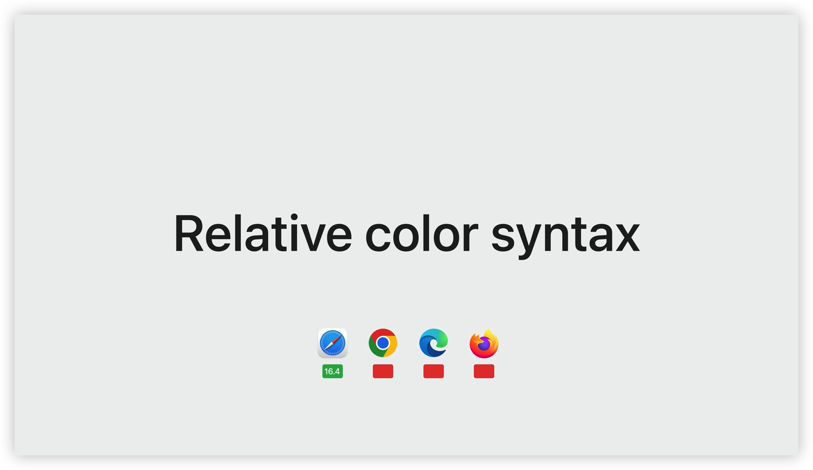

> Safari 从 16.4 开始支持 Relative color syntax，其它浏览器暂不支持该特性

下面我们来看下实际的用法。

1.定义一个颜色 color original

```CSS
background: #87cefa;
```

2.引用 original 作为 from 的值

```css
background: rgb(from #87cefa);
```

3.根据新定义颜色的函数的值进行插值操作

```css
background: rgb(from #87cefa r g b / 0.7);
```

这里的效果就是基于 `#87cefa` 这个颜色值作为基底颜色，然后在 rgb 函数中保留原本基底颜色的 red、green、blue 值，但是修改其透明度为 70%。

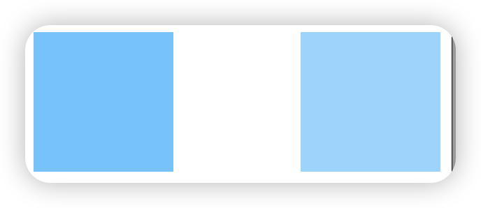

更多用法请参考 [在线 Demo - 请使用 Safari 16.4 及以上版本打开](https://stackblitz.com/edit/web-platform-dmcebx?file=index.html)

Relative color syntax 还可以很便捷的用来定义设计系统中的色盘。

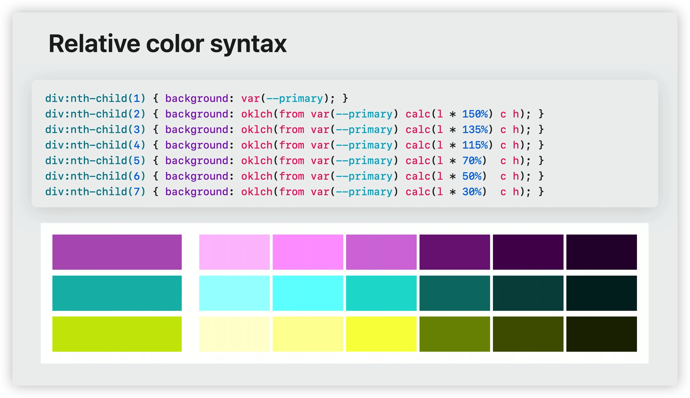

如上图所示，定义一个基准颜色之后，通过 Relative color syntax 修改 lightness 就可以实现一个色盘的搭建。

### 渐变色

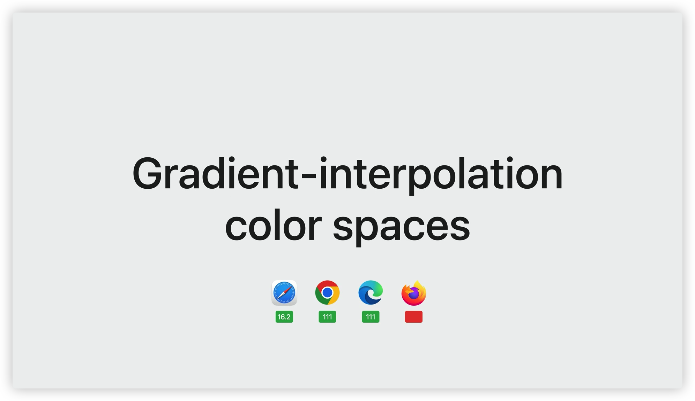

> 设置渐变色的色彩空间特性在 Safari 16.2、Chrome 111 、Edge 111 中开始支持，Firefox 暂不支持。
>
> [color-interpolation - MDN](https://developer.mozilla.org/en-US/docs/Web/CSS/color-interpolation-method)

在 WEB 开发中可以通过 [linear-gradient](https://developer.mozilla.org/zh-CN/docs/Web/CSS/gradient/linear-gradient) 函数实现渐变色效果，如下图所示：

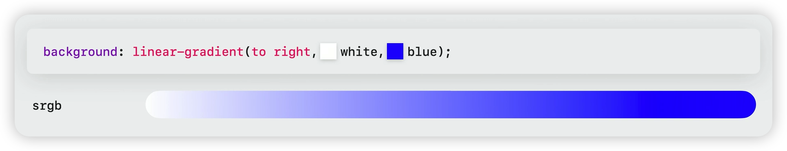

我们设置了从左往右过滤的渐变色，左侧为白色，右侧为蓝色。多年以来，使用 linear-gradient 实现的渐变色都是基于 sRGB 色彩空间的。从 Safari 16.2 开始，支持在 linear-gradient 中指定色彩空间，从而达到更精准的渐变效果。

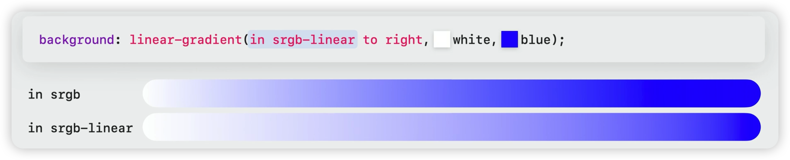

如上图所示，我们设置渐变色的色彩空间为 `srgb-linear` 后，得到的渐变色过渡效果更加线性。

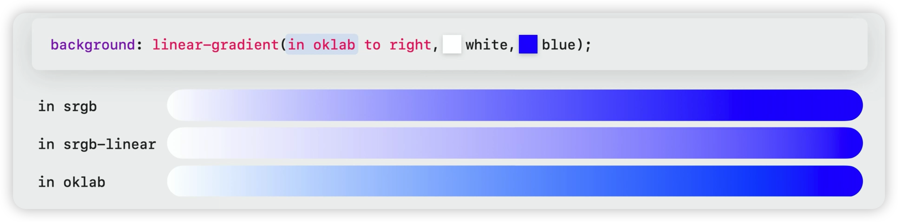

但是 `srgb-linear` 色彩空间下中间区域会呈现偏紫的效果，因此，我们可以选择 `oklab` 作为渐变色的色彩空间来让中间区域的蓝色效果更加明显。

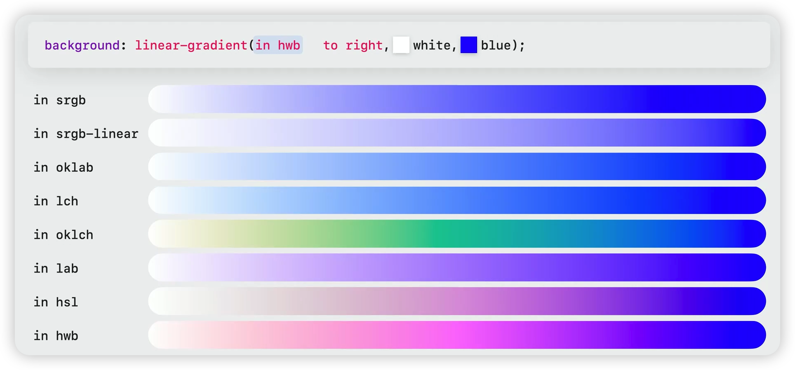

除了 oklab 之外，我们还可以设置其它不同的色彩空间。值得一提的是，具体选择使用哪种色彩空间完全取决于你的项目和设计，并不存在说哪一个色彩空间是最好的说法。

### 颜色混合

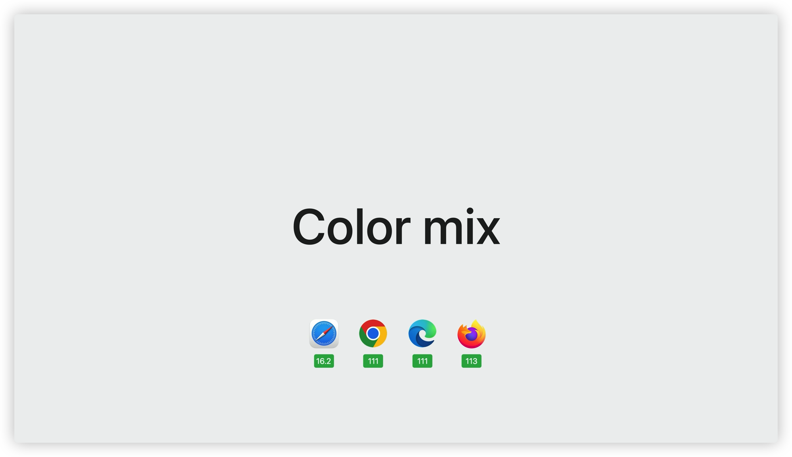

> color mix 功能在 Safari 16.2、Chrome 111、Edge 111 以及 Firefox 113 及以上版本中可用。
>
> [Color mix - MDN](https://developer.mozilla.org/en-US/docs/Web/CSS/color_value/color-mix)

Safari 16.2 开始，你可以在 CSS 中混合颜色了，用法很简单，使用 color-mix 函数定义色值，需要指定在哪个色彩空间下，以及要混合的颜色即可。

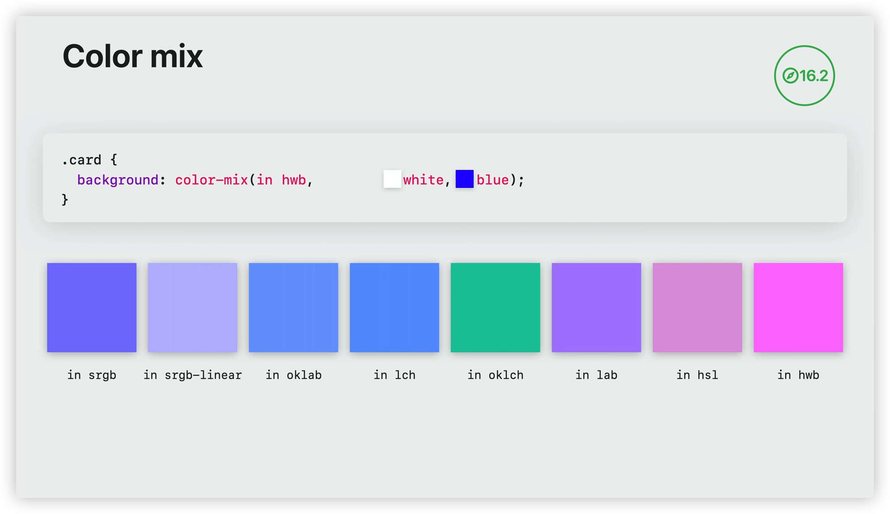

如上图所示，这里混合的是白色和蓝色，通过指定不同的颜色空间，混合的结果也大相径庭。

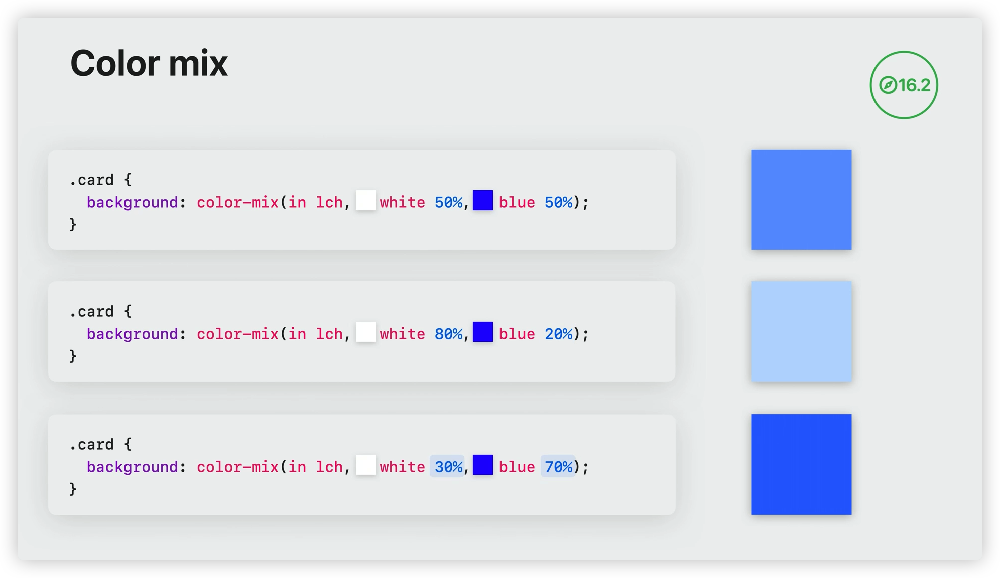

除了可以指定要混合的颜色之外，我们还可以指定混合的比例。默认情况下，color-mix 函数会以 50%-50% 的比例进行混合，我们可以自由调整这个比例来得到我们想要的效果。

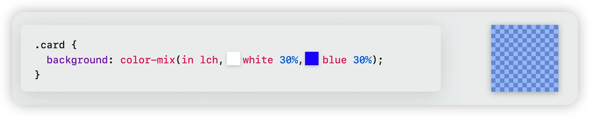

更加方便的是，如果我们想要设置混合的颜色的透明度，只需要设置要混合颜色的比例不超过 100%，那么透明度就等于要混合颜色的比例之和。如上图所示，白色和蓝色的混合比例各自 30%，最后得到的颜色就会拥有 60% 的透明度。

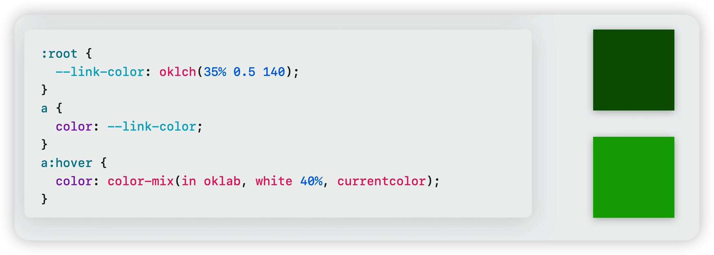

我们甚至可以在 color-mix 函数中使用 [currentColor](https://developer.mozilla.org/zh-CN/docs/Web/CSS/color_value#currentcolor_%E5%85%B3%E9%94%AE%E5%AD%97) 关键字来混合当前元素的颜色。如上图所示，a 标签使用的在 root 伪元素上定义的 --link-color，是一个深色的效果。然后在 a 标签的 hover 伪类上使用 color-mix 函数，约定在 oklab 色彩空间下，混合 40% 的白色，从而达到鼠标移动到 a 标签之后是一个更亮的绿色的效果。

### Safari 对 P3 色域的支持

Safari 浏览器

- Safari 10.0 支持 P3 色域的图片
- Safari 10.1 全面支持 P3 色域
- Safari 15.2 支持 Canvas 上的 P3 色域
- Safari 16.4 通过 `drawingBufferColorSpace` 支持在 WebGL Canvas 中使用 P3 色域

Safari 开发者工具

- Safari 13.1 支持 P3 色域的颜色选择器
- Safari 15.2 在开发者控制台的 Graphics 菜单中支持 P3 色域

正在进行中的 P3 色域适配工作

- WebGL Canvas 中使用 `unpackColorSpace`
- SVG 滤镜

## Selectors

CSS 这些年取得的进步不仅带来了设计上的更多的可能性，而且还使这些设计在编码上更加容易。

### :user-valid & :user-invalid

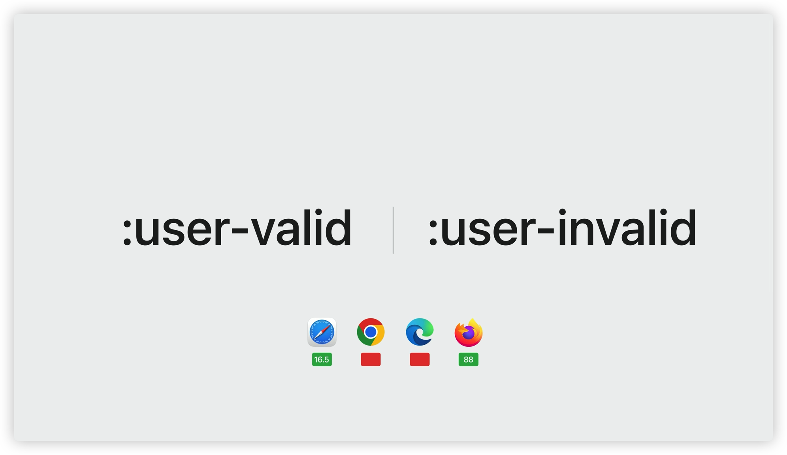

> `:user-valid` 和 `:user-invalid` 伪选择器在 Safari 16.5、Firefox 88 及以上版本中可用，Chrome 和 Edge 暂不可用。
>
> [伪类选择器 - MDN](https://developer.mozilla.org/zh-CN/docs/Web/CSS/Pseudo-classes)

`:user-valid` 和 `:user-invalid` 伪选择器可以根据用户是否正确的填写了表单内容来呈现不同的样式。但是在这之前，让我们先看看更老版本的 `:valid` 和 `:invalid` 伪选择器吧。

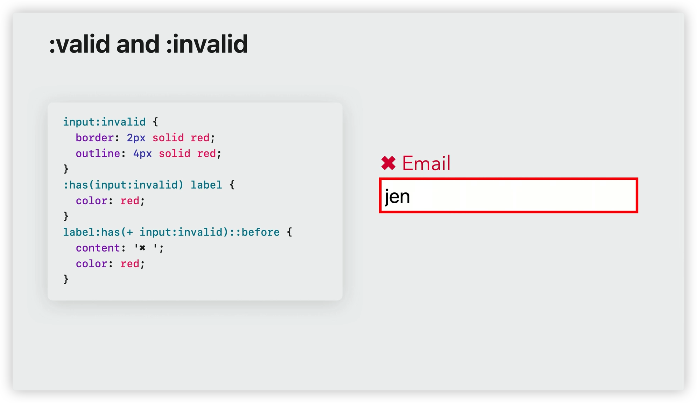

如上图所示，通过 `:valid` 和 `:invalid` 伪类选择器可以在用户输入不正确的邮箱地址的时候提示用户输入有误。

首先通过 `:invalid` 伪类选择器匹配到 `input` ，然后设置输入框在无效的情况下的样式

```css
input:invalid {
  border: 2px solid red;
  outline: 4px solid red;
}
```

然后通过 `:has` 结合 `:invalid` 匹配到 `label`，设置输入框无效时 `label` 的样式

```css
:has(input:invalid) label {
  color: red;
}
```

最后通过 `:has`、`:invalid` 和 `::before` 伪元素实现输入框输入无效时在 `label` 内容前插入一个红色的叉

```css
label:has(+ input:invalid)::before {
  content: "× ",
  color: red;
}
```

最后我们来看下实际的效果：

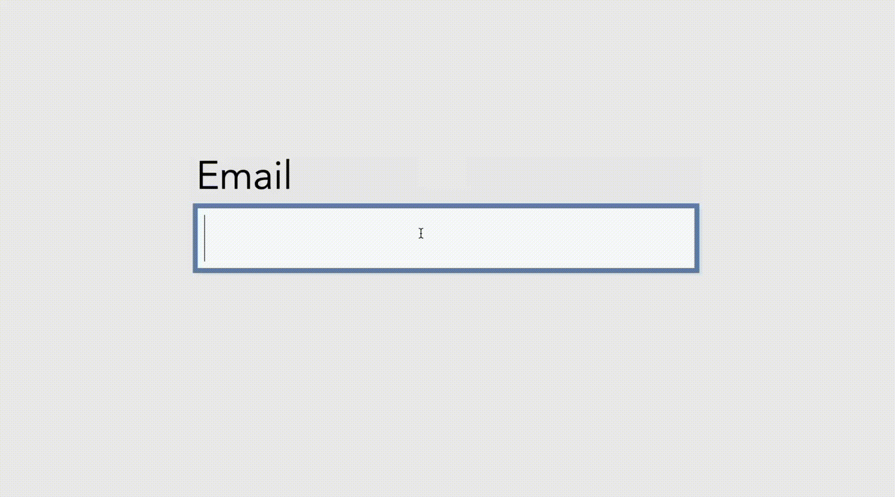

可以看到，效果并不是我们最终想要的，原因是在输入过程中，`:invalid` 就会被匹配从而导致其实用户并没有输入完成但是却被判定为了输入无效。通常来说开发者可以通过 `JavaScript` 来解决这个烦人的问题。

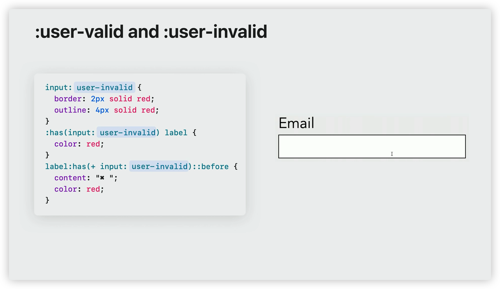

不过现在我们可以通过 `:user-invalid` 和 `:user-valid` 来解决这个问题，因为这两个伪类选择器在底层使用了更加复杂的算法来确定一个表单字段是有效还是无效的。

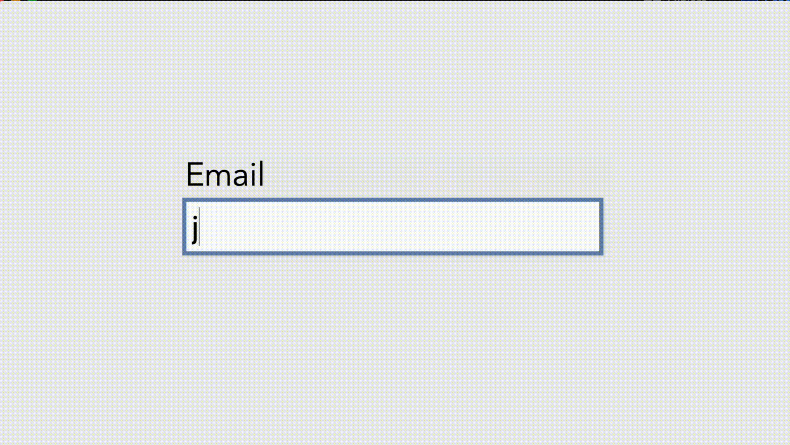

可以看到，使用了 `:user-valid` 和 `:user-invalid` 之后，在用户输入没有完成时，是不会提示输入无效的，只有用户的焦点离开了输入框之后，才会去真正判断用户的输入是否有效。

[在线 Demo - 请使用 Safari 16.5 及以上版本体验](https://stackblitz.com/edit/web-platform-gnxvlq?file=page2.html,index.html)

### :has

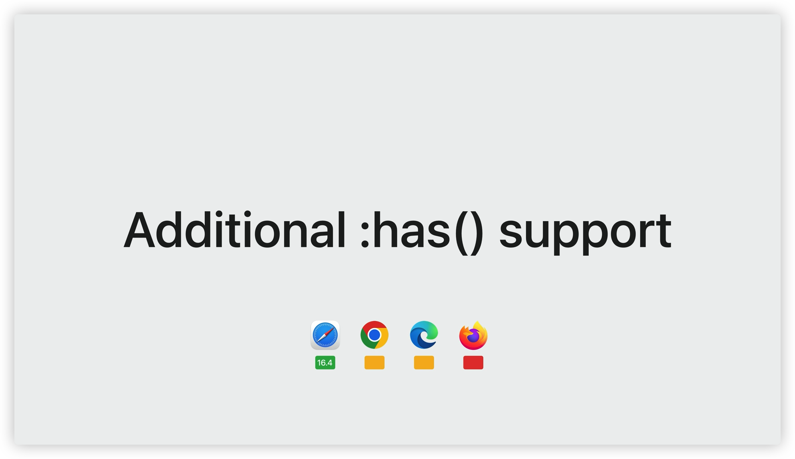

> `:has()` 伪类选择器支持更多的伪类功能目前仅在 Safari 16.4 及以上版本上可用。

正如我们上面所看到的，`:user-invalid` 和 `:has()` 结合在一起之后可以提供更加强大的功能。事实上，Apple 今年在 `:has()` 原有基础上拓展支持了更多的伪类来增强 `:has()` 的功能。

```CSS
:has(:lang(ja)) {...}
:has(:lang(zh-cmn)) {...}
:has(:lang(en-US)) {...}
```

`:has(:lang())` 可以根据页面中的不同的语言来设置对应的样式。

```css
:has(:playing) {
  ...;
}
:has(:paused) {
  ...;
}
:has(:seeking) {
  ...;
}
:has(:buffering) {
  ...;
}
:has(:stalled) {
  ...;
}
:has(:picture-in-picture) {
  ...;
}
:has(:volume-locked) {
  ...;
}
:has(:muted) {
  ...;
}
```

`:has()` 还可以与多媒体伪类结合在一起使用，通过匹配不同的音视频状态来设置相应的样式。

### :dir

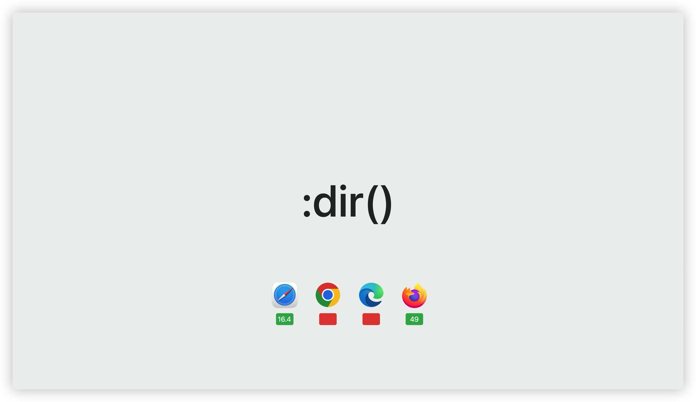

> `:dir` 伪类仅在 Safari 16.4 、Firefox 49 及以上版本支持，Chrome 和 Edge 暂不支持。
>
> [:dir() -MDN](https://developer.mozilla.org/zh-CN/docs/Web/CSS/:dir)

`:dir` 伪类很好的填补了 CSS 中支持语言方向的空白。

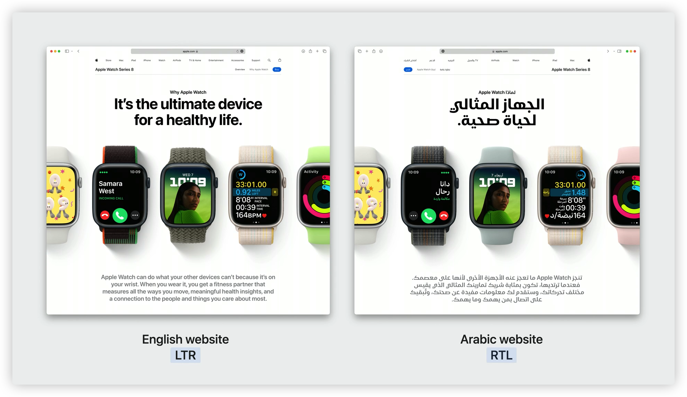

根据语言的排版，文字可以从左往右显示，也有可能从右往左显示，通常使我们使用 `LTR` 和 `RTL` 简写来表达这两种不同的文字排列方式。

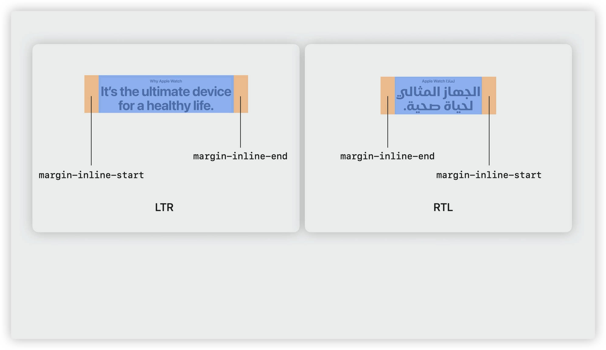

如今，CSS 拥有越来越多的「逻辑」属性可以让我们来表示文本流的开始和结束而不是左侧和右侧。如上图所示，通过 `margin-inline-start` 和 `margin-inline-end` 而不是 `margin-left` 和 `margin-right` 来表示间距可以在 `LTR` 和 `RTL` 布局中都能正常显示。

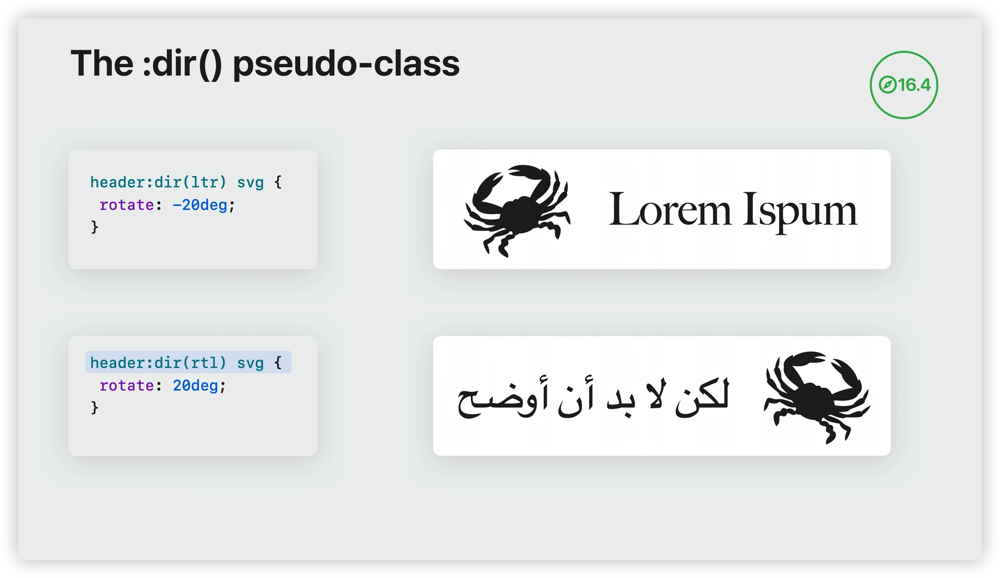

不过，不是所有的场景都可以通过 CSS 的「逻辑」属性来解决。比如上图右侧的效果，在 `LTR` 语言布局中，svg 图片逆时针旋转 20 度，而在 `RTL` 语言布局中，svg 图片则顺时针旋转 20 度，我们就可以通过 `:dir()` 伪类来实现，通过传入 `ltr` 或 `rtl` 来告诉浏览器我们想要在哪个语言方向上设置样式。

## Typography

CSS 今年还带来了一些功能，可以将排版中的细节完善到绝对完美。

### Line-height units

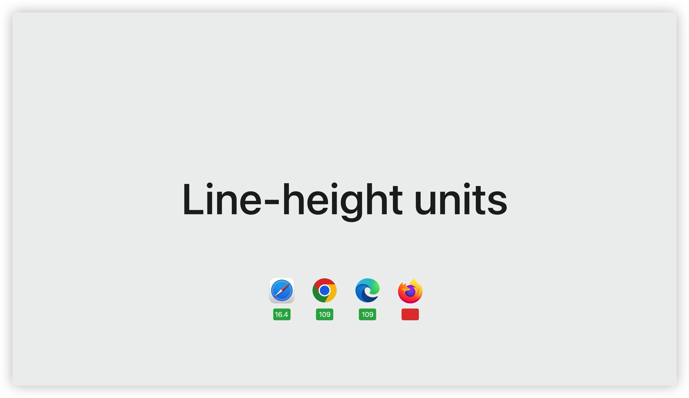

在 CSS 中，我们有许多不同种类的单位可以用来定义长度。

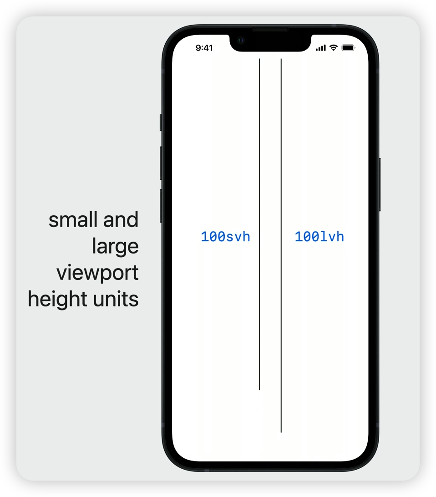

有些单位与视口大小有关，比如 svh 和 lvh。

> svh: small viewport height units，即小视口高度
>
> lvh: large viewport height units，即大视口高度
>
> [viewport variants - W3C](https://www.w3.org/TR/css-values-4/#viewport-variants)
>
> [viewport units - web.dev](https://web.dev/viewport-units/)
>
> 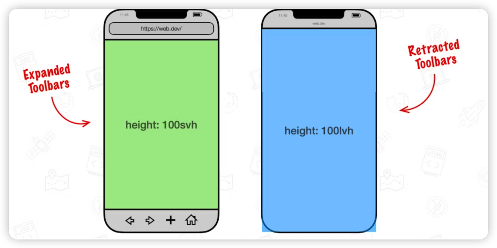

而有些单位与容器大小有关，比如 `cqb` 和 `cqi`

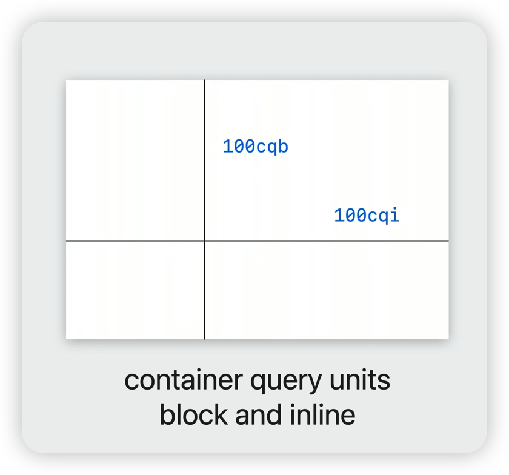

cqb: 1% of a query container's block size，即查询容器块尺寸的 1%。

cqi: 1% of a query container's inline size，即查询容器行向尺寸的 1%。

> [容器查询单位 - MDN](https://developer.mozilla.org/zh-CN/docs/Web/CSS/CSS_container_queries#%E5%AE%B9%E5%99%A8%E6%9F%A5%E8%AF%A2%E9%95%BF%E5%BA%A6%E5%8D%95%E4%BD%8D)

而其它单位与排版中的尺寸有关。

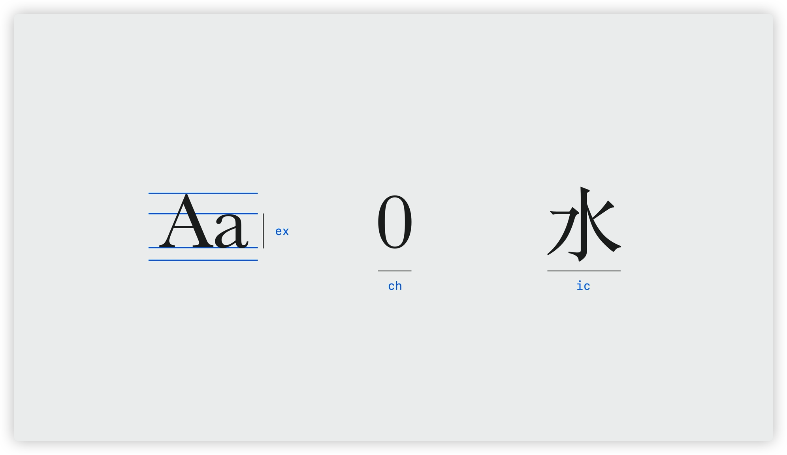

如上图所示：

- ex: 字体的 X 字高（x-height）

  > [x-height - 维基百科](https://zh.wikipedia.org/wiki/X%E5%AD%97%E9%AB%98)

- ch: 字体中窄字形的行内尺寸，由“0”（ZERO，U+0030）字形表示。
- ic: 字体中全角字形的行内尺寸，由“水”（CJK 水表意文字，U+6C34）字形表示。

> [距离单位 - MDN](https://developer.mozilla.org/zh-CN/docs/Web/CSS/CSS_Values_and_Units#%E5%B0%BA%E5%AF%B8)

上面所说的行内尺寸为水平书写模式下的宽度或垂直书写模式下的高度。这些单位在浏览器中已经可用一段时间了。

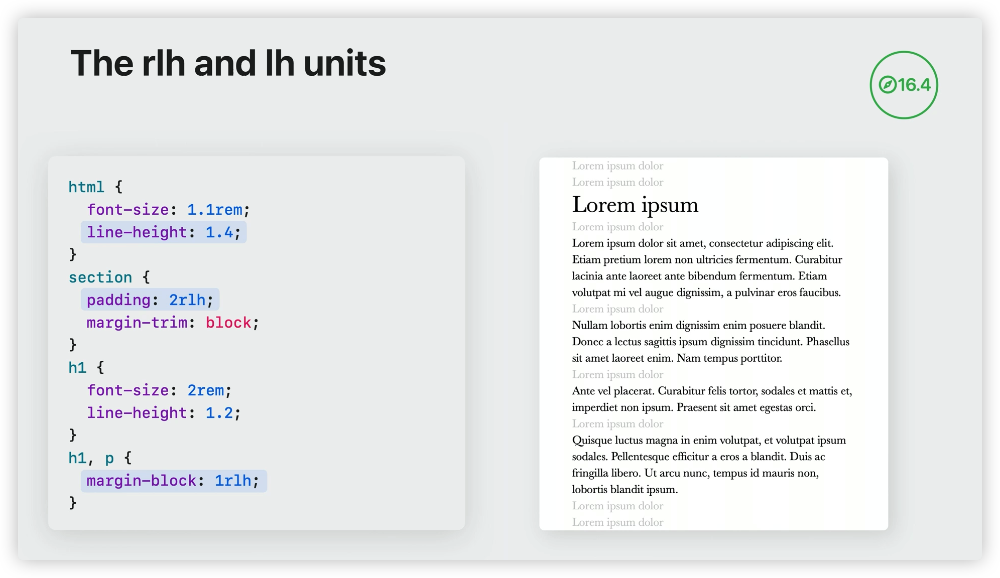

除了上面提到的单位与排版中的字体大小有联系之外，CSS 还推出了新的 `rlh` 和 `lh` 单位分别表示根元素行高和当前元素行高。

如上图所示，首先设置 html 选择器下的行高为 1.4，然后设置 section 下的内边距为 2 倍根节点行高的大小，最后设置 h1 和 p 标签的外边距为 1 倍根节点行高的大小。通过 `rlh` 和 `lh` ，我们可以很方便地基于元素的行高来设置布局的样式。

### Font size adjust

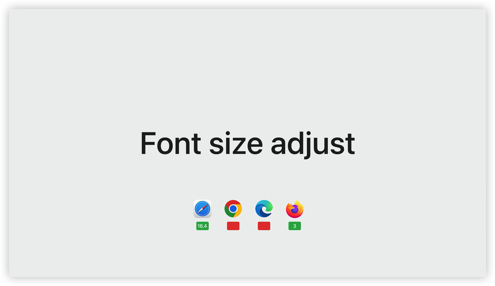

> `font-size-adjust` 在 Safari 16.4 和 Firefox 3 及以上版本中可用，Chrome 和 Edge 暂不支持。
>
> [font-size-adjust MDN](https://developer.mozilla.org/zh-CN/docs/Web/CSS/font-size-adjust)

将网络上的数字排版打磨到高标准的传统排版存在许多挑战。其中之一就与字体大小有关。如果你是一位 WEB 网页设计师，你应该会仔细的去选择字体类型和字体大小。但实际上在用户侧你所期望生效的字体可能并没有被下载或者完全不可用，所以这就是为什么最好的做法是在 font-family 中声明一系列字体，为浏览器提供兜底的方案。

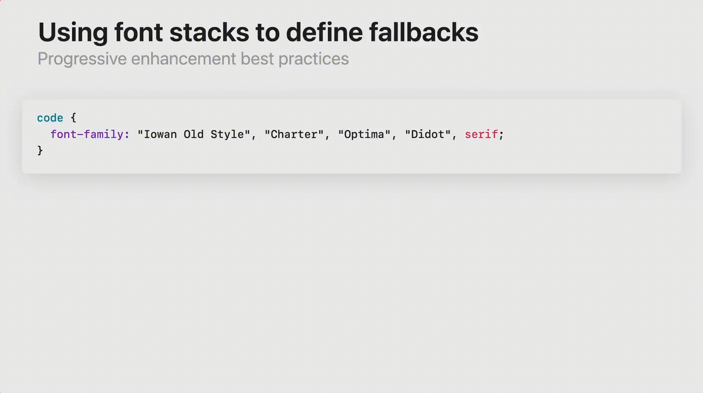

浏览器会按照 font-family 属性中所声明的字体顺序来尝试显示文字，第一个被成功匹配的字体将会成为最终显示的字体。

同样地，一个字体在一个特定的大小下视觉上的大小并不总是能够被开发者所掌控的。

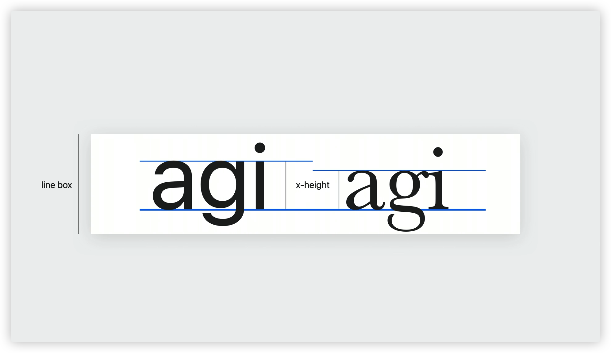

如上图所示，左侧的文字是 `SF Hello` 字体，右侧的文字是 `Baskerville` 字体，它们的 `font-size` 都是一致的，但是在视觉上明显能够看出来左侧的文字更大，原因在于 `SF Hello` 字体具有更大的 `x-height` ，这是在创建字体文件时所决定的。

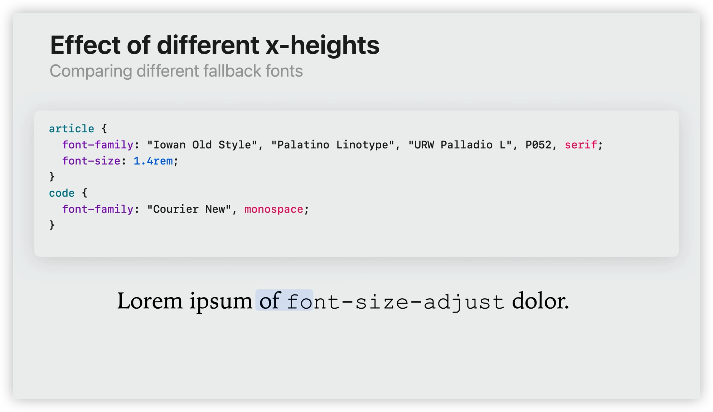

如上图所示，article 标签上设置了 `1.4rem` 作为字体大小，同时 code 和 article 设置了不同的字体。但是在视觉上，我们可以明显看出 code 部分的字体明显小于 article 的字体，特别是 of 和 font 之间的 `f` 的区别。

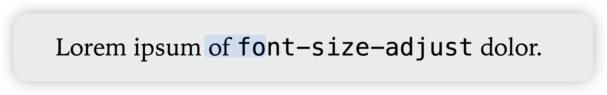

而如果 code 部分回滚到了 `monosapce` 字体的话，看起来反而比正文的内容更大了。我们可以在 code 上设置 `font-size: 120%` 来放大 code 下的字体大小，但是如果浏览器最终使用的是 monospace 字体渲染 code 的话，效果反而适得其反。

我们需要告诉浏览器让这两种不同字体的文字在视觉上能够看起来是一致的大小，`font-size-adjust` 属性正好可以帮助我们达到这个效果。

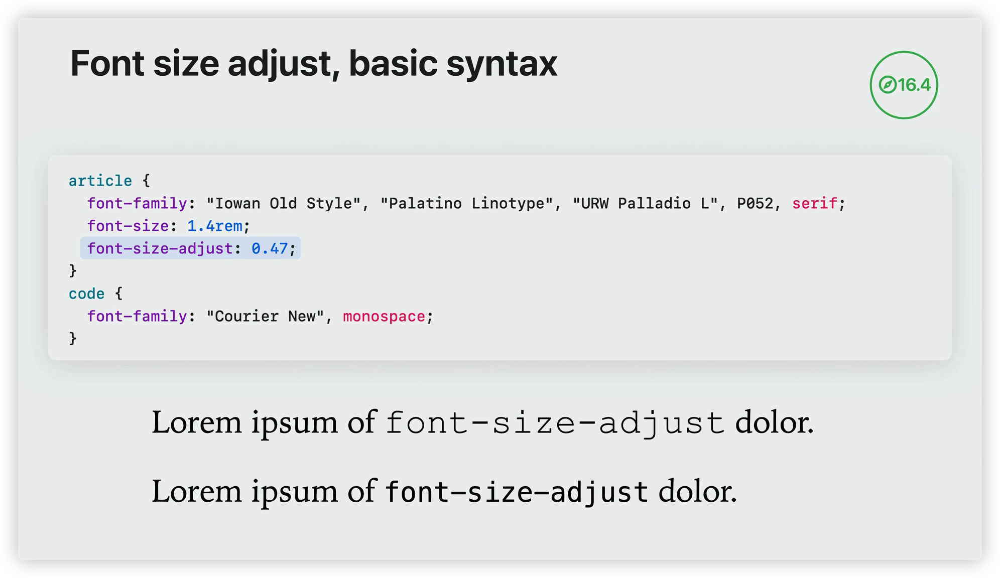

如上图所示，我们设置 article 标签上的 `font-size-adjust` 属性值为 0.47，设置后正文的文字和代码的文字在代码字体不同的情况下看起来都十分协调和统一。

不过，为什么这里会设置 0.47 这个值呢？

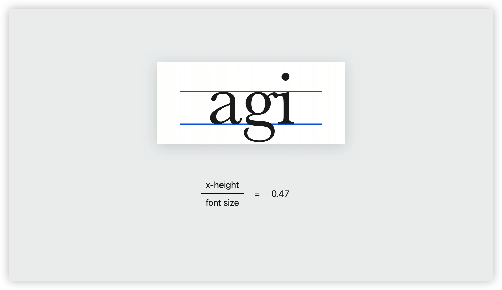

原因在于在 Web 中使用任何拉丁文字字体的 x-height 与 font-size 之间的比值都是 0.47。因此我们在上面的代码中设置的 `font-size-adjust` 为 0.47 其实不仅仅是告诉浏览器 article 标签的文字的任何字体，还是 code 标签的文字的任何字体都需要缩放到 x-height 与 font-size 之间的比值为 0.47。

在 Safari 17 中，我们只需要设置 `font-size-adjust` 的值为 `from-font` 来让浏览器来决策字体缩放的程度。

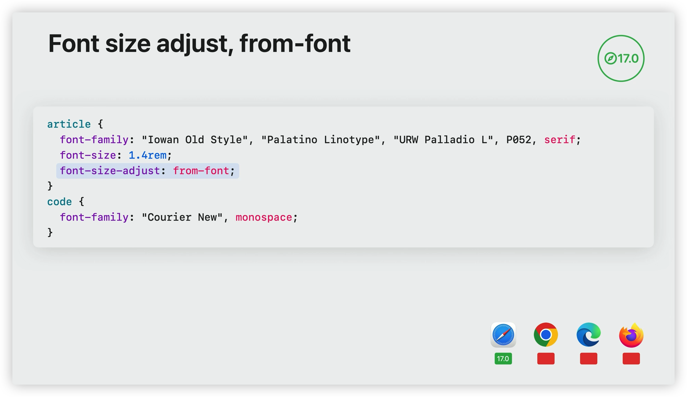

除此之外，在 Safari 17.0 中，我们还可以传递两个值给 `font-size-adjust` 属性、

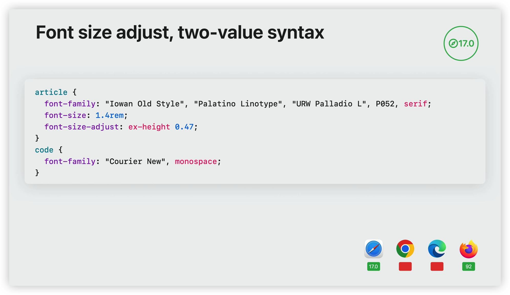

如上图所示，我们设置 `ex-height` 的值为 0.47，这也是默认值。

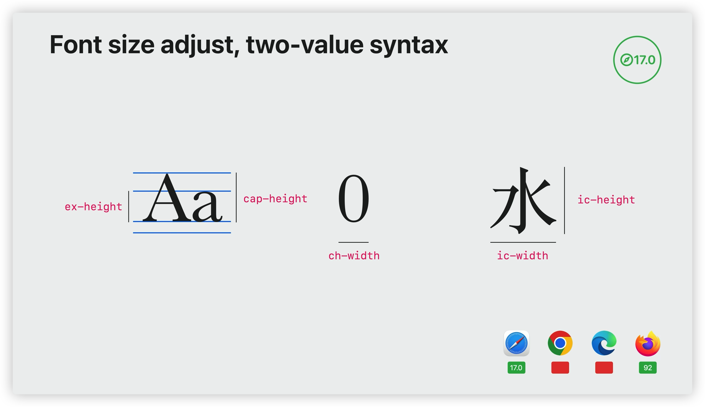

我们还可以设置 `ex-height`、`cap-height`、`ch-width`、`ic-width` 以及 `ic-height` 的值。

除了 `font-size-adjust` 之外，Safari 17 后我们还可以在声明自定义字体的时候设置 `size-adjust` 属性来实现相似的字体缩放效果。

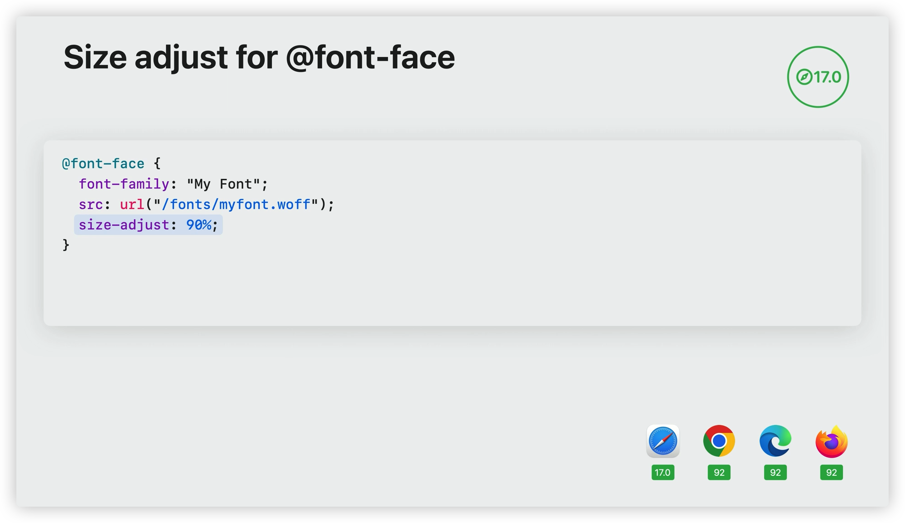

> `size-adjust` 属性在 Safari 17.0、Chrome 92、Edge 92、Firefox 92 及以上版本中可用。
>
> [size-adjust MDN](https://developer.mozilla.org/en-US/docs/Web/CSS/@font-face/size-adjust)

### Text-box trim

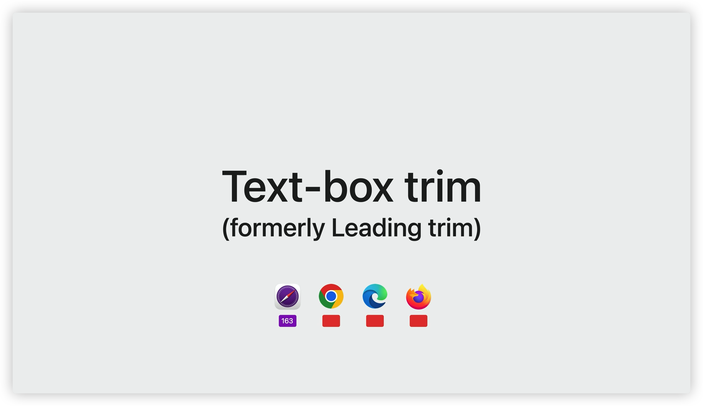

> Text-box trim 目前仅在 Safari Technology Preview 163 及以上版本中可用
>
> [text box trim - w3c](https://www.w3.org/TR/css-inline-3/#leading-trim)

`text-box-trim` 在某种程度上和我们前文提到的 `margin-trim` 类似，都可以帮助我们消除不需要的间距。不过 `text-box-trim` 专注于消除文字容器中的多余的上下间距。

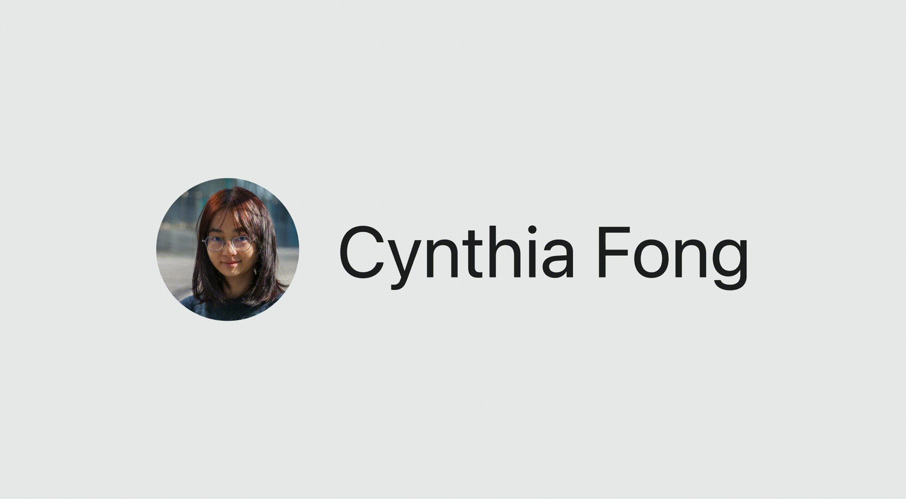

我们在 Web 开发中经常会遇到让一个容器内的两个元素垂直居中的问题，如上面的动图所示，左侧的头像和右侧昵称在逻辑层面是已经垂直居中了。但是在视觉上我们会觉得文字会有一点靠下，原因在于其实是头像与文字所处的 Box 垂直居中，但是文字在 Box 中并不是垂直居中的。

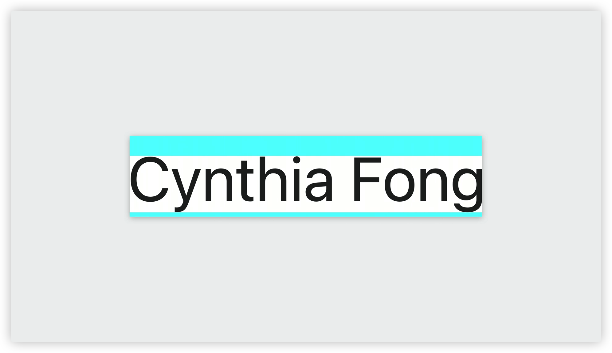

通过上面的截图可以清晰的看出，文字所处的 Box 中顶部和底部有额外的间距，而顶部的间距明显大于底部的间距，所以在视觉上我们就会认为文字是稍稍靠下的。

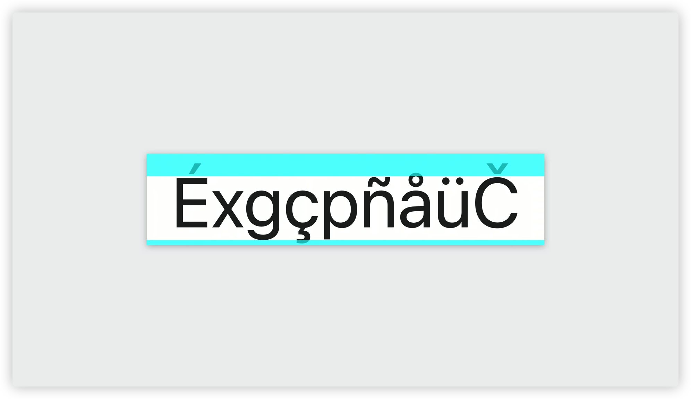

文字顶部额外的空间并不是没有作用的，这段空间可以用来展示重音标记和元音标记以及声调，但这段预留的空间却让 Web 中的文字排版垂直居中效果发生了偏差。

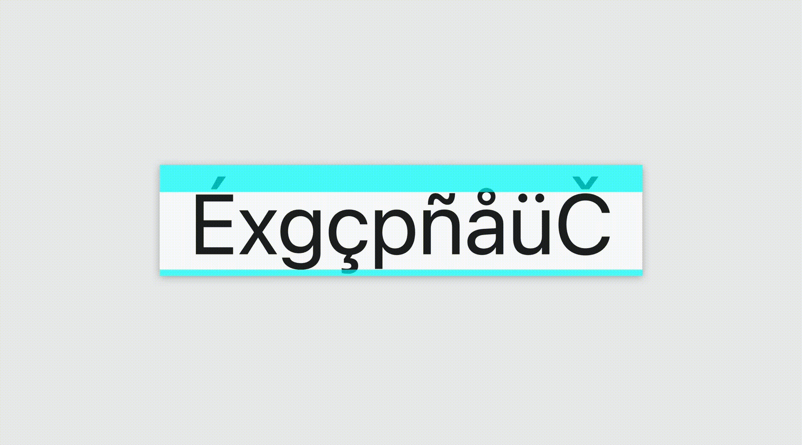

而 `text-box-trim` 可以帮助我们来消除掉文字 box 中上下额外的间距来实现视觉上的垂直居中效果，同时又能完整展示出文字整体的内容。

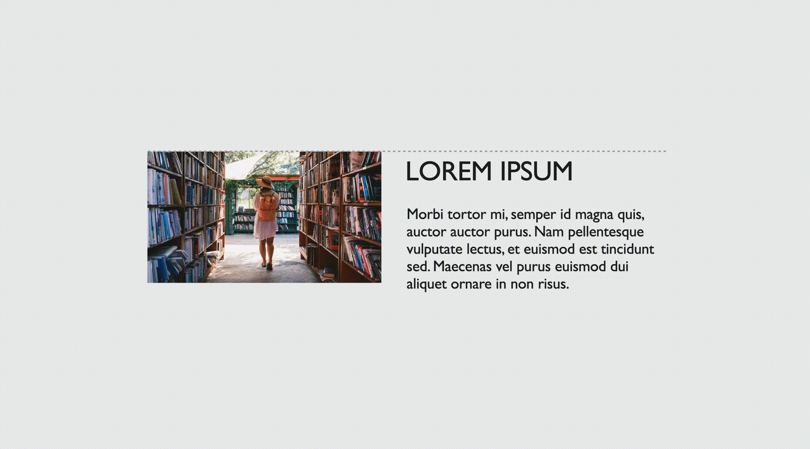

`text-box-trim` 不仅仅可以帮我们解决文字的垂直居中问题，如上面的动图所示，标题文字顶部额外的间距导致无法完美的与图片顶部对齐，而 `text-box-trim` 可以消除顶部的间距从而实现顶部对齐的效果。不过 `text-box-trim` 属性仍未完全定稿，之前它的名称为 `leading-trim` ，因此这是一个正在演化中的 CSS 属性。

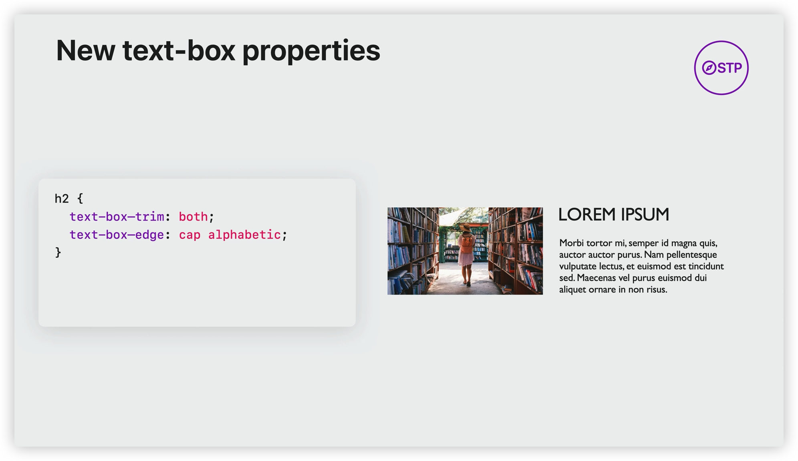

我们通过设置 `text-box-trim` 属性为 `both` 以及设置 `text-box-edge` 为 `cap alphabetic` 来去除 h2 元素顶部和底部额外的间距，不过不用太过在意实现的细节，因为后面可能只需要设置 `text-box-trim` 属性为 `cap alphabetic` 就可以了。

[text box trim 更多示例 - Github](https://github.com/jantimon/text-box-trim-examples)

### Counter styles

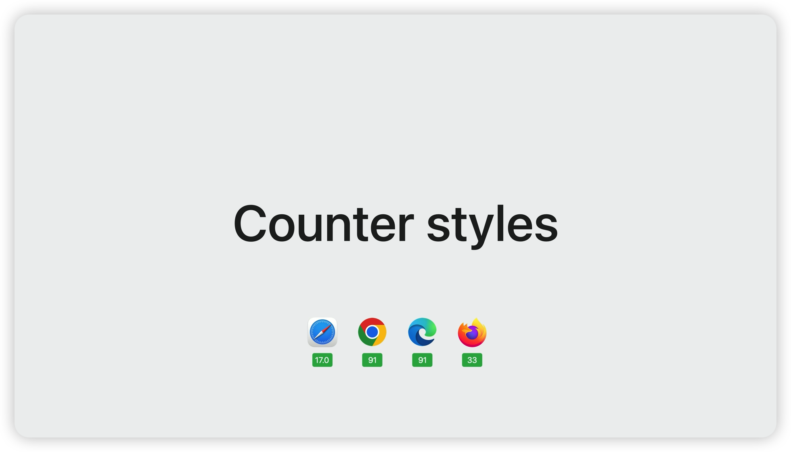

> Counter Styles 在 Safari 17.0、Chrome 91、Edge 91 和 Firefox 33 及以上版本中可用。
>
> [@counter-style - MDN](https://developer.mozilla.org/zh-CN/docs/Web/CSS/@counter-style)
>
> [CSS 计数器 - MDN](https://developer.mozilla.org/zh-CN/docs/Web/CSS/CSS_counter_styles/Using_CSS_counters)

在 WEB 开发中，我们通常会使用 `ol` 标签包裹 `li` 标签实现一个有序的列表。

```html
<ol>
  <li>One</li>
  <li>Two</li>
  <li>Three</li>
  <li>Four</li>
  <li>Five</li>
  ...
</ol>
```

渲染出来最终是这样的效果：

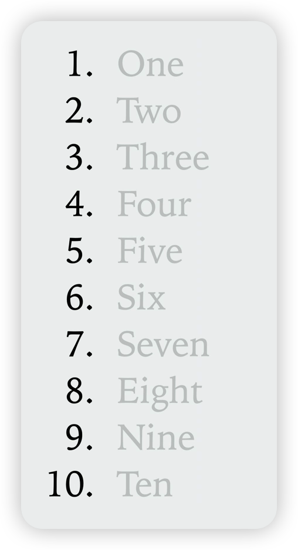

可以看到浏览器在识别到 `ol` 标签之后，自动帮我们生成了一系列递增的「序号」。默认情况下，序号是以阿拉伯数字的形式进行展示的。不过我们可以通过 [`list-style`](https://developer.mozilla.org/zh-CN/docs/Web/CSS/list-style) 属性进行自定义序号的展示，比如，我们可以设置 list-style 为 devanagari - 梵文：

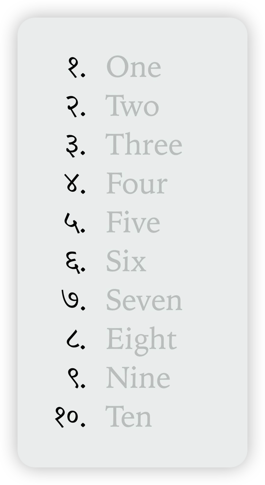

list-style 可以设置的效果不止梵文，预设的语言有数十种：

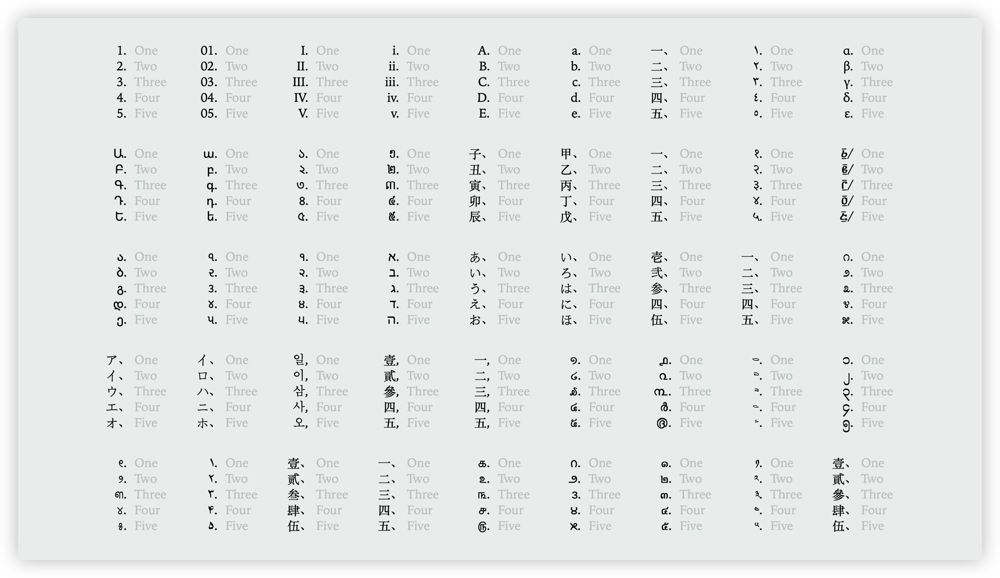

但是并不是所有的语言都被包含在内的，比如 `serbo-croatian` - 塞尔维亚-克罗地亚语，在 list-style 上设置 serbo-croatian 后展示出来的效果和默认的序号样式是一样的，都是阿拉伯数字：

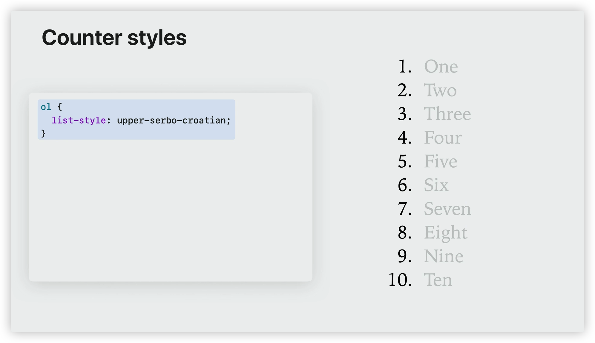

这个时候，Counter styles 就派上用场了。我们可以通过 `@counter-style` 来自定义一个计数的样式：

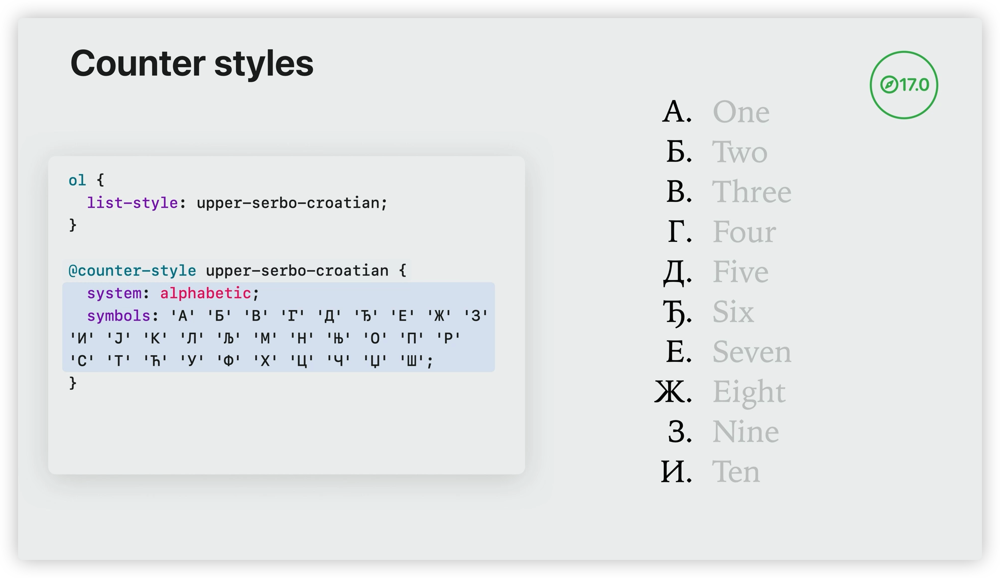

如上图所示，我们先设置计数样式的名称为 `upper-serbo-croatian` 表示我们定义的计数样式为大写的塞尔维亚-克罗地亚语。然后再设置 `system` 字段为 `alphabetic` ，然后设置 `symbols` 为塞尔维亚-克罗地亚语中序号的内容。最后我们设置 ol 标签的 list-style 为 `upper-serbo-croatian` 然后我们就可以得到一个塞尔维亚-克罗地亚语的计数效果。

W3C 国际化工作组发布了一份涵盖全球数百种不同文化和语言的现成计数器样式文档 - [predefined-counter-styles](https://www.w3.org/TR/predefined-counter-styles/)。

Apple 已经增加在了 WebKit 中所支持的语言种类，同时也与 CSS 工作组展开了再所有浏览器中支持这些语言的讨论。这样就可以直接在 list-style 中设置了，不过在这一愿景实现之前，我们可以从 [predefined-counter-styles](https://www.w3.org/TR/predefined-counter-styles/) 中直接找到需要设置的语言对应的代码。

@counter-style 还支持完全自定义的计数器规范，比如：

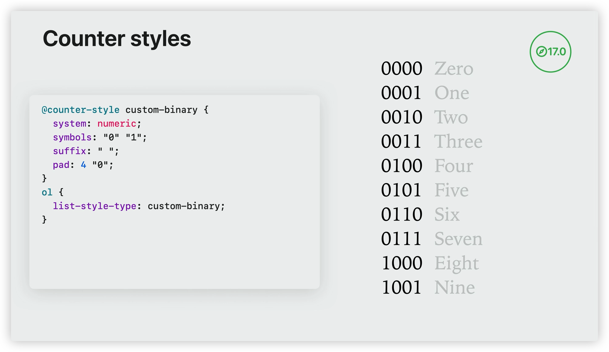

这里我们设置自定义的计数器规范名为：`custom-binary`。它由 `0` 和 `1` 组成，同时告诉浏览器最少展示 4 位字符，不足四位用 `0` 补齐，最终实现了二进制计数的效果。

我们甚至还可以利用 @counter-style 来实现一个 emoji 效果的计数器样式：

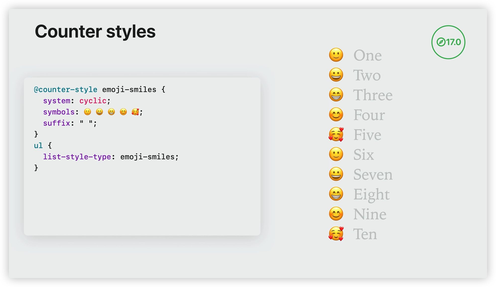

CSS Counters 不仅可以用来设置 ol 有序列表的计数器样式，还可以用来设置页面中其它需要计数的元素。

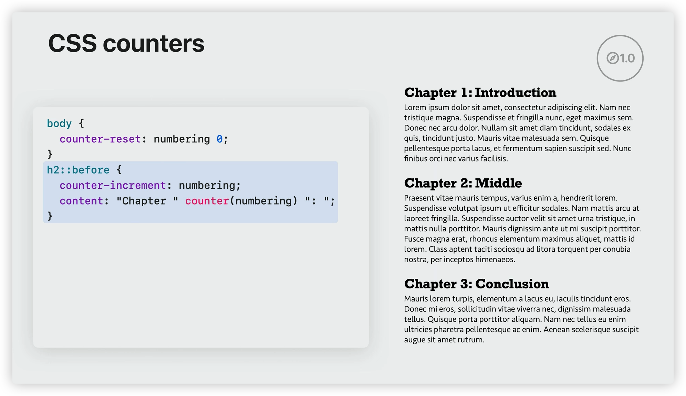

如上图所示，我们首先在 body 元素上设置 `counter-reset` 属性值为 `numbering 0` 来将默认的 CSS 计数器重置为 `numbering` 这一我们自定义的计数器名。

> [counter-reset MDN](https://developer.mozilla.org/zh-CN/docs/Web/CSS/counter-reset)

然后设置 h2 元素的 `::before` 伪元素的 `counter-increment` 为 `numbering`，最后设置伪元素的内容为 `"Chapter " counter(numbering) ":";` ，最终在 h2 元素原本的内容上显示了第几章的效果。

> [counter-increment MDN](https://developer.mozilla.org/zh-CN/docs/Web/CSS/counter-increment)
>
> [counter() - MDN](https://developer.mozilla.org/zh-CN/docs/Web/CSS/counter)

默认情况下，计数器以阿拉伯数字开始计数，不过我们可以利用 `@counter-style` 进一步自定义计数的效果：

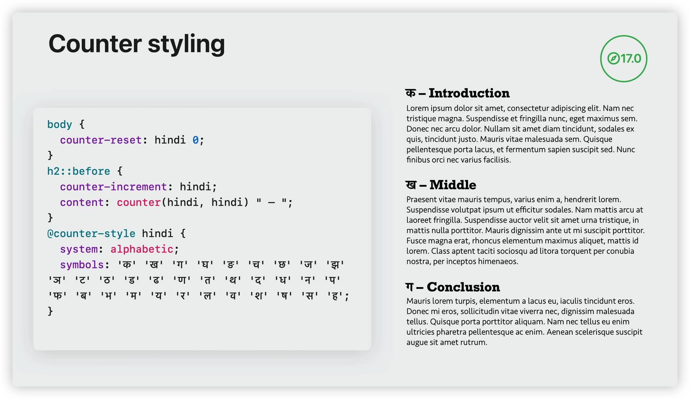

## 总结

Safari 所支持的新 CSS 特性远远不止我们今天所谈到的这些，Apple 十分乐于倾听来自于开发者的建议和 bug 反馈。

### CSS 新特性

| 特性                                                         | 简介                                                         | Safari                 | Chrome | Edge | Firefox                                                 |
| ------------------------------------------------------------ | ------------------------------------------------------------ | ---------------------- | ------ | ---- | ------------------------------------------------------- |
| [Masonry Layout](https://developer.mozilla.org/en-US/docs/Web/CSS/CSS_grid_layout/Masonry_layout) | 结合 Grid 布局实现瀑布流效果                                 | Technology Preview 163 | -      | -    | 需开启 `layout.css.grid-template-masonry-value.enabled` |
| [Margin Trim](https://developer.mozilla.org/en-US/docs/Web/CSS/margin-trim) | 消除容器元素中子元素多余的外边距                             | 16.4                   | -      | -    | -                                                       |
| [P3 Color Gamut](https://developer.mozilla.org/en-US/docs/Web/CSS/@media/color-gamut) | 通过 `@media (color-gamut: p3) {}` 语句来包含想要在支持 P3 色域的设备上执行的样式 | 10.0                   | 58     | 79   | 110                                                     |
| [lch](https://developer.mozilla.org/zh-CN/docs/Web/CSS/color_value/lch)、[oklch](https://developer.mozilla.org/zh-CN/docs/Web/CSS/color_value/oklch)、[lab](https://developer.mozilla.org/zh-CN/docs/Web/CSS/color_value/lab)、[oklab](https://developer.mozilla.org/zh-CN/docs/Web/CSS/color_value/oklab) | 这四种色值定义方法可以呈现包含 P3 色域在内的任何色域中的颜色 | 15.4                   | 111    | 111  | 113                                                     |
| [color()](https://developer.mozilla.org/en-US/docs/Web/CSS/color_value/color) | 指定在某个色域下的颜色值                                     | 10.1                   | 111    | 111  | 113                                                     |
| [Relative Color syntax](https://www.w3.org/TR/css-color-5/#relative-colors) | 基于一个基底色设置新的颜色值                                 | 16.4                   | -      | -    | -                                                       |
| [Color-interpolation](https://developer.mozilla.org/en-US/docs/Web/CSS/color-interpolation-method) | 设置渐变色时可以指定色彩空间来得到不同的渐变效果             | 16.2                   | 111    | 111  | -                                                       |
| [Color mix](https://developer.mozilla.org/en-US/docs/Web/CSS/color_value/color-mix) | 指定色彩空间来混合两个颜色值后得到一个新的颜色值             | 16.2                   | 111    | 111  | 113                                                     |
| [:user-valid](https://developer.mozilla.org/en-US/docs/Web/CSS/:user-valid) & [:user-invalid](https://developer.mozilla.org/en-US/docs/Web/CSS/:user-invalid) | 基于用户所填充的内容是否有效对 form 进行样式的设置，底层采用了更加复杂的算法来决定一个 form 输入项是否有效 | 16.5                   | -      | -    | 88                                                      |
| 增强的 `:has()` 伪类选择器                                   | 可以与 `:lang` 伪类选择器一起使用实现国际化的效果；还可以与音视频的状态的多媒体伪类选择器一起使用 | 16.4                   | -      | -    | -                                                       |
| [:dir()](https://developer.mozilla.org/zh-CN/docs/Web/CSS/:dir) | `:dir()` 伪类选择器很好的填补了 CSS 中支持语言方向的空白     | 16.4                   | -      | -    | 49                                                      |
| 新的长度单位                                                 | 可以通过 `svh`、`lvh`、`cqb`、`cqi`、`ex`、`ch`、`ic`、`rlh` 和 `lh` 这些不同种类的单位来定义长度 | 16.4                   | 109    | 109  | -                                                       |
| [font-size-adjust](https://developer.mozilla.org/zh-CN/docs/Web/CSS/font-size-adjust) | `font-size-adjust` CSS 属性定义字体大小应取决于小写字母，而不是大写字母。在字体较小时，字体的可读性主要由小写字母的大小决定，通过此选项即可进行调整 | 16.4                   | -      | -    | 3                                                       |
| [size-adjust](https://developer.mozilla.org/en-US/docs/Web/CSS/@font-face/size-adjust) | 声明自定义字体的时候设置 `size-adjust` 属性来实现字体缩放效果 | 17.0                   | 92     | 92   | 92                                                      |
| [text box trim](https://www.w3.org/TR/css-inline-3/#leading-trim) | 消除文字容器中的多余的上下间距                               | Technology Preview 163 | -      | -    | -                                                       |
| [@counter-style](https://developer.mozilla.org/zh-CN/docs/Web/CSS/@counter-style) | `@counter-style` 是一个 [CSS](https://developer.mozilla.org/zh-CN/docs/Web/CSS) [at-rule](https://developer.mozilla.org/zh-CN/docs/Web/CSS/At-rule) ，它让开发者可以自定义 counter 的样式。一个 `@counter-style` 规则定义了如何把一个计数器的值转化为字符串表示。 | 17.0                   | 91     | 91   | 33                                                      |

- 如果开发者发现了有关于 Webkit 的 bug，或者希望支持其它新的特性，可以到 [webkit bug 反馈](bugs.webkit.org) 中提交。

- 如果是关于 iOS、iPadOS 和 macOS 中的 Safari 的问题，请通过 [反馈助理](http://feedbackassistant.apple.com) 进行反馈。

- 开发者可以通过 [Can i use](https://caniuse.com/) 来查询新特性在 Safari 上的兼容性从而避免反馈已经支持的 CSS 新特性。

### Safari 新特性

- Safari Technogoly Preview 每隔两周便会更新一个版本，开发者可以在其中体验到 Webkit 的最新功能。

- Safari 17 开始，开发者可以在 Features Flags 中打开未默认开启的特性进行测试。

  - Safari 17 还支持下载模拟器进行调试

    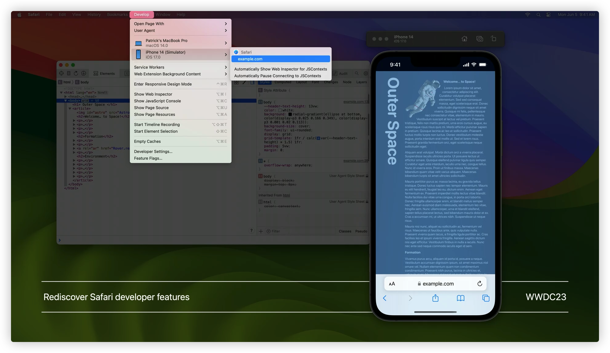

  - Safari 17 带来了全新设计的响应式开发设计菜单

    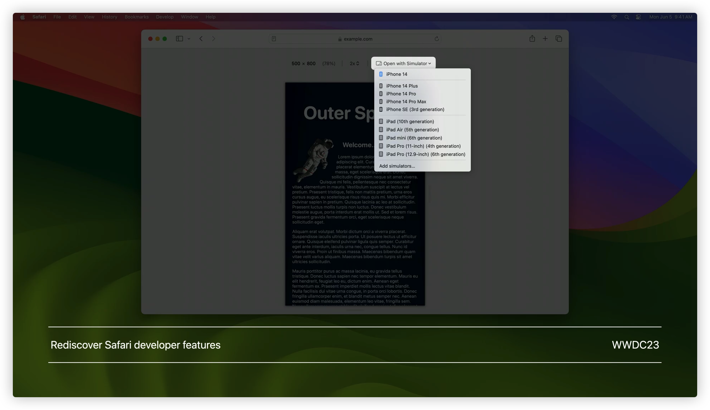

> 关于 Safari 开发者功能的更多细节请参考 [WWDC23 10262 - 重新探索 Safari 开发者功能](https://xiaozhuanlan.com/topic/0356874192)

- Web apps 也在 Mac 中得到了更好的支持，更多内容请查看 [WWDC23 - What’s new in web apps](https://developer.apple.com/wwdc23/10120)。

- Safari 和 Webkit 中即将支持的图片格式，包括 `JEPG XL` 、`HEIC` 和 `AVIF` 以及全新的 `Managed Media Source API`

  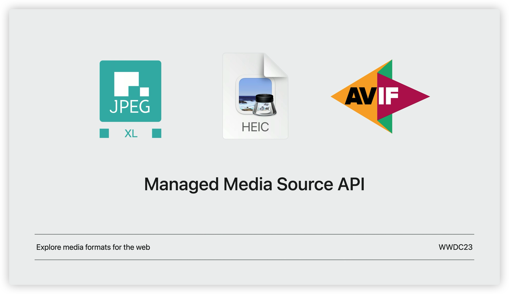

> 更多细节请参考 [WWDC23 - Explore media formats for the web](https://developer.apple.com/wwdc23/10122)
