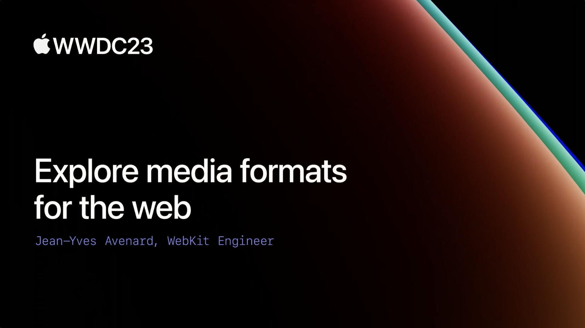

## 个人介绍

夏天，iOS 程序员，简书/掘金文章贡献者，摸鱼周报联合编辑，公众号 iOS 成长指北

## 不超过 120 个字的文章简介

本文将介绍 Safari 支持的媒体格式，包括图像和视频，并介绍了 Safari 17 中的新技术。文章还会讨论网站视频演变历程和最新技术 Managed Media Source API，实现自适应流媒体视频，提供更好的控制和更高效的性能。

## 审核介绍

Nemo ，SwiftGG 成员，目前就职于字节跳动，在剪映写 Cpp 和 TS。

黄骋志，老司机技术轮值主编，目前就职于字节跳动，参与西瓜视频质量与稳定性工作。对 OOM/Watchdog 较为了解并长期投入。

## 公众号/小专栏图文头图

