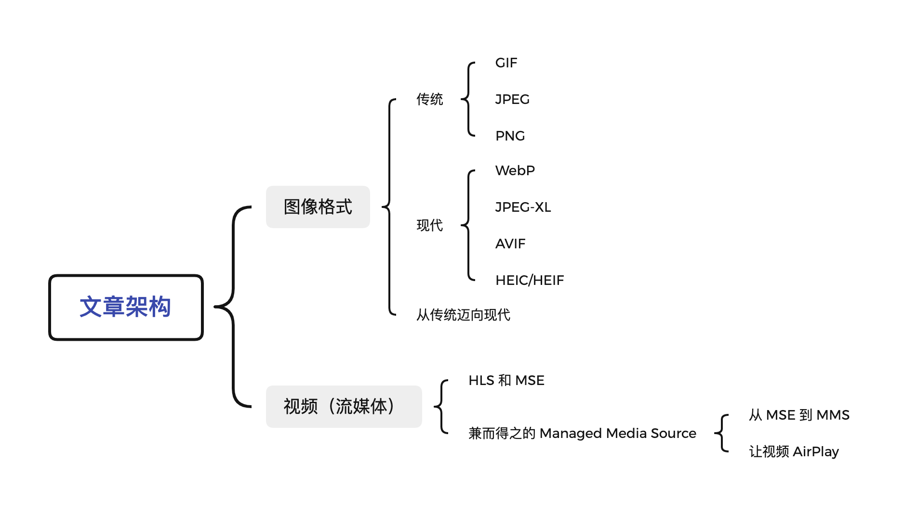
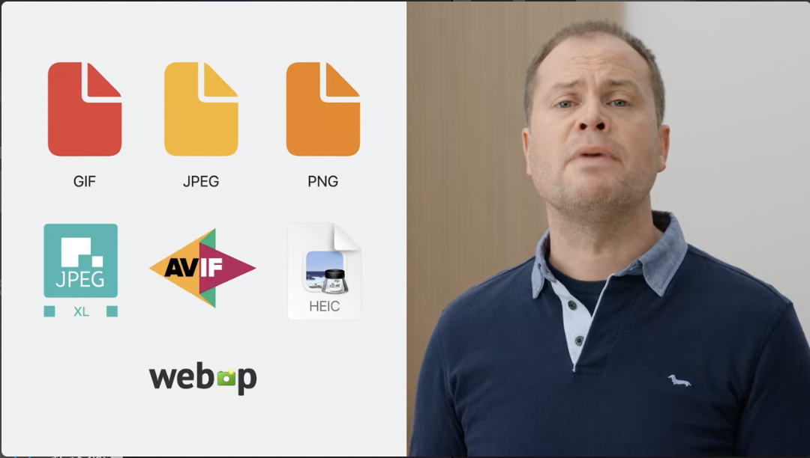
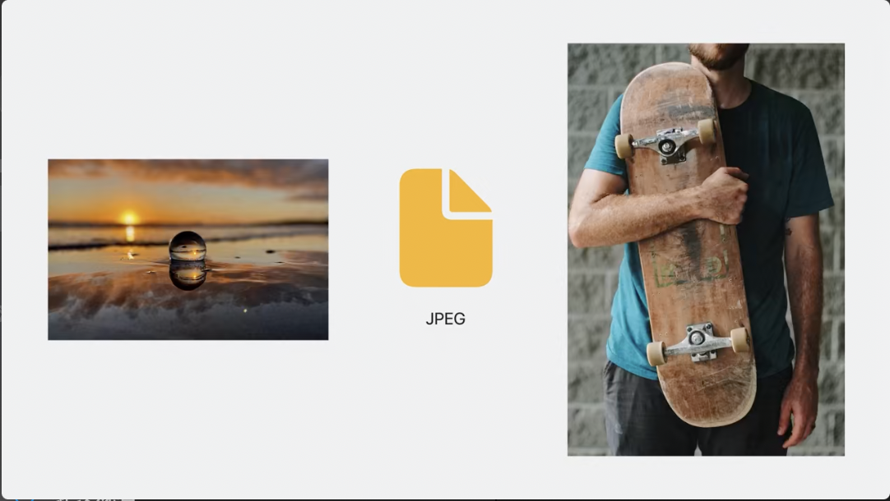
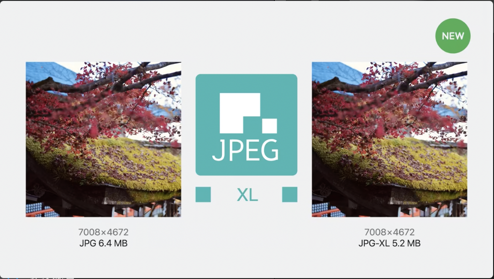
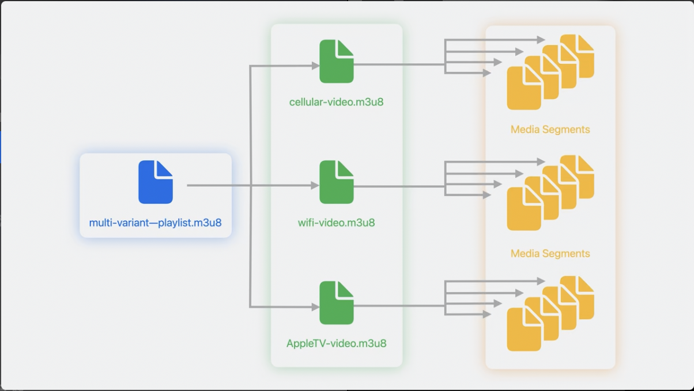

# Session 10122 - 探索适用于现代 Web 的媒体格式

本文是根据 [Explore media formats for the web](https://developer.apple.com/videos/play/wwdc2023/10122/) 进行撰写，旨在探索现代的图片和视频格式以及他们在 Web 中的应用。

本文将介绍 Safari 支持的媒体格式，包括图像和视频，并介绍了 Safari 17 中的新技术。文章还会讨论网站视频演变历程和最新技术 Managed Media Source API，实现自适应流媒体视频，提供更好的控制和更高效的性能。

## 图像格式

多年以来，GIF、JPEG 和 PNG 等图像格式一直是互联网上最常用的图像格式。这些格式被广泛支持，可以在各种设备和浏览器上显示。然而，随着技术的不断进步，出现了新的更出色的图像格式，这些技术能够提供更好的视觉体验。



接下来让我们简单的了解一下这些图像格式。

### 传统

作为被广泛使用的图像格式，GIF、JPEG 和 PNG 都拥有悠久的历史。

#### GIF


GIF 是 1987 年所引入的图像格式，以 8 位颜色（即 256 种颜色）展示`相对清晰`的图像。它实际上是一种压缩文档，采用[LZW 压缩算法](https://en.wikipedia.org/wiki/Lempel%E2%80%93Ziv%E2%80%93Welch)进行编码，有效地减少了图像文件在网络上传输的时间。在早期的互联网时代，因其体积小而成像相对清晰，GIF 大杀四方。

最适合在简单动画、网络梗和社交媒体内容中使用。

#### JPEG



JPEG 同样也是在 90 年代前后引入的图像格式。JPEG 有一种很好的特性是渐进式加载，可以在完全加载之前看到部分图像，在网络速度不是特别快的时候特别方便。它最适合用于照片和其他具有大量颜色和细节的图像。由于 JPEG 是一种有损的图像格式，这意味着在压缩过程中会丢失部分图像数据，特别适用于低对比，图像颜色过渡平滑，噪声多，且结构不规则的图片。

#### PNG


为了避免 GIF 所使用的 [LZW 压缩算法](https://en.wikipedia.org/wiki/Lempel%E2%80%93Ziv%E2%80%93Welch)专利商业收费的影响，PNG 格式在 1995 年被创建出来，主要用于展示单张图像。PNG 最初的设计目的是替代 GIF，并且无需专利许可。与 GIF 相同，PNG 原生支持动画，但在实际应用中很少见到 PNG 用于动画。PNG 还支持透明度，这使得在叠加图像时能够展示更丰富的色彩。

目前，PNG 图片格式几乎支持所有的主流浏览器，除非你还想支持 [IE6](https://en.wikipedia.org/wiki/Internet_Explorer_6)，IE6 不支持的是带有透明度的 PNG 图片。

> 但是 IE7 和 IE8 却对不带透明度的图片支持的没有那么好。😓

### 现代

除了上述三种传统的图像格式，还有四种更为现代的图像格式，它们分别是 WebP、JPEG-XL、AVIF 和 HEIC/HEIF。其中，JPEG-XL 和 HEIC/HEIF 将在 Safari 17 中首次得到支持。

#### WebP


WebP 是一种现代图像格式，使用先进的压缩算法实现更小的文件大小，而不会牺牲图像质量。在 Safari 14 和 macOS Big Sur 之后，你就可以在 Safari 中使用 WebP 来改善网站性能和加载时间，并可以用于动画。

WebP 旨在取代传统的三种图像格式。与 PNG 相比，同样大小的 WebP 无损图像文件能够平均减少 26%的大小。而且，只需增加 22%的文件大小，就可以使图像支持透明度。与 JPEG 相比，WebP 的平均大小能够减少 25%-34%，这样的压缩效果极为显著。这种格式提供了优秀的无损和有损压缩方式，使开发人员能够使用更小、更丰富的图像。

#### JPEG-XL



AVIF 和  [JPEG XL](https://jpeg.org/jpegxl/index.html) 是旨在取代 WebP 的新一代图像格式。在 Safari 17 中，支持 JPEG-XL 是一个令人兴奋的新功能。JPEG-XL 旨在提供高压缩率和图像质量。它采用一种称为[模块熵编码](https://zh.wikipedia.org/wiki/%E7%86%B5%E7%BC%96%E7%A0%81)的新压缩算法，使得可以更灵活地调整压缩比。这使得 JPEG-XL 特别适合在网络连接缓慢的情况下加载图像，用户可以在整个图像完全加载之前就能看到部分内容。JPEG-XL 的一个关键特性是无损转换，也就是说，将现有的 JPEG 文件转换为 JPEG-XL 不会丢失任何数据，并且可以显著减小文件大小高达 60％。

> JPEG-XL 是一个相对较新的图像格式，目前在支持它的浏览器中的使用率还比较低。根据[Can I Use](https://caniuse.com/?search=image%2Favi%27f)上的数据，目前只有 Safari 17 支持该格式，而 Chrome 在去年停止了对 JPEG-XL 的支持。[外界猜测](https://www.phoronix.com/news/Chrome-Dropping-JPEG-XL-Reasons)这主要是因为 Chrome 希望将精力集中在 WebP 和 AVIF 这两种图像格式上的发展上。

#### AVIF


AVIF 是一种现代图像格式，基于[AV1 视频格式](https://caniuse.com/av1)。它使用 AV1 视频编解码器实现高压缩比，同时保持图像质量。AVIF 在几乎所有现代浏览器（除了 Edge）上都得到广泛[支持](https://caniuse.com/?search=AVIF)，并且非常适合实况照片。它还支持高达 12 位的色深。AVIF 提供了有损和无损压缩的选项，这使得它在文件大小方面具有优势。虽然 PNG 仍然是一种优秀的无损压缩格式，但 AVIF 是一种出色的替代品，特别适用于需要通过`有损压缩`来减小文件大小的情况。AVIF 不仅支持并行处理和动画，而且相对于 JPEG，它在图像压缩方面表现更出色，可以将文件大小减小约 10 倍。然而，需要注意的是，与 JPEG 相比，AVIF 不支持渐进式渲染。

WebP 确实是一个很好的图像格式，但 AVIF 和 JPEG-XL 提供了更好的性能和更高的压缩率，它们是未来 Web 图像优化的重要选择。

#### HEIC/HEIF

HEIC 是基于[HEVC 视频格式](https://caniuse.com/hevc)的现代图像格式。Safari 17 增加了对 HEIC（也称为 HEIF）的支持，这是一种使用 HEVC 压缩算法实现小文件大小的图像格式，适用于 iPhone 和 iPad。在 WKWebView 中使用 HEIC 可以进行硬件加速和高效渲染，但需要注意 HEIC 现代图像格式不受所有浏览器和操作系统的支持。

如果你的应用支持 iOS 11 及以上版本，你可以考虑使用 HEIC 格式的图片来替代原本的 PNG 和 JPEG 格式。可以被认为是 iOS 平台上使用图片的[最佳实践](https://cloudinary.com/blog/the_best_image_format_for_mobile_app)。然而，在 Web 浏览器上，HEIC/HEIF 并不是首选格式，就像 JPEG-XL 一样，目前[支持](https://caniuse.com/?search=HEIF%2FHEIC)这种格式的浏览器非常有限，几乎没有支持的浏览器。

### 现代媒体格式和工具的应用

JPEG-XL、AVIF 和 HEIC 都具有一个重要的优势，即它们支持广色域和 HDR。广色域可以在文件中保留更多的颜色，并在屏幕上呈现更多的颜色，而 HDR（高动态范围）可以更准确地呈现黑暗部分的细节、亮部的亮度以及可接受的光线范围。这意味着在户外场景中可以呈现更丰富的色彩和细节，或在具有高对比度的明亮场景中获得更好的效果，或者在展示复杂肤色时获得更加真实和完美的效果。通过 HDR，图像可以更好地还原真实场景的光照情况，提供更具吸引力和逼真感的视觉体验。

为了在不支持这些格式的浏览器上提供正确的格式，你可以使用 HTML 中的`picture`元素来指定备用源，允许浏览器选择它支持的格式。建议你提供多个备用源，方便浏览器将按顺序查看可用格式列表，并优先使用最佳性能的格式。这样，你可以为用户提供正确的格式，而无需编写代码进行判断。

```html
<picture>
  <source srcset="images/large/sophie.heic" type="image/heic">
  <source srcset="images/large/sophie.jxl" type="image/jxl">
  <source srcset="images/large/sophie.avif" type="image/avif">
  
</picture>
```

## 视频（流媒体）

现在我们已经了解了可以使用的现代图像格式以及何时使用它们，让我们来看看视频，特别是自适应流媒体视频。视频在网站上的呈现方式的演变是一个引人入胜的过程，从网络早期开始，它已经走了很长的路。

### 流媒体技术：HLS vs MSE

随着移动设备的兴起，需要新技术来适应不同的屏幕大小和方向，苹果于 2009 年推出了 [HTTP Live Streaming](https://developer.apple.com/streaming/)，通过将视频内容分成小的块或片段，支持自适应比特率流媒体。HLS 允许根据用户的互联网连接速度和设备功能提供最佳的视频质量。但是到今天只有 Safari 支持它。



但是如果想在其他浏览器上支持多端播放，你就只能选择 W3C 发布的[Media Source Extensions（MSE）](https://w3c.github.io/media-source/)。MSE 引入了对[MPEG-DASH](https://www.iso.org/standard/75485.html)媒体流的支持，通过扩展视频和音频元素，无需使用其他插件就可以动态更改媒体流。这提供了自适应媒体流、实时流媒体、视频切割和视频编辑等功能。

虽然 Apple 在 Safari 8 上支持了 MSE，但仅限在 PC 端。这是因为 MSE 存在一些缺点：它在管理缓冲区级别、网络访问的时间和数量以及媒体变体选择方面并不出色。这些缺点在相对强大的设备上，如现代计算机上基本上不会产生问题。但在移动设备上的功耗比 HLS 本地播放器高得多，因为无法通过 MSE 实现所需的节电效果，MSE 在 iPhone 上并未被支持。通过对各种网站的所有测试都表明，启用 MSE 将损耗电池寿命。

因为 MSE 需要通过 JavaScript 控制媒体流的加载和播放，所以它会带来更多的资源消耗。具体来说，MSE 需要在接收端使用 JavaScript 解析媒体流，并将其分段缓存，这就需要更多的 CPU 和内存资源。同时，MSE 还需要与浏览器的媒体播放器进行交互，这也会带来额外的开销。

> B 站开源的 [flv.js](https://github.com/bilibili/flv.js) 就是基于 MSE。

### 兼而得之的 Managed Media Source

有没有什么方法能既保留 MSE 的灵活又能兼具 HLS 的效率呢？答案是有的，就是 Managed Media Source (MMS) API。

MMS 是一个将更多对 MediaSource 及其相关对象的控制权交给浏览器的 API。它能够更容易地支持在能力受限的设备上进行流媒体播放，并允许用户代理根据可用内存和网络能力的变化做出相应的调整。

与旧版 MSE 相比，MMS 有以下几个区别：

* 它通过告知网页何时是缓存更多媒体数据的最佳时间来减少功耗，可以让蜂窝调制解调器更长时间地进入低功耗状态，从而延长电池寿命。
* 它可以智能地清除未使用或被丢弃的缓冲内存，使页面更加高效；它可以追踪缓冲区何时应该开始和停止，从而使页面更容易检测低缓冲区和完整缓冲区的状态。
* 此外，MMS 还可以通过 5G 调制解调器发送媒体请求，从而使你的网站能够利用快速的 5G 网络快速加载媒体数据，并且对电源使用的影响最小。如果需要播放实时演出，MMS 还可以自动检测并切换到 LTE 或 4G（如果可用），以延长电池寿命。用户仍然可以控制每个分段的分辨率、下载方式和来源。

通过使用 MMS，你可以节省带宽和电池寿命，使用户在苹果设备上能够更长时间地观看视频。

#### 从 MSE 到 MMS

从 MSE 迁移到 MMS 非常容易，只需要几个步骤。现在我们来简单介绍一下，正如前文所说，MSE 需要在客户端使用 JavaScript 解析媒体流，我们需要创建一个 `js` 文件，并在其中添加一个`runWithMSE` 方法，`runWithMSE`函数等待页面加载，创建视频元素，并将其附加到 MediaSource 对象上，最后将其附加到 HTML 的 `video` 元素上。

```js
function runWithMSE(testFunction, id = 'log') {
    window.onload = function () {
      var ms = new MediaSource();

      var el = document.createElement("video");
      el.src = URL.createObjectURL(ms);
      el.preload = "auto";

      document.body.appendChild(el);

      testFunction(ms, el);
    };
}
```

我们有两种方法来适配 MMS：一种是：首先需要确保 MMS 可用，然后将任何对 MediaSource 的调用替换为 ManagedMediaSource 本身。

```javascript
// 确保 Managed Media Source 可用
function isMMSAvailable() {
  return !!document.ManagedMediaSource;
}

function runWithMSE(testFunction, id = 'log') {
    window.onload = function () {
      var ms = isMMSAvailable() ? new ManagedMediaSource() : new MediaSource();
      ...
    };
}
```

另一种更容易的方法是将 MediaSource 覆盖为 ManagedMediaSource。定义一个名为`getMediaSource()`的方法，并将其设置为`MediaSource`。

```javascript
function getMediaSource() {
  return self.ManagedMediaSource || self.MediaSource;
}
//
const MediaSource = getMediaSource();

function runWithMSE(testFunction, id = 'log') {
    window.onload = function () {
      var ms = new MediaSource();
      ...
    };
}
```

然后我们在`html`文件中调用这个函数：

```js
runwithMSE(async function (source, video) {
  video.controls = true;
  await once(source, 'sourceopen');
  var videosb = source.addSourceBuffer('video/mp4; codecs="mp4a.40.2,avc1.4d4015"');
  
  source.onstartstreaming = async () => {
    await loadData(videosb);
    source.end0fStream();
    await once(source, 'sourceended');
    await video.play();
  };
  source.onendstreaming = () => {
    // 已经有足够数据，可以进入低功耗模式
  };
  videos.onbufferedchange = () => {
    // 检查源缓冲区中数据的变换
  };
});
```

在`startstreaming`事件中，通知播放器开始获取新内容并将其添加到托管的`sourceBuffer`中。同时，还需要处理`endstreaming`事件，以告知播放器何时需要停止获取新数据。需要注意的是，与 MSE 不同，你的`sourceBuffer`可能会在任何时候发生变化。为了避免可能导致播放暂停的情况，MSE 会定期检查缓冲区是否需要增加，并在附加新数据时增加缓冲范围。这样可以确保视频的平稳播放，同时保持足够的缓冲以应对网络延迟或其他因素引起的播放中断。所以，你还需要添加一个`bufferedchange`事件处理程序，以检查哪些数据已从源缓冲区中删除。遵循 MMS API 的规范，只在需要时附加数据，这样可以提高用户体验并延长设备电池的使用寿命。当然，如果你只关心苹果设备上的体验，请使用 HLS。

#### 让视频 AirPlay


使用 HLS 的另一个好处是支持 [AirPlay](https://developer.apple.com/airplay/)。使用支持 AirPlay 的媒体播放器 API，你可以让用户将视频/音频从他们的苹果设备扩展到 Apple TV、HomePod 或支持 AirPlay 的扬声器或智能电视，从而丰富你的应用程序。如果你有这样的需求，希望你的流媒体能够在 Safari 中使用本机支持的 HLS 并支持 AirPlay 功能，那么我们可以继续进行下一步操作。

需要明确的是，AirPlay 需要一个 URL，而 MSE 只能提供视频片段。那么只要视频资源能提供 AirPlay 所需的 HLS 视频流，那么就可以使用 AirPlay。我们可以像图片资源一样，为 `video` 元素提供一个备用资源，使其支持 AirPlay。

> [`.m3u8`](https://en.wikipedia.org/wiki/M3U) 格式的视频文件是 Apple HLS 的基石，天然被 HLS 支持

```js
// 支持 AirPlay
const videoSource1 = document.createElement('source');
videoSourcel.type = 'video/mp4';
videoSource1.src = URL.createObjectURL(mediasource);
video.appendChild(videoSource1);

const videoSource2 = document.createElement('source');
videoSource2.type = 'application/x-mpegURL';
videoSource2.sr = "http: //devimages.apple.com/iphone/samples/bipbop/bipbopall.m3u8";
video.appendChild(videoSource2);
```

Safari 会自动给这个视频资源添加 AirPlay 图标并允许用户 AirPlay 视频。然而，你需要为每个视频资源都提供一个备用资源，并且在创建 `video` 元素时添加备用资源。这种做法似乎有些繁琐。一个简单的方法是使用 [HLS.js](https://github.com/video-dev/hls.js/) 进行视频播放。HLS.js 是一个 JavaScript 库，它实现了 HLS 客户端，依赖于 HTML5 视频和 MediaSource 扩展进行播放。它通过将 MPEG-2 传输流和 AAC/MP3 流转换为 ISO BMFF（MP4）片段来工作。当在浏览器中可用时，使用 Web Worker 异步执行转换。此外，HLS.js 还支持 HLS + fmp4。

如何使用 HLS.js 创建播放器完全取决于你的需求。你可以根据自己的需求来决定是使用 HLS.js 提供的功能，还是使用本机的 HLS 支持。如果你只需要在特定的环境中使用 HLS，并且希望利用浏览器的本机支持来实现更高的性能和兼容性，那么你可以选择使用浏览器的本机 HLS 功能。这取决于你的具体需求和优先考虑的因素。

```js
<video id="video"></video>
<script>
  var video = document.getElementById('video');
  var videoSrc = 'https://test-streams.mux.dev/x36xhzz/x36xhzz.m3u8';
  //
  // 首先，先判断本机HLS是否支持
  //
  if (video.canPlayType('application/vnd.apple.mpegurl')) {
    video.src = videoSrc;
  } else if (Hls.isSupported()) {
    //
    // 如果本机HLS并不支持，检查一下是否支持 HLS.js
    //
    var hls = new Hls();
    hls.loadSource(videoSrc);
    hls.attachMedia(video);
  }
</script>
```

##### 注意

为了保证用户的体验一致性，当你准备为视频资源支持 MMS 时，必须提供 AirPlay 源替代方案。如果没有提供替代方案，你必须通过 Remote Playback API 在媒体元素上显式禁用 AirPlay，即调用 disableRemotePlayback。


## 总结

确实，当今的互联网已经成为了一个以视觉为主的世界，大量的图片和视频被用于网站、社交媒体、广告等各种应用中。然而，传统的媒体格式，如 JPEG 和 PNG 等，存在着一些问题，例如文件大小过大、加载速度过慢、图片和视频质量不佳等。这些问题会影响用户体验和网站性能，使得网站变得缓慢和不稳定。

为了解决这些问题，开发者应该将目光投入到新的技术上。例如，JPEG-XL、AVIF 和 HEIC 等现代的图片和视频格式可以在保证高质量的同时，显著减少文件大小，从而提高加载速度和网站性能。除此之外，一些新的 Web 技术也可以帮助开发者更好地管理和优化媒体文件的加载和显示，从而提高用户体验和网站性能。

如果你关注 WWDC 2023 上 Safari 更新的内容，你就可以查看 [WWDC23 10262 - 重新探索 Safari 开发者功能](https://xiaozhuanlan.com/topic/0356874192)。

你可以通过 [Safari Technology Preview Release Notes](https://developer.apple.com/safari/technology-preview/release-notes/) 来查看过去一年苹果在 HTML、CSS 增强、Web Inspector 工具、Web API 等各个方面的详细更新情况。

当你准备使用某些新特性时，使用 [Can I use](https://caniuse.com/) 来了解某些新特性的兼容性和支持的版本是非常重要的。

如果你想尝试新的功能，你可以通过下载 [Safari Technology Preview](https://developer.apple.com/safari/resources/) ，在其中试用 Safari 和 WebKit 新的更新和改进。 [Safari Technology Preview](https://developer.apple.com/safari/resources/) 支持不需要更新 beta 系统来体验新版功能的版本。

你可以参照[时间线](https://trac.webkit.org/timeline)获取了解更多的细节，如果在 WebKit 中遇到错误——有关 HTML、CSS、JavaScript、DOM API 或 Web Inspector 的问题——请确保通过 [WebKit 的错误跟踪系统](https://trac.webkit.org)发送反馈。

### 致歉

由于笔者对前端内容并不是非常擅长，所总结的内容和理解难免存在疏漏和错误，如有问题，请与我联系。
