# Session 10123 - 把你的游戏移植到 Mac 上（一）

本文基于 [Session 10123] ([Bring your game to Mac, Part 1: Make a game plan](https://developer.apple.com/videos/play/wwdc2023/10123/?time=127))梳理。

这是今年 WWDC 中我认为第二有趣的主题（第一当然是 Apple Vision Pro 😁），其中最令我兴奋的当属 Game Porting Toolkit。这个系列主题将指导游戏开发者 - 如何渐进式地将 Windows 游戏移植到 Mac 上。本主题分为三个部分，其中本文为第一部分，主要带读者体验一遍移植游戏的全流程。

## Game Porting Toolkit

首先介绍一下大杀器 - Game Porting Toolkit。

它是苹果提供的移植套件，旨在让开发者在不改一行代码的情况下，就看到游戏运行在 Mac 上的情况。

在详细介绍它之前，先上三张图，开开胃：

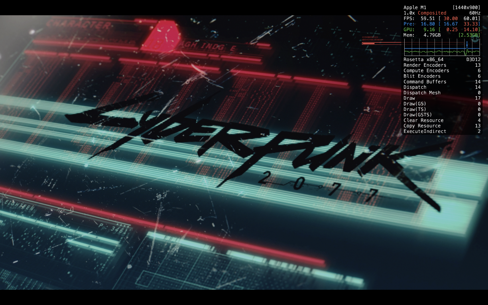

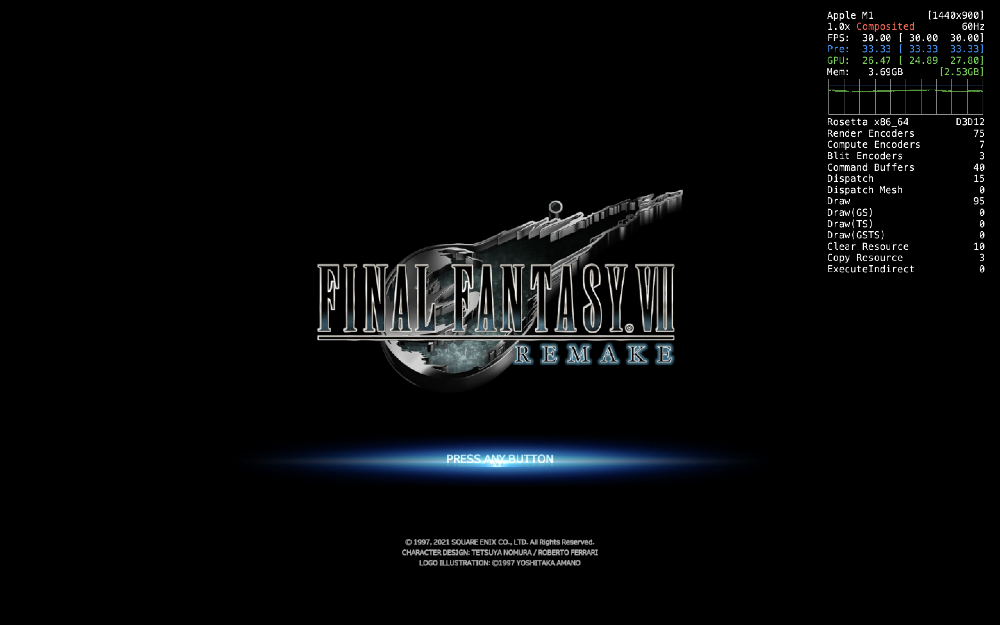

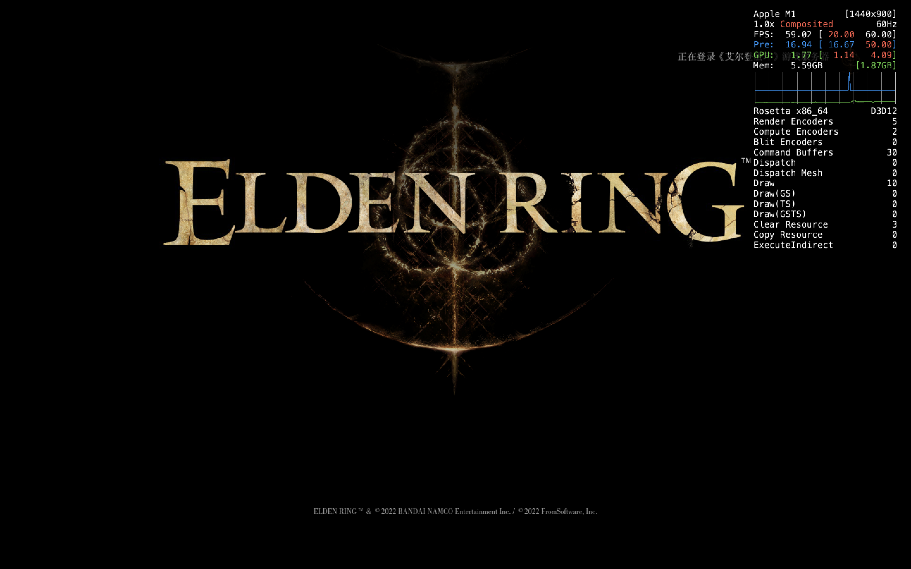

如果你是游戏爱好者，我相信你已经开始激动了。没错，这三款近年热门的 3A 大作是跑在我 M1 芯片的 MacBook Air 上的。虽然苹果的本意不是这样，但这意味着 Mac 可以玩游戏了！

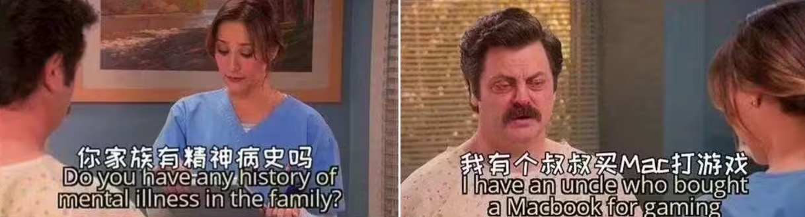

它有什么样的游戏表现呢？

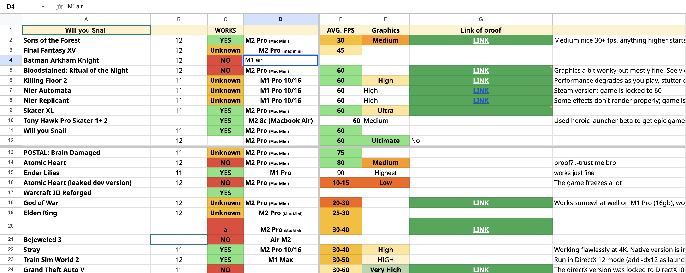

以上是国外大佬总结的游戏可玩性清单，[传送门](https://docs.google.com/spreadsheets/d/1t_E04Qt411f9mEZJVku_OJsEe6XCqZZsdqtjVaMCcgk/edit#gid=0)（需要梯子）。

心动了吗？想要动手试试，你可以下载 [Game Porting Toolkit](https://developer.apple.com/download/all/?q=game%20porting%20toolkit)，打开里面的 Read Me.rtf 跟着教程试试看。不过，我更推荐神秘的民间力量：

1. 这篇[博客](https://www.outcoldman.com/en/archive/2023/06/07/playing-diablo-4-on-macos/)手把手教你在 Mac 上，把大菠萝 IV 跑起来。
2. 这个叫做 [macgaming](https://www.reddit.com/r/macgaming/) 的 reddit 小组就更厉害了，里面讨论着用 Mac 玩游戏的一切。从名字你就可以看出，里面聚集了一大堆有大病的表叔，用 Mac 玩游戏 :)。

看到这里，好奇心浓厚的你一定想知道，这一切是怎么做到的？别着急，这一切要从 [Wine](https://www.winehq.org/) 这个神奇的软件说起：

> Wine （“Wine Is Not an Emulator” 的首字母缩写）是一个能够在多种 POSIX-compliant 操作系统（诸如 Linux，macOS 及 BSD 等）上运行 Windows 应用的兼容层。Wine 不是像虚拟机或者模拟器一样模仿内部的 Windows 逻辑，而是將 Windows API 调用翻译成为动态的 POSIX 调用，免除了性能和其他一些行为的内存占用，让你能够干净地集合 Windows 应用到你的桌面。

简单来说，Wine 牛逼的地方在于它是翻译而不是模拟，它需要猜测 Windows API 的内部实现，自己实现一套一模一样的。工作量的庞大可想而知，但是性能比虚拟机好了许多。

在苹果之前，Valve 推出的掌机 Steam Deck 就用了这套方案，它能运行 Steam 平台上绝大多数 Windows 游戏，就是基于一个名叫 Proton 的兼容层，而 Proton 就是就是基于 Wine 实现的。得益于 Wine 的强大，Steam Deck 用了挺普通的芯片，也能将各种 3A 游戏玩弄于股掌之间。

> 以下三张图片来自视频：[新款 Mac Studio 硬核体验](https://www.bilibili.com/video/BV1414y1S7WK/?share_source=copy_web&vd_source=f43900ea7c4055afb06e651364f3d6ba) by 虽然但是张黑黑

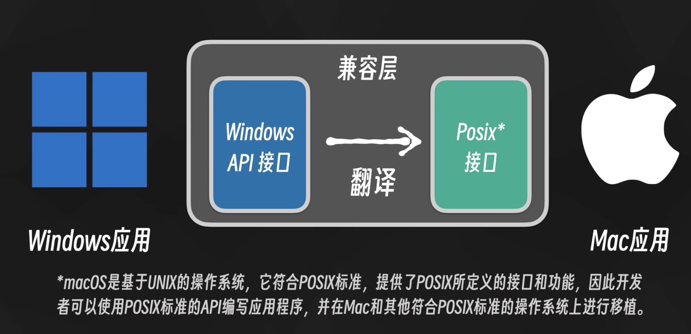

还有一个问题需要解决，那就是 Direct3D 的问题。

> Direct3D（简称：D3D）是微软公司在 Microsoft Windows 操作系统上所开发的一套 3D 绘图编程接口，是 DirectX 的一部分，目前广为各家显卡所支持。与 OpenGL 同为电脑绘图软件和电脑游戏最常使用的两套绘图编程接口之一。

如果只是为了翻译 D3D，其实已经有好几套方案。比如，CrossOver、VirtualBox。但是，这次苹果直接适配了 D3D 12，这是其他厂家想做但是一直没做到的。而大部分新款 3A 大作都是基于 D3D 12 的，所以苹果这次将 D3D 12 翻译成 Metal 才会引发这么多关注。

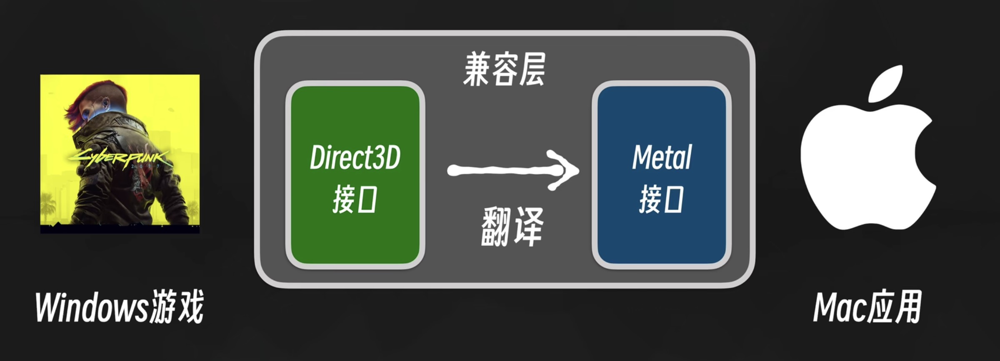

总结来看，Game Porting Toolkit 做了两次翻译，首先是将「基于 D3D 的 x86 架构的 Windows 游戏」翻译成「基于 Metal 的 x86 架构的 Mac 游戏」，再将「x86 架构的 Mac 游戏」翻译成「ARM 架构的 Windows 游戏」，于是 M 系列芯片的 Mac 就可以愉快地运行游戏了。

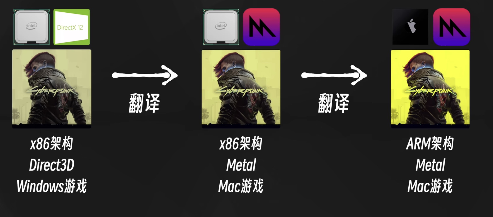

既然是翻译了两次，一定是有性能损耗的，业界估计平均损耗在 50% 上下。

当然，Game Porting Toolkit 的能力不仅仅于此，它还翻译了输入控制、音频等功能。一切都是为了让你一行代码不改，就把游戏运行起来。

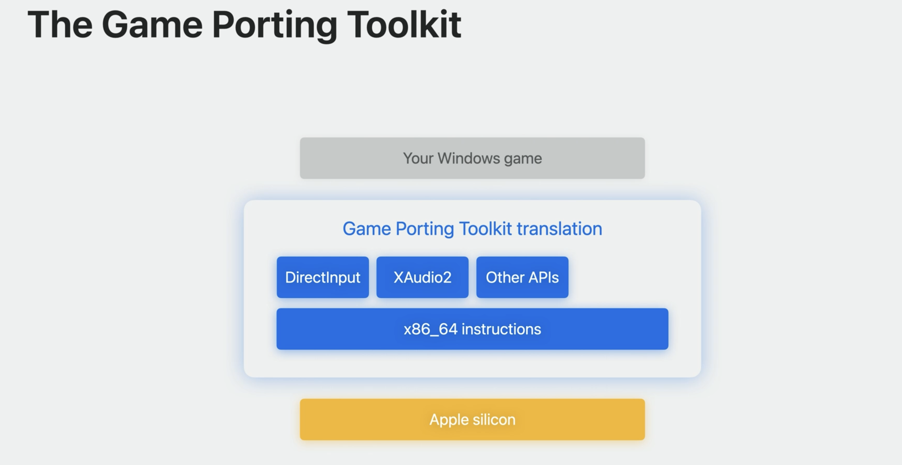

## 移植方案

话说回来，Game Porting Toolkit 的初衷还是想让游戏开发者可以更加便利地移植游戏，苹果希望开发者在尽可能低成本的情况下，完成游戏移植，百分百利用苹果提供的软硬件能力。于是，苹果推荐了一个移植方案：

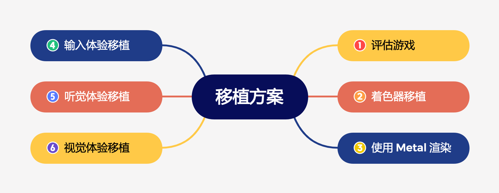

接下来，我会分别介绍这六步流程。

### 评估游戏

得益于 Game Porting Toolkit 提供的环境模拟器，开发者可以在不修改任何代码的情况，直接运行 Windows 版本的游戏。

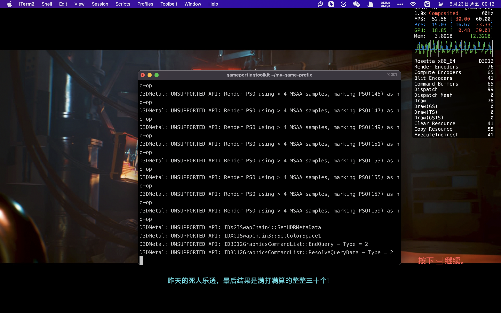

开发者不仅可以在右上角看到游戏运行中的各种参数，还能在终端里直接看到各种需要优化的信息。

浏览一下 HUD 中的可观测信息：

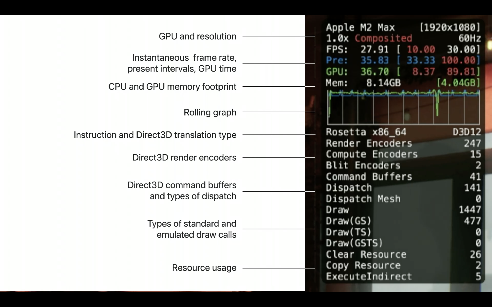

更进一步，你还可以打开 Instrument 做更深度的性能检测：

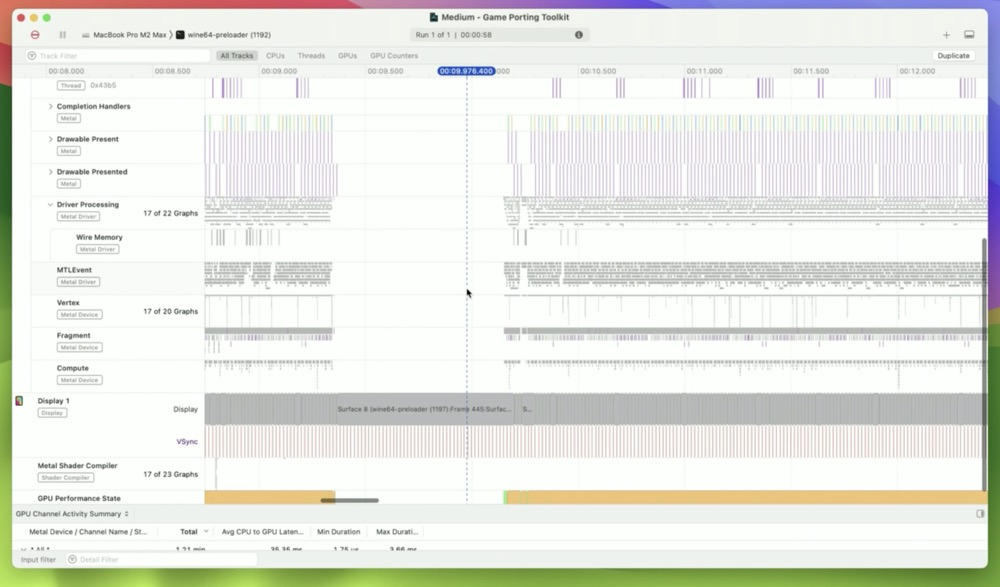

基于以上信息，再结合游戏中的实际体验，开发者可以很容易地评估当前游戏移植到 Mac 上需要优化的点，以及大致的工作量。

### 着色器移植

苹果这次还提供了 Metal Shader Converter，用来将 Windows 游戏中的 DXIL 着色器（HLSL 的编译产物）转换为 Metal 可用的版本。

更多详情，可以观看本主题的第二部分：[WWDC23 10124 - 把你的游戏移植到 Mac 上（二）：编译 Shaders](https://xiaozhuanlan.com/topic/0289537416)。

### 使用 Metal 渲染

在完成了着色器转换之后，就可以使用 Metal 来做渲染了。

Metal 3 提供了现代高端游戏使用的所有高级图形和计算功能，包括 MetalFX、快速资源加载、离线编译、网格着色器和光线追踪，这使得转换图形代码变得非常简单。

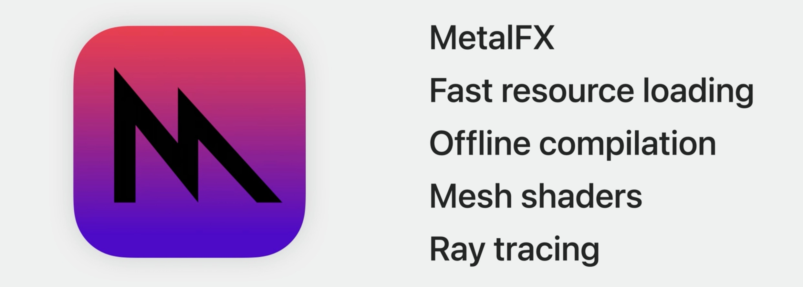

更多详情，可以观看本主题的第三部分：
[WWDC23 10125 - 《把你的游戏移植到 Mac 上（三）：使用 Metal 渲染(待发布)](.)。

### 输入体验移植

在使用 Game Porting Toolkit 体验过游戏的输入体验之后，开发者就可以进行具体的移植了。

在 Mac 上，游戏控制器框架（ Game Controller framework）为游戏提供了线程安全和低延迟的支持，可以在各种外设上进行游戏输入，例如游戏手柄、键盘、鼠标、赛车方向盘和街机摇杆。开发者还可以访问游戏控制器的附加功能，包括触觉反馈和运动感应。Mac 提供系统级别的用户偏好设置，支持每个应用程序的输入重映射，以及自动支持从任何游戏中的控制器进行屏幕截图、录制视频和获取 15 秒游戏高光时刻。

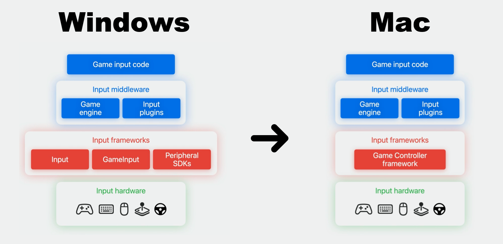

在这种全方位的功能支持下，无论你的 Windows 游戏用的是第三方的跨平台输入组件，或是底层的 Windows API，还是游戏外设自定义的 SDK，都能获得足够的移植空间。

如果你有过在 PC 上打游戏的经历，那你的输入设备一般有两种选择：键鼠或者游戏手柄。键鼠的移植相对简单，因为 PC 与 Mac 对键鼠的抽象代码都是差不多的。作为游戏发烧友，我必须为你介绍发烧程度更高的 - 游戏手柄的移植。

接下来我们拿 Xbox 游戏手柄来举个例子，首先你要做的就是在项目中引入 Game Controllers：

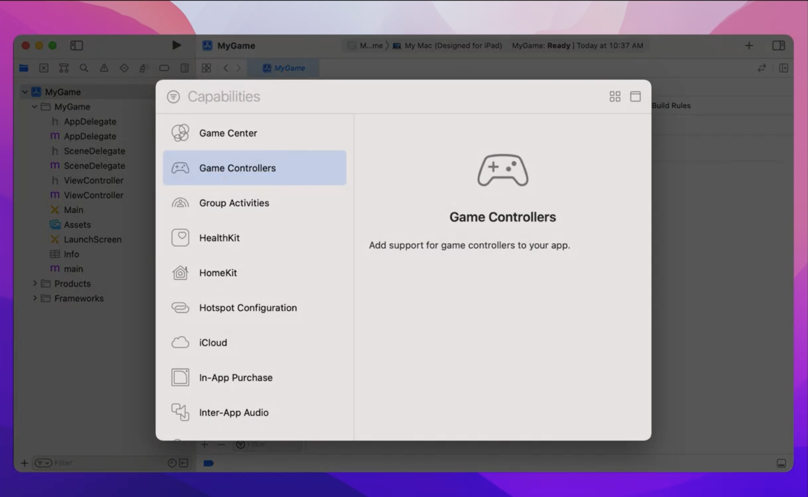

于是你的游戏在 Xbox 游戏手柄下就自动具备了分享功能，只要你的手柄上有分享按钮：

1. 长按，代表开始或结束录屏
2. 双击，代表截屏

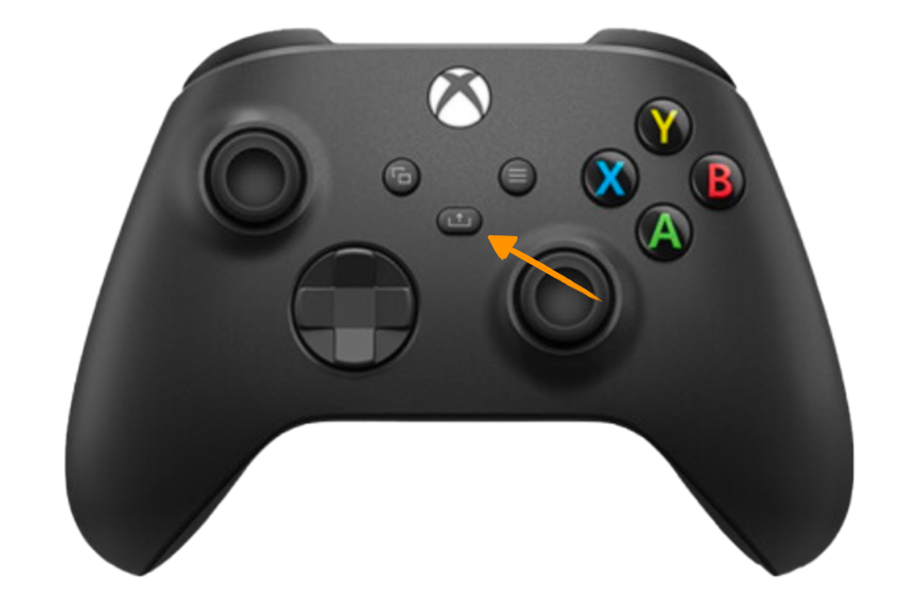

而这一切功能，不需要你添加一行代码。

接着我们再为 Xbox 的老对手 Sony PlayStation DualSense 写点代码，DualSense 有个很酷的功能 - 自适应扳机。它能根据力道的反馈，模拟各种真实的场景。

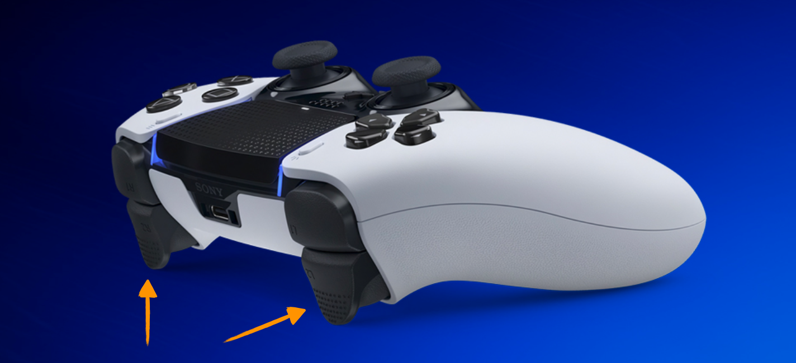

我们来模拟拉弓的感觉：一开始很轻松，接着越拉越紧，直到拉满弓，肌肉因为僵持不下开始微微抖动：

```Swift
func updateControllerAdaptiveTriggers() {

    // 获取 dualSense
    guard let dualSense = GCController.current?.physicalInputProfile as? GCDualSenseGamepad
    else {
        return
    }

    // 获取右扳机
    let adaptiveTrigger = dualSense.rightTrigger

    // 判断玩家正在拉弓
    if playerIsPullingSlingshot {

        // 根据扣动扳机的程度，换算成阻力
        let resistiveStrength = min(1, 0.4 + adaptiveTrigger.value)

        if adaptiveTrigger.value < 0.9 {

            // 当扣动扳机的程度小于 0.9 时，根据程度，调整反馈的阻力
            adaptiveTrigger.setModeFeedbackWithStartPosition(
                0,
                resistiveStrength: resistiveStrength)
        } else {

            // 当扣动扳机的程度大于等于 0.9 时，加入低频震动
            adaptiveTrigger.setModeVibrationWithStartPosition(
                0,
                amplitude: resistiveStrength,
                frequency: 0.03)
        }
    } else if adaptiveTrigger.mode != .off {

        // 完成射击后，则关闭自适应扳机
        adaptiveTrigger.setModeOff()
    }
}

```

是不是很棒？就这么一点代码，就完成了模拟拉弓反馈的移植。

更多细节可以观看往期的主题：

- [Tap into virtual and physical game controllers](https://developer.apple.com/videos/play/wwdc2021/10081)
- [Advancements in Game Controllers](https://developer.apple.com/videos/play/wwdc2020/10614)

### 听觉体验移植

如果你的游戏是基于第三方跨平台音频组件的话，比如 Wwise、Unity 和 FMOD。那么恭喜你，你几乎不用做任何移植就可以完美适配了，因为这些组件的跨平台版本已经很好地支持了 Mac。

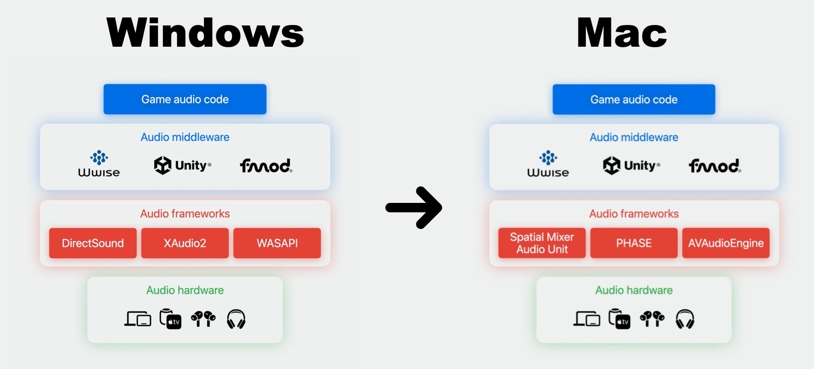

如果你的游戏没有使用跨平台组件，也不用担心，我们接下来分两种情况讨论：

假设你游戏中包含了空间音频，PHASE (Physical Audio Spatialization Engine) 会非常适合你。因为 PHASE 提供了动态空间音频的能力，能够根据游戏场景中人物的移动，反馈出模拟现实物理场景的声音反馈，并且它还支持各种音频硬件，使你的应用可以在不同平台和输出设备（例如耳机和扬声器）上提供一致的空间音频体验。

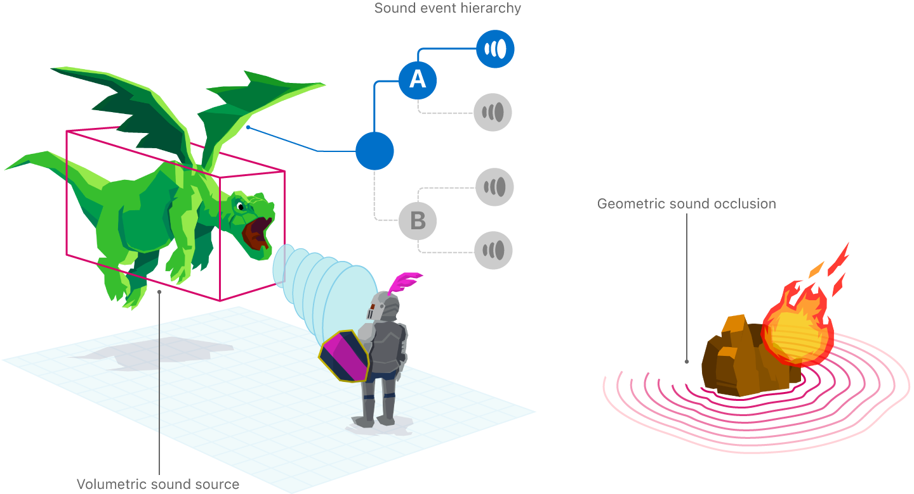

假设你游戏用不到空间音频，那么直接使用 AVFoundation 或者 Core Audio 即可。

更多细节可以观看往期的主题：

- [Plug-in and play: Add Apple frameworks to your Unity game projects](https://developer.apple.com/videos/play/wwdc2022/10065)
- [Discover geometry-aware audio with the Physical Audio Spatialization Engine (PHASE)](https://developer.apple.com/videos/play/wwdc2021/10079)

### 视觉体验移植

使用 Game Porting Toolkit，你可以在显示器上看到游戏运行在基础动态范围与帧速率控制的 API 上的情况。

在 Windows 上，你的游戏可能会用到颜色管理和色调映射的 API 来实现高动态范围。比如，AdvancedColorInfo 关于颜色空间的 API。还可能会利用 IDXGISwapChain 中 timing 和 feedback 来控制 SDR 和 HDR 内容的节奏。

在 Mac 上，你可以使用 CAMetalLayer 的扩展动态范围支持，以及 CAMetalDisplayLink 提供的 API 来实现完整的功能移植。

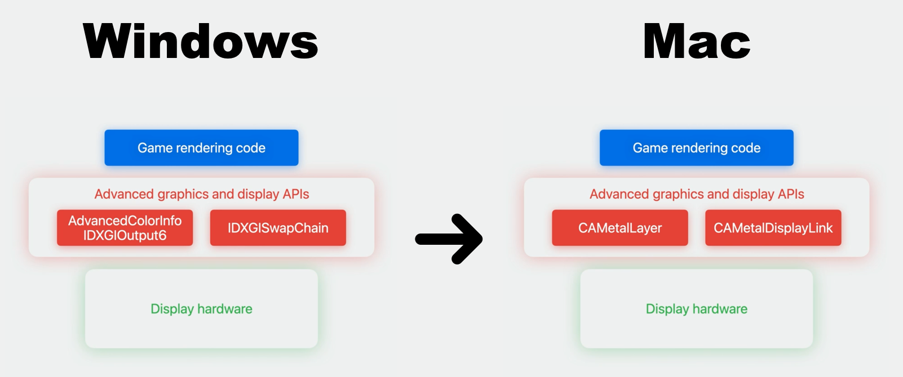

说到视觉体验，就不得不聊一下 HDR 了：

> 高动态范围成像（High Dynamic Range Imaging，简称 HDRI 或 HDR ），在计算机图形学与电影摄影术中，是用来实现比普通数位图像技术更大曝光动态范围（即更大的明暗差别）的一组技术。高动态范围成像的目的就是要正确地表示真实世界中从太阳光直射到最暗的阴影这样大的范围亮度。

目前大多数显示设备都超过了 SDR 的水平，也就是显示峰值亮度大于 100 nit。但是并没有完全达到 HDR，显示峰值亮度大于等于 100 nit 的要求。比如，我们经常看到显示器的参数 HRD400，就代表了显示峰值亮度不低 400 nit。大多数情况下，我们用来标记画面亮度的 code value 是 0 到 1 的一个浮点数，那么显示器在实际展示画面的时候有两种方案：

方案一： 直接映射。0 代表最暗，1 代表显示器峰值亮度。缺点是：颜色不一致。因为内容生产者的显示器和用户的显示器最高亮度不一致，导致了最终双方看到的效果不一致。

方案二： 保持准确。也就是 1 还是映射到 SDR 的标准 100 nit，这样在大家显示器上看到的效果都一致了。但是坑爹啊，我花五万块钱买的 Apple Pro Display XDR 峰值亮度能达到 1600 nit 啊！这钱不是白花了？

为了把显示器卖出高价，苹果不得不推出了 EDR :)

EDR（Extended Dynamic Range）是高动态范围的一种数值表现方式，也是一套色彩渲染管线。所以，我们在讨论 EDR 的时候，一般同时指称 HDR 成像以及在平台使用的 HDR 渲染技术。

我们这里只讨论最为核心的点：EDR 可以做到真正的 HDR 效果，就算是普通的 SDR 显示器也可以。

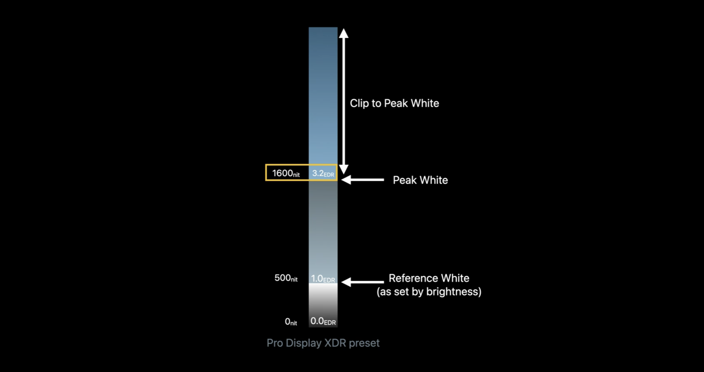

根据上图，我们来展示一下苹果是怎么利用 EDR 来解决 HDR 的显示问题的：

1. EDR 允许 code value 超过 1
2. [0, 1] 范围内，对应的是 SDR 的亮度范围
3. 大于 1 的部分，对应的是 HDR 的亮度范围
4. 再往上，大于峰值亮度的部分，就直接等于峰值亮度
5. 基准白（Reference White）是浮动的，根据显示情况调节

拿 Apple Pro Display XDR 来举个例子：

1. 0 代表 0 nit
2. 1 代表 基准白，假设此时基准白的亮度是 500 nit
3. 3.2（1600 / 500）为最高亮度 1600 nit
4. 此时的动态范围就变成了 0~3.2

如果是一台 HDR400 的显示器：

1. 0 代表 0 nit
2. 1 代表 基准白，假设此时基准白的亮度是 100 nit
3. 4（400 / 100）为最高亮度 1600 nit
4. 此时的动态范围就变成了 0~4

是不是很神奇？HDR400 显示器的动态范围，居然吊打 Apple Pro Display XDR ！

再回头看一眼一开始提出的两难问题：

1. 如果你是为了监看，那么你只要保证两台显示器的基准白亮度相同，并且确保显示器的最高亮度能够支持你的最大 code value 即可
2. 如果是要发挥最好的显示效果，那就将基准白亮度交给系统，自动亮度和原彩显示功能会帮你做到最好效果

更多细节可以观看往期的主题：

- [Explore EDR on iOS](https://developer.apple.com/videos/play/wwdc2022/10113)
- [Explore HDR rendering with EDR](https://developer.apple.com/videos/play/wwdc2021/10161)

## 结束语

至此，我们介绍完了游戏移植的所有步骤。

可以看出苹果今年在游戏上是下了大力气的。不论 Game Porting Toolkit 还是 Metal Shader Converter，都是为了让开发者更有动力来移植游戏，最终让自家的游戏生态更加繁荣。

为什么近年来苹果对游戏生态愈加重视呢？之前我不懂，今年看到 Apple Vision Pro 我终于明白了。Apple Vision Pro 想要快速普及和应用，短时间内可能还是要落地在游戏领域，而今天 Mac 的游戏生态，也是为了未来的 Apple Vision Pro 生态去铺路。核心还是 Metal 的普及和推广上，如果能在近几年吸引一批开发者通过移植游戏熟悉 Metal，并积累一些开源生态，未来等 Apple Vision Pro 真正大量铺货的时候，一切也就水到渠成了。
