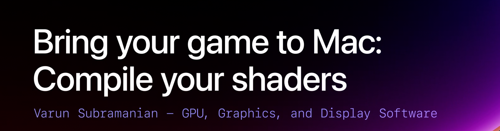

## 个人介绍

> Andy Jiao，就职于商汤科技的灵境空间团队。APP “商汤格物”的开发者。

## 审核介绍

> Cooper：老司机技术成员，目前就职于 Zoom，参与 Zoom 桌面端基建开发，负责性能优化、稳定性维护和 CI 相关工作，重度自驾游爱好者。
>
> 黄骋志：老司机技术轮值主编，目前就职于字节跳动，参与西瓜视频质量与稳定性工作。对 OOM/Watchdog 较为了解并长期投入。

## 不超过 120 个字的文章简介

> 本文将重点介绍如何利用 Metal 编译器和 Metal 着色器转换器将着色器转换到 Mac 平台，并提高着色器的灵活性和速度。包括如何将着色器转换为 Metal IR 以及如何在游戏构建过程中通过 GPU 二进制文件避免设备上的编译。详细介绍了 Metal 着色器转换器的功能和使用步骤。

## 公众号/小专栏图文头图

