---

session_ids: [10124]

---


# WWDC23 10124 - 《将你的游戏移植到 Mac 上》第二部分：编译 Shaders

本文基于 [Session 10124](https://developer.apple.com/videos/play/wwdc2023/10124/) 梳理。

## 前言

《将你的游戏移植到 Mac 上》是一个三部分的系列文章，本文是该系列的第二部分。其他部分：

[WWDC23 10123 - 《将你的游戏移植到 Mac 上》第一部分：制定移植计划](.)

[WWDC23 10125 - 《将你的游戏移植到 Mac 上》第三部分：使用 Metal 渲染](.)

在看过该系列的第一部分之后，相信大家已经迫不及待的在自己的 Mac 电脑上使用 Game Porting Toolkit 工具玩上了心心念念的 Windows 版的大制作游戏了吧。等嗨翻天的心情慢慢平静下来之后，摆在开发者面前的考验才真正开始。来，跟着该系列继续前进吧。
本文主要从 “新的 Metal 编译工具链”、“着色器转换” 和 “确定最终的 GPU 二进制” 三个方面帮助我们将其它语言编写的着色器编译到 Metal 上。


## 新的 Metal 编译工具链

当我们在编写 Metal 着色器的时候，应该避免在设备上创建 Metal IR，因为它在 GPU 完成我们需要的工作之前增加了编译开销。新的 Metal 编译工具链可以将 Metal IR 的构建时间从设备运行时提前到了程序的编译期。它直接将 Metal 着色器语言的源码编译的 Metal IR 内嵌到最终生成的 Metal 库中。

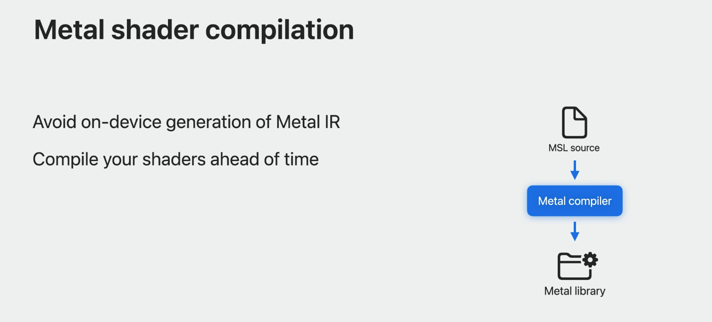

这部分在去年的 WWDC22 中也有详细讲到，可以参考去年的内参：
[WWDC22 10066/10101/10104】 探索 Metal3](https://xiaozhuanlan.com/topic/9276153048)

## 着色器转换

重点登场！重点登场！重点登场！

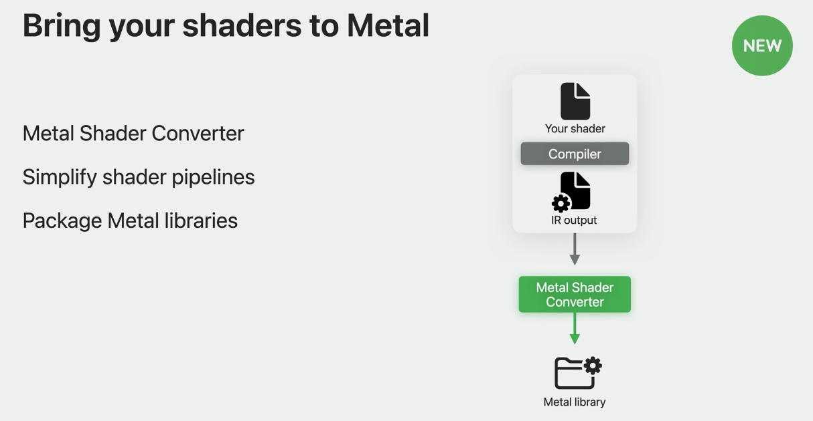

### 什么是 Metal 着色器转换器

Metal 着色器转换器是今年苹果提供的一个着色器转换工具。它可以帮助开发者快速移植 Windows 游戏到 Mac 平台。如果想要将我们的 shader 转换到 Metal 上，Metal 着色器转换器一定能帮你大大提高工作效率。苹果提供了 Mac 和 Windows 两个版本的工具。这两个包都包含独立和库形式的 Metal 着色器转换器，以及运行时配套头文件。可以通过以下链接获取：
[Metal 着色器转换器下载地址](https://developer.apple.com/download/all/?q=shader%20converter)


Metal 着色器转换器简化了的着色器管线，而且能够将生成的 Metal 库直接打包到 Bundle 中，从而避免在设备上生成 Metal IR。通过它生成的 Metal 库与从 Metal 编译器生成的库相同，同时它还允许转换得到的着色器与 Metal API 进行本地集成。它提供了一个强大的功能集，大大改善将其他着色语言编写的着色器转换为 Metal 的体验。

- 它支持将 DXIL 转换为 Metal IR。我们可以将它与开源 DXC 编译器工具一起使用，以构建端到端着色器管线。从 DXIL 转换为 Metal IR 非常快，因为 Metal 着色器转换器在二进制级别执行转换。这会减少着色器资源构建时间。
- 它具有丰富的功能集，它支持现有 DXIL 着色器的所有传统和现代着色器阶段。使用 Metal 着色器转换器，可以将传统图形管道的着色器（包括镶嵌和几何体着色器）转换为 Metal 库。
- 它还支持计算着色器，以及最近引入的光线跟踪阶段和着色器以及放大和网格着色器。

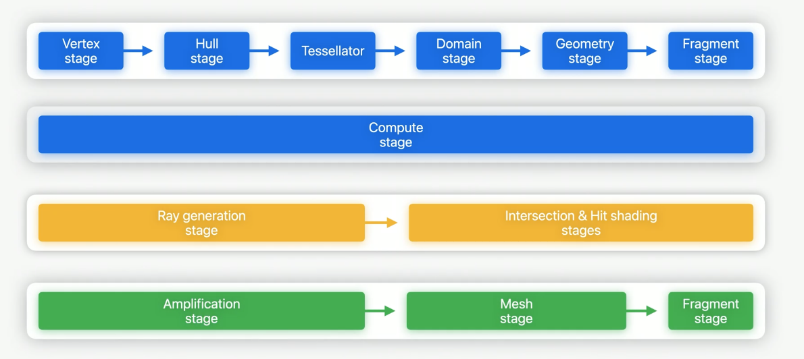

### Metal 着色器转换器的使用场景

Metal 着色器转换器提供有命令行和动态库两种形式。

通过终端使用命令行工具是一次转换一个着色器的好机制。如果有多个着色器，则可以创建一个 shell 脚本，该脚本调用 Metal 着色器转换器来自动转换多个着色器。使用命令行工具转换着色器非常容易。

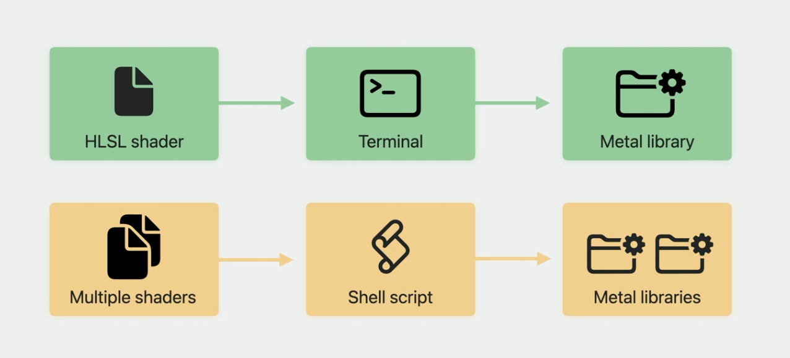

设置 DXC 和着色器转换器后，首先将 HLSL 着色器编译为 DXIL。DXC 要求您指定要编译的入口点、着色器类型和输出文件。接下来，在刚刚创建的 DXIL 文件上调用着色器转换器，并指定要创建的输出 Metal 库。默认情况下，着色器转换器为最新版本的 macOS 生成一个 Metal 库，以及包含有用反射数据的 JSON 文件。在运行时，将此 Metal 库传递给 Metal 设备以加载它并构建管道状态对象。

```shell
% dxc lambert.hlsl -E MainFS -T ps_6_0 -Fo lambert.f.dxil
% metal-shaderconverter lambert.f.dxil -o lambert.f.metallib
% file lambert.f.metallib
  lambert.f.metallib: MetalLib executable (MacOS), version 1.2.7
```

如果我们的着色器是有一些游戏引擎构建出来的。或者，当我们为 Metal 引导游戏时，我们可能还想在提前将着色器完全转换为 Metal 库之前，看看它们在平台上的工作情况。可以使用 Metal 着色器转换器动态库。它具有与 CLI 工具相同的所有功能。该库提供了纯 C 接口，与 CLI 一样，它在 macOS 和 Windows 上都可用，因此很容易集成到现有的工作流程中。

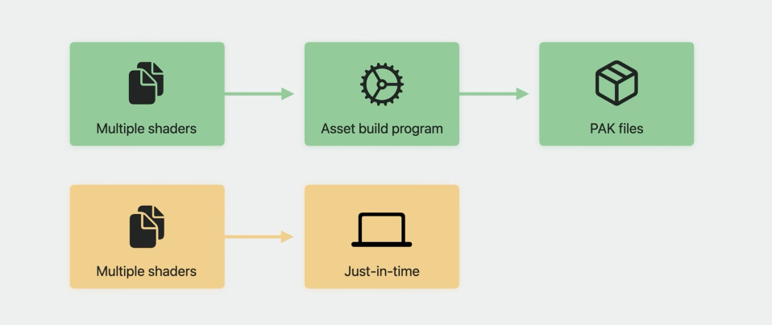

### 着色器资源绑定

将着色器转换为 Metal IR 后，可以通过创建管道状态并将资源绑定到着色器上来集成到游戏中。

在着色器中，通常将资源定义为全局变量，并声明为 “register”。

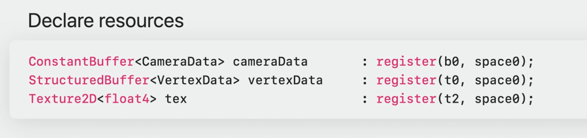

在 API 方面，您的游戏要么直接将资源绑定到这些插槽，要么通过“根签名”定义显式内存布局。

Metal 着色器转换器可以帮助我们恢复此模型，因为 Metal 具有非常灵活的绑定模型。它将这些资源布置到参数缓冲中。在这个模型中，您将一个参数缓冲直接绑定到您的管道，并通过它引用您的资源。这个“顶级”参数缓冲有两种布局模式可供选择。

自动参数缓冲布局是最简单的一种布局模式，着色器转换器将资源一个接一个地放置。一旦创建了包含着色器的管道状态，就可以绑定单个参数缓冲，并通过它引用所有资源。

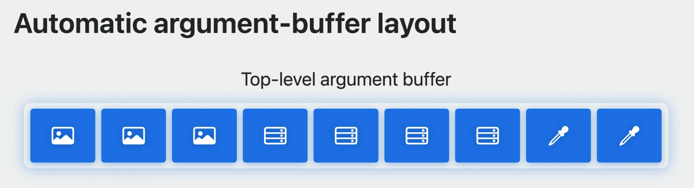


显式定义缓冲布局可以显式的定义与 “根签名” 相匹配的布局。当我们的游戏需要在各自的资源表中指定单独的纹理和采样器时，或者使用无绑定资源，这是最佳的方式。我们还可以将原始缓冲区和 32 位常量直接嵌入顶级参数缓冲区，如图中的 0 和 1 所示。

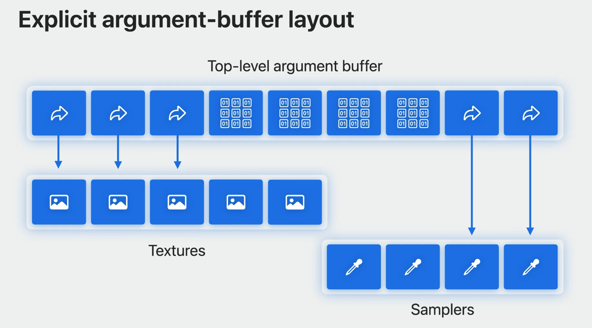

现在，顶级参数缓冲区是 CPU 和 GPU 之间共享的资源。因此在写入时，需要协调对其内存的访问，以避免可能导致视觉损坏的竞争条件。 我们不需要串行化 CPU 和 GPU 工作来避免这种竞争条件。避免这种情况的一种方法是使用 “bump” 分配器。这可以是一个大的 Metal 缓冲区，我们可以从中为每帧分配不同的资源。然后，为游戏的每一帧处理阴影。

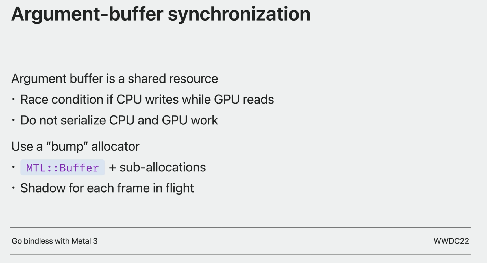

有关最佳参数缓冲区管理实践，请查看去年的[利用 Metal 3 实现无绑定](https://developer.apple.com/wwdc22/10101)和 Metal 文档。

由于图形 API 的差异，映射某些着色器阶段可能具有挑战性。例如，您可能有利用传统几何体和镶嵌阶段的管道。Metal 是一个现代的 API，它提供了诸如视口 ID 和放大等功能，这使得其他图形 API 中较旧、效率较低的阶段变得不必要。然而，当你的游戏依赖于这些管道来获得增强某些表面的传统效果时，手动转换它们的成本很高。

Metal 着色器转换器通过将这些管道映射到网格着色器。该工具通过将每个阶段映射到 Metal IR 表示，轻松地将这些复杂的管道转移到 Metal。这包括传统上是固定函数操作的镶嵌器。

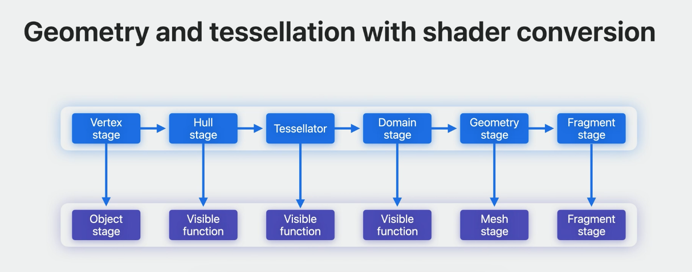

为了支持这一工作流程，今年 Metal 添加了将可见函数链接到网格着色器的“对象和网格”阶段的功能。编译着色器后，使用它们来构建 Metal 网格渲染管线描述符，并将其编译为 Metal 渲染管线状态对象。当 Metal 收到构建此管道状态的请求时，它会编译并链接所有 Metal IR，将所有函数烘焙到一个管道中，从而完全避免函数调用开销，并在运行时最大限度地提高性能。

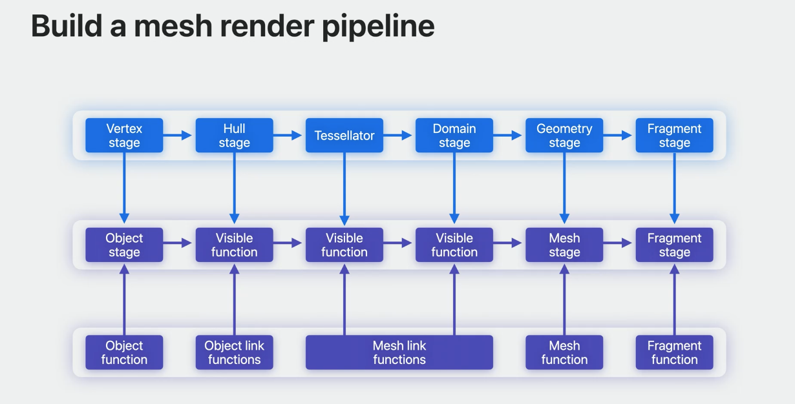

虽然构建这些网格管道很简单，但每条管道都必须按照精确的顺序遵循一系列步骤。着色器转换器运行时可帮助您构建这些复杂的管道。它甚至通过调度网格着色工作来模拟绘制调用。有关详细信息，请参阅 Metal 着色器转换器文档。

### 性能优化

现在，您的着色器已在 Metal 上，并且正在运行管道状态，下面是一些提示，可以帮助您获得出色的性能和视觉正确性。

1. 避免不必要的调用 “useResource”。

   使用 Metal 着色器转换器编译的着色器间接引用了 Metal 资源。要将资源驻留标记为 Metal，您可以调用 “useResource”。但是，当使用过量时，“useResource” 是一个昂贵的调用。

2. 使用 “useResources” 或者 “useHeap”

   使用多 “useResources” 一次提供多个资源，或者考虑通过 “useHeap” 使用 Metal 堆来标记单个调用中多个资源的驻留。

3. 利用 GPU 二进制缓存

   当 Metal 第一次编译管道对象时，管道对象会被缓存，从而自动减少后续运行游戏时基于编译的挂接。二进制归档也可以在这里帮助你。

4. Metal 着色器转换器可选优化

   Metal 着色器转换器提供了有关于兼容性、GPU 系列、顶点获取行为、入口点命名、反射等方面的自定义。

5. 混合着色器语言

   本文前面提到，着色器转换器加入 Metal 编译器作为从现有 Metal IR 生成 Metal 库的另一种机制。Metal 使用这些来提供各种图形管道阶段。由于一切都是 Metal IR，您可以在单个应用程序中甚至在单个管道中混合和匹配来自 Metal 着色器转换器和 Metal 编译器的 Metal 库。
   Metal 着色语言还使您能够访问独特的功能，如可编程混合。使用这种方法可以充分利用苹果的 GPU。您甚至可以利用独特的着色功能，例如平铺着色。这让你在如何将游戏带到 Metal 方面有了极大的灵活性。

   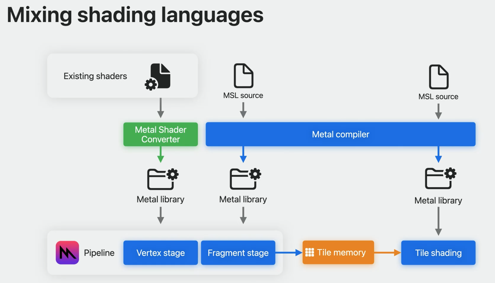


### 使用 Metal 纹理和采样器

HLSL 允许将纹理无缝地处理为一个元素的数组。若要引入依赖于此行为的着色器，则需要将纹理创建为纹理阵列，或在纹理上创建 “纹理阵列视图”。我们也可以使用 “MetalKit 纹理加载器”，它还可以帮助我们快速将文件加载为纹理数组。要设置采样器对象并从这些纹理中读取，一定要让 Metal 知道打算通过使用 MTL 采样器描述符中的属性 supportsArgumentBuffers 来引用参数缓冲区中的采样器。


## 提前编译 GPU 二进制文件

构建游戏时，将着色器编译到 Metal 库中，这些库仍需最终确定为 GPU 二进制文件，从而导致加载屏幕更长。如果推迟在运行时完成 GPU 二进制文件，可能会导致游戏按需编译新管道时帧丢失。

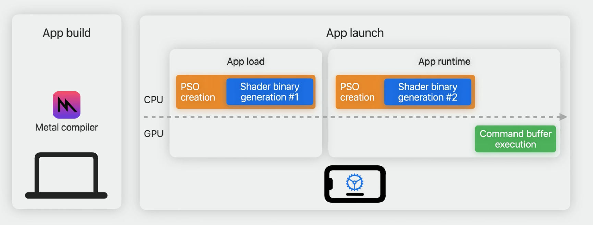

Metal GPU 二进制编译器可以帮助您解决这个问题，允许您在游戏构建时生成着色器二进制文件。通过消除在游戏过程中生成着色器二进制文件的需要，您的玩家可以从减少的应用程序加载时间中受益，而不会产生额外的 GPU 故障。


### GPU 二进制工具

为了在构建游戏时将 Metal 库最终确定为 Metal 二进制归档， 我们需要在工作流中添加另一个步骤。
当我们从 Metal 描述符创建管道状态时，设备上的 GPU 二进制编译会发生。

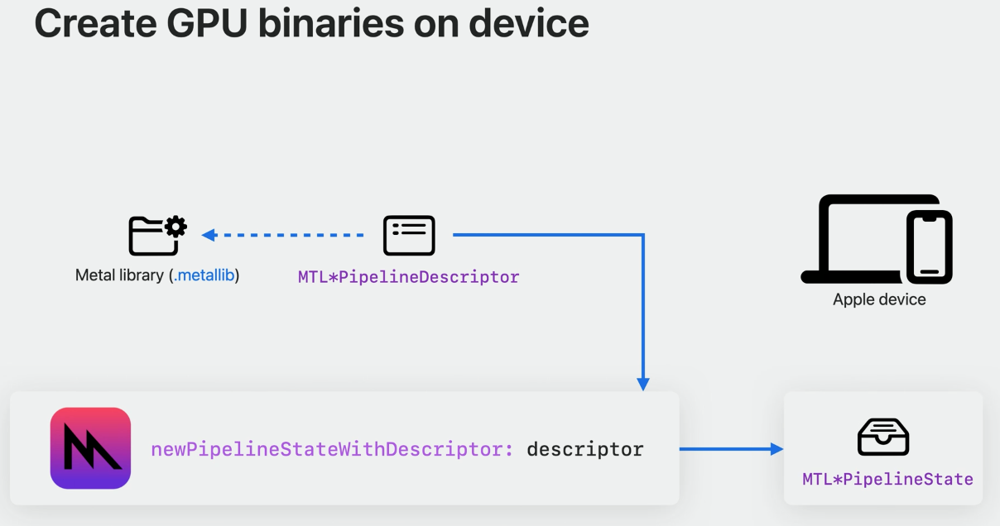

该描述符不仅引用 Metal 库中的函数，而且还为 Metal 提供其他关键信息，如渲染附件的颜色格式和顶点布局描述符。GPU 二进制文件是作为 PSO 创建的一部分及时生成的。

二进制存档工具允许您控制编译发生的时间。为了提前生成 GPU 二进制文件，您可以提供现有的 Metal 库以及引用这些库的管道配置脚本。然后通过 metal tt 生成一个带有 GPU 二进制文件的二进制归档。

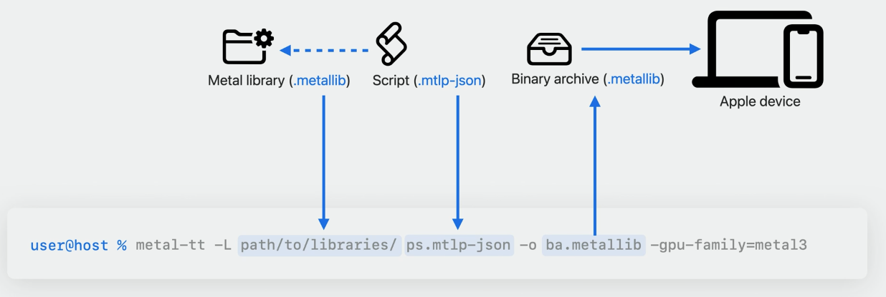


为了开发管道脚本，您需要生成一个带有类似于 Metal API 的管道配置的 JSON 脚本。此 Metal 代码生成一个渲染管道描述符，旁边是其 JSON 等效表示。对于管道脚本，添加 Metal 库路径及其片段和顶点函数名称。您还可以指定任何其他管道状态配置。

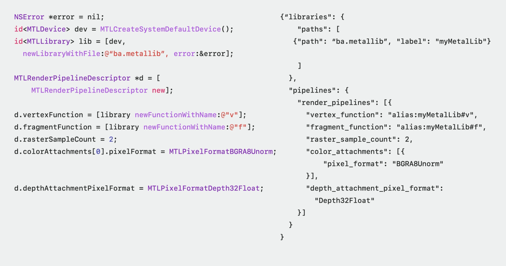

提前着色器编译工作流可能不适合生成管道脚本文件。但我们可以在设备上运行游戏时录制 Metal 二进制归档。这些归档文件包括相应的管道脚本。若您从设备中获取这些二进制归档，那个么您就可以使用 “Metal-source” 工具来提取它们的嵌入式管道脚本。然后在提取的脚本中更新到 Metal 库的路径。

```shell
% metal-source -exteact=metal-scripts -flatbuffers=json ba.metallib -o directory
```

有关更多信息，请参阅苹果之前的讲座[用 Metal 技术构建 GPU 二进制](https://developer.apple.com/wwdc20/10615)和[探索 Metal 中的编译工作流程](https://developer.apple.com/wwdc21/10229)。


因为 GPU 二进制文件是为每个 GPU 量身定制的，所以 “metal tt” 会根据玩家的设备生成不同版本的二进制文件供您分发给玩家。“metal tt” 通过将所有不同的 GPU 二进制文件整齐地封装到 Metal 二进制文件归档中，帮助我们管理这种复杂性。这样，当我们的应用程序加载二进制文件归档时，Metal 会自动为玩家选择合适的二进制文件。您还可以将多组二进制文件封装到单个二进制文件归档中。

当玩家运行带有预编译 GPU 二进制文件的 Metal 应用程序时，Metal 会在打包的二进制文件归档中搜索必要的 GPU 二进制文件。如果 Metal 在存档中找不到匹配项，它会自动返回到设备上编译。我们的应用程序看起来仍然正确，但这可能会造成性能上问题。
您可以使用 “FailOnBinaryArchiveMiss” 选项来测试您的二进制文件归档是否包含我们期望的管道。
创建 Metal 管道状态对象时，可以轻松指定 “FailOnBinaryArchiveMiss” 选项。
如果二进制文件归档未命中，且设置了此选项时，Metal 将跳过设备上的编译并返回 "nil"。

```Objective-C
// Create Pipeline Descriptor
MTLComputePipelineDescriptor *computeDesc = [MTLComputePipelineDescriptor new];
computeDesc.binaryArchives = @[existingBinaryArchive];
computeDesc.computeFunction = computeFn;
id<MTLComputePipelineState> computePS = 
                     [device newComputePipelineStateWithDescriptor:computeDesc
                                     options:MTLPipelineOptionFailonBinaryArchiveMiss
                                     error:&err];                                                                                        

if(computePS == nil)
{
    // Binary archive is missing compiled shader.
}
```

一旦您的二进制文件归档准备好支持所有目标设备，就可以进行部署了。并非所有玩家都使用最新的操作系统。为了确保所有用户都能从二进制文件归档中受益，请为每个主要操作系统版本生成一个文件归档，并将其存储到您的应用程序中。要做到这一点，请检查玩家设备的操作系统版本，并选择适当的二进制文件归档与管道描述符相关联。

```Objective-C
// Load OS-specific binary archives
MTLComputePipelineDescriptor *computeDesc = [MTLComputePipelineDescriptor new];

if (@available(macOS 14, *)) {
    computeDesc.binaryArchives = @[binaryArchive_macOS14];
} else {
    computeDesc.binaryArchives = @[binaryArchive_macOS13_3];
}  
computeDesc.computeFunction = computeFn;
id<MTLComputePipelineState> computePS = 
                     [device newComputePipelineStateWithDescriptor:computeDesc
                                     options:nil
                                     error:&err];
```

当玩家更新他们的操作系统时，他们的二进制文件归档可能需要重新编译以实现前向兼容性，但 Metal 已经为此提供了保障。Metal 在玩家设备上的应用程序包中识别未打包的二进制文件归档，并在操作系统更新或游戏安装后在后台自动升级。

### Metal 编译工具链的总结

1. 编译 MSL 源代码时使用 Metal 编译器
2. 着色器位于 HLSL 中则使用 Metal 着色器转换器。
3. “metal-tt” 能够将 metal 库最终确定为 GPU 二进制文件，以适应 metal 生态系统中的各种 GPU。
4. “metal-source” 可以帮助我们从现有的 MacOS 游戏中获取管道脚本。

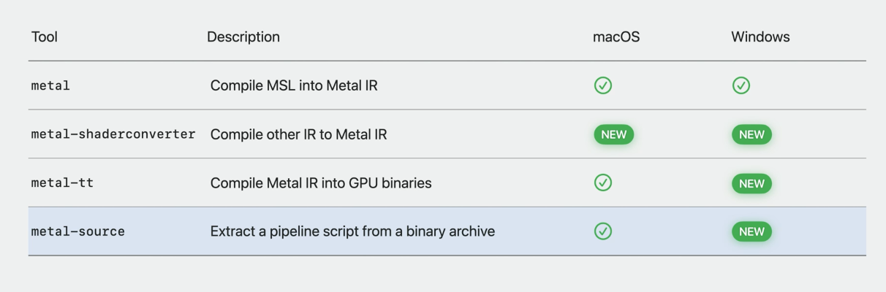

## 总结

Metal 着色器转换器是一个新工具，可以帮助我将用另一种着色语言开发的着色器应用到 Metal 中。GPU 二进制编译器及其工具链现在可以在 Windows 上使用，可以将 Metal 库最终确定为 GPU 二进制文件。有了这些工具，我们就拥有了将着色器带到 Metal 所需的一切。
