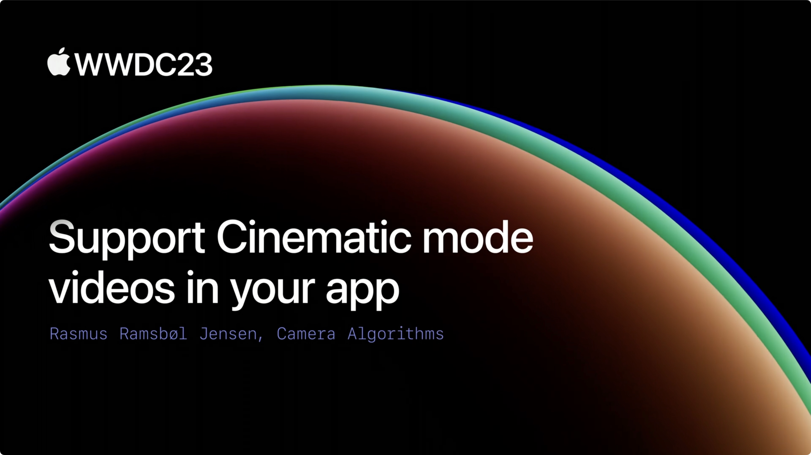

## 个人介绍

bq，野生工程师一枚，收兵于剪映团队，喜欢音视频和图像处理，热爱摇滚与爵士。

## 审核介绍

anotheren，老司机周报编辑，新晋奶爸，无业游民，正在向全栈独立开发者努力，熟悉图像与视频技术，希望在 AI 与 VR 浪潮中，找到新的定位。

Dylan Yang, iOS 开发者，目前就职于字节音乐部门，业务爱好二次元&游戏。

## 不超过 120 个字的文章简介

本文基于 WWDC23 [session 10137](https://developer.apple.com/videos/play/wwdc2023/10137) 整理，通过本文你将详细介绍电影效果模式以及最新的 Cinematic API，让电影效果模式的播放和编辑能力也能集成在你的 App 中。本文可配合官方 [Demo](https://developer.apple.com/documentation/cinematic/playing_and_editing_cinematic_mode_video) 一起阅读。

## 公众号/小专栏图文头图

