# Cinematic API 助你成为电影大师

> 摘要：通过本文你将详细介绍电影效果模式以及最新的 Cinematic API，让电影效果模式的播放和编辑能力也能集成在你的 App 中。本文可配合官方 [Demo](https://developer.apple.com/documentation/cinematic/playing_and_editing_cinematic_mode_video) 一起阅读。

本文基于 WWDC23 [session 10137](https://developer.apple.com/videos/play/wwdc2023/10137) 整理。

> 作者：
>
> bq，野生工程师一枚，收兵于剪映团队，喜欢音视频和图像处理，热爱摇滚与爵士。
>
> 审核：
>
> anotheren，老司机周报编辑，新晋奶爸，无业游民，正在向全栈独立开发者努力，熟悉图像与视频技术，希望在 AI 与 VR 浪潮中，找到新的定位。
>
> Dylan Yang, iOS 开发者，目前就职于字节音乐部门，业务爱好二次元&游戏。


如果你曾经对电影效果模式感兴趣，或者希望在自己的 App 中集成其播放和编辑能力，本文都非常适合你，另外本文需要有一点点 AVFoundation 和 Metal 的基础。以上都没有也没关系，相信经过本文，你也会对电影效果模式心动，毕竟，谁不想成为电影大师呢～

文章篇幅较长，纲要如下，可自行选择感兴趣的部分：

- Cinematic mode：电影效果模式功能、使用的介绍，以及与传统电影摄制方式的区别。
- 数据组成：电影效果模式视频的数据组成和轨道分析。
- AVFoundation：与本文相关的 AVFoundation 基础知识。
- 播放：描述如何从获取 Cinematic asset 到集成到播放器的过程。
- 编辑：描述 Cinematic API 支持哪些维度的编辑能力，以及如何集成使用。
- 其他特性：Cinematic API 除渲染和编辑 asset 外的其他功能特性。
- 结语：简单的总结和畅想。

## Cinematic mode

在介绍 Cinematic API 之前，让我们先来了解一下电影效果模式。早在 iPhone 13，苹果推出了电影效果模式（Cinematic mode），利用算法，通过 A15 芯片和感光元器件的配合，就可以拍出与电影类似的自动、平滑的焦点切换效果。这里的电影效果的理解，不是指拍出电影大片，而是可以轻松地使用镜头语言引导内容的叙事。其中最关键的是“焦点转移”（移焦/拉焦/追焦/跟焦/Rack focusing）。典型的如《大话西游》里，紫霞仙子眨眼后，镜头焦点便挪到了至尊宝的脸上。

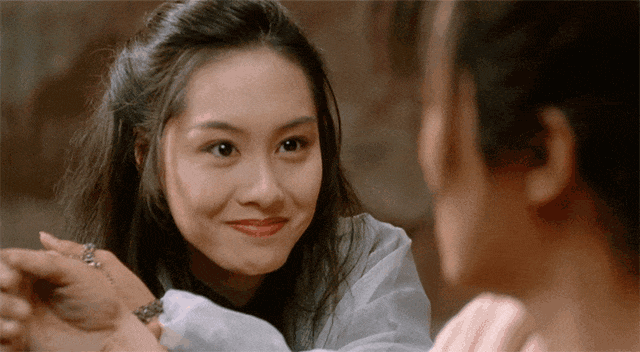

这就是电影效果模式中的核心镜头语言。那么传统的电影拍摄是怎么做焦点转移的呢？电影拍摄的大部分镜头都没有自动对焦（AF）功能，都需要有专业的跟焦员（focus puller）手动对焦（MF）。这大概是由于 AF 技术在电影拍摄中并不成熟以及不满足拍摄过程灵活的对焦需求。

跟焦员需要提前理解剧本，并提前做好摄影机调度排练，根据演员的走位，提前做好跟焦标记。当剧情需要的时候精确地对焦到叙事主体上，这里的精确包含时间上和空间上的精确。

跟焦员当然也不是谁都可以直接上岗的，一是需要有专业的理论知识；二是需要熟练的进行焦距测算，以及熟练的对焦技术。这些都需要手工完成，只有长期的练习才能做到指哪打哪的跟焦技术。

如今，只需要一台 iPhone 13 以上的设备，打开相机 App，进入电影效果模式，动动手指，就可以轻松使用焦点转移，以电影的方式叙述属于自己的故事。甚至，你甚至不干预对焦，完全交给设备，电影效果模式系统会全自动完成对焦和焦点转移，系统会根据入境的主体自动对焦，人物移动的时候自动跟焦，当人物看向另一个方向时，自动对焦到看向的物体，新人物进入时根据谁在说话自动地完成移焦……这一切都是利用机器学习算法，通过通过 A15 芯片和感光元器件的配合完成的。这就是电影效果给我们带来的，一个藏在口袋中的微型电影摄制组，一台漂亮浅景深、焦点自然过渡的相机、一位导演（通过改变焦点来引导观众注意力和叙事），以及一位跟焦员（提前预测关键帧，并在不同焦点之间平滑过渡）。电影效果模式可以在 iPhone 13 系列及以上机型的相机 App 中直接录制，并实时预览。

不仅如此，相比传统电影拍摄需要不断地 NG 甚至补拍来获得理想对焦效果，使用电影效果模式拍摄的视频，还允许在录制后进行无损的编辑。可以在后期自由地修改光圈来调整背景虚化效果（bokeh）。自由地改变对焦的对象，系统将自动完成跟焦，自由地在想要的时间点添加焦点转移，系统将平滑地完成焦点过渡。使用候选的智能检测来改变焦点和叙事。简单总结电影效果模式的功能与技术：

- 主体识别和跟踪（人物、动物、背景）
- 锁定对焦
- 移焦
- 景深效果
- 图像扫描和相机 OIS 稳定
- 拍后无损编辑，可无损修改光圈、焦点

为了更好地理解电影效果模式的能力，我们引用 [苹果官方的教程](https://support.apple.com/zh-cn/HT212778) 再来简单了解其中的拍摄录制和后期编辑的过程：

### 拍摄录制

电影效果模式目前仅能拍摄视频，打开相机 App，进入电影效果 tab。录制前支持调整这些配置：

- 景深控制，调节光圈 ƒ 值。
- 焦距控制，系统会自动切换长焦镜头和广角镜头。
- 曝光控制，调节数码曝光值/亮度值。
- 闪光灯控制。

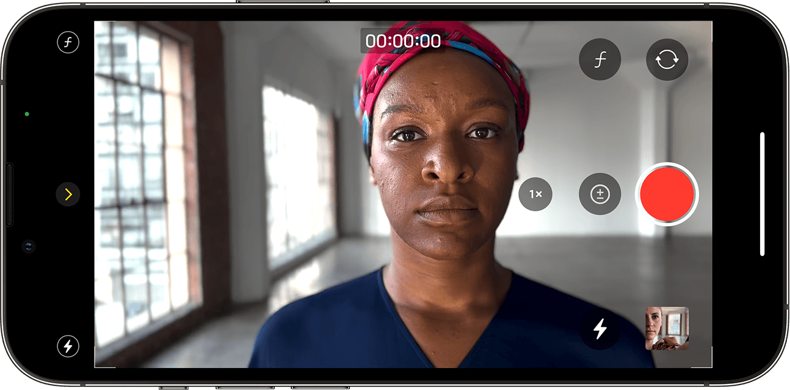

点录制按钮开始录制，录制过程可以进行这些控制：

- 单击画面主体，转换焦点。
- 双击画面主体，自动对焦跟踪。
- 长按，自动对焦锁定。

再次点录制按钮停止录制并自动保存到相册。

另外，如果你拍出来的视频额外的亮，似乎比屏幕的其他位置都要亮，这不是错觉，不要慌张，只是因为当前正在预览一个 HDR 视频，iOS 默认开启录制 HDR 视频。当然你可以通过到“设置 > 相机 > 录制视频 > HDR 视频”进行关闭，这样相机 App 就只会录制 SDR 的视频。又或者你想保留 HDR 视频，但又不想屏幕突然亮起来，也可以通过到“设置 > 照片 > 查看完整 HDR”进行关闭，这样即使在照片 App 打开 HDR 视频，屏幕也不会突然亮起来，但其他支持 HDR 的 App 还是会照常亮起来。

而这种亮起来的行为则是系统使用 EDR 技术结合显示内容在不同的屏幕硬件使用峰值亮度模拟出来的，就是为了让你在视觉上觉得 HDR 的内容色彩多么的斑斓，与普通 SDR 界面相比多么的与众不同与高贵。扯远了，感兴趣的同学可以看看往年的 [Explore HDR rendering with EDR](https://developer.apple.com/videos/play/wwdc2021/10161/) 视频。

### 后期编辑

照片 App 就能对电影效果模式视频进行编辑。在要调整的视频下，点“编辑”进入编辑状态，支持以下编辑：

- 景深控制，调节光圈 ƒ 值。景深修改会应用到**整个**视频长度中。
  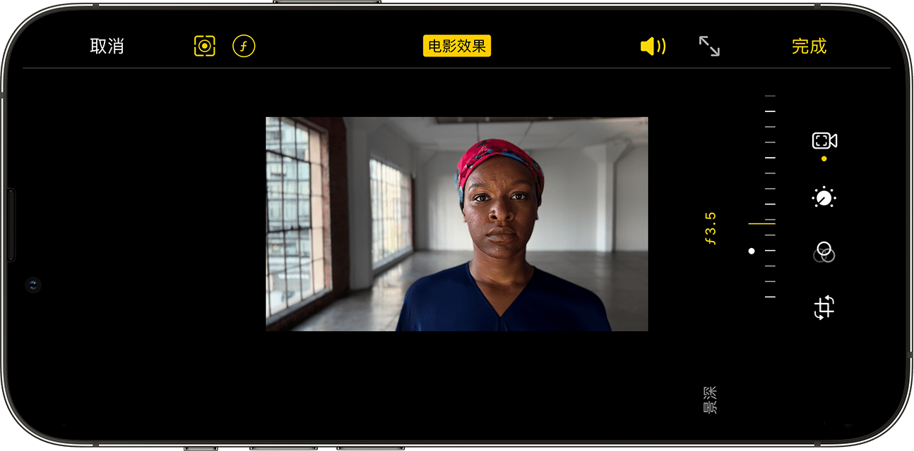

- 焦点控制，支持的修改与录制中的手势控制与操作一致，只是可以基于时间线与关键帧进行分段控制。点击 ƒ 左侧的对焦按钮，切换自动对焦跟踪和手动选择焦点。

  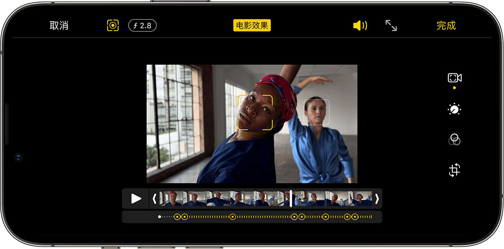

拍摄和编辑中出现的 UI 比较通用，广泛应用在支持电影效果模式编辑的 App，如：照片、iMovie、Final Cut Pro、Motion 等，下面简单进行说明。

编辑时间线上：由相机 App 自动创建的焦点显示为白点，由用户手动添加的焦点显示为带圆环的黄点。

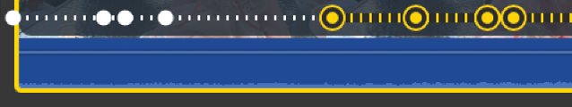

屏幕手势控件：

| 屏幕控件                                                               | 名称             | 描述                                                                                                                                                           |
| :--------------------------------------------------------------------- | :--------------- | :------------------------------------------------------------------------------------------------------------------------------------------------------------- |
|          | 当前对焦指示器   | 黄色括号表示摄像机自动跟踪的当前对焦主体或区域。                                                                                                               |
|          | 建议焦点指示器   | 白色框表示摄像机自动跟踪的潜在对焦主体。                                                                                                                       |
|  | 自动对焦跟踪锁定 | 黄色框表示手动设定（录制期间或后期编辑）的当前对焦主体或区域。“自动对焦跟踪锁定”对焦在一个主体上并跟随其移动，即使视频中出现其他潜在的对焦主体也不受影响。     |
|      | 自动对焦锁定     | 带刻度标记的黄色小方形表示手动设定（录制期间或后期编辑）的固定焦点。“自动对焦锁定”对焦于离摄像机特定距离处，且忽略片段中的所有元素（直到下一个手动焦点出现）。 |

而本文介绍的 Cinematic API，提供了之前官方 App 中电影效果的播放和编辑能力，现在广大开发者也可以集成到自己的 App 中。

Cinematic API 支持在 macOS Sonoma、iOS 17、iPadOS 17 和 tvOS 17 上使用。

## 数据组成


电影效果模式的数据实际上由两个文件，以及文件间的数据流组成。可以通过从 iPhone 把电影效果模式视频 AirDrop 到 mac，文件组成更加明显。**注意在分享前，在面板的选项中，勾选“所有照片数据”，否则传过来的只是个渲染后的视频，这个配置在跨设备分享电影效果模式视频都要选上。**


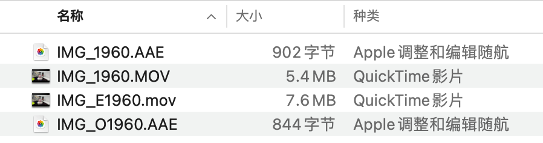

可以看到传到 mac 的文件有 4 个：

- `IMG_1960.MOV` 是不带效果的视频；
- `IMG_E1960.mov` 是渲染了电影效果的视频；
- AAE 后缀的文件则是 plist 文件，是相册 App 的图像调整文件，保存用户的编辑修改信息。相册 App 的编辑不会保存到源文件中，而是额外地保存到 AAE 文件中。

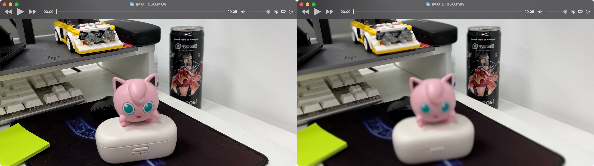

### Rendered asset

渲染后的 asset。这是一个应用了电影效果模式的普通影片文件，可以作为常规的 QuickTime 影片导出、分享和播放。如上述的 `IMG_E1960.mov`，可以看到画面包含了电影效果模式中的移焦效果。

### Cinematic asset

电影效果模式的特殊 asset，下面称为 Cinematic asset，其中包含了创建渲染 asset 所需的所有信息。这在不同的载体中可能是多个文件，但在相册相关的 API 中，通常使用一个 PHAsset 甚至 AVAsset 表达这些文件集合。它允许进行无损的后期编辑，例如修改光圈和重新对焦来进行影片叙事。

让我们先来看一下渲染后的 asset，并用一点摄影学 [101](https://zh.wikipedia.org/zh-hans/101_(%E4%BF%9A%E8%AF%AD)) 来分析一个镜头。

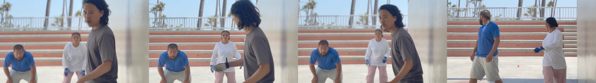

> 开场镜头：我们进入了一场显然非常重要的街头手球比赛，通过对焦主角，在他准备放大招时，我门真切地感受到了紧张的气氛。
>
> 他检查了下队友。他也准备好了。焦点对焦到队友身上，强调他也准备好了。
>
> 焦点回到主角。就在这时，紧张气氛达到顶点。他投出了惊人一球，但完全搞砸了，制造了一些喜剧效果。

现在，我们改变叙事，在镜头开始时就对焦到队友，让他始终保持焦点。让我们代入他的角色。

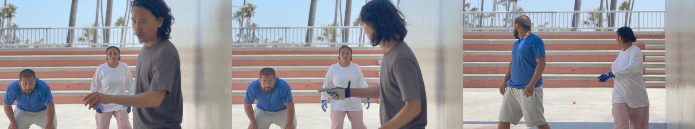

> “老哥，别磨磨唧唧的直接上吧。”
> "I love you, buddy, but you always take forever. "
>
> “嗯，我好了，不过好像也就那样？”
> "Yes, I’m ready, but I have low expectations. "
>
> “真是浪费时间。”
> "What a waste of time. "
>
> “6。”
> "Bravo. "

这段视频是用 iPhone 13 拍摄的，使用了电影效果模式进行叙事。

为了生成渲染后的 asset，还需要一个 Cinematic asset。为了支持无损的后期编辑，Cinematic asset 实际上包含多个轨道：

- Video
- Disparity
- Metadata

同样，我们还是拿导出到 mac 的电影效果模式视频文件进行分析。直接放到播放器播放，可以简单看到：

- `IMG_1960.MOV` 是不带效果的视频；
- `IMG_E1960.mov` 是渲染了电影效果的视频；

首先是 `IMG_E1960.mov`，该影片是渲染了电影效果，使用 ffprobe（FFmpeg 的一个命令行工具）进行分析，该文件只包含音频轨和视频轨，可见它只是个普通 Rendered asset，常规的 QuickTime 影片。

```yaml
Input #0, mov,mp4,m4a,3gp,3g2,mj2, from 'IMG_E1960.mov':
  Metadata:
    major_brand     : qt
    minor_version   : 0
    compatible_brands: qt
    creation_time   : 2023-06-28T02:07:58.000000Z
    com.apple.quicktime.cinematic-video:
    com.apple.quicktime.make: Apple
    com.apple.quicktime.model: iPhone 13 mini
    com.apple.quicktime.software: 15.5
    com.apple.quicktime.creationdate: 2023-06-28T10:07:22+0800
  Duration: 00:00:05.30, start: 0.000000, bitrate: 11512 kb/s
  Stream #0:0[0x1](und): Video: hevc (Main) (hvc1 / 0x31637668), yuvj420p(pc, bt709), 1920x1080, 11325 kb/s, 30 fps, 30 tbr, 600 tbn (default)
    Metadata:
      creation_time   : 2023-06-28T02:07:58.000000Z
      handler_name    : Core Media Video
      vendor_id       : [0][0][0][0]
      encoder         : HEVC
    Side data:
      displaymatrix: rotation of -180.00 degrees
  Stream #0:1[0x2](und): Audio: aac (LC) (mp4a / 0x6134706D), 44100 Hz, stereo, fltp, 175 kb/s (default)
    Metadata:
      creation_time   : 2023-06-28T02:07:58.000000Z
      handler_name    : Core Media Audio
      vendor_id       : [0][0][0][0]
```

然后是 `IMG_1960.MOV` 文件，直接预览播放，像是不带电影效果的视频，但扒拉一下数据，发现包含的不仅仅是音频轨和视频轨，竟然有 4 个轨道。

```yaml
Input #0, mov,mp4,m4a,3gp,3g2,mj2, from 'IMG_1960.MOV':
  Metadata:
    major_brand     : qt
    minor_version   : 0
    compatible_brands: qt
    creation_time   : 2023-06-28T02:07:22.000000Z
    com.apple.quicktime.cinematic-video:
    com.apple.quicktime.make: Apple
    com.apple.quicktime.model: iPhone 13 mini
    com.apple.quicktime.software: 15.5
    com.apple.quicktime.creationdate: 2023-06-28T10:07:22+0800
  Duration: 00:00:05.30, start: 0.000000, bitrate: 8188 kb/s
  Stream #0:0[0x1](und): Video: hevc (Main) (hvc1 / 0x31637668), yuv420p(tv, bt709), 1920x1080, 7650 kb/s, 30 fps, 30 tbr, 600 tbn (default)
    Metadata:
      creation_time   : 2023-06-28T02:07:22.000000Z
      handler_name    : Core Media Video
      vendor_id       : [0][0][0][0]
      encoder         : HEVC
    Side data:
      displaymatrix: rotation of -180.00 degrees
  Stream #0:1[0x2](und): Data: none (dish / 0x68736964), 251 kb/s (default)
    Metadata:
      creation_time   : 2023-06-28T02:07:22.000000Z
      handler_name    : Core Media Auxiliary Picture
  Stream #0:2[0x3](und): Audio: aac (LC) (mp4a / 0x6134706D), 44100 Hz, stereo, fltp, 175 kb/s (default)
    Metadata:
      creation_time   : 2023-06-28T02:07:22.000000Z
      handler_name    : Core Media Audio
      vendor_id       : [0][0][0][0]
  Stream #0:3[0x4](und): Data: none (mebx / 0x7862656D), 88 kb/s (default)
    Metadata:
      creation_time   : 2023-06-28T02:07:22.000000Z
      handler_name    : Core Media Metadata
```

- `0:0`：普通 Core Media Video 视频轨。
- `0:1`：Core Media Auxiliary Picture 的数据轨，对应的应该就是 Disparity Track。
- `0:2`：普通的 Core Media Audio 音频轨。
- `0:3`：Core Media Metadata，对应的应该就是 Metadata Track。

而一般的播放器只会播放常见的轨道，即播放器认识的轨道类型，所以会忽略上面的 Disparity Track 和 Metadata Track，看到的是不带电影效果的画面。

#### Video Track

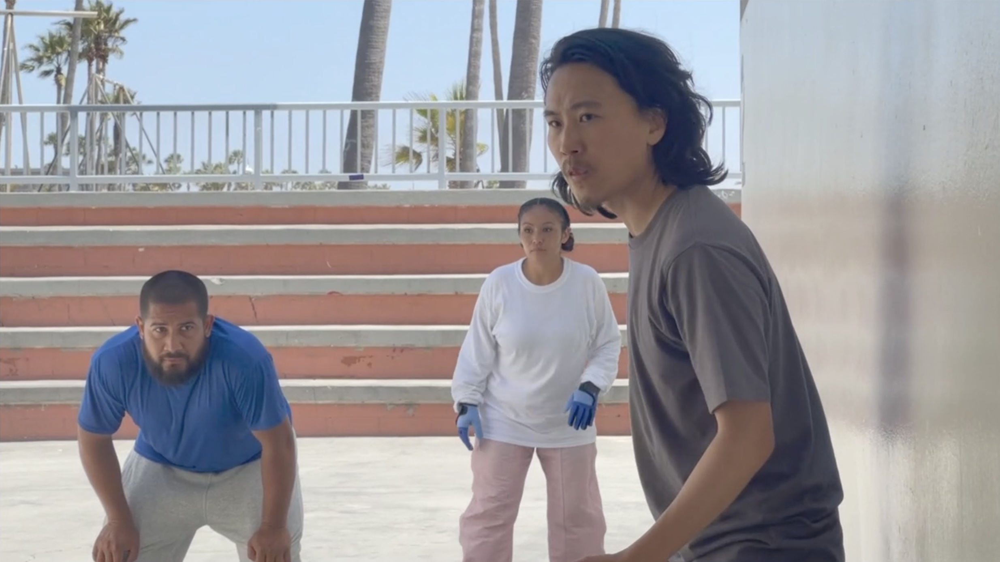

视频轨道，这是原始采集的 QuickTime 影片，即不包含电影效果的原始影片，如上 `IMG_1960.MOV` 的视频轨。它可以是 HDR/SDR，1080p @ 30 fps，在 iPhone 14 上甚至可以是 4K @ 24/25/30 fps 。这个轨道作为普通视频播放，但与渲染后的素材相比，它没有浅景深虚化效果，缺乏美感和叙事能力，没有悬念、喜剧效果，我们只是麻木地旁观几个人在后巷玩游戏。

#### Disparity Track

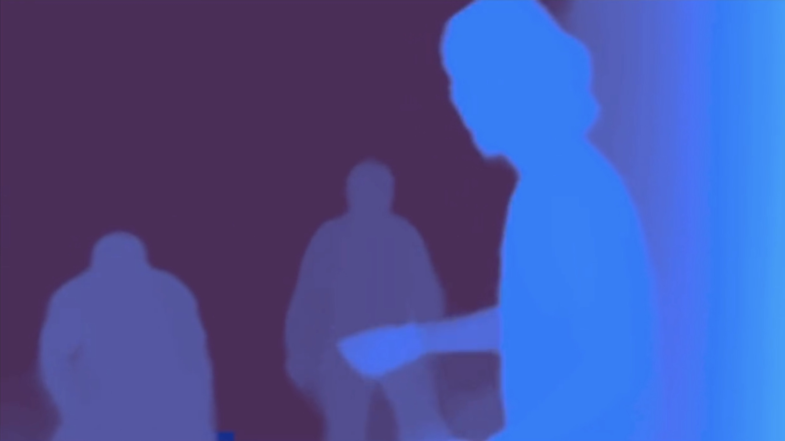

视差轨道，包含视差图（Disparity map）。该轨道显示为着色，包含相对视差，这意味着它只能相对于同一个视差图的其他采样使用，例如相对于焦点视差进行渲染或在两个焦点之间过渡。视差用于对焦和浅景深的渲染。

视差图的分辨率低于视频轨道。如上面的 `IMG_1960.MOV`，使用 media_info 命令行工具，可以看到视频轨道的分辨率是 1920×1080，而视差轨道的分辨率只有 320×180。

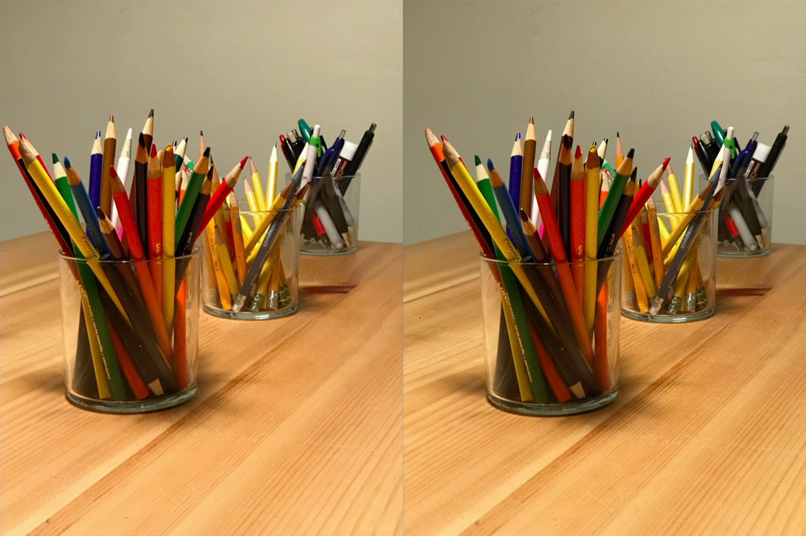

视差是两个相机观察同一场景时看到的像素偏移（pixel shift），近距离的物体比远距离的物体偏移更多。你可以自己感受视差，保持一个方向注视物体，使用单个眼睛轮换观察，看看不同距离的物体是如何移动的。

从视差原理可知，视差数据需要双目观测，即需要用到设备的双摄同时采集，三摄还不一定行。所以可以使用 `builtInDualCamera` 或 `builtInDualWideCamera` AVCaptureDevice.DeviceType 来获取和使用设备。

深度与视差紧密关联，可以这么说，视差是用于计算得出深度的，但视差得出的深度是相对的，目前只用在拍照和录像，像 AR 场景就需要前置的 TrueDepth 镜头或后置的 LiDAR，或后置单摄 + ML 来获取深度。有了深度信息，渲染景深就有了数据支撑，也是这样，才能实现自然的对焦平面（垂直于相机拍摄方向），而不是简单地抠像做 mask 模糊。所以在电影效果模式中的背景虚化效果与人像模式中的虚化效果基本一致。

有关深度采集的更多技术细节和数学原理可以观看往期 WWDC 视频 [Capturing Depth in iPhone Photography](https://developer.apple.com/videos/play/wwdc2017/507/)，以及文档与示例代码 [Depth data capture](https://developer.apple.com/documentation/avfoundation/additional_data_capture#2877303)。

#### Metadata Track

元数据轨道，包含渲染和编辑所需的重要元数据。轨道由两部分组成：

- 渲染属性：
  - 焦点视差
  - 光圈 f 值
- Cinematic script

首先是渲染属性，其中包含表达焦点视差和光圈值的 f 值。这是驱动渲染的重要因素。

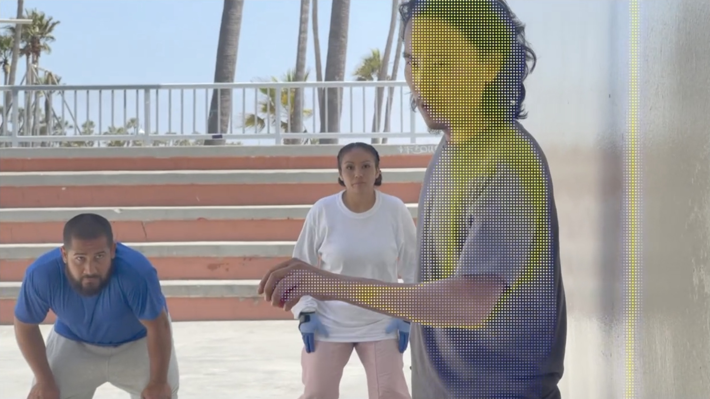

焦点显示为叠加，由 Cinematic 引擎决定，而光圈由用户选择。

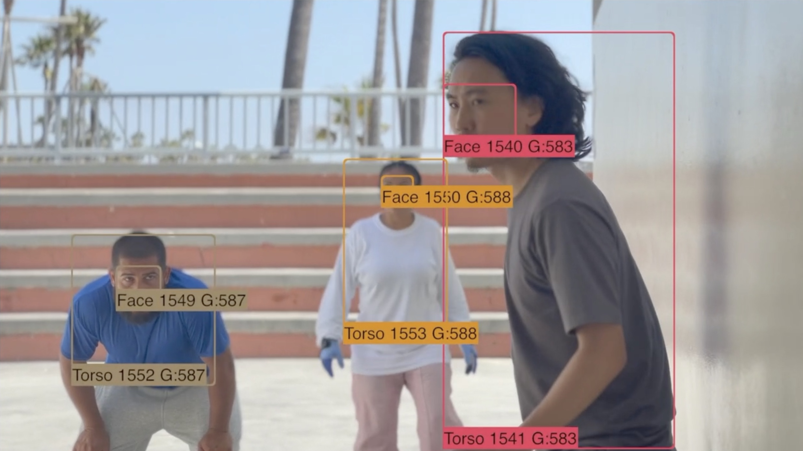

然后是 Cinematic script，其中包含所有自动场景检测识别。这个场景显示了面部、头部和躯干，如果可能的话，它们通过 ID 进行分组，随着时间的推移将它们链接在一起。该脚本还保存焦点决策（focus decision），决定如何对焦到哪个检测对象中。焦点决策可以在后期进行修改，以跟踪其他检测对象，从而改变叙事和渲染。

### Dataflow: Cinematic asset to Rendered asset

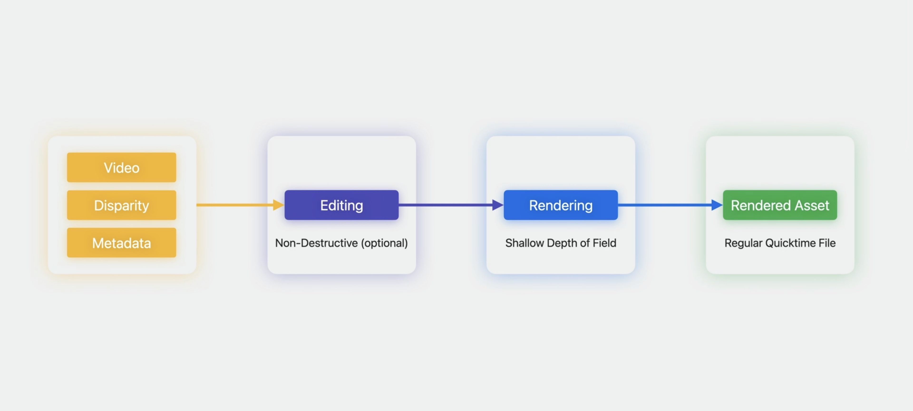

这是从 Cinematic asset 到 Rendered asset 的数据流。如前面提到的，Cinematic asset 包含了渲染和采集后焦点及光圈变化所需的所有信息。

然后是编辑，这一步是可选的，其修改是无损的，可以单独从文件中加载，可以随时恢复到原始版本。如果没有进行编辑，Cinematic 引擎会自动控制焦点视差，且不改变用户在拍摄时设置的光圈。

使用焦点视差和光圈渲染浅景深，使用视差图精确控制焦点过渡。

最后就得到了应用了效果的 Rendered asset，这是一个可以共享的普通 QuickTime 影片。

## AVFoundation

我们将使用 AVFoundation 实现 Cinematic asset 的播放与编辑。在进入具体 API 讲解前，我们先简单梳理下 AVFoundation 播放和编辑的核心类及其关系。


AVAsset 是具体音视频文件的数据模型类，包含了媒体资源的静态信息，如元数据、轨道对象抽象，但这些信息都是访问时才去读取文件加载信息。AVAsset 是抽象类和不可变类，一般使用 AVURLAsset 实例化，即从 URL 本地或远程加载音视频资源。

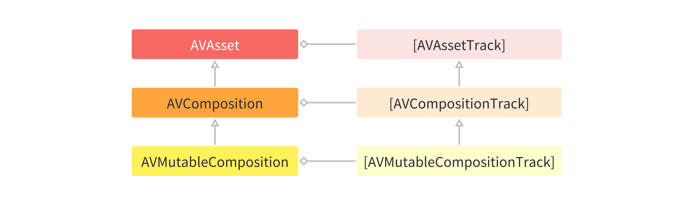

AVComposition 是 AVAsset 子类，一般使用其 mutable 版本，即 AVMutableComposition，是多媒体轨道容器，与 AVAsset 不同，它允许组合来自不同的 asset 的轨道的部分时间段，即用于组织时间线。

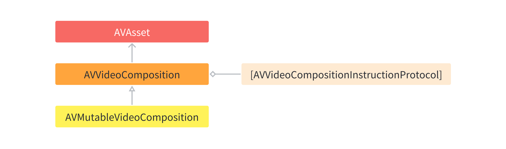

AVVideoComposition 是视频帧在时间点上的合成描述，即画面编辑的描述。使用 AVAsset 创建，一般也使用其 mutable 版本，即 AVMutableVideoComposition。通过指令 `instructions: [AVVideoCompositionInstructionProtocol]` 接收用户数据模型。配置自定义合成器类 `customVideoCompositorClass: AVVideoCompositing.Type?` 可实现自定义的合成器。内置的合成器只能实现 opacity、transform、cropRectangle 的修改，要更多的编辑能力都需要自定义合成器。

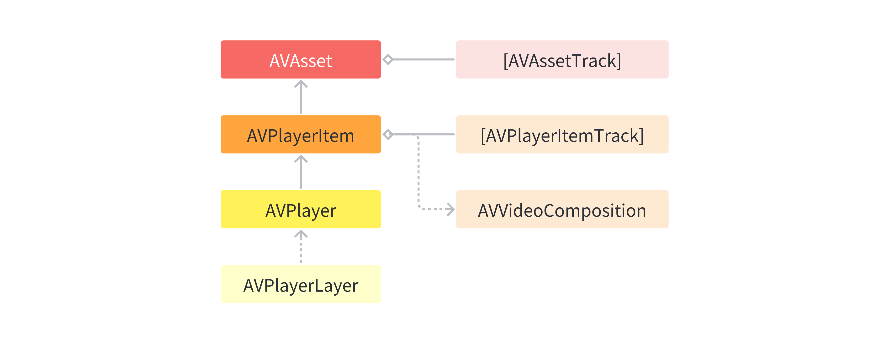

AVPlayerItem 则是音视频播放状态（时间、加载等）的数据源，管理着播放相关的动态信息。使用 AVAsset 创建，支持配置 `videoComposition: AVVideoComposition`，即可以播放编辑后的效果。AVPlayerItem 是播放数据源，意味着要修改播放状态，直接修改该对象即可。当然它只是数据源，完整的播放流程还需要 AVPlayer 和 AVPlayerLayer。AVPlayer 是控制器类，使用 AVPlayerItem 创建，可以简单理解为 AVPlayerItem 的包装和管理，可实现更便捷的播控和时间监听。AVPlayerLayer 视频渲染对象，呈现 `player: AVPlayer` 的视频内容，当然也完全受 AVPlayer 的控制。

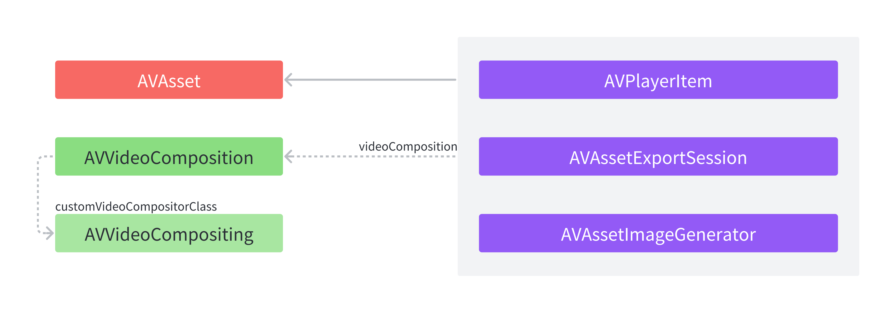

AVAssetExportSession 用于导出。AVAssetImageGenerator 用于视频抽帧。它们都是使用 AVAsset 创建，也支持配置 `videoComposition: AVVideoComposition`。这样编辑配置的合成信息也能用于导出。

接下来介绍如何使用 Cinematic API 渲染和编辑电影效果模式数据。

## 播放

对电影效果模式和 AVFoundation 有深入的理解后，现在可以集成电影效果模式的播放能力了。

### 获取 asset


首先，我们需要获取一个 Cinematic asset。从照片库选择 Cinematic asset 非常简单，只需要使用照片选择器并设置过滤出电影效果模式的视频。选择器将获取所选文件的本地标识符。

```swift
// Use PhotosPicker to select cinematic video
PhotosPicker(
    selection: $selectedPickerItem,
    matching: .cinematicVideos,
    photoLibrary: .shared()
)

// After getting asset localIdentifier, fetch the underlying `PHAsset`.
let result = PHAsset.fetchAssets(withLocalIdentifiers: [localIdentifier], options: nil)
```

Demo 中直接使用了 PhotosPicker，若使用 PhotoKit 实现自己的相册 UI，使用 `PHAssetMediaSubtype.videoCinematic` 类型也能直接获取 Cinematic asset，如：

```swift
let fetchOptions = PHFetchOptions()
fetchOptions.predicate = NSPredicate(format: "(mediaSubtypes & %d) != 0", PHAssetMediaSubtype.videoCinematic.rawValue)
let result = PHAsset.fetchAssets(with: fetchOptions)
```

获取 PHAsset 后，异步请求获得对应的 AVAsset：

```swift
// Create options to request the `AVAsset`.
let videoRequestOptions = PHVideoRequestOptions()
videoRequestOptions.version = .original
videoRequestOptions.deliveryMode = .highQualityFormat
videoRequestOptions.isNetworkAccessAllowed = true

// Request the `AVAsset` asynchronously.
let asset = await withCheckedContinuation { continuation in
    PHImageManager.default().requestAVAsset(forVideo: phAsset, options: videoRequestOptions) { avAsset, _, _ in
        continuation.resume(returning: avAsset)
    }
}
```

使用从选择器获取的 asset id，现在可以在请求它之前获取带有关于 Cinematic asset 信息的照片 asset。需要确保设置请求选项以获取原始版本，并允许网络访问，以防 asset 在 iCloud 上，最后请求电影效果模式 asset 为 AVAsset，后续的操作都是基于这个 AVAsset。从上面的 `IMG_1960.MOV` 数据分析，我们也得知该视频文件就包含了电影效果模式所需的所有轨道数据。

### 播放 asset

我们已经获得了 Cinematic asset。接下来整合播放功能。

- 播放 Rendered asset（常规影片）：AVPlayer & AVPlayerItem
- 播放/编辑 Cinematic asset：需要添加自定义视频合成器（video compositor）

渲染过的 asset 可以使用 AVPlayer 和 AVPlayerItem 作为常规影片进行播放，电影效果模式内的视频轨道也同样适用。

但要发挥电影效果模式的威力，我们还需要添加一个自定义视频合成器（video compositor），它可以处理多个轨道、用户修改，并最终调用 Cinematic 渲染器来合成输出。这个自定义合成器也可以用于缩略图生成和导出。

#### 配置渲染会话

Cinematic API 使用 CN 前缀。需要使用 3 个 API 调用来渲染会话，实现浅景深渲染。

1. 从 Cinematic asset 中获取渲染属性。
2. 用这些属性设置渲染会话。渲染会话使用 GPU，所以需要提供一个 Metal 命令队列。
3. 把渲染质量设置为导出。质量可以根据性能和质量限制设置为不同的枚举值，如预览和导出。

```swift
// Load the cinematic rendering session attributes from the asset.
let renderingSessionAttributes = try await CNRenderingSession.Attributes(asset: asset)

// Create a command queue for the rendering session.
guard let renderingCommandQueue = MTLCreateSystemDefaultDevice()?.makeCommandQueue() else {
    fatalError("Couldn't create command queue")
}

// Create a cinematic rendering session using the command queue and session attributes.
// Select an appropriate quality level for your use case.
let renderingSession = CNRenderingSession(
    commandQueue: renderingCommandQueue,
    sessionAttributes: renderingSessionAttributes,
    preferredTransform: .identity,
    quality: CNRenderingQuality.export
)
```

#### 获取轨道

自定义合成器需要一个 composition，其中包含渲染输出所需要的 Cinematic asset 信息。在典型情况下，需要多个步骤来添加多个轨道，现在有更简便的方式，通过 AVMutableComposition 的 `addTracks(for:preferredStartingTrackID:)` 方法，一步到位直接把所有轨道从 CNAssetInfo 添加到组合中。

```swift
let avComposition = AVMutableComposition()

// Load cinematic asset info from the `AVAsset`.
let cinematicAssetInfo = try await CNAssetInfo(asset: asset)

// Use `CNCompositionInfo` for setting up the track information.
let compositionInfo: CNCompositionInfo = avComposition.addTracks(
    for: assetInfo,
    preferredStartingTrackID: kCMPersistentTrackID_Invalid
)
```

#### Composition instruction

首先从 Cinematic asset 中获取 Cinematic script。其中包含所有检测识别结果和焦点决策。

对于自定义合成器，需要使用渲染会话、带 asset 轨道的 composition、Cinematic script 和光圈 f 值设置指令（instruction）。

```swift
// Load the cinematic script from the asset.
let cinematicScript = try await CNScript(asset: asset)

let instruction = SampleCompositionInstruction(
    renderingSession: renderingSession,
    compositionInfo: compositionInfo,
    script: cinematicScript,
    fNumber: script.fNumber, editMode: false
)
```

#### 视频合成器

自定义指令描述了如何组合渲染电影效果。要播放视频，需要一个 video composition（注意不要与上面的 AVMutableComposition 混淆），向其中添加来自 Cinematic composition 的轨道 ID，添加一个自定义合成器，这是渲染器被调用以合成效果的地方，并添加指令。

```swift
let mutableVideoComposition = AVMutableVideoComposition()
mutableVideoComposition.sourceTrackIDForFrameTiming = compositionInfo.frameTimingTrack.trackID
mutableVideoComposition.sourceSampleDataTrackIDs = compositionInfo.sampleDataTrackIDs
mutableVideoComposition.customVideoCompositorClass = SampleCustomCompositor.self
mutableVideoComposition.instructions = [instruction]
```

#### 自定义合成器

在自定义合成器中的 `startRequest` 函数中，有一些与 Cinematic API 相关的重要配置。使用来自 Cinematic composition 的轨道 ID，可以从原始视频轨道、视差轨道、元数据轨道获取当前帧的源缓冲区，并为渲染输出创建一个缓冲区。这些缓冲区允许我们进行编辑和重新渲染。

```swift
// Get video, disparity, and metadata buffers.
guard let imageBuffer = request.sourceFrame(byTrackID: cinematicCompositionInfo.cinematicVideoTrack.trackID) else {
    print("No video pixel buffer")
    request.finishCancelledRequest()
    return nil
}
guard let disparityBuffer = request.sourceFrame(byTrackID: cinematicCompositionInfo.cinematicDisparityTrack.trackID) else {
    print("No disparity buffer")
    request.finish(withComposedVideoFrame: imageBuffer)
    return nil
}
guard let metadataBuffer = request.sourceSampleBuffer(byTrackID: cinematicCompositionInfo.cinematicMetadataTrack.trackID) else {
    print("No metabuffer")
    request.finish(withComposedVideoFrame: imageBuffer)
    return nil
}

// Request the output buffer.
guard let outputBuffer = request.renderContext.newPixelBuffer() else {
    fatalError("No output buffer")
}
```

从元数据缓冲区中，可以获取驱动渲染的渲染帧属性。元数据是一个不透明的数据，所以使用 CNRenderingSession.FrameAttributes 直接获取帧属性。有了帧属性，就可以进行可选的播放修改了。通过指令修改光圈 f 值，该指令保存来自 UI 控件的光圈修改。

```swift
let sessionAttributes = renderingSession.sessionAttributes
// Get the frame attributes associated with the metadata buffer.
guard var frameAttributes = CNRenderingSession.FrameAttributes(
    sampleBuffer: metadataBuffer,
    sessionAttributes: sessionAttributes
) else {
    fatalError("Failed to get frame attributes")
}

// Use `fNumber` from `instruction` (optional).
frameAttributes.fNumber = instruction.fNumber
```

焦点视差可以以类似的方式修改，后续将使用使用检测进行场景驱动修改。现在需要渲染的参数都配置上了。最后只需要在渲染命令队列中获取一个命令缓冲区，这样组合的输出就可以在 GPU 上渲染了。使用修改的帧属性以及图像和视差缓冲区对渲染进行编码。为输出缓冲区添加一个 handler，来传递给 video composition。最后提交命令缓冲区。

```swift
// Get the command buffer for the encoder and rectangle drawing.
guard let commandBuffer = renderingSession.commandQueue.makeCommandBuffer() else {
    fatalError("No command buffer")
}

// Request rendering with changed frame attributes.
renderingSession.encodeRender(
    to: commandBuffer, frameAttributes: frameAttributes,
    sourceImage: sourceFrame.imageBuffer, sourceDisparity: sourceFrame.disparityBuffer,
    destinationImage: outputBuffer
)

// Set up the command buffer completion handler.
commandBuffer.addCompletedHandler { commandBuffer in
    guard commandBuffer.status == .completed else {
        fatalError("Command buffer failed to complete")
    }
    request.finish(withComposedVideoFrame: outputBuffer)
}
// Commit the command buffer.
commandBuffer.commit()
```

可以看到，这里直接使用 CNRenderingSession 编码渲染命令到命令缓冲区，这里渲染的就是浅景深效果，也意味着我们不能自定义景深的渲染方式。

整个播放流程如下：

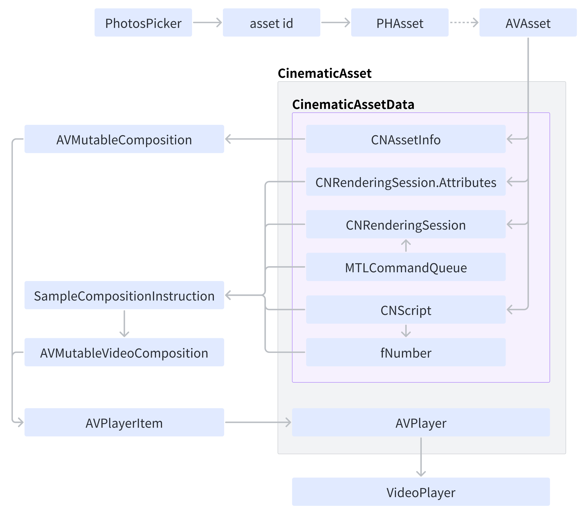

1. PhotosPicker 选取图片，获得 Cinematic asset id。
2. 构造 CinematicAsset，存储用户数据状态：
   1. 使用 asset id 获取 PHAsset，请求 PHImageManager 获得 AVAsset。
   2. 构建 CinematicAssetData，存储 Cinematic asset 提取的相关信息：
      1. 使用 AVAsset 构建 CNAssetInfo，包含 Cinematic asset 轨道信息。
      2. 使用 AVAsset 构建 CNRenderingSession.Attributes，包含 Cinematic asset 的渲染属性。
      3. 使用 MTLCommandQueue、渲染属性、轨道信息创建 CNRenderingSession。
      4. 使用 AVAsset 构建 CNScript，包含 Cinematic script。
      5. 读取本地 Cinematic script 修改的持久化文件，一并加载到 CNScript 对象。
      6. 使用上述构造的结果构造 CinematicAssetData。
   3. 创建 AVMutableComposition，并使用 CNAssetInfo 添加轨道。
   4. 创建 SampleCompositionInstruction，创建 AVMutableVideoComposition，并配置指令。
   5. 使用 AVMutableComposition 对象构建 AVPlayerItem，并配置 AVMutableVideoComposition 对象。
   6. 使用 AVPlayerItem 构造 AVPlayer。
3. 使用 CinematicAsset 的 AVPlayer 构造 VideoPlayer。
4. `showDetections` 展示/隐藏检测框：更新当前帧。
5. `fNumber` 修改光圈值：更新当前帧。

更新当前帧：

1. 使用用户的修改 `showDetections`、`fNumber` 创建 SampleCompositionInstruction、AVMutableVideoComposition，重新配置到 AVPlayerItem。
2. AVPlayer seek 到当前帧，以重新渲染。

播放效果如下：

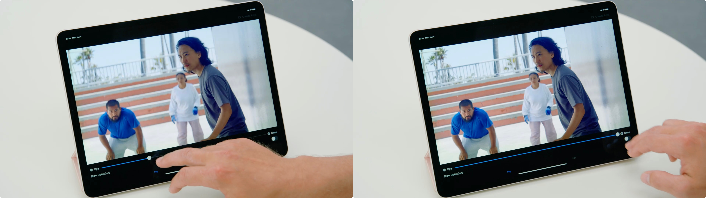

从照片库中选择一个 Cinematic asset 进行播放，当播放时，效果会实时预览。来回拖动改变光圈，这会改变景深虚化效果。往左滑动（Open）增强虚化效果，否则往右滑动（Close）减弱虚化效果。

## 编辑

继续扩展播放 App 和自定义视频合成器，通过修改 Cinematic script 改变焦点，可以进行更高级的无损编辑。

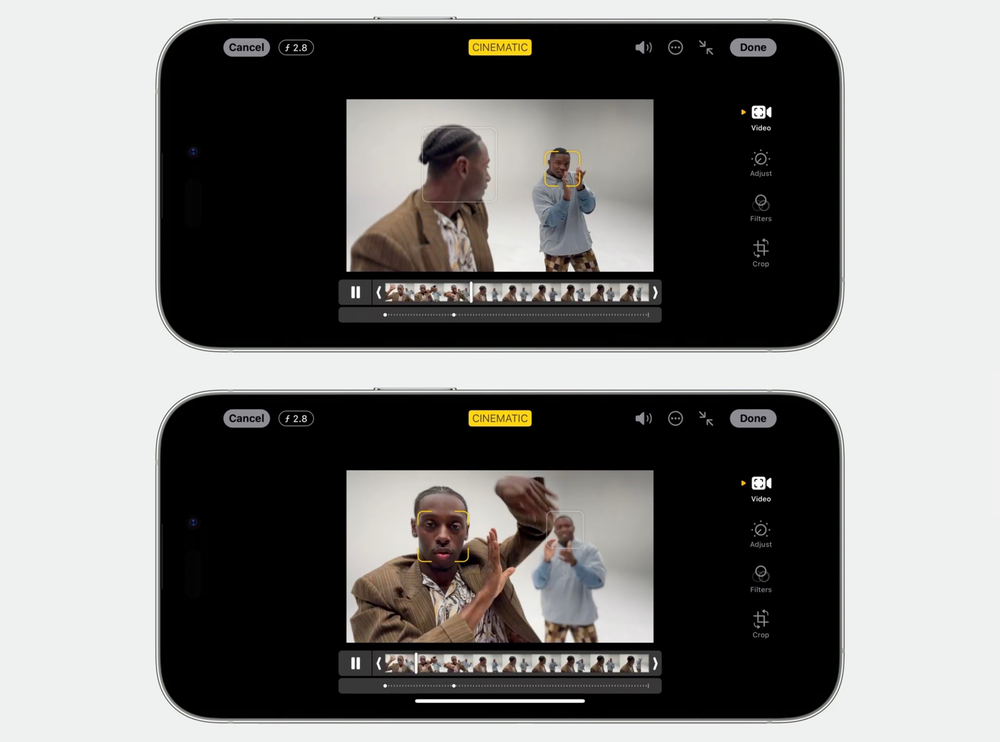

回顾下电影效果模式的照片 App 编辑环境，特别关注焦点在拍摄录制过程中，通过检测对象并决策在哪个位置上对焦，并自动驱动跟焦。这些检测和决策都保存在 Cinematic script 中，我们可以根据叙事直接修改该数据。

### Cinematic script

为了更好地理解这是焦点驱动的原理与过程，下面使用一个简单的例子进行分析讲解。

#### Base Decision

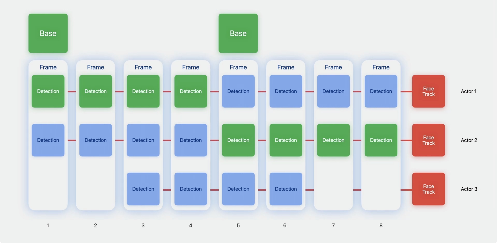

我们从一个帧序列中的两个 Cinematic script 帧开始。每个帧在给定的时间点都保存所有检测，这个例子中只有两个检测点，对应两个 Cinematic script 帧。随着时间的推移，检测会通过组 ID 进行跟踪，将脸、头和躯干组合在一起形成轨道。此外，还可以检测和跟踪猫、狗和球。这里我们只有演员 1 和演员 2 的脸。在第一个帧中，自动基准决策（base decision）将焦点放在演员 1 上，焦点会一直保持在该轨道上，直到出现新的决策。即使在演员 3 进入场景并引入新的脸和检测轨道之后，焦点仍然保持在演员 1 上。在第 5 帧中，一个自动关键帧事件将决策和焦点修改为演员 2。四帧之后，演员 3 在没有得到她应得的关注下失望地离开。在剩下的序列中，焦点一直保持在演员 2 上。

这些自动基准决策是根据一系列参数来决定的，如谁面对摄像机、谁看向别处、谁离得更近以及兴趣点是什么。

虽然系统会自动地尽力创造一个良好叙事，但也可以使用自己的叙事方式。决策是可以修改的，实际上有两种方式。

#### Weak User Decision

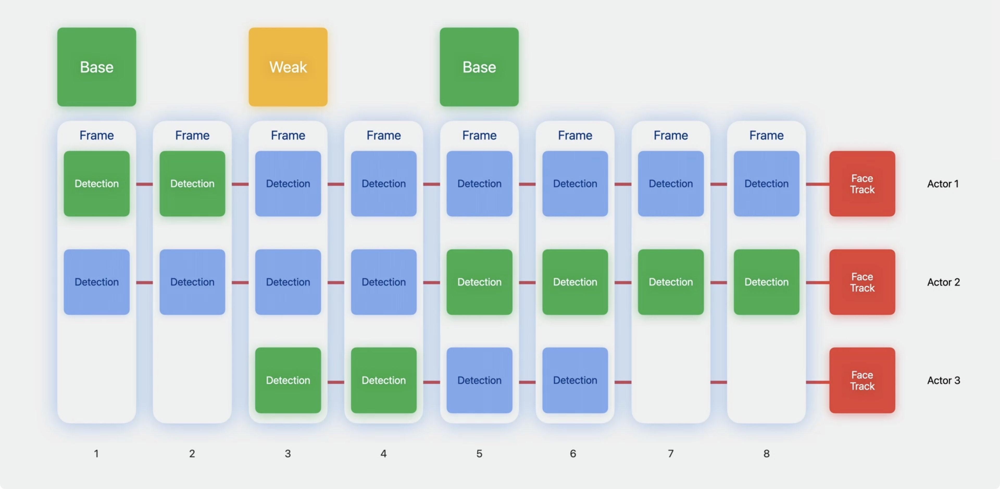

第一种方法是添加一个弱用户决策（weak user decision）。演员 3 进场时，让其成为焦点。然而，弱决策在下一个基准决策或用户决策前只会跟踪一个轨道，下一个决策发生在第 5 帧，此时基准决策将焦点修改为演员 2，这将继续保持到剩余的帧。所以，如果我们想让焦点保持在演员 3 上，我们可以在第 5 帧添加另一个弱决策，或者我们可以使用更强势的方式。

#### Strong User Decision

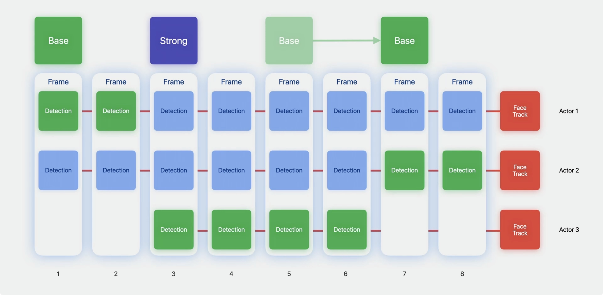

强用户决策（strong user decision），一个强决策可以让焦点始终保持在一个主体上，直到下一个用户决策把焦点转移到其他位置或等到检测轨道结束为止。添加一个强决策让演员 3 成为焦点，并覆盖后续的基准决策。在演员 3 的检测轨道结束后，焦点回到基准决策，即对焦到演员 2 上。

用户决策优先于基准决策，尽可能地先应用用户决策，然后基础决策填补空白。因此，在这个例子中，用户可以仅修改脚本的部分内容。虽然两个决策在检测轨道结束时都会回到基准决策，但强决策会尽可能长时间保持其焦点轨道。

### 绘制检测框

在修改脚本之前，我们先获取一个脚本帧并在屏幕上绘制检测框。首先，需要从 video composition 请求中获取帧时间，然后获取当前时间点的 Cinematic script 帧，该帧包含所有检测，包括焦点检测。

```swift
// Find the nearest frame for focus disparity (optional).
let frameTime: CMTime = request.compositionTime
let tolerance = request.renderContext.videoComposition.frameDuration

let cinematicScriptFrame = cinematicScript.frame(at: frameTime, tolerance: tolerance)
```

现在绘制检测框就很容易了，遍历脚本中的所有检测结果，获取每个检测矩形，使用绘制命令将其绘制到附加在渲染编码器的纹理上。在这个例子中，延续相册 App 的交互习惯，检测框使用白色绘制。

```swift
let allDetections = cinematicScriptFrame.allDetections
for detection in allDetections {
    let rect = detection.normalizedRect
    drawRects(
        renderEncoder: renderEncoder, color: whiteColor,
        rect: rect, strongDecision: false,
        thickness: nonFocusRectThickness
    )
}
```

为了强调当前的焦点检测，我们用另一种颜色绘制它。直接从 Cinematic script 帧中获取焦点检测，获取其相应的矩形，为了让它更醒目，用黄色绘制焦点矩形。

```swift
// Get the focus rectangle.
let focusDetection = cinematicScriptFrame.focusDetection
let focusRect = focusDetection.normalizedRect

// Draw the focus rectangle.
drawRects(
    renderEncoder: renderEncoder, color: yellowColor,
    rect: focusRect, strongDecision: strongDecision,
    thickness: focusRectThickness
)
```

运行添加了检测叠加层的播放 App。现在可以启用新的检测叠加来绘制检测。这个场景以白色显示脸、头和躯干，以黄色显示焦点检测。可以根据 App 的需要自定义叠加层，来显示不同的检测结果。

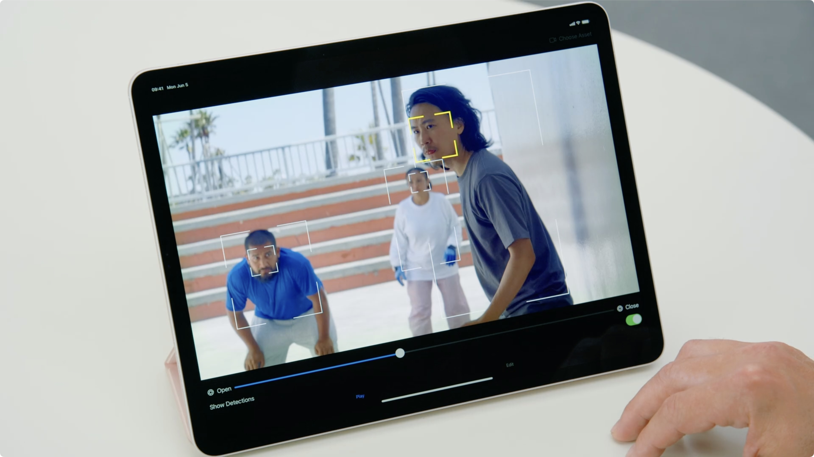

当开始播放时，注意到焦点和渲染是如何在影片中跟随黄色焦点检测的，而候选的检测结果仅以白色显示。

这里的检测框是直接使用 Metal API 画出来的，示例代码有着完整的渲染管线，最终输出到用当前帧 CVPixelBuffer 创建的纹理中。对 Metal 有兴趣的同学可阅读 CinematicEditHelper 的实现，里面的代码简练清晰，非常值得阅读和学习。

### 手势更新 Cinematic script

一旦知道如何绘制检测框，实际上使用 UI 点击点修改脚本非常类似。同样，遍历所有检测，如果点击点在检测矩形内，则获取其相应的检测 ID 并创建一个新的决策。决策强度可以在 UI 中设置。

在 Demo 中，单击设置弱决策，双击设置强决策，最后把这个新的用户决策添加到 Cinematic script 中。

```swift
let allDetections = cinematicScriptFrame.allDetections
var detections: [CNDetection] = []
// Go over all the detections to find the detection that contains the point of interest.
for detection in allDetections {
    let rect = detection.normalizedRect
    if rect.contains(finalPoint) {
        // Human face is the preference for this sample app.
        if detection.detectionType == .humanFace {
            detections.insert(detection, at: 0)
            break
        } else {
            detections.append(detection)
        }
    }
}
// Add a user decision if there is already existing detection.
if !detections.isEmpty {
    if let detectionID = detections[0].detectionID {
        let decision = CNDecision(
            time: cinematicScriptFrame.time,
            detectionID: detectionID,
            strong: strongDecision
        )
        _ = cinematicScript.addUserDecision(decision)
        return
    }
}
```

### 提前跟焦

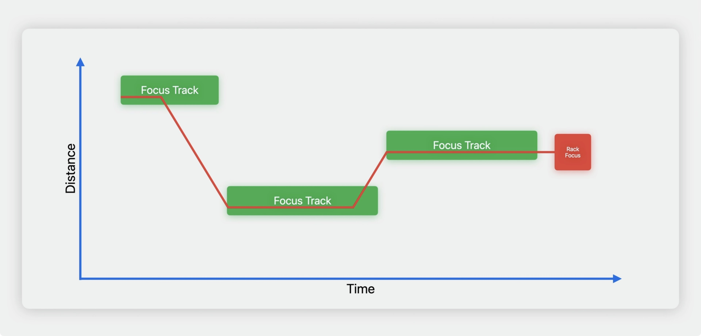

那么更新后的 Cinematic script 又是如何驱动焦点的呢？图中每个方块是对应三个用户决策机器对应的焦点检测轨道，根据时间和距离在二维图中排列焦点轨道。

因为 Cinematic 引擎知道整个更新后的脚本，所以它可以提前进行平滑的跟焦。它看起来像这样，跟焦提前开始，在每个关键帧的开头达到焦点。这非常神奇，它就像一个跟焦员，通过了解设置的标记，可以提前引导注意力并提前变焦。更新后的 Cinematic script 中的帧可以直接读取转移的焦点视差数据。

### 使用焦点视差

修改焦点的帧属性与修改光圈类似，一旦从更新后的脚本中获得了一个脚本帧，就可以直接更新焦点视差的帧属性。这将根据更新后的脚本将焦点以平滑过渡的方式传递给渲染器。

```swift
if let frame = cinematicScript.frame(at: frameTime, tolerance: tolerance) {
    frameAttributes.focusDisparity = frame.focusDisparity
}
```

完成了用户配置后，就可以更新当前帧了，与播放中的逻辑一致：

1. 创建 SampleCompositionInstruction、AVMutableVideoComposition，重新配置到 AVPlayerItem。
2. AVPlayer seek 到当前帧，以重新渲染。

执行 Demo，并通过点击来修改脚本和焦点。从播放模式切换到编辑模式，现在可以更新 Cinematic script。可以通过单击以获得弱决策（显示为黄色虚线框），或者双击以获得强决策（显示为黄色实心框）来修改焦点决策。当点击不同的角色时，可以看到焦点和渲染会根据用户输入进行修改。

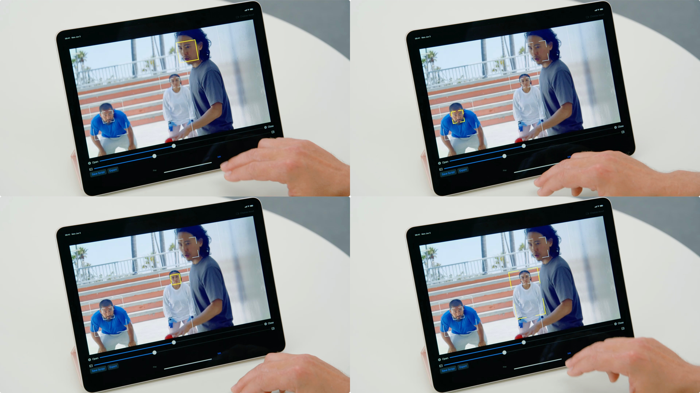

### 存取修改

现在完成了编辑，如何保存这些编辑修改呢？Cinematic script 修改可以保存在独立的数据文件中，意味着可以完全不修改源文件，始终可以恢复为原始状态。因此，获取脚本修改，修改信息支持使用紧凑二进制表达，可以把修改写入数据文件中了。

```swift
// Get and write script changes to the application support directory.
let changes = script.changes()
try changes.dataRepresentation.write(to: url)
```

从文件加载 Cinematic script 也很简单，从文件读取二进制数据，使用 CNScript.Changes 构造方法创建修改信息，最后加载到 Cinematic script 中。修改可以与原始 Cinematic script 同时加载。

```swift
// Read and load the changes.
let scriptFileData = try Data(contentsOf: fileURL)
let cinematicScriptChanges = CNScript.Changes(dataRepresentation: scriptFileData)
cinematicScript.reload(changes: cinematicScriptChanges)
```

## 其他特性

除了上述播放和编辑能力，Cinematic API 还有这些特性：

- 导出
- 对象跟踪器
- 自定义跟踪
- 自定义渲染修改

如前所述，自定义视频合成器可以用于导出渲染的视频。这些视频可以直接渲染保存回照片库。这在 Demo 代码中有详细介绍。

API 还包括一个跟踪器，CNObjectTracker，可用于自定义的主体检测，手动补充 Cinematic 没有自动检测到的主体。示例代码介绍了如何通过点击没有检测的对象来启用跟踪器。跟踪器最终会提供一个检测轨道，可以添加到脚本中。

另外还可以通过提供自己的跟踪器并将自己的自定义检测轨道添加到脚本中来添加自定义跟踪。可以为每个帧自定义渲染属性，允许自定义过渡和光圈修改。

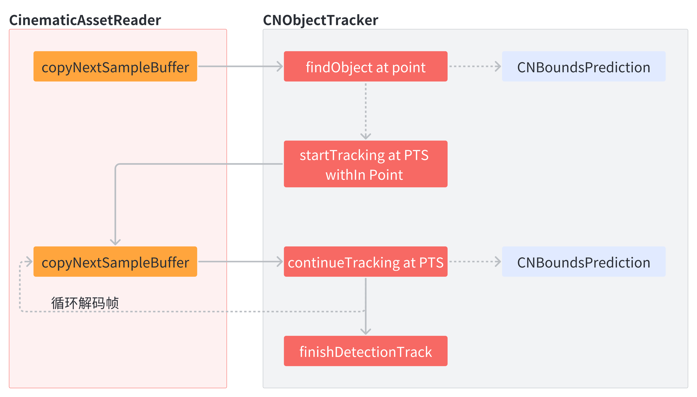

CNObjectTracker 的使用封装在 SampleObjectTracking 中，跟踪是针对一个时间区间的，同步遍历每一帧完成。

1. 通过命令队列构建 CNObjectTracker。说明 CNObjectTracker 需要使用 Metal 做 GPU 计算。
2. 在当前帧的给定区域寻找主体（`findObject`），找到的话会返回 CNBoundsPrediction（包含置信度和主体区域）。
3. 基于找到的主体区域，以当前的 PTS 为起始点，传入当前帧 pixel buffer 和 disparity buffer，开始跟踪（`startTracking`）。
4. 继续下一帧，继续使用新一帧的 PTS、 pixel buffer、disparity buffer 继续跟踪（`continueTracking`），这同样会返回 CNBoundsPrediction 作为跟踪的结果。
5. 循环遍历时间区间的每一帧，直到遍历完成，或跟踪返回的 CNBoundsPrediction 中的主体区域为空，则结束检测跟踪（`finishDetectionTrack`），会返回一个 CNDetectionTrack 检测轨道。
6. 把轨道添加到 CNScript 中，并添加一个 CNDecision 用户决策即可完成自定义的跟踪轨道。

而这里的帧获取，示例代码中通过封装了一个 CinematicAssetReader 来完成，这其中使用 AVAssetReader + AVAssetReaderTrackOutput 模式，对时间区间内帧进行逐个解复用和解码，读取上面 Cinematic asset 的每一个轨道（从 CNAssetInfo 中获取轨道）的每一帧，最终得到：

- video track: CVPixelBuffer
- disparity track: CVPixelBuffer
- metadata track: CMSampleBuffer

注意这里读取 disparity track 固定使用 `kCVPixelFormatType_DisparityFloat16` 像素格式。

## 结语

纵观 Cinematic API，主要是提供了电影效果模式视频的播放和编辑能力。但没有像支持 HDR 视频那么轻松，直接把 AVAsset 丢给 AVPlayer，但好处是提供了更大的自由度。甚至我们可以不使用 AVFoundation 的 composition 一套的编辑框架，自行通过 CNAssetInfo、CNScript 读取轨道信息和 Cinematic asset，在自己的编辑框架中自行使用、渲染和编辑。也可以使用 CNObjectTracker 直接在自己的拍摄页实时地检测和跟踪画面主体，简单实现一些挂件或记录追踪信息。

我们格局大一点，上面的电影效果模式的视频编辑可以使用 Cinematic API 完成了，那电影效果模式的视频能否可以脱离相机 App，使用 AVCapture API 在自己的 App 内独立完成呢？ 我们换个思路，要“拍出”电影效果模式的视频的视频，就是合成 Cinematic asset，导出到文件的过程。回顾下 Cinematic asset 的组成：

- video track: CVPixelBuffer
- disparity track: CVPixelBuffer
- metadata track: CMSampleBuffer
  - 渲染属性：CNRenderingSession.Attributes
  - Cinematic script：CNScript

我们可以使用 AVCaptureVideoDataOutput 获取画面；使用 AVCaptureDepthDataOutput 获取包含视差图的 AVDepthData；但我们却无法获取和构建渲染属性和 Cinematic script。上文也说了，Cinematic asset 的元数据不透明，我们也不能直接码子节码进去。所以我们还是无法完整“自己”采集电影效果模式的视频，或许我们可以期待 Cinematic API 或 AVFoundation 的 Capture API 未来哪个个版本支持相关轨道数据的采集，我们拭目以待吧。

期待各大编辑 App 集成 Cinematic API，给压箱底的电影效果模式视频如虎添翼。
