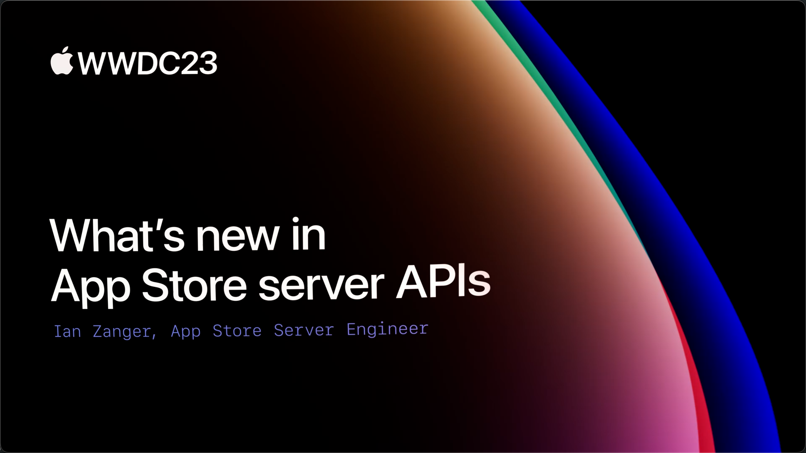

## 个人介绍

yt：就职于荔枝基础研发团队，参与移动端 APM、交易、增长等基础组件，内部基础平台、效能工具建设等工作；

## 审核介绍

SeaHub：目前任职于腾讯 TEG 计费平台部，负责搭建服务于腾讯系业务的支付系统，主导国内 IAP 前后端相关内容，对 IAP 整体设计有一定的经验；

## 不超过 120 个字的文章简介

本文对 WWDC23 在 App Store Server API 提供的新特性进行梳理总结，并提供迁移到新的 App Store Server API 的升级指引，无论你是目前在使用 App Store Receipts 的 verifyReceipt 还是已经升级到 App Store Server API，相信本文都能给到你一些帮助。

## 公众号/小专栏图文头图

