# WWDC23 10142 - 探索应用内购测试

> 摘要：主要简要介绍内购测试的三种方式，帮助你了解每种方式的适用场景和今年引入的新功能。

本文基于 [Session 10142](https://developer.apple.com/videos/play/wwdc2023/10142) 梳理，主要简要介绍内购测试的三种方式，帮助你了解每种方式的适用场景和今年引入的新功能。

> 作者：
>
> Lin，就职于酷狗音乐，目前负责支付相关工作。
>
> 审核：
>
> SeaHub，目前任职于腾讯 TEG 计费平台部，负责搭建服务于腾讯系业务的支付系统，主导国内 IAP 前后端相关内容，对 IAP 整体设计有一定的经验。

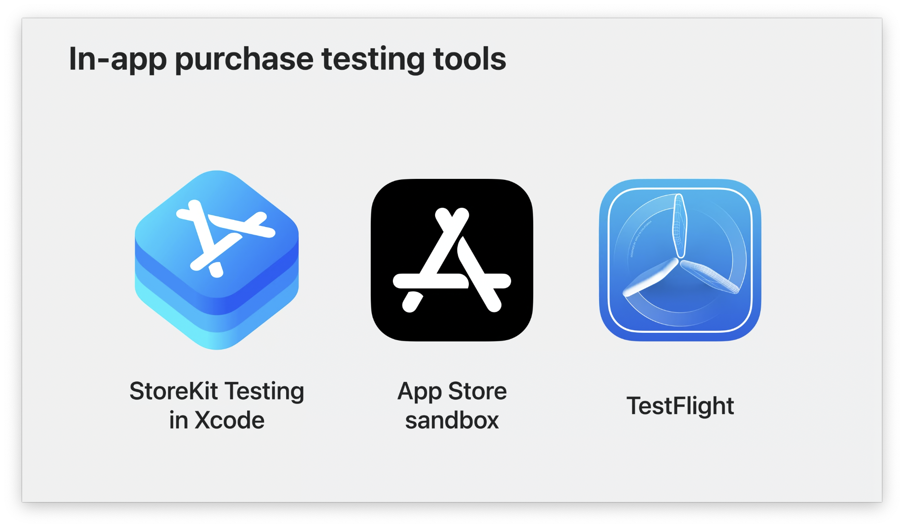

在我们应用接入 `In-App Purchase`  难免要遇到测试的问题，最初我们只能使用 App Store 沙盒进行测试，从 Xcode 12 开始，苹果提供了一种在 Xcode 中创建 Storekit 配置文件本地测试的方式。现在我们有三种测试环境：

- Xcode 中的 StoreKit 测试（本地 StoreKit Configuration file）

- Apple Store 沙盒

- TestFlight（同样为沙盒环境）


在讲解这几种测试环境之前，我们来看看下内购的流程：

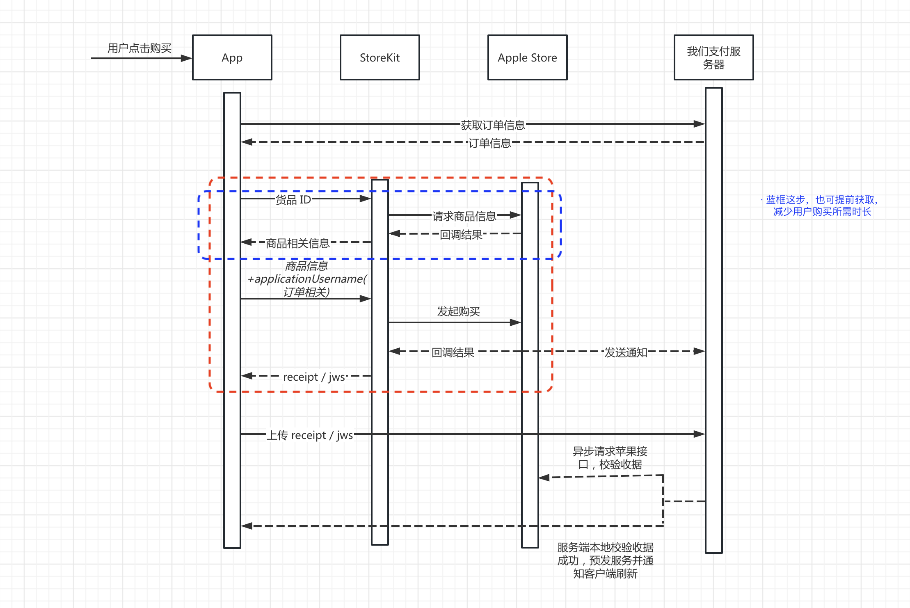

从上图可知完整的内购需要依赖 App、StoreKit、Apple Store 服务器、我们的支付服务器，所以在测试阶段也需依赖四个方面。其中红色虚框的部分需要依 Apple Store 服务器，起初 Apple 提供了 Apple Store 沙盒环境来让我们测试。后面开始引入了新的测试环境，提供类似 Apple Store 的功能，那就是我们下面讲的。


## Xcode 中的 StoreKit 测试 （本地 StoreKit Configuration File）

WWDC 20 苹果引入了  [StoreKit Testing in Xcode](https://developer.apple.com/videos/play/wwdc2020/10659) ，主要为了方便我们无需依赖 App Stroe 服务器，在模拟器和真机上都能够在本地进行 App 内购买的测试。通过 Xcode 中的 StoreKit Configuration File 文件，让我们可以在本地就能模拟商品购买的整套流程，如新增货品码、购买、退订、续订、退款、首月优惠资格、优惠码等等。如需了解具体内容可以参考文章：[WWDC20 10659 - 介绍 Xcode 中的 StoreKit 测试](https://xiaozhuanlan.com/topic/1950472863)。

- 这种方式对于开发的早期阶段还是很方便的，新接入 `In-App Purchase` 的 App，当我们还未在 App Store Connect 配置好商品信息或者无网络情况下，我们将 StoreKit API 购买流程的相关代码码完就可以开始测试了，在模拟器和真机都可以进行测试。这种方式还提供了沙盒测试不能覆盖的功能：
  
  1、模拟 StoreKit Error 返回
  
  2、优惠码兑换

  3、自动续费价格上涨
  
  4、询问是否批准交易的情形（如家庭共享的儿童购买的时候需要通过家长同意这种）
  
- 另外对于已经在 App Store Connect 配置了内购项目的 App，从 Xcode 14 开始，我们可以在创建 `StoreKit Configuration File` 文件的时候勾选同步选项，将配置的项目同步下来。不过这个文件是不能编辑的，需要通过菜单 `Editor` 里面的选项将文件转换成可编辑的本地文件，转换后的文件就不能从 App Store Connect 中同步了。详细的测试功能介绍，可参考往期的文章[【WWDC22 10039】Xcode StoreKit 测试的新功能](https://xiaozhuanlan.com/topic/5842093617)。

我们再来看上面的流程图，这种方式相当于代替了 Apple Store 的功能，但现在我们还只是测试了红色虚框的部分，为了保证交易合法，一般我们会将生成的 `receipt` / `jws` （StoreKit 2 新的收据类型）上传我们的服务器，服务器会在本地校验收据同时会去请求苹果的接口进行二次校验。但这种方式生成的 `receipt` / `jws` 是通过 Xcode 签名生成的，是不能通过 [verifyReceipt](https://developer.apple.com/documentation/appstorereceipts/verifyreceipt) 校验和 [Get Transaction History](https://developer.apple.com/documentation/appstoreserverapi/get_transaction_history) 及 [Get Transaction Info](https://developer.apple.com/documentation/appstoreserverapi/get_transaction_info)（这个接口苹果今年 6.5 新出的，通过 `TransactionId` 可以查询单个收据信息） 查询的。

虽然 `StoreKit 2` 苹果一直在强调 `JWS Receipt` 不需要远程校验，但是我们这边和服务端几次交流之后，他们还是要求我们把收据上传，同时服务端会调用苹果 `Get Transaction Info` 进行二次校验。主要考虑到纯本地校验仍存在风险（比如算法 / 根证书变了，没有及时更新导致验证异常），另外 `JWS Receipt` 不能覆盖 iOS 15 以下的场景，所以走 `TransactionID` + `Get Transaction Info` 的模式。如果要额外针对 iOS 15 `JWS Receipt` 的本地校验逻辑，有额外分支产生（相当于 iOS 15 和 iOS 15 以下是两条路径），这样不方便管控。苹果推出 `Get Transaction Info` 接口大概率有以下原因：

- 对于 iOS 15 以下的设备，由于无法获取 `JWS Receipt`，所以基本都是需要进行远程校验。而 `Get Transaction History` 的多页翻页模式 + 过滤器的时耗仍旧无法满足远程校验的指标要求
- `verifyReceipt` 本年度被标记为废弃，该方式是苹果给开发者的一种迁移替代的方式

如果要处理 Xcode 这种本地的收据，需要从 Xcode 的 `Editor` 菜单导出公钥，校验收据的方法需要使用 `KCS7_NOCHAIN` 这个参数去标明，才能通过校验。但是一般我们的服务器为了和生产环境保持一致，很少会去这么做，校验收据一般使用沙盒环境进行测试。


为了更好方便我们测试，苹果也在进一步完善功能，让我们来看看本次新的功能：

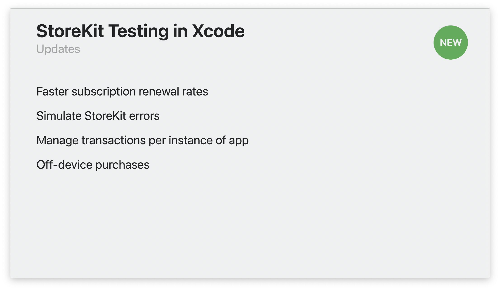

Xcode 15 在 StoreKit Configuration File 文件新增了 App 一栏，将菜单栏 Editor 相关选项移到配置文件进行管理。

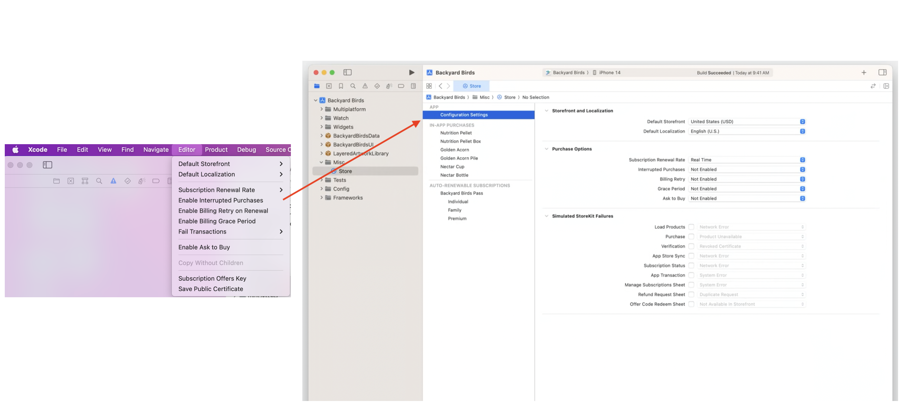

具体更新点：

- 更快的订阅续期速率

  新增一组与订阅时长无关的速率（每 15 分钟、5 分钟、30 s、10s、2s 续订一次）。此前续订速率是以订阅时长 1 个月为单位，假如设置 5 分钟续订一次，那么包年的订阅每 1 小时才能续订一次。现在我们可以选择新的选项，能够使我们更快测试续订，这个不错。

- 模拟 Storekit 返回的错误

  在 StoreKit Configuration File 的 App 中选项中有一栏 Simulate StoreKit errors，我们通过更改选项，能够模拟不同的错误，更改之后无需重新 Build，再次购买就能生效。
  
  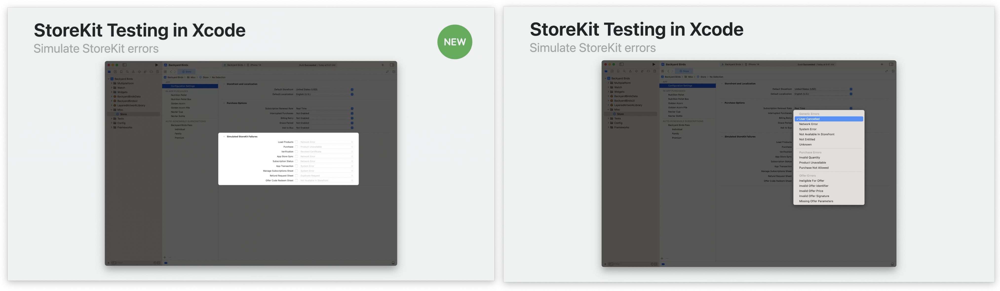

- 本地的订单管理器支持显示多设备及多个 App 的交易

  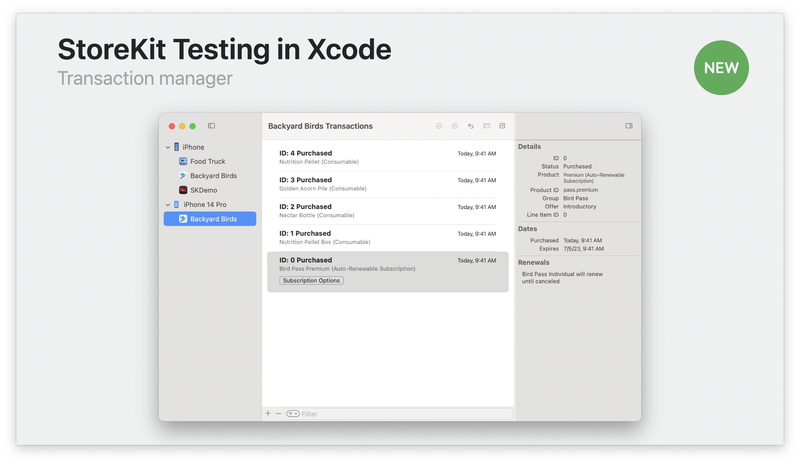

  

- 本地的订单管理器支持直接购买

  这样我们就可以测试外部交易，App 的处理逻辑（类似线上共用 AppleID 的情况，当使用同一 AppleID 在另外一台机器购买的情形）。

  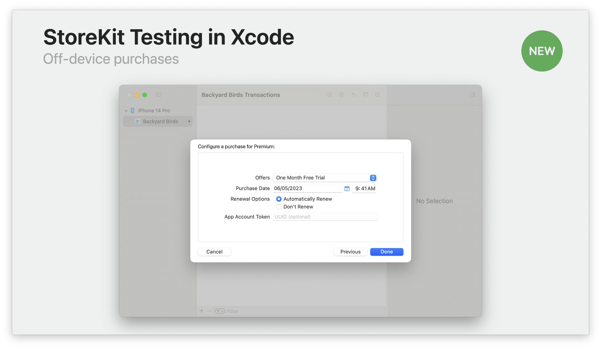

新的功能，能让我们更好的利用 Xcode 测试，从而完善我们购买逻辑，优化用户购买体验。上面我们讲到收据校验，需要使用沙盒环境进行测试，下面我们一起来看看沙盒。

## 沙盒

苹果提供一种名为 "沙盒" 的测试环境，它能模拟 App Store 生产环境 。我们通过沙盒环境，App 购买内购项目无需真实付款，就能完成交易。同时它支持 App Store 服务器通知，我们服务器可以通过沙盒环境可以测试不同通知的逻辑。沙盒环境生成的收据支持 App Store Server API / verifyReceipt 校验，这样我们就可以测试完整的 App 内购买的流程。

- 当我们在 App Store Connect 中配置好商品信息和我们的服务器已经开发完成，我们就可以使用沙盒环境进行完整的测试了。在测试之前，我们需求在 App Store Connect 的 "用户和访问" 创建一个沙盒 Apple ID （无需真实邮箱，为虚拟账号），另外如果需要处理 App Store 服务器通知，需要在 App 信息配置好接收通知的服务器 URL，生产环境与沙盒环境能单独配置，通知有 [V1](https://developer.apple.com/documentation/appstoreservernotifications/app_store_server_notifications_version_1)、[V2](https://developer.apple.com/documentation/appstoreservernotifications/app_store_server_notifications_v2) 版本，具体看我们服务器所支持的版本，V1 已经被苹果废弃，建议是使用 V2 版本，V2 版本支持更多的通知类型。

- 在 App Store Connect 配置好之后，我们需要一台真机，在手机的 “设置  - App Store - 沙盒账号"，登录我们的沙盒账号，这个时候我们就可以测试 App 的购买了。

- 自测过程我们需要关注收据校验、内购恢复、续订订阅同组切换、App Store Server Notifications 的处理（如收到退款通知，服务端是否将服务回收；收到续费通知，是否将服务延长）等。

  收据校验这一步如果没做好，容易被黑产利用，前端时间黑产利用 iOS 7 的 `transactionReceipt` 篡改了 `bid`（Bundle ID），需要通过 App 的 Apple ID 校验才能区分是否为黑产伪造的收据，一部分 App 服务端只对 `bid` 做了校验，导致服务被刷 。另外我们最好不要使用苹果废弃的 API，以苹果历来的操作，一般不会向下兼容。

当我们 App 在沙盒环境测试已经没问题，这个时候我们可以将内购项目提交到 AppStore 进行审核了（希望苹果的审核能一遍过审吧）。


下面来看看沙盒本次的更新内容，

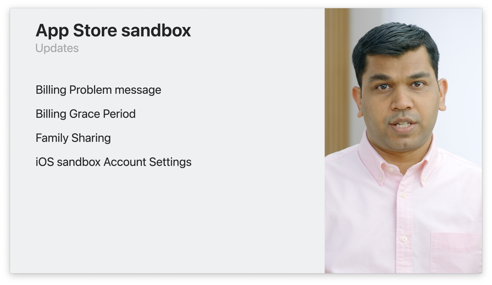

前面两点都是针对自动续费订阅的

- 支持付款问题在 App 的展示

  当 `自动续费的订阅` 因付款问题导致续费失败，订阅将进入计费重试状态（苹果在一段时间会继续尝试扣费，给用户），App Store 会发送消息说明续费失败的原因，并在 App 中向用户展示失败页面，在此页面中可以引导用户编辑相关付款信息。不过现在只有沙盒环境才能测试，生产环境苹果会在今年晚些时候才会向用户展示。

  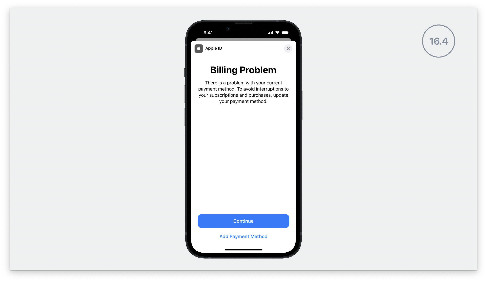

  那什么时候会发送此消息了？在生产环境当 `自动续费的订阅` 续订失败之后， Apple 会在一段时间 （最多 60 天）继续尝试去扣费给用户续订，在此期间会按照以下时间间隔发送消息，iOS 系统需要 >= 16.4 。

  | 计费重试间隔 | 消息频率        |
  | :----------- | :-------------- |
  | 第 1-3 天    | 每 24 小时一次    |
  | 第 4-16 天   | 每 72 小时一次  |
  | 第 17-30 天  | 每 96 小时一次  |
  | 第 31-60 天  | 每 120 小时一次 |

  沙盒如果想模拟此情形，需要手机系统 >= iOS 16.4 ，进入的 "设置  - App Store - 沙盒账号"，在账号管理界面通过开关 "允许购买和续期" 来模拟。另外如果想要自己控制账单问题的展示，需要借助 `StoreKit2 Message API` 进行处理。

  ```swift
  // Listen for App Store messages.
  for await message in StoreKit.Message.messages {
      // Call display on the message when the app is ready.
  }
  
  // Indicate the app is ready to display the message.
  guard let windowScene = self.view.window?.windowScene else {
      fatalError("Could not get window scene.")
  }
  try? message.display(in: windowScene)
  ```


- 支持测试账单宽限期

  首先我们来看看什么是账单宽限期，账单宽限期是指 `自动续费的订阅` 用户因付款问题而无法自动续期，但用户仍可访问 App 中的订阅内容的这段时间。在账单宽限期 Apple 会继续尝试扣费，给用户自动续订。启用账单宽限期的好处是如果用户在帐单宽限期内付款成功，用户订阅累计时长不会中断，对于我们的收益率（不满一年是 70%，满一年是 85%）还是有帮助的，如果 App 开启账单宽限期，我们的服务器需要处理在账单宽限期延长用户的订阅服务，账单宽限期到期的时候关闭服务，我觉得国内大部分公司应该不会开启这个功能。

  

  现在我们如果要开启此功能，可以去 App Store Connect 配置：

  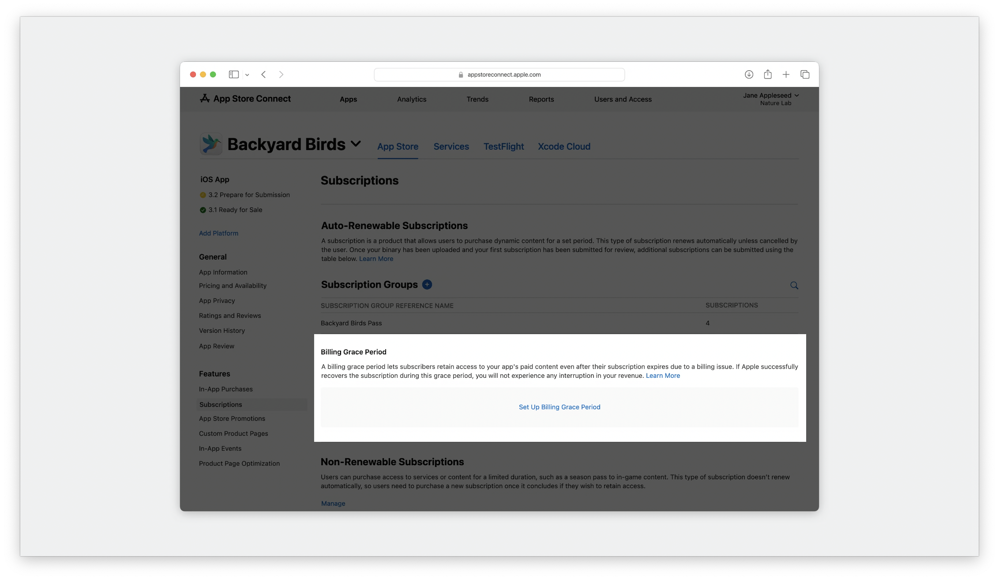

  1、帐单宽限期的时长只对生产环境有效，可选 3 天、16 天、28 天，配置之后会应用到 App 内的所有订阅项目。对于时长为 1 周的订阅，即使可以选择 16 天或 28 天的宽限期，但实际宽限期均为 6 天。

  |                | 3 天帐单宽限期 | 16 天帐单宽限期 | 28 天帐单宽限期 |
  | :------------- | :------------- | :-------------- | :-------------- |
  | 每周订阅       | 3 天           | 6 天            | 6 天            |
  | 月度和年度订阅 | 3 天           | 16 天           | 28 天           |
  
  沙盒环境的账单宽限期跟订阅时长和沙盒配置的订阅续费速率有关，如下表：
  
  | 自动订阅时长/沙盒订阅续费速率 | 每 3 分钟续期一次 | 每 5 分钟续期一次 | 每 15 分钟续期一次 | 每 30 分钟续期一次 | 每 1 小时续期一次 |
  | :---------------------------- | :---------------- | :---------------- | :----------------- | :----------------- | :---------------- |
  | 每周订阅                      | 3 分钟            | 3 分钟            | 5 分钟             | 10 分钟            | 15 分钟           |
  | 月度和年度订阅                | 3 分钟            | 5 分钟            | 15 分钟            | 30 分钟            | 1 小时            |
  
  2、可选为哪种续期类型开启帐单宽限期，一种是所有续期类型，另外一种是仅 "付费 - 付费" 续期（帐单宽限期只会应用到付费订阅的续期。从免费订阅续期为付费订阅时不享受帐单宽限期。）
  
  3、可选开启帐单宽限期的环境，一种是仅沙盒环境，一种是生产环境和沙盒环境。
  
  
  
  沙盒如果要测试此功能，需要手机系统 >= 16.0，进入手机的 "设置  - App Store - 沙盒账号"，在账号管理界面通过关闭 "允许购买和续期" 来模拟续费失败，进入账单宽限期。

- 支持测试家庭共享

  今年晚些时候，Apple 将支持沙盒测试家庭共享相关功能，我们可以在 App Store Connect 添加沙盒的家庭共享的测试账号。

  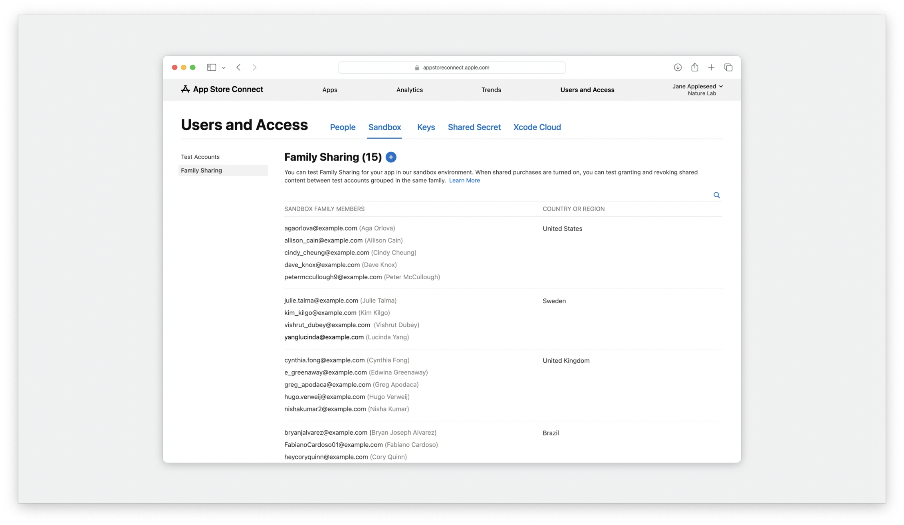

   另外 iOS （预计系统应该需要 >= iOS 17.0）沙盒的帐户设置页面会新增一个 Family Sharing 选项，进入选项能够看到整个家庭共享的测试人员并且可以选择停止家庭共享。

  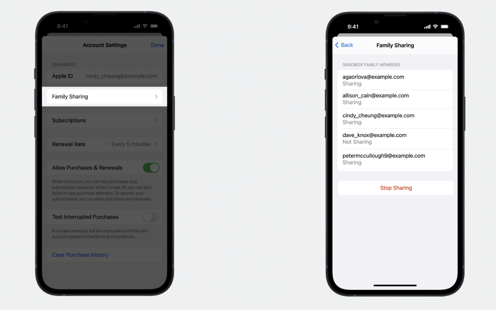

  沙盒测试家庭共享的项目和其他普通的沙盒购买一样，由于启用了家庭共享，购买的时候注意验证是否对所有的家人成员都提供了服务。

  如需了解更多家庭共享内容，请参考 [Explore Family Sharing for in-app purchases](https://developer.apple.com/videos/play/tech-talks/110345)。

- iOS 沙盒账号管理页新增选项

  今年晚些时候（没说具体时间，iOS 17 beta3 暂时没看到），在手机 "设置  - App Store - 沙盒账号"，账号管理界面新增三个选项：

  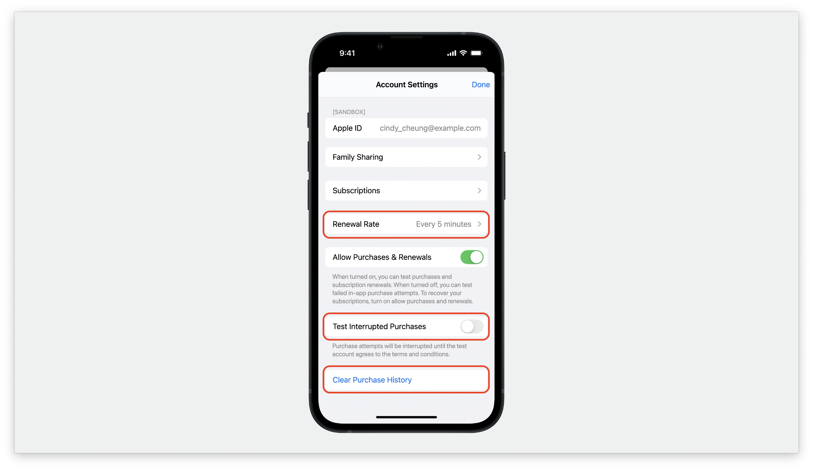

  1、订阅续订的速率

  还是只能按月为单位进行设置，默认为 1 个月 = 5 分钟，没有像这次 StoreKit Testing 更新的跟订阅时长无关的速率设置。

  2、中断购买

  3、清除历史记录
  
  喜大普奔，终于把 App Store Connect 沙盒账号的功能移过来了，但应该需求  >= iOS 17.0 才有这三个选项。另外希望苹果在今后能在沙盒管理界面，加一个退款的选项，有利于我们更好的测试。
  
  

## Testflight

Testflight 内购的购买，使用的同样是沙盒环境，只不过通过 Testflight 链接安装的包，不需要登录沙盒账号。这种方式一般用于上线前的内部内购测试。因为沙盒环境支付无需真正付款，我司使用 Testflight 对外灰度的包，都会将内购功能进行屏蔽，并且会对沙盒购买的项目在服务端进行了校验，防止黑产利用。


## 结语

总的来说，[StoreKit Testing in Xcode](https://developer.apple.com/videos/play/wwdc2020/10659)  无需依赖 App Store 服务器就能本地测试。沙盒环境更接近生产环境能够让我们进行更完整的测试。Testflight 用的同样是沙盒环境，能够更好的用于外部的测试。

以前我们更多的关注于沙盒测试，现在我们可以根据自己当前环境、需要实现的功能选择不同的方式。因为内购关乎于 💰，苹果也在不断完善测试的功能，让我们在测试过程发现问题，从而优化用户线上的购买体验，提升我们 App 的收益。


## 相关阅读

[Testing at all stages of development with Xcode and the sandbox](https://developer.apple.com/documentation/storekit/in-app_purchase/testing_at_all_stages_of_development_with_xcode_and_the_sandbox )

[Testing in-app purchases with sandbox](https://developer.apple.com/documentation/storekit/in-app_purchase/testing_in-app_purchases_with_sandbox)

[StoreKit Test](https://developer.apple.com/documentation/storekittest?language=objc)

[setting-up-storekit-testing-in-xcode](https://developer.apple.com/documentation/Xcode/setting-up-storekit-testing-in-xcode)

[test-in-app-purchases](https://developer.apple.com/cn/help/app-store-connect/test-in-app-purchases-main/test-in-app-purchases)

[App Store Server Notifications](https://developer.apple.com/documentation/appstoreservernotifications)

