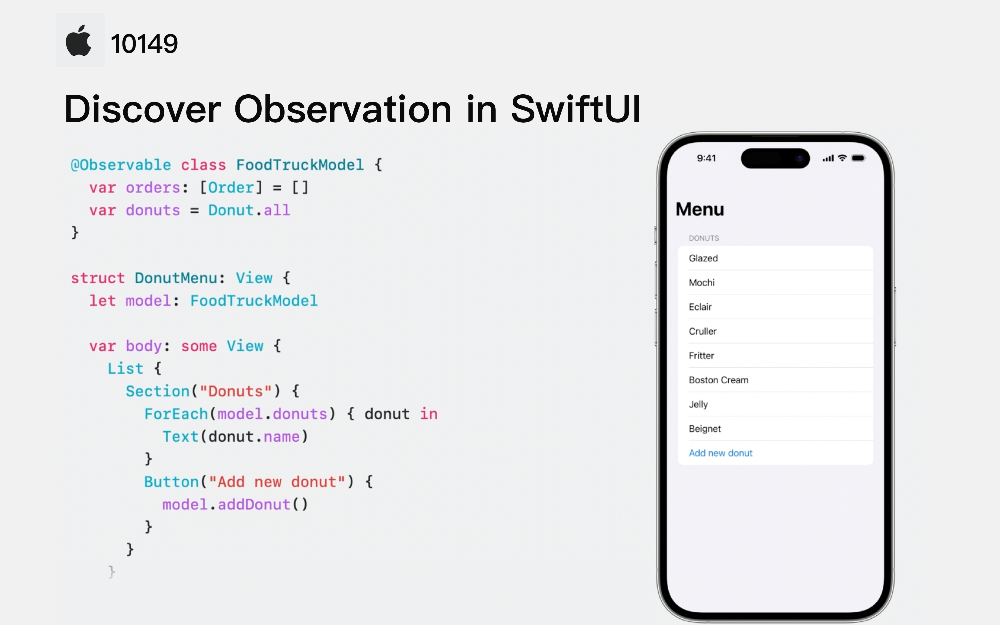

## 个人介绍

万圣(Khala-wan)：字节跳动抖音基础技术 iOS 开发、SwiftGG 翻译组成员

## 审核介绍

戴铭，极客时间《iOS 开发高手课》和纸书《跟戴铭学 iOS 编程》作者

叶絮雷，Swift Documentation Workgroup 成员，目前就职于字节西瓜视频团队

## 不超过 120 个字的文章简介

Observation 是基于 Swift 5.9 宏能力推出的全新功能，它可以帮助开发者简化数据模型并提高应用程序性能，让 SwiftUI 的数据驱动 UI 体验更加出色。本文将介绍 Observation 的基础知识和实现原理，并通过一些案例来了解 Observation 的实际应用体验，以及如何将现有的 ObservableObject 迁移到 @Observable。

## 公众号/小专栏图文头图

