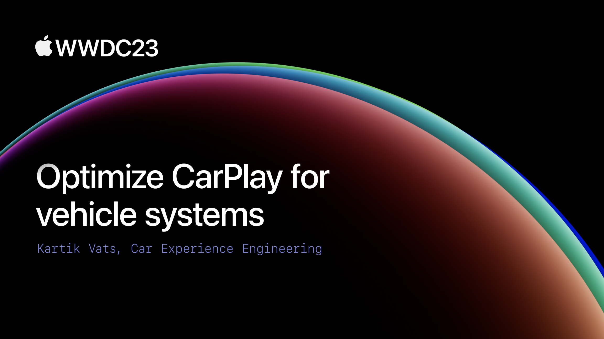

## 个人介绍

师大小海腾，iOS 开发者。

## 审核介绍

## 不超过 120 个字的文章简介

CarPlay 车载是一种更智能、更安全的在车内使用 iPhone 的方式。打造一个出色的 CarPlay 体验的关键在于你如何在你的汽车系统中更好地集成 CarPlay。本文将从视觉整合、连接性、音频、视频编码和电车路径规划 5 个方面来帮助你实现这一目标，同时为迎接新一代 CarPlay 做好准备。

## 公众号/小专栏图文头图

