# WWDC23 10150 - 优化车载系统的 CarPlay

> 摘要：本文基于 [Session 10150](https://developer.apple.com/videos/play/wwdc2023/10150/) 梳理，受众为汽车厂商和车载系统开发者。新一代 CarPlay 即将到来，本文将从视觉整合、连接性、音频、视频编码和电车路径规划 5 个方面来帮助你打造更出色的 CarPlay 体验，同时为迎接新一代 CarPlay 做好准备。

> 作者：师大小海腾，iOS 开发者。
>
> 审核：苍耳，iOS 开发者，[GitHub](https://github.com/djs66256) ，[博客](https://djs66256.github.io/)

## 新一代 CarPlay

在 [WWDC22 Keynote 37:50](https://developer.apple.com/videos/play/wwdc2022/101/) 中，Apple 宣布了它所谓的“新一代 CarPlay”，适用车型将于今年年末公布。新一代 CarPlay 将对 UI 进行彻底的改造，与汽车硬件系统深度融合，接管整个车内功能，而不再是只能控制你 iPhone 的 app，完美的弥补了 CarPlay 在汽车中的表现的不足。

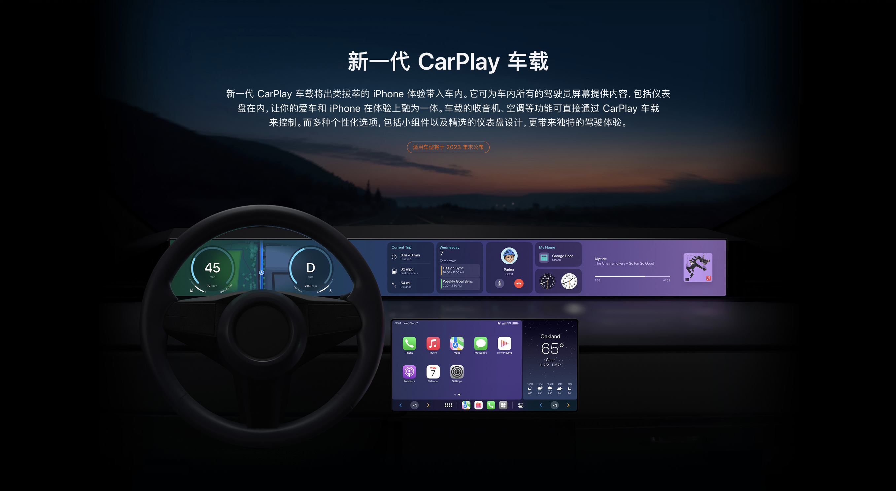

## 概览

CarPlay 车载是一种更智能、更安全的在车内使用 iPhone 的方式。打造一个出色的 CarPlay 体验的关键在于你如何在你的汽车系统中更好地集成 CarPlay。本文将从以下 5 个方面来帮助你实现这一目标，同时为迎接新一代 CarPlay 做好准备。

* 视觉整合
* 连接性
* 音频
* 视频编码
* 电车路径规划

其中，视觉整合主要关注于使 CarPlay 在你的汽车系统中看起来更自然。连接性、音频和视频编码这些基础设施功能都是打造出色 CarPlay 体验的基础。最后，本文将讨论 CarPlay 中的电车路径规划功能。

## 视觉整合

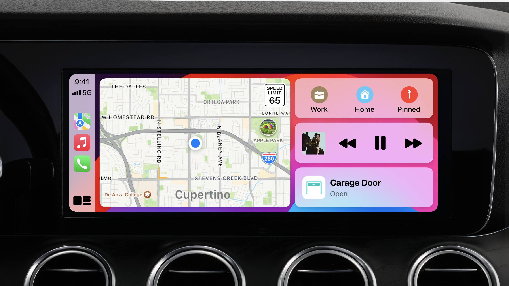

现代汽车配备了越来越多种类和布局的大型主显示屏。有较宽的（图 ①），有较高的（图 ②），有非矩形的（图 ③），而有些则是将 CarPlay UI 内嵌在原生 UI 中的（图 ④）。

CarPlay 经过设计，可以很好地整合到所有这些不同类型的主显示屏中。

本章将从以下几个方面来帮助你在 CarPlay 视觉整合上进行优化，让 CarPlay 在你的汽车中感觉自然而舒适。

* 视图区域
* 状态栏
* 圆角
* UI 焦点转移
* 外观模式
* 多显示器

### 1. 视图区域

Apple 在[【WWDC19 252】Advances in CarPlay Systems](https://developer.apple.com/videos/play/wwdc2019/252) 中介绍了视图区域，现在我们来做个简单的回顾，并看看它有哪些新功能。

视图区域定义了 CarPlay 绘制用户界面的边界。

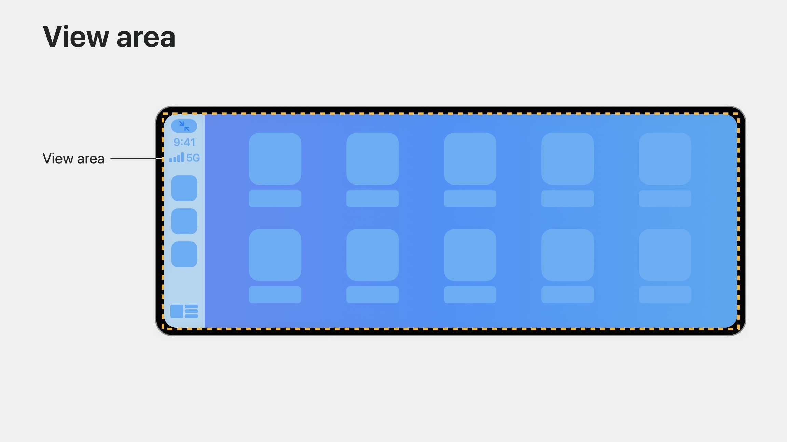

如果你的汽车需要将 CarPlay UI 内嵌在原生 UI 中，只需为其提供尽可能多的空间，CarPlay 会自动创建正确的填充量进行内嵌。

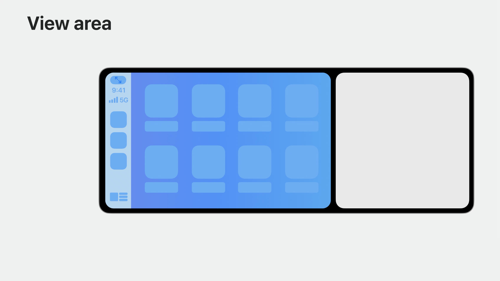

如果你的显示屏不是矩形的，就将视图区域定义为包围显示屏的最小矩形，并将安全区域定义为显示屏内的最大矩形。

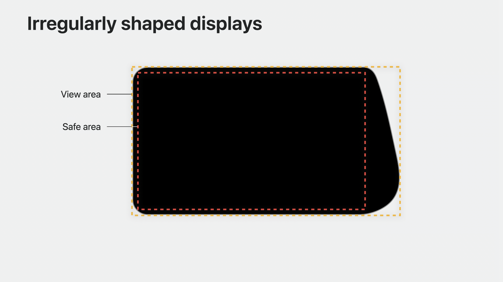

CarPlay 会在安全区域内绘制交互式内容，以确保所有重要的 UI 都可见。在安全区域之外的区域将呈现为黑色。

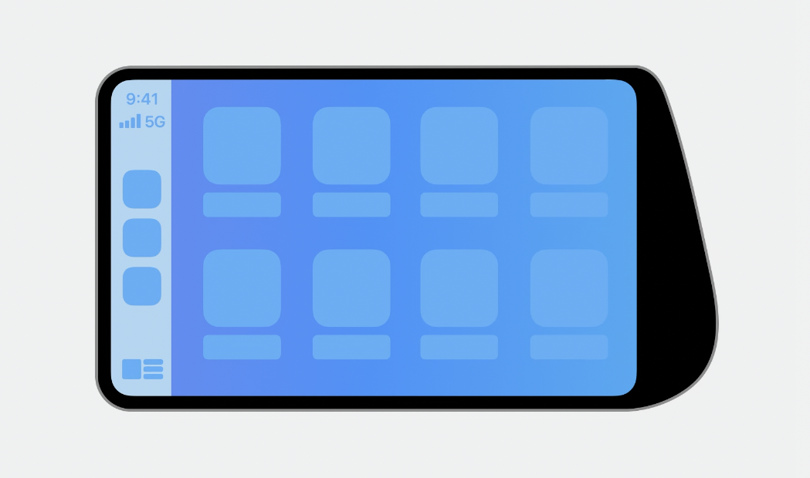

**现在，你可以通过启用 `drawUIOutsideSafeArea` 让 CarPlay 在安全区域之外绘制 UI。** CarPlay 会将其背景绘制到显示屏的边缘，填充满它的视图区域，为驾驶员提供视觉上沉浸式的体验。请注意，**该配置仅适用于主显示屏**。

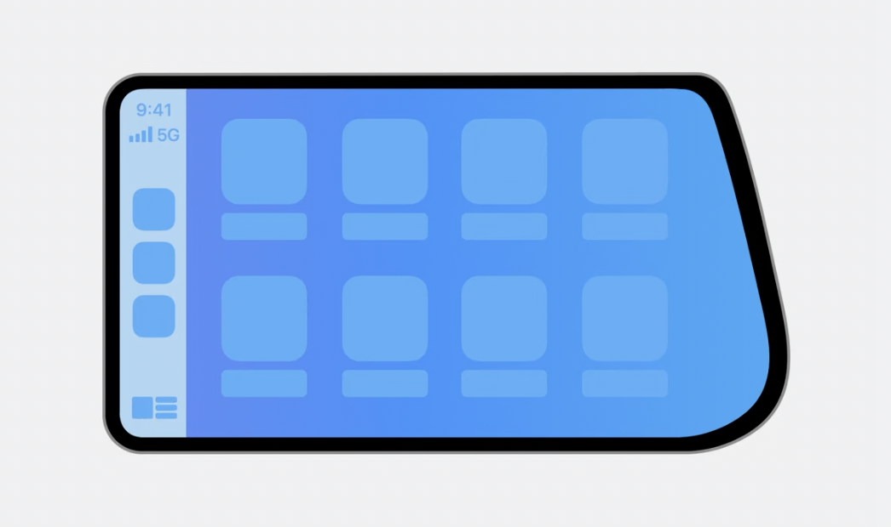

### 2. 状态栏

CarPlay 的状态栏总是显示在 CarPlay UI 中，为驾驶员提供便利。状态栏的位置会根据你的显示屏分辨率和宽高比智能地进行调整。它可以垂直显示在驾驶员一侧（即左侧）（图 ①），也可以水平显示在 CarPlay UI 的底部（图 ②）。

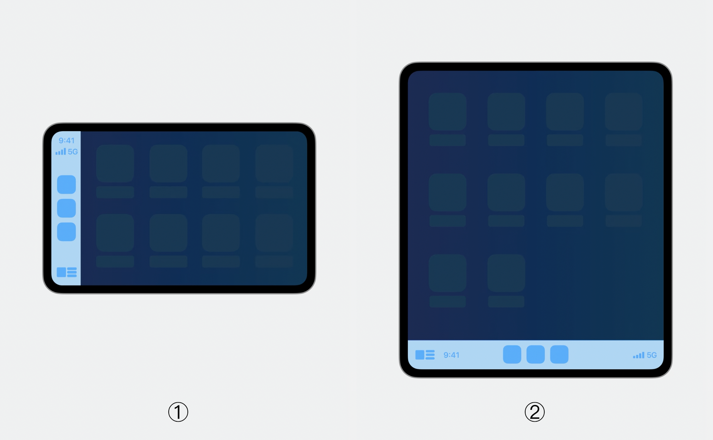

如果需要的话，你可以根据你系统的原生 UI，**通过 `viewAreaStatusBarEdge` 来重写状态栏的位置**。例如，你可能希望将状态栏与原生 UI 中的其他固定控件对齐。

### 3. 圆角

默认情况下，CarPlay 的圆角背景为黑色。当 CarPlay 处于全屏模式时，这看起来很棒。

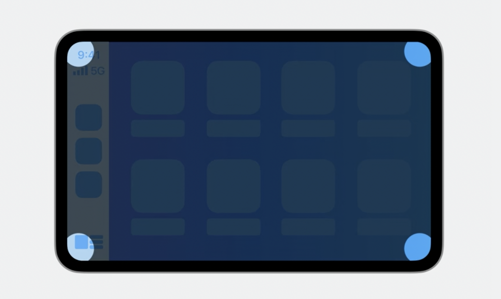

但如果你的 CarPlay UI 是内嵌在原生 UI 中的，可能就会看到 CarPlay 圆角的黑色背景，这可能与你系统的背景不太协调。

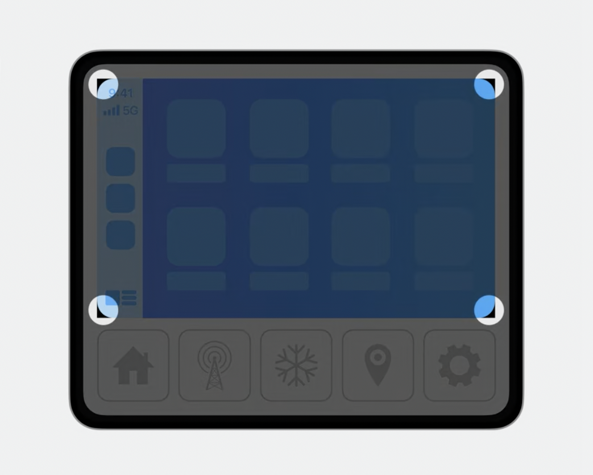

**你可以通过设置 `cornerMasks` 让圆角的黑色背景消失。请注意，当 CarPlay 在安全区域之外绘制 UI 时，该配置无效。**

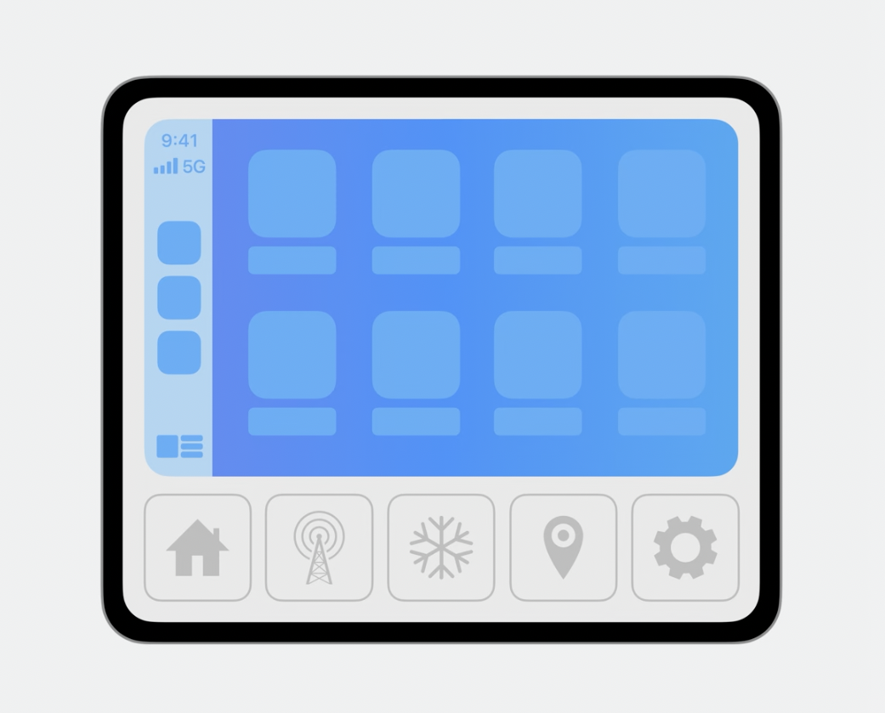

### 4. UI 焦点转移

某些汽车系统支持旋钮或触摸板作为输入设备。

当驾驶员使用这些输入设备与 CarPlay 进行交互时，CarPlay UI 会在所选元素上显示焦点高亮。并且，当驾驶员通过旋钮与原生 UI 进行交互时，你的系统可能会显示自己的焦点高亮。

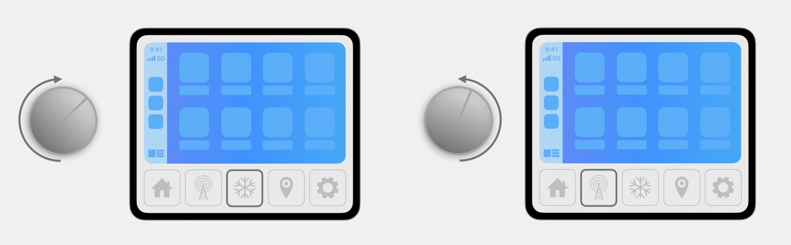

CarPlay 支持焦点转移，允许驾驶员在 CarPlay 和你的系统之间无缝切换选择的 UI 元素。如果你的系统以窗口配置呈现 CarPlay 并支持旋钮或触摸板，请支持该功能。

如果你实现了该功能，驾驶员只需轻触旋钮即可进行焦点转移。Apple 的 API 确保在 CarPlay 和你的系统之间调节焦点时一次只显示一个焦点高亮。

接下来让我们详细看看如何实现该功能。

当 CarPlay 启动时，汽车系统确定焦点是否应该给予 CarPlay。当驾驶员将焦点从原生 UI 指向 CarPlay 时，系统取消焦点，并向 CarPlay 提供方向和位置信息。CarPlay 使用这些信息在最直观的 UI 元素上呈现焦点高亮。

当驾驶员将焦点重新指向原生 UI 时，CarPlay 将焦点提供给系统。如果系统获取焦点，CarPlay 将取消焦点，并由系统呈现自己的焦点高亮。

采用 UI 焦点转移功能，可以为 CarPlay 和原生 UI 之间创建连续性。

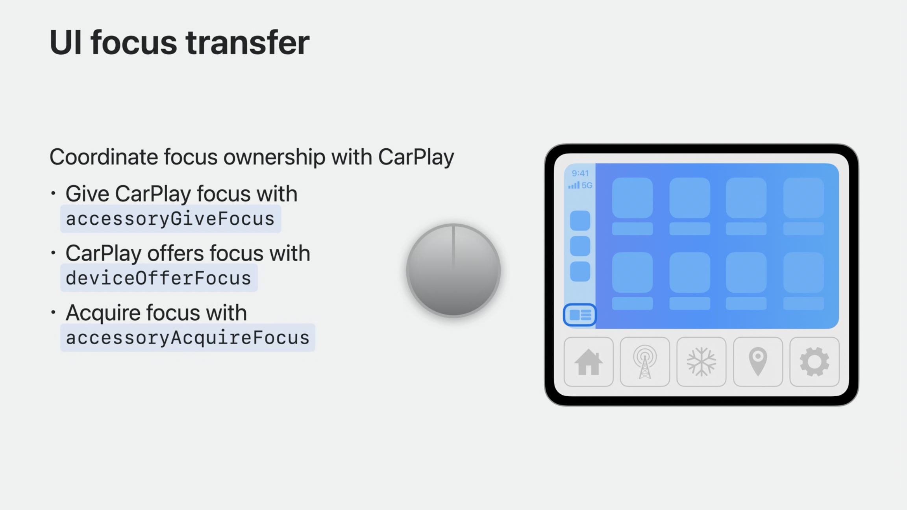

### 5. 外观模式

CarPlay UI 可以呈现浅色或深色外观，并可以根据汽车状态、用户设置和时间变化而变化。在 CarPlay 外观设置为 “自动” 而非 “始终深色模式” 的情况下，你应该同步你的原生 UI 外观到 CarPlay 上，以保持外观一致性。

例如，如果你的系统在晚上切换到深色外观，你的系统只需告知 CarPlay 根据时间变化而改变外观。这样，如果你的系统激活了夜间模式，CarPlay 将自动切换到深色外观。

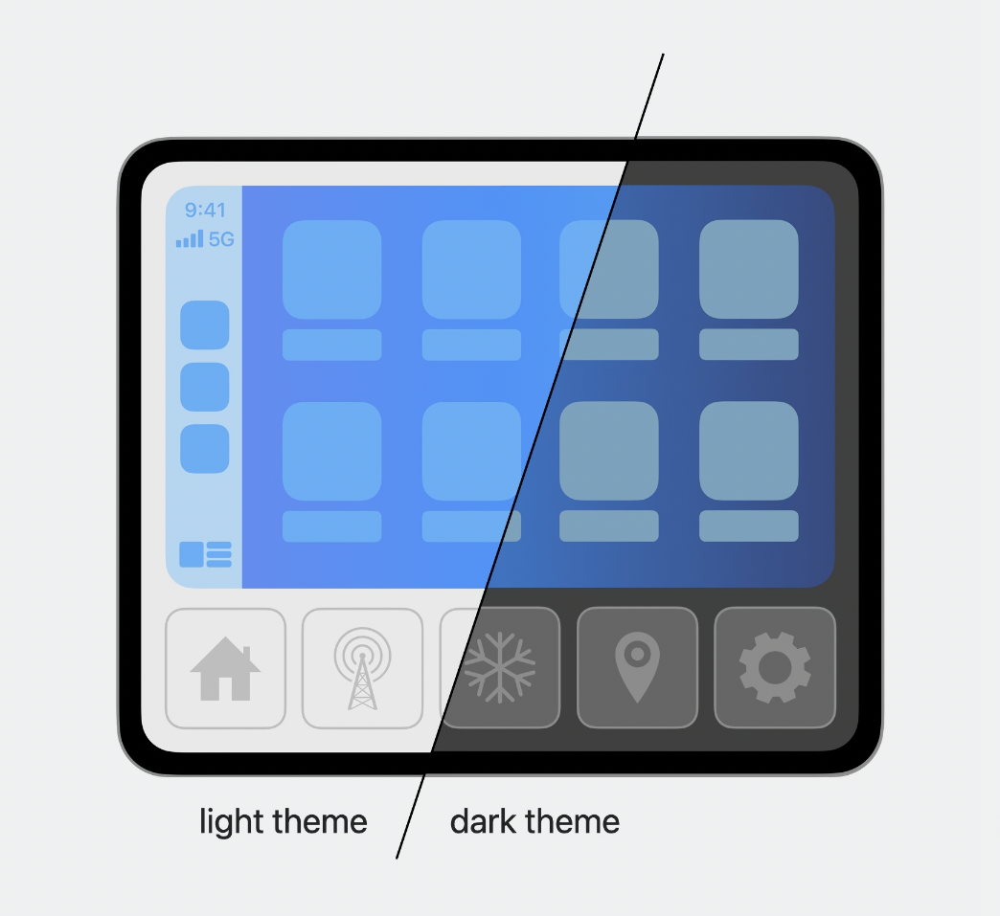

下面我们来看看如何设置 CarPlay UI 的外观。

在以下图例中，原生 UI 在主显示器上使用了深色外观，并通过 `uiAppearance` 设置 CarPlay UI 也呈现深色外观。如果你的系统还在仪表盘上显示 CarPlay 导航 UI，那么也需要为该显示器指定深色外观。

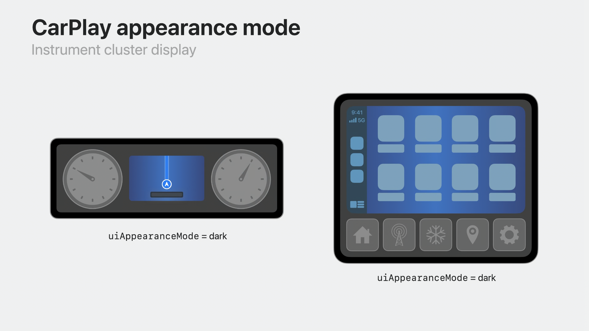

如果你的系统在每个显示器上显示不同的外观模式，请通知 CarPlay 进行匹配。

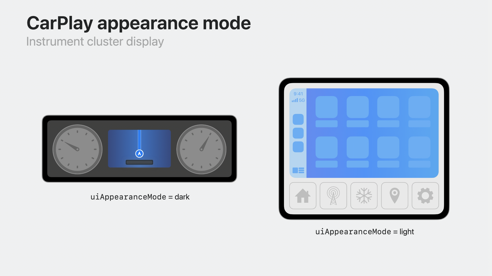

CarPlay 的地图 UI 具有单独的外观设置，使用 `mapAppearance`。请确保将 CarPlay 的地图 UI 外观与内置系统的地图外观保持同步。

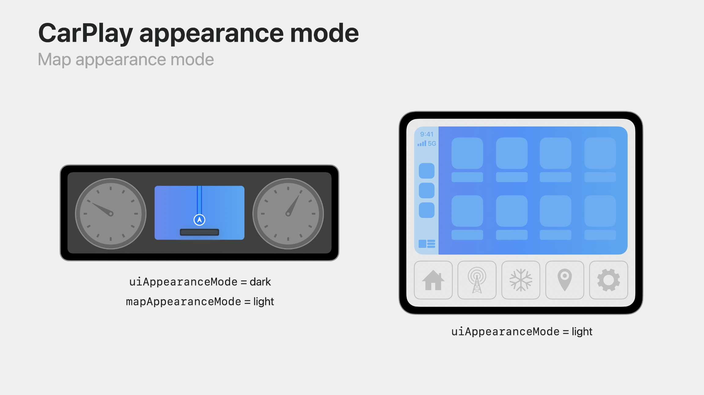

### 6. 多显示器

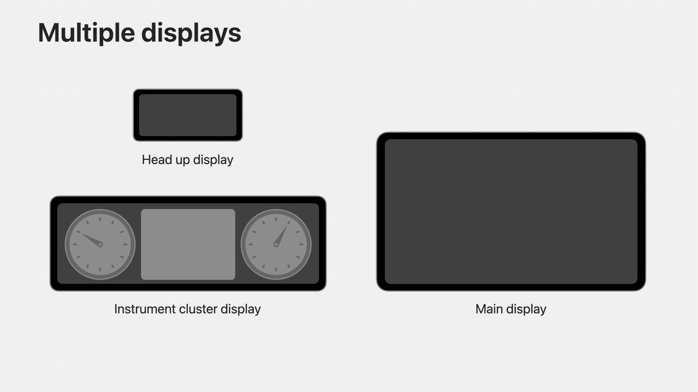

现代汽车系统中常见的三种显示器类型为：主显示器、仪表盘显示器和抬头显示器。

* 在主显示器上，显示 CarPlay 的视频流。此外，你的系统的内置 UI 可以使用 iAP2 元数据进行驱动，如路线指引、电话呼叫和正在播放的信息。如果你的系统显示一个地图小部件，在 CarPlay 导航处于活动状态时，使用 CarPlay 导航 UI 流填充该小部件。此 UI 流可以配置为显示预计到达时间信息、限速标志和指南针。
* 在仪表盘上，你可以显示 CarPlay 导航 UI 流。如果你的系统具有在仪表盘上更改地图缩放级别的控件，请添加 CarPlay 地图缩放支持。并像在主显示器上一样，使用 iAP2 元数据实现内置 UI。
* 在抬头显示器上，使用 iAP2 元数据，让用户在行驶过程中可以在视线范围内查看诸如转向指示等信息。

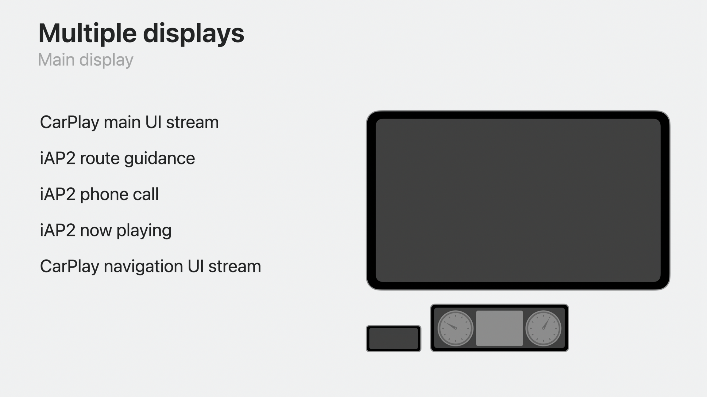

> iAP2 是指 "iOS Accessory Protocol 2"（iOS 附件协议 2），是苹果公司用于连接和通信的一种协议。它是用于连接 iOS 设备（如 iPhone、iPad）与外部设备（如车载系统、音频设备、智能家居设备等）进行通信和交互的标准协议。
>
> iAP2 提供了一种标准的通信接口和数据传输协议，使外部设备能够与 iOS 设备进行双向通信和数据交换。它支持音频、视频、控制命令、元数据传输等多种类型的数据交互，为外部设备提供了与 iOS 设备的无缝集成和交互能力。
>
> 通过 iAP2，开发者可以创建适配 iOS 设备的附件和外部设备，实现与 iOS 生态系统的互动和集成。这使得用户可以通过 iOS 设备与外部设备进行交互和控制，例如通过车载系统控制 iOS 设备的音乐播放、接收来电、导航等。
>
> 总而言之，iAP2 是苹果公司用于连接和通信的协议，用于实现 iOS 设备与外部设备之间的数据交换和互动。它为开发者提供了一种标准的接口和协议，以便创建与 iOS 设备兼容的附件和外部设备。

## 连接性

这里指的是 iPhone 与汽车系统之间的连接性。

无线连接体验始于驾驶员首次配对设备。通过支持带外配对（Out-of-Band Pairing），使驾驶员的首次配对体验更加简便。带外配对允许用户只需将 iPhone 插入汽车中，即可为无线 CarPlay 配对设备。这种方式方便且只需要较少的交互。用户希望所有无线 CarPlay 系统都支持通过 USB 进行带外配对。

如果你的系统支持数字车钥匙，Apple 为你带来了新功能。**从 iOS 17 开始，iPhone 支持通过车钥匙连接进行 CarPlay 配对。** 这使得用户的配对过程更加简单，因为车钥匙和 CarPlay 的配对体验融合为一个统一的流程。在 iPhone 上添加车钥匙后，会提示用户进行无线 CarPlay 配对。如果接受，配对将在车钥匙连接上进行，并进行无线连接。进行一次性配对后，每次驾驶员进入汽车时，你的汽车将自动与 iPhone 进行连接。

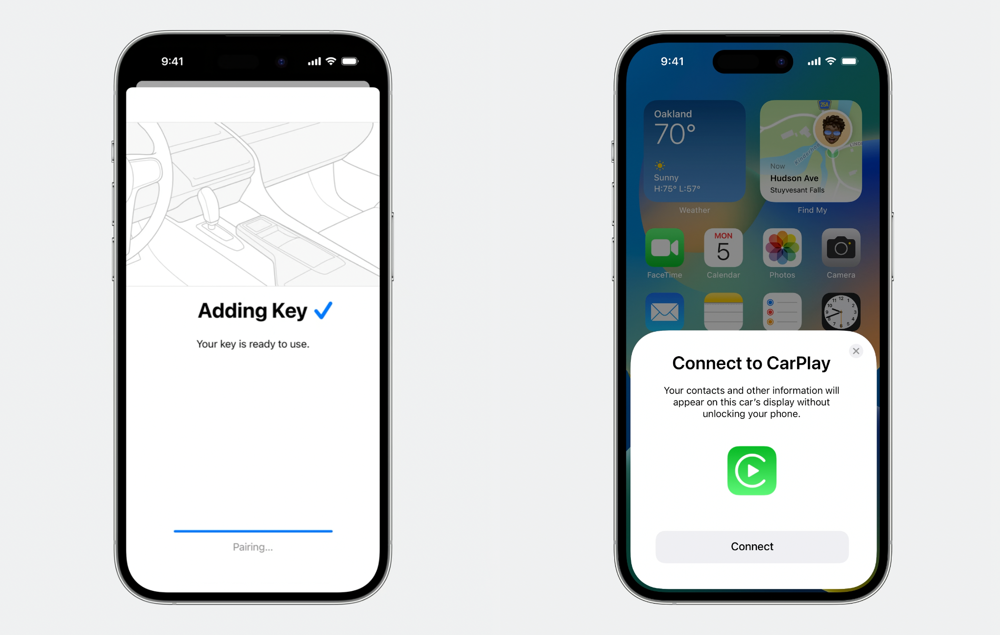

Bonjour 用于汽车和 iPhone 建立 IP 连接并启动 CarPlay 会话。现在，Apple 引入了一个简化的连接流程，这是连接 CarPlay 的首选方式。通过使用现有的 iAP2 连接进行 IP 地址和端口信息交换，不再需要 Bonjour，实现起来更简单和更快。这还增加了对仅支持 WPA3 网络的支持。简化的连接流程可以与运行 iOS 14 及更新版本的设备进行连接。如果你的系统设计用于与较早的 iOS 版本进行连接，请继续支持 Bonjour 连接流程。

对于那些支持车钥匙的系统，我们还有另一个功能。一旦驾驶员使用数字车钥进入汽车，你的系统可以立即连接到无线 CarPlay。通过使用 iAP2 消息，你的系统可以将数字车钥配对映射到 CarPlay 设备。下次驾驶员接近汽车并创建车钥连接时，你的系统会准备好其 CarPlay 堆栈。通过检查是否存在与该车钥对应的 CarPlay 配对，你可以更早地启动 CarPlay。对于驾驶员来说，CarPlay 会立即显示。

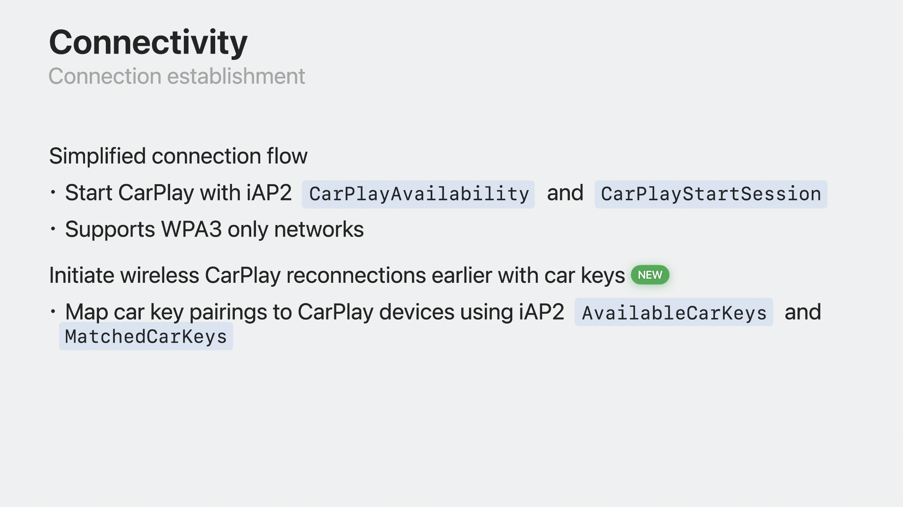

此外，创建可靠的 CarPlay 体验的关键是稳定的连接。为了在你的系统中保持稳定的 CarPlay 连接，你需要优化你的系统来处理无线干扰，因为干扰可能会影响 Wi-Fi 性能。

* 首先，检测无线信道上的干扰源。一旦检测到干扰源，通过使用信道切换通告来避免干扰。
* 其次，如果你的系统支持多个无线电设备，你可以使用 BSS（Basic Service Set，基本服务集）过渡管理来将 iPhone 引导到另一个接入点。请记住，当使用 5 GHz 频段时，用户可以获得最佳的无线 CarPlay 体验。
* 最后，为了在断断续续的连接中提供更流畅的体验，你的系统应该抑制 CarPlay TCP 套接字的短暂断开。不要仅仅因为数据链路层的断开而关闭这些套接字。

## 音频

在连接到你的系统之后，CarPlay 可以通过汽车扬声器播放音频。

本章节将介绍两个可用于你的汽车系统的音频功能。

* 增强缓冲
* 增强 Siri

### 1. 增强缓冲

音频 app 现在正在采用 AirPlay 增强音频缓冲机制以在 iPhone 上提供更出色的播放体验。

> "AirPlay enhanced audio buffered"（AirPlay 增强音频缓冲）是指在 Apple 的 AirPlay 技术中使用的一种音频缓冲增强机制，其改善了 AirPlay 的音频传输性能。这包括增加缓冲区的大小、改进缓冲管理算法以及引入其他优化措施，以减少音频传输的延迟、提高稳定性和音频质量。
>
> 通过增强音频缓冲，AirPlay 可以更好地处理音频数据的传输，降低数据丢失的风险，并提供更流畅、高质量的音频传输体验。这对于无线音频传输至关重要，尤其是在需要保持同步性和稳定性的应用场景中，如音乐播放、视频流媒体和游戏等。
>
> 需要注意的是，具体的实现和细节可能会因 Apple 对 AirPlay 技术的更新和改进而有所变化。因此，随着时间的推移，AirPlay 的增强音频缓冲机制可能会有所不同。

当然，用户也希望在你的汽车中体验到相同的音频改进。**现在，你可以通过 `mainBuffered` 为你的汽车系统添加对增强缓冲的支持**，你的汽车将自动享受这些好处。

增强缓冲是将音频（如音乐）流式传输到汽车扬声器的首选平台，音频作为额外的流提供给汽车系统，称为主缓冲音频。

CarPlay 通信插件包含一个长达 2 分钟的音频缓冲区，其中 iPhone 的音频以超过实时速度进行流式传输。这样可以提高响应速度，并且即使在断开连接时，音频内容也可以继续播放。

你可以查看[《WWDC23 - 10238 - Tune Up Your AirPlay Audio Experience》](https://developer.apple.com/videos/play/wwdc2023/10238/)来获取更多有关音频应用开发者可用功能的详细信息。

用户希望在 CarPlay 上的音频混合与在 iPhone 上的体验相同。你需要确保你的系统能够混合各种音频输出流（例如主音频、主缓冲音频、备用音频和辅助音频），以创建一致的音频体验。

### 2. 增强版 Siri

增强版 Siri 将 iPhone 上熟悉的 Siri 体验带到了 CarPlay。用户习惯于说 “Siri” 来激活 Siri，他们也希望在 CarPlay 中同样能够使用。

你需要确保你的系统支持增强版 Siri。

* 首先，增强版 Siri 利用汽车的麦克风可靠地检测到驾驶员通过语音激活 Siri 的操作。
* 此外，音频 app 和广播会混合在 Siri 音频的背景中。用户喜欢由此产生的不间断的音频体验。
* 最后，它使驾驶员能够在按下按键对讲按钮后立即激活 Siri。

你可以查看[《WWDC19 - 252 - Advances in CarPlay Systems》](https://developer.apple.com/videos/play/wwdc2019/252/)来详细了解 Enhanced Siri 在你的系统中的工作方式。

## 视频编码

在这之前，CarPlay UI 流使用 H.264 编码。**现在，CarPlay 支持 HEVC 编码用于所有 UI 流。HEVC 更高效，并且使 CarPlay 能够支持更高分辨率的显示。**

为了向后兼容，你的系统应继续支持 H.264 编码。

## 电车路线规划

Apple Maps 可以帮助你规划行程，包括电车充电站停靠。在获取驾驶路线指导时，Maps 会分析路线和其他因素，并标识出沿途的充电站。

今年，除了支持离线地图外，电车路线规划还有一些很棒的更新。

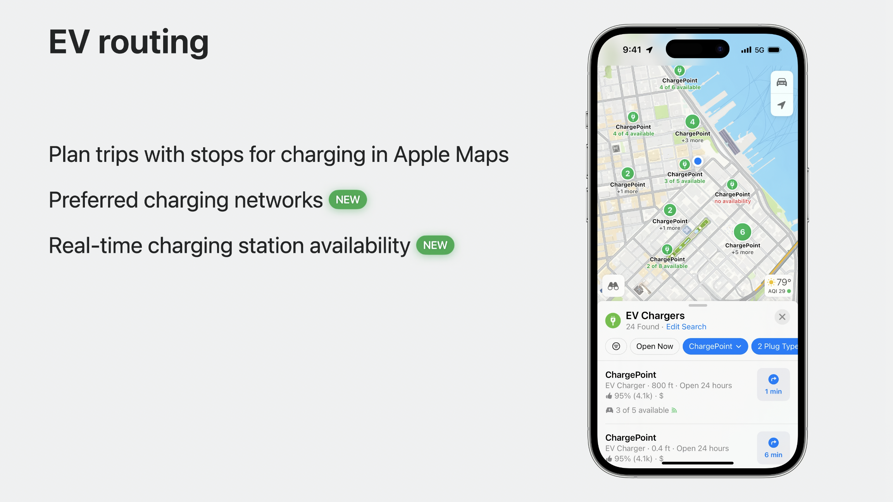

**现在，用户可以告诉 Maps 他们偏好的充电网络，并在地图上实时查看充电站的可用情况。**

为了支持电车路线规划，Apple Maps 需要了解你的电车的一些特性，以个性化定制电车路线规划的体验。因此，你需要提供这些信息。

此外，你需要支持接口来提供汽车的电池电量状态信息。如果你有一款汽车厂商的 app，应实现 SiriKit intents，包括 "List Cars" 和 "Get Car Power Level Status" ，以便用户在车内或车外使用电车路线规划。另外，你应该支持 iAP2 消息，以在驾驶过程中实时传递电池电量状态信息。

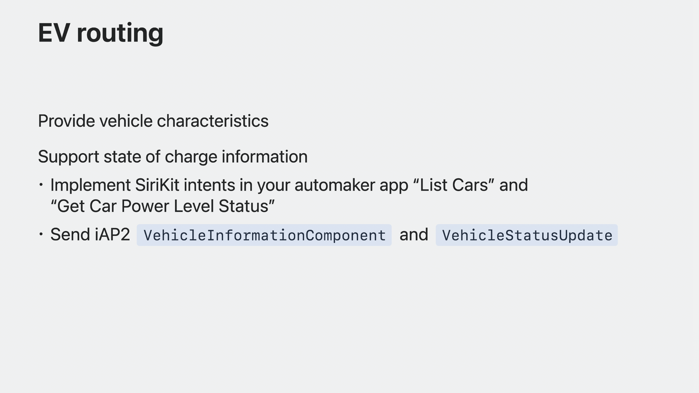

## 总结

以上介绍了如何在你的汽车系统中丰富 CarPlay 体验的所有方法。新一代 CarPlay 将基于这一代 CarPlay，并充分利用本文中介绍的基础架构变更。通过在 CarPlay 中支持这些功能，为新一代 CarPlay 做好准备。

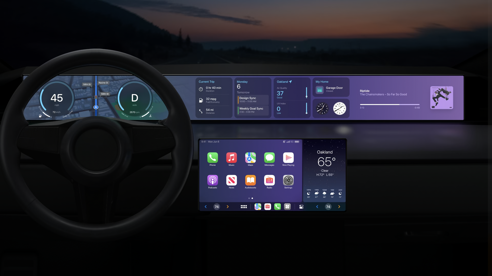

> 本文讨论的功能已经包含在最新的 CarPlay 规范和通信插件中。有关开发 CarPlay 系统的更多信息，请访问 [developer.apple.com/carplay](https://developer.apple.com/carplay/)。

