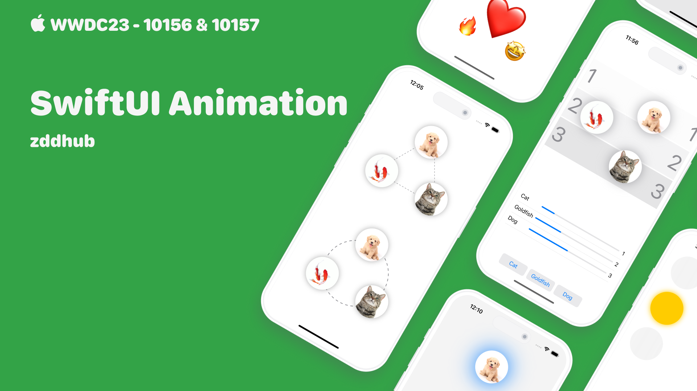

## 个人介绍

zddhub(张东东)，移动开发，MacOS App：[**PixelsMeasure**](https://apps.apple.com/cn/app/pixelsmeasure/id1638740542) 开发者。

## 审核介绍

Jake Lin，在 REA Group 担任 Senior Mobile Tech Lead，负责公司的移动研发和团队建设。喜欢研究 iOS 和 Android 两平台的架构，爱折腾声明式 UI 和响应式编程范式。并编写了 [iOS 开发进阶](https://t2.lagounews.com/lR59RGRBct5E3) 课程。

## 不超过 120 个字的文章简介

本文先以 SwiftUI 动画的基础知识为起点，逐步剖析了支撑 SwiftUI 动画效果的三大核心组成部分：Animation、Animatable 和 Transaction。同时，结合 SwiftUI 的视图渲染机制，旨在帮助读者更深刻地理解和有效地应用 SwiftUI 的动画功能。在文章的尾声，我们会介绍 SwiftUI 最新加入的两个高级动画功能。一起开启探索之旅吧！

## 公众号/小专栏图文头图

