# WWDC23 10156 - SwiftUI 动画篇

本文基于 Session [10156][10156]、[10157][10157] 梳理。

动画是现代应用设计的关键组成部分，恰当地使用动画可以使用户界面更加清晰并富有活力。初学者通常会惊叹于 SwiftUI 动画功能的强大，但当深入使用时却会发现并不容易掌握。开发者通常会由于动画效果因为这样或者那样的问题无法到达预期而苦恼，这是对 SwiftUI 动画机制不了解而造成的。本文将结合 [WWDC23 10156][10156]、[WWDC23 10157][10157] 和自己的实验，概述 SwiftUI 强大的动画功能以及它们如何协同工作来产生令人印象深刻的视觉效果。

全文分为五个部分：

- SwiftUI 动画的基本知识
- 动画过渡函数 Animation
- 可动画属性 Animatable
- SwiftUI 视图渲染机制
- 动画上下文 Transaction
- 高级动画工具 `New`

## SwiftUI 动画的基本知识

动画 (英语：Animation) 一词来自动画文创产业技术的发源地法国发明家埃米尔·雷诺的 "Animated"，指栩栩如生、正在动的图像。维基百科上说：动画（英语：Animation）是一种通过定时拍摄一系列多个静止的固态图像（帧）以一定频率连续变化、运动而导致肉眼的视觉残象产生的错觉——而误以为图画或物体（画面）活动的技术。

小时候玩的手翻书就是我最早见到的动画了，我们通常将连续动作画在书脚上，当翻书时，由于视觉暂留而感觉图像动了起来，给童年增添了许多乐趣。

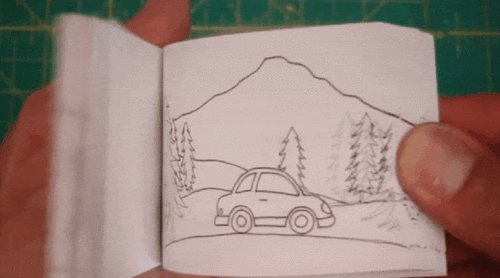

### SwiftUI 动画是什么

SwiftUI 自己也对动画做了定义：创建流畅的视觉更新去响应状态变化（Create smooth visual updates in response to state changes）。即当状态变化时，动画会使视图更新更加平滑、流畅。

那么，我们根据动画的定义，先不用 SwiftUI 的动画机制，来实现一个简单的动画效果。物体随时间运动能产生动画，那么我们就实现一个小球沿直线运动的动画。使用定时器，每 1.0/30 秒 (30 fps) 刷新一次小球的位置，持续一秒。我们把这个版本叫做定时器版本，代码如下：

```swift
struct ManualAnimation: View {
    @State private var position: CGFloat = 0.0
    @State private var timer: Timer?
    @State private var times: Int = 0

    var body: some View {
        VStack {
            Circle()
            .frame(width: 64, height: 64)
            .foregroundColor(.yellow)
            .position(x: position, y: 0)
            .onAppear {
                startAnimation()
            }
        }
    }

    func startAnimation() {
        timer = Timer.scheduledTimer(withTimeInterval: 1.0 / 30.0, repeats: true) { _ in
            times += 1
            if times < 30 {
                position += 5.0
            }
        }

        DispatchQueue.main.asyncAfter(deadline: .now() + 1.0) {
            timer?.invalidate()
            timer = nil
        }
    }
}

```

这样我们就得到了一个非常简单的动画效果：


注意，这里使用异步方法来结束定时器，并不能严格的保证 30 帧，所以使用了 times 来限制次数。另外，每次刷新小球的位置向右移动 5 个单位，是一个线性的动画效果。

那么，如何使用 SwiftUI 来生成相同的动画效果呢？

### SwiftUI 添加动画的方式

为了避免状态变化时出现突兀的视觉过渡，SwiftUI 提供了三种添加动画的方式：

- 通过将状态改变包裹在全局函数 `withAnimation(_:_:)` 的调用中，为状态变化引起的所有视觉变化添加动画。
- 通过对 View 使用 `animation(_:value:)` 修饰符，在特定值改变时为其添加动画。
- 使用绑定变量的 `animation(_:)` 方法，对绑定变量的变化进行动画处理。

让我们逐一来使用它们。

#### 使用 `withAnimation(_:_:)` 实现动画效果

全局函数 `withAnimation` 的签名如下：

```swift
func withAnimation<Result>(_ animation: Animation? = .default, _ body: () throws -> Result ) rethrows -> Result
```

- 参数 `animation` 使用 SwiftUI 提供的动画效果，这里使用 `.linear(duration: 1)`。
- 参数 `body` 来包裹状态的改变。

代码如下：

```swift
struct AnimationWayOne: View {
    @State private var x1: CGFloat = 0.0

    var body: some View {
        VStack {
            Circle()
                .frame(width: 64, height: 64)
                .foregroundColor(.blue)
                .position(x: x1, y: 0)
                .onAppear {
                    withAnimation(.linear(duration: 1)) {
                        x1 = 150.0
                    }
                }
        }
    }
}
```

可以看到，SwiftUI 使用比定时器版本简单的多的代码，实现了相同的动画效果。得益于声明式 UI，SwiftUI 并不要求我们关心动画的具体细节，只要声明如下三件事就好：

- 动画的初始状态和结束状态
- 动画过渡函数，例如 `.linear(duration: 1)`
- 将状态变化和动画过渡函数关联起来

于此同时，SwiftUI 帮我们省略了诸如定时器管理和中间状态管理的逻辑，极大地简化了实现动画的代码量。

#### 使用 `animation(_:value:)` 实现动画效果

`animation(_:value:)` 作用在 View 上，当特定的值改变后，才实现动画效果。代码如下：

```swift
struct AnimationWayTwo: View {
  @State private var x2: CGFloat = 0.0

  var body: some View {
    Circle()
      .frame(width: 64, height: 64)
      .foregroundColor(.blue)
      .position(x: x2, y: 0)
      .animation(.linear(duration: 1), value: x2)
      .onAppear {
        x2 = 150
      }
  }
}
```

#### 使用绑定变量的 `animation(_:)` 实现动画效果

这种方法，实现了绑定变量和动画过滤函数的关联。代码如下：

```swift
struct AnimationWayThree: View {
  @State private var x3: CGFloat = 0.0

  var body: some View {
    SubCircleView(x3: $x3.animation(.linear(duration: 1)))
  }
}

struct SubCircleView: View {
  @Binding var x3: CGFloat
  var body: some View {
    Circle()
      .frame(width: 64, height: 64)
      .foregroundColor(.blue)
      .position(x: x3, y: 0)
      .onAppear {
        x3 = 150
      }
  }
}
```

效果如下图所示，图中黄色小球使用定时器版本的动画，蓝色小球使用 SwiftUI 提供的三种动画的方式实现。

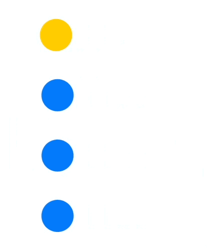

通过示例可以发现，SwiftUI 提供的三种动画方式都可以实现相同的效果，但是它们的使用方式不同。

- `withAnimation(_:_:)` 作用在全局
- `animation(_:value:)` 作用在 View 上
- `animation(_:)` 作用在绑定的变量上

这三种方式，都需要关联变化的状态，设置一个过渡函数来实现动画效果。

小球能出现平滑的运动，是由于 SwiftUI 利用动画过渡函数，将其关联的状态做了插值处理，随着时间的变化，利用新的状态刷新 UI，以达到视图的平滑过滤。那么，我们接下来看看 SwiftUI 是如何插值数据的。

## 动画过渡函数 Animation

SwiftUI 使用 `Animation` 来配置不同的插值算法，用来计算动画过渡的中间状态数据。Animation 这个命名通常让人迷惑，如果了解 CSS 的话，可以看看它类似的 API：

```css
transition
transition-delay
transition-duration
transition-property
transition-timing-function
```

如果把动画的接口定义成 `Animation(timingFunction:property:duration:delay)`, 那么知识迁移起来就会容易的多。在 SwiftUI 的世界里，写法如下：

```swift
withAnimation(.linear(duration: 1).delay(2.0)) {
    property = value
} // Way one

View().animation(.linear(duration: 1).delay(2.0), value: property) // Way two

Binding<Value>.animation(.linear(duration: 1).delay(2.0), value: property) // Way three
```

你可能已经发现，除了写法不同，所有的参数都是一模一样的。这样会不会好理解一些了呢？

为了行文方便，以下将 Animation 称作动画过渡函数，突出其插值算法的本质。

### 动画过渡函数

SwiftUI 内置了大量的动画过渡函数，主要分为四类：

- 时间曲线动画函数 (Timing curve animations)
- 弹簧动画函数 (Spring animations)
- 高阶动画函数 (Higher order animations)
- 自定义动画函数 (Custom Animation) `New`

#### 时间曲线动画函数

这类大家应该都比较熟悉，SwiftUI 帮我们实现了常用的时间曲线动画函数：

- linear
- easeIn
- easeOut
- easeInOut

其它的使用 `timingCurve` 函数来实现，通过二次曲线，或者 Bézier 曲线，来实现插值函数：

- `static func timingCurve(Double, Double, Double, Double, duration: TimeInterval) -> Animation`
- `static func timingCurve(UnitCurve, duration: TimeInterval) -> Animation` `New`


#### 弹簧动画函数

SwiftUI 内置了三种常用的弹簧动画函数，并提供 `spring` 函数来自定义的弹簧函数：

- smooth
- snappy
- bouncy
- `static func spring(duration: TimeInterval, bounce: Double, blendDuration: Double) -> Animation`
- `static func spring(Spring, blendDuration: TimeInterval) -> Animation` `New`

值得一提的是，苹果强烈建议使用弹簧动画，因为它们通过保持速度和自然静止为你的 UI 带来有生机的感觉。并且，在 iOS 17 及以上版本中，将 `smooth` 作为 `withAnimation` 的默认值。

感兴趣的同学可以学习 [WWDC23 10158: Animate with springs][10158] 来了解更多弹簧动画函数相关的内容。

#### 高阶动画函数

所谓的高级动画函数，是指在其它动画函数的基础上，叠加诸如延迟、重复、翻转和速度等函数的方法，通过函数提供：

- `func delay(TimeInterval) -> Animation`
- `func repeatCount(Int, autoreverses: Bool) -> Animation`
- `func repeatForever(autoreverses: Bool) -> Animation`
- `func speed(Double) -> Animation`

#### 自定义动画函数 `New`

除了使用函数外，这次的升级增加了自定义动画函数的功能，将插值算法完全交给开发者，只要实现 `CustomAnimation` 协议即可。其中 `animate` 是必须实现的，`velocity` 和 `shouldMerge` 是可选的。

```swift
public protocol CustomAnimation : Hashable {
    func animate<V>(value: V, time: TimeInterval, context: inout AnimationContext<V>) -> V? where V : VectorArithmetic
    func velocity<V>(value: V, time: TimeInterval, context: AnimationContext<V>) -> V? where V : VectorArithmetic
    func shouldMerge<V>(previous: Animation, value: V, time: TimeInterval, context: inout AnimationContext<V>) -> Bool where V : VectorArithmetic
}
```

这里实现一个简单的 Linear 动画函数：

```swift

struct MyLinearAnimation: CustomAnimation {
  var duration: TimeInterval

  func animate<V>(value: V, time: TimeInterval, context: inout AnimationContext<V>) -> V? where V : VectorArithmetic {
    if time <= duration {
      value.scaled(by: time / duration)
    } else {
      nil // animation has finished
    }
  }

  func velocity<V: VectorArithmetic>(
    value: V, time: TimeInterval, context: AnimationContext<V>
  ) -> V? {
    value.scaled(by: 1.0 / duration)
  }

  func shouldMerge<V>(previous: Animation, value: V, time: TimeInterval, context: inout AnimationContext<V>) -> Bool where V : VectorArithmetic {
    true
  }
}

extension Animation {
  public static func myLinear(duration: TimeInterval) -> Animation { // define function like linear
    return Animation(MyLinearAnimation(duration: duration))
  }
}

struct MyCustomLinearAnimation: View {
  @State private var x4: CGFloat = 0.0

  var body: some View {
    Circle()
      .frame(width: 64, height: 64)
      .foregroundColor(.green)
      .position(x: x4, y: 0)
      .animation(.myLinear(duration: 1), value: x4) // use myLinear animation
      .onAppear {
        x4 = 150
      }
  }
}
```

效果如下图所示，绿色为 CustomAnimation 实现的动画：

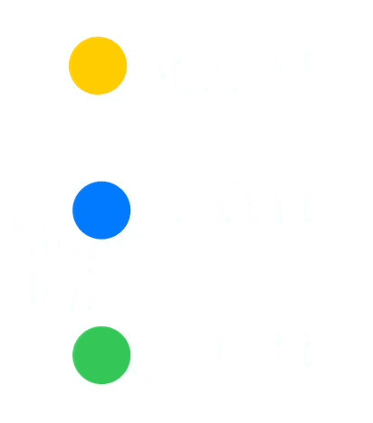

另外，官方文档上也实现了一个自定义的 `ElasticEaseInEaseOutAnimation`, 大家可以自行研习一番。

SwiftUI 使用 Animation 决定了数据如何随时间变化，而另一个结构 Animatable，则决定了哪些数据会参与动画处理。

## 可动画属性 Animatable

所谓的可动画属性是指，能接收动画过渡函数 Animation 产生的插值数据，并将插值数据传递给视图的属性。

这里注意区分属性和状态的区别，举个例子：

```swiftUI
struct Avatar: View {
  var pet: Pet
  @State private var selected: Bool = false // 状态

  var body: some View {
    Image(pet.type)
      .position(x: selected ? 300 : 100, y: 0) // 属性
      .onTapGesture {
        withAnimation {
          selected.toggle()
        }
      }
  }
}
```

代码中 `selected` 是状态，`position` 是属性 (这里通过同名修饰符设置视图对应的属性)。状态改变导致属性改变，可动画属性改变导致动画产生。

在 SwiftUI 中，许多内置的视图修饰符都可以理解成可动画属性，都可以进行动画处理。例如上文中使用的 `position` 修饰符。你可以通过使自定义视图遵循 Animatable 协议，来让 View 获取 Animation 动画过渡函数生成的插值数据 animatableData, 再由 animatableData 将数据传递给视图，来刷新视图，以获得动画的能力。唯一的要求是 animatableData 必须遵循 `VectorArithmetic` 协议。

```swift
protocol Animatable {
  associatedtype AnimatableData : VectorArithmetic
  var animatableData: AnimatableData
}
```

VectorArithmetic 符合你数学课本中对向量的定义。它支持向量加法和标量乘法。如果你对向量感到生疏或不熟悉，不要气馁。向量基本上只是一系列固定长度的数字列表，在 SwiftUI 动画中，处理向量的目的主要是为了抽象化该列表的长度。例如，CGFloat 和 Double 是一维向量，而 CGPoint 和 CGSize 定义了二维向量，CGRect 定义了一个四维向量。通过处理向量，SwiftUI 能够使用一个通用的实现对所有这些类型以及更多类型进行动画处理。

### 自定义 Animatable Data

由于 Circle 的 `position` 修饰符本身就具备了动画的能力，所以在之前的例子中，我们并没有显式地遵守 Animatable 协议。让我们自定义一个 MyCircle 视图，用来画圆，使用 position 参数 (而非 `position` 修饰符) 来控制圆的位置：

```swift
struct MyPosition: Equatable {
  var x: CGFloat
  var y: CGFloat
}

struct MyCircle: View {
  var position: MyPosition

  var body: some View {
    GeometryReader { geo in
      Path { path in
        path.addArc(center: CGPoint(x: position.x, y: position.y),
                    radius: min(geo.size.width, geo.size.height) / 2, startAngle: .zero, endAngle: .degrees(360), clockwise: false)
      }
    }
  }
}
```

SwiftUI 在实现 `path.addArc` 时，并没有给它添加处理动画的能力，所以我们需要自己实现。同时，也定义了一个不符合 `VectorArithmetic` 协议的 `MyPosition` 数据结构。使用和之前类似的代码来产生动画：

```swift
struct MyAnimatableView: View {
  @State private var position = MyPosition(x: 0, y: 0)

  var body: some View {
    MyCircle(position: position)
      .frame(width: 64, height: 64)
      .foregroundColor(.blue)
      .animation(.linear(duration: 1), value: position)
      .onAppear {
        position = MyPosition(x: 150, y: 0)
      }
  }
}
```

你会发现，小球直接跑到了终点，没有任何动画。那接下来，我们让 MyCircle 遵循 Animatable 协议，使其能接收插值数据，并传递给 `path.addArc` 的 `center` 参数，这样，小球就动起来了。代码如下：

```swift
extension MyCircle: Animatable {
  var animatableData: AnimatablePair<CGFloat, CGFloat> {
    get { AnimatablePair(position.x, position.y) }
    set {
      position.x = newValue.first
      position.y = newValue.second
    }
  }
}
```

你会发现，由于 MyPosition 不符合 `VectorArithmetic` 协议，所以它不能作为 animatableData 的类型。SwiftUI 提供了一个符合 `VectorArithmetic` 协议的数据结构 `struct AnimatablePair<First, Second> where First : VectorArithmetic, Second : VectorArithmetic`，它将两个符合 `VectorArithmetic` 的数据类型组合成一个，作为返回值。而且 AnimatablePair 也是可以嵌套的。比如 CGRect 的 AnimationData 类型为：

```swift
AnimatablePair<AnimatablePair<CGFloat, CGFloat>, AnimatablePair<CGFloat, CGFloat>>
```

如果 MyPosition 遵循了 `VectorArithmetic` 协议，那么它就可以作为 animatableData 的类型了。下面是一个简单的实现：

```swift
extension MyPosition: VectorArithmetic {
  static func + (lhs: MyPosition, rhs: MyPosition) -> MyPosition {
    MyPosition(x: lhs.x + rhs.x, y: lhs.y + rhs.y)
  }

  static func - (lhs: MyPosition, rhs: MyPosition) -> MyPosition {
    MyPosition(x: lhs.x - rhs.x, y: lhs.y - rhs.y)
  }

  mutating func scale(by rhs: Double) {
    self.x *= rhs
    self.y *= rhs
  }

  var magnitudeSquared: Double {
    x*x + y*y
  }

  static var zero: MyPosition {
    MyPosition(x: 0, y: 0)
  }
}
```

有了它，我们可以直接使用 MyPosition 作为 animatableData 的类型了。

```swift
extension MyCircle: Animatable {
  var animatableData: MyPosition {
    get { position }
    set { position = newValue }
  }
}
```

代码简洁了不少。当向量维度过多时，可以考虑实现 `VectorArithmetic` 协议来减少 `AnimatablePair` 的嵌套层数。

SwiftUI 会根据动画过渡函数生成的插值数据来不断的调用 animatableData 的 set 方法。animatableData 再将插值数据传递给 position 属性，position 改变导致视图位置发生变化，动画就产生了。

之所以要让 animatableData 遵循 `VectorArithmetic` 协议，是因为 SwiftUI 仅知道如何对 `VectorArithmetic` 做插值。

### 使用 Animatable 来修改插值的对象

下面的代码使用环形布局 RadialLayout (参考 [WWDC22-10056][wwdc2022-10056])，当 offset 改变时 (从 0 度改变到 180 度)，Avatar 的位置会发生变化。

```swift
struct Podium: View {
  var offset: Angle
  var body: some View {
    RadialLayout(offset: offset) {
      Avatar(pet: Pet(type: "Dog"))
      Avatar(pet: Pet(type: "Cat"))
      Avatar(pet: Pet(type: "Goldfish"))
    }
  }
}
```

默认情况下，SwiftUI 将插值数据传递给 Avatar 的位置。如下图左图所示，Avatar 沿直线运动到新的位置。如果想要让 Avatar 沿圆周运动，如下图右侧所示，则需要将插值信息传递给 offset 参数。

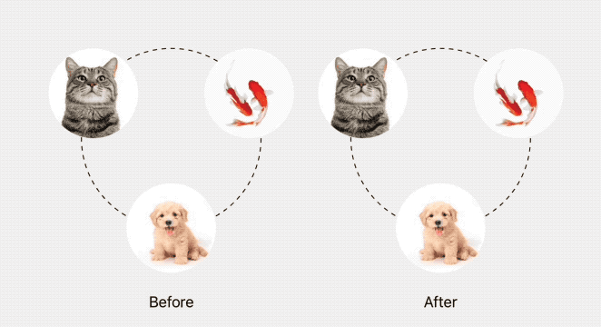

代码非常简单：

```swift
extension Podium: Animatable {
  var animatableData: Angle.AnimatableData {
    get { offset.animatableData }
    set { offset.animatableData = newValue}
  }
}
```

是不是很神奇，这是为什么呢？想了解这背后的原因，就需要理解 SwiftUI 视图的渲染机制了。

## SwiftUI 视图渲染机制

为了理解 SwiftUI 视图的渲染机制，我将从一个简单的例子开始。在这个例子中，我们将专注于单个宠物头像视图。代码如下：

```swift
struct Avatar: View {
  var pet: Pet
  @State private var selected: Bool = false

  var body: some View {
    Image(pet.type)
      .scaleEffect(selected ? 1.5 : 1.0)
      .onTapGesture {
        selected.toggle()
      }
  }
}
```

`Avatar` 视图的 body 由一个点击手势 `onTapGesture`、一个缩放效果 `scaleEffect` 和一个图像 `Image` 组成。在后台，SwiftUI 维护着一个长期存在的属性图，管理视图及其数据的生命周期。图中的每个节点，称为属性，对应 UI 的一个精细部分。当状态改变时，每个下游属性的值变为过时。它们通过逐层展开，获取新的属性值来进行刷新。

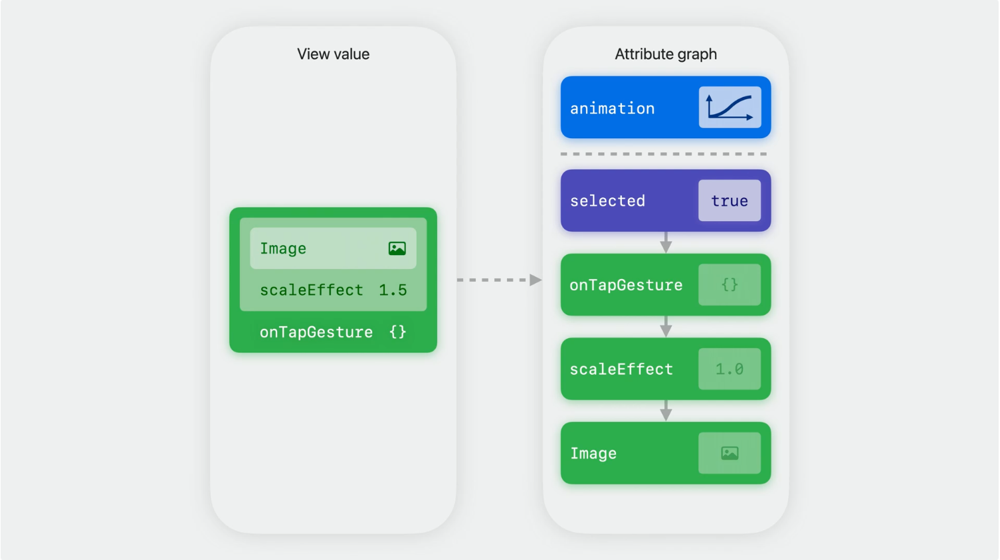

当点击事件发生时， SwiftUI：

1. 打开一个更新事务 (Transaction)
2. 状态改变，selected 的值由 false 变成 true
3. 将当前试图标记为失效，为重新渲染做准备
4. SwiftUI 调用 body 重新获取各属性的值 (View Value)，比如本次中 `scaleEffect` 的值从 1.0 更新成 1.5
5. 根据新的属性值来逐层更新 SwiftUI 后台维护的属性图
6. 丢弃 body 的值
7. 通过后台属性图来调用底层绘制命令渲染视图
8. 关闭当前事务，更新结束

下图展示了属性图的生命周期：打开更新事务，状态更新，调用 body，刷新属性图，事务关闭。通过这种方式，图表中每个属性的当前值随时间演变。

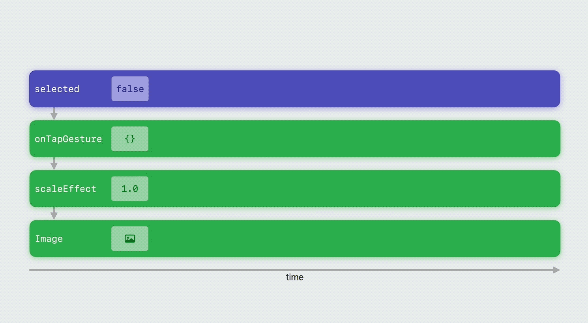

### 带动画的视图渲染

现在，让我们使用 `withAnimation` 添加动画效果。当点击事件发生时，动画会被设置到事务中，然后 SwiftUI 重新渲染视图。不同的是，`scaleEffect` 是可动画属性，是一个能接收插值数据的特殊属性。当可动画属性的值发生变化时，它会检查事务中是否设置了动画。如果设置了动画，它会进行拷贝并不断获得插值数据。

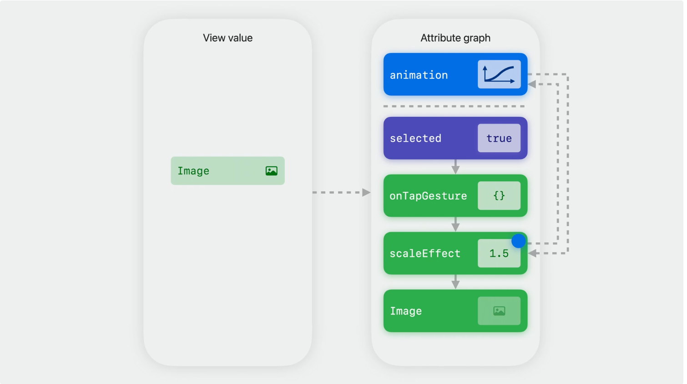

需要注意的是，可动画属性在概念上具有**模型值和展示值**。起初他们是相同的。然后事件发生，事务打开，这次有动画。状态改变，调用 body 刷新过时的模型值。因为模型值发生了变化，SwiftUI 会在本地创建动画的拷贝来计算当前的展示值。视图根据展示值的变化而不断刷新产生了动画。

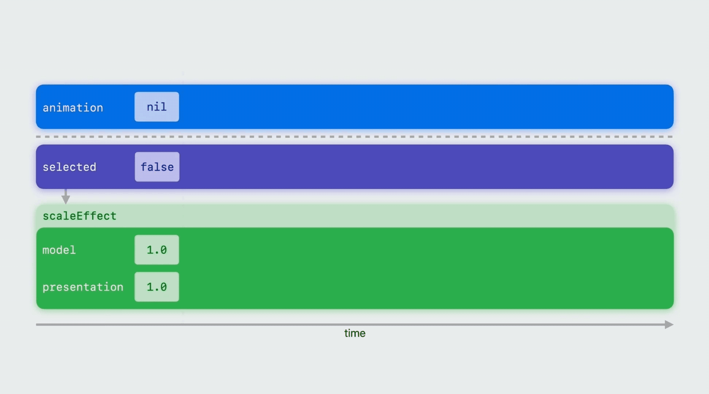

SwiftUI 知道属性图中是否包含正在运行的动画，并会调用相应的可动画属性来生成下一帧。对于像 `scaleEffect` 这种的内置可动画属性，SwiftUI 的效率非常高。它能够在主线程之外完成这项工作，并且无需调用任何你的视图代码。

### 使用 animatableData 传递插值数据

现在，我们清楚了 SwiftUI 视图的渲染机制，那么接下来理解一下，为什么我们能用 animatableData，来改变动画效果。

Podium 视图由一个环形布局的 RadialLayout 组件和三个头像组件 Avatar 构成。当 offset 改变时，会通过 RadialLayout 布局来刷新 Avatar 的位置。

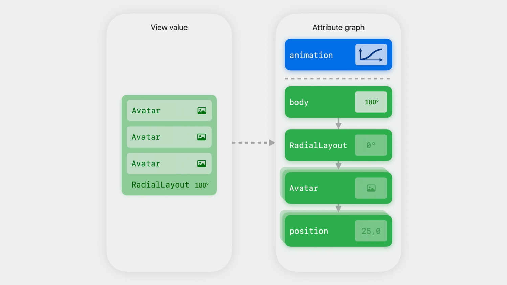

在默认情况下，position 接收动画插值数据，位置的信息存储在 CGPoint(x:y:)，它在笛卡尔坐标空间中进行插值，插值数据呈线性函数，这意味着每个头像都沿着直线移动，如下图左侧所示。在自定义的版本中，当我让 Podium 视图遵循 Animatable 协议时，body 变成可动画属性，偏移角度成为了它的可动画数据。如下图右侧所示。

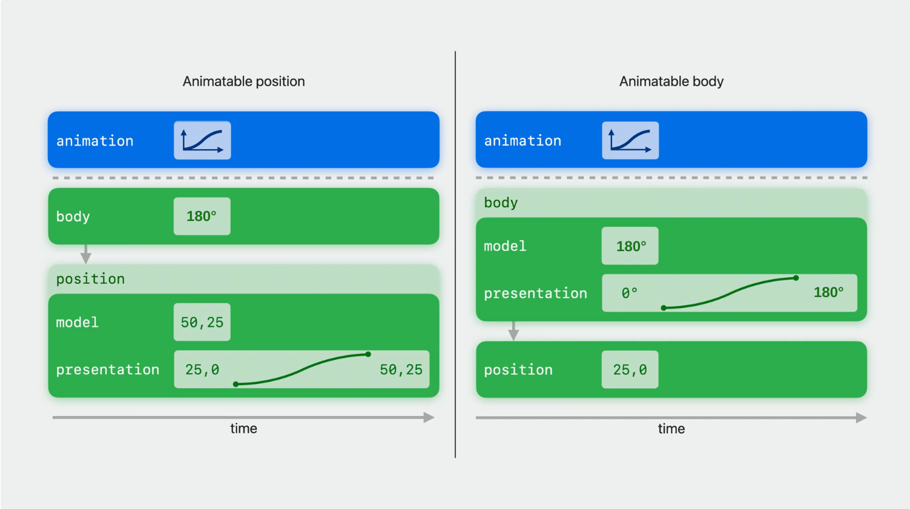

头像是如何沿圆周移动的呢？在自定义版本中，对于动画的每一帧，SwiftUI 都会通过插值来更新偏移角度，再利用偏移角度来重新计算 Avatar 的位置。因为偏移角度沿圆周移动，而且每次移动的角度非常小，这样计算出来的 Avatar 位置也将按圆周运动。

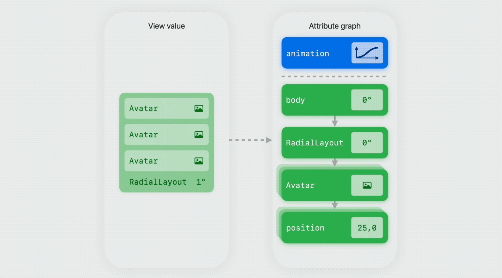

这非常强大，有时候我们不得不使用这种方式来达到期望的动画效果。

但请记住，自定义的可动画属性比内置的更耗时。因为它会在每一帧动画中调用 body 更新数据，所以只有在无法通过内置动画属性实现期望的效果时才使用这个工具。

## 动画上下文 Transaction

你一定注意到了，SwiftUI 会在状态更新时，打开一个事务。事务会持续到当前视图更新结束。事务是一个字典 (`Transaction(plist: [])`)，包含了当次视图刷新时需要的上下文，目前主要用来保存并传递动画过渡函数。SwiftUI 中有两个常见的字典：Environment 和 Preferences。Environment 将数据从父视图传递给子试图，Preferences 将数据从子试图传递给父试图。与它们类似，Transaction 隐式地将数据分别向下和向上传递到视图层次结构中。

多数情况下，Transaction 的数据是沿着属性图逐层向下传播的。当在任意层级使用全局函数 `withAnimation(_:_:)` 或者 `withTransaction(_:_:)` 来关联动画时，SwiftUI 会将其放在属性图的根节点，这样就实现了向上传递的效果。

更新属性图时，如果遇到可动画属性，该属性会检查动画过渡函数是否被设置。如果被设置，它会复制一个副本来插值数据并不断更新它的展示值。由于动画属性依赖事务字典，所以可以通过修改它的值来控制何时、如何将动画应用到你的视图上，SwiftUI 提供了一系列 API 来实现这一点。

SwiftUI 提供了一个 `transaction` 修饰符，可以用来观察事务的传播情况，非常有用，代码如下所示：

```swift
extension View {
  @ViewBuilder func dumpTransaction(_ title: String) -> some View {
    transaction {
      print("🔔 \(title)")
      // dump($0) // for more information
      print("disablesAnimations:", $0.disablesAnimations)
      print("animation:", $0.animation ?? "nil")
      print("\n")
    }
  }
}
```

大家在运行本文的例子时，可以打印事务的信息帮助理解事务的传播情况。

好了，让我们回到前文提到的宠物头像视图的例子。做了两点修改：

1. 将 `selected` 设置成 `Binding` 类型，这样就能传递状态改变给父视图，以触发父视图的动画
2. 添加 `.shadow` 动画，改变阴影的颜色

```swift
struct BindingAvatar: View {
  var pet: Pet
  @Binding var selected: Bool // new

  var body: some View {
    Image(pet.type)
      .shadow(color: selected ? .blue : .yellow, radius: 32) // new
      .scaleEffect(selected ? 1.5: 1.0)
      .animation(.bouncy(duration: 2), value: selected)
      .onTapGesture {
        selected.toggle()
      }
  }
}
```

运行后就会发现，缩放和阴影颜色动画同时生效。这是因为 `.bouncy(duration: 2)` 沿着属性图向下逐级传递给了 `scaleEffect` 和 `shadow`。如果只想给阴影颜色添加动画，那么将 `.animation(.bouncy(duration: 2), value: selected)` 挪到 `.scaleEffect(selected ? 1.5: 1.0)` 和 `.shadow(color: selected ? .blue : .yellow, radius: 32)` 之间就好了。

如果只想给缩放添加动画，而不想给阴影颜色添加动画，那么可以在 `scaleEffect` 之后覆盖动画就可以了，代码如下:

```swift
struct BindingAvatar: View {
  var pet: Pet
  @Binding var selected: Bool

  var body: some View {
    Image(pet.type)
      .shadow(color: selected ? .blue : .yellow, radius: 32)
      .transaction { transaction in
        transaction.animation = nil // 覆盖动画
      }
      .scaleEffect(selected ? 1.5: 1.0)
      .animation(.bouncy(duration: 2), value: selected)
      .onTapGesture {
        selected.toggle()
      }
  }
}
```

同理，可以使用这种方法来屏蔽或者替换一些系统组件 (例如 `NavigationStack`, `.sheet`, `.popover`) 的动画。

这样做有什么问题呢？如下所示，在 `BindingAvatarView` 里使用 `BindingAvatar` 时，由于 `selected` 是绑定的，子视图的修改将引起父视图的刷新，由于 `BindingAvatarView` 并没有显式地添加动画，但是位置的动画效果还是被隐式的传上来了。

```swift
struct BindingAvatarView: View {
  @State private var selected: Bool = false
  var body: some View {
    BindingAvatar(pet: Pet(type: "Dog"), selected: $selected)
      .position(x: selected ? 300 : 100, y: 200)
  }
}
```

可能连 `BindingAvatar` 的使用者都不知道，`position` 被添加了移动效果，这可能不是他原本想要的。

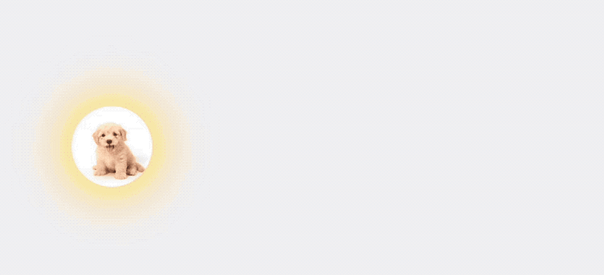

为了解决这种问题，SwiftUI 提供了新的带作用域 APIs 来解决这个问题。如下所示：

```swift
struct BindingAvatar: View {
  var pet: Pet
  @Binding var selected: Bool // new

  var body: some View {
    Image(pet.type)
      .animation(.bouncy(duration: 2), body: {
        $0.shadow(color: selected ? .blue : .yellow, radius: 32)
      })
      .animation(.bouncy, body: {
        $0.scaleEffect(selected ? 1.5: 1.0)
      })
      .onTapGesture {
        selected.toggle()
      }
  }
}
```

带 `body` 参数的 `.animation`，动画过渡函数只在 `body` 内部定义的属性上生效，这时你会发现，`position` 上的动画不见了。相同功能的 API 还有 `.transaction` 版本：

```swift
struct BindingAvatar: View {
  var pet: Pet
  @Binding var selected: Bool // new

  var body: some View {
    Image(pet.type)
      .transaction({
        $0.animation = .bouncy(duration: 2)
      }, body: {
        $0.shadow(color: selected ? .blue : .yellow, radius: 32)
      })
      .transaction({
        $0.animation = .bouncy(duration: 2)
      }, body: {
        $0.scaleEffect(selected ? 1.5: 1.0)
      })
      .onTapGesture {
        selected.toggle()
      }
  }
}
```

实际上，`.animation` 是 `.transaction` 的简化版本，如果能用 `.animation`, 那么就能找到其对应的 `transaction` 版本。

请注意！目前 Beta 版本的 SwiftUI 中，某些可动画组件存在渲染的 Bug，（因为经过测试，使用 `dumpTransaction` 打印的上下文是对的）。如果我们将 `scaleEffect` 替换为 `position`，动画效果就变得不可控了，请大家自行测试。一般来说，解决这类 bug 的思路有：

1. 使用全局函数 `withAnimation`, 虽然性能比不上 `animation`。
2. 在不同的渲染周期来 trigger 不同的动画。

### 给 Transaction 自定义更多上下文信息

如果你之前自定义过 EnvironmentKey 或者 PreferenceKey，那么自定义 TransactionKey 非常类似。只需要创建自己的 TransactionKey 遵循 TransactionKey 协议，然后扩展 Transaction，从它的字典里获取或者修改当前 Key 对应的值。

还是用上面头像的例子。假设有这样一个需求，当用户点击头像时添加动画，当用户点击按钮时，不添加动画。这样我们需要记录一下当前刷新周期中的头像是否被点击，通过自定义 TransactionKey 就能实现，代码如下所示：

```swift
private struct AvatarTappedKey: TransactionKey {
  static let defaultValue = false
}

extension Transaction {
  var avatarTapped: Bool {
    get { self[AvatarTappedKey.self] }
    set { self[AvatarTappedKey.self] = newValue }
  }
}
```

我们定义了一个头像被点击的键值，注意这里需要指定默认值。Transaction 是结构体，每一次视图刷新后，它的值都会被销毁。当下次刷新开始，会被重新创建。这意味着，除非显式设置，否则事务字典中的每个值都会恢复为其键的默认值。

有了这个键值，我们就可以使用它了，代码如下所示:

```swift
struct BindingAvatar: View {
  var pet: Pet
  @Binding var selected: Bool

  var body: some View {
    VStack(spacing: 64) {
      Button("Click me") { selected.toggle() }
      Image(pet.type)
    }
    .shadow(color: selected ? .blue : .yellow, radius: 32)
    .scaleEffect(selected ? 1.5: 1.0)
    .transaction { transaction in
      transaction.animation = transaction.avatarTapped ? .bouncy : .none
    }
    .onTapGesture {
      withTransaction(\.avatarTapped, true) {
        selected.toggle()
      }
    }
  }
}

```

使用 `withTransaction` 可以指定 `avatarTapped` 的值为 true，利用 `transaction` 修饰符来访问它，达到预期的效果。如果点击 `Click me` 按钮，由于没有对其设置值，将使用默认值 false。通过这样将 `avatarTapped` 的值传递给 Transaction，来达到分别设置的目的。

你也许会问，这种变量使用 @State 也能实现，为什么非得用 TransactionKey。那是因为 TransactionKey 可以跨视图层级访问，你可以在根视图上设置值，在子视图上设置值子孙视图上访问，反之亦然。

用这种方法，可以给事务增加多个自定义的上下文，辅助其生成更精准的动画效果。

## 高级动画工具 `New`

到目前为止，我们介绍的动画都是在初始状态和结束状态之间进行插值处理，即两个状态之间的插值。然而，在现实要复杂得多，有许多场景并不仅限于在两个状态之间进行动画处理。

[WWDC23 10157][10157] 给我们介绍了两个用于构建复杂的多步骤动画的新工具：

- 阶段动画
- 关键帧动画。

它们在如下两种情况下特别有效：重复动画，即在视图可见时循环播放；事件驱动的动画，例如在事件发生时触发动画。

### 阶段动画

接下来，首先我将介绍阶段动画。通过使用阶段动画，SwiftUI 能够自动在一组预先计划的状态之间进行转换，从而形成你的动画。

#### 状态可以分阶段

在现实世界中，多于两个状态的动画有很多，比如红绿灯，它就有红、黄、绿三种状态。要实现红绿灯的效果，首先我们需要定义动画的各个阶段。使用枚举是定义这种离散的阶段的一个很好的选择。如下所示：

```swift
enum TrafficSignal: String, CaseIterable, Identifiable {
  case red
  case yellow
  case green
}

var color: Color { ... }
```

在 SwiftUI 新 API 中，我们可以使用阶段动画 `.phaseAnimator` 来实现简单的一个灯的红绿灯效果，如下所示:

```swift
struct PhaseTrafficLightView: View {
  var body: some View {
    HStack(spacing: 24) {
      Circle()
        .frame(width: 100, height: 100)
        .phaseAnimator(TrafficSignal.allCases) { content, value in
          content
            .foregroundStyle(value.color)
        } animation: { phase in
          .easeInOut(duration: 1.0)
        }
    }
  }
}
```

通过 `.phaseAnimator`， SwiftUI 能够自动在状态红、黄和绿之间进行转换，当状态改变时，颜色变化，形成动画。此处使用 `easeInOut` 来做插值，可以根据不同的阶段来设置不同的动画过渡函数。

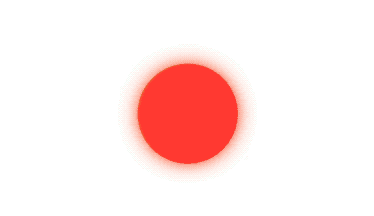

在状态变化时，可以设置多个属性值的改变，比如添加偏移来模拟三个灯的红绿灯效果。如下代码所示：

```swift
struct PhaseThreeTrafficLightView: View {
  @State private var trigger: Int = 0

  var body: some View {
    Circle()
      .frame(width: 100, height: 100)
      .phaseAnimator(TrafficSignal.allCases, trigger: trigger) { content, value in
        content
          .foregroundStyle(value.color)
          .shadow(color: value.color, radius: 8.0)
          .offset(x: value.offset)
      } animation: { phase in
//      .easeInOut(duration: 1.0)
        .myGradian(duration: 1.0) // 自定义的分段动画过渡函数
      }
      .onAppear {
        // continue to update trigger
      }
  }
}
```

当状态改变时，触发预设的偏移改变。这里使用自定义的动画过渡函数，来取消灯的平滑移动。

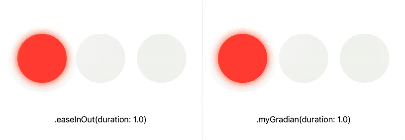

还有一点不同的是，这里使用了带 `trigger` 参数的 `.phaseAnimator` 修饰符。SwiftUI 会监听 `trigger` 的值，只有当值改变时，才会生成动画。不带 `trigger` 参数的 `.phaseAnimator` 修饰符，会在视图出现时，循环播放动画。

#### 动画效果可分阶段

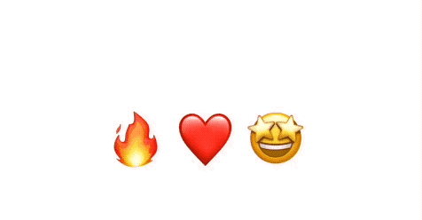

上图是某 App 交互状态的动画效果。当用户点击喜欢按钮时，心形图案由起初的静止状态，然后向上移动，接着放大，随后又回到初始位置，然后不断循环。这样一个复杂的动画，我们也可以人为的将其拆解成多个阶段：初始阶段、移动阶段和缩放阶段。定义成枚举型如下所示：

```swift
enum Phase: CaseIterable {
  case initial
  case move
  case scale

  var verticalOffset: Double {
    switch self {
    case .initial: 0
    case .move, .scale: -64
    }
  }

  var scale: Double {
    switch self {
    case .initial: 1.0
    case .move: 1.1
    case .scale: 1.8
    }
  }
}
```

同时，我们定义了移动偏移量和缩放比例。接着我们使用 `phaseAnimator` 来实现动画效果。如下所示:

```swift
struct ReactionView: View {
  var body: some View {
    Text("❤️")
      .phaseAnimator(Phase.allCases) { content, value in
        content
          .scaleEffect(value.scale)
          .offset(y: value.verticalOffset)
      } animation: { phase in
        switch phase {
        case .initial: .smooth
        case .move: .easeInOut(duration: 0.3)
        case .scale: .spring(duration: 0.3, bounce: 0.7)
        }
      }
  }
}
```

当状态改变时，我们使用了不同的动画过渡函数，来实现不同的动画效果。值得注意的是，状态发生变化的时候，属性 `.scaleEffect` 和 `.offset` 将使用相同的过渡函数。

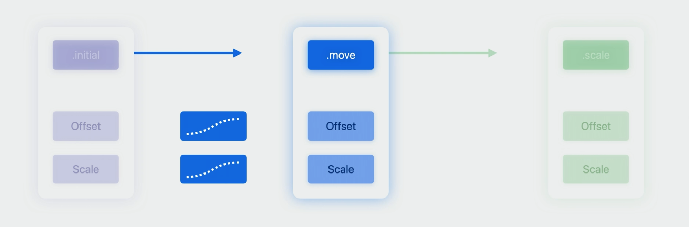

阶段动画定义了多个离散状态。SwiftUI 使用你已经了解的相同动画类型在这些状态之间进行动画处理，这对于可以建模为离散状态的动画非常有效。当发生状态转换时，所有属性将同时进行动画处理。然后，在动画完成后，SwiftUI会动画处理到下一个状态。这个过程会在动画的所有阶段中持续进行。

但是，如果我们想独立地对每个属性进行动画处理怎么办？这就是关键帧（keyframes）动画发挥作用的地方。接下来我们看看如何使用关键帧动画来创建更加复杂的动画效果。

### 关键帧动画

关键帧允许你在动画中的特定时间点定义值。如下图所示：

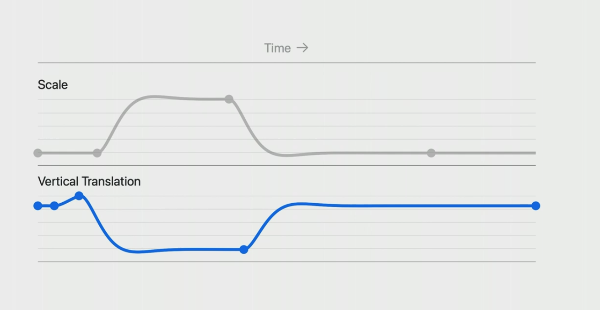

图中的点表示关键帧，可以看到，每个属性的关键帧个数和时间都没有关系，是相互独立的。当动画回放时，SwiftUI 在这些关键帧之间插值计算值，然后我们可以使用这些值来应用修饰符到视图上。

通过定义单独的轨迹，并为每个轨迹指定独立的时间，关键帧允许你同时独立地对多个效果进行动画处理。你可以使用关键帧来驱动 SwiftUI 中的任何修饰符。

在接下来的例子中，和之前阶段动画一样，我们使用关键帧来驱动 `.scaleEffect` 和 `.offset`。第一步，我们先创建一个新的结构体，其中包含将独立进行动画处理的各种属性。关键帧可以对符合 "Animatable" 协议的任何属性值进行动画处理。请注意，几个属性使用了 "Double"，它现在符合 "Animatable"。在动画进行中，SwiftUI 将在每一帧为你提供此类型的值，以便你可以更新视图。

```swift
struct AnimationValues {
  var scale: Double = 1.0
  var verticalOffset: Double = 0.0
}
```

接下来，我们添加 `keyframeAnimator` 修饰符。这个修饰符类似于之前使用的阶段动画器，但接受关键帧。注意，我们提供了自定义的结构体实例作为初始值，我们定义的关键帧将对该值应用动画效果。然后，我们将结构体的每个属性应用到视图上。最后，我们开始定义关键帧。代码如下：

```swift
struct KeyframeAnimationView: View {
  var body: some View {
    Text("❤️")
      .keyframeAnimator(initialValue: AnimationValues()) { content, value in
        content
          .scaleEffect(value.scale)
          .offset(y: value.verticalOffset)
      } keyframes: { _ in
        KeyframeTrack(\.scale) {
          LinearKeyframe(1.0, duration: 0.36)
          SpringKeyframe(1.5, duration: 0.8, spring: .bouncy)
          SpringKeyframe(1.0, spring: .bouncy)
        }

        KeyframeTrack(\.verticalOffset) {
          LinearKeyframe(0.0, duration: 0.1)
          SpringKeyframe(20.0, duration: 0.15, spring: .bouncy)
          CubicKeyframe(-60.0, duration: 0.2)
          MoveKeyframe(0.0)
        }
      }
  }
}
```

正如之前提到的，关键帧允许你为不同的属性构建复杂的动画，为不同的属性指定不同的关键帧。为了实现这一点，使用 `KeyframeTrack` 来为跟踪每个属性的变化轨迹，在动画时，属性按照你提供的轨迹而变化。在这里，我们为缩放属性添加关键帧。我们首先添加一个线性关键帧，重复初始缩放值并保持 0.36 秒。如果你想知道我是如何确定 0.36 的，我是通过尝试不同的值来改变动画的感觉，这是关键帧的一个重要点。创建适合你应用的动画可能需要一些试验。利用 Xcode 的预览功能实时地微调动画是一个很好的方式。接下来，我们添加一个 SpringKeyframe。它使用弹簧函数将值拉向目标值。我们还指定了一个持续时间。对于设置了持续时间的弹簧关键帧，这意味着弹簧函数只会在该持续时间内对值进行动画处理。之后，将开始插值到下一个关键帧。最后，我将添加另一个弹簧关键帧，将缩放动画返回到 1.0。不同类型的关键帧控制值的插值方式。好了，我们已经见过了 `LinearKeyframe` 和`SpringKeyframe`。实际上，有四种不同类型的关键帧:

- `LinearKeyframe`
- `SpringKeyframe`
- `CubicKeyframe`
- `MoveKeyframe`

前三个正如其名称所示，使用不同的动画过渡函数来插值，最后一个 `MoveKeyframe` 立即跳转到一个值，无需插值。每种类型的关键帧都支持自定义，以提供完全的控制，并且可以在动画中混合和匹配不同类型的关键帧。SwiftUI 自动处理关键帧之间的过渡，以确保动画的连续性。如代码所示，我们使用不同类型的关键帧来为 `verticalOffset` 创建动画轨迹。

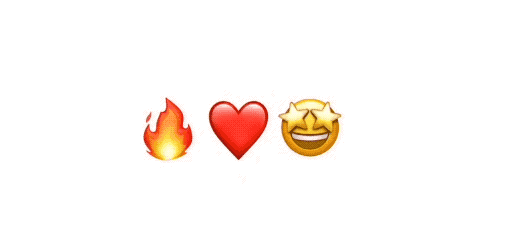

本文旨在展示对关键帧的使用，实际使用时，不一定非得使用到所有类型的关键帧。

关键帧是预定义的动画。当动画发生时，它将按照预定轨迹运行。这意味着它们并不是在需要流畅和交互式的用户界面的情况下替代普通的 SwiftUI 动画。相反，将关键帧视为可以播放的视频剪辑。它们提供了大量的控制，但也有一些权衡。因为你精确指定了动画的进展方式，关键帧动画无法像弹簧动画那样优雅地重新定位，所以通常最好避免在动画进行中更改关键帧。

关键帧对你定义的值进行动画处理，然后你可以使用这些值应用修饰符到视图上。你可以使用单个关键帧轨道来驱动单个修饰符，或者使用不同修饰符的组合。这都取决于你。由于动画是基于你定义的值进行的，因此更新将在每一帧上发生，因此在将关键帧动画应用于视图时，请避免执行任何耗时的操作。

#### KeyframeTimeline

我们已经见过了 `.keyframeAnimator` 修饰符。在修饰符之外，你可以使用 `KeyframeTimeline` 类型来捕获一组关键帧和。你可以使用一个初始值和定义动画的关键帧轨道来初始化这个类型，就像使用视图修饰符一样。

使用 `KeyframeTimeline` 提供的 API，你可以获得持续时间，该持续时间等于最长轨道的持续时间。你可以计算动画范围内任何时间点的值。这使得使用 Swift Charts 可视化关键帧变得容易，之前展示过的曲线可视化就是使用它实现的。这也意味着你可以按照自己的方式使用关键帧定义的曲线，或者将关键帧与其他 API 进行创造性结合，例如使用 `GeometryProxy` 根据滚动位置调整关键帧驱动的效果，或者使用 `TimelineView` 根据时间进行更新。

```swift
let keyframes = KeyframeTimeline(initialValue: AnimationValues()) {
  KeyframeTrack(\.scale) {
    LinearKeyframe(1.0, duration: 0.36)
    SpringKeyframe(1.5, duration: 0.8, spring: .bouncy)
    SpringKeyframe(1.0, spring: .bouncy)
  }

  KeyframeTrack(\.verticalOffset) {
    LinearKeyframe(0.0, duration: 0.1)
    SpringKeyframe(20.0, duration: 0.15, spring: .bouncy)
    CubicKeyframe(-60.0, duration: 0.2)
    MoveKeyframe(0.0)
  }
}

// 获得持续时间，该持续时间等于最长轨道的持续时间
let duration: TimeInterval = keyframes.duration
// 计算动画范围内任何时间点的值
let value = keyframes.value(time: 1.2)
```

只要有点想象力，它就能被用到任何地方。如果你不确定何时使用它，那也没关系，这是一个高级工具，大多数开发人员都希望坚持使用视图修饰符。但它作为一个基础模块，我很期待看到你如何创造性地将其整合到你的应用程序中。

请记住：使用阶段动画 `.phaseAnimator` 处理链式动画。使用关键帧动画 `.keyframeAnimator` 处理更复杂的动画。

## 总结

本文首先介绍了 SwiftUI 实现动画的基本方式，接着详细介绍了支撑 SwiftUI 动画效果的三个核心要素：动画过渡函数 Animation、可动画属性 Animatable 和动画上下文 Transaction。同时，结合 SwiftUI 视图渲染机制，帮助读者更好地理解和运用 SwiftUI 的动画功能。最后介绍了 SwiftUI 新引入的两个高级动画功能：阶段动画和关键帧动画。动画世界充满了令人兴奋的内容，希望这篇文章能帮你的应用更上一层楼。

### 对 SwiftUI 动画的一些建议

- 优先考虑使用 `.animation` 代替 `withAnimation`
- 优先考虑使用带作用域的 API
- 尽量不在一次刷新中修改过多的可动画属性
- 非必要不自定义可动画属性
- 非必要不自定义向量
- 属性值刷新顺序从外到内
- 可以自定义动画上下文
- 可以屏蔽默认组件的转场动画
- 可以捕获动画结束事件了
- 动画过渡函数 Animation 决定了如何做插值的问题
- 可动画属性 Animatable 获取插值，并将其传递给视图，解决谁能动的问题
- 动画上下文 Transaction，携带足够的信息，在视图层级上传播动画上下文
- 阶段动画处理链式动画，在同一个阶段，每个属性值使用相同的动画过渡函数
- 关键帧动画处理更复杂的动画，更灵活，每个属性值使用不同的动画过渡函数

## 参考资料

- [WWDC23 10156][10156]
- [WWDC23 10157][10157]
- [WWDC23 10158][10158]
- [WWDC22 10056][wwdc2022-10056]
- [Advanced SwiftUI Animations][swiftui-lab]
- [掌握 Transaction，实现 SwiftUI 动画的精准控制][mastering-transaction]
- [SwiftUI 的动画机制][the_animation_mechanism_of_swiftUI]

[10156]: https://developer.apple.com/videos/play/wwdc2023/10156
[10157]: https://developer.apple.com/videos/play/wwdc2023/10157
[10158]: https://developer.apple.com/videos/play/wwdc2023/10158
[wwdc2022-10056]: https://developer.apple.com/videos/play/wwdc2022/10056/
[mastering-transaction]: https://www.fatbobman.com/posts/mastering-transaction/
[the_animation_mechanism_of_swiftUI]: https://www.fatbobman.com/posts/the_animation_mechanism_of_swiftUI/
[swiftui-lab]: https://swiftui-lab.com/category/animations/
