---

session_ids: [10159]

---

# WWDC23 10159 - Beyond scroll views

> 摘要：学习如何使用 SwiftUI 的最新 API，将滚动视图提升到一个全新的水平。本文会展示一些前所未有的自定义滚动视图的方法，包括如何处理安全区域和滚动视图边距之间的关系、如何与滚动视图的内容偏移进行交互、如何通过滚动来为内容添加炫酷的效果。

本文基于 [Session 10159](https://developer.apple.com/videos/play/wwdc2023/10159) 梳理。


为了在有限的设备屏幕上展现完整的应用功能，我们通常需要依赖滚动控件。而 SwiftUI 通过提供多种组件（如 `List` 和 `Table` 等）来轻松实现滚动嵌入应用程序中。本文将重点介绍 `ScrollView` 组件，使我们可以更加深入地了解其特性和应用场景。


## ScrollView 基本介绍

### Lazy Stack

ScrollView 是一个可以让其包含的内容进行滚动的构建块，参数包含：

- `axes`：滚动方向；
- `content`：滚动内容；当内容超出 ScrollView 的大小时，其中部分内容将被裁剪，需要向上或向下滑动才能查看。ScrollView 可确保内容放置在安全区域内，通过将安全区域解析为边距来设置其内容。
  
默认情况下，ScrollView 会立即加载并获得其所有子 view 的信息，我们可以使用 `lazy stack` 来`按需加载和渲染其子视图`，从而在加载大量子 view 时提供显著的`性能提升`。

如图，例如使用 `VStack` 时，控制台一次把全部的 Item init 打印出来。而使用 `LazyVStack` 时，控制台先是打印了第一屏出现的 Item init，继续滑动时再打印屏幕显示到的 Item。说明了 lazy stack 是按需初始化子视图的，从而对性能提升优化。此特性从 WWDC20 提出的，详细可以了解[官方的对比说明文档](https://developer.apple.com/documentation/swiftui/creating-performant-scrollable-stacks)。

*VStack：*


*LazyVStack：*

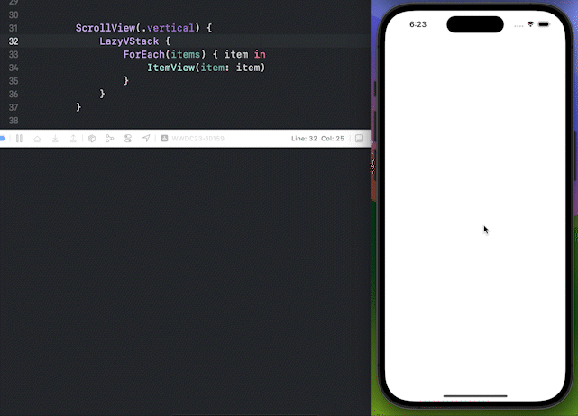

### Content Offset

ScrollView 滚动到的确切位置称为内容偏移量（`Content Offset`）。SwiftUI 已经提供了 `ScrollViewReader` 作为控制内容偏移量的方式。今年，SwiftUI 还将推出更多方法来影响和响应由 ScrollView 管理的内容偏移量。

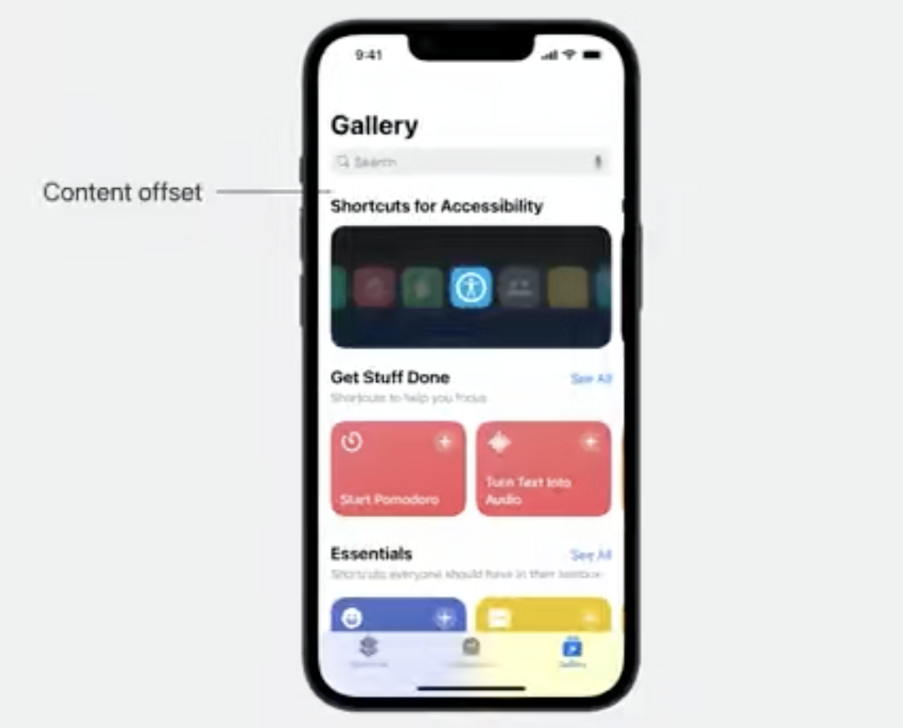

我们将分为以下三点来讲述：

1. `边距和安全区域`：如何影响边距，及边距与安全区域的关系；
2. `目标和位置`：通过滚动目标和滚动位置，来管理 contentOffset；
3. `滚动过渡`：通过滚动转换，为应用程序添加一些真正的魅力。

## 一、边距和安全区域

本文的主要范例使用 Session 提供的示例代码。这是一个可以水平滑动的 header，我们来一步步完善它的效果。

开始时，它由一个水平的 ScrollView 包含一个 lazy stack。

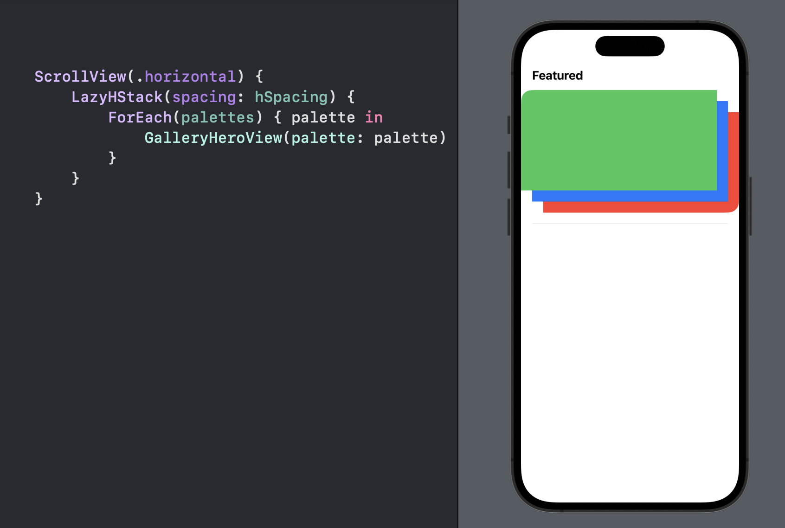

首先，我们来增加一些边距来使该视图更美观。

### 1. padding

有人可能第一时间会想到在 ScrollView 上添加填充修饰符 `padding`。但是请注意，这样会导致滚动时内容被裁剪。

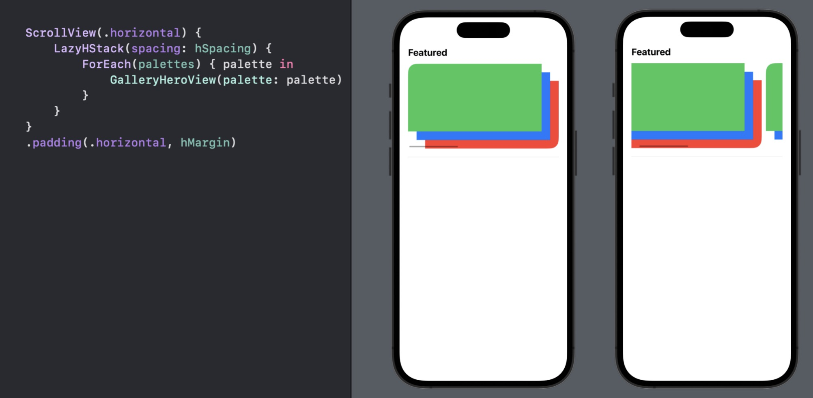

### 2. safeAreaPadding

如上图的裁剪问题，一般来说我们不想缩进 ScrollView 本身宽度，而是想扩展 ScrollView 的内容边距。我们可以使用新的安全区域填充修饰符 `safeAreaPadding` 来实现这一点。

> **safeAreaPadding** 类似于 `padding` 修饰符，但它不是填充内容，而是将填充添加到安全区域。

现在如图 ScrollView 没有被裁剪，而是扩展到了整个宽度（*你可以通过滚动时的左边缘看到对比上面 padding 效果图的区别*）。

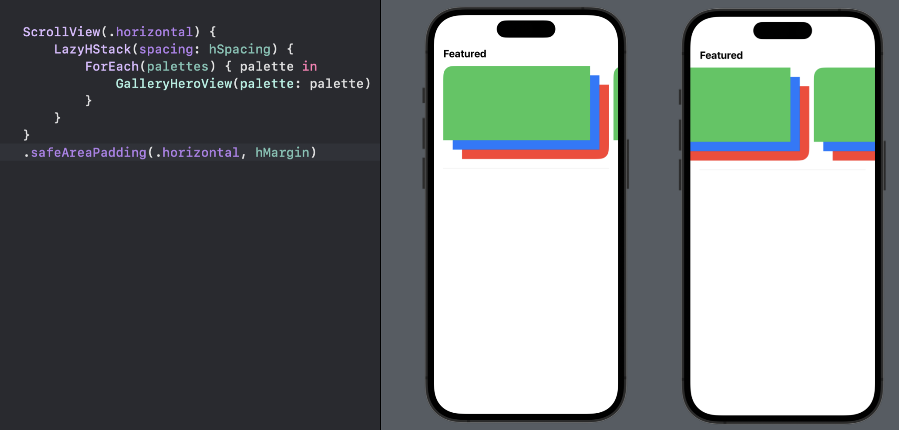

而且它使下一个滚动项在屏幕的右边缘显示了出来，整体效果比 padding 好多啦。


### 3. contentMargins

根据上面两个修饰符的体验，我们了解了 `填充` 和 `安全区域填充` 的区别。我们接着看安全区域与 ScrollView 的关系。

> **安全区域** 通常由应用程序运行的设备决定，也可以来自 API，例如上面的安全区域填充 `safeAreaPadding` 或安全区域插入 `safeAreaInset` 修饰符。

ScrollView 会将安全区域解析为应用于其内容的边距，包括：

- 我们添加的内容；
- ScrollView 负责的其他内容（例如滚动指示器）。

但是如下代码，这两个 API 的使用都无法为不同类型的内容配置灵活的内嵌布局。

```swift
// 1
.safeAreaPadding(.vertical, 50.0)
// 2
.safeAreaInset(edge: .top) {
    RoundedRectangle(cornerRadius: 10)
        .fill(Color.red)
        .padding(.horizontal, 10)
        .frame(height: 50)
        .contentMargins (
            .vertical, 50.0,
            for: .scrollContent
        )
}
```

但是，新的 `contentMargins` 允许我们单独缩进 ScrollView 的内容和滚动指示器，或将指示器与内容分别缩进，从而实现对它们的自由控制。以下三张图展示了 contentMargins 参数的使用情况（*注意查看右上指示器的位置对比*）：

使用 1： 整体顶部加 50 高度：
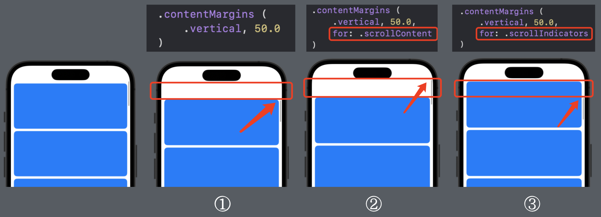

使用 2： 给滚动的内容顶部加 50 高度：
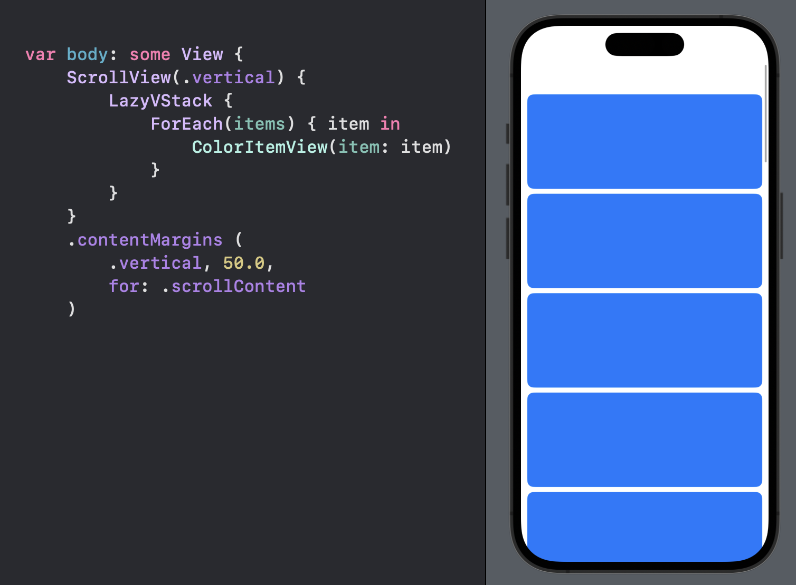

使用 3： 给滚动指示器顶部加 50 高度：
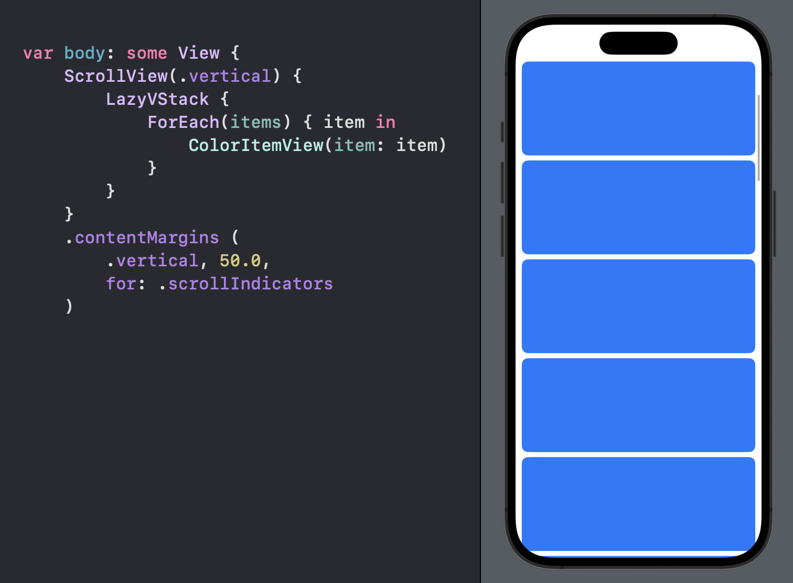

最后，回到我们例子中，使用 contentMargin 更新安全区域：

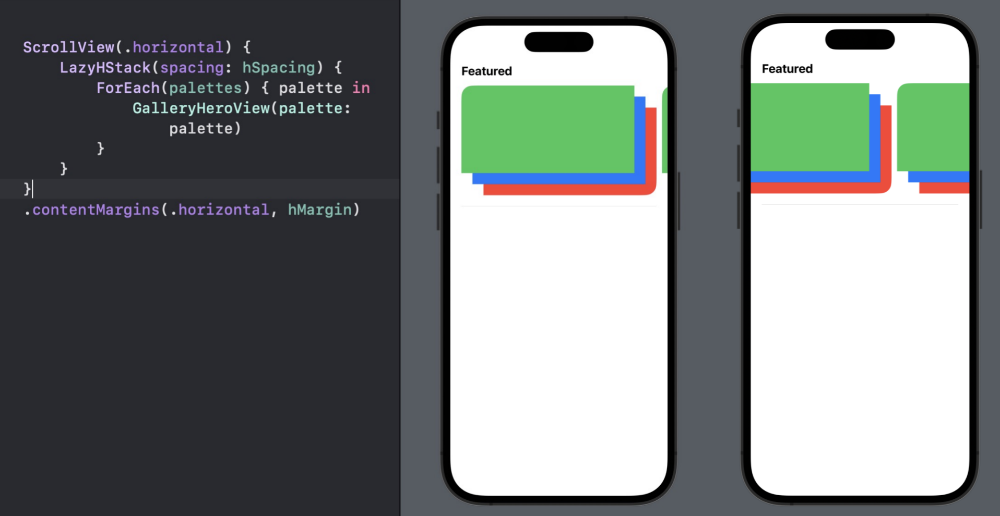


## 二、目标和位置

我们已经对视图进行了一些边距调整，接下来我们来看看控制 ScrollView 在松开手指后滚动停留的位置。默认情况下， ScrollView 会使用标准的减速率和滚动速度来计算应该停止的目标内容偏移量（`contentOffset`），但是它不考虑 ScrollView 大小或其内容等因素，有时候这些因素非常重要。

### 1. scrollTargetBehavior

在 SwiftUI 中，我们可以使用 `scrollTargetBehavior` 修饰符来改变 ScrollView 计算 contentOffset 的方式，它包含一个参数：

- `behavior`：一个遵循 `ScrollTargetBehavior` 协议的类型。

我们来看看两个现有的滚动目标行为。

**1. paging**

如下图，我们指定了分页行为 `paging`，现在 ScrollView 每次只滑动一页。这种分页行为是特殊的，它具有自定义的减速率并根据 ScrollView 本身的容器大小选择滚动位置。

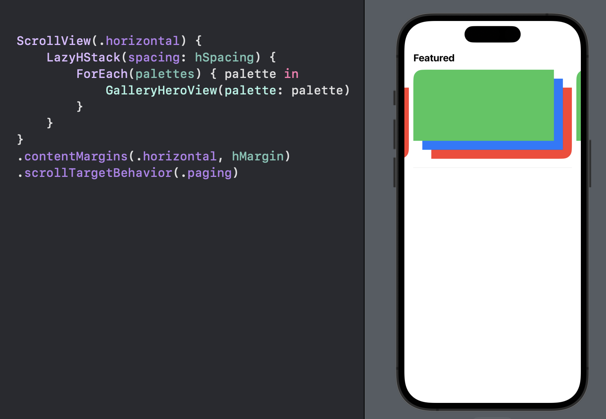

现在，在 iOS 上效果很好，但在 iPadOS 的大屏幕上可能会有一些问题：

我们按照 `paging` 滚动的方式呈现，每一页 iPad 可以容纳两个 Hero 视图，因此每次滚动都是两个视图。按照左侧为基准，每次滚动的展示滚则是 1 3 5 ... 而 2 4 6 ... 无法滚动到左侧位置。

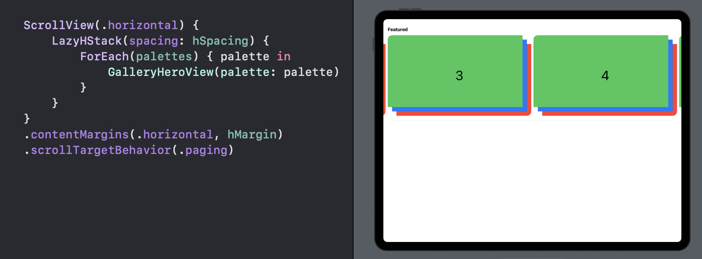

**2. viewAligned**

我们更希望将其对齐到单个视图，而不是对齐到 ScrollView 的容器大小。

首先，`viewAligned` 对齐行为可以将 ScrollView 对齐到视图上。因此 ScrollView 需要知道哪些视图应该被考虑对齐，这些视图被称为滚动目标。

然后，`scrollTargetLayout` 修饰符可以指定哪些视图成为滚动目标。

在如下例子中，我们指定对齐行为为 viewAligned ；使用 scrollTargetLayout 让 lazy stack 中的每个 Hero 视图都被视为滚动目标（也可以将单个视图标记为目标）。*（当使用 lazy stack 时，使用 scrollTargetLayout 非常重要，即使可见区域之外的视图尚未创建，布局也知道将要创建哪些视图，因此它可以确保 ScrollView 滚动到正确的位置）*。

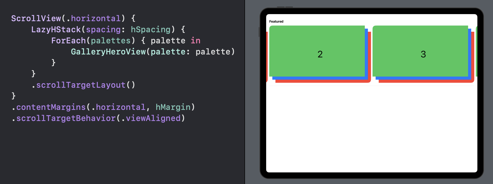

如图，现在每次滚动一个 Hero 视图，2 4 6 ... 也可以滚动到左边位置了。这样它在 iPad 上交互起来好多了。


#### ScrollTargetBehavior 协议

paging 和 viewAligned 的对齐行为是基于 `ScrollTargetBehavior` 协议构建的。SwiftUI 提供了这些常用行为，并且允许我们遵循此协议并实现自己的自定义行为。只需要实现一个方法：

- **updateTarget()**：更新目标。在计算滚动应该结束的位置时，SwiftUI 会调用此方法，并在其他情况下也会进行调用（比如当 ScrollView 的大小发生变化时）。

例如以下代码，如果目标接近 ScrollView 的顶部，且向上滑动了滚动条，则会优先滚动到 ScrollView 的准确顶部，从而修改提供的目标。这会决定 ScrollView 选择不同的 contentOffset 作为滚动的终点。

```swift
struct GalleryScrollTargetBehavior: ScrollTargetBehavior {
    func updateTarget(_ target: inout ScrollTarget, context: TargetContext) {
        if target.rect.minY < (context.containerSize.height / 3.0),
           context.velocity.dy < 0.0
        {
            target.rect.origin.y = 0.0
        }
    }
}
```

### 2. containerRelativeFrame

在前面的图中我们有看到，本例的 Hero 视图在 iOS 竖屏上展示一个，而在 iPad 上是展示两个。以前，要实现这一点可能需要使用 `GeometryReader` 读取 ScrollView 的宽度后计算。而现在，我们可以使用 `containerRelativeFrame` 修饰符很方便的实现。我们来体验下这个过程吧。

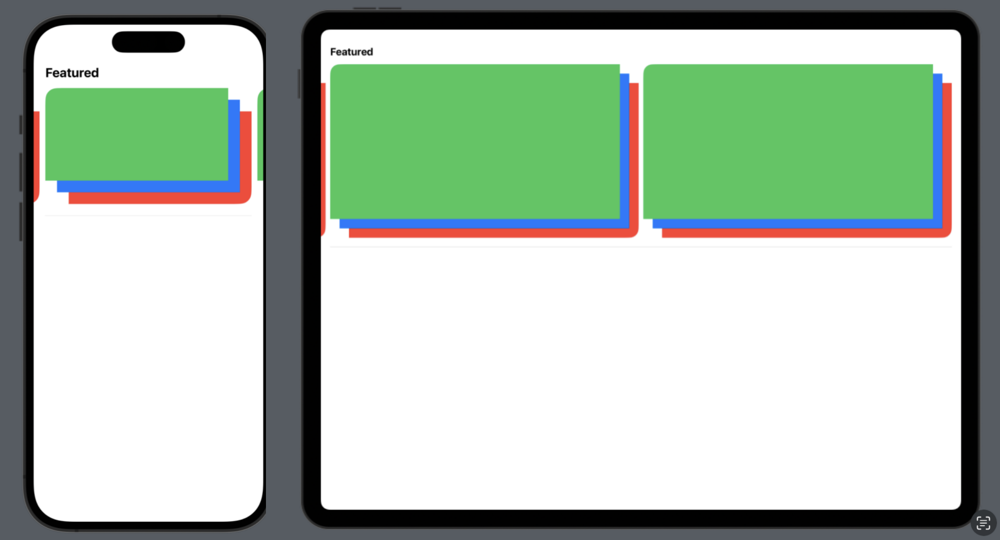

首先，我们把 UI 简化为每个 Hero 是一个蓝色矩形。 把代码简化为只添加了一个固定高度的修饰符。它在设备上的宽度展示如下：

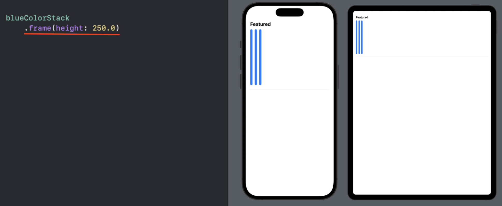

然后，我们在视图中添加上 `containerRelativeFrame` 修饰符，并指定了参数为水平轴。它使得该视图只占用其容器的宽度，此时，视图大小会自动适应容器的宽度。

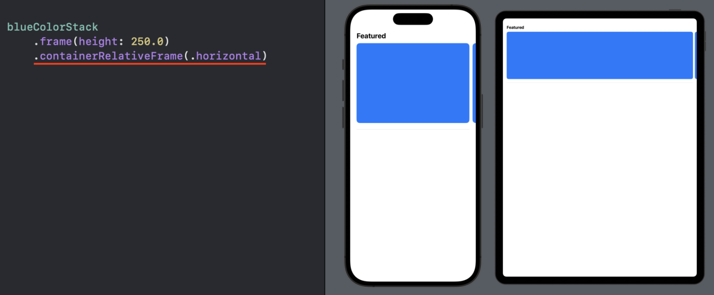

除了 `axes` 方向之外，`containerRelativeFrame` 还可以通过 `count` 和 `spacing` 创建类似网格布局的视图。

这里我们需要在 iOS 上展示一个，而在 iPad 上展示两个，我们可以根据 `horizontalSizeClass` 判断个数。而且 horizontalSizeClass 现在适用于所有平台，我们不需要判断操作系统。

最后，我们使高度与宽度成比例，去掉硬编码固定高度，使用 `aspectRatio` 修饰符来实现。效果展示如下：

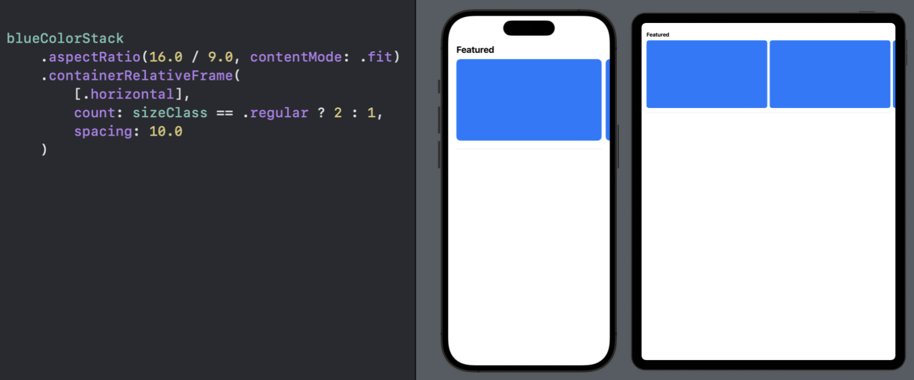

至此，我们的布局和滚动行为都完成了！


### 3. scrollPosition

接下来，我们来观察当 ScrollView 滑动的时候，它的滚动指示器很明显不美观，我们来把它移除掉。

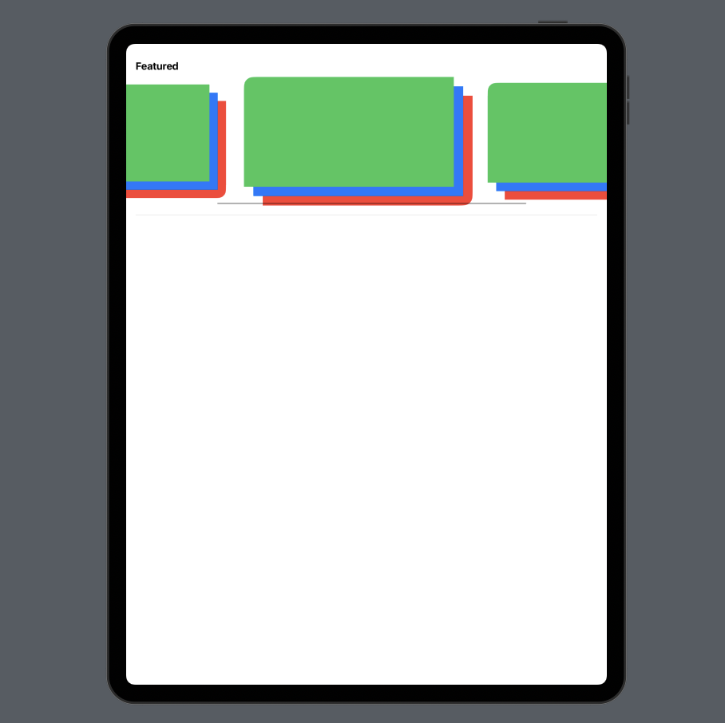

#### scrollIndicators

我们可以使用现有的 `scrollIndicators` 修饰符来实现移除滚动指示器。如图，现在滑动时它已经隐藏了：

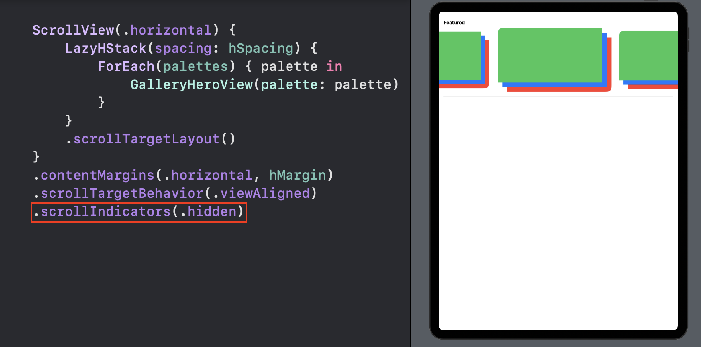

在 Mac 上这里的 `hidden` 可能无效，滚动指示器可能仍然会显示。因为考虑到使用鼠标时，如果没有滚动指示器可能会使滚动变得困难或不可能。所以 `scrollIndicators` 的默认行为是在使用更灵活的输入设备（如触摸板）时隐藏指示器，但在连接鼠标时允许指示器显示（注意 Apple 妙控鼠标属于灵活设备，试试其他鼠标可能不属于灵活设备）。

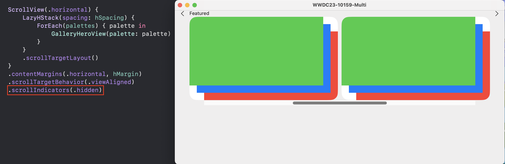

我们可以修改 scrollIndicators 的参数为 `never` ，这样就达到始终隐藏指示器，而不会考虑输入设备。如图：

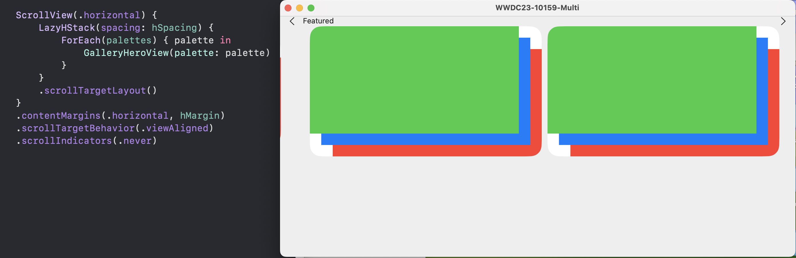

#### scrollPosition

现在 Mac 上的滚动指示器隐藏了，我们提供一个替代方案，使用户更加方便直观的交互。例如添加两个按钮，让用户可以点击上一个或下一个来实现视图滚动，UI 改动如下：

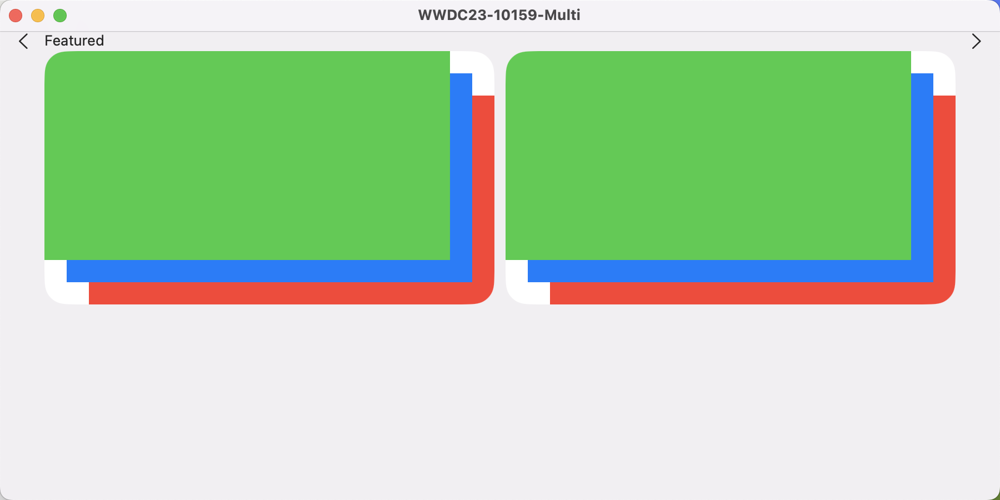

接下来，我们看看如何在点击这两个按钮时控制 ScrollView 滑动到适当位置。在 SwiftUI 的早期版本中，我们可以使用  `ScrollViewReader` 来实现。简化代码如下：

```swift
@Binding var mainID: Palette.ID?
@State private var scrollOffset: CGFloat = 0

GeometryReader { geometryProxy in
    VStack {
        GalleryHeroHeader(palettes: palettes, mainID: $mainID)
        ScrollViewReader { scrollProxy in
            ScrollView(.horizontal) {
                HStack(spacing: hSpacing) {
                    ForEach(palettes) { palette in
                        GalleryHeroView(palette: palette)
                            .id(palette.id) // 使用 id 属性标识视图
                    }
                }
                .background(
                    GeometryReader { proxy -> Color in
                        // 接收 contentOffset 值
                        self.scrollOffset = proxy.frame(in: .global).minX
                    }
                )
            }
            ...
            // 监听id改变: ①左右按钮点击时 ②手势滑动ScrollView停止时
            .onChange(of: mainID) { _, _ in
                withAnimation {
                    // 使用 id 滚动到被标识的视图
                    scrollProxy.scrollTo(mainID, anchor: .leading) 
                }
            }
            .onChange(of: scrollOffset) { _, newValue in
                // 停止滚动时,根据 contentOffset 计算对应的 id
                mainID = palettes[calIndex].id
            }
        }
    }
}

// in GalleryHeroHeader
GalleryPaddle(edge: .leading) {
    mainID = calPreviousID()
}
```

尽管已经简化了很多逻辑，代码还是很复杂，而且重点还要处理两种改变 mainID 的方式冲突 Bug。

而在最新的 SwiftUI 中，新增了 `scrollPosition` 修饰符，它绑定了与包装标识符的状态，我们可以将其传递给 ScrollView，然后 ScrollView 将从中读取并传递给 GalleryHeroHeader。在 GalleryHeroHeader 的 paddles 中，我们可以在按钮点击时写入绑定。写入绑定后，ScrollView 会滚动到具有该 mainID 的视图。而且直接滑动 ScrollView 时它会自动更新 mainID，没有两种方式的冲突问题。简化代码如下：

```swift
@Binding var mainID: Palette.ID?

VStack {
    GalleryHeroHeader(palettes: palettes, mainID: $mainID)
    ScrollView(.horizontal) { ... }
        .scrollPosition(id: $mainID)
}

// in GalleryHeroHeader
GalleryPaddle(edge: .leading) {
    mainID = calPreviousID()
}
```

如上核心代码真的很简单。`scrollPosition` 类似于视图对齐的 `scrollTargetBehavior`，都使用 `scrollTargetLayout` 来确定哪个视图要查找其标识值。

最后，scrollPosition 可以使我们知道当前滚动视图的身份。因此，我们可以在标题视图中添加一个文本，显示当前滚动的 Hero 信息，使滚动效果更加直观。

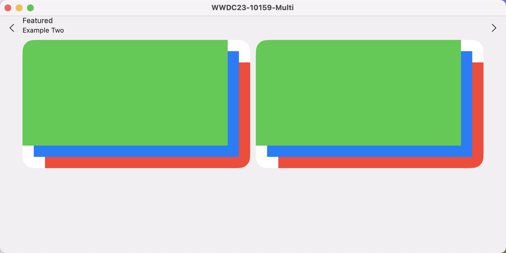

绑定会随着 ScrollView 最左边的视图更改而自动更新。现在，我们可以通过鼠标用户轻松浏览了。


## 三、滚动过渡

最后我们还有一个小细节需要完善，给滚动的视图加一点过渡动画，使滑动时更明显的体验到当前滚动的目标视图。我们可以根据 ScrollView 中视图的位置来改变它。

### scrollTransitions

在 SwiftUI 中，新增了 `scrollTransitions` 修饰符，可以轻松实现这个功能。

> scrollTransition 很像普通的过渡效果，描述了一个视图在出现或消失时应该经历的变化：
>
> - 当一个视图出现后，它处于 `identity` 阶段，此时不应应用自定义设置；
> - ScrollTransition 描述的是与过渡效果类似的一组变化，将其作为视图进入 ScrollView 的可见区域然后离开可见区域时应用。

让我们在例子中体验下，当视图接近 ScrollView 的边缘时，把它的大小能够略微缩小。

我们添加 `scrollTransition` 修饰符，它需要 `content` 和 `phase`，使我们可以基于 phase 指定内容的视觉变化。在这里，我们指定当视图不处于其 identity 时，缩小比例。

*之前：*
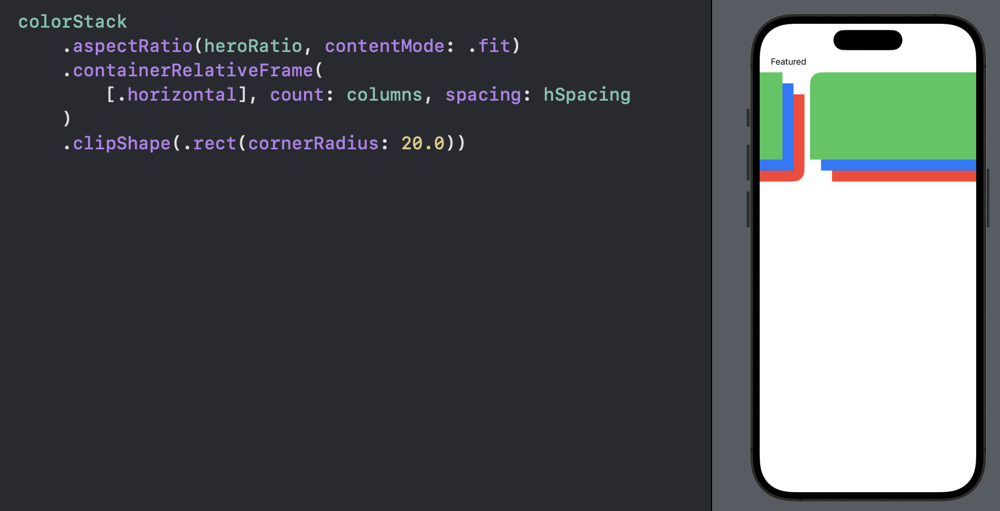

*之后：*
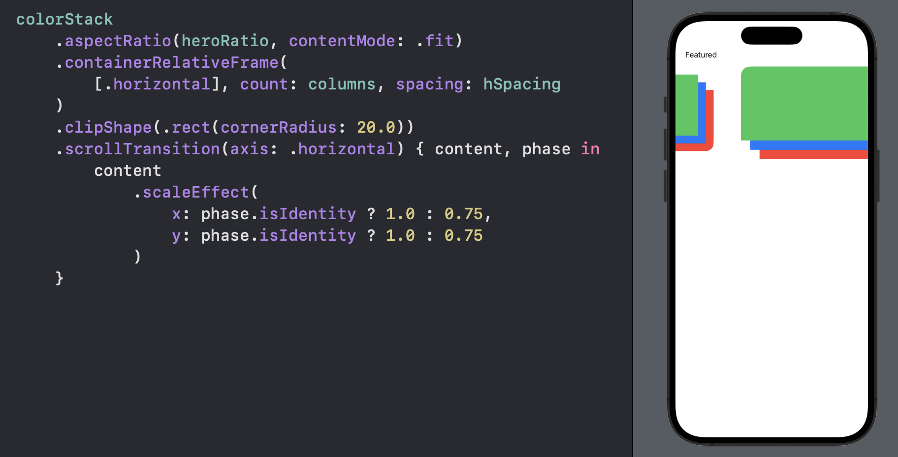


#### VisualEffect 协议

scrollTransitions 使用了一个名为 `VisualEffect` 的新协议。

> **VisualEffect** 提供了一组用于视图内容的自定义选项，可以安全地作为布局函数使用。

例如上面动画使用的缩放 `scaleEffect`、ScrollView 的 `contentOffset`、旋转 `rotationEffect` 等，自定义这些效果就像使用视图修饰符一样简单。

但是并非所有视图修饰符都可以安全地用于 scrollTransition 中。例如，不支持自定义字体并且直接报错。任何影响 ScrollView 整体内容大小的修饰符都不能在 scrollTransition 修饰符中使用。

```swift
.scrollTransition(axis: .horizontal) { content, phase in
    content
        .scaleEffect(
            x: phase.isIdentity ? 1.0 : 0.75,
            y: phase.isIdentity ? 1.0 : 0.75)
        .rotationEffect(
            .degrees(phase.isIdentity ? 0.0 : 90.0)
        )
        .offset(
            x: phase.isIdentity ? 0.0 : 20.0,
            y: phase.isIdentity ? 0.0 : 20.0
        )
//        .font(phase.isIdentity ? .body : .title2) // Value of type 'some VisualEffect' has no member 'font'
}
```

## 总结

最后我们来回顾下本文的所有内容：

**一、边距和安全区域：**

- 理解安全区域和 `contentMargin` 之间的区别，以及它们与 ScrollView 的关系。

**二、目标和位置：**

- 使用 paging 和 viewAligned 的 `scrollTargetBehaviors` 来影响 ScrollView 的行为。以及如何编写符合 ScrollTargetBehavior 协议的自定义实现；

- 使用 `containerRelativeFrame` 修饰符相对于其容器创建布局的轻松程度；

- 使用 `scrollPosition` 修饰符连接到 ScrollView 的状态，使我们能够以编程方式滚动并得知当前滚动的视图是哪一个。

**三、滚动过渡：**

- 使用 `scrollTransition` 根据 ScrollView 的内容偏移创建了视觉效果。

我们看到这些新增的 API 可以使我们非常轻松的实现开发中的常见功能。但是在这之前，例如我们在 scrollPosition 部分给出的旧版本使用 ScrollViewReader 实现功能的代码对比，就可以了解到有多复杂和痛苦。总之，SwiftUI 正在一步步完善，我们一起多多关注这些新增的优秀 API 吧。
