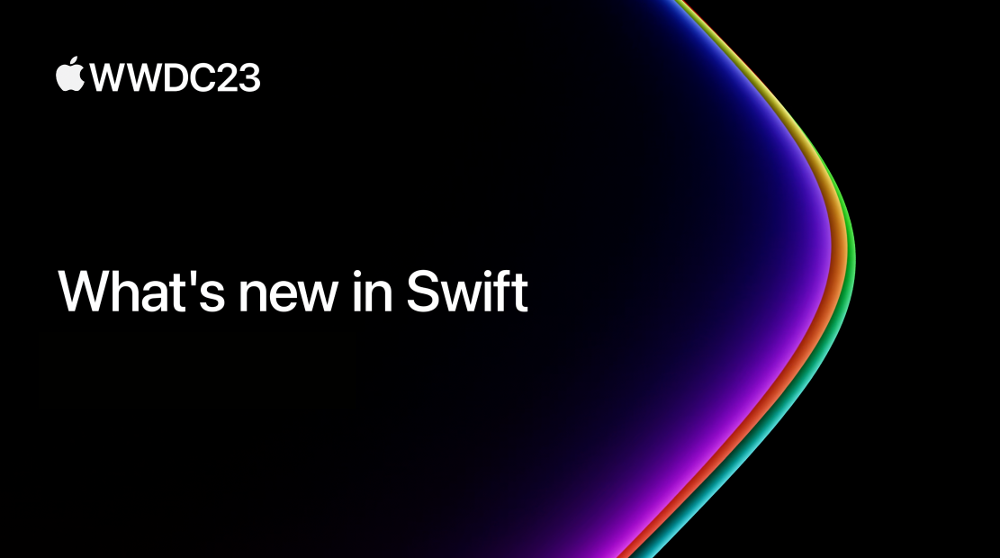

## 个人介绍

>> 冬瓜：iOS 开发，个人博客 https://www.desgard.com/。

## 审核介绍

>> Sample：

## 不超过 120 个字的文章简介

>> 这个 Session 涉及了 Swift 的新语法特性和 Swift Macro 的话题，这些功能对于编写更加灵活和健壮的 API 以及高质量代码起到了很大的帮助。此外，也深入探讨了在受限环境下使用 Swift 的优势，并讨论了 Swift 在适配多种平台设备和语言方面的灵活性。

## 公众号/小专栏图文头图

