---

session_ids: [10167]

---

# WWDC23 10167 - 初见 Swift 宏

> 本文基于 [Session 10167](https://developer.apple.com/videos/play/wwdc2023/10167/) 梳理。原 session 中详细提到了如何实现一个宏，以及错误诊断、测试方面的内容，但限于篇幅，本文不会涉及这些，而将偏重于介绍 Swift 宏的基础概念。如果你希望解如何编写、实现宏，可以阅读内参的这篇文章（链接待补充）。

## 什么是（Swift）宏

Swift 宏是 Swift 5.9 中引入的新特性，而在具体讲 Swift 宏的内容之前，先来一起来回顾下什么宏。

宏是一种预处理指令，用于在源码中定义可重用的代码，是为了解决重复代码、提高代码可复用性和增强程序可读性而诞生的，属于静态元编程（static metaprogramming，指在编译期间对代码进行转换和生成的过程）的一种。有接触过 Objective-C 或者 C 类语言的同学肯定对宏不陌生，虽然用起来挺欢快的，但对于宏的编写和阅读来说是个不小的挑战，调试就更别提了，出了问题基本抓瞎。下面是 Objective-C 中最常用的宏定义 `@weakify` 和 `@strongify`:

```objc
#ifndef keywordify
#if DEBUG
#define keywordify autoreleasepool {}
#else
#define keywordify try {} @catch (...) {}
#endif
#endif

#ifndef weakify
#if __has_feature(objc_arc)
#define weakify(object) keywordify __weak __typeof__(object) object##_##weak_ = object;
#else
#define weakify(object) keywordify __block __typeof__(object) object##_##block_ = object;
#endif
#endif

#ifndef strongify
#if __has_feature(objc_arc)
#define strongify(object) keywordify __typeof__(object) object = object##_##weak_;
#else
#define strongify(object) keywordify __typeof__(object) object = object##_##block_;
#endif
#endif
```

其实 Swift 中已经有不少类似的特性是在编译期间对代码进行转换和生成从而减少重复代码了，例如遵循 [CaseIterable](https://developer.apple.com/documentation/swift/caseiterable) 协议的枚举类型自动生成属性，遵循协议 [Codable](https://developer.apple.com/documentation/swift/codable) 协议自动生成 encode decode 方法。

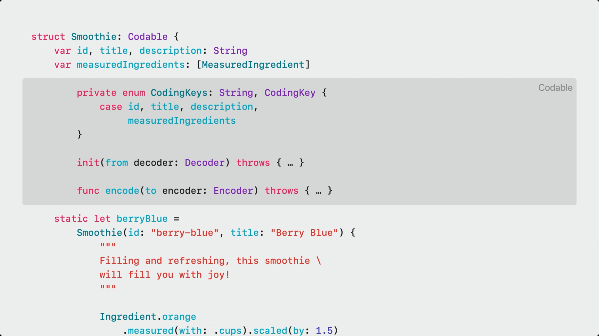

Swift 5.9 更进一步，让开发者能够自行编写宏及其实现，减少模板代码，同时，有了编译器的加持，也很好解决了上述开发和调试体验差的问题。

### Swift 宏示例

介绍一下我们此次用于展示的其中一个宏 `DictionaryStorage`，它能将任意一个 struct 变为类似 Dictionary 的存储类型，对其属性访问可以直接通过 Dictionary 的 Key-Value 进行操作。

```swift
@DictionaryStorage
struct Person {
    var name: String
    var height: Measurement<UnitLength>

    @DictionaryStorage(key: "birth_date")
    var birthDate: Date?
}
```

而这是其展开的形态

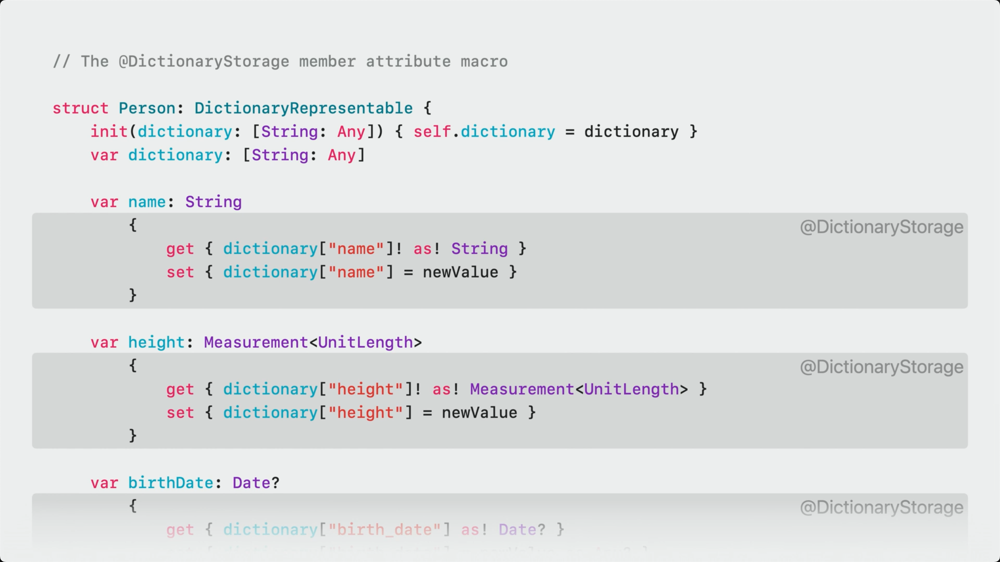


## Swift 宏的设计原则

了解了什么是 Swift 宏，让我们一起看看苹果在设计宏这个新特性时所遵循的 4 个原则：

1. 区分使用场景

    为区分不同的使用场景，苹果将宏分成两个大类：独立宏（freestanding macro） 和关联宏（attached macro）：

    **独立宏**可以在代码中独立存在，用于替换一个表达式或者是类型声明，使用这类宏时需以「#」号开头，例如：

    ```swift
    return #unwrap(icon, message:"should be in the app bundle")
    ```

    **关联宏**就如它的名字描述的那样，必须和另一个类型或者是声明关联，使用这类宏时需以「@」号开头，例如：

    ```swift
    @AddCompletionHandler
    func sendRequest() async throws -> Response
    ```

2. 类型完备，有合法性校验

    宏的实现依赖于 SwiftSyntax（用于解析和结构化 Swift 源码的工具），而它能够很好约束宏，在出现使用错误时，给出精准的编译警告/报错。

    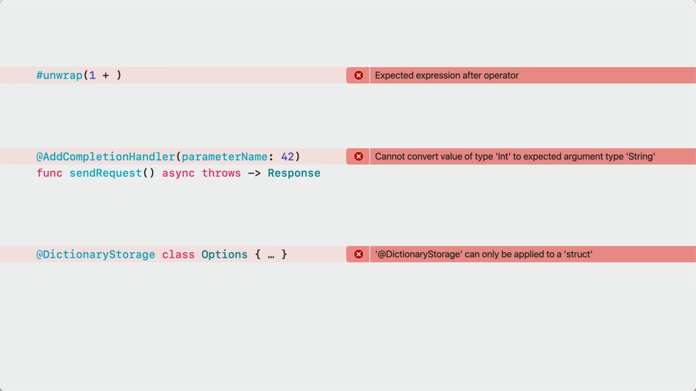

3. 可预期的添加结果

    宏不能修改或者删除已有代码，在下面的例子中，即便不清楚 `#someUnknownMacro()` 做了什么事情，我们也能确定，它无法删除 `finishDoingThingy()` 调用，或者将它移动到另一个方法中。

    ```swift
    func doThingy() {
        startDoingThingy()

        #someUnknownMacro()

        finishDoingThingy()
    }
    ```

4. 宏不是魔法

    宏仅仅是为你的工程添加了更多代码，而 Xcode 提供的宏展开能力让它不再是一个黑盒，通过右键点击即可展开宏的声明，也可以添加断点进行调试，

    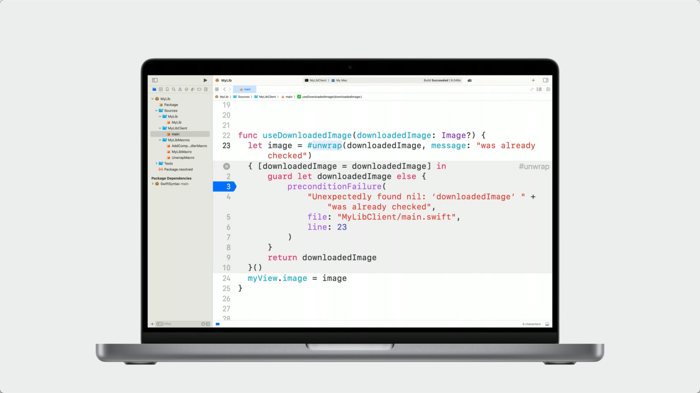

## 宏的角色（role）

根据不同的使用场景苹果区分出了独立宏和关联宏，而在这两种宏的背后，苹果又定义了角色（role）的概念，进一步明确不同宏的使用范围、代码展开的形式，以及宏展开后是如何嵌入到源码中的。角色的声明以「@」开头，独立宏和关联宏都有各自对应的角色。

独立宏目前包含包含了两种角色：

|  角色   | 描述  |
| --- | --- |
| @freestanding(expression) | 创建一个有返回值的表达式 |
| @freestanding(declaration) | 创建一个或多个声明 |

关联宏则有五种角色：

|  角色   | 描述  |
| --- | --- |
| @attached(peer) | 为关联的声明添加一段新的声明 |
| @attached(accessor) | 为关联的声明添加存取代码（get、set 等） |
| @attached(memberAttribute) | 为关联的类型或扩展添加新特性 |
| @attached(member) | 为关联的类型或扩展添加新的声明 |
| @attached(conformance) | 为关联的类型或扩展添加新的协议遵循 |

### @freestanding(expression)

expression 意为表达式，指的是一段可执行且有返回值的代码。`let numPixels = (x + width) * (y + height)` 在这个 let 声明中，等号右边的即是表达式，`(x + width)` 甚至是一个 x 都可以被称为表达式。而 @freestanding(expression) 正是用来创建表达式的。

我们以一段用于解包可选 UIImage 类型的场景，来看看如何使用 @freestanding(expression) 简化代码：

```swift
guard let image = downloadedImage else {
    preconditionFailure("Unexpectedly found nil: downloadedImage was already checked")
}
```

我们声明了一个用于解包的宏 unwrap，使用 #unwrap 解包 downloadedImage 字段。

```swift
/// Force-unwraps the optional value passed to expr
/// - Parameter message: Failure message,followed by 'expr'in single quotes
@freestanding(expression)
macro unwrap<Wrapped>(_expr: Wrapped?，message: String) -> Wrapped

let image = #unwrap(downloadedImage, message: "was already checked")
```

展开宏的实现，可以看到展开后的代码中自动引用了我们传入的 downloadedImage 作为变量名：

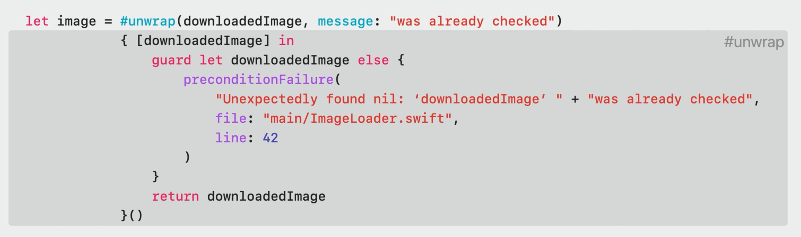

### @freestanding(declaration)

这个角色用来创建声明，声明可以是方法、变量，或者类型的。

假设有一个二维数组，现需要将这个二维数组拍平成一维的，我们实现了以下代码来实现需求：

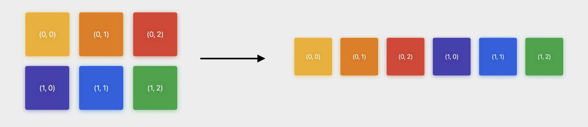

```swift
public struct Array2D<Element>: Collection {
    public struct Index: Hashable, Comparable { var storageIndex: Int }
    var storage: [Element]
    var width1: Int

    public func makeIndex(_ i: Int,_ i1: Int) -> Index {
        Index(storageIndex: i0 * width1 + i1)
    }

    public subscript (_ i: Int,_ i1: Int) -> Element {
        get { self[makeIndex(i0， i1)] }
        set { self[makeIndex(i0，i1)] = newValue }
    }

    public subscript (_ i: Index) -> Element {
        get { storage[i.storageIndex] }
        set { storage[i.storageIndex] = newValue }
    }
}
```

这时，又出现了将三维数组拍平的需求，于是在上面二维数组拍平的代码，又扩展了三维数组拍平的实现：

```swift
public struct Array2D<Element>: Collection { ... }

public struct Array3D<Element>: Collection {
    public struct Index: Hashable, Comparable { var storageIndex: Int }
    var storage: [Element]
    var width1，width2: Int

    public func makeIndex(_ i: Int,_ i1: Int,_ i2: Int) -> Index {
        Index(storageIndex: (i * width1 + i1) * width2 + i2)
    }

    public subscript (_i: Int,_ i1: Int,_ i2: Int) -> Element {
        get { self[makeIndex(io， i1， i2)] }
        set [ self[makeIndex(i0，i1，i2)] = newValue }
    }

    public subscript (_ i: Index) -> Element {
        get { storage[i.storageIndex] }
        set { storage[i.storageIndex] = newValue }
    }
}
```

随着不同维度拍平需求的增加，类似的模板代码会写非常多，而这些代码通过子类继承、范型、property wrapper 实现又不是很合适。这时就可以用到 `@freestanding(declaration)` 了：

```swift
/// Declares an n'-dimensional array type named Array<n>D'
/// - Parameter n: The number of dimensions in the array.
@freestanding(declaration，names: arbitrary)
macro makeArrayND(n: Int)

#makeArrayND(n: 2)
#makeArrayND(n: 3)
#makeArrayND(n: 4)
#makeArrayND(n: 5)
```

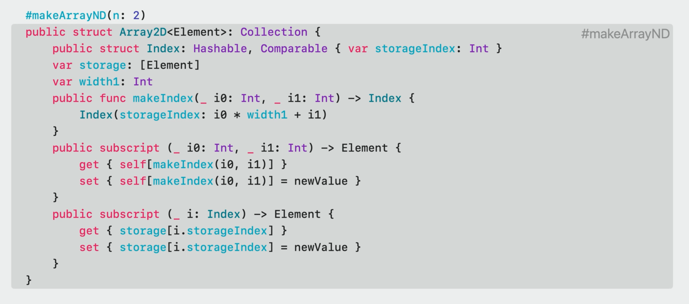

通过宏 `makeArrayND` 自动完成多维数组拍平的结构体类型声明，通过入参 n 补全不同维度的模板代码，以及正确的维度计算。

至此，我们介绍了独立宏的所有角色以及适用场景，接下来就是关联宏的角色。相比于独立宏仅能通过宏定义的入参获取到想要的信息，关联宏能额外获取到它所关联的类型、名称等信息。

### @attached(peer)

这个角色除了能关联到常见的类型、参数、方法以外，甚至能关联 import 和操作符的声明，并为其添加新的声明。以下面的方法为例，我们对外提供了异步（async）获取用户头像的方法，但不是所有的调用方都支持异步特性，因此也提供了通过 callback 返回头像的方法：

```swift
/// Fetch the avatar for the user with username.
func fetchAvatar(_ username: String) async -> Image? { ... }

func fetchAvatar(_ username: String, onCompletion: @escaping (Image?) -> Void) {
    Task.detached { onCompletion(await fetchAvatar(username)) }
}
```

所有的类似接口都需要手动实现异步与 callback 两种回调形式的接口，比较繁琐。使用 `@attached(peer)` 实现一次宏，在异步方法上添加 `@AddCompletionHandler(parameterName: "onCompletion")` 的方式，自动生成包含 onCompletion 回调的方法与其对应的实现：

```
/// Overload an 'async' function to add a variant that takes a completion handler closure as
/// a parameter.
@attached(peer， names: overloaded)
macro AddCompletionHandler(parameterName: String = "completionHandler")

@AddCompletionHandler(parameterName: "onCompletion")
func fetchAvatar(_ username: String) async -> Image? { ... }
```

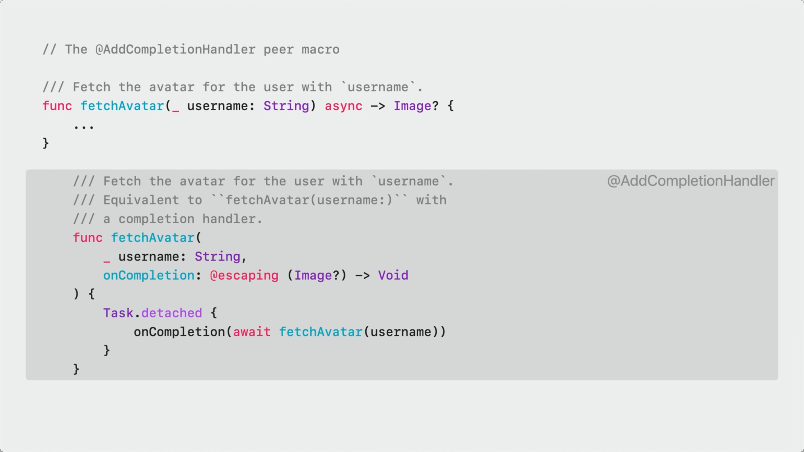

### @attached(accessor)

accessor 意为存取器，关联到参数后，可以操作它的 `get`、`set`、`willSet` 和 `didSet` 方法。

假设我们有一个 Persion 类型，其中的 name、height、birthDate 参数都是直接操作字典进行赋值和获取的，每增加一个参数都需要重复编写 get 和 set 实现，也没法通过 property wrapper 访问其他的存储属性来简化代码。

```swift
struct Person: DictionaryRepresentable {
    init(dictionary: [String: Any]) { self.dictionary = dictionary }
    var dictionary: [String: Any]

    var name: String {
        get { dictionary["name"]! as! String }
        set { dictionary["name"] = newValue }
    }
    var height: Measurement<UnitLength> {
        get { dictionary["height"]! as! Measurement<UnitLength> }
        set { dictionary["height"] = newValue }
    }
    var birthDate: Date? {
        get { dictionary["birth_date"] as! Date? }
        set { dictionary["birth_date"] = newValue as Any? }
    }
}
```

这种场景下 `@attached(accessor)` 就能发挥作用：

```swift
/// Adds accessors to get and set the value of the specified property in a dictionary
/// property called storage.
@attached(accessor)
macro DictionaryStorage(key: String? = nil)

struct Person: DictionaryRepresentable {
    init(dictionary: [String: Any]) { self.dictionary = dictionary }
    var dictionary: [String: Any]

    @DictionaryStorage
    var name: String

    @DictionaryStorage
    var height: Measurement<UnitLength>

    @DictionaryStorage(key: "birth_date")
    var birthDate: Date?
}
```

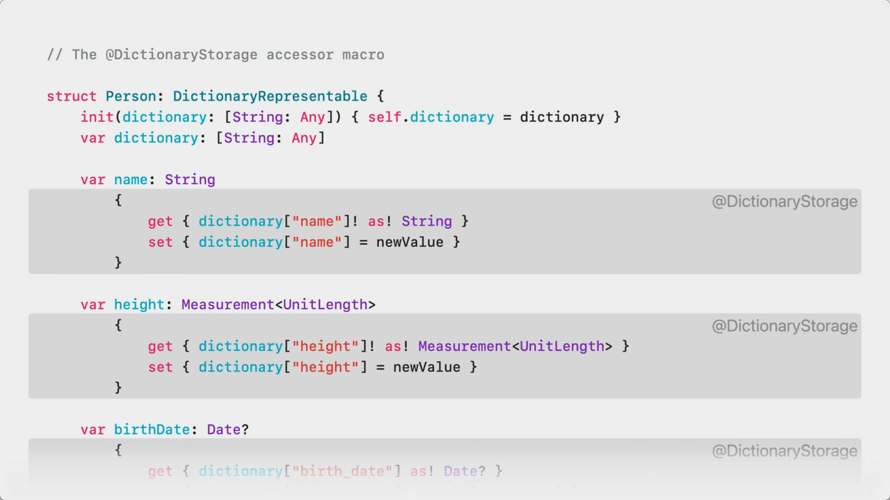

虽然上面代码优化了字典参数的写法，但也引入了另外一个问题：所有属性前面必须加上 `@DictionaryStorage` 模板代码，这又造成了重复编码，尤其是对含有大量属性的类型声明。要解决这个问题，需要引入下面这个新角色 `@attached(memberAttribute)`。

### @attached(memberAttribute)

这个角色可以为类型或扩展添加新特性。要解决上面模板代码的问题，我们无需新建一个宏，可以直接在上面宏的基础上做改动：

```swift
/// Adds accessors to get and set the value of the specified property in a dictionary
/// property called storage.
@attached(memberAttribute)
@attached(accessor)
macro DictionaryStorage(key: String? = nil)

@DictionaryStorage
struct Person: DictionaryRepresentable {
    init(dictionary: [String: Any]) { self.dictionary = dictionary }
    var dictionary: [String: Any]

    var name: String
    var height: Measurement<UnitLength>

    @DictionaryStorage(key: "birth_date")
    var birthDate: Date?
}
```

添加完后，`@DictionaryStorage` 自动为 Person 中所有的存储属性添加上宏声明，宏的展开和之前别无二致。

### @attached(member)

在上面的代码中有 init 方法和 dictionary 存储属性，对于所有使用了 `@DictionaryStorage` 的类型来说都是必要的，也属于模板代码的范畴，对于这类问题，可以通过这个角色解决。

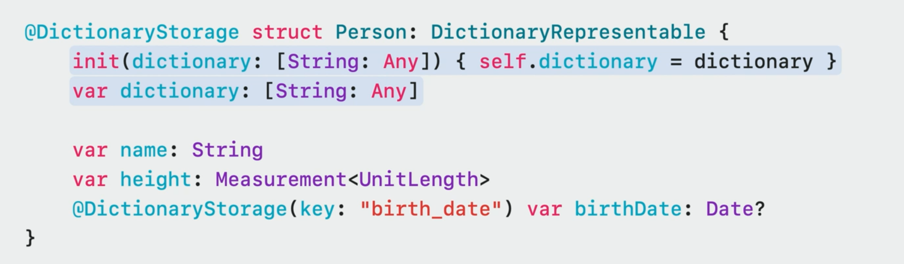

member 角色可以为类型、扩展添加初始化方法、参数等新的声明，为类和结构体添加存储属性，甚至为枚举添加新的 case。通过添加这个角色，所有应用了 `@DictionaryStorage` 的类型无需再重复添加 init 方法和 dictionary 属性，一切交给编译器完成。

```swift
/// Adds accessors to get and set the value of the specified property in a dictionary
/// property called storage.
@attached(member, names: named(dictionary), named(init(dictionary:)))
@attached(memberAttribute)
@attached(accessor)
macro DictionaryStorage(key: String? = nil)

@DictionaryStorage
struct Person: DictionaryRepresentable {
    var name: String
    var height: Measurement<UnitLength>

    @DictionaryStorage(key: "birth_date")
    var birthDate: Date?
}
```

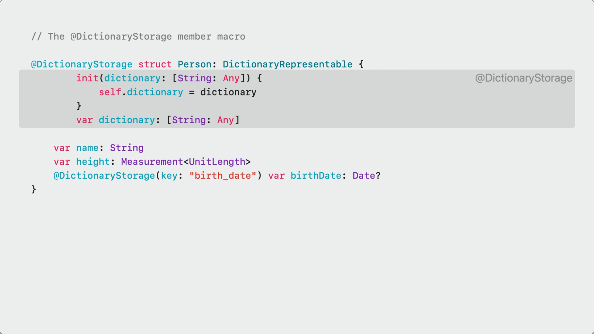

### @attached(conformance)

> 本文在编写阶段，出现了一个新的社区提案 [Generalize conformance macros as extension macros](https://github.com/apple/swift-evolution/blob/main/proposals/0402-extension-macros.md)，后续在 Swift 5.9 正式版本这个角色可能会有变动

上面的例子中，还有一个 DictionaryRepresentable 类型可以优化，这里我们使用 `@attached(conformance)` 解决，保证应用了这个角色的类型自动遵循 DictionaryRepresentable 协议：

```swift
/// Adds accessors to get and set the value of the specified property in a dictionary
/// property called storage.
@attached(conformance)
@attached(member, names: named(dictionary), named(init(dictionary:)))
@attached(memberAttribute)
@attached(accessor)
macro DictionaryStorage(key: String? = nil)

@DictionaryStorage
struct Person {
    var name: String
    var height: Measurement<UnitLength>

    @DictionaryStorage(key: "birth_date")
    var birthDate: Date?
}
```

至此，我们通过一个完整的案例，联合使用了关联宏的四个角色，成功减少模板代码。

### 角色组合（role composition）

在上面的 `DictionaryStorage` 宏的例子中，使用了多个关联宏角色的组合共同对代码进行优化，关于角色组合的使用需要满足下面几个原则：

1. 一个宏可以有多个关联角色（attached roles）
2. Swift 会在宏使用的地方将所有适用的角色都还原成对应实现
3. 在使用的地方，至少需要有一个角色满足场景

### 名称标识符（Name specifier）

`@attached(member)` 的例子里我们用到了 names 参数。对于会生成新声明的宏角色来说，必须用名称标识符对新的声明进行描述，目前有 5 种名称标识符：

|  名称   | 描述  |
| --- | --- |
| overloaded | 在关联类型的基础上创建一个相同名称的声明（仅限用于关联宏） |
| prefixed(`<`some prefix`>`) | 创建一个声明，以 `<`some prefix`>` 开头，跟随关联类型的名称。prefix 可以以 $ 符号开头（仅限用于关联宏） |
| suffixed(`<`some suffix`>`) | 创建一个声明，以关联类型的名称开头，`<`some suffix`>` 结尾（仅限用于关联宏） |
| named(`<`some name`>`) | 创建一个以 `<`some name`>` 为名的声明 |
| arbitrary | 创建名称不包括在上述规则之中的声明 |

名称标识符一方面告诉开发者新的声明会对已有代码产生什么影响，减少非预期使用，另一方面也能减少编译器在非必要情况下重新展开宏。这里提下 `arbitrary`，在多维数组的例子中就使用到了 `arbitrary`，是因为它创建出来的声明是由维度入参 n 决定的，无法被前四种标识符囊括。但如果在名称能够确定规则的情况下，尽量不要使用 `arbitrary`。

至此，Swift 宏的基本概念已经讲完，但在前面设计原则部分提到过的 SwiftSyntax 又是什么？为什么能对保证宏类型的完备？

## 什么是 SwiftSyntax

[SwiftSyntax](https://github.com/apple/swift-syntax) 是苹果开源的，支持解析、校验、生成 Swift 源码的库，可以通过 Swift Package 的形式引入。SwiftSyntax 可以直接将 Swift 源码解析成 AST，方便对代码的分析，著名的开源库 [SwiftLint](https://github.com/realm/SwiftLint) 就是基于它实现的 lint 规则分析。Swift 宏也是基于它实现的源码解析。

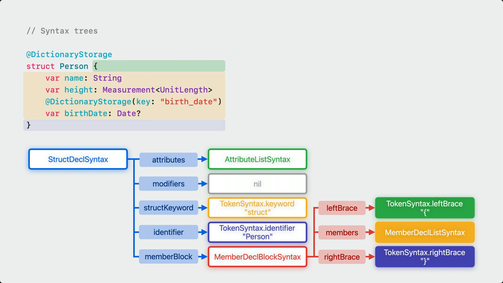

> 严格来说，SwiftSyntax 源码解析生成的应该属于原型树而非真正意义上的 AST，是因为相比于直接用 swiftc 生成的 AST，SwiftSyntax 解析得到的树型结构保留了更多源码细节，例如注释、空格等信息。文章中不做特意区分

来看一个用 SwiftSyntax 解析生成 AST 的例子。首先编写一个仅声明了 Suit 枚举的文件：

```swift
import Foundation

/// nested Suit enumeration
enum Suit: Character {
    case spades = "♠"
    case hearts = "♡"
}
```

将源码保存成 .swift 文件，克隆 SwiftSyntax 源码到本地，在命令行中执行以下命令，将 `/your/path/to/demo.swift` 替换程你刚才保存的 .swift 文件目录：

```shell
swift build
swift run swift-parser-cli print-tree /your/path/to/demo.swift --include-trivia
```

运行完毕后就能在命令行中看到下面的输出了：

```
SourceFileSyntax
├─statements: CodeBlockItemListSyntax
│ ├─[0]: CodeBlockItemSyntax
│ │ ╰─item: ImportDeclSyntax
│ │   ├─importKeyword: keyword(SwiftSyntax.Keyword.import)
│ │   ╰─path: ImportPathSyntax
│ │     ╰─[0]: ImportPathComponentSyntax
│ │       ╰─name: identifier("Foundation")
│ ╰─[1]: CodeBlockItemSyntax
│   ╰─item: EnumDeclSyntax
│     ├─enumKeyword: keyword(SwiftSyntax.Keyword.enum)
│     ├─identifier: identifier("Suit")
│     ├─inheritanceClause: TypeInheritanceClauseSyntax
│     │ ├─colon: colon
│     │ ╰─inheritedTypeCollection: InheritedTypeListSyntax
│     │   ╰─[0]: InheritedTypeSyntax
│     │     ╰─typeName: SimpleTypeIdentifierSyntax
│     │       ╰─name: identifier("Character")
│     ╰─memberBlock: MemberDeclBlockSyntax
│       ├─leftBrace: leftBrace
│       ├─members: MemberDeclListSyntax
│       │ ├─[0]: MemberDeclListItemSyntax
│       │ │ ╰─decl: EnumCaseDeclSyntax
│       │ │   ├─caseKeyword: keyword(SwiftSyntax.Keyword.case)
│       │ │   ╰─elements: EnumCaseElementListSyntax
│       │ │     ╰─[0]: EnumCaseElementSyntax
│       │ │       ├─identifier: identifier("spades")
│       │ │       ╰─rawValue: InitializerClauseSyntax
│       │ │         ├─equal: equal
│       │ │         ╰─value: StringLiteralExprSyntax
│       │ │           ├─openQuote: stringQuote
│       │ │           ├─segments: StringLiteralSegmentsSyntax
│       │ │           │ ╰─[0]: StringSegmentSyntax
│       │ │           │   ╰─content: stringSegment("♠")
│       │ │           ╰─closeQuote: stringQuote
│       │ ╰─[1]: MemberDeclListItemSyntax
│       │   ╰─decl: EnumCaseDeclSyntax
│       │     ├─caseKeyword: keyword(SwiftSyntax.Keyword.case)
│       │     ╰─elements: EnumCaseElementListSyntax
│       │       ╰─[0]: EnumCaseElementSyntax
│       │         ├─identifier: identifier("hearts")
│       │         ╰─rawValue: InitializerClauseSyntax
│       │           ├─equal: equal
│       │           ╰─value: StringLiteralExprSyntax
│       │             ├─openQuote: stringQuote
│       │             ├─segments: StringLiteralSegmentsSyntax
│       │             │ ╰─[0]: StringSegmentSyntax
│       │             │   ╰─content: stringSegment("♡")
│       │             ╰─closeQuote: stringQuote
│       ╰─rightBrace: rightBrace
╰─eofToken: eof
```

生成的 AST 节点的具体含义在这里不过多展开了，推荐使用日本 iOS 开发者 Kishikawa Katsumi 开发的网站 [Swift AST Explorer](https://swift-ast-explorer.com)，可以实时解析你的源码并生成 AST。NSHipster 的文章 [SwiftSyntax](https://nshipster.com/swiftsyntax/) 虽然有些年头了，但也值得一读。

## 宏是如何被还原成代码的

了解了 SwiftSyntax，让我们再看看 Swift 编译器是如何将宏还原成代码的。在前面所有提到宏定义的地方都没有写出一个关键的点，宏的声明和实现是如何对应的？以 `stringify` 宏的为例，其实现放在 `=` 的右边。

```swift
/// Creates a tuple containing both the result of `expr` and its source code represented as a
/// `String`.
@freestanding(expression)
macro stringify<T>(_ expr: T) -> (T， String) = <implementation goes here>
```

等号右边的实现也必须是宏，可以是 Swift 内置的 `#externalMacro` 指向真正的实现类型，也可以是你自己声明的另一个宏。

```swift
@freestanding(expression)
macro stringify<T>(_ expr: T) -> (T， String) = #stringifyWithPrefix(expr, prefix: "")

@freestanding(expression)
macro stringify<T>(_ expr: T) -> (T， String) = #externalMacro(
                                                    module: "MyLibMacros",
                                                    type: "StringifyMacro"
                                                )
```

当编译器发现代码中使用了宏时，便会开启一个单独的进程启动编译器插件，来获取宏对应的展开代码，而 `#externalMacro` 正是用来关联宏和实现的内置宏，通过 module 参数告诉编译器需要运行哪个插件模块，通过 type 告诉编译器具体的实现类型。插件运行完返回结果后，编译器会把结果替换原来宏所在的位置，并源码一起进行编译。

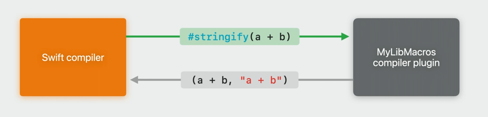

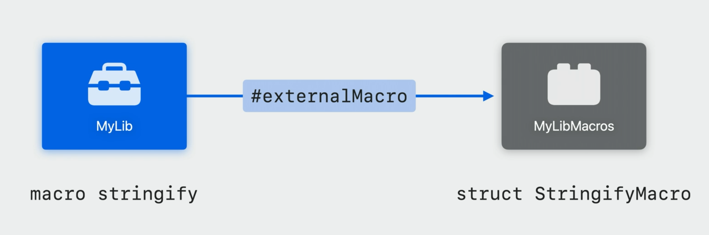

## 使用宏的注意事项

### 1. 多个宏展开之间无法互相看见展开的结果

```swift
@DictionaryStorage
struct Person {
    var name: String
    var height: Measurement<UnitLength>

    @DictionaryStorage(key: "birth_date")
    var birthDate: Date?
}
```

以前面的 Person 结构体为例，`DictionaryStorage` 宏的使用了多个关联宏角色，而每个宏在展开时是独立的，不同宏之间无法知道对方的展开结果，展开顺序也不保证和声明中的顺序相同。因此在使用时，多个宏的展开结果不应该相互依赖。这点和其他语言的类似特性不太一致，例如 Java 的 Annotation Processor。

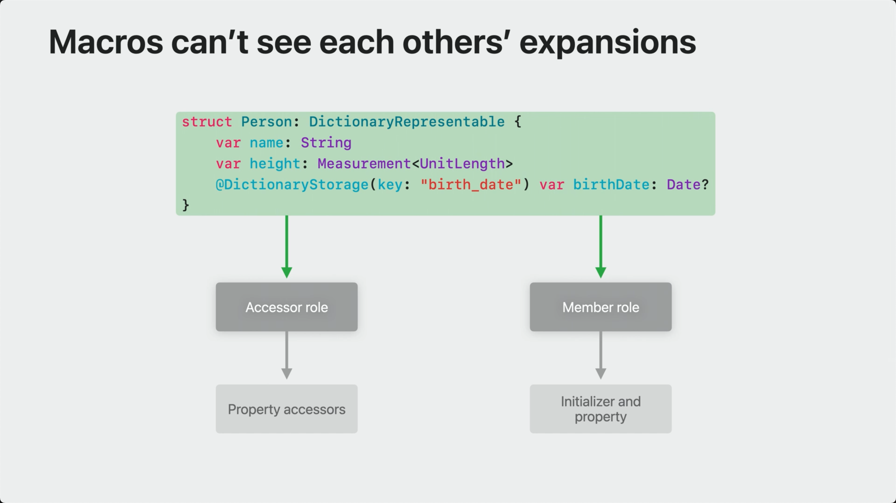

### 2. Swift 宏默认不阻止命名冲突

部分语言通过卫生宏（hygienic）的机制避免宏实现内部意外捕获外部的变量，而在 Swift 宏实现中，是可以访问外部的参数的，例如在 `@DictionaryStorage` 中使用了 `@attached(accessor)` 自动生成 get 和 set 方法，访问 `@attached(member, names: named(dictionary), named(init(dictionary:)))` 生成的 dictionary 存储属性。如果想要避免参数命名冲突的情况，可以使用 `context.makeUniqueName()`，它会确保生成一个外部未使用的变量名来保证唯一性（context 是宏实现方法声明的入参，类型是 some MacroExpansionContext）。

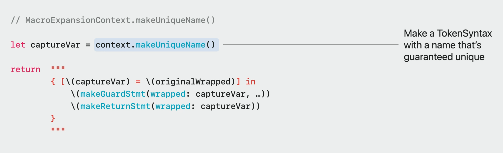

### 3. 不要使用编译器没有提供的信息

编译器会假定宏的实现是**纯函数（pure function）**，这意味着在数据源没有发生改变的情况下，宏的展开结果也不应该有改变。如果使用了编译器提供之外的信息，例如在实现中获取编译时间，会导致展开结果出错（编译器不知道在什么时候应该重新生成新的展开结果）。

为了避免这种情况，编译器插件是运行在独立沙盒之中的，阻止宏在实现内部访问文件系统和网络。但沙盒没法阻止不好的使用，比如获取时间，或者生成一个随机数，也可以在一个实现中存储一个全局变量供另外一个宏展开使用。如果这么做了，你的宏可能和你预想的表现会有出入，所以千万不要这么做。

### 4. 宏的实现要尽可能考虑所有语法可能性

宏的实现依赖于源码解析后的 AST 结构，在开发中我们需要尽可能考虑所有的语法可能性，即是是官方的实现也容易在这个问题上踩坑。下图展示了在变量连写的情况下，get 和 set 生成异常的情况（原推地址：https://twitter.com/realWeZZard/status/1676588090574639104）：

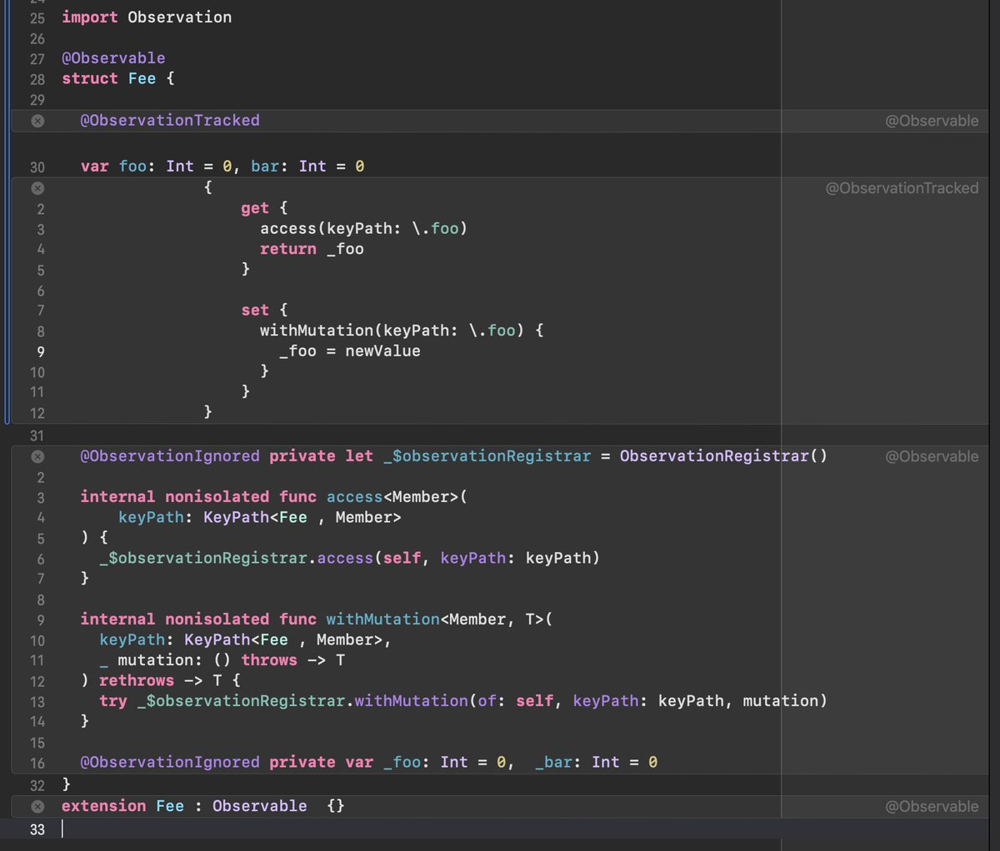

## 最后

如果你的工程支持 Swift Package Manager，那恭喜你，只需要依赖 SwiftSyntax，其他统统交给 Xcode；如果使用的是 Cocoapods，也有人尝试了解决方案：[Swift Macro 不使用 Swift Package Manager 如何集成](https://gist.github.com/0x1306a94/09674ddc71459ffa00a625f01b5f49cc)；对于 Bazel 来说，官方虽然也在[支持这一新特性](https://github.com/bazelbuild/rules_swift/pull/1058)，但像语法高亮、宏展开这些和 IDE 捆绑的流程，可能就比较难整合了。

开源社区有人整理了 [Swift Macro 合集](https://github.com/krzysztofzablocki/Swift-Macros)，看看别人是如何编写宏的，官方文档也会是你学习开发、使用宏的利器：[Macros](https://docs.swift.org/swift-book/documentation/the-swift-programming-language/macros/)。

另外，直接阅读 Swift Evolution 中关于宏的部分也十分推荐：[SE-0382 Expression Macros](https://github.com/apple/swift-evolution/blob/main/proposals/0382-expression-macros.md)、[SE-0389 Attached Macros](https://github.com/apple/swift-evolution/blob/main/proposals/0389-attached-macros.md)、[SE-0397 Freestanding Declaration Macros](https://github.com/apple/swift-evolution/blob/main/proposals/0397-freestanding-declaration-macros.md)。

Happy Coding！
