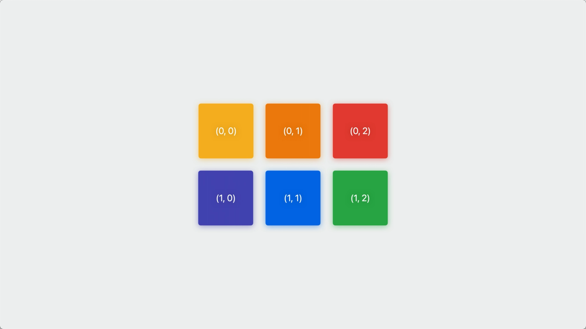
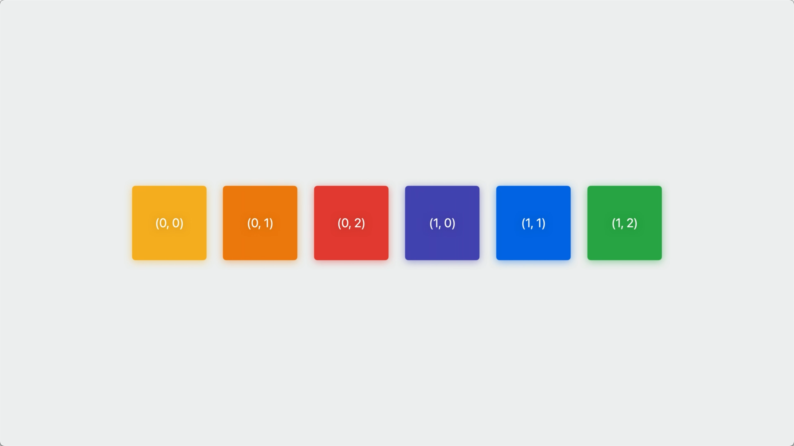
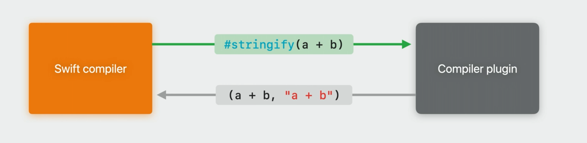
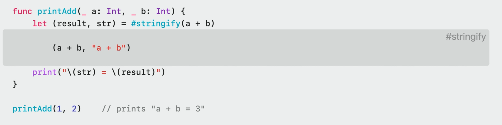

---

session_ids: [10167]

---

# WWDC23 10167 - 展开聊聊 Swift 宏

本文基于 [Session 10167](https://developer.apple.com/videos/play/wwdc2023/10167/) 梳理。

## 前言

Swift 宏是 Swift 5.9 中引入的新特性，希望开发者可以用更简单的方式减少模版代码的编写，让源码保持简洁。开发期间依赖 SwiftSyntax 将源码解析成原型树，供开发者编写宏及其实现来完成特定功能，而在编译期间 Swift 编译器（Swift Compiler）会将源码中的宏展开成目标代码，替换原本的宏完成编译。
光看上面的介绍是不是两眼一黑，别急，随着文章的深入上面的内容会慢慢向你揭示。

> 虽然原 session 中详细提到了如何实现一个宏，以及错误诊断方面的内容，但限于篇幅，本文不会涉及这些点，而将偏重于 Swift 宏的基础概念。如果你希望了解这方面的内容，可以阅读一下这篇文章（链接待补充）。

## 什么是 SwiftSyntax

在上面的介绍中我们提到，Swift 宏的实现依赖于 SwiftSyntax 解析源码生成 AST（Abstract Syntax Tree，抽象语法树）结构，那么，什么是 SwiftSyntax？

[SwiftSyntax](https://github.com/apple/swift-syntax) 是苹果开源的，支持解析、校验、生成 Swift 源码的库，可以通过 Swift Package 的形式引入。SwiftSyntax 可以直接将 Swift 源码解析成 AST，方便对代码的分析，著名的开源库 [SwiftLint](https://github.com/realm/SwiftLint) 就是基于它实现的 lint 规则分析。Swift 宏也是基于此实现了源码的解析。

> 严格来说，SwiftSyntax 源码解析生成的应该属于原型树而非真正意义上的 AST，是因为相比于直接用 swiftc 生成的 AST，SwiftSyntax 解析得到的树型结构保留了更多源码细节，例如注释、空格等信息。文章中不做特意区分

下面我们来看一下如何用 SwiftSyntax 解析生成 AST 的例子，编写一个仅声明了 Suit 枚举的文件：

```swift
import Foundation

enum Suit: Character {
	// nested Suit enumeration
    case spades = "♠"
    case hearts = "♡"
}
```

将源码保存成 .swift 文件，克隆 SwiftSyntax 源码到本地，在命令行中执行以下命令，将 `/your/path/to/demo.swift` 替换程你刚才保存的 .swift 文件目录：

```shell
swift build
swift run swift-parser-cli print-tree /your/path/to/demo.swift --include-trivia
```

运行完毕后就能在命令行中看到下面的输出了：

```
SourceFileSyntax
├─statements: CodeBlockItemListSyntax
│ ├─[0]: CodeBlockItemSyntax
│ │ ╰─item: ImportDeclSyntax
│ │   ├─importKeyword: keyword(SwiftSyntax.Keyword.import) trailingTrivia=spaces(1)
│ │   ╰─path: ImportPathSyntax
│ │     ╰─[0]: ImportPathComponentSyntax
│ │       ╰─name: identifier("Foundation")
│ ╰─[1]: CodeBlockItemSyntax
│   ╰─item: EnumDeclSyntax
│     ├─enumKeyword: keyword(SwiftSyntax.Keyword.enum) leadingTrivia=newlines(2) trailingTrivia=spaces(1)
│     ├─identifier: identifier("Suit")
│     ├─inheritanceClause: TypeInheritanceClauseSyntax
│     │ ├─colon: colon trailingTrivia=spaces(1)
│     │ ╰─inheritedTypeCollection: InheritedTypeListSyntax
│     │   ╰─[0]: InheritedTypeSyntax
│     │     ╰─typeName: SimpleTypeIdentifierSyntax
│     │       ╰─name: identifier("Character") trailingTrivia=spaces(1)
│     ╰─memberBlock: MemberDeclBlockSyntax
│       ├─leftBrace: leftBrace
│       ├─members: MemberDeclListSyntax
│       │ ├─[0]: MemberDeclListItemSyntax
│       │ │ ╰─decl: EnumCaseDeclSyntax
│       │ │   ├─caseKeyword: keyword(SwiftSyntax.Keyword.case) leadingTrivia=[newlines(1), tabs(2), lineComment("// nested Suit enumeration"), newlines(1), spaces(4)] trailingTrivia=spaces(1)
│       │ │   ╰─elements: EnumCaseElementListSyntax
│       │ │     ╰─[0]: EnumCaseElementSyntax
│       │ │       ├─identifier: identifier("spades") trailingTrivia=spaces(1)
│       │ │       ╰─rawValue: InitializerClauseSyntax
│       │ │         ├─equal: equal trailingTrivia=spaces(1)
│       │ │         ╰─value: StringLiteralExprSyntax
│       │ │           ├─openQuote: stringQuote
│       │ │           ├─segments: StringLiteralSegmentsSyntax
│       │ │           │ ╰─[0]: StringSegmentSyntax
│       │ │           │   ╰─content: stringSegment("♠")
│       │ │           ╰─closeQuote: stringQuote
│       │ ╰─[1]: MemberDeclListItemSyntax
│       │   ╰─decl: EnumCaseDeclSyntax
│       │     ├─caseKeyword: keyword(SwiftSyntax.Keyword.case) leadingTrivia=[newlines(1), spaces(4)] trailingTrivia=spaces(1)
│       │     ╰─elements: EnumCaseElementListSyntax
│       │       ╰─[0]: EnumCaseElementSyntax
│       │         ├─identifier: identifier("hearts") trailingTrivia=spaces(1)
│       │         ╰─rawValue: InitializerClauseSyntax
│       │           ├─equal: equal trailingTrivia=spaces(1)
│       │           ╰─value: StringLiteralExprSyntax
│       │             ├─openQuote: stringQuote
│       │             ├─segments: StringLiteralSegmentsSyntax
│       │             │ ╰─[0]: StringSegmentSyntax
│       │             │   ╰─content: stringSegment("♡")
│       │             ╰─closeQuote: stringQuote
│       ╰─rightBrace: rightBrace leadingTrivia=newlines(1)
╰─eofToken: eof
```

SwiftSyntax 每个节点的具体含义不是本文重点，想要了解更多细节，推荐网站：https://swift-ast-explorer.com，它可以实时解析你的源码并生成 AST。NSHipster 的 [SwiftSyntax](https://nshipster.com/swiftsyntax/) 文章也十分推荐。

## Swift 宏的设计思考

了解了什么是 SwiftSyntax 后，让我们一起看看苹果在设计宏这个新特性的时候背后的设计思考，主要分为 4 个方面：

1. 区分使用场景

    为区分不同的使用场景，苹果将宏分成两个大类：独立宏（freestanding macro） 和关联宏（attached macro）：

    **独立宏**可以在代码中独立存在，用于替换一个表达式或者是类型声明，使用这类宏时需以「#」号开头，例如：

    ```swift
    return #unwrap(icon, message:"should be in the app bundle")
    ```

    **关联宏**就如它的名字描述的那样，必须和另一个类型或者是声明关联，使用这类宏时需以「@」号开头，例如：

    ```swift
    @AddCompletionHandler
    func sendRequest() async throws -> Response
    ```

2. 类型完备，支持合法性校验

    由于宏的实现依赖于 SwiftSyntax，而它能够很好约束宏不被错误使用，在编译期间给出错误提示。

    

3. 可预期的添加结果

    宏无法不能修改或者删除代码，在下面的例子中，即使不清楚 `#someUnknownMacro()` 做了什么事情，我们也能确定，它无法删除 `finishDoingThingy()` 调用，或者将它移动到另一个方法中。

    ```swift
    func doThingy() {
        startDoingThingy()

        #someUnknownMacro()

        finishDoingThingy()
    }
    ```

4. 宏不是魔法

    宏仅仅是为你的工程添加了更多代码，而 Xcode 提供的宏展开能力让它不再是一个黑盒，通过右键点击即可展开宏的声明，也可以添加断点进行调试，

    

## 宏的角色（role）

在上面的内容里我们了解到，根据不同的使用场景苹果定义了独立宏和关联宏，而在这两种类型宏的背后，苹果设计了角色（role）的概念，进一步明确了不同宏的使用范围、代码展开的形式，以及宏展开后是如何嵌入到源码中的。角色的声明以「@」开头。独立宏和关联宏都有各自对应的角色。

独立宏目前包含包含了两种角色：

|  角色   | 描述  |
| --- | --- |
| @freestanding(expression) | 创建一个有返回值的表达式 |
| @freestanding(declaration) | 创建一个或多个声明 |


关联宏则有五种角色：

|  角色   | 描述  |
| --- | --- |
| @attached(peer) | 为关联的声明添加一段新的声明 |
| @attached(accessor) | 为关联的声明添加存取代码（get、set 等） |
| @attached(memberAttribute) | 为关联的类型或扩展添加参数 |
| @attached(member) | 为关联的类型或扩展添加新的声明 |
| @attached(conformance) | 为关联的类型或扩展协议遵循 |

光看上面的描述一定让你感到丈二和尚摸不着头脑，下面我们会通过一些例子，把这些角色说清楚。

### @freestanding(expression)

expression 意为表达式，指的是一段可执行且有返回值的代码。`let numPixels = (x + width) * (y + height)` 在这个 let 声明中，等号右边的即是表达式，`(x + width)` 甚至是一个 x 都可以被称为表达式。而 @freestanding(expression) 正是用来创建表达式的。

我们以一段可选的 image 解包的场景来看看如何使用 @freestanding(expression) 简化代码：

```swift
guard let image = downloadedImage else {
	preconditionFailure("Unexpectedly found nil: downloadedImage was already checked")
}
```

我们声明了一个用于解包的宏 unwrap，使用 #unwrap 解包 downloadedImage 字段。

```swift
/// Force-unwraps the optional value passed to expr
/// - Parameter message: Failure message,followed by 'expr'in single quotes
@freestanding(expression)
macro unwrap<Wrapped>(_expr: Wrapped?，message: String) -> Wrapped

let image = #unwrap(downloadedImage, message: "was already checked")
```

展开宏的实现，我们可以看到展开后的代码中竟然自动引用了我们传入的 downloadedImage 作为变量名：


##### @freestanding(declaration)

> TODO: 这里的图片最好是两张合成一张，通过箭头将左边的指向右边

declaration 可以是方法、变量，或者类型。假设我们写了一个二维数组，而我们需要将二维数据拍平成一维的





要实现这一功能，可能需要这样的代码

```swift
public struct Array2D<Element>: Collection {
    public struct Index: Hashable, Comparable { var storageIndex: Int }
    var storage: [Element]
	var width1: Int
	public func makeIndex(_ i: Int,_ i1: Int) -> Index {
        Index(storageIndex: i0 * width1 + i1)
    }
	public subscript (_ i: Int,_ i1: Int) -> Element {
        get { self[makeIndex(i0， i1)] }
		set { self[makeIndex(i0，i1)] = newValue }
    }
	public subscript (_ i: Index) -> Element {
        get { storage[i.storageIndex] }
		set { storage[i.storageIndex] = newValue }
    }
}
```

但需求是无止尽的，有可能你会发现在代码的其他地方，需要将三维数组拍平，因此又增加了如下代码

```swift
public struct Array2D<Element>: Collection { ... }
public struct Array3D<Element>: Collection {
    public struct Index: Hashable, Comparable { var storageIndex: Int }
    var storage: [Element]
	var width1， width2: Int
    public func makeIndex(_ i: Int,_ i1: Int,_ i2: Int) -> Index {
    	Index(storageIndex: (i * width1 + i1) * width2 + i2)
    }
	public subscript (_i: Int,_ i1: Int,_ i2: Int) -> Element {
        get { self[makeIndex(io， i1， i2)] }
		set [ self[makeIndex(i0，i1，i2)] = newValue }
    }
	public subscript (_ i: Index) -> Element {
        get { storage[i.storageIndex] }
		set { storage[i.storageIndex] = newValue }
    }
}
```

接着就是四维、五维，随着维度的增加，类似的模板代码会写非常多，这些代码又不是那么的适合用子类、范性等现有特性去实现。这时候我们就需要用到声明宏了：

```swift
/// Declares an n'-dimensional array type named Array<n>D'// - Parameter n: The number of dimensions in the array.
@freestanding(declaration， names: arbitrary)
macro makeArrayND(n: Int)

#makeArrayND(n: 2)
#makeArrayND(n: 3)
#makeArrayND(n: 4)
#makeArrayND(n: 5)
```

每个宏定义展开都有正确的入参个数，以及正确的维度计算


#### attached macros

讲完 freestanding macros 的角色，我们来到了 attached macros。就像名字所描述的那样，attached macro 需要和一个已有类型的声明关联起来，因此相比于 freestanding macro 仅能获取到通过参数传递的信息，attached macro 能额外获取到它所关联的名称、类型等信息。

##### @attached(peer)

peer 不仅能关联到常见的类型、参数、方法上，甚至是 import 和操作符声明上，并为其添加新的声明。以下面的方法为例，对外提供了异步获取用户头像的方法，但不是所有的调用方都支持异步能力，因此也提供了通过 callback 返回的方法：

```swift
/// Fetch the avatar for the user with username.
func fetchAvatar(_ username: String) async -> Image? { ... }

func fetchAvatar(_ username: String, onCompletion: @escaping (Image?) -> Void) {
    Task.detached { onCompletion(await fetchAvatar(username)) }
}
```

手写接口相对麻烦，我们可以通过宏来自动完成：

```
// Overload an 'async' function to add a variant that takes a completion handler closure as// a parameter.
@attached(peer， names: overloaded)
macro AddCompletionHandler(parameterName: String = "completionHandler")

/// 将宏的声明关联到之前的异步方法上
@AddCompletionHandler(parameterName: "onCompletion")
func fetchAvatar(_ username: String) async -> Image? { ... }
```

方法会自动生成包含 onCompletion 回调的方法与其对应的实现。


##### @attached(accessor)

accessor 可以关联到参数上，操作 get、set、willSet 和 didSet 方法。

假设我们有一个 Persion 类型，其中的 name、height、birthDate 都是直接操作字典进行赋值和获取的，其中的 get 和 set 方法通过手写非常复杂，也没法通过 property wrapper 访问其他的存储属性来简化它。

```swift
struct Person: DictionaryRepresentable {
	init(dictionary: [String: Any]) { self.dictionary = dictionary }
	var dictionary: [String: Any]

	var name: String {
		get { dictionary["name"]! as! String }
        set { dictionary["name"] = newValue }
    }
	var height: Measurement<UnitLength> {
		get { dictionary["height"]! as! Measurement<UnitLength> }
        set { dictionary["height"] = newValue }
    }
	var birthDate: Date? {
		get { dictionary["birth_date"] as! Date? }
        set { dictionary["birth_date"] = newValue as Any? }
    }
}
```

这种场景下 @attached(accessor) 就能发挥其作用：

```swift
/// Adds accessors to get and set the value of the specified property in a dictionary
// property called storage.
@attached(accessor)
macro DictionaryStorage(key: String? = nil)

struct Person: DictionaryRepresentable {
    init(dictionary: [String: Any]) { self.dictionary = dictionary }
    var dictionary: [String: Any]

	@DictionaryStorage var name: String
	@DictionaryStorage var height: Measurement<UnitLength>
	@DictionaryStorage(key: "birth_date") var birthDate: Date?
}
```


虽然上面的代码优化了写法，但也引入了另外一个问题：参数前面必须加上 @DictionaryStorage 模板代码。要解决这个问题，需要引入下面这个新角色：

##### @attached(memberAttribute)

这个角色可以为类型或扩展添加属性。要解决模板代码的问题，我们无需新建一个宏，直接在之前的基础上添加就可以：

```swift
/// Adds accessors to get and set the value of the specified property in a dictionary
// property called storage.
@attached(memberAttribute)
@attached(accessor)
macro DictionaryStorage(key: String? = nil)

@DictionaryStorage struct Person: DictionaryRepresentable {
    init(dictionary: [String: Any]) { self.dictionary = dictionary }
    var dictionary: [String: Any]

	var name: String
	var height: Measurement<UnitLength>
	@DictionaryStorage(key: "birth_date") var birthDate: Date?
}
```

添加完后，DictionaryStorage 会为所有的存储属性添加上 @DictionaryStorage 宏声明，之后这些宏就会被展开成上面提到的那样。

##### @attached(member)

我们看到，在代码中有的 init 方法与 dictionary 存储属性，这些对于所有应用了 @DictionaryStorage 的类型来说都是存在的，有重复代码的情况，因此我们需要更进一步，通过其他的宏角色来优化它。


member 角色可以为类型、扩展添加初始化方法、参数等新的声明，甚至可以为类和结构体添加存储属性，或为枚举添加 case。通过添加这个角色，@DictionaryStorage 关联的类型无需再添加 init 方法和 dictionary 属性，一些交给编译器自动完成。

```swift
/// Adds accessors to get and set the value of the specified property in a dictionary
// property called storage.
@attached(member, names: named(dictionary), named(init(dictionary:)))
@attached(memberAttribute)
@attached(accessor)
macro DictionaryStorage(key: String? = nil)

@DictionaryStorage struct Person: DictionaryRepresentable {
	var name: String
	var height: Measurement<UnitLength>
	@DictionaryStorage(key: "birth_date") var birthDate: Date?
}
```


##### @attached(conformance)

上面的例子中，还有一个 DictionaryRepresentable 类型可以优化，这里我们使用 conformance 来解决。

```swift
/// Adds accessors to get and set the value of the specified property in a dictionary
// property called storage.
@attached(conformance)
@attached(member, names: named(dictionary), named(init(dictionary:)))
@attached(memberAttribute)
@attached(accessor)
macro DictionaryStorage(key: String? = nil)

@DictionaryStorage
struct Person {
	var name: String
	var height: Measurement<UnitLength>
	@DictionaryStorage(key: "birth_date") var birthDate: Date?
}
```

至此，我们通过一个完整的案例，将 attached macro 的四个角色联合使用，完成了对代码的优化。

### 角色组合（role composition）

这里就得替下角色组合了：

1. 一个宏可以有多个关联角色
2. 在宏对应的地方，所有的角色都会被展开
3. 一个宏至少要有一个适用的角色

### 名称标识符（Name specifier）

在上面 @attached(member) 的 demo 中我们用到了 names。对于我们需要在宏之外（不仅仅）访问到这些声明的情况，就需要使用到名称标识符了，目前有 5 种名称标识符：

|  名称   | 描述  |
| --- | --- |
| overloaded |在关联类型的基础上创建一个相同名称的声明（仅用于 attached macro） |
| prefixed(<some prefix>) | 创建一个声明，以 <some prefix> 开头，跟随关联类型的名称。prefix 可以以 $ 符号开头（仅用于 attached macro） |
| suffixed(<some suffix>) | 创建一个声明，以关联类型的名称开头，<some suffix> 结尾（仅用于 attached macro） |
| named(<some name>) | 创建一个以 <some name> 为名的声明 |
| arbitrary | 创建名称不包括在上面这些规则之中的声明 |

这里额外提下 arbitrary，在上面多维数组的例子中，就使用了 arbitrary 名称标识符，是因为它创建出来的名称依赖于它的入参。但如果能够明确的情况下，尽量不要使用 arbitrary。

```swift
@freestanding(declaration， names: arbitrary)
macro makeArrayND(n: Int)
```

## 宏是如何进行编译的

这里简单提下 Swift 是如何将宏还原成代码的。一下面的代码为例，其中使用了 #stringify 宏。

```swift
func printAdd(_ a: Int, _ b: Int) {
    let (result, str) = #stringify(a + b)
    print("\(str) = \(result)")
}
```

Swift 编译器（Swift compiler） 会在编译期间将这个宏发送给包含了宏实现的特定编译器插件，插件运行在独立的进程，以及一个安全的沙盒中。插件会处理宏，并将展开的结果返回给编译器，编译器随后会把宏展开的结果和源码一起进行编译。



那么，Swift 是如何知道代码中使用的宏需要按照什么规则展开呢？这里就涉及到了宏的声明。声明提供了宏的名称和签名，入参以及返回值类型等，另外，它也包含了宏角色的声明。等等，什么是宏的角色？




## 使用宏的注意事项

1. 宏的展开无法知道对方做了什么
2. 宏不阻止命名冲突
3. 不要使用编译器没有提供的信息
4. 宏无法获取网络和文件系统
5. 当前宏的展开对其他的宏不可见（不要依赖宏的展开顺序）

## 常见的 macro 合集

例如 https://github.com/krzysztofzablocki/Swift-Macros
