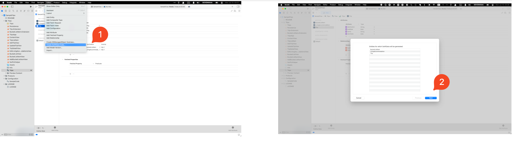
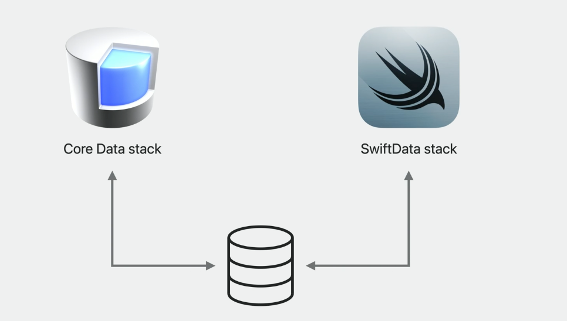
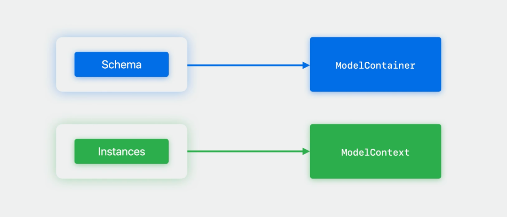
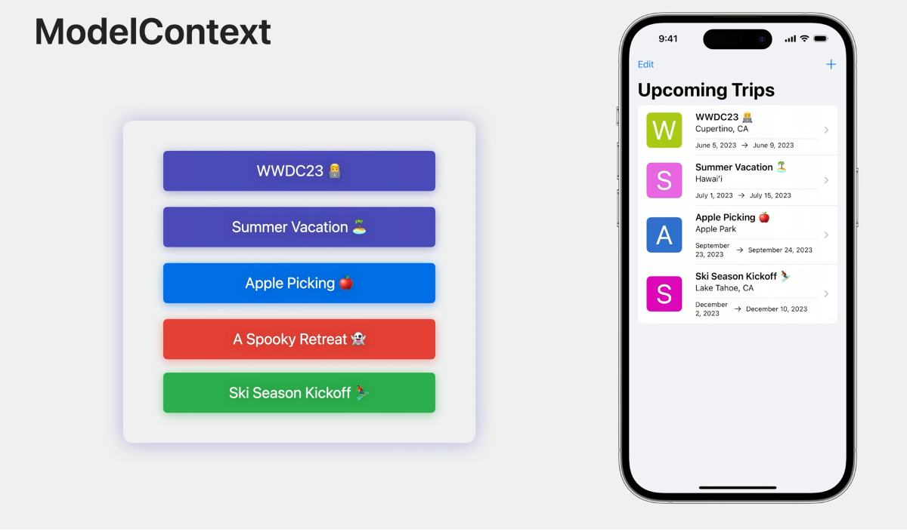

# WWDC23 - SwiftData 全知道

> 本文囊括 WWDC23 中所有的 SwiftData Session（[10187](https://developer.apple.com/wwdc23/10187), [10195](https://developer.apple.com/wwdc23/10195), [10189](https://developer.apple.com/wwdc23/10189), [10196](https://developer.apple.com/wwdc23/10196)），力图在一篇文章内帮助读者建立 SwiftData 的基础认知。你可以在[这里](https://github.com/kukushi/AdoptingSwiftDataForACoreDataApp)下载到本文中所有的代码。
>

## 初见 SwiftData

> 本小节主要基于 [10187 - Meet SwiftData](https://developer.apple.com/wwdc23/10187) 编写。

SwiftData 是 Apple 在 iOS 17／macOS Sonoma 推出的全新数据存储／管理框架。正如 SwiftUI 完全抛弃了 IB，SwiftData 也无需任何额外配置文件。SwiftData 充分利用了 Macro 让使用更加直观顺畅，能够非常自然地集成到了 SwiftUI 中，也能在 CloudKit 和 Widgets 等其他场景使用。

本小节会介绍在 SwiftData 中如何：

- 使用 `@Model` 宏对数据进行建模
- 获取以及修改数据
- 在其他场景中使用 SwiftData

### 强大的 `@Model` 宏

SwiftData 提供了 `@Model` 宏让我们在代码中直接定义数据的 Schema。数据模型（Model）是 SwiftData 中的事实来源（Source of Truth），也是整个存储体验的起点。`@Model` 的一部分功能是将类中的存储属性（Stored Properties）转化为持久化属性（Persisted Properties）。

在类型方面，SwiftData 默认支持：

- 基础值类型（如 `String`、`Int`、`Float` 等）

- 复杂类型（包括 `Struct`、`Enum` 、`Codable`、集合等）

- 数据模型之间的关系（Relationship）和数据集合

此外，还有其他宏来自定义 Schema：

- 使用 `@Attribute` 可以修改模型对应的 Schema。
- 使用 `@Relationship` 可以设置逆向关系和删除传播规则（Delete Propagation Rule）。
- 使用 `@Transient` 可以将指定属性不进行持久化。

> [下个章节](##构建我们的 Schema)将有更多关于如何建构 Schema 的内容。

好了，理论部分已经够多了，来看看实际的 🌰。下面是一个简单的 `Trip` 类，包含了一次旅行的基本信息：

```swift
import SwiftData

@Model
class Trip {
    var name: String
    var destination: String
    var endDate: Date
    var startDate: Date
    /// 愿望清单
    var bucketList: [BucketListItem]? = []
    /// 住所
    var livingAccommodation: LivingAccommodation?
}
```

接下来对代码进行一些改动：

```swift
@Model
class Trip {
    @Attribute(.unique)      /// 1️⃣
    var name: String                               
    var destination: String
    var endDate: Date
    var startDate: Date
 
    @Relationship(.cascade)  /// 2️⃣
    var bucketList: [BucketListItem]? = []
    var livingAccommodation: LivingAccommodation?
}
```

1. `@Attribute(.unique)` 为 `name`  属性添加了一个唯一约束
2. `@Relationship(.cascade)` 使得 `Trip` 在数据库里被删除时，同时删除掉所有关联的 `bucketList`

构建完模型，我们要使用 SwiftData 中的两个关键对象 `ModelContainer` 和 `ModelContext` 驱动整个流程。

Model Container 为数据模型提供了持久化的数据后台。它自带一套易用的默认设置，也支持自定义和设置迁移选项。

```swift
// 1️⃣ 用 Schema 进行初始化
let container = try ModelContainer([Trip.self, LivingAccommodation.self])

// 2️⃣ 用配置（ModelConfiguration）初始化
let container = try ModelContainer(
    for: [Trip.self, LivingAccommodation.self],
    configurations: ModelConfiguration(url: URL("path"))
)
```

如上所示，我们可以使用 `Schema` 进行简单配置，或用 `ModelConfiguration` 进行更定制化的配置，来修改包括本地 URL、CloudKit 和 Group Container Identifier 、迁移选项等。

ModelContainer 配置完成用，我们可以使用 Model Context 来获取和保存数据。SwiftUI 中提供了 View 和 Scene 的修饰器来快速关联一个 Model Container。

```swift
import SwiftUI

@main
struct TripsApp: App {
    var body: some Scene {
        WindowGroup {
            ContentView()
        }
        .modelContainer(
            for: [Trip.self, LivingAccommodation.self]
        )
    }
}
```

Model Context 自动监听所有数据的变化并允许我们据此进行一些操作，包括跟踪变化、获取数据、保存改动、甚至是撤销改动。在完成 Model Container 配置之后，我们通常可以在 SwiftUI 中用 `Environment` 来访问到 `modelContext`，如下：

```swift
import SwiftUI

struct ContextView : View {
    @Environment(\.modelContext) private var context
}
```

在 View 层级之外，从 Model Container 上可以获取到一个共享的主 Actor context，或是直接初始化一个新的 Context。

```swift
let context = container.mainContext

let context = ModelContext(container)
```

Model Context 使用了 Swift 原生的 Predicate 宏、 Fetch Descriptor、Sort Descriptor 来进行自定义数据获取。在 iOS 17 中，`Predicate` 支持 Swift 原生类型并利用宏来简化使用。 相较于 `NSPredicate`,  `Predicate`  有完整的类型检查与完善的 Xcode 补全。让我们来看看 `Predicate` 的例子：

```swift
let today = Date()
let tripPredicate = #Predicate<Trip> { 
    $0.destination == "New York" &&     // 1️⃣
    $0.name.contains("birthday") &&     // 2️⃣
    $0.startDate > today                // 3️⃣
}
```

1. 旅行的 `destination` 必须是 `New York`
2. 旅行的名字必须包含 `birthday`
3. 旅行的开始日期必须在未来

有了 `tripPredicate` 之后，可以开始获取数据了：

```swift
let descriptor = FetchDescriptor<Trip>(predicate: tripPredicate)
let trips = try context.fetch(descriptor)
```

此外，对结果进行排序也是很常见的需求，`SortDescriptor` 支持了原生 Swift 类型和 KeyPath，完美融合到了 Predicate 中，能够快速对结果进行排序：

```swift
let descriptor = FetchDescriptor<Trip>(
    sortBy: SortDescriptor(\Trip.name),
    predicate: tripPredicate
)

let trips = try context.fetch(descriptor)
```

除了 Predicate 和排序之外，SwiftData 也支持指定关联对象，限制结果数、排除未保存变更等更多查询方式。使用 Model Context，SwiftData 让数据的创建、删除、修改变的十分简单！

> [第四章节](##深入 SwiftData)会继续介绍查询的进阶用户

```swift
var myTrip = Trip(name: "Birthday Trip", destination: "New York")

context.insert(myTrip)  // 1️⃣
context.delete(myTrip)  // 2️⃣
try context.save()      // 3️⃣
```

1. 在创建完 Model 对象后，插入到 context 后就可以开始使用包括数据持久化追踪等特性。
2. 删除也很简单，调用 `delete` 让 `context` 把模型标记为删除。
3. SwiftData 支持自动保存，但我们仍可以手动触发保存让所有未保存的改动提交到 Model Container 中。

修改模型的字段和平时修改对象的属性并没有差别，`@Model` 修改了 Model 中存储属性的实现以让 Model Context 能够自动追踪改动并加到下一个 `save` 中。

正如 Core Data 与 UIKit 的关系一样，SwiftData 从设计上就与 SwiftUI 深度集成。SwiftUI 是开始使用 SwiftData 的最简单的方式。无论是设置 Container、获取数据、驱动 View 更新，SwiftUI 中都有对应的接口。开始构建 SwiftData App 的最简单方式是使用 View 和 Scene 的修饰器。在 SwiftUI 中，我们可以配置 Data Store，修改配置、开启撤销（undo），配置自动保存等。SwiftUI 会在 `Environment` 中传递 Model Context，最简单的使用数据的方式是使用 `@Query` ，其简练的语法能够方便的描述出查询请求。

```swift
import SwiftUI

struct ContentView: View  {
    @Query(sort: \.startDate, order: .reverse) var trips: [Trip]
    @Environment(\.modelContext) var modelContext
    
    var body: some View {
       NavigationStack() {
          List {
             ForEach(trips) { trip in 
                 // ...
             }
          }
       }
    }
}
```

对于数据模型的属性，SwiftData 支持所有新的 Observable 特性。SwiftUI 会在这些属性变化时自动刷新 UI。

## 构建我们的 Schema

> 本小节主要基于 [10195 - Model your Schema with SwiftData](https://developer.apple.com/wwdc23/10195) 编写。

这一小节将介绍如何优化 SwiftData 中的 Schema，逐步介绍：

- 充分利用 `@Model` 宏
- 在迁移时如何更新 Schema

### 充分利用 Schema 宏

回到 `Trip` 的例子中：

```swift
@Model
class Trip {
    @Attribute(.unique) var name: String
    var destination: String
    var endDate: Date
    var startDate: Date
 
    @Relationship(.cascade) var bucketList: [BucketListItem]? = []
    var livingAccommodation: LivingAccommodation?
}
```

为了让 Schema 更符合我们的需求，让我们再做一些改动：

```swift
@Model
final class Trip {
    @Attribtue(.unique) var name: String                                          // 1️⃣
    var destination: String
    @Attribtue(originalName: "endData") var end_date: Date                        // 2️⃣
    @Attribtue(originalName: "startData") var start_date: Date                    // 2️⃣

    @Relationship(.cascade) var bucketList: [BucketListItem]? = []
}
```

1. 回顾一下，添加 `@Attribute(.unique)` 让 SwiftData 保证每个 `Trip` 的 `name` 是唯一的。`@Attribute(.unique)` 可以用来修饰任意包括包括数字、字符串、UUID 在内的原始类型（Primitive Types）和对一的关系。

   > 当我们尝试保存一个 SwiftData 中已有的同名 `Trip` 时，SwiftData 会将新值更新到已经老的 `Trip` 中，也就是 Upsert。

2. `end_date` 的命名不符合 Swift 的规范，但如果直接修改命名会被 Swift 视为一个新的字段，原有的数据就丢失了 Schema。 使用 `@Attribute(originalName:"")` 让 SwiftData 来进来一次映射，这样也同时保证了下次更新只会发生一次简单迁移。

除了上面介绍的两个功能外，`@Attribute` 还支持：

- 额外数据：`@Attribute(.externalStorage)`，将数据以二进制的形式持久化在 Store 之外
- 变换（Transformable）：`@Attribute(.transform)`，支持存储类型和内存类型的转换
- Spotlight 集成：`@Attribute(.spotlight)`，自动集成 Spotlight
- Hash Modifier：`@Attribute(hashModifier: "")` 修改 Hash

### Relationship

当我们新添加一个 `BucketListItem` 或 `LivingAccommodation` 到 `Trip` 时， SwiftData 会自动设置好隐式反向关系（Implicit Inverse）。当一个 `Trip` 被删除时，这个隐式反响关联会自动将 `bucketList` 和 `livingAccommodation` 设置为 nil。不过我希望这两个属性能在 `Trip` 被删除时同时也被删除，`@Relationship` 可以满足我的需求。

```swift
@Model 
final class Trip {
    @Attribute(.unique) var name: String
    var destination: String
    @Attribute(originalName: "start_date") var startDate: Date
    @Attribute(originalName: "end_date") var endDate: Date
    
    @Relationship(.cascade)                             // 1️⃣
    var bucketList: [BucketListItem]? = []
  
    @Relationship(.cascade)                             // 1️⃣
    var livingAccommodation: LivingAccommodation?
}
```

1. `@Relationship(.cascade)` 会在数据删除时自动删除所有的关联。

此外，`@Relationship` 还支持：

- `originalName` 修饰器
- 指定一对多（`toMany`）关系最小／最大数量
- Hash Modifier

### 其他 Schema 宏

现在我想统计下一次`Trip`被我浏览过多少次，但我不希望 SwiftData 保存这个数据。该 `@Transient` 登场了。

```swift
@Model 
final class Trip {
    @Transient var tripViews: Int = 0                            // 1️⃣                   
}
```

1. `@Transient` 告诉 SwiftData 不要持久化这个属性，同时我们需要提供一个默认值。

### Migration

`Trip` 经过上述的修改有了许多变化，让了确保每个版本的用户能正常使用，我们需要确认 Schema 能正常迁移。SwiftData 中使用 `VersionedSchema` 与 `SchemaMigrationPlan` 进行迁移。

迁移的步骤可以简述为：

1. 将我们的模型封装在 `VersionedSchema` 中，让 SwiftData 知道具体发生了什么变化
2. 将各个 `VersionedSchema` 按迁移顺序排序，创建一个 SchemaMigrationPlan
3. 定义每个迁移阶段。迁移阶段包含两种类型：
    - 轻量迁移：正如其名，轻量迁移不需要额外代码配置，可以自动生效。诸如添加 `originalName` 和设置关系中的删除规则都属于轻量迁移。
    - 自定义迁移：轻量迁移中不支持的都需要进行自定义迁移，如上述的 `@Attribute(.unique)`。

让我们来看看上面的例子要如何迁移。首先我们需要定义每一版的 Schema，这些 Schema 需要包含对应版本的所有数据模型，如下所示：

```swift
enum SampleTripsSchemaV1: VersionedSchema {
    static var models: [any PersistentModel.Type] {
        [Trip.self, BucketListItem.self, LivingAccommodation.self]
    }

    @Model
    final class Trip {                                             
        var name: String
        var destination: String
        var start_date: Date
        var end_date: Date
    
        // `Trip` 的其他属性...
    }

    // 这个版本中的其他模型...
}

enum SampleTripsSchemaV2: VersionedSchema {
    static var models: [any PersistentModel.Type] {
        [Trip.self, BucketListItem.self, LivingAccommodation.self]
    }

    @Model               
    final class Trip {                                               /// 1️⃣
        @Attribute(.unique) var name: String                         /// 1️⃣
        var destination: String
        var start_date: Date
        var end_date: Date
      
        // `Trip` 的其他属性...
    }

    // 这个版本中的其他模型...
}

enum SampleTripsSchemaV3: VersionedSchema {
    static var models: [any PersistentModel.Type] {
        [Trip.self, BucketListItem.self, LivingAccommodation.self]
    }

    @Model
    final class Trip {                                                 /// 2️⃣
        @Attribute(.unique) var name: String
        var destination: String
        @Attribute(originalName: "start_date") var startDate: Date     /// 2️⃣
        @Attribute(originalName: "end_date") var endDate: Date         /// 2️⃣
    
        // `Trip` 的其他属性...
    }

    // 这个版本中的其他模型...
}
```

1. 第二版的 Model 添加了唯一约束，需要自定义迁移。
2. 第三版的数据进行了重命名，轻量迁移即可。

接着利用上面的 Schema 来创建一个  `SchemaMigrationPlan`：

```swift
enum SampleTripsMigrationPlan: SchemaMigrationPlan {
    static var schemas: [any VersionedSchema.Type] {
        [SampleTripsSchemaV1.self, SampleTripsSchemaV2.self, SampleTripsSchemaV3.self]   // 1️⃣
    }
    
    static var stages: [MigrationStage] {
        [migrateV1toV2, migrateV2toV3]                                                   // 2️⃣
    }

    static let migrateV1toV2 = MigrationStage.custom(                                    // 3️⃣
        fromVersion: SampleTripsSchemaV1.self,
        toVersion: SampleTripsSchemaV2.self,
        willMigrate: { context in
            let trips = try? context.fetch(FetchDescriptor<SampleTripsSchemaV1.Trip>())
                      
            // 对同名 Trip 去重...
                      
            try? context.save() 
        }, didMigrate: nil
    )
  
    static let migrateV2toV3 = MigrationStage.lightweight(                               // 4️⃣
        fromVersion: SampleTripsSchemaV2.self,
        toVersion: SampleTripsSchemaV3.self
    )
}
```

1. 设置所有的 Schema，顺序很重要。
2. 配置每个阶段要如何处理
3. V1 到 V2 需要自定义迁移，我们把当前 Trip 都取出来做一次去重。
4. V2 到 V3 可以轻量迁移

终于配置好了，在 `ModelContainer` 中配置 `migrationPlan` 即可让 App 在启动后开始迁移。通过配置，SwiftData 可以从任一版本的 App 升级到最新版。

```swift
struct TripsApp: App {
    let container = ModelContainer(
        for: Trip.self, 
        migrationPlan: SampleTripsMigrationPlan.self
    )
    
    var body: some Scene {
        WindowGroup {
            ContentView()
        }
        .modelContainer(container)
    }
}
```

小节一下：

- 使用宏来修饰 Model 里的字段以满足我们的需求
- 当 Schema 变更时，用 VersionedSchema 来进行迁移

## 迁移到 SwiftData

> 本小节主要基于 [10189 - Migrate to SwiftData](https://developer.apple.com/wwdc23/10189) 编写。

[SwiftData 底层基于 Core Data 实现](https://developer.apple.com/documentation/SwiftData)。如果你的 App 使用了 Core Data，别担心，SwiftData 可以与 Core Data 同时使用。这个小节也将着重介绍如何从 Core Data 迁移到 Swift Data，包括：

- 生成 SwiftData Model Class
- 实现从 Core Data 到 SwiftData 的全量迁移
- 让 Core Data 与 SwiftData 共存

### 生成 SwiftData Model Class

在 Core Data 中，我们一般使用 Schema Editor 编辑 Model 文件来生产 Managed Object。在 Schema Editor 中选中 Model 文件后，在 Xcode 菜单栏 `Editor -> Create SwiftData Class` 即可生产文件：



```swift
@Model final class Trip {
    var destination: String
    var endDate: Date
    var name: String
    var startDate: Date
    
    @Relationship(.cascade, inverse: \BucketListItem.trip)
    var bucketList: [BucketListItem] = []
    
    @Relationship(.cascade, inverse: \LivingAccommodation.trip)
    var livingAccommodation: LivingAccommodation?
}
```

可以看到生产的 `Trip` 遵循了 `Model` 且所有的属性都转换过来了。

### 从 Core Data 到 SwiftData 的全量迁移

Core Data 架构中包含了 Schema、实体、关系等内容。在开始转换之前，需要确认这些配置在 SwiftData 是否都支持。这意味所有的 Entity 以及它的属性都需要有对应的 SwiftData Model。转换完成后也记得要全面测试我们的 Model 确保所有特性都能正常 Work。

接下来，让我们来看看完整迁移过程中的重点。首先，我们在上面已经生产了对应 SwiftData Model，可以删除掉 Core Data 的 Model 文件了。

接着，我们使用 `modelContainer` 修饰器来为整个 `App` 配置 `modelContainer` 和 `modelContext`。

```swift
@main
struct TripsApp: App {
    var body: some Scene {
        WindowGroup {
            ContentView()
        }
        .modelContainer(
            for: [Trip.self, BucketListItem.self, LivingAccommodation.self]
        )
    }
}
```

ModelContext 能够追踪所有设定 Model 的变化。我们可以再所有的 `Scene` 和 `View` 里访问到它。

```swift
@Environment(\.managedObjectContext) private var viewContext
```

这样我们就设置好了 SwiftData Stack。接下来可以开始使用了，首先是创建对象。在 Core Data 中，创建对象一般会像是这样：

```swift
/// Core Data 中需要使用 context 创建对象
let newTrip = Trip(context: viewContext)
newTrip.name = name
newTrip.destination = destination
newTrip.startDate = startDate
newTrip.endDate = endDate
```

而在 SwiftData 中，创建对象变得无比简单：

```swift
let trip = Trip(name: name, destination: destination, startDate: startDate, endDate: endDate)
modelContext.insert(object: trip)
```

这里可能有读者好奇了，SwiftData 是如何保存改动的？SwiftData 拥有隐式保存功能，在 UI 生命周期事件或在 context 发生改变后（如果需要保存的话）来触发保存操作。

查询数据也变得更加简单。

```swift
// FetchRequest in Core Data
@FetchRequest(sortDescriptors: [SortDescriptor(\.startDate)])
private var trips: FetchResults<Trip>

// Fetch with Query in SwiftData
@Query(sort \.startDate, order: .forward)
var trips: [Trip]
```

`@Query` 中使用了 `.forward` 排序，这样日期更近的 `Trip` 会排在更千面。`@Query` 也支持同时使用一个 `Predicate`。

### 同时使用 SwiftData 和 Core Data

或许对于现实开发中，SwiftData 和 Core Data 共存会是许多开发者面临的场景。共存意味着两个不同的持久化架构，同时使用一个持久化存储。这意味着我们在接入 SwiftData 时不需要完全重写 Core Data 代码。



这种情况下，Core Data 的配置有些不同：

```swift
let url = URL(fileURLWithPath: "/path/to/Trips.store")

if let description = container.persistentStoreDescriptions.first {
    description.url = url                                                            // 1️⃣
    description.setOption(true as NSNumber, forKey: NSPersistentHistoryTrackingKey)  // 2️⃣
}
```

1. 我们需要给 `container` 设置 Persistent Store URL，确保 Core Data 和 SwiftData 使用的是用一个 Store。

2. SwiftData 默认打开了 Persistent History Tracking，因此这里 Core Data 也需要打开。

   > ⚠️： 必须打开 Persistent History Tracking，否则 Store 会进入只读模式。

在很多场景下，共存都可能是最佳的方案。由于 SwiftData 需要 iOS 17 或 macOS Sonoma，大部分应用需要考虑向后兼容，可以选择共存。此外，现实开发中可能受限于资源或时间，逐步迁移到 SwiftData 是一个更务实的方案。

共存很美，但也有一些限制。为了让 Model 和 Entity 命名不冲突，我们需要在其中一个加上前缀。

在上面的例子中，我们生成了 `Trip` Model，我们可以在代码或模型编辑器中添加前缀（示例中加了 `CD`）：

```swift
// class Trip: NSManagedObject {              // 1️⃣
class CDTrip: NSManagedObject {               // 1️⃣
    // ...
}


@Model final class Trip {
    // ...
}
```

此外，我们需要保持两个 Model 的 Schema 同步。无论是 SwiftData 或 CoreData，两者中无论是新的属性、关系都需要同步修改到另外一方。一旦不同步，Store 可能会认为 Model 发生的改变而触发迁移。

最后，Core Data 和 SwiftData 的 Schema Version 也需要保持一致。

对于使用 UIKit 或 AppKit 的 Swift App，也有几个方式集成上 SwiftData。一种是使用共存的方式，UIKit 绑定到 Core Data 上，其他地方可以使用 SwiftData。另外一种是将 SwiftData Model 当作普通的 Swift 类，在 UIKit 代码中直接使用。

## 深入 SwiftData

> 本小节主要基于 [10196 - Dive deeper into SwiftData](https://developer.apple.com/wwdc23/10196) 编写。

在熟悉过基础配置之后，我们将介绍深入介绍 SwiftData 以发挥它的全部能力。本小节会依次介绍如何配置 SwiftData 存储、跟踪以及持久化改动，如何在大规模使用中取得最佳性能。

### 配置 SwiftData 存储

回顾一下第一小节的内容，我们使用了 `@Model` 告诉 SwiftData 想持久化的数据的 Schema。`@Model` 的巧妙之处在于，它尽可能减少了普通 Class 和持久化 Model Class 之间的区别。只需一小点改动，一个普通的 Class 便可化身一变为 SwiftData Model Class。在此之上，SwiftData 也允许我们做出各种定制。

```swift
@Model                                                                    // 1️⃣
final class Trip {
    @Attribute(.unique) var name: String                                  // 1️⃣
    var destination: String
    @Attribute(originalName: "start_date")
    var startDate: Date                                                   // 1️⃣
    @Attribute(originalName: "end_date")
    var endDate: Date                                                     // 1️⃣
    
    @Relationship(.cascade)                                               // 1️⃣
    var bucketList: [BucketListItem]? = []
  
    @Relationship(.cascade)                                                // 1️⃣
    var livingAccommodation: LivingAccommodation?
}
```

这些注解（标记了 1️⃣）的部分，既描述了应用的持久化对象图（Schema）的同时，也作为实际的 Model 接口在使用。这中两面性使得 Model 成为 SwiftData 中的中心点。SwiftData 提供了一套对应的 API 来支持这两种角色。

Schema 会告诉 Model Container 数据如何存储。Model Container 会使用 Schema 来生产一个容纳 Model 实例的数据库。Model 的实例会被链接到一个 Model Context 中，Model Context 也同时追踪和管理这些实例在内存中的状态。



ModelContainer 是我们描述数据被如何在设备中存储（或持久化）的地方。ModelContainer 就像是 Schema 和持久化后台的桥梁。我们可以在 ModelContainer 中设置对象如何存储（是在内存或磁盘上），设定包括版本化、迁移、对象图分离等配置。

初始化 `ModelContainer` 非常简单，我们可以只提供想要存储的 Model Class，SwiftData 会完成剩下的工作，例如：

```swift
// 只用 Trip 初始化 ModelContainer
let container = try ModelContainer(for: Trip.self)
```

由于 `Trip` 和 `BucketListItem`、`LivingAccommodation` 之间是由关联的，所以它等价于：

```swift
// SwiftData 自动推断出关联的数据模型
let container = try ModelContainer(
    for: [
        Trip.self, 
        BucketListItem.self, 
        LivingAccommodation.self
    ]
)
```

此外，SwiftData 提供了 `ModelConfiguration` 让我们可以进行更复杂的配置。`ModelConfiguration` 支持配置 Schema 的持久化方式。它控制了数据的存储位置（如在内存中或磁盘上）。`ModelConfiguration` 支持指定存储文件 URL，也可以使用 App 的 Entitlement（如 Group Container Entitlement）自动生成一个。ModelConfiguration 还可以设定为只读模式，防止写入到敏感或模板数据。使用多个 CloudKit Container 的 App 可以指定其为 ModelContainer Schema 中的一部分。

假设我们需要为 `SampleTrip` 加入一些联系人信息，我需要加入 `Person` 和 `Address`。

```swift
let fullSchema = Schema([                           // 1️⃣
    Trip.self,
    BucketListItem.self,
    LivingAccommodations.self,
    Person.self,
    Address.self
])

let trips = ModelConfiguration(
    schema: Schema([                                 // 2️⃣
        Trip.self,
        BucketListItem.self,
        LivingAccommodations.self
    ]),
    url: URL(filePath: "/path/to/trip.store"),       // 3️⃣
    cloudKitContainerIdentifier: "com.example.trips" // 4️⃣
)

let people = ModelConfiguration(                     // 5️⃣
    schema: Schema([Person.self, Address.self]),
    url: URL(filePath: "/path/to/people.store"),
    cloudKitContainerIdentifier: "com.example.people"
) 

let container = try ModelContainer(for: fullSchema, trips, people) // 6️⃣
```

1. 新的 Schema 新增了 `Person` 和 `Address`
2. ModelConfiguration 也新增了 `Person` 和 `Address`
3. 设定了自定义的 `store` 位置。
4. 设置了 CloudKit 的 Identifier
5. 为联系人（ `Person` 和 `Address` ）设置了独立的 Store 地址和 iCloud Identifier
6. 用 Schema 和配置初始化 ModelContainer

### 跟踪和持久化变动

当我们在  `Scene` 或 `View` 中使用 `modelContainer` 修饰器时，它会在 `Environment` 中新增一个 `modelContext` key 来访问容器的 `mainContext`。这个 `mainContext` 是一个特殊的用于在 Scene 和 View 中使用的 `MainActor` 绑定的 Context。通过这个 context，View 中的代码可以访问的操作 SwiftData。

```swift
struct ContentView: View {
    @Query var trips: [Trip]
    @Environment(\.modelContext) var modelContext
  
    var body: some View {
        NavigationStack (path: $path) {
            List(selection: $selection) {
                ForEach(trips) { trip in
                    TripListItem(trip: trip)
                        .swipeActions(edge: .trailing) {
                            Button(role: .destructive) {
                                modelContext.delete(trip)                     // <-
                            } label: {
                                Label("Delete", systemImage: "trash")
                            }
                        }
                }
                .onDelete(perform: deleteTrips(at:))
            }
        }
    }
}
```

那么 `modelContext` 实际做了什么呢？我们可以将 ModelContext 视为 App 管理的数据的草稿板。



数据在使用时会被获取到 Model Context 中。在 SampleTrips 中，在未来 `Trip` 视图加载列表数据时，每个 Trip 对象都被获取到 Main Context 中。如果对 Trip 进行了编辑，那么改动会被 `ModelContext` 记录为一个快照。当进行其他更改，例如插入／删除一个 `Trip` ，Context 会跟踪和维护这些更改的状态，直到调用 `context.save()` 为止。这意味着即使被删除的 `Trip` 虽然在列表中不可见，但在调用 `save` 之前 仍然会存在于 ModelContext 中。一旦 `save` 被调用，Context 会将所有改动持久化到 ModelContainer 中并清理它的状态。

如果此时还引用着 Context 中的对象（如在列表中显示它们），那在直到使用完成前这些对象会一直存在 Context 中。在使用完后，这些对象会被释放，且 Context 会清空。Model Context 会跟踪我们在 View 中获取的对象，并在执行 `save` 时传播这些更改。Model Context 还支持回滚或重置等功能，以在需要时清除其缓存状态。

在 SwiftUI App 中，`modelContainer` 修饰器有 `isUndoEnabled` 参数，它将 Window 的 `undoManager` 绑定到容器的 `mainContext`。在 Main Context 中进行改动时，无需任何代码即可支持系统手势（如三指滑动和摇动）进行撤销或重做。ModelContext 会自动将撤销和重做操作注册为对模型对象的更改。`modelContainer` 修饰器默认使用了由 Window 或 Window Group 提供了 Environment 中的 `undoManager`。

Model Context 支持的另一个系统功能是自动保存。开启自动保存后，Model Context 将在如 App 进入前台或后台等系统事件时进行保存。在 App 使用过程中，Main Context 也会定期保存。App 默认开启了自动保存，也支持用 modelContainer 修饰器里的 `isAutosaveEnabled` 来禁用。手动创建的 Model Context 不支持自动保存。

```swift
@main
struct TripsApp: App {
   var body: some Scene {
        WindowGroup {
            ContentView()
        }
        .modelContainer(for: Trip.self, isAutosaveEnabled: false)
    }
}
```

### 大规模使用 SwiftData

像是在后台队列上处理数据、与服务器或持久化机制同步以及批处理等任务都需要与以集合或图形的 Model 对象打交道。这些任务大部分会从查询一系列对象开始，结合 Swift 的新 `Predicate` 可以实现非常 Swifty 且强大的查询。

```swift
let context = self.newSwiftContext(from: Trip.self)

predicate = #Predicate<Trip> { trip in
    trip.livingAccommodations.filter {
        $0.hasReservation == false
    }.count > 0
}

descriptor = FetchDescriptor(predicate: predicate)
var trips = try context.fetch(descriptor)
```

此外，SwiftData 也提供了调整结果的能力，如设置 offset 和 limit、控制 faulting 和 prefetching。SwiftData 在 Model Context 上提供了一个新 `enumerate` 函数来实现这些效果。

```swift
context.enumerate(FetchDescriptor<Trip>()) { trip in
    // 对 trip 执行操作
}
```

`enumerate` 将批量遍历模式将平台的最佳事件封装在一个简单的调用中。

```swift
let predicate = #Predicate<Trip> { trip in
    trip.bucketListItem.filter {
        $0.hasReservation == false
    }.count > 0
}

let descriptor = FetchDescriptor(predicate: predicate)
descriptor.sortBy = [SortDescriptor(\.start_date)]

context.enumerate(descriptor) { trip in
    // ...
}
```

`enumerate` 自动实现了诸如批处理和变更保护等最佳实践。这些设置可以根据我们的实际情况进行自定义。例如，`enumerate` 默认使用的批处理大小为 5000，我们可以将其改为 10000 个来减少过程中的 I/O 操作，但同时内存使用会增加。对于含有图片、视频或其他大数据的对象，建议选择较小的批处理大小。来减少内存占用。

`enumerate` 还支持变更保护。遍历包含改动的 context 是在大量遍历过程中最常见的性能问题之一。设置`allowEscapingMutations` 可以告诉 `enumerate`  这种行为是有意的。当未设置 `allowEscapingMutations` 时，如果发现遍历的 `ModelContext` 中包含未提交的变更，`enumerate` 将会抛出异常，避免释放掉已经遍历的对象。

```swift
let predicate = #Predicate<Trip> { trip in
    trip.bucketListItem.filter {
        $0.hasReservation == false
    }.count > 0
}

let descriptor = FetchDescriptor(predicate: predicate)
descriptor.sortBy = [SortDescriptor(\.start_date)]

context.enumerate(
    descriptor,
    batchSize: 500,
    allowEscapingMutations: true                              /// 开启变更保护
) { trip in
   // ...
}
```

## 总结

看到这里你已经对 SwiftData 有了基础的理解，是否已经跃跃欲试？Apple 专门为 SwiftData 提供了一个 [Code Along Session: Build an app with SwiftData](https://developer.apple.com/wwdc23/10154)，运用提到的知识点构建一个简单的多平台卡片展示 App，有兴趣的读者可以跟着一步一步实践加强记忆。

正如上文所说，SwiftData 就像是一个 SwiftUI 版的 Core Data，拥有更现代，更安全的设计，相信在不久的未来，也能成为许多 Swift App 的数据存储选择。

## References

1. [mjtsai on SwiftData](https://mjtsai.com/blog/2023/06/12/swiftdata/)
1. [How to use transformable in SwiftData?](https://developer.apple.com/forums/thread/731450)
