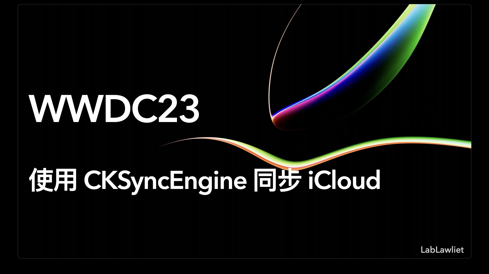

## 个人介绍

>> 作者：LabLawliet，iOS 独立开发者，Swift 爱好者，[GitHub](https://github.com/RyukieSama)。

## 审核介绍

>> Sample：

## 不超过 120 个字的文章简介

>> 通过本文您将了解 `CKSyncEngine` 如何帮助您将人们的 `CloudKit` 数据同步到 `iCloud`。了解当您让系统处理同步操作的调度时，如何减少应用程序中的代码量。

## 公众号/小专栏图文头图

