# Session 10188 - 使用 CKSyncEngine 同步 iCloud

## 前言

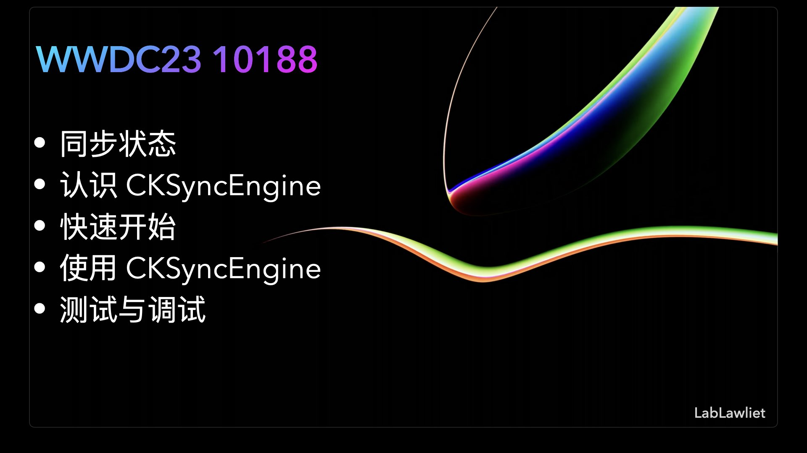

作为一名 `iOS` 独立开发者，开发了多个个人项目，`CloudKit` 是我构建项目体系的核心。非常开心 `CloudKit` 持续的在优化更新，让我这样无后端的独立开发者能够持续发挥想象力输出产品。

本 `Session` 将介绍一个名为 `CKSyncEngine` 的新 `CloudKit API`。 `CKSyncEngine` 旨在帮助设备和云之间同步数据。

首先，我们将谈论在 `Apple` 平台上与 `CloudKit` 同步的状态。然后将概述 `CKSyncEngine` 是什么以及其工作原理。然后，您将了解如何在自己的项目中开始使用 `CKSyncEngine`。一旦设置完成，您将学习如何使用同步引擎在设备之间同步数据。最后，您将学习有关测试和调试与 `CKSyncEngine` 集成的最佳实践。

> 本文基于[Session 10188: Sync to iCloud with CKSyncEngine](https://developer.apple.com/videos/play/wwdc2023/10188/)梳理。
> 
> 通过本文您将了解 `CKSyncEngine` 如何帮助您将人们的 `CloudKit` 数据同步到 `iCloud`。了解当您让系统处理同步操作的调度时，如何减少应用程序中的代码量。
> 
> 本 `Session` 将分享如何自动受益于随着 `CloudKit` 的发展而提高的性能，探索同步实现的测试等内容。
> 
> 为了充分理解本 `Session`，您应对 `CloudKit` 和 `CKRecord` 比较熟悉。

### 1. iCloud in WWDC


很开心第二次参与到 `WWDC 内参`，并再次负责对 `iCloud` 相关的 `Session`。`CKSyncEngine` 的发布我觉得是近三年 `iCloud` 相关最具实用价值的更新。前两年的 `WWDC` 更多的集中在对 `CloudKit` 后台自动化等一些不痛不痒的点的更新。`CKSyncEngine` 让 `iCloud` 同步方案的实现更加灵活。

### 2. 一点分享

我还想分享的一些我的 `iCloud` 实战场景，在我自己的[独立应用](https://apps.apple.com/cn/developer/rongqing-wang/id1264542103)开发过程中，主要有用到三种 `iCloud` 功能开发方案。在我实际开发中同一个应用中会根据具体场景使用不同的方案实现。

#### 方案一： 直接通过 CKRecord 数据流交互，无本地数据

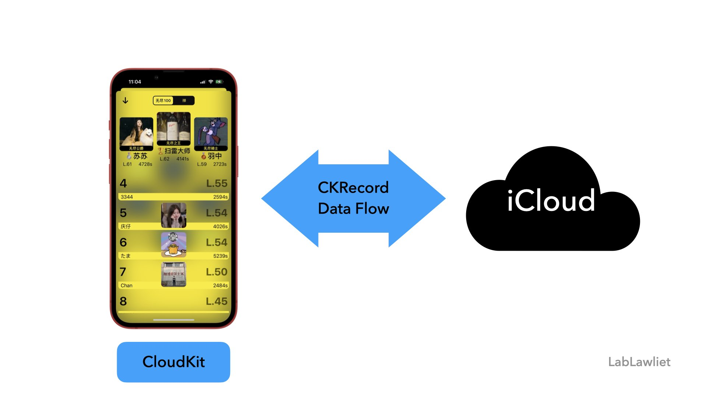

这个 App 是我最早进行 `CloudKit` 功能尝试的作品。保持着平时做需求的思维，通过接口数据驱动 App 展示与交互。而在这里 `CloudKit` 就充当了`服务端`的角色，`CKRecord 数据流`充当了 `JSON 数据流`的角色。

最终基于这个思路实现了一套较为完善的用户体系与排行榜等一系列功能。

> 自从游戏要版号后没办法就把内购都去掉了，这个 App 就处于放养状态了。

#### 方案二： 本地数据库 + FileManager 实现云备份

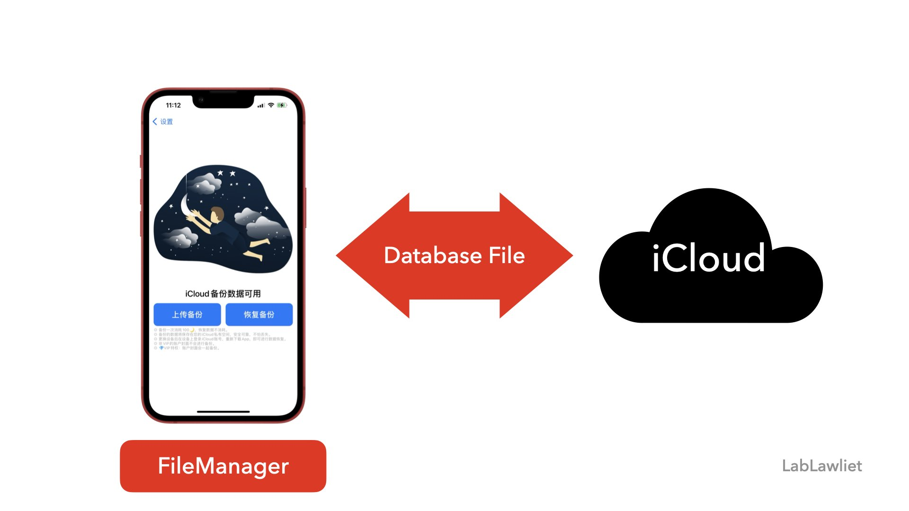

这是一个记账软件，本体使用了较为熟悉的数据库方案，并通过 `FileManaer` 实现`数据库文件`的`上传`与`下载`功能，这个方案比较简单直接粗暴。

除了记账数据库本身的备份需求以外，还根据上一款应用的经验，同样基于 `CloudKit` 构建了一套用户与虚拟货币内购体系。

最终这款基于 `iCloud` 的应用在不同场景下使用了不同的方案。

#### 方案三： CoreData + NSPersistentCloudKitContainer 自动同步

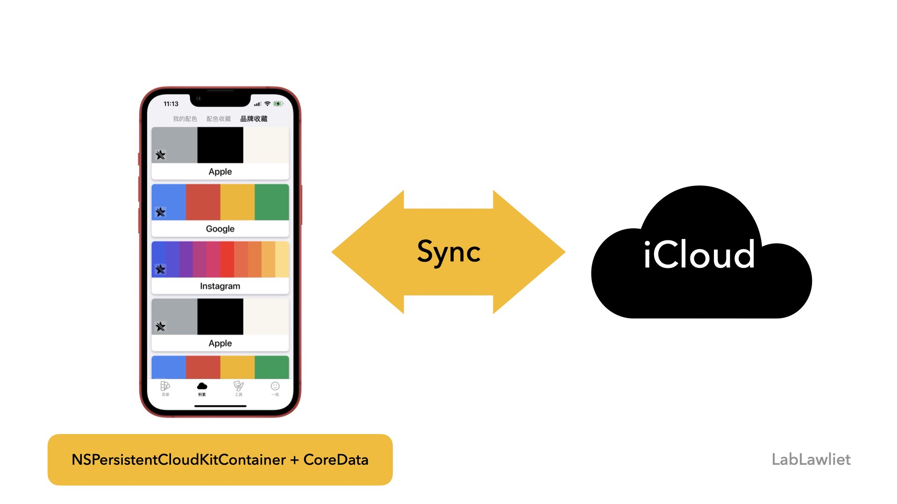

这是一套 `CoreData` 开发文档里推荐的一套非常完善解决方案。本地 `CoreData` 数据库通过 `NSPersistentCloudKitContainer` 与 `CloudKit` 后台进行同步。

在这款应用内，收藏夹就是通过这套方案实现的。

当然后续的用户体系与一些强持久化的需求我依旧会去使用第一种方案。也欢迎前往[AppStore](https://apps.apple.com/cn/developer/rongqing-wang/id1264542103)体验交流。

> [Apple Demo: Synchronizing a local store to the cloud](https://developer.apple.com/documentation/coredata/synchronizing_a_local_store_to_the_cloud)

下面看看全新的 `CKSyncEngine` 能够带来什么新的东西吧！

## 一、 同步状态

`CloudKit` 本身并不复杂，但是同步这件事却是困难的。当涉及多个设备同步的场景时，可能会出现许多问题。

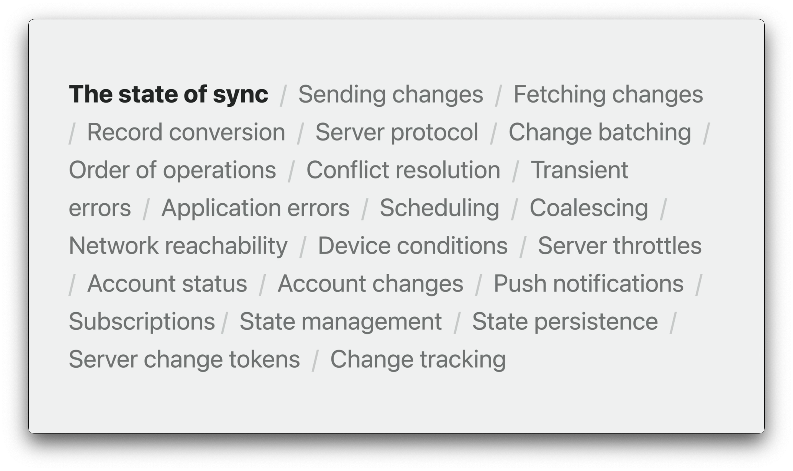

因此，我们的同步代码尽可能简单越好。而简化同步代码的最佳方法是尽可能少地编写代码。

值得庆幸的是，您可以通过一些很棒的 `API` 来与 `CloudKit` 同步，并且这些 `API` 会为您完成大部分繁重工作。

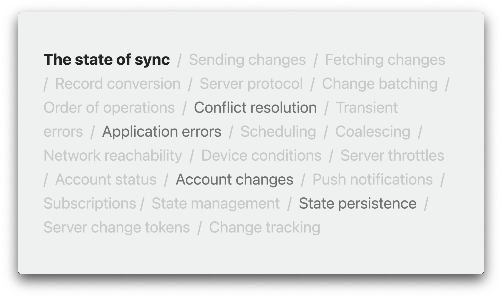

### 选择合适的方案

* 如果您希望拥有包括本地持久化的全栈解决方案，可以使用 `NSPersistentCloudKitContainer`。

* 如果您想使用自己的本地持久化，则可以使用新的 `CKSyncEngine API`。

* 如果您仍然认为需要更精细的控制，则可以使用 `CKDatabase` 和 `CKOperations`。

* 如果您想要与 `CloudKit` 同步，但没有使用 `NSPersistentCloudKitContainer`，您应该使用 `CKSyncEngine`。

同步涉及许多组件，使用像 `CKSyncEngine` 这样的更高级 `API` 可以有效减少复杂性并改善应用程序的同步体验。

同步的核心是将一个设备的更改发送到另一个设备，并在需要时从 `CloudKit` 中转换提取数据。如果仅仅如此就很容易了，但不仅如此。您需要了解所有不同的操作和错误，监视系统条件，监听帐户更改，处理推送通知，管理订阅，跟踪一堆状态等等。

当您使用 `CKSyncEngine` 时，您需要编写的同步代码量变得更小而且更专注于业务逻辑。您只需要处理特定于应用程序的事件，而同步引擎则处理其余部分。

## 二、 认识 CKSyncEngine

`CKSyncEngine` 封装了与 `CloudKit` 数据库同步的常见逻辑。它旨在提供方便的 `API`，同时也在必要时提供灵活性。它旨在满足大多数应用程序的需求，否则开发者将自己编写自定义同步引擎。

通常，如果您想要同步应用程序的私有或共享数据，`CKSyncEngine` 是一个很好的选择。用于同步引擎的数据模型由 `记录` 和 `存储区域` 组成，并与 `CloudKit` 中的数据结构一致。您可以使用任何现有的 `CloudKit API` 访问其中的任何数据。因此，如果您已经有一个现有的 `CloudKit` 同步实现，则 `CKSyncEngine` 也可以与其同步。

同步引擎正在系统中的几个应用程序和服务中使用，包括 `Freeform` 应用程序。另一个例子是 `NSUbiquitousKeyValueStore`，在同步引擎的上层进行了重写。这是一个向后兼容的很好的例子。在较新的操作系统中，它使用同步引擎，但也与以前的版本同步。

因此，如果您已经具有自定义 `CloudKit` 同步实现，则可以选择切换到 `CKSyncEngine`。如果收益足够，则可以考虑切换，但这不是必需的。有时，只需要较少的代码来维护会更好。每当 `CKSyncEngine` 获得新的增强功能时，您也将从中受益。

随着平台的发展，同步引擎也会优化，使同步变得更加容易和高效。您还可能通过更简介的 `CKSyncEngine API` 获益。这使您可以专注于应用程序的特定数据模型和用例。如果您正在考虑使用 `CKSyncEngine`，但是有一些特定需求它不支持，那么您始终可以根据需要构建自己的同步引擎。

### 1. 同步引擎的工作原理

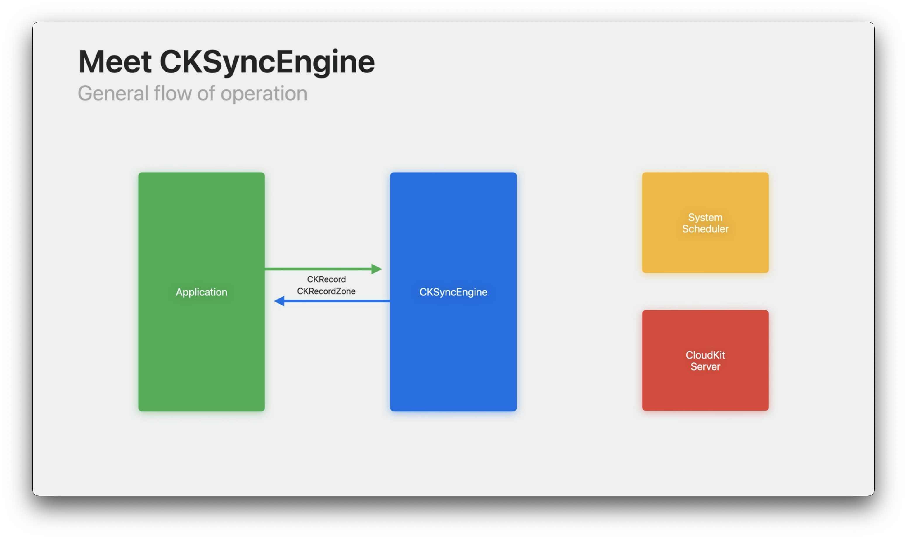

一般来说，同步引擎充当您的应用程序和 `CloudKit 服务器` 之间数据的传输渠道。您的应用程序以记录和区域的形式与同步引擎通信。

当要保存更改时，您的应用程序将它们交给同步引擎。当在另一个设备上提取这些更改时，同步引擎会将它们提供给您的应用程序。


即便如此，当同步引擎有任务需要执行时，它并不总是立即执行。如果它需要与服务器通信，它将首先咨询系统任务调度程序。这是操作系统中用于后台任务管理的相同调度程序，它确保设备已准备好进行同步。


一旦设备就绪，调度程序运行任务，同步引擎与服务器通信。这是同步引擎的基本操作流程。

### 2. 同步引擎与服务器交互

当同步引擎向服务器发送更改时，它是什么样子呢？

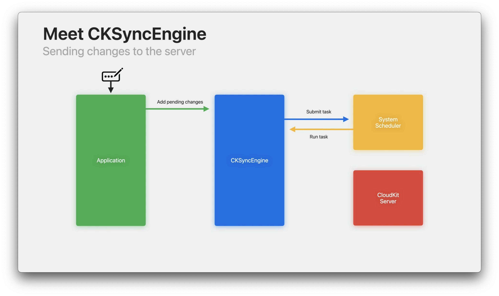

首先，有人对数据进行修改。也许他们输入了一些内容，或者翻转了开关，或者删除了一个对象。然后，您的应用程序告诉同步引擎有一个待处理的更改需要发送到服务器。这让同步引擎知道它有任务要做。接下来，同步引擎向调度程序提交任务。一旦设备就绪，调度程序运行任务。

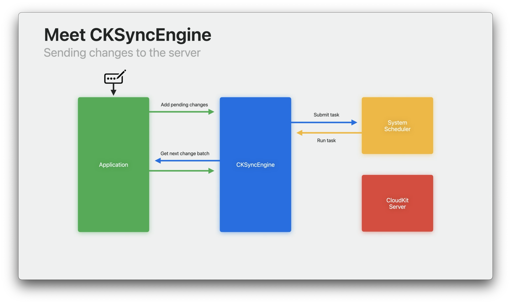

当任务运行时，同步引擎开始将更改发送到服务器的过程。为了实现这一点，它会要求您的应用程序提供要发送的下一批更改内容。

如果有人只做了一个修改，则您可能只有一个待处理的更改。但是，如果有人导入了一个包含大量新数据的数据库，则您可能有数百或数千个更改。

由于单个请求可以发送到服务器的数量有限，因此同步引擎会分批请求这些更改。这也有助于减少内存开销，并且在实际需要之前不会将任何记录带入内存中。


在您提供下一批之后，同步引擎将其发送到服务器。服务器将回复操作的结果，包括有关这些更改成功或失败的任何信息。


一旦请求完成，同步引擎将使用结果回调到您的应用程序中。这是您对操作的成功或失败做出反应的机会。如果您有任何待处理的更改，同步引擎将继续请求批次，直到没有剩余内容需要发送。

### 3. 从服务器拉取更新

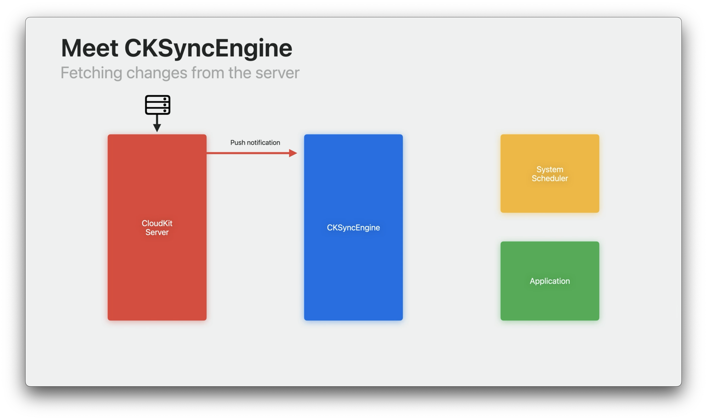

现在，一个设备已经将一些数据发送到服务器，其他设备将获取该数据。当服务器接收到新更改时，它会向具有访问权限的其他设备发送推送通知。

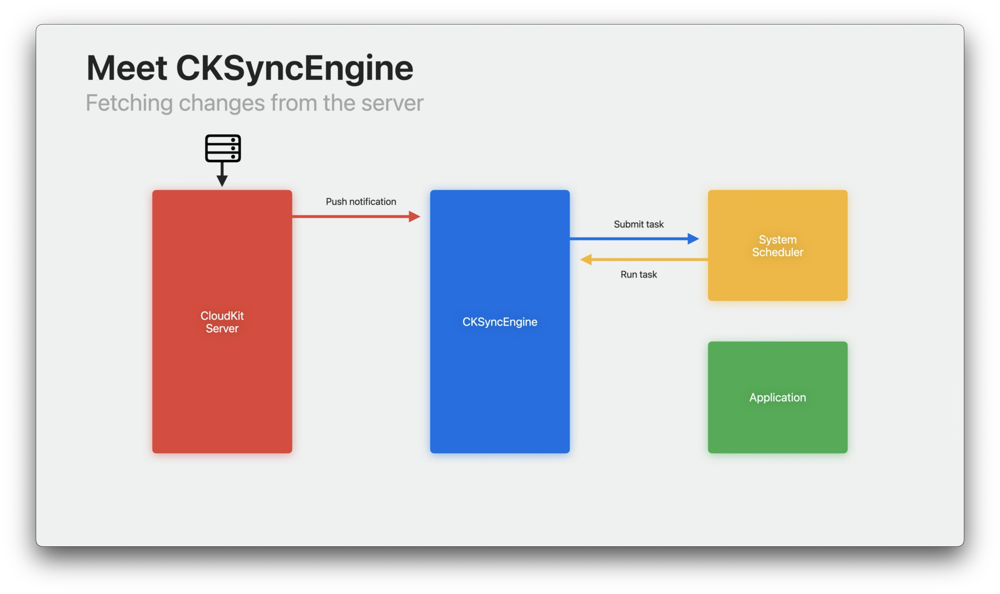

`CKSyncEngine` 会自动在您的应用程序中监听这些推送通知。当它收到通知时，它会向调度程序提交一个任务。


当调度程序任务运行时，同步引擎会从服务器获取数据。


获取新更改时，它将其提供给您的应用程序。这是您将更改持久保存到本地并在 `UI` 中显示它们的机会。

这就是使用同步引擎时基本的操作流程。

### 4. 总结

所有这些流程都有一个共同点，即系统调度程序。一般来说，在执行任何操作之前，`CKSyncEngine` 都会咨询调度程序。这就是它能够帮助您自动进行同步的原因。

调度程序会监视系统条件，例如网络连接性、电池电量、资源使用情况等等。它确保设备在尝试同步之前满足任何先决条件。通过尊重调度程序，同步引擎可以确保用户体验和设备资源之间的平衡。

在正常情况下，同步将非常快，通常在几秒钟内完成。但是，如果没有网络连接或者设备的电池电量低，同步可能会延迟或推迟。如果设备负载过重，您不希望您的同步机制干扰您的应用程序中其他更紧急的任务。通过依赖同步引擎的自动调度，您可以放心地进行同步，并避免在不必要时进行同步。它不仅更高效，而且更容易使用。如果您不必担心何时进行同步，您可以专注于其他所有事情。

即便如此，手动执行同步也存在合适的使用场景。您可能具有立即获取最新数据的下拉刷新功能。或者您可能有一个按钮，可以立即备份现有服务器上的任何待处理更改。在编写自动化测试时，手动同步也很有用。它可以帮助您模拟跨多个设备的特定同步场景，其中需要控制事件的顺序。

总的来说，我们建议您依赖自动同步调度。但是，我们理解存在手动同步的相关场景，同步引擎在必要时有 `API` 可供使用。

## 三、 快速开始

### 1. 项目配置

在使用 `CKSyncEngine` 之前，您需要完成一些设置项目的工作。这些要求与您是使用 `CKSyncEngine` 还是构建自己的自定义 `CloudKit` 实现无关。

首先，您需要基本了解 `CloudKit` 的基本数据类型 `CKRecord` 和 `CKRecordZone`。同步引擎API大量使用 `CKRecord` 和 `CKRecordZone`，因此您应该在深入研究之前了解它们是什么。

接下来，您需要在 `Xcode` 中为您的项目启用 `CloudKit` 功能。最后，由于同步引擎依赖推送通知来保持最新，因此您还需要启用远程通知功能。

一旦做好所有准备，您就可以初始化同步引擎。您应该在应用程序启动后很快初始化您的 `CKSyncEngine`。初始化同步引擎后，它将自动在后台监听推送通知和调度程序任务。这些通知和任务可能随时发生，同步引擎需要初始化才能处理它们。

### 2. 设置代理监听

您的应用程序与 `CKSyncEngine` 之间的主要通信手段是通过名为 `CKSyncEngineDelegate` 的协议进行的。在初始化同步引擎时，您需要提供一个符合此协议的对象。为了正常高效地运行，同步引擎会跟踪一些内部状态。您还需要提供同步引擎状态的最后已知版本。

在执行同步操作时，它会定期向您的代理对象提供此状态的更新版本，形式为状态更新事件。每当同步引擎给您一个新的状态序列化时，您都应将其本地持久化。这样，下次您的进程启动并初始化同步引擎时，就可以提供它。为了帮助理解这一点，我将使用几个代码示例来说明。

```Swift
actor MySyncManager : CKSyncEngineDelegate {
    
    init(container: CKContainer, localPersistence: MyLocalPersistence) {
        let configuration = CKSyncEngine.Configuration(
            database: container.privateCloudDatabase,
            /// 初始化时提供本地持久话的版本信息
            stateSerialization: localPersistence.lastKnownSyncEngineState,
            delegate: self
        )
        /// 初始化引擎
        self.syncEngine = CKSyncEngine(configuration)
    }
    
    func handleEvent(_ event: CKSyncEngine.Event, syncEngine: CKSyncEngine) async {
        switch event {
        /// 处理更新事件
        case .stateUpdate(let stateUpdate):
            /// 本地持久化数据版本
            self.localPersistence.lastKnownSyncEngineState = stateUpdate.stateSerialization
        }
    }
}
```

为了初始化同步引擎，您将传递一个配置对象。在配置中，您需要提供要与之同步的数据库、同步引擎状态的最后已知版本和您的代理对象。代理协议中的一个功能是处理事件函数。该函数是同步引擎通知您的应用程序有关正常同步操作期间发生的不同事件的方式。例如，当从服务器获取新数据或帐户更改时，它将发布事件。其中一个事件是状态更新事件。当同步引擎更新其内部状态，或您自己更新状态时，同步引擎将发布状态更新事件。响应此事件时，您应该本地持久化此新的序列化状态。在示例中，您将在下次初始化同步引擎时使用此状态序列化。

## 四、 使用 CKSyncEngine

现在基础设置已完成，接下来介绍如何使用同步引擎进行同步。

### 1. 将数据发送到服务端

首先，将 `待处理 RecordZone 更改` 和 `待处理 Database 更改` 添加到同步引擎中。这将提醒同步引擎应该安排一次同步。同步引擎将确保一致性并去重这些更改。

接下来，实现代理方法 `nextRecordZoneChangeBatch`。同步引擎将调用此方法获取要发送到服务器的下一批记录区域更改。

```Swift
func userDidEditData(recordID: CKRecord.ID) {
    // Tell the sync engine we need to send this data to the server.
    // 向同步引擎添加变更，传入变更的记录的 RecordID
    self.syncEngine.state.add(pendingRecordZoneChanges: [ .save(recordID) ])
}

/// 要发送到服务器的下一批更改
func nextRecordZoneChangeBatch(
    _ context: CKSyncEngine.SendChangesContext, 
    syncEngine: CKSyncEngine
) async -> CKSyncEngine.RecordZoneChangeBatch? {

    let changes = syncEngine.state.pendingRecordZoneChanges.filter { 
        context.options.zoneIDs.contains($0.recordID.zoneID) 
    }

    return await CKSyncEngine.RecordZoneChangeBatch(pendingChanges: changes) { recordID in
        self.recordToSave(for: recordID)
    }
}
```

最后，处理事件 `sentDatabaseChanges` 和 `sentRecordZoneChanges`。这些事件将在更改已发送到服务器后发布。

这是一个发送更改到服务器的示例。该应用程序编辑数据并希望同步新记录更改。为此，您将向同步引擎状态添加待处理记录区域更改，以告诉它您需要保存该记录。当同步引擎准备好同步记录时，它将调用代理方法 `nextRecordZoneChangeBatch`。在此处，您将返回要发送到服务器的下一批更改。通过提供待处理更改列表和记录提供程序来初始化 `RecordZoneChangeBatch`。待处理更改列表包含要保存或删除的 `RecordID`，记录提供程序将在实际同步发生时将这些ID映射到记录上。

### 2. 从服务端获取数据

以下是您的应用程序如何从服务器获取更改的示例。

#### 处理拉取数据事件

同步引擎会自动为您从服务器获取更改。当它这样做时，它将发布事件 `fetchedDatabaseChanges` 和 `fetchedRecordZoneChanges`。

您可能希望侦听事件 `willFetchChanges` 和 `didFetchChanges`。例如，在获取更改之前或之后执行任何设置或清理任务可能很有用。

当同步引擎在记录区域内获取更改时，它将发布 `fetchedRecordZoneChanges` 事件。此事件包含由另一个设备执行的修改和删除。在监听此事件时，您应该检查获取到的修改和删除。当您接收到修改时，应该将数据本地持久化。当您接收到删除时，应该在本地删除数据。获取数据库更改的过程非常类似，并且可以使用相同的方法处理。

```Swift
func handleEvent(_ event: CKSyncEngine.Event, syncEngine: CKSyncEngine) async {
    switch event {
        
    case .fetchedRecordZoneChanges(let recordZoneChanges):
        for modifications in recordZoneChanges.modifications {
            // Persist the fetched modification locally
            // 将获取的修改本地持久化。
        }

        for deletions in recordZoneChanges.deletions {
            // Remove the deleted data locally
            // 在本地删除已删除的数据。
        }

    case .fetchedDatabaseChanges(let databaseChanges):      
        for modifications in databaseChanges.modifications {
            // Persist the fetched modification locally
            // 将获取的修改本地持久化。
        }
      
        for deletions in databaseChanges.deletions { 
            // Remove the deleted data locally
            // 在本地删除已删除的数据。
        }

    // Perform any setup/cleanup necessary
    // 执行任何必要的设置/清理操作。
    case .willFetchChanges, .didFetchChanges:
        break

    // 错误处理、账户处理见下文
    }
}
```

#### 错误处理

处理错误可能有些棘手。同步引擎也可以帮助解决这个问题。同步引擎自动处理瞬态错误，例如网络问题、限流和帐户问题。同步引擎将自动重试受这些错误影响的任务。对于其他错误，您的应用程序需要处理它们。一旦解决了这些错误，如果必要，您应该重新安排该任务。

当发布 `sentRecordZoneChanges` 事件时，您应该检查 `failedRecordSaves` 以查看是否有任何记录保存失败。

* `serverRecordChanged` 表示记录在服务器上已更改。这意味着另一个设备保存了应用程序尚未获取的新版本。您应该解决冲突并重新安排工作。
* `zoneNotFound` 表示服务器上尚不存在该区域。要解决此问题，您可能需要创建该区域，然后重新安排工作。同步引擎始终首先尝试保存区域，然后再保存记录。
* `networkFailure`、 `networkUnavailable`、 `serviceUnavailable` 和 `requestRateLimited` 等瞬态错误是同步引擎将为您处理的。您仍将接收到这些错误以便知晓，但不需要对其采取措施。当系统条件允许时，同步引擎将自动重试这些错误。

```Swift
func handleEvent(_ event: CKSyncEngine.Event, syncEngine: CKSyncEngine) async {
    switch event {
        
    // 数据拉取，见上文
      
    case .sentRecordZoneChanges(let sentChanges):

        for failedSave in sentChanges.failedRecordSaves {
            let recordID = failedSave.record.recordID

            switch failedSave.error.code {

            case .serverRecordChanged:
                if let serverRecord = failedSave.error.serverRecord {
                    // Merge server record into local data
                    // 合并云端数据到本地
                    syncEngine.state.add(pendingRecordZoneChanges: [ .save(recordID) ])
                }
            
            case .zoneNotFound: 
                // Tried to save a record, but the zone doesn't exist yet.
                // 尝试保存记录，但对应的 RecordZone 不存在。
                syncEngine.state.add(pendingDatabaseChanges: [ .save(recordID.zoneID) ])
                syncEngine.state.add(pendingRecordZoneChanges: [ .save(recordID) ])
             
            // CKSyncEngine will automatically handle these errors
            // CKSyncEngine 会自动处理这些错误
            case .networkFailure, .networkUnavailable, .serviceUnavailable, .requestRateLimited:
                break
              
            // An unknown error occurred
            default:
                break
            }
        }

      // 用户切换，后面补充
    }
}
```

#### 账户问题

同步引擎帮助处理的另一件事是帐户更改。`iCloud` 帐户更改可以随时发生在设备上。同步引擎帮助您管理和响应这些更改。同步引擎会侦听更改，并使用 `accountChange` 事件通知您以指示登录、注销或帐户切换。根据类型，您的应用程序应准备好进行更改处理。同步引擎将不会开始与 `iCloud` 同步，直到设备上存在帐户。您可以随时初始化同步引擎，并且它将在有帐户更改时自动更新。

```Swift
func handleEvent(_ event: CKSyncEngine.Event, syncEngine: CKSyncEngine) async {
    switch event {
    
    // 数据拉取、错误处理，见上文

    case .accountChange(let event):
        switch event.changeType {

        // Prepare for new user
        // 为新用户做准备（登陆了 iCloud 账户）
        case .signIn:
            break
          
        // Delete local data
        // 删除本地数据（退出了 iCloud 账户）
        case .signOut:
            break
          
        // Delete local data and prepare for new user
        // 删除本地数据并为新用户做准备（切换了 iCloud 账户）
        case .switchAccounts: 
            break
        }
    }
}
```

#### 共享数据

与其他用户共享数据是 `CloudKit` 的重要部分。同步引擎在这方面也使其更轻松。同步引擎与 `CloudKit` 共享数据库一起工作。您只需要为应用程序使用的每个数据库创建一个同步引擎。

例如，您可以为私有数据库创建一个同步引擎，为共享数据库创建另一个同步引擎。要了解有关使用 `CloudKit` 共享的更多信息，请查看 ["Get the most out of CloudKit Sharing" 技术讲座](https://developer.apple.com/videos/play/tech-talks/10874)。这涵盖了使用 `CKSyncEngine` 的内容。

```Swift
let databases = [ container.privateCloudDatabase, container.sharedCloudDatabase ]

let syncEngines = databases.map {
    var configuration = CKSyncEngine.Configuration(
        database: $0,
        stateSerialization: lastKnownSyncEngineState($0.databaseScope),
        delegate: self
    )
    return CKSyncEngine(configuration)
}
```

## 五、 测试与调试

自动化测试是确保代码稳定性并快速开发的最佳方式。使用同步引擎，您可以使用多个 `CKSyncEngine` 实例模拟设备之间的用户流程。您应该模拟应用程序可能遇到的极端情况。为此，您可以通过将 `automaticallySync` 设置为 `false` 来干预同步引擎流程。

以下是一个测试用例，模拟两个设备和服务器之间的数据冲突。此测试的目的是模拟用户在使用多个设备时所采取的完整流程。同时也验证冲突解决。

```Swift
func testSyncConflict() async throws {
    // Create two local databases to simulate two devices.
    // 模拟两台设备
    let deviceA = MySyncManager()
    let deviceB = MySyncManager()
    
    // Save a value from the first device to the server.
    // 从 A 设备保存一个变更到服务器
    deviceA.value = "A"
    try await deviceA.syncEngine.sendChanges()
    
    // Try to save the value from the second device before it fetches changes.
    // The record save should fail with a conflict that includes the current server record.
    // In this example, we expect the value from the server to win.
    /**
    在第二个设备 B 获取更改之前也尝试保存值。
    记录保存应该会因冲突而失败，并包括当前的服务器记录。
    在此示例中，我们期望服务器上的值优先。
    */
    deviceB.value = "B"
    XCTAssertThrows(try await deviceB.syncEngine.sendChanges())
    XCTAssertEqual(deviceB.value, "A")
}
```

首先，使用 `MySyncManager` 模拟两个设备。在这个示例中，`MySyncManager` 创建一个本地数据库和同步引擎。`设备 A` 将该值设置为 `A` 并将其更改发送给服务器。在 `设备 B` 从服务器获取更改之前，我们要求它也将更改发送到服务器。由于 `设备 A` 先保存到服务器，因此预计 `设备 B` 的保存将失败。这将导致服务器记录更改错误，从而启用本地冲突解决代码。此示例期望冲突解决优先考虑来自服务器的数据，因此 `设备 B` 上的新值将是最近从 `设备 A` 发送到服务器的值。

以下是一些可以帮助加速测试和调试的关键点。了解每个设备上事件序列可以帮助确定应用程序可能存在问题的流程位置。在开发时尽可能记录日志将有助于跟踪这些流程，并比较多个设备上的日志。`CloudKit` 会记录您收到的每个事件，但您还应该记录其周围的操作。记录 `RecordID` 和 `ZoneID` 可以帮助调试同步引擎、服务器和其他设备之间正在流动的数据。编写模拟每个用户流程的测试将有助于在扩展代码库时保持稳定性。在拼凑拼图时查看时间戳。您可能只有少量的同步操作，或者在短时间内有很多操作。确保您正在追踪正确的操作是在多个设备之间进行调试的关键。

这些步将有助于使用 `CKSyncEngine` 创建和维护可靠、持久的应用程序。

## 总结

通过本 `Session` 了解 `CKSyncEngine` 后，我认为，`CKSyncEngine` 其实是将 `NSPersistentCloudKitContainer` 内部对 `CoreData` 数据进行同步的功能抽了出来，更加灵活通用。解决了 `NSPersistentCloudKitContainer` 强绑定 `CoreData` 的缺点，对于不使用 `CoreData` 又想方便的进行 `iCloud` 云备份的开发者来说是极大的利好。

对于已经采用了 `CoreData + NSPersistentCloudKitContainer` 方案的项目来说没有必要进行切换。就我个人的项目而言，那款记账软件是比较适合切换到 `CKSyncEngine` 的，因为持久化方案没有使用 `CoreData`，而是 `SQLite`，并通过 `FileManager` 进行对文件整体进行 `iCloud` 备份的。我需要做的就是在更改数据的时候将对应的更改同步提交给 `CKSyncEngine`，并在适当的时候处理引擎相关的事件。

## 推荐阅读

> [CKSyncEngine 文档](https://developer.apple.com/documentation/cloudkit/cksyncengine)
> 
> [示例代码：需要 Xcode15](https://github.com/apple/sample-cloudkit-sync-engine)
> 
> [Get the most out of CloudKit Sharing](https://developer.apple.com/videos/play/tech-talks/10874)
> 
> [LabLawliet: 基于 iCloud 构建独立项目用户体系](https://mp.weixin.qq.com/s/W7XuE3rNaIyjFblrkEoDtQ)
> 
> [Core Data](https://developer.apple.com/documentation/coredata)
> 
> [Synchronizing a local store to the cloud](https://developer.apple.com/documentation/coredata/synchronizing_a_local_store_to_the_cloud)
> 
> [【WWDC22 10115/10119】优化 CoreData & CloudKit 实现](https://xiaozhuanlan.com/topic/5821964073)
> 
> [【WWDC22 10116】初见 CKTool JS](https://xiaozhuanlan.com/topic/8235470691)
> 
> [【WWDC21 10086】CloudKit 新特性](https://xiaozhuanlan.com/topic/6132549708)
> 
> [【WWDC21 10118】CloudKit 自动化开发](https://xiaozhuanlan.com/topic/4917635208)
> 
> [【WWDC21 10015】Build apps that share data through CloudKit and Core Data](https://developer.apple.com/videos/play/wwdc2021/10015/)