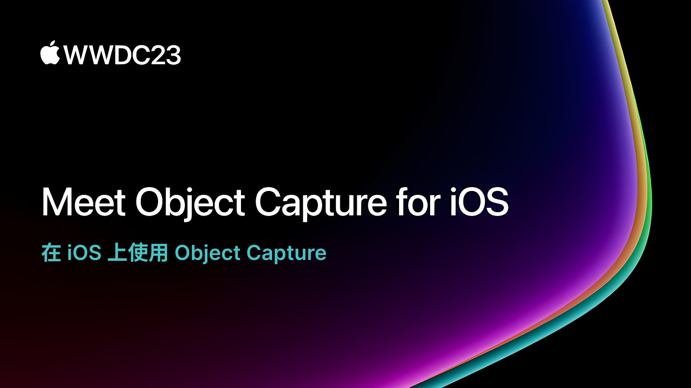

## 个人介绍

轻舟，目前就职于少数派，负责移动端业务，SwiftGG 翻译组成员。

## 审核介绍

SatanWoo，老司机技术成员，就职于阿里巴巴淘宝，负责 端智能 / AR / VR 等技术。

黄骋志：老司机技术轮值主编，目前就职于字节跳动，参与西瓜视频质量与稳定性工作。对 OOM/Watchdog 较为了解并长期投入。

## 不超过 120 个字的文章简介

今年，Apple 将 Object Capture 技术带到了 iOS 平台，利用这项技术，你可以随时随地使用你的移动设备为你身边的物体创建 3D 模型。它可以应用在项目中，在你的手机上预览，甚至是在新发布的 Apple Vision Pro 上查看。让我们一起来探索这项令人兴奋的技术。

## 公众号/小专栏图文头图

