# WWDC23 10191 - 在 iOS 上使用 Object Capture

本文基于 [Session 10191](https://developer.apple.com/videos/play/wwdc2023/10191) 梳理。

> 相关 Session ：
> WWDC 21 Session 10076 - [Create 3D models with Object Capture](https://developer.apple.com/videos/play/wwdc2021/10076/)
> WWDC 21 Session 10078 - [AR Quick Look, meet Object Capture](https://developer.apple.com/videos/play/wwdc2021/10078)
> WWDC 23 Session 10083 - [Meet Reality Composer Pro](https://developer.apple.com/videos/play/wwdc2023/10083)

## 概述

在 2021 年 WWDC 上，Apple 发布了 Object Capture 技术，使用 Object Capture API 能够将 iPhone 或者 iPad 等拍摄的一系列照片转化为针对 AR 优化的高质量 3D 模型，这些 USDZ 文件可以在 AR Quick Look 中查看，无缝集成到 Xcode 项目中或者在专业的 3D 工作流程中使用。这项技术为开发者们提供了一种非常便捷的方式来为日常生活中的物体创建 3D 模型，其发布后显著降低了模型创建的门槛，促进了 Apple 的 AR 开发者生态的发展，也为 Apple vision pro 的发布做出了铺垫。如果你对 Object Capture 还不太了解，建议在阅读本文之前看一下 WWDC21 发布的 [Create 3D models with Object Capture](https://developer.apple.com/videos/play/wwdc2021/10076/)，也可以通过我们 [WWDC21 内参](https://xiaozhuanlan.com/wwdc21) 中的 [【WWDC21 10076/10078】使用 Object Capture 创建 3D 模型](https://xiaozhuanlan.com/topic/8026419753) 一文来快速了解 Object Capture。

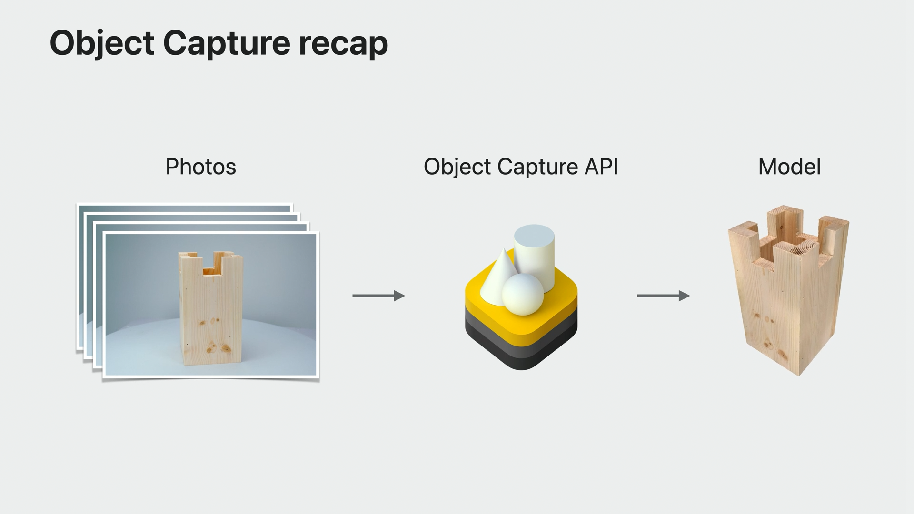

尽管 Object Capture 已经跨越了一大步，但是普通用户对这项技术的感知依然不多，其无法普及的主要原因在于模型生成的门槛较高，模型构建需要在 Mac 上进行，在过去这段时间，基本市面上所有的模型生成 app 都是在本地拍照采集图像，上传到服务端进行构建，很多应用由于本地采集的手机设备以及网络等原因，生成的模型效果以及操作体验不尽人意。或许由于一整套流程不够顺畅的原因，Apple 这次对这项技术进行了大幅升级，除了可以在 iOS 上直接生成模型这一杀手锏特性，还在用户采集体验，模型生成性能和效果等多个方面进行了优化，接下来我将一一为大家介绍这些改进。

本文会先为大家介绍 Session 中的新特性和 API 的使用，然后会列举一些苹果建议的最佳实践和需要注意的方面。

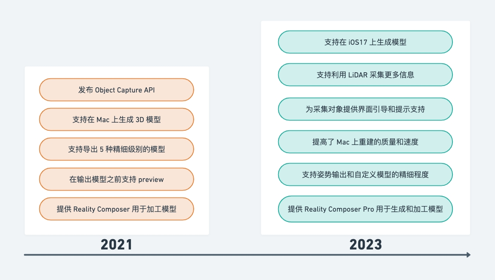

## 新特性

### 1. 使用激光雷达来扫描更多对象（More Objects With LiDAR）

从 iPhone 12 Pro 开始，激光雷达（LiDAR）就开始被搭载在部分 iPhone 和 iPad 上。LiDAR（激光雷达）是一种用于测量距离和深度感知的技术，它使用激光束向目标发送光信号，然后通过测量这个信号反弹回来所需的时间来计算距离。这项技术可以帮助 iPhone 检测和识别物体、测量空间和环境等，从而提升增强现实、摄影、游戏等应用的表现。从 iOS17 开始，在搭载了激光雷达的设备上，我们可以开始使用 Object Capture 了。

一般来说，对象扫描系统对于具有丰富纹理细节的物体表现最佳，对于纹理单一物体的支持则相对较弱，但现在这一项有了改进，开始支持使用激光雷达扫描构建低纹理对象。以下面的椅子为例，图像因为缺乏纹理所以 Object Capture 很难创建优质的模型，比如靠背和坐垫没有纹理，没办法完整的重建模型，但是现在有了激光雷达，除了图像数据，还使用了 LiDAR 收集到了点云数据（point cloud data），使用融合的数据，可以生成完整的椅子 3D 模型。

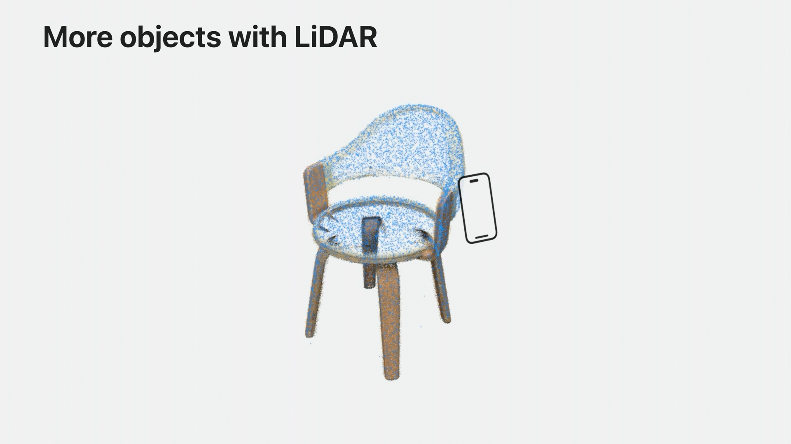

尽管如此，面对部分纹理单一物体，采集依然具有挑战性，例如反光，透明以及非常薄的物体，在选择拍摄对象时，要尽量避免这类物体。

### 2. 对象采集引导（Guided Capture）

在 iOS17 上 Apple 还为我们提供了自动采集系统（Automatic capture），可以自动捕获图像和激光雷达数据，当我们围绕物体旋转的时候，系统会自动选择图像的锐度，清晰度，以及曝光，还会从不同的视角收集激光雷达点。采集时我们可以看到一个类似于采集 FaceID 的转盘，提示我们有哪些区域已经采集了足够多的图像。

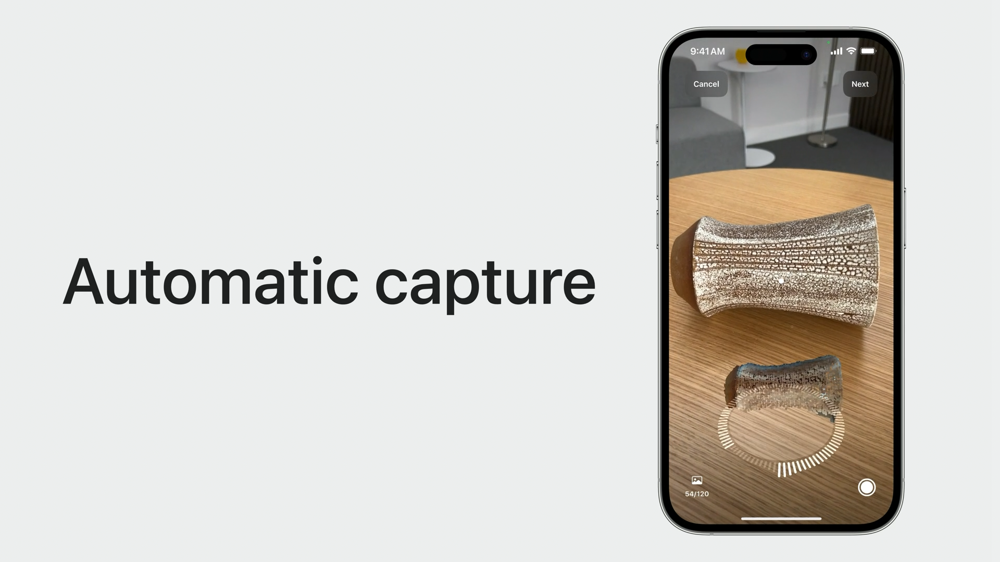

同时，Apple 还提供了有价值的反馈信息（Capture feedback），让用户能够更清楚的采集的方法。如果环境太暗或者太亮，或者距离太远或者太近，又或是我们移动的过快，都会提供相应的文字提示信息。如果物体超出了视野范围，采集将会暂停，然后显示一个箭头符号提醒调整镜头的方向。

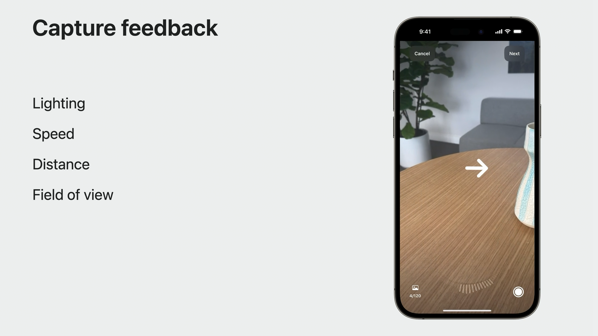

除此之外，对于是否翻转物体，我们可以根据物体的刚性以及纹理来决定。对于刚性物体以及纹理丰富的物体建议进行翻转采集，对于可形变以及对称纹理或是无纹理的物体，则不建议翻转。对于这个问题，Apple 也为我们提供了一个 API 来建议对象的纹理是否足以进行翻转。同时提供了如何正确翻转物体的界面引导，对于无需翻转的物体，则建议从三个不同的高度进行采集录制。

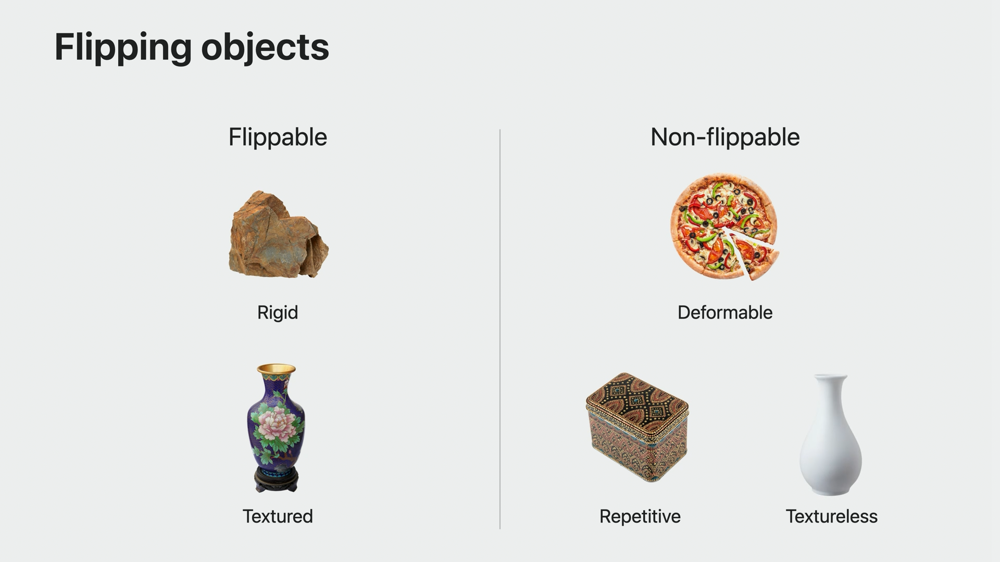

### 3. iOS API

Object Capture 有两个步骤，图像采集（image capture）和模型重建（model reconstruction），我们分别来看这两个部分的 API 使用。

**图像采集（image capture）**

图像采集 API 有两个重要的组成部分，Session 和 SwiftUI view。ObjectCaptureSession 主要用于在图像采集期间观察和控制流程和状态。ObjectCaptureView 则显示相机画面，并且根据 session 状态自动调整呈现的 UI 元素，ObjectCaptureView 没有任何的文本或者按钮，可以方便我们自定义应用的界面。ObjectCaptureSession 在创建时以 initializing 状态开始，通过函数调用来推进状态的变化，根据采集流程，状态将会经历准备（ready），检测（detecting），捕获（capturing）和完成（finishing）的过渡。一旦进入完成状态，会话会自动变成已完成（completed）状态，此时我们就可以进入重建的流程了。

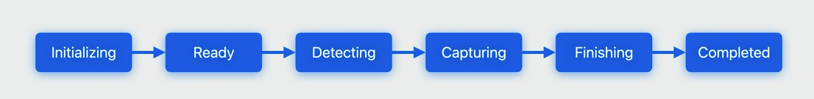

下面的代码初始化 Session ，在调用 start() 方法开启采集之后， session 进入到 ready 状态。

```swift
import RealityKit
import SwiftUI 

// 初始化 Session
var session = ObjectCaptureSession()
// 初始化 Configuration
var configuration = ObjectCaptureSession.Configuration()
// 配置一个检查点目录，可以用于后续步骤中加快重建过程
configuration.checkpointDirectory = getDocumentsDir().appendingPathComponent("Snapshots/")
// 配置图片路径，开启采集流程
session.start(imagesDirectory: getDocumentsDir().appendingPathComponent("Images/"),
              configuration: configuration)
// session 状态变为 ready
```

接下来使用 ObjectCaptureView 创建视图界面，将 session 传入来初始化 View。ObjectCaptureView 将会显示和 session 状态对应的 UI，此时显示的是 Ready 状态的界面，一个取景框指示我们选择要采集的对象。

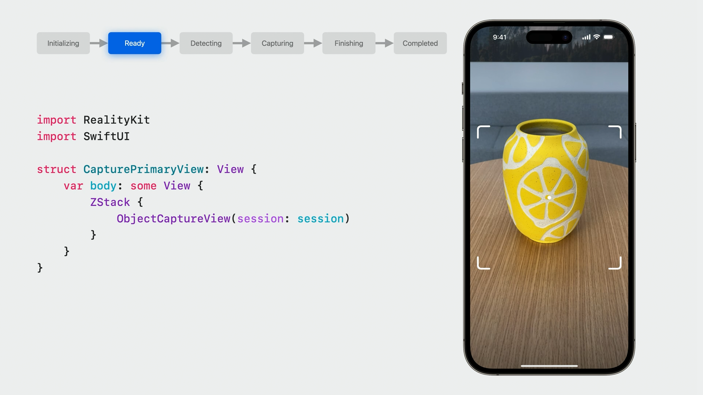

然后我们需要添加一个继续按钮将 session 推进到 Detecting 状态。按钮点击后，调用 `startDetecting()` 方法，界面会进入到一个边界框监测的状态，在这个状态下，会自动监测对象并展示一个包含物体的边框，我们也可以手动对边界其进行调整。如果我们需要重新切换到另一个物体，可以调用 `resetDetection()` 方法将状态重置为 Ready。

```swift
var body: some View {
    ZStack {
        ObjectCaptureView(session: session)
        if case .ready = session.state {
            CreateButton(label: "Continue") { 
                session.startDetecting() 
            }
        }
    }
}
```

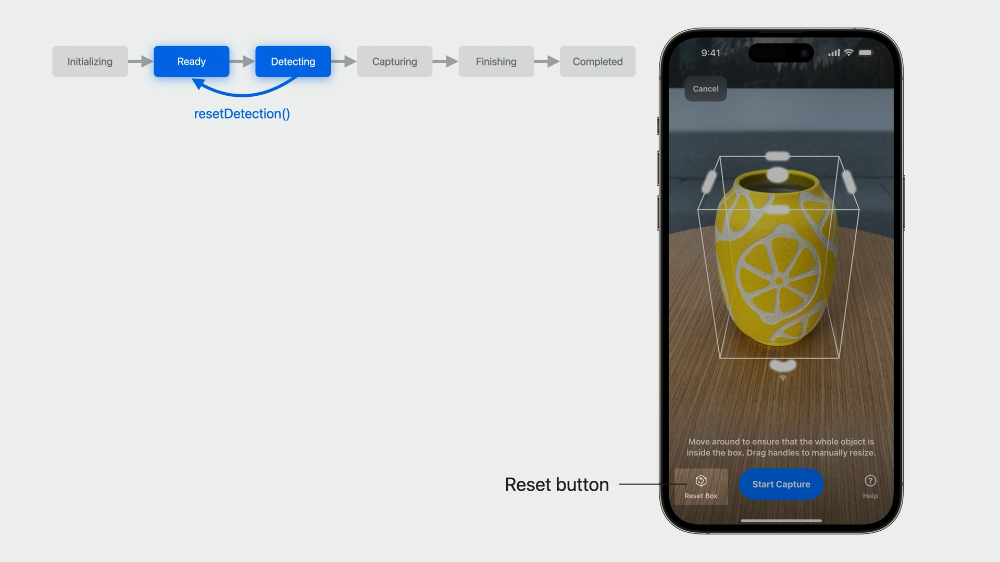

和从 Ready 状态过渡到 Detecting 状态一样，从 Detecting 切换到 Capturing 状态我们只需要提供一个按钮调用 `startCapturing()` 开始采集，在这之后，session 将会转到 Capturing 状态，在这个状态下，我们围绕物体缓慢移动，session 会自动拍摄图像，视图会显示点云和类似于 faceID 的采集转盘，显示我们采集的进度以及应该如何采集到更多的图像，当转盘完全填满时，扫描过程就宣告完成。

```swift
var body: some View {
    ZStack {
        ObjectCaptureView(session: session)
        if case .ready = session.state {
            CreateButton(label: "Continue") { 
                session.startDetecting()
            }
        } else if case .detecting = session.state {
            CreateButton(label: "Start Capture") { 
                session.startCapturing()
            }
        }
    }
}
```

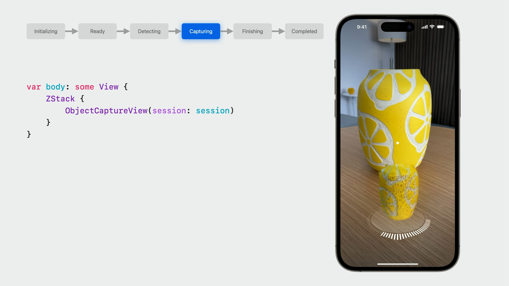

当本次采集完成时，session 会将 `userCompletedScanPass` 属性设置为 true。在 Apple 提供的示例中，为我们提供了完成采集以及继续采集更多图像两种选项，为了得到最佳的模型构建效果，建议完成三次扫描。


对于不建议翻转的物体，有一个枚举类型 [Feedback](https://developer.apple.com/documentation/realitykit/objectcapturesession/feedback-swift.enum)，这个枚举会提示在会话过程中可能出现的问题，其中 [objectNotFlippable](https://developer.apple.com/documentation/realitykit/objectcapturesession/feedback-swift.enum/objectnotflippable) 对应不建议翻转对象，这可能由于物体缺乏特征和纹理。

我们有两种方式开始新的扫描过程，分别对应着物体是否需要翻转的情况。

- `beginNewScanPassAfterFlip()` 方法对应需要翻转的情况，在这种情况下，需要将物体翻转再录制底部或者顶部，这个方法 session 会切换回 Ready 状态，重新开始录制流程。
- `beginNewScanPass()` 方法对应不需要翻转的情况，这种情况我们需要在不同的高度对物体进行采集，因为边界框没有更改，此时 session 仍然处于 Capturing 状态，。

当所有的内容采集完成后，示例程序提供了一个完成按钮，这个按钮调用 `finish()` 函数告知 session 完成采集。在设置成 finish 状态后，session 会等待所有的数据保存好，之后自动进入 Completed 状态。之后就可以进入重建流程了，如果发生不可恢复的错误，例如图像目录突然不可用，session 会变成 failed 状态，这时需要创建一个新的 session 重新开始。


最后，我们还可以使用 ObjectCapturePointCloudView 显示点云来预览被扫描好的对象。

```swift
var body: some View {
    if session.userCompletedScanPass {
        VStack {
            ObjectCapturePointCloudView(session: session)
            CreateButton(label: "Finish") {
                session.finish() 
            }
        }
    } else {    
        ZStack {
            ObjectCaptureView(session: session)
        }
    }
}
```

**模型重建（model reconstruction）**

今年一大更新就是可以在 iOS 上使用重建 API，我们先来回顾一下如何使用异步重建 API。它在 iOS 上的工作方式与在 macOS 上的工作方式相同。首先将 task 附加到我们创建的视图上，它会在视图加载时异步调用内部的方法。在这里，我们异步初始化了一个 PhotogrammetrySession，并开始生成模型。如果想要对模型重建方法更进一步了解，请观看 [Create 3D models with Object Capture](https://developer.apple.com/videos/play/wwdc2021/10076/)。

```swift
var body: some View {
    ReconstructionProgressView()
        .task {
            // 初始化配置
            var configuration = PhotogrammetrySession.Configuration()
            // 和采集设置成同一个检查点目录，加快重建过程（可选）
            configuration.checkpointDirectory = getDocumentsDir()
                .appendingPathComponent("Snapshots/")
            // 初始化 PhotogrammetrySession，并且设置素材图片的路径
            let session = try PhotogrammetrySession(
                input: getDocumentsDir().appendingPathComponent("Images/"),
                configuration: configuration)
            // 开始处理，设置模型输出路径，名称和格式
            try session.process(requests: [ 
                .modelFile(url: getDocumentsDir().appendingPathComponent("model.usdz")) 
            ])
            // 监听 session 的状态和错误，以及输出的结果。
            for try await output in session.outputs {
                switch output {
                    case .processingComplete:
                        handleComplete()
                        // Handle other Output messages here.
                }
            }
        }
    }
```

为了在移动设备上生成和查看模型有更好的体验，在 iOS 上仅支持生成 reduced 细节等级的模型，这个级别针对移动设备进行了优化，有关更多等级的说明，请查阅 [PhotogrammetrySession.Request.Detail](https://developer.apple.com/documentation/realitykit/photogrammetrysession/request/detail)。重建的模型包括单个漫反射，单个环境光遮挡和单个法线纹理贴图，如果需要生成更精细的模型，则需要将图像传输到支持的 Mac 设备上进行构建。

今年，Mac 上的重建还会利用我们图像中保存的 LiDAR 数据，新的 Object Capture 流程也支持这种方式。默认情况下，当达到 iOS 设备的重建限制时，ObjectCaptureSession 会停止采集图像，但是对于 Mac 上的重建，我们可以让系统支持拍摄更多的图像，以构建更精致的模型， 只需要在设置 ObjectCaptureSession 的时候，将 `isOverCaptureEnabled` 属性设置为 true。这些额外的图像数据不会用于移动端上的重建，但是他们存储在 Images 文件夹中。

```swift
// Capturing for Mac

var configuration = ObjectCaptureSession.Configuration()
configuration.isOverCaptureEnabled = true

session.start(imagesDirectory: getDocumentsDir().appendingPathComponent("Images/"),
              configuration: configuration)
```

要在 Mac 上重建模型，我们甚至不需要写任何的代码，Object Capture 已经集成到 Apple 新的 MacOS 应用 Reality Composer Pro 中，具体详情可以查看 [Meet Reality Composer Pro](https://developer.apple.com/videos/play/wwdc2023/10083)，我们只需要将图像导入应用中，选择细节级别，然后获取模型即可。

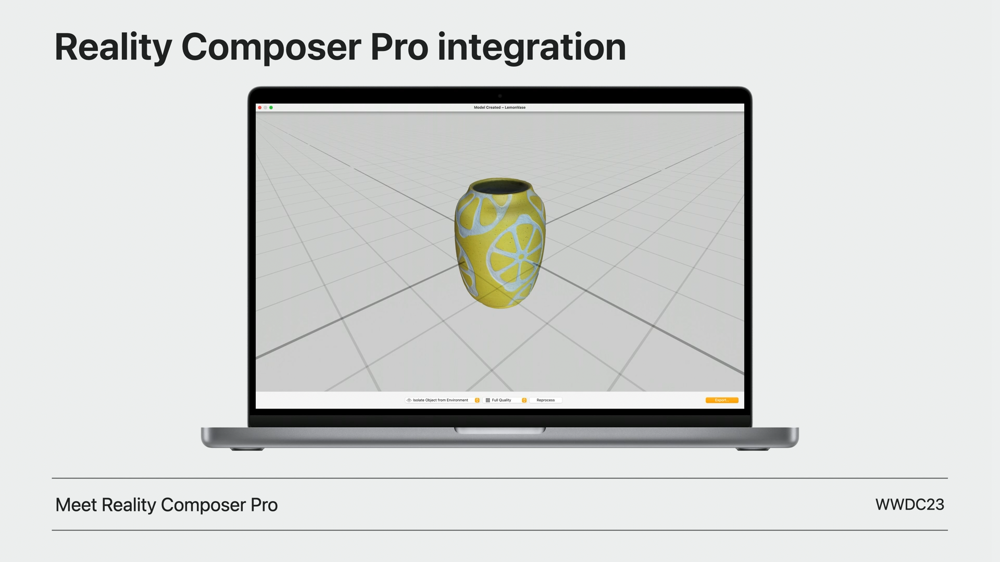

### 4. 重建增强（Reconstruction enhancements）

今年，Apple 提高了 Mac 上的模型质量和重建速度，除了进度百分比之外，还提供了预估的重建时间，以及另外两个附加功能：**姿势输出（pose output）**和**自定义细节级别（custom detail level）。**

- 姿势输出：现在我们可以为每张图片申请一个高质量的姿势。每个姿势基于 Apple 计算机视觉算法对该图像对应的摄像机的估计位置和方向生成。要获得姿势，在 `process()` 函数调用中添加一个姿势请求，姿势将在模型生成前返回，我们可以在 pose 到达输出信息流时处理。

```swift
try session.process(requests: [ 
    .poses 
    .modelFile(url: modelURL),
])
for try await output in session.outputs {
    switch output {
    case .poses(let poses):
        handlePoses(poses)
    case .processingComplete:
        handleComplete()
    }
}
```

- 自定义细节级别：macOS 增加了一个新的自定义细节级别，我们能够完全控制重建的模型。以前，可以选择减少、中等、完全和原始细节级别。有了自定义细节级别，我们可以控制网格的抽取量、纹理图的分辨率、格式，以及哪些纹理图应该被包括在内，可以通过配置 [PhotogrammetrySession.Configuration.CustomDetailSpecification](https://developer.apple.com/documentation/realitykit/photogrammetrysession/configuration-swift.struct/customdetailspecification-swift.struct) 来进行调整。


## 最佳实践

接下来我整理了一些在实际使用 Object Capture 过程中，Apple 给我们的一些建议。

### 设备限制

在具备激光雷达的设备上才能使用新的 Object Capture 功能，如 iPhone 12 pro，iPad pro 2021 及之后的高配置机型才可用。 ObjectCaptureSession 以及 PhotogrammetrySession 是否支持都有相应的 API 提供，在使用之前我们需要先对其进行验证。

```swift
// 是否支持 ObjectCaptureSession
ObjectCaptureSession.isSupported
// 是否支持 PhotogrammetrySession
PhotogrammetrySession.isSupported
```

截止到 2023 年 6 月，支持使用 Object Capture 的移动设备：

| 设备名 | 发布年份 |
| --- | --- | --- |
| iPhone 12 Pro | 2020 |
| iPhone 12 Pro Max | 2020 |
| iPhone 13 Pro | 2021 |
| iPhone 13 Pro Max | 2021 |
| iPhone 14 Pro | 2022 |
| iPhone 14 Pro Max | 2022 |
| iPad Pro 11'' （2代）  | 2020 |
| iPad Pro 12.9'' （4代）  | 2020 |
| iPad Pro 11'' （3代）  | 2021 |
| iPad Pro 12.9'' （5代）  | 2021 |
| iPad Pro 11'' （4代）  | 2022 |
| iPad Pro 12.9'' （6代）  | 2022 |

### 目标采集

**建议使用具备以下特性的物体用于采集：**

- 具备丰富的纹理。
- 表面避免反光。
- 避免选择透明物体。
- 避免非常薄的物体。

**在采集时，需要注意以下几点：**

- 选择良好的照明环境，建议在光线均匀，明亮的环境下。
- 拍摄时，缓慢平稳的围绕物体运动，避免图像模糊。
- 保持合适的距离，保持物体在相机范围内。
- 合理判断物体是否需要翻转，一般来说，如果是容易形变的物体，建议不要翻转，以及对称或者有重复纹理的物体，翻转可能会对系统产生误导，这种也不建议翻转采集。
- 如果物体可以翻转，建议从顶部，侧面，底部三个面进行扫描，得到整体的图像。
- 如果物体不可以翻转，建议从不同的高度来捕捉它，来获得不同视角的图像。
- 对于没有纹理的物体，建议放在有纹理的背景下，可以通过环境的纹理来进行特征匹配，计算出每张照片拍摄时在三维空间里的相对位置，更利于采集。
- 如果模型需要在 Mac 上生成，使用 isOverCaptureEnabled 属性来采集更多的图像。

### 模型重建

- 如果使用 iOS 设备采集，在 Mac 上重建，可以使用 `isOverCaptureEnabled` 属性，可以采集更多图像。
- 在 iOS 上重建仅支持 reduced 级别模型，如果需要用于游戏等更多专业级场景，建议在 Mac 上进行建模。
- 如果想要在 Mac 上直接使用重建功能，不需要写代码，可以直接使用 Reality Composer Pro 应用。

## 总结

这篇文章为大家介绍了在 iOS 上使用 Object Capture 进行扫描和重建，Apple 通过使用激光雷达和计算机视觉算法帮助用户快速高效创造高质量的三维模型。随着今年发布的 Apple Vision Pro 增强显示设备，AR 技术的发展正在迎来新的机遇。可以预见近几年 AR 应用将迎来一波井喷，Object Capture 也很有可能会在这波浪潮中一展身手，Object Capture 和 AR 技术的结合也将极大地拓展 AR 应用的领域，为人们带来更加丰富的虚拟体验。在读完了本文之后如果你对 Object Capture 感兴趣，不要犹豫，赶紧尝试一下吧！
