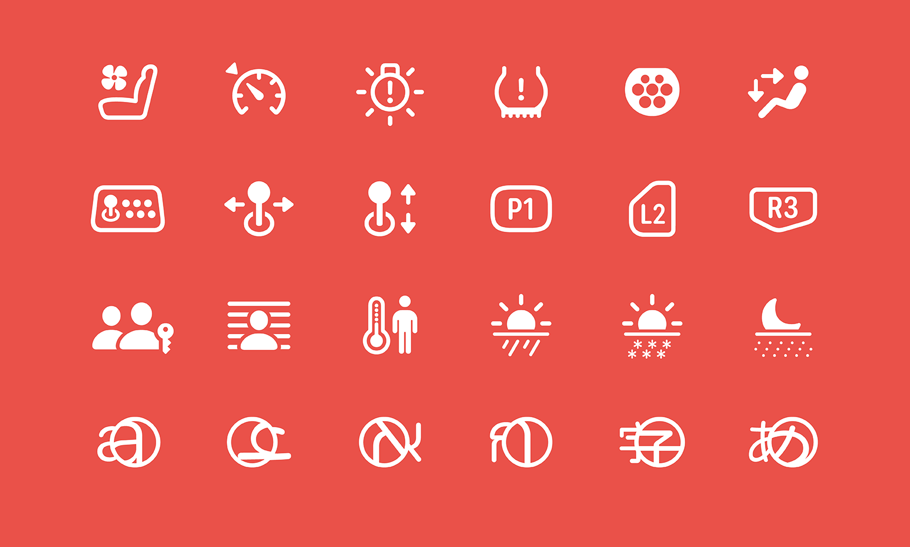

## 个人介绍

作者：Mim0sa，iOS 开发者，`iOS 摸鱼周报` 联合编辑，掘金主页：[Mim0sa](https://juejin.cn/user/1433418892590136)，橘猫/橘狗爱好者。

## 审核介绍

审核：

戴铭，极客时间《iOS 开发高手课》和纸书《跟戴铭学 iOS 编程》作者。

黄骋志，老司机技术轮值主编，目前就职于字节跳动，参与西瓜视频质量与稳定性工作。对 OOM/Watchdog 较为了解并长期投入。

## 不超过 120 个字的文章简介

本文基于 WWDC 2023 Session 10197 / 10257 / 10258 梳理，从 SF Symbols 的特性切入，讨论 SF Symbols 这款由系统字体支持的符号库有哪些优点以及该如何使用。在这次 WWDC 2023 中，除了符号的数量增加到了 5000+ 之外，还有能让符号们“动”起来的新功能，让 SF Symbols 这把利器变得又又更加趁手和锋利了。

## 头图

