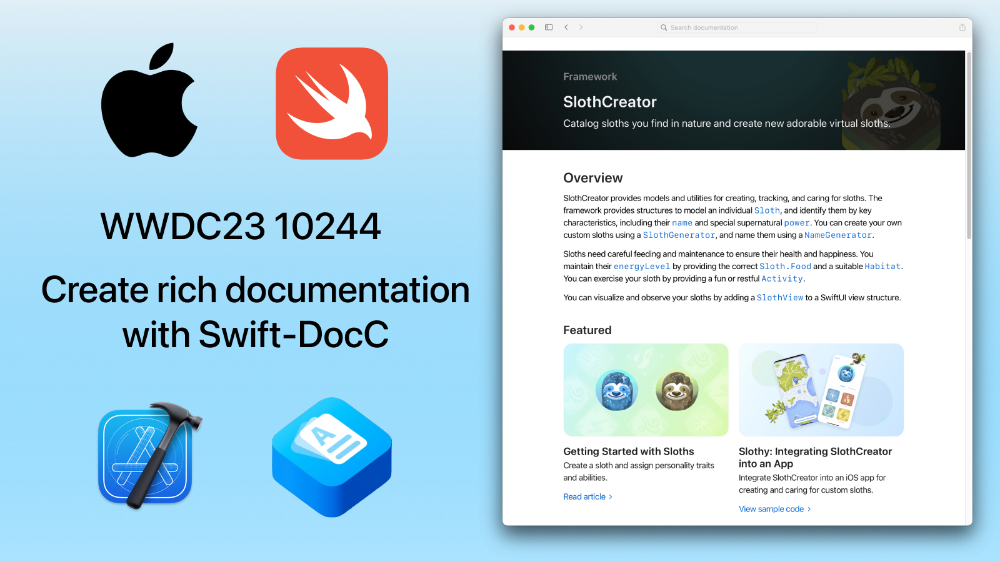

## 个人介绍

叶絮雷，Swift Documentation Workgroup 成员，目前就职于字节西瓜视频团队

## 审核介绍

SeaHub：目前任职于腾讯 TEG 计费平台部，负责搭建服务于腾讯系业务的支付系统，主导国内 IAP 前后端相关内容，对 IAP 整体设计有一定的经验；

黄骋志：老司机技术轮值主编，目前就职于字节跳动，参与西瓜视频质量与稳定性工作。对 OOM/Watchdog 较为了解并长期投入

## 不超过 120 个字的文章简介

通过 Xcode 15 提供的文档预览界面，我们可以更加方便的在 Xcode 15 中编写并预览文档。同时我们也可以通过 DocC 主题配置和指令功能，为文档添加更多的自定义内容，使文档更加丰富多彩。

## 公众号/小专栏图文头图

