# Session 10244 - 使用 Swift-DocC 构建丰富的文档

> 作者：
>
> 叶絮雷，Swift Documentation Workgroup 成员，目前就职于字节西瓜视频团队
> 
> 审核：
>
> SeaHub：目前任职于腾讯 TEG 计费平台部，负责搭建服务于腾讯系业务的支付系统，主导国内 IAP 前后端相关内容，对 IAP 整体设计有一定的经验；
>
>  黄骋志：老司机技术轮值主编，目前就职于字节跳动，参与西瓜视频质量与稳定性工作。对 OOM/Watchdog 较为了解并长期投入


本文是根据 WWDC23 中的 [Create rich documentation with Swift-DocC](https://developer.apple.com/videos/play/wwdc2023/10244/) 撰写，主要是引导如何利用 DocC 的新功能构建更丰富的框架文档。

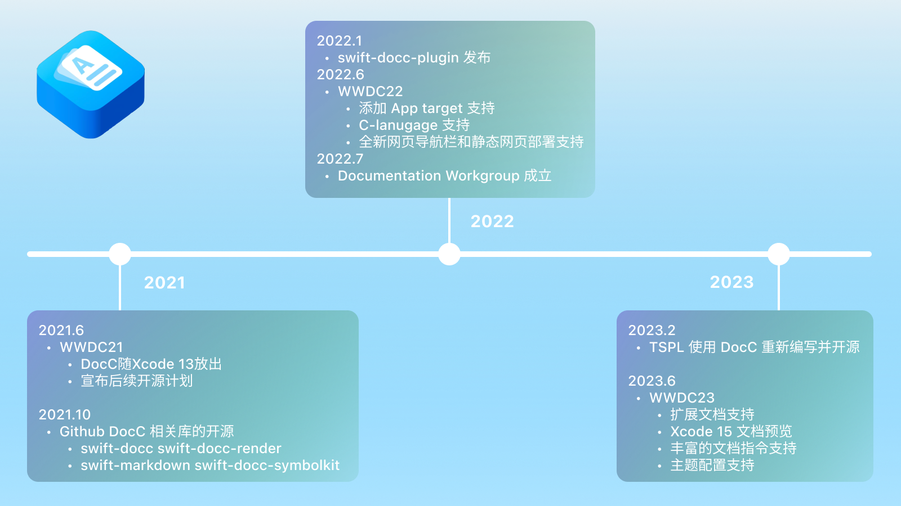

## 前言

Swift-DocC 是一个直接集成到 Xcode 中的文档编译器，允许我们在源代码中为项目编写和发布丰富的文档。

我们可以通过在源代码中编写文档或者通过单独的 Markdown 文件来为代码编写详细的技术文档。

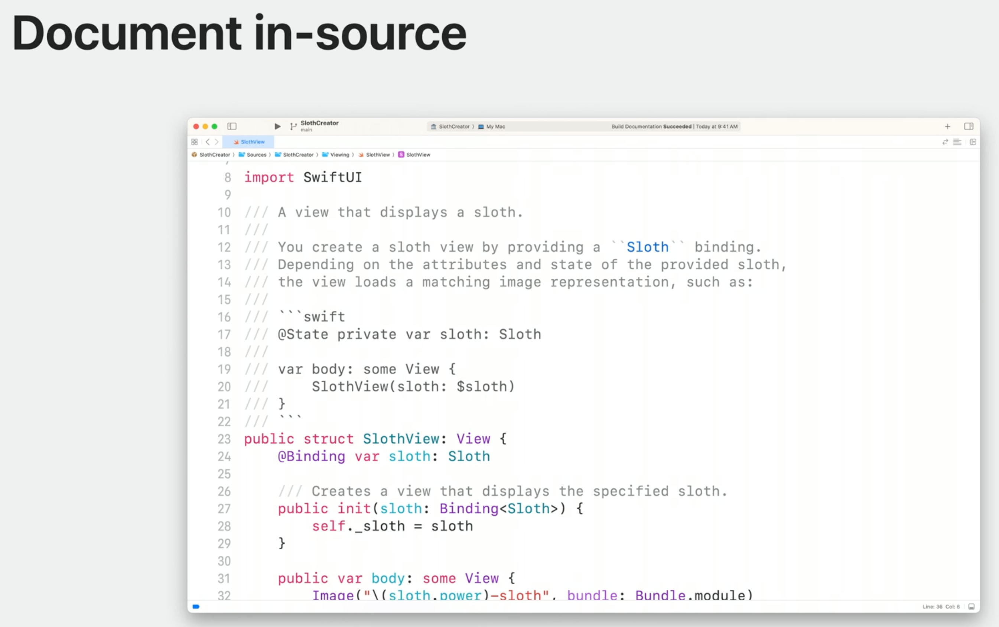

DocC 也可以导出为静态网络托管解决方案，允许直接发布到 GitHub Pages 和 Netlify 等服务。同时生成的文档也将通过 Index 系统会出现在 Xcode 的内置文档窗口中，并集成到了 Xcode 的源代码编辑器中。

这意味着以 DocC 格式编写的文档将自动提供给任何有权访问源代码的人，而无需任何额外的工作。

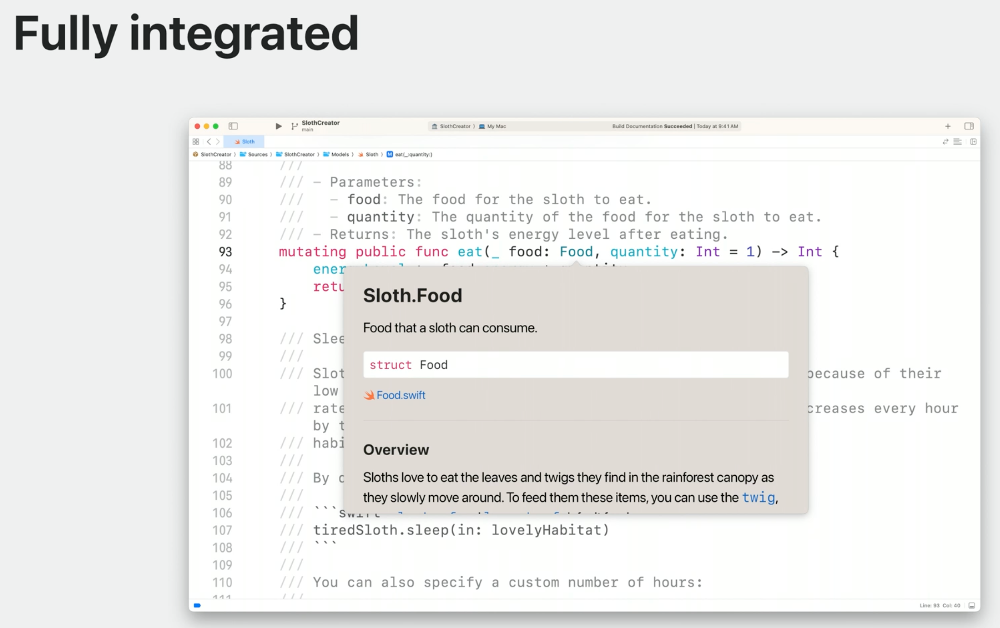

自 Swift-DocC 随着 Xcode 13 一起发布以来，DocC 项目一直是通过 Github 开源库的方式进行的公开开发。社区的支持也给 DocC 提供了大量的新功能和改进，如自定义主题、导航、搜索、视频支持等等。

目标方面，目前 DocC 除了支持 Swift Package 级别的文档也提供了应用程序级别的文档支持。

语言方面，目前无论使用 Swift、Objective-C 还是两者混合编写的代码都能提供文档支持。

同时在 Xcode 15 中通过和 DocC 的紧密结合，提供了文档预览编辑器。可以和 SwiftUI 类似，在编写文档的过程中提供实时的渲染视图。

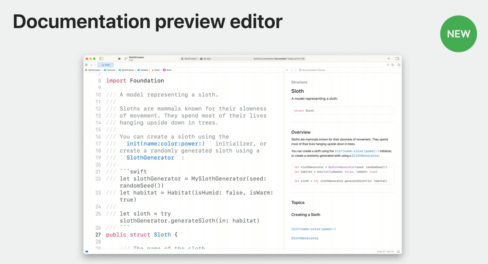

> 该 Feature 在去年 8 月的 SDWG 会议上进行了讨论，想法是提供一个和 SwiftUI Preview 类似的能力
>
> 最终在今年的 Xcode 15 上完成了实现，但是其他 IDE 如 VSCode 也是可以通过目前的接口支持 Live Preview 的
>
> [Documentation Workgroup meeting notes: August 1st 2022](https://forums.swift.org/t/documentation-workgroup-meeting-notes-august-1st-2022/59432)
>
> [Add Swift Documentation Preview Support](https://github.com/swift-server/vscode-swift/issues/562)

除此之外，借助全新的 DocC 指令支持，如基于网格的布局、视频支持、自定义页面图标等，甚至完全自定义的主题配置，我们可以制作真正体现框架特色的定制文档。

> 本文将重点讨论 Swift-DocC 的一些高级的功能，如果此前对 DocC 不太了解，建议可以看往期内参专题和相关 WWDC 视频：
>
> - WWDC21 内参: [DocC: 未曾设想的苹果文档](https://xiaozhuanlan.com/topic/0483621759)
>
> - WWDC22 内参: [Swift-DocC 新特性](https://xiaozhuanlan.com/topic/3658492071)
>
> - WWDC21: [Meet DocC documentation in Xcode](https://developer.apple.com/videos/play/wwdc2021/10166/)

## 文档编写

这里以 SlothCreator 这个在前几年的 Session 中出现的示例项目为例，演示如何利用 DocC 编写更加丰富的文档。

SlothCreator 是一个并用于创建管理树懒的软件包。这里首先使用 Xcode 15 中打开该软件包，通过 `Build for Documentation` 选项我们可以对当前的文档状态进行一个初步评估。

Swift-DocC 会自动为项目中的相关 API 创建页面，同时也包括前面提到的代码注释，在没有进行过多手动适配的情况下，DocC 是开箱即用的，会提供一个基本的文档页面。

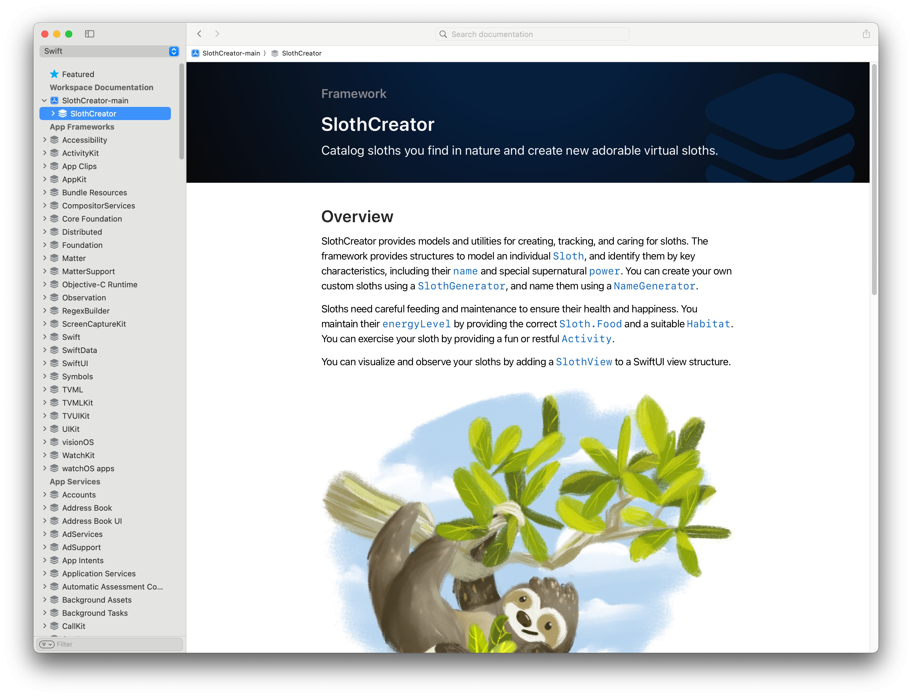

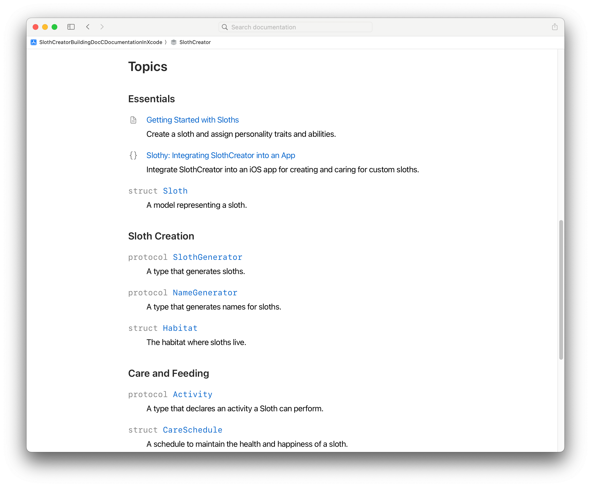

上图为 SlothCreator 的顶级文档页面，通过一句话的摘要开始，然后在 Overview 中概述框架的全部内容。

再往下则是主题部分，主题用于将文档的不同页面组织成逻辑组。

首先，我们有 Essentials 主题，其中包含针对框架新手的介绍性文档。然后是树懒的创建、树懒的喂养和树懒视图小组。组织良好的主题组是为框架创建可发现和可访问文档的关键。

### 扩展文档支持

在页面的最下面是在 Swift 5.8 工具链中 DocC 中引入的扩展模块文档支持，这里可以看到 SlothCreator 为 `SwiftUI/Image` 提供了一个 `init` 方法并添加了注释。

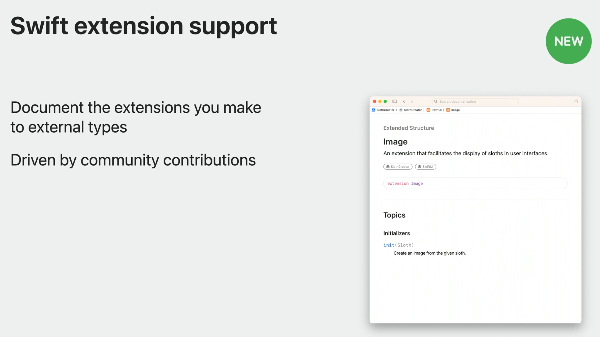

> 相关的社区提案原文 [Document Extensions to External Types Using DocC](https://forums.swift.org/t/document-extensions-to-external-types-using-docc/56060)
>
> 该功能完全由社区贡献驱动，并涉及 Swift-DocC 和 Swift 编译器的协调更改。

### 文档预览编辑器

我们可以看到该扩展有一些基本的文档注释，但是和之前的文档相比，它的质量要差一些。

使用 Xcode 15 的文档预览编辑器，我们将对它添加一些额外的文档。

打开对应的 Swift 文件并开启文档预览（编辑器右上角开启 Assistance 模式，并选择 Documentation Preview）

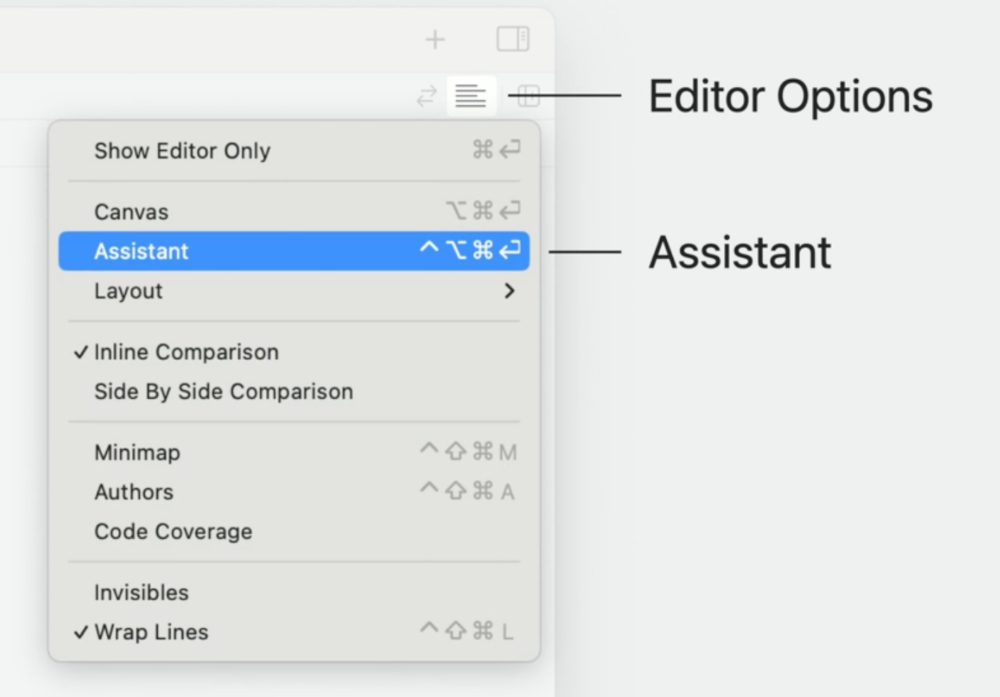

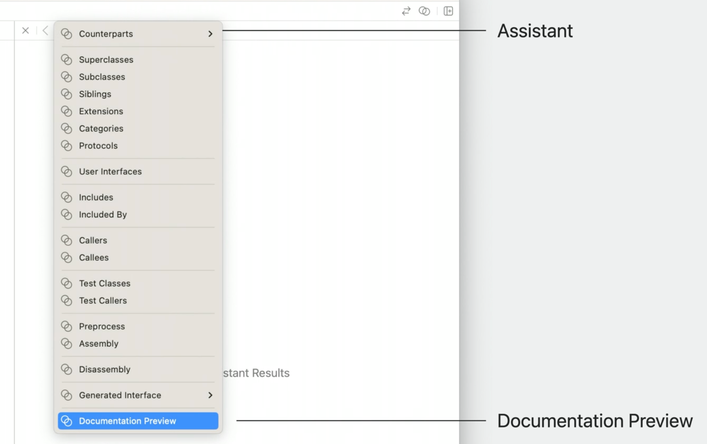

现在，当我们在 Swift 源文件、Objective-C 头文件和 Markdown 文件之间移动时，文档预览将保持活动状态。

在原来简单文档的基础上，我们进行以下迭代

1. 在摘要后换行添加一段讨论内容

2. 继续添加一些代码示例，并标记语言为 Swift

3. 将准备好的图片放入文档目录中，并在文档注释中引用

> DocC 会在文档目录中寻找到最合适的图片变种，比如 2x 和 3x 图片、浅色模式图片和深色模式图片等
>
> 我们只需要按照对应的格式命名（eg. `iceSloth~dark@2x`）并在文档注释中使用原名称引用即可

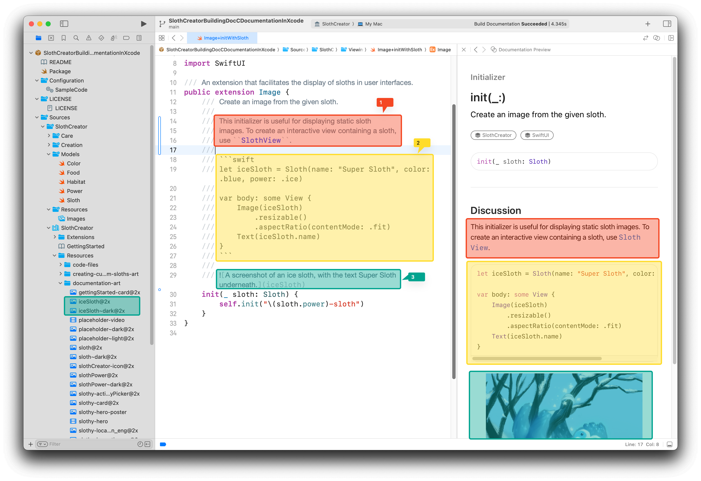

### Swift-DocC Directive

Swift-DocC 的语法基于 Github Flavored Markdown，但是也提供了一些额外的指令来支持更多的功能。（如 `Image` 和 `Video` 指令分别提供了对图片和视频的支持。）

在最初版本的 DocC 中指令只支持在 Tutorial 格式中使用，随着社区的反馈，文档工作组最终扩展了它的使用，目前我们可以在任何地方使用 DocC 指令。

> 社区 Pitch [Supporting more dynamic content in Swift-DocC reference documentation](https://forums.swift.org/t/supporting-more-dynamic-content-in-swift-docc-reference-documentation/59527)
>
> 相关 PR [Add @Image and @Video directives to reference documentation with caption support](https://github.com/apple/swift-docc/pull/381)

DocC 指令主要用于额外进行文档的创造性定制，没有一种强制规范约定必须使用。

比如插入图片既可以使用 `Image` 指令 - `@Image(source: String, alt: String?)`，也可以使用传统的 GFM 语法(``)

我们将通过发现问题并选择使用一些合适指令来润色 SlothyCreator 的示例代码文章。

在原始的 Sloth Creator 文章中，我们发现了以下四个问题：

1. 尽管此页面有示例代码，它和任何其他文章看起来是一样

2. 示例代码链接很难识别和发现

3. 正文内容是围绕两个图像段落对构建的，图像与它们的段落没有明确关联且图片占用了太多的空间

4. 页面底部用 3 张截图展示了不同语言的示例，但是它们之间没有关联且占用了太多空间。

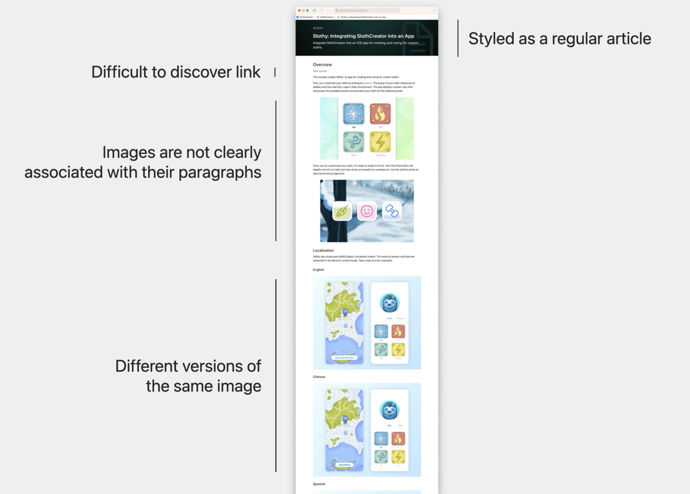

对于问题 1 和问题 2，我们使用 `Metadata` 指令来自定义该页面的元数据，其中包括页面的类型、页面行动和页面图片。

目前 `PageKind` 只支持两种类型，`article` 和 `sampleCode`，如果有其他更多的需求，可以在 Swift 论坛中进行反馈。

```markdown
@Metadata {
    @CallToAction(
        purpose: link,
        url: "https://example.com/slothy-repository")
    @PageKind(sampleCode)
    @PageImage(
        purpose: card, 
        source: "slothy-card", 
        alt: "Two screenshots showing the Slothy app. The first screenshot shows a sloth map and the second screenshot shows a sloth power picker.")
}
```

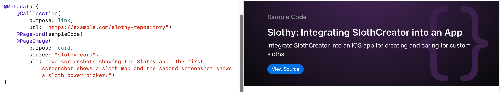

对于问题 3，我们使用 `Row` 和 `Column` 指令来重新组织页面内容，可以通过 `size` 参数来覆盖默认大小，让我们更好地控制页面布局。

```markdown
@Row {
    @Column(size: 2) {
        First, you customize your sloth by picking its 
        ``Sloth/power-swift.property``.
        The power of your sloth influences its abilities and how well
        they cope in their environment. The app displays a picker view
        that showcases the available powers and previews your sloth
        for the selected power.
    }
    
    @Column {
        
    }
}
```

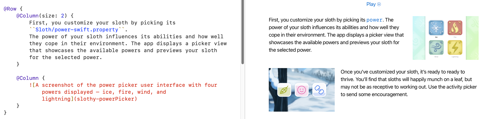

对于问题 4，我们使用 `TabNavigator` 指令来重新组织页面内容

`TabNavigator` 指令包含任意数量的子 `Tab` 指令，每个 `Tab` 指令都有一个标题和内容。

```markdown
@TabNavigator {
    @Tab("English") { ... }
    @Tab("Chinese") { ... }
    @Tab("Spanish") { ... }
}
```

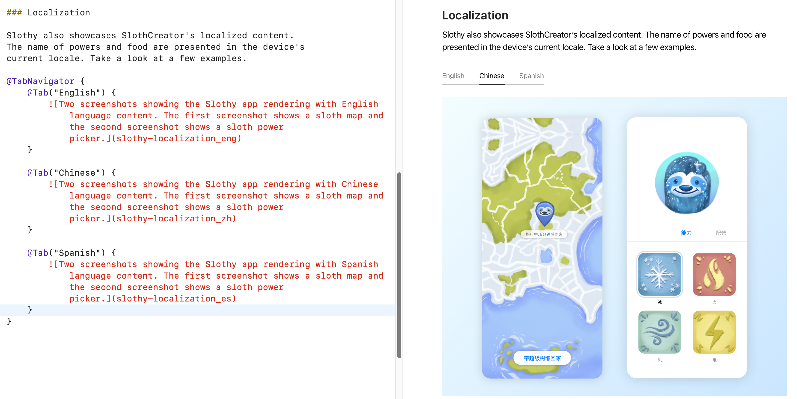

最后我们希望使用该文档的受众能够更容易地发现它，所以我们回到 SlothCreator 文档的顶级页面，通过 `Links` 指令并定义视觉参数来指向它们。

```markdown
@Links(visualStyle: detailedGrid) {
    - <doc:GettingStarted>
    - <doc:SlothySample>
}
```

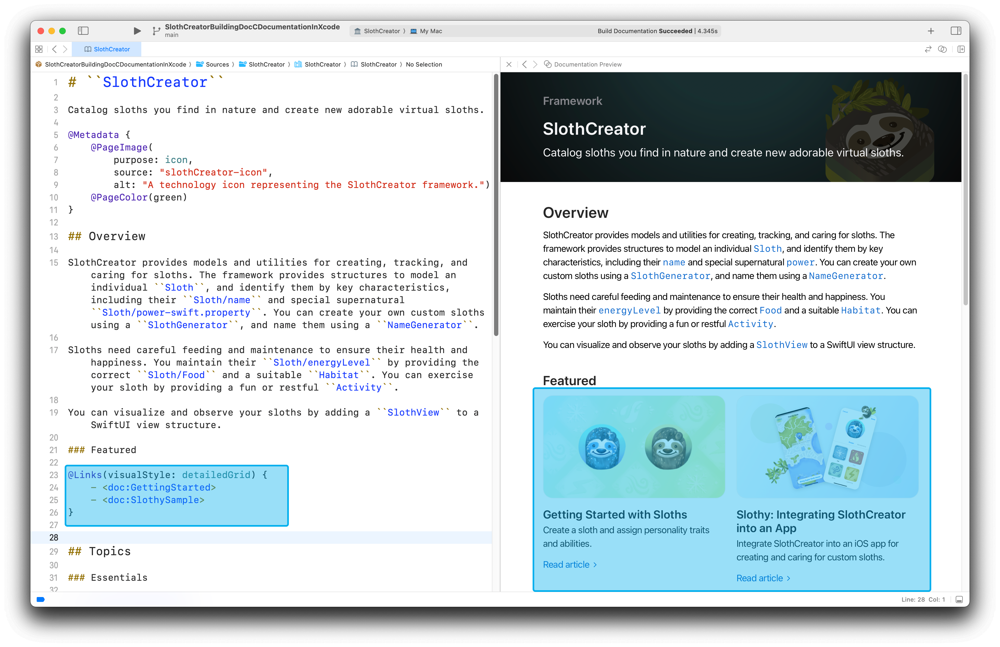

SlothCreator 文档在短时间内通过各种 `Dirctive` 指令得到了很大的改善，关于各个指令的使用方式可以在以下文档中查询

- [Open Source Swift-DocC Documentation](https://www.swift.org/documentation/docc)
- [Apple Swift-DocC Documentation](https://developer.apple.com/documentation/docc)

> Tips:
>
> 二者目前并无差别，前者通过 Github Action 部署在 Swift 开源项目上
>
> 后者为 Apple 的私有部署并配置使用了 Xcode 风格的主题

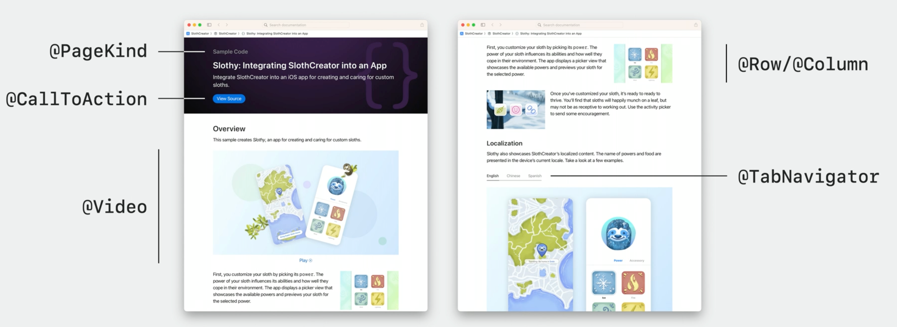

## 主题配置

在 Xcode 中查看的文档默认使用了 Apple 风格的主题，而通过 [Swift-DocC-Render](https://github.com/apple/swift-docc-render) 转化得到的 Web 版文档则会使用我们配置的主题，如果没有进行配置则会使用默认主题。

但是自定义主题不一定是我们需要定制文档的正确方式，请在使用主题配置前知晓以下事项

1. 主题配置是一个全局网页配置，会影响所有的文档。如果您想要为单个文档定制，可以使用 `Metadata` 指令。

2. Swift-DocC 主题是针对网页部署的，在 Xcode 中会被忽略生效。如果确实希望自定义同时出现在 Xcode 和 Web 中，最好使用指令来完成。

Swift-DocC 中的主题由具有特定名称 "theme-settings.json" 文件定义，我们可以将其放入文档目录中来生效。

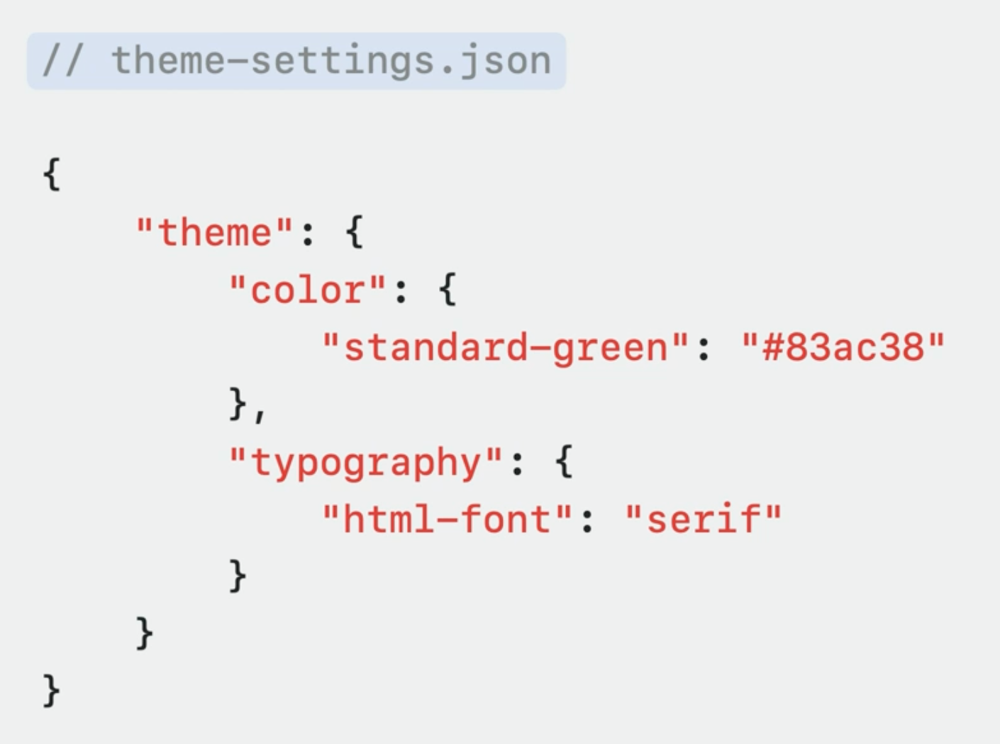

对于 SlothCreator，我们会自定义它的颜色和字体来匹配对应整体网站的设计。这些定制只是 Swift-DocC 主题的开始，如果有兴趣更进一步，可以阅读 Swift-DocC 的相关文档了解。

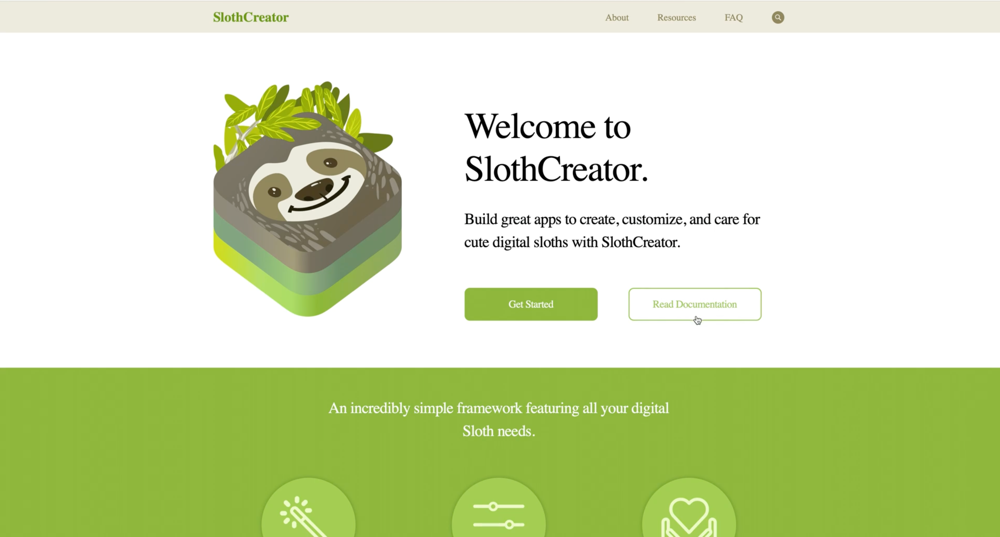

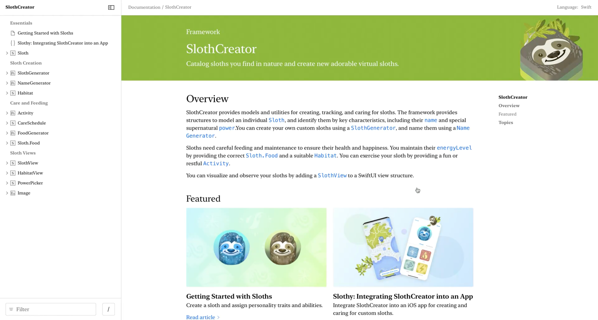

## 文档导航

Swift 5.8 工具链中的 DocC 还提供了全新的快速导航功能，使在页面之间进行导航变得更加容易。

与 Xcode 的 Quick Open 功能类似，它允许我们通过键盘快捷键并键入其名称进行搜索并直接跳转到页面。

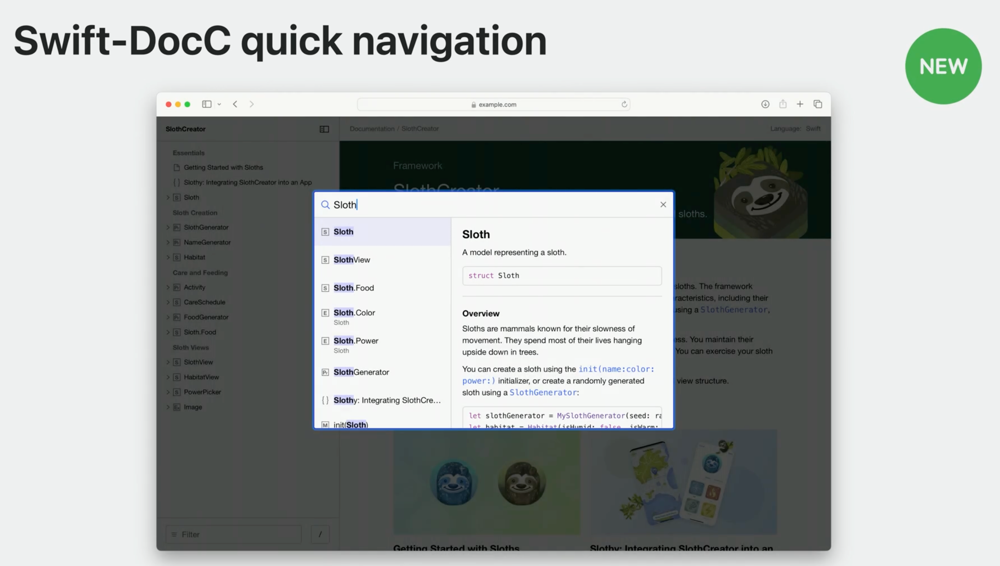

> Swift-DocC Quick Navigation 也是一个完全社区驱动的成果
>
> 感兴趣的同学可以在这里了解更多的上下文 [Quick navigation in DocC Render](https://forums.swift.org/t/quick-navigation-in-docc-render/55942)

借助新的快速导航弹出窗口和现有的导航边栏，Swift-DocC 为浏览在线文档提供了和 Xcode 中浏览文档一样的优秀体验。

## 总结

本文介绍了 Swift-DocC 的进阶使用方式，以及如何通过指令来定制文档的内容和外观。

从 21 年的开源但是只能基本只能在 Xcode + Swift Package 上使用，到逐渐丰富功能和对 Web 更友好的部署，以及 [DocC Plugin](https://github.com/apple/swift-docc-plugin) 的一键集成接入，相信 DocC 会成为未来 Swift 生态中非常重要的一部分。

> DocC Plugin 目前对 C 系语言的支持还在持续跟进中 [Swift-DocC-Plugin-Mix-Demo](https://github.com/Kyle-Ye/swift-docc-plugin-mix-demo)

总的来说，我对于今年 DocC 的更新还是非常满意的。同时不少大厂（比如字节）内部的新框架也已经开始迁移到使用 DocC 进行文档的维护和迭代。

## 尾声

目前 DocC 的所有重大功能都会在 [Swift Forums](https://forums.swift.org/c/swift-documentation/92) 上进行公开讨论，并通过双周维度的 Workgroup 会议进行决策。

如果你也希望为 DocC 进行贡献，欢迎提交 PR 或者参与到 Swift Forums 的讨论中来。

> 一些可以参考的优秀的 DocC 文档
>
> - [TSPL](https://docs.swift.org/swift-book/documentation/the-swift-programming-language)
>
> - [Swift-DocC](https://www.swift.org/documentation/docc)
>
> - [SwiftUI Tutorial](https://developer.apple.com/tutorials/swiftui)
>
> - [ChimeKit](https://swiftpackageindex.com/ChimeHQ/ChimeKit/main/documentation/chimekit)

> Tips:
>
> 补充一个和本文无关的小提醒，在本文创作过程中的 macOS 14 beta 2 上，打开 Xcode 文档浏览器在触发滑动后会必现崩溃
>
> 如果你也遇到了这个问题，可以通过以下方式解决
>
> `cd /Applications/Xcode.app/Contents/MacOS && CA_ASSERT_MAIN_THREAD_TRANSACTIONS=0 ./Xcode`
