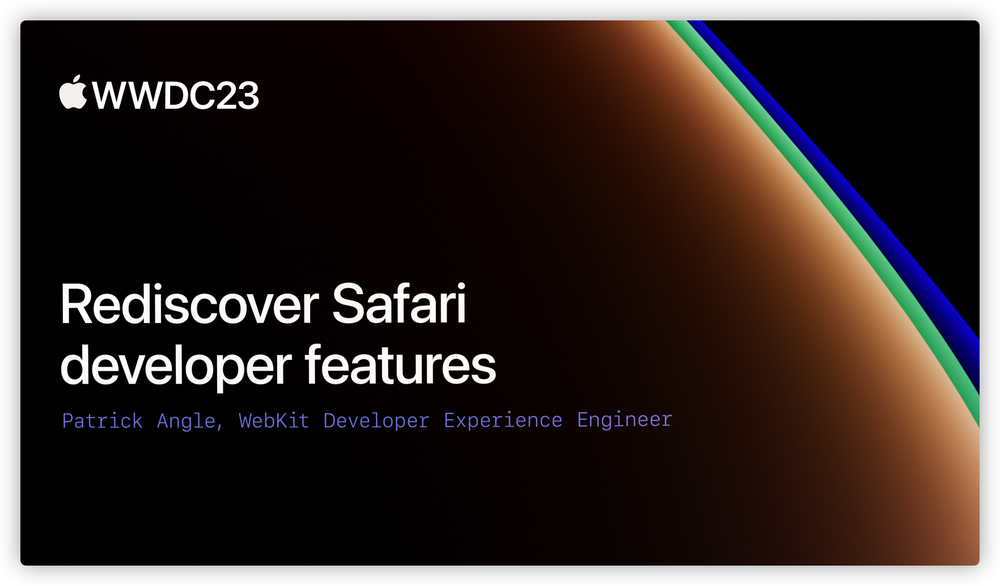

## 个人介绍

Style 月月， iOS 程序媛，简书/掘金文章贡献者，目前任职于小米，侧重于海外相关业务。

## 审核介绍

Nemo ，SwiftGG 成员，目前就职于字节跳动，在剪映写 Cpp 和 TS。

## 不超过 120 个字的文章简介

本文主要是介绍 Safari 开发者功能及更新点，第一部分是介绍 Web Insepector 常规用法和新功能；第二部分介绍响应式设计模式的使用，并支持模拟器调试；第三部分是 xrOS 与 Mac 的配对杨演示；第四部分演示 WebDriver 实现自动化测试；第五部分介绍 Feature Flags 功能，方便开发者提前了解 Web 的未来发展方向。

## 公众号/小专栏图文头图

