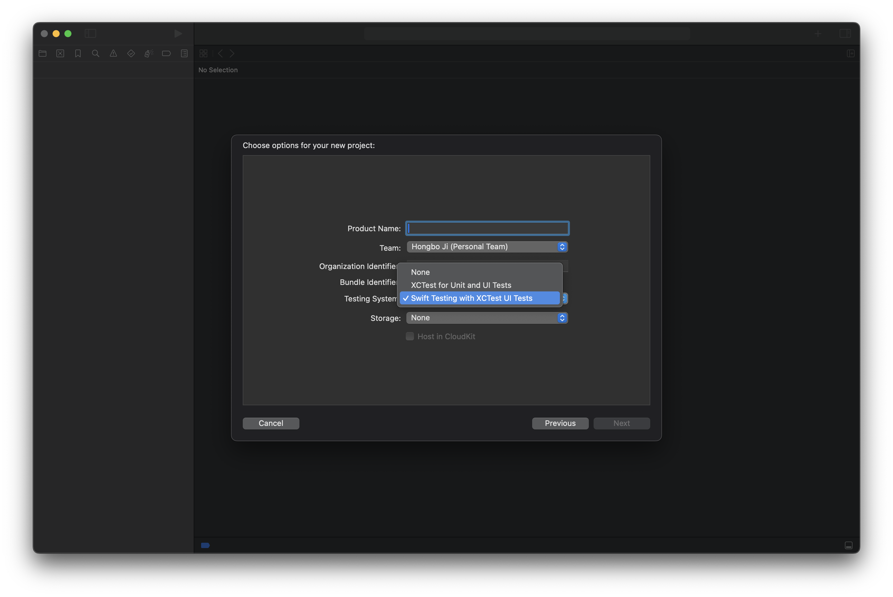
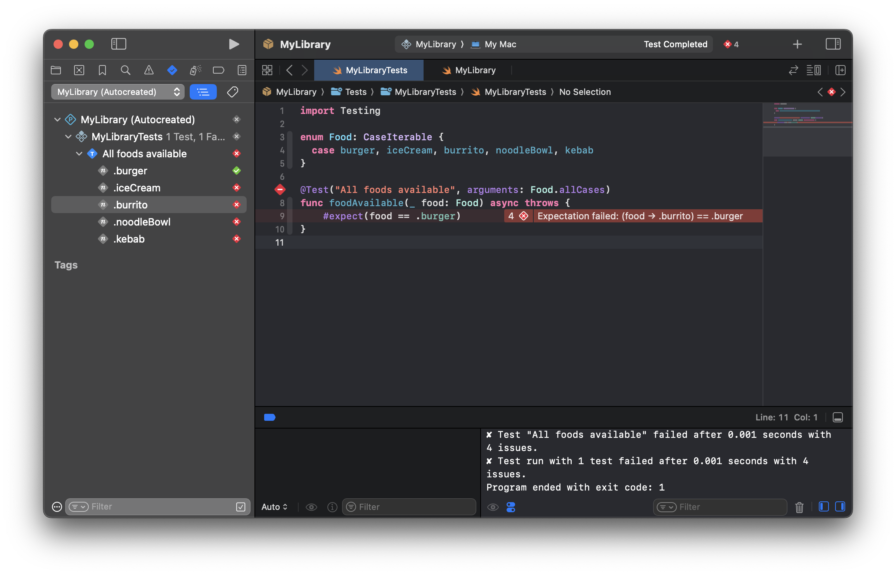
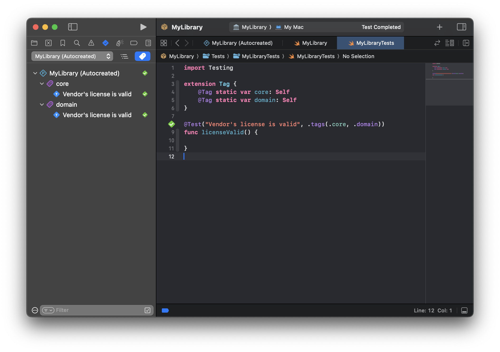
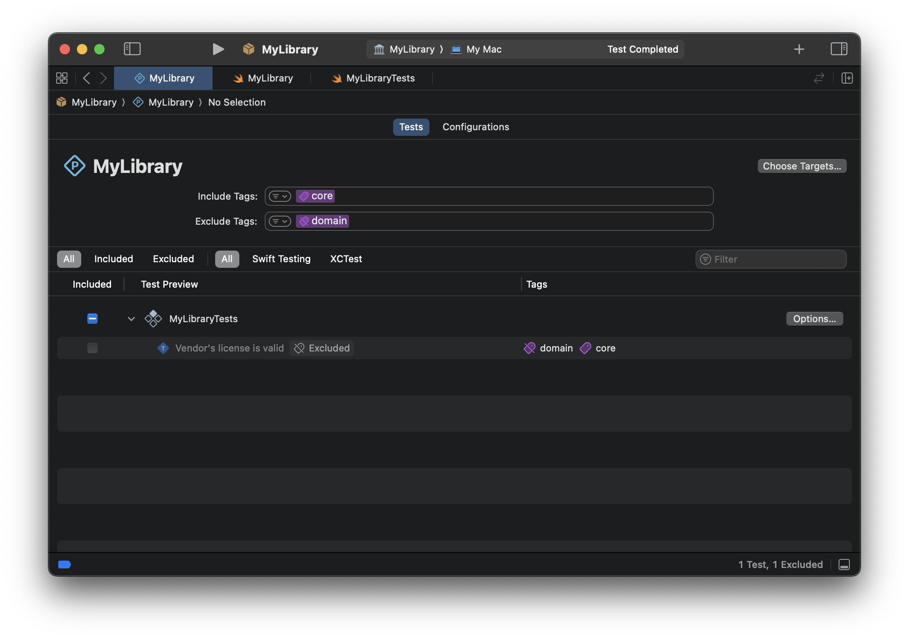
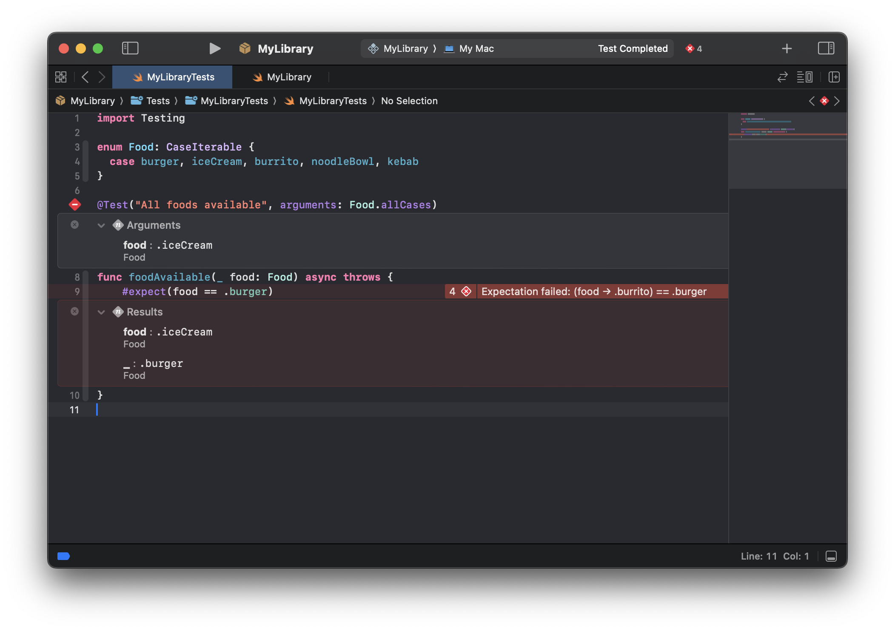
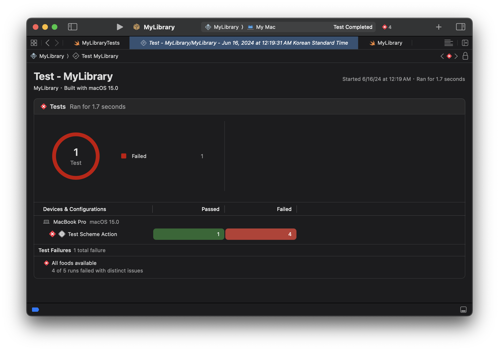

# WWDC24: Session 10195 - Go further with Swift Testing
## 简介
Swift Testing 是 Swift 团队推出的一个全新的测试框架。它有以下几个特性：
* 专为 Swift 设计
* 开源
* 跨平台
* 与 SPM 和 Xcode 无缝集成
* 高效且易用

我们稍后会详细展开这些特性，但在此之前，我会从 0 开始介绍如何使用 Swift Testing 编写测试代码，包括框架提供的 API 以及代码案例。如果你对 XCTest（Apple 旧的测试框架）比较熟悉，我还准备了一个 Swift Testing 和 XCTest 的对比，帮助大家快熟了解两者的差异。接下来我会就上面提到的几个特性展开解读。最后我会就 Unit Test 以及 Swift Testing 做一些额外的拓展思考。

## Swift Testing 使用教程
### 准备
#### Xcode
如果你使用 Xcode 开发，那么你无需做任何额外的工作。Xcode 16 已经集成了 Swift Testing。而且，当你使用 Xcode 创建新的项目，新建面板也会让你选择是使用新的 Swift Testing 还是传统的 XCTest 作为 Unit Test 的测试框架(默认 Swift Testing )。



#### 其他开发环境
如果你使用其他 IDE 或者操作系统，那么需要使用 SPM。

首先在 Package.swift 文件中，将 `swift-testing` 添加为包依赖项。然后，将 `swift-testing` 添加为测试目标的依赖项。最后，使用 `swift test` 命令运行单元测试。
> Swift Testing 对 Swift 版本的最低要求是 6.0. 不过这个要求不是针对你的项目，而是 test target。所以你至少要保证你的**测试目标**使用的是 Swift 6.0。
```swift
dependencies: [
  .package(url: "https://github.com/apple/swift-testing.git", branch: "main"),
],
.testTarget(
  name: "FoodTruckTests",
  dependencies: [
    "FoodTruck",
    .product(name: "Testing", package: "swift-testing"),
  ]
)
```

### 定义测试方法
上面的示例代码，其实就已经展示了 Swift Testing 绝大部分特性。我们就以此来介绍 Swift Testing 中的 API。
``` swift
import Testing

@Suite struct ViewModelTests {
    let viewModel: ViewModel
    
    init() {
        viewModel = ViewModel()
    }
    
    @Test func getOptionalResultReturn1() {
        let optionalResult = viewModel.getOptionalResult()
        let result = try #require(optionalResult)
        #expect(result == 1)
    }
}
```

#### `@Test`
我们首先来讲 `@Test` 。这个关键字表明该方法是一个测试方法。测试方法是单元测试的最小单位。我们需要为每一个测试方法加上 `@Test` ，被标记后，IDE 或命令行会自动执行该测试方法。

我们可以为 `@Test` 加上自定义名称，用于在 IDE 或命令行中展示。

```swift
@Test("Food truck exists")
func foodTruckExists() { ... }
```

#### `@Suite`
我们可以把测试都写在全局的测试方法里。但随着测试方法的增多，我们需要将测试方法分门别类的整理起来。一般而言，我们会将一个类（文件）的测试方法都整理在一起。比如，我们有一个 `ViewModel.swift` , 为了测试这个类，我们会创建一个 `ViewModelTests.swift` 文件，并创建一个新的 `class` 或者 `struct` ，并将测试该类的方法都放在这个结构里面。这不仅利于维护测试代码，也能帮助 IDE 或者命令行输出更加直观的结果。

上面是 XCTest 组织测试方法的方式，Swift Testing 也同样支持。但 Swift Testing 新增了一个 `@Suite` 关键字。这个关键字和 `@Test` 很像，唯一不同的是，`@Test` 用来标注测试方法，而 `@Suite` 用来标注测试的 Swift 类型（`class` 或者 `struct`）。之所以要引入他们俩，是因为他们都支持大量的修饰参数（如 `traits` 和 `tags` 等），用于组织和管理测试方法。

> `@Suite` 是**可选**的，即使不加这个关键字，也不影响测试。但是为了便于对测试方法的管理（使用修饰参数），我们建议**默认使用它**。

```swift
@Suite struct FoodTruckTests {
  @Test func foodTruckExists() { ... }
}

@Suite("Food truck tests") struct FoodTruckTests {
  @Test func foodTruckExists() { ... }
}
```

#### 其他方法关键字
除了上面提到的关键字，Swift Testing 还天然支持 Swift 的其他语法和关键字。
``` swift
@Test()
@MainActor
@available(macOS 11.0, *)
@available(swift, introduced: 8.0, message: "Requires Swift 8.0 features to run")
func foodTruckExists() async throws { ... }
```
这是一个稍微复杂一点的例子，我们依次看一下它的关键字。
* `@MainActor`
    * 支持测试只能在 **MainActor 上下文**中执行的方法。
* `async throws`
    * 支持测试**异步**或者会**抛出异常**的方法。
* `@available`
    * 支持测试只能在**特定操作系统**或者 **Swift 版本**上执行的方法。

### 编写测试代码
#### init & deinit
`init` 等价于 XCTest 的 `setUp` ，会在每一个测试方法开始执行之前执行。我们可以在这个方法里做一些初始化等必要的操作。`deinit` 等价于 XCTest 的 `tearDown`，会在每一个测试方法执行结束后执行。我们可以在这个方法中做一些清理工作。

新的 API 直接使用了 Swift 自带的初始化和析构方法，非常的直观易懂。

#### 🆕 参数化测试
某些测试需要在许多不同的输入参数上运行。例如，测试可能需要验证枚举的所有情况。以往我们可能会使用循环语句，在同一个测试方法内运行多个测试。
```swift
enum Food: CaseIterable {
  case burger, iceCream, burrito, noodleBowl, kebab
}

@Test("All foods available")
func foodsAvailable() async throws {
  for food in Feed.allCases {
    let foodTruck = FoodTruck(selling: food)
    #expect(await foodTruck.cook(food))
  }
}
```
这种方式不仅繁琐，而且一旦有失败，我们很难查看具体是哪一个参数导致了错误，也无法只运行某一个参数的 case 。
Swift Testing 提供了一个 arguments 参数。它会自动根据参数生成多个测试方法。
```swift
@Test("All foods available", arguments: Food.allCases)
func foodAvailable(_ food: Food) async throws {
  let foodTruck = FoodTruck(selling: food)
  #expect(await foodTruck.cook(food))
}
```
它带来了以下优势：
* 测试结果一目了然
* 支持单独执行某一个参数
* 默认支持并行执行
* 支持多参数


单独提一下多参数。如果测试方法包含多个参数，Swift Testing 也是同样支持的。
```swift
@Test("Can make large orders", arguments: Food.allCases, 1 ... 100)
func makeLargeOrder(of food: Food, count: Int) async throws {
  let foodTruck = FoodTruck(selling: food)
  #expect(await foodTruck.cook(food, quantity: count))
}
```
⚠️注意：上面的测试方法会执行 500 次，类似于(.burger, 1) 、 (.burger, 2) 、 (.burger, 3) 、 (.kebab, 99) 、 (.kebab, 100)。如果你只是希望两个参数配对出现，则需要使用 zip 来包装参数。
```swift
@Test("Can make large orders", arguments: zip(Food.allCases, 1 ... 100))
func makeLargeOrder(of food: Food, count: Int) async throws {
  let foodTruck = FoodTruck(selling: food)
  #expect(await foodTruck.cook(food, quantity: count))
}
```
上面的代码只会执行5次，(.burger, 1), (.iceCream, 2), …, (.kebab, 5)。


### 验证测试结果
单元测试的本质就是验证我们的代码（各种方法和属性）是否正确的执行（返回了正确的值，或者修改了正确的变量等）。
#### `#expect`
使用 `#expect` 来验证代码是否符合预期值。如果结果符合，则通过。不符合则会标记错误，并提供失败信息，但**不会停止整个测试方法**。如果后面还有代码，会继续执行。
```swift
@Test func isEqual() {
  #expect(1 == 2)   // 标记错误，并且继续执行
  #expect(1 == 1)   // 执行，成功
}
```
我们还可以使用 `#expect` 来测试异常。比如一个边界案例，我们预期该方法应该会抛出一个异常，就可以用下面的方法，来验证是否正确抛出了异常。
```swift
#expect {
  FoodTruck.shared.engine.batteryLevel = 0
  try FoodTruck.shared.engine.start()
} throws: { error in
  return error == EngineFailureError.batteryDied
    || error == EngineFailureError.stillCharging
}
```
#### `#require`
`#require` 基本上和 `#expect` 一样，唯一的不同就是，一旦遇到了错误，`#require` 会**停止执行后续的代码**。此外，所有的 `#require` 都是可抛出错误的，因此需要使用 try ，自然测试方法也需要标记 throw 。
```swift
@Test func isEqual() throw {
  try #require(1 == 2)   // 标记错误，**不继续执行**
  try #require(1 == 1)   // 不执行
}
```
我们需要根据测试方法的具体场景来决定使用哪一个宏。一般来说，在获得最终测试结果之前，都使用 `#require` ，毕竟如果要测试的结果都没有，也就没必要执行下去了。而一旦我们获得了执行的结果，需要对结果进行多种验证（比如是否为空、是否大于0、是否为无穷大），就可以使用 `#expect` ，方便我们一次性获得所有结果。

`#require` 另一个非常常用的场景是对可选值的解包。这也可以用来解释上面的最佳实践：如果 `getOptionalValue()` 是 `nil` 的话，那下面的逻辑都执行不下去了，直接报错并返回是最好的方式。
```swift
@Test func returningCustomerRemembersUsualOrder() throws {
    let value = try #require(getOptionalValue())
    let newValue = generateNewValue(value)
    #expect(newValue == value)
}
```
#### 测试异步方法
我们的项目中可能会曾在异步方法。这里有三种情况。

如果方法使用了 Swift concurrency API，那么可以直接使用 await 来执行方法。
```swift
@Test func returningCustomerRemembersUsualOrder() async throws {
    let value = try await #require(getOptionalValue())
    let newValue = generateNewValue(value)
    #expect(newValue == value)
}
```
如果方法使用了传统的 block 来处理异步回调，我们可以使用 withCheckedContinuation 将其改造成 concurrency API 。

如果方法使用了其他方式，那么可以使用 confirmation 方法。它类似于 XCTest 的 expectation ，提供一个 block ，当方法符合了预期，我们需要调用 block 的参数，告知 confirmation 方法当前的条件已经满足。我们也可以配置期望次数，confirmation 会计算 block 参数被调用的次数和预期是否一致。
```swift
let n = 10
await confirmation("Baked buns", expectedCount: n) { bunBaked in
  foodTruck.eventHandler = { event in
    if event == .baked(.cinnamonBun) {
      bunBaked()
    }
  }
  await foodTruck.bake(.cinnamonBun, count: n)
}
```

### 控制和整理测试方法
Traits 直译为性状，其实就是我上面说的修饰参数。通过它，我们可以控制、整理、管理我们的测试方法。这里的修复参数同时支持 @Test 和 @Suite 。
#### disabled
我们可以通过 enabled 和 disabled 来控制测试方法是否生效。被标记为 disabled 的测试方法将会被跳过。

我们可以给禁用提供一些说明，或者判断条件。也支持添加多个判断条件。
```swift
@Test("Food truck sells burritos",
    .disabled(),
    .disabled("We ran out of sprinkles"),
    .enabled(if: Season.current == .summer)
)
func sellsBurritos() async throws { ... }
```
> 不过我不建议大量使用 disabled 来禁用测试代码。很多时候，我们的测试方法失败了，但我们无法在短时间内修复它。为了暂时让整个单元测试通过，我们可以使用 withKnownIssue 。该 API 在发现测试错误时不会标记失败，但是会在测试报告中提示出来，提醒我们稍后修复。
```swift
@Test func example() {
  withKnownIssue {
    try flakyCall()
  }
}
```

#### serialized
和 XCTest 不同，Swift Testing 的测试方法默认会并行执行。但是，如果你的代码在并行执行下会出现错误，可以使用 serialized 来禁用并行执行。
> 我们会在下面的**并行执行 & 乱序执行**中详细讨论这个问题。
```swift
@Test(.serialized, arguments: Food.allCases) func prepare(food: Food) {
  // 被 serialized 标记，所有方法会串行执行
}

@Test func startEngine() async throws {
    // 默认所有方法会并行执行
}
```

#### tag
一个复杂的包或项目可能包含成百上千个测试方法。这些测试的某些子集可能具有一些共同点，例如类型或者业务模块。测试库包括一种称为 `tag` 的参数，您可以将其添加到对测试进行分组和分类。

Tag 和 Suite 都是用来对测试代码进行整理归类的，但是 Suite 因为和测试类强绑定，所以和测试方法有上下级的关系。而 Tag 则更加分散，也更语义话，可以跨 Suite、文件甚至测试目标，与任意数量的其他测试共享。

要使用 Tag ，我们需要先定义一个 tag 。参考官方的示例，我们可以在 Tag 的 extension 中定义一个全局的 tag，使用 @Tag 标记。

然后，我们就可以使用我们定义的 tag 来标记测试方法了。
```swift
extension Tag {
  @Tag static var legallyRequired: Self
}


@Test("Vendor's license is valid", .tags(.legallyRequired))
func licenseValid() { ... }
```
Xcode 提供了对 tag 的原生支持，我们可以按 tag 来查找和分类测试方法，也可以根据 tag 来启用和禁用测试方法。



#### bug
bug 修饰符用于将测试方法与具体的 bug 关联起来。对于日常出现的 bug，我们可能会为他们增加新的单元测试。这个时候将他们与 bug 关联起来，有助于我们日后回溯。bug 本质上也是一种 tag 。
```swift
@Test(
    .bug(id: "12345"),
    .bug("https://www.example.com/issues/67890", id: 67890)
)
func engineWorks() async {}
```
### 进阶使用
#### 验证异常
我们的测试方法不仅需要验证正确的场景，也需要验证在错误场景下，方法是否返回了符合预期的错误。

我们可能会想到，使用 `try catch` 来捕获抛出的异常，并且判断异常是否符合我们的预期。
```swift
import Testing

@Test func brewTeaError() throws {
    let teaLeaves = TeaLeaves(name: "EarlGrey", optimalBrewTime: 3)

    do {
        try teaLeaves.brew(forMinutes: 100)
    } catch is BrewingError {
        // This is the code path we are expecting
    } catch {
        Issue.record("Unexpected Error")
    }
}
```
但我们更建议使用 `#expect(throws)` 来处理这种场景。这个宏会捕获方法抛出的异常，并判断异常是否与预期一致。如果你的判断条件更加复杂，可以使用 [`expect(_:sourceLocation:performing:throws:)`](https://developer.apple.com/documentation/testing/expect(_:sourcelocation:performing:throws:))。
```swift
import Testing

@Test func brewTeaError() throws {
    let teaLeaves = TeaLeaves(name: "EarlGrey", optimalBrewTime: 4)
    #expect(throws: BrewingError.self) {
        try teaLeaves.brew(forMinutes: 200) // We don't want this to fail the test!
    }
}
```
#### 自定义输出
当测试结束，Swift Testing 会输出测试报告。默认的报告往往会直接展示原始代码，不易于阅读。此时我们可以考虑实现 `CustomTestStringConvertible` 协议，它将帮助 Swift Testing 输出更加友好的测试报告。

例如，我们有一个枚举，默认情况下，Swift Testing 会直接输出枚举在代码中的命名。这可能不够直观。
```swift
enum Food: CaseIterable {
  case paella, oden, ragu
}

@Test(arguments: Food.allCases)
func isDelicious(_ food: Food) { ... }

◇ Passing argument food → .paella to isDelicious(_:)
◇ Passing argument food → .oden to isDelicious(_:)
◇ Passing argument food → .ragu to isDelicious(_:)
```
当我们实现了 `CustomTestStringConvertible` 协议，输出的最终报告中便会展示我们自定义的内容。这个特性在 Xcode 中也支持。
```swift
extension Food: CustomTestStringConvertible {
  var testDescription: String {
    switch self {
    case .paella:
      "paella valenciana"
    case .oden:
      "おでん"
    case .ragu:
      "ragù alla bolognese"
    }
  }
}

◇ Passing argument food → paella valenciana to isDelicious(_:)
◇ Passing argument food → おでん to isDelicious(_:)
◇ Passing argument food → ragù alla bolognese to isDelicious(_:)
```
#### 并行执行 & 乱序执行
健壮的代码应该能在各种环境下正常执行，因为现实的项目是复杂的，我们很难控制项目在运行时的场景。这里说的环境主要是：串行/并行和执行顺序。

前面提到，Swift Testing 默认会将所有测试方法并行执行，这与 XCTest 不同。虽然框架提供了 `serialized` 参数可以禁用并行执行，但是我还是希望大家尽量不使用它，而选择让方法能够在并行环境中正确执行（比如使用最新的 `@MianActor`）。并行执行不仅会提高测试的执行速度，也能测试代码的健壮性，比如能够暴露出更多的问题（如多线程）。

提高代码健壮性的另外一个方法是测试方法的执行顺序。XCTest 默认是按照字母表的顺序执行所有的测试方法，而 Swift Testing 默认随机执行。同理，健壮的代码执行的结果应该不依赖于某一个固定的执行顺序。

## Swift Testing VS XCTest

下面是一个最简单的单元测试的两种写法。

我们定义了一个 `ViewModel` ，其中包含了一个 `getOptionalResult()` 方法。我们先用了老的 XCTest 为 `ViewModel` 写了一个测试方法，然后又用 Swift Testing 写了同样的测试方法。
> 下面的例子中，其实可以直接在定义 `viewModel` 的时候直接初始化它。但现实情况下，被测试的目标往往有一些构造参数或依赖，所以经常会在 `setUpWithError` 方法中构造出来。大家可以根据具体的情况优化代码。
``` swift
class ViewModel {
    func getOptionalResult() -> Int? {
        return nil
    }
}
```

``` swift
import XCTest

class ViewModelTests: XCTestCase {
    var viewModel: ViewModel?
    
    override func setUpWithError() throws {
        viewModel = ViewModel()
    }
    
    func testGetOptionalResultReturn1() {
        let optionalResult = viewModel?.getOptionalResult()
        let result = try XCTUnwrap(optionalResult)
        XCTAssertEqual(optionalResult, 1)
    }
}
```

``` swift
import Testing

@Suite struct ViewModelTests {
    let viewModel: ViewModel
    
    init() {
        viewModel = ViewModel()
    }
    
    @Test func getOptionalResultReturn1() {
        let optionalResult = viewModel.getOptionalResult()
        let result = try #require(optionalResult)
        #expect(result == 1)
    }
}
```
仔细观察两份代码，我们能发现以下差异：

* XCTest 需要测试类继承 `XCTestCase`，而 Swift Testing 的测试类甚至不要求是类（支持 `struct` 和 `class` ）。
* Swift Testing 使用了 `@Suite` 关键字修饰测试类。
* XCTest 提供了 `setUpWithError` 方法，用于在每一个测试方法执行前对环境进行初始化。而 Swift Testing 则直接使用了 `init` 初始化方法，更加直观且符合直觉。
* XCTest 要求每一个单元测试方法名都以 `test` 开头，Swift Testing 没有这个要求，但需要在测试方法前追加 `@Test` 关键字。
* XCTest 提供了大量的 API 用于判断执行的结果（`XCTAssertEqual`、`XCTAssertNotEqual`、`XCTAssertGreaterThan` 等），而 Swift Testing 直接使用了两个宏（`#require`、`#expect`）就覆盖了之前所有的判断方法，表达式的方式也更直观且符合直觉。

### API 对比
下面的表更加直观的展示了两个测试框架的 API 差异。从两份代码很容易就能发现，Swift Testing 的语法更加简单，也更适配 Swift 。

    
| XCTest                                       | Swift Testing                                     |
|----------------------------------------------|---------------------------------------------------|
| XCTAssert(x), XCTAssertTrue(x)               | #expect(x)                                        |
| XCTAssertFalse(x)                            | #expect(!x)                                       |
| XCTAssertNil(x)                              | #expect(x == nil)                                 |
| XCTAssertNotNil(x)                           | #expect(x != nil)                                 |
| XCTAssertEqual(x, y)                         | #expect(x == y)                                   |
| XCTAssertNotEqual(x, y)                      | #expect(x != y)                                   |
| XCTAssertIdentical(x, y)                     | #expect(x === y)                                  |
| XCTAssertNotIdentical(x, y)                  | #expect(x !== y)                                  |
| XCTAssertGreaterThan(x, y)                   | #expect(x > y)                                    |
| XCTAssertGreaterThanOrEqual(x, y)            | #expect(x >= y)                                   |
| XCTAssertLessThanOrEqual(x, y)               | #expect(x <= y)                                   |
| XCTAssertLessThan(x, y)                      | #expect(x < y)                                    |
| XCTAssertThrowsError(try f())                | #expect(throws: (any Error).self) { try f() }     |
| XCTAssertThrowsError(try f()) { error in … } | #expect { try f() } throws: { error in return … } |
| XCTAssertNoThrow(try f())                    | #expect(throws: Never.self) { try f() }           |
| try XCTUnwrap(x)                             | try #require(x)                                   |
| XCTFail("…")                                 | Issue.record("…")                                 |

## Swift Testing 的特性
相信阅读了前半部分的使用教程，你应该对 Swift Testing 有了一个大致的了解。接下来，我会就 Swift Testing 的特性展开聊聊。
### 专为 Swift 设计
XCTest 作为 Objective-C 时代的产物，其适用对象和语法都非常老旧，尤其是类似于 XCTAssertEqual 这样的 API 对于习惯了 Swift 语法的人来说非常反直觉。

Swift Testing 作为 Swift 原生的测试框架，底层使用 Swift 实现，上层接口也符合 Swift 设计规范。无论从性能的角度，还是从使用角度，都是一次质的飞跃。
### 开源
[swift-testing](https://github.com/apple/swift-testing?tab=readme-ov-file) 是一个完全开源的 Swift Package。任何人都能够阅读源码，修复错误或是提供更多功能。这极大提高了测试框架的迭代速度，并最终让 Swift Testing 更加好用。
### 跨平台
前面提到，Swift Testing 本质上就是一个 Swift Package ，意味着它实际上与 Xcode 剥离。开发人员可以很方便的将其部署在第三方的 IDE 或者是操作系统上。这对于拓宽 Swift 其他领域（例如 Server）有着非常大的帮助。
### 与 SPM 和 Xcode 无缝集成
作为 Swift 第一方的测试框架，与 SPM 的集成自然是水到渠成的事情。开发人员可以很方便的将 Swift Testing 集成到项目中，并与 test 命令配合完成单元测试。

而 Apple 也实现了 Xcode 对 Swift Testing 的全面支持，从错误展示、测试结果、覆盖率，到 Tag 的管理和展示。更重要的是，这一切都是可视化的。


### 高效且易用
以上的所有特性，最终造就了高效且易用的 Swift 测试框架。

## 问题和思考
相信即便阅读了以上的内容，大家还是会对 Swift Testing 或是单元测试有很多问题。我整理了一些问题，并站在我的视角进行回答。
### 我们是否需要写单元测试？
这是一个有争议的问题，尤其是在国内。

首先，单元测试需要消耗额外的资源（人力和时间）。其次，单元测试不是万能药，无法覆盖到所有问题和场景，即便是代码覆盖率达到了 100% 。最后，很多项目在立项之初并没有考虑到单元测试，导致小到方法大到架构都很难编写单元测试。这无疑会消耗更多的资源对项目进行重构改造。

这个时候，我们就需要考虑投入和产出了。很多国内互联网公司会倾向于不使用单元测试，或者使用自动化黑盒测试等成本更低的方式，来保证代码质量。

我不想在这个问题上探讨过多，但我个人的经验，对于一些封装起来的组建（库），我们建议使用单元测试。它门的逻辑往往比较单一，且依赖较少，比较容易写单元测试。而更高维度的代码（App、业务模块等），则根据项目具体情况使用。

### 是否应该使用 Swift Testing ？
答案一定是肯定的。Xcode 16 已经将 Swift Testing 作为默认的测试框架，这表明 Apple 对这个框架的表现足够肯定。此外，Swift Testing 是一个独立的包，意味着它的迭代会比系统自带的框架要快的多。

它唯一的依赖是 Swift 语言本身，目前 Swift Testing 只支持 Swift 6 及以上的版本。但好消息是，我们可以单独配置测试目标的 Swift 版本，而不影响主工程。并且，即便是 Swift 版本不同，我们也可以用 Swift 6.0 来测试低版本的 Swift 代码。

最后，Swift Testing 可以和 XCTest 共存（同一个测试目标支持包含两种不同框架写的测试方法，但是不支持在同一个测试方法中混用 Swift Testing 和 XCTest API）。你可以逐步替换原有的单元测试，或是仅在新的单元测试中使用 Swift Testing。

### Swift Testing 未来的展望
测试作为 Swift 开发链条中的最后一块拼图，正式将 Swift 完全从 Mac 和 Xcode 开发环境中剥离开来。现在，开发人员可以真正做到，在任何环境畅通无阻的开发 Swift 。

但是，目前 Swift Testing 还无法完全替代 XCTest 。首先，UI 测试还依赖 XCTest 。不过这不属于单元测试的范畴。其次，例如像性能测试这样的能力，目前 Swift Testing 还不支持。我认为这是 Swift Testing 之后可以努力的方向，进一步拓宽测试的场景。
> 我们看到了社区中已经出现了类似的框架（[Benchmark](https://www.swift.org/blog/benchmarks/)）.

## 总结
Swift Testing 作为 Swift 官方的测试框架，必然会成为 iOS 和 Swift 开发的重点之一。如果你编写单元测试，我非常建议你学习并使用它。
