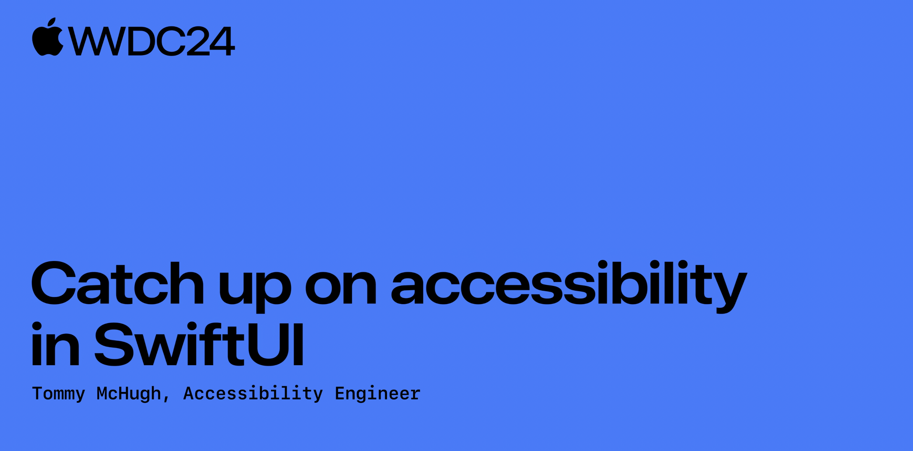

# Other

## 配图

## 自我介绍

Jason，[JXCategoryView](https://github.com/pujiaxin33/JXCategoryView) 的作者，希望能做 iOS 开发直到退休^_^

## 审核介绍

士土 Edmond 木，对 Rust 和 Swift 比较感兴趣，目前主要专注 Flutter 渲染上。[Github Page](https://looseyi.github.io/)

## 文章简介

深入了解 SwiftUI 如何提供开箱即用的内置 Accessibility，以及如何使用工具来完善和打造你的应用程序的 Accessibility。
