# WWDC24 10073 - SwiftUI 中的无障碍辅助功能更新

Accessibility (无障碍辅助功能，后续文章中简称为可访问性) 是任何优秀应用程序的基本组成部分，它允许每个人创建、连接和体验开发者构建的功能。SwiftUI 会帮助开发者在苹果平台上实现这些体验。

今天，我们将深入了解 SwiftUI 如何提供开箱即用的内置可访问性，以及如何使用工具来完善和打造开发者的应用程序的可访问性。

接下来，我们将讨论开发者可能需要向 SwiftUI 提供更多信息以提高应用中视图的可访问性的地方。最后，我们将探索如何构建丰富的交互，其中涉及到点击和拖放。

但在此之前先来回顾一下什么是可访问性。

## 什么是可访问性

在 iOS 开发中，**Accessibility（可访问性）** 指的是一系列特性、服务和 API，它们使得苹果的设备和操作系统能够为更广泛的人群提供服务，包括那些有视觉、听觉、物理或认知障碍的用户。可访问性的目标是确保每个人都能够使用和享受技术带来的好处，无论他们的个人能力如何。

以下是一些主要的可访问性特性和概念：
1. **VoiceOver**：又称为旁白，它是一个屏幕阅读器，为视力受限的用户提供音频反馈。它可以朗读屏幕上的文本、按钮和控件等信息。
2. **Switch Control**：允许用户使用一个或多个切换（如外部开关设备）来控制 iOS 设备，这对于运动受限的用户来说非常有用。
3. **Voice Control**：通过语音命令控制设备，无需使用触摸屏幕或物理按钮。
4. **Closed Captions（闭路字幕）**：为视频内容提供文字描述，帮助听力受限的用户理解对话和重要的声音提示。
5. **AssistiveTouch（辅助触控）**：为那些无法使用物理按钮的用户在屏幕上提供虚拟的按钮和控件。

其中 VoiceOver 是被广泛使用的可访问性特性之一，可以参考以下官网链接进行体验 VoiceOver 的操作方式和功能：
1. [在 iPhone 上打开和练习“旁白”](https://support.apple.com/zh-cn/guide/iphone/iph3e2e415f/ios)
2. [在 iPhone 上使用“旁白”手势](https://support.apple.com/zh-cn/guide/iphone/iph3e2e2281/ios)

## 前言

SwiftUI 从一开始就内置了对视图的可访问性支持，提供额外信息给可访问性技术也被变得容易，以优化应用程序中的体验。接下来，会基于下面的 Demo 来讲解可访问性。该应用程序可以发布描述了美丽海景的旅行日记，只需点击一下，就可以附加位置、海浪的录音或评价海滩的景色。每个人都可以对旅行日记发表评论，用户也可以收藏和回复他们的评论。

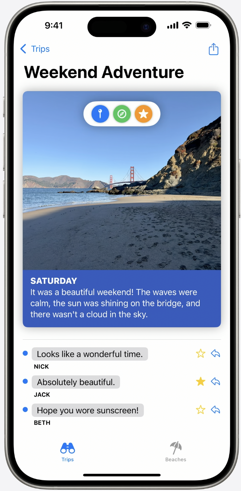

用户甚至可以为不同朋友的回复创建自定义声音！让我们继续探索 SwiftUI 如何实现这些功能所对应的可访问性特性。

SwiftUI 的主要输出之一就是创建可访问性元素（Accessibility Element）。可访问性元素是用来呈现和与应用程序内容交互的基本构建单元，它包括 VoiceOver、Voice Control 和 Switch Control 等。一个可访问性元素代表一个或多个视图，并提供属性（Attributes）来描述视图的内容，以及从点击到复杂手势的交互方式（Actions）。
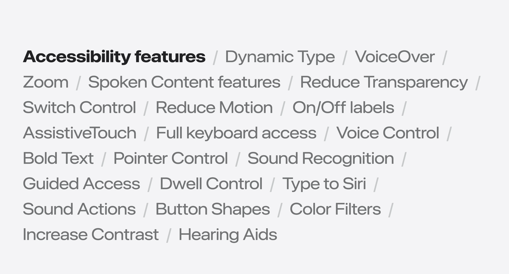

像 VoiceOver 这样的可访问性技术，它只能通过可访问性元素才能与应用程序交互。所以，视图内容中必须要包含可访问性元素才能被 VoiceOver 访问到。

## 可访问性树

为了更好地理解后续的内容，在这里补充说明一下可访问性树(Accessibility Tree)的概念。

可访问性树是 SwiftUI 为所有的可访问性元素创建的树状数据结构，它可以帮助可访问性系统在不同可访问性元素之间进行导航。
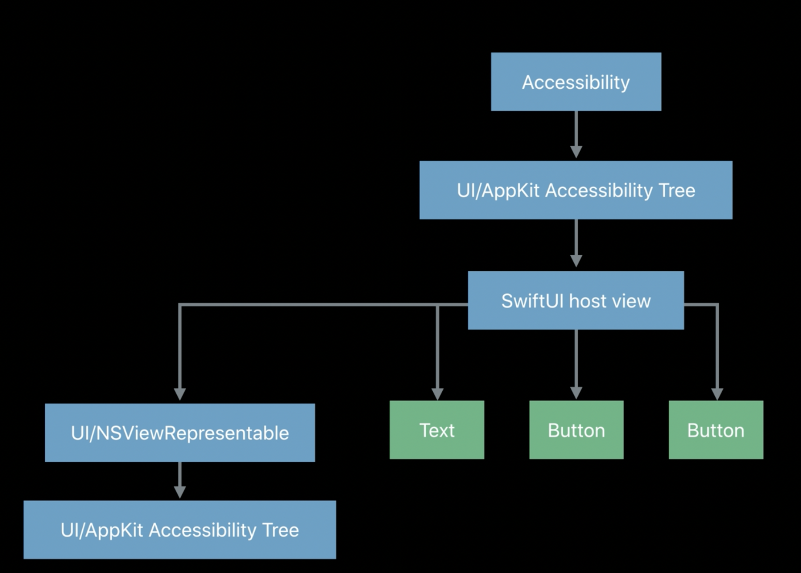

并且，它只会提取 SwiftUI 视图 body 中有可访问性元素的视图对象，如下图所示中的一个 Text 和两个 Button 对象。其中灰色的 Spacer 和 HStack 并不会被加入到可访问性树种。更多关于可访问性树的资料，请参考：[Accessibility in SwiftUI](https://developer.apple.com/videos/play/wwdc2019/238/)
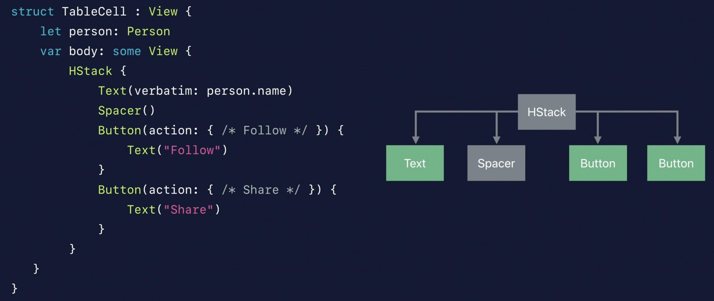
  
## 可访问性标签
接下来讲解应用程序中 Toggle 视图，它用来控制用户的朋友们是否可以评论用户发布的旅行日记。

Toggle 视图被声明在 view 的 body 中，SwiftUI 使用它来形成输出，包括屏幕上显示的内容和可访问性元素。
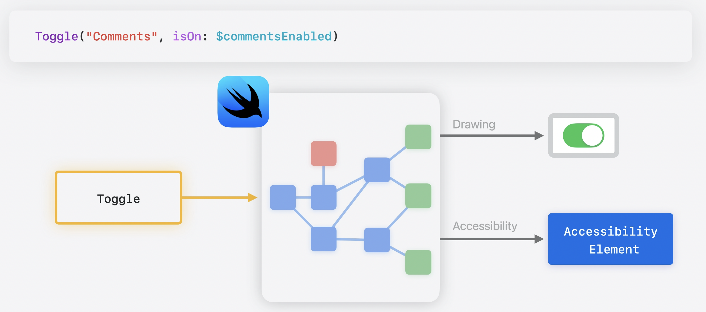

对于可访问性元素，"Comments" 文本被作为标签（Label）。`isToggle` 和 `isSelected` 特性(Traits)被应用于元素。并提供了一个按压操作来切换设置。
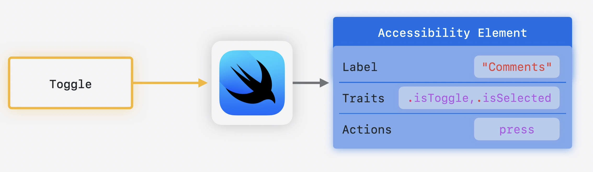

当 VoiceOver 聚焦于 Toggle 视图时，它的描述信息会被朗读，如果双击屏幕将会执行按压操作。VoiceOver 会将 Toggle 视图朗读为 "Settings, heading, comments, switch button off, on"，SwiftUI 将 "Comments" 文本和 Toggle 视图组合成了一个单一元素。
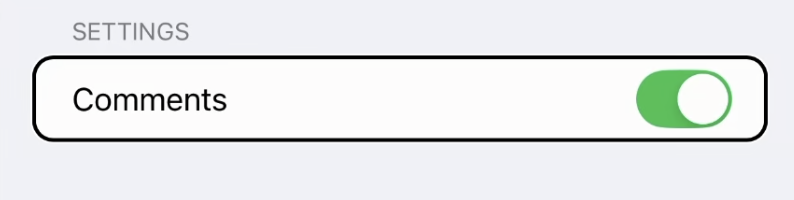

多个视图表示为一个可访问性元素，以简化导航（在 VoiceOver 中，用户通过左滑或者右滑来切换聚焦目标。），并将相关信息连接在一起。在改变视图视觉外观的同时，又不会失去系统内置的可访问性的支持，SwiftUI 强大的视图样式系统是其中的关键。

即使在改变视图的视觉样式（View styles）时，可访问性元素的 Attributes 和 Actions 也会应用于视图，并且不会被改变。换言之，VoiceOver 并不会关心 UI 的具体样式，而是关心它的可被理解的信息和交互。
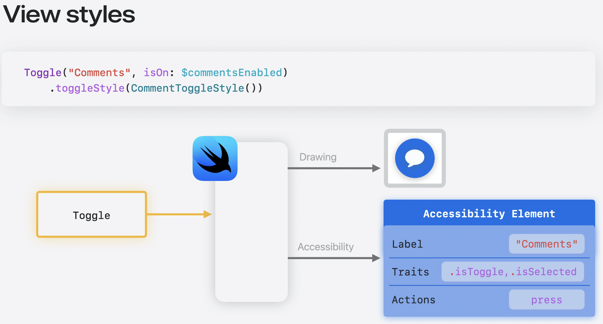

视觉样式在许多不同类型的控件上得到支持，比如控件类的 Button 和 Toggle ，分组类的 Label 和 LabeledContent ，以及指示器类的如 Progress 和 Gauge 。尽可能去使用视觉样式系统而不是创建自定义视图，否则，开发者将失去系统默认自动配置的可访问性元素，并不得不重新配置这些可访问性元素到自定义视图上。使用视觉样式和内置视图将在应用程序中提供良好的可访问性体验。并且，向 SwiftUI 提供的可访问性信息越多，体验就会越好。开发者可以使用可访问性修饰符（Accessibility Modifier）提供这些信息。

## 可访问性修饰符优化
可访问性修饰符能够让开发者自定义某个视图如何通过可访问性元素进行表示。可以向视图添加 Label 或 Trait 等属性。并且可以暴露用于交互性的 Action，如自定义手势。

可访问性修饰符甚至允许开发者将视图组合成一个单一元素以改善在 VoiceOver 中的导航体验。

接下来会通过3个例子，讲解如何通过可访问性修饰符来改进应用程序的 VoiceOver 体验。

### 默认没有可访问性元素优化

第一个优化点是未阅读指示器视图（就是在评论文案左边的蓝色小圆点，表示该评论没有被用户阅读过）。默认情况下，未阅读指示器视图没有可访问性元素，因为它被表示为形状视图，所以，让我们首先添加一个标签来描述评论是否没有被阅读过。
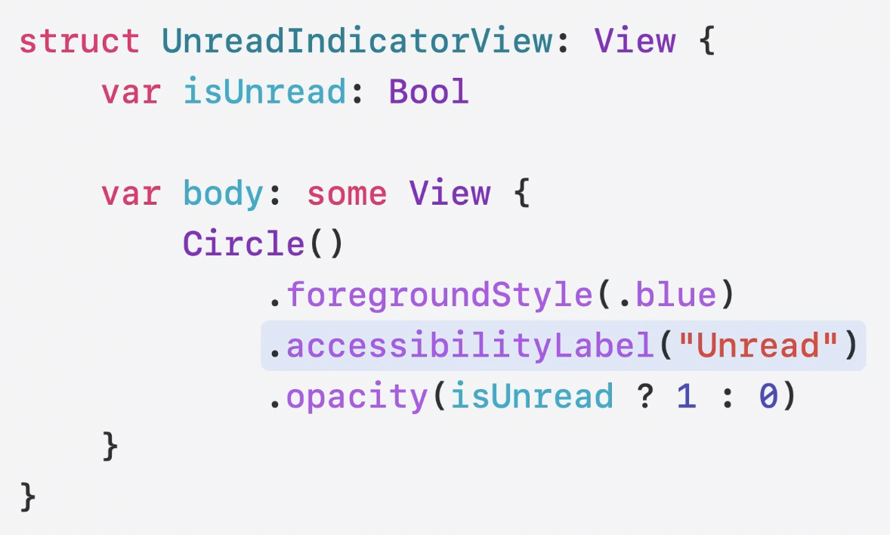

当评论是未读时，未阅读指示器视图将始终对可访问性系统可见。SwiftUI 在评论变为已读时也有所帮助。当评论是已读时，未阅读指示器视图的不透明度变为零，视觉上隐藏。SwiftUI 也会自动从可访问性系统中隐藏该元素。

### 多视图组合为单一元素优化
第二个优化点是简化在评论卡片视图之间进行导航。我们可以使整个评论卡片视图成为一个单一的可访问性元素，并将其中的每个按钮变成这个元素的 Action。通过应用 `.accessibilityElement(children: .combine)` 修饰符，多个元素的 Attributes 和 Actions 可以被组合在一起。
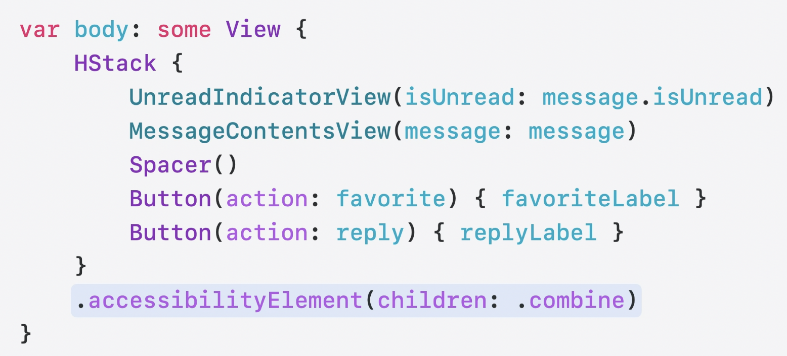
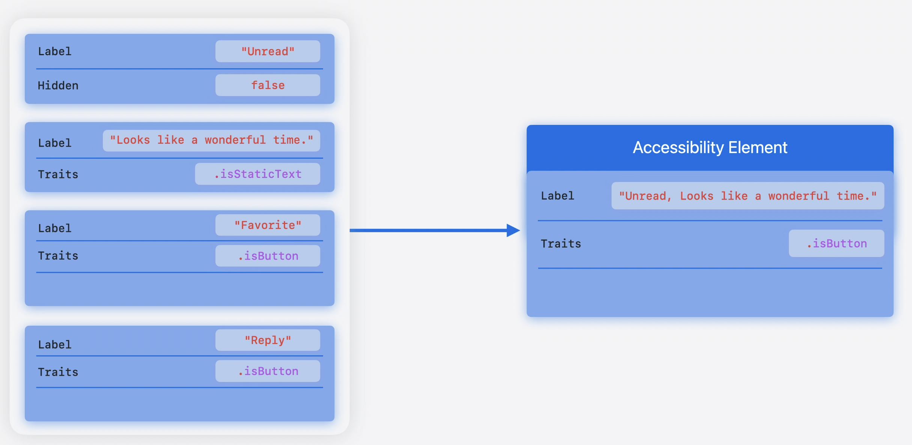

优化之后，整个评论卡片视图会被 VoiceOver 朗读为 "Unread, Looks like a wonderful time, Nick, button"。然后向上滑动切换 Action 的时候会依次朗读 "Favorite, reply"。
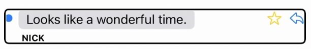

### 条件性可访问性标签优化
第三个优化点是当收藏按钮的状态发生变化的时候，可访问性元素的标签也需要跟着一同更新。让我们看看在优化之前都有哪些问题点。

当双击收藏评论按钮时，它变成了超级收藏。超级收藏使用一个新 Symbol 来表示它们的重要性。但这个变化引起了一个新问题，现在 VoiceOver 朗读了新 Symbol 的名字 sparkle，而不是它所代表的超级收藏含义。
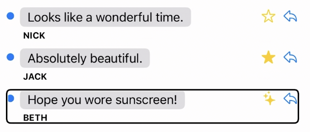

当在视图中使用 Symbol 时，可访问性系统会默认使用它的名字当做可访问性标签。我们可以使用如下图所示的修饰符去覆盖掉默认的可访问性标签，以提供更明确的定义。
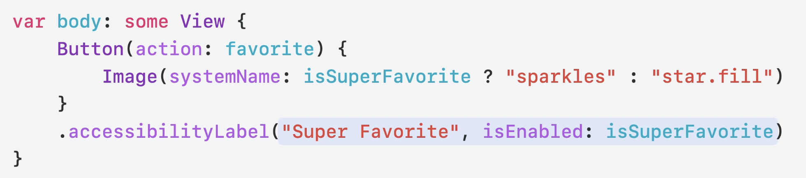

在 iOS 18 中，开发者现在可以向可访问性修饰符添加一个 `isEnabled` 参数。该修饰符仅在 `isSuperFavorite` 为 `true` 时生效。

## 交互方式增强

### 悬浮弹框交互增强

因为 VoiceOver 不支持悬浮弹框等交互方式，对于需要多次交互的场景，需要提供更简单的方法来呈现可访问性信息，可以提升使用应用程序的可访问性体验。

可以通过当视图因为悬停(Hover)、按键(Key Press)或手势(Gesture)等交互方式出现时，来探索这些增强功能。

下面将在 macOS 系统上展示如何优化悬停交互，当鼠标悬停在旅行日记图像上时，位置、录音和海滩评级的按钮将会出现。

像悬停视图这样动态出现的内容，可能需要更长的时间才能通过可访问性技术或触摸以外的替代输入源导航到，如键盘（Keyboard）或开关（Switch）。
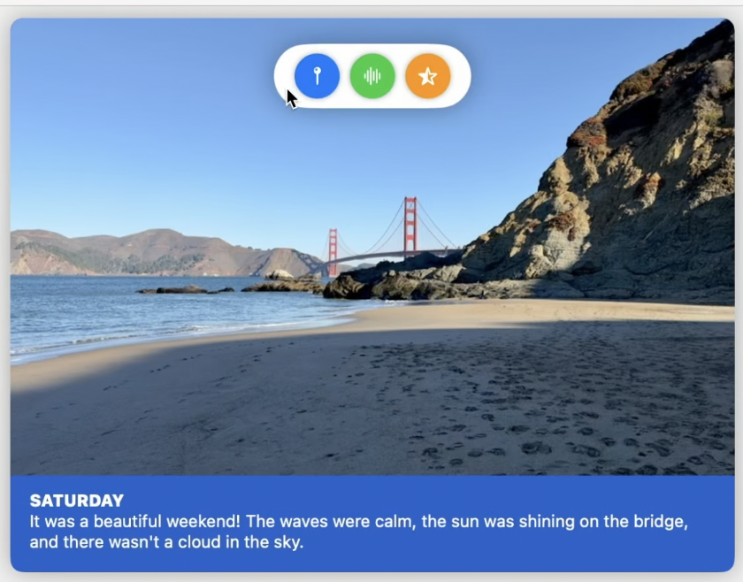

但 VoiceOver 必须执行很多步骤才能导航到这个视图。首先悬停交互必须使用命令被触发，并且悬停视图必须被聚焦。一旦悬停视图出现，其子视图也必须被导航到。然后交互结束之后，焦点也必须返回到原始视图。
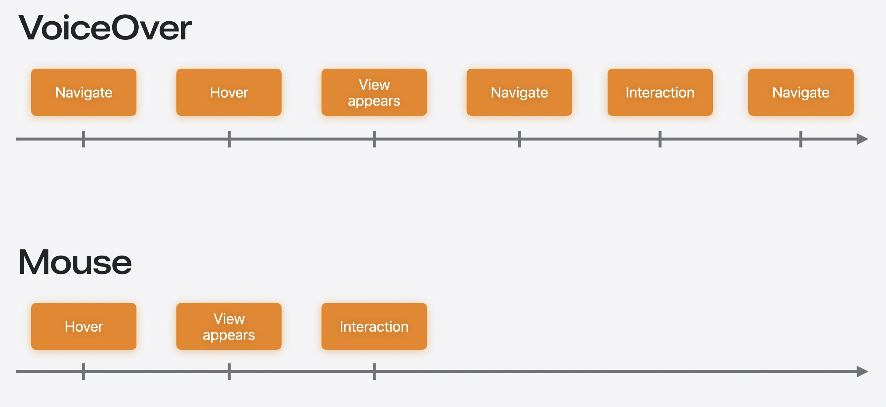

这种交互可以通过将悬停视图的可访问性 Attributes 和 Actions 作为主视图的一部分来进行简化。
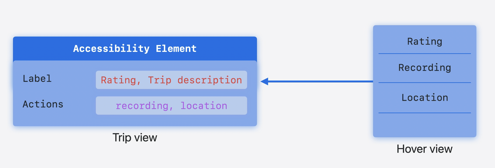

为了让悬浮控件更容易被访问，可以将它们变成 Trip View 上的自定义 Action 。
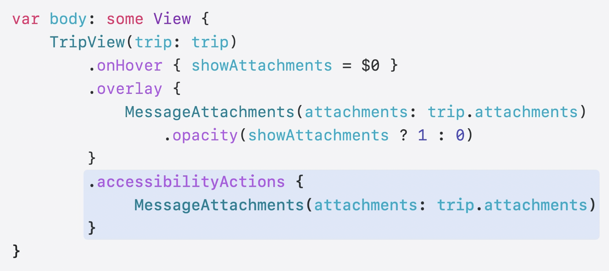

上图中 `accessibilityActions` 修饰符接受在 `overlay` 修饰符同样的 `MessageAttachments` 视图，它提取相同的控件并将它们转换为旅行视图上的自定义 Action。现在，悬停覆盖层和旅行视图的自定义 Action 可以共享相同的逻辑。有了这个改变，VoiceOver 现在可以在不显示悬浮视图的情况，去支持自定义的 Action。
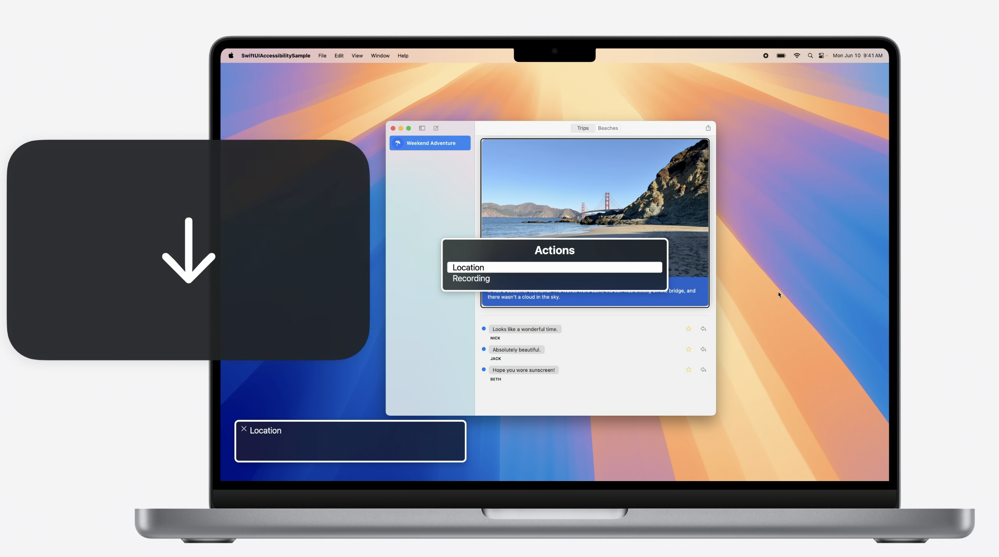

### 动态更新可访问性标签增强
当重要信息需要多次交互才能获取到时，开发者可能会考虑将该信息附加到不包括它的元素上，但使其更容易被导航到。
另外，如果开发者修改了可访问性元素的属性，如组合多个元素，开发者可能想包括由装饰视图（比如上文提到的未阅读指示器视图）提供的附加内容。

这两种情况都需要修改其内容可能不是静态的视图的标签，SwiftUI 提供了处理这两种情况的工具。

比如把评级信息附加到旅行视图元素的标签上，以简化使用 VoiceOver 找到它。

在下图中的可访问性标签修饰器中，现在也可以接受一个视图，并将从视图中提取文本并将其设置在现有元素的标签上。也就是说，它允许根据实际情况去动态地拼接额外的信息到最终的标签上。
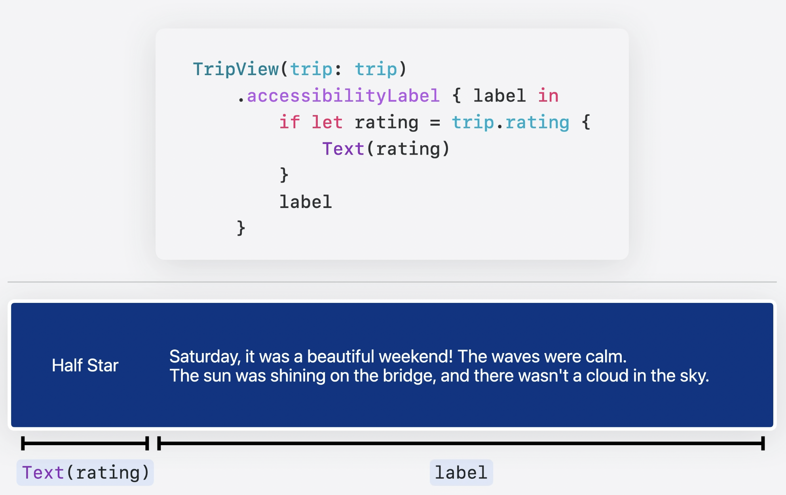

优化之后，在 VoiceOver 朗读旅行视图的时候，会在有评级信息的情况下，一同朗读评级信息："Half star, Saturday, It was a beautiful weekend! The waves were calm, the sun was shining on the bridge, and there wasn't a cloud in the sky.Image" 
 
### 拖放功能增强

在构建应用程序的交互时，重要的是要记住为触摸或鼠标的替代形式设计出色的体验。其中拖放（Drag and Drop）是开发者构建的许多体验的核心之一。

像 VoiceOver 和 Voice Control 这样的可访问性技术可以与拖放一起工作，SwiftUI 使用 `onDrag` 和 `onDrop` 修饰符支持可访问的体验。

拖放的用户界面是灵活的，因此有几种方法可以增强开发者的应用程序的体验。
接下来，我们要实现使用拖放为朋友们创建自定义提示音，当他们评论时就会播放对应的自定义提示音。

让我们用 VoiceOver 试试，我可以拖动多达三种声音为联系人创建提示音。
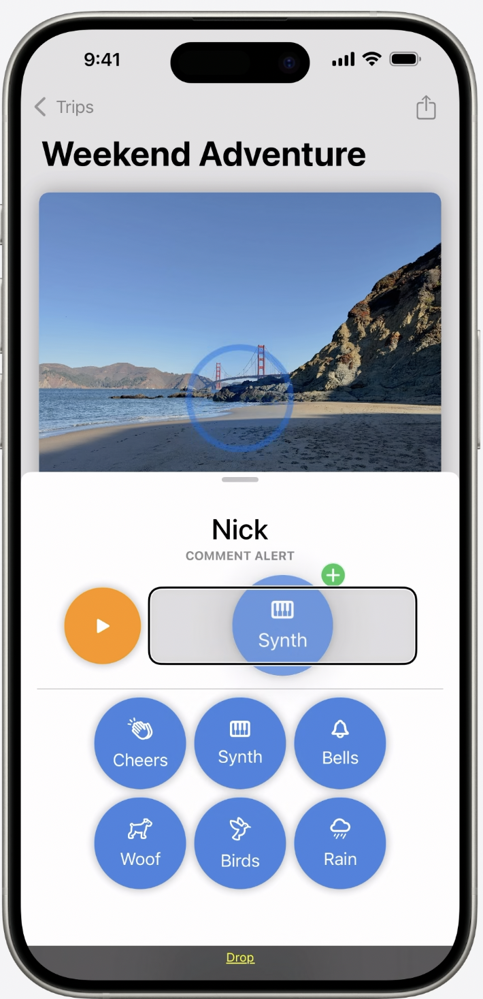

可访问性拖放点修饰符定义了开发者视图中可以拖或放的点。在评论提示音视图上，我定义了三个下放点，描述了我可以为提示音设置的三种不同声音。

每个点还提供了一个标签，描述将执行的交互。现在 VoiceOver 可以访问提示音视图上的每个下放点。
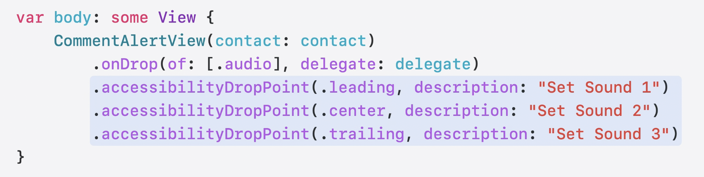

在构建拖放体验时，始终尝试使用可访问性技术进行测试，以确保它们提供的功能是可用的。

### Widget增强

可访问性交互可以扩展到开发者的应用程序之外，比如交互式 Widget 。在 Widget 视图中不会实时更新，所以，之前介绍的可访问性交互修饰符不会起作用。

应用程序意图（Intent）允许 Widget 创建像 Buttons 和 Toggles 这样的交互视图，但可能有一些地方可以通过额外的自定义操作来提升 Widget 的体验。下面会在 Widget 中实现一个功能，让用户可以快速评价和发布去过的海滩日记。只需点击一下，用户甚至可以更新我最喜欢的海滩的排名。每个按钮都由 SwiftUI 标记，并且可以由 VoiceOver 激活。
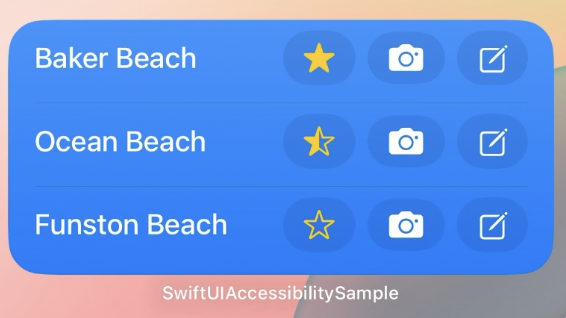

`accessibilityAction` 修饰符现在接受一个应用程序意图，当修饰符被调用时将执行该意图并更新开发者的 Widget。

在这里，添加了一个自定义操作，将海滩设置为我最喜欢的海滩，以及一个 `magicTap` 操作，只需双击就可以拍照。
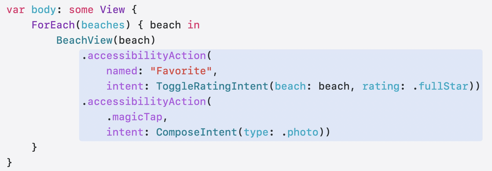

有了这些改变，用户现在可以标记我最喜欢的海滩，它将移动到列表的顶部。

## 总结
现在我们已经讲解了如何在 SwiftUI 应用程序中支持可访问性，并建议确保使用 VoiceOver 等可访问性技术测试应用程序。也研究了可访问性 API 如何帮助使应用程序的体验更好。并探索可访问性示例项目，以便更好地了解如何使用可访问性 API 来完善 SwiftUI 中的常见模式。

## 参考

1. [Apple - Catch up on accessibility in SwiftUI](https://developer.apple.com/videos/play/wwdc2024/10073/)
2. [Apple - Accessibility in SwiftUI](https://developer.apple.com/videos/play/wwdc2019/238/)
