# WWDC24 10074 - 动态字体体验入门

> 摘要：使用动态字体功能实现一个演示 App，对比 SwiftUI 与 UIKit 在实现上的异同点。

本文基于 Session [10074](https://developer.apple.com/videos/play/wwdc2024/10074/)、Xcode 16.0 beta 2 (16A5171r) 撰写，简析在 App 中使用 SwiftUI 和 UIKit 实现动态字体功能，后续版本可能存在 API 变更，请读者朋友们留意。可在 [nuomi1/TestDynamicType](https://github.com/nuomi1/TestDynamicType) 仓库中获取本文的全部代码。

> 本文基于系统内建的动态字体功能进行讲解，如希望在 App 中提供设置项单独处理，可参考微信 App。

## 为什么需要使用动态字体

用户的视力不同，有的用户视力较好，有的用户视力较差（年龄增长或者疾病），固定字体大小不利于视力较差的用户，因此需要调整字体大小以适应视力需求。除此之外，有的用户偏好更大的字体，有的则偏好更小的字体，提供自适应功能可以让用户更好地使用 App。还有一点，使用动态字体功能可以在 iOS、macOS、watchOS、tvOS、visionOS 等不同平台获得一致的体验，这对于支持多平台的 App 来说尤为实用。

在 iOS 中，用户可以在「设置」-「显示与亮度」-「文字大小」中调整字体大小。默认情况下，有 8 种尺寸可供选择，初始时文本以大尺寸（large）显示。开启「更大的辅助功能字体」后，共有 13 种尺寸可供选择。

不同于在「设置」中调整 App 的首选语言会导致 App 重启，调整动态字体不会导致 App 重启，用户可以实时查看调整后的效果，这对于用户来说是一种非常好的体验。从图片可以看到，原本单行的「更大的辅助功能字体」自动变成了多行，同时用户仍然可以通过上下滑动查看页面的所有内容。

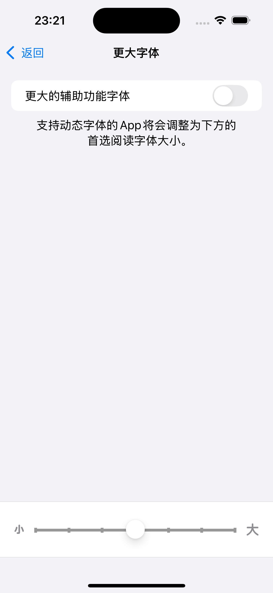

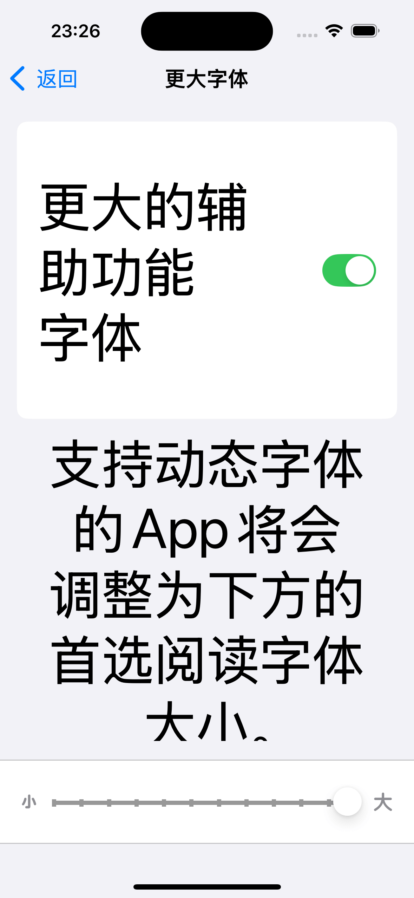

> 尺寸与字号的对应关系可在后续表格中查看。

除了在「设置」中调整动态字体，还可以在「控制中心」中调整动态字体。

> iOS 模拟器的「控制中心」无法调整动态字体，需要在真机上测试，因此暂无截图提供。

## 如何使用动态字体

在 App 中，应该尽量使用系统提供的文字样式来设置字体，而不是通过固定字号来设置字体，这样才能自动适配动态字体功能。系统内置的文字样式可以有效地区分标题、正文、脚注等不同内容，确保版面的层次关系，有助于提供出色的阅读体验。使用动态字体的代码非常简单，以下是在 SwiftUI 和 UIKit 中使用动态字体的示例。

在 SwiftUI 中，可以通过 `func font(_ font: Font?) -> Text` 设置动态字体，如下所示：

```swift
import SwiftUI

struct ContentView: View {

    var body: some View {
        Text("Hello, World!")
            .font(.body)
    }
}
```

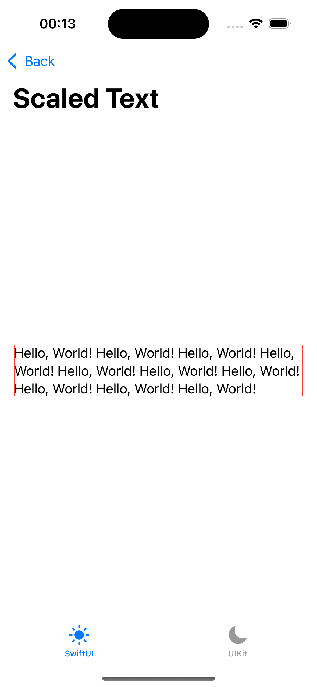

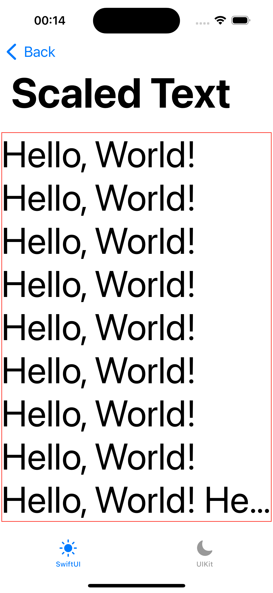

在 UIKit 中，可以通过 `class func preferredFont(forTextStyle style: UIFont.TextStyle) -> UIFont` 设置动态字体，如下所示：

```swift
import UIKit

class ViewController: UIViewController {

    override func viewDidLoad() {
        super.viewDidLoad()

        let label = UILabel()
        label.text = "Hello, World!"
        label.adjustsFontForContentSizeCategory = true
        label.font = .preferredFont(forTextStyle: .body)
        label.numberOfLines = 0

        view.addSubview(label)
        setupConstraints()
    }
}
```

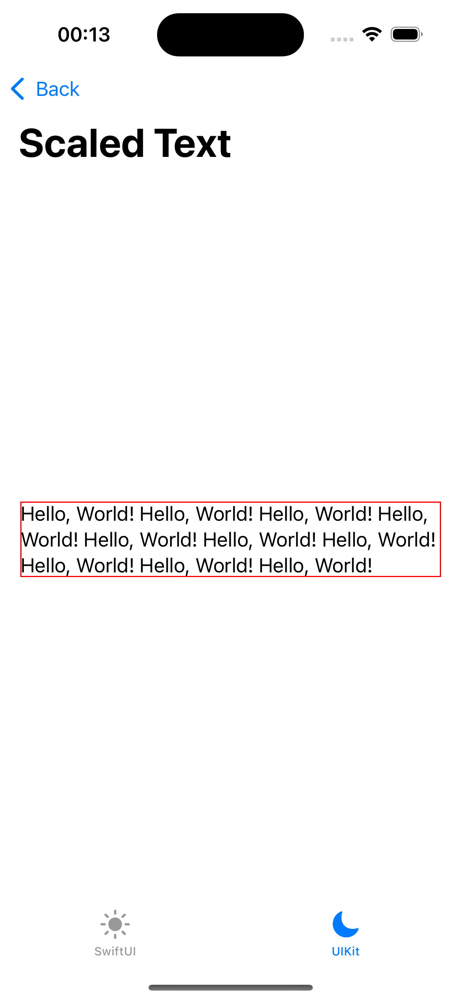

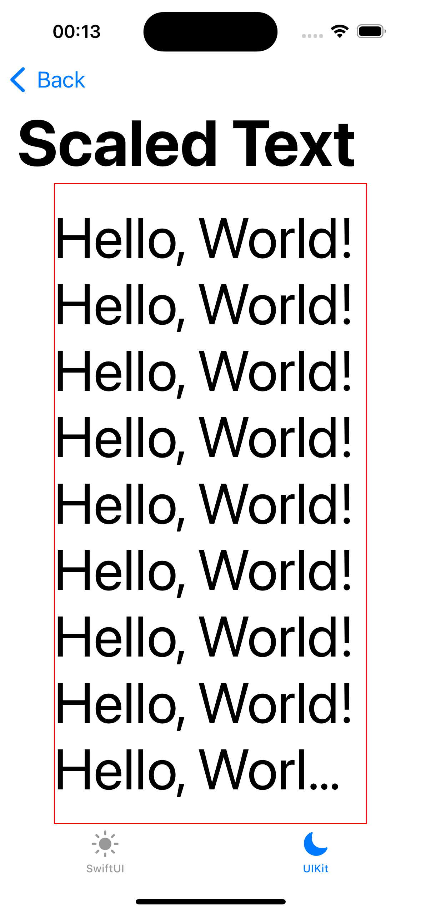

> 在 UIKit 中，需要设置 `adjustsFontForContentSizeCategory` 为 `true`，才能自动适配动态字体的效果，设置 `numberOfLines` 为 `0`，可以让 `UILabel` 自动换行。

在 iOS 中，动态字体与文字样式的字体大小关系并不是简单的等差数列，而是一种特殊的调整逻辑，对应关系如下：

| UIFont.TextStyle / DynamicTypeSize | xSmall | small | medium | large | xLarge | xxLarge | xxxLarge | accessibility1 | accessibility2 | accessibility3 | accessibility4 | accessibility5 |
| ---------------------------------- | ------ | ----- | ------ | ----- | ------ | ------- | -------- | -------------- | -------------- | -------------- | -------------- | -------------- |
| extraLargeTitle(bold)              | 33     | 34    | 35     | 36    | 38     | 40      | 42       | 44             | 46             | 48             | 50             | 52             |
| extraLargeTitle2(bold)             | 25     | 26    | 27     | 28    | 30     | 32      | 34       | 36             | 38             | 40             | 42             | 44             |
| largeTitle                         | 31     | 32    | 33     | 34    | 36     | 38      | 40       | 44             | 48             | 52             | 56             | 60             |
| title1                             | 25     | 26    | 27     | 28    | 30     | 32      | 34       | 38             | 43             | 48             | 53             | 58             |
| title2                             | 19     | 20    | 21     | 22    | 24     | 26      | 28       | 34             | 39             | 44             | 50             | 56             |
| title3                             | 17     | 18    | 19     | 20    | 22     | 24      | 26       | 31             | 37             | 43             | 49             | 55             |
| headline                           | 14     | 15    | 16     | 17    | 19     | 21      | 23       | 28             | 33             | 40             | 47             | 53             |
| subheadline(bold)                  | 12     | 13    | 14     | 15    | 19     | 19      | 21       | 25             | 30             | 36             | 42             | 49             |
| body                               | 14     | 15    | 16     | 17    | 19     | 21      | 23       | 28             | 33             | 40             | 47             | 53             |
| callout                            | 13     | 14    | 15     | 16    | 18     | 20      | 22       | 26             | 32             | 38             | 44             | 51             |
| caption1                           | 11     | 11    | 11     | 12    | 14     | 16      | 18       | 22             | 26             | 32             | 37             | 43             |
| caption2                           | 11     | 11    | 11     | 11    | 13     | 15      | 17       | 20             | 24             | 29             | 34             | 40             |
| footnote                           | 12     | 12    | 12     | 13    | 15     | 17      | 19       | 23             | 27             | 33             | 38             | 44             |

> 可参照此表选择合适的文字样式。

## 如何使用动态布局

在使用动态字体时，需要考虑字体大小的变化对布局的影响。开启「更大的辅助功能字体」后，字体会变得非常大，此时原有的布局可能无法满足需求，需要切换成新的布局。以下图为例，原本的布局是图标和文字垂直排列，四个图标和文字水平排列，开启「更大的辅助功能字体」后，原本的布局因为文字变得巨大难以展示较好的效果，可以改为图标和文字水平排列，四个图标和文字垂直排列。

在 SwiftUI 中，可以通过 `@Environment(\.dynamicTypeSize)` 获取动态字体大小，如果字体大小为辅助功能字体大小，可以使用 `HStackLayout` 布局，否则使用 `VStackLayout` 布局，如下所示：

```swift
import SwiftUI

struct FigureItemView: View {

    let figure: Figure

    @Environment(\.dynamicTypeSize)
    private var dynamicTypeSize

    var body: some View {
        dynamicLayout {
            Image(systemName: figure.systemImage)
                .font(.body)

            Text(figure.figureName)
                .font(.body)
        }
    }

    private var dynamicLayout: AnyLayout {
        dynamicTypeSize.isAccessibilitySize ? AnyLayout(HStackLayout()) : AnyLayout(VStackLayout())
    }
}
```

`HStackLayout` 和 `VStackLayout` 默认使用 `.center` 对齐方式，可以通过 `alignment` 参数设置对齐方式，如下所示：

```swift
import SwiftUI

struct FigureContentView: View {

    let figures: [Figure]

    @Environment(\.dynamicTypeSize)
    private var dynamicTypeSize

    var body: some View {
        dynamicLayout {
            ForEach(figures) { figure in
                FigureItemView(figure: figure)
            }
        }
    }

    private var dynamicLayout: AnyLayout {
        dynamicTypeSize.isAccessibilitySize ? AnyLayout(VStackLayout(alignment: .leading)) : AnyLayout(HStackLayout(alignment: .top))
    }
}
```

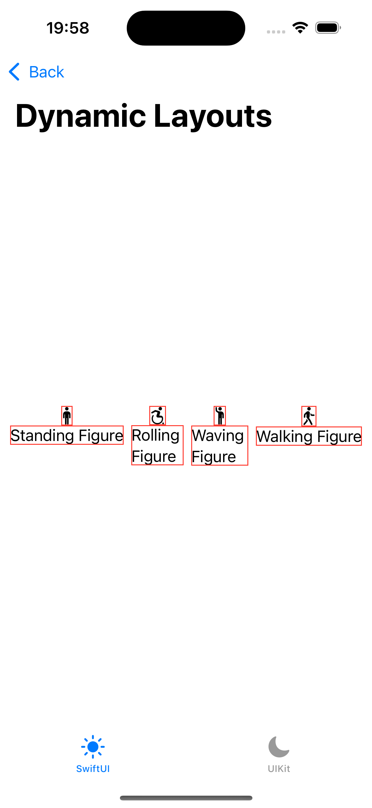

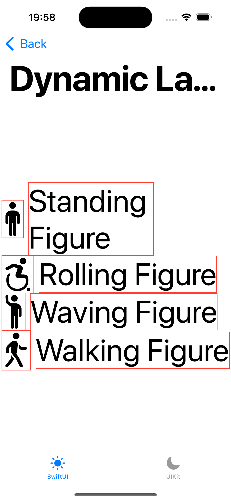

在 UIKit 中，可以通过 `UIContentSizeCategory.didChangeNotification` 监听动态字体大小的变化，根据字体大小的变化调整布局，如下所示：

```swift
import Combine
import UIKit

class ViewController: UIViewController {

    private var mainStackView: UIStackView!
    private var cancellables: Set<AnyCancellable> = []

    override func viewDidLoad() {
        super.viewDidLoad()

        setupStackView()
        setupConstraints()

        NotificationCenter.default
            .publisher(for: UIContentSizeCategory.didChangeNotification)
            .sink { [weak self] notification in
                self?.sizeCategoryDidChange(notification)
            }
            .store(in: &cancellables)
    }

    private func sizeCategoryDidChange(_ notification: Notification) {
        let sizeCategory = notification.userInfo![UIContentSizeCategory.newValueUserInfoKey]! as! UIContentSizeCategory
        mainStackView.axis = sizeCategory.isAccessibilityCategory ? .vertical : .horizontal
        mainStackView.alignment = sizeCategory.isAccessibilityCategory ? .leading : .center
    }
}

class FigureItemView: UIStackView {

    let figure: Figure

    private var cancellables: Set<AnyCancellable> = []

    init(figure: Figure) {
        self.figure = figure
        super.init(frame: .zero)
        setupStackView()

        NotificationCenter.default
            .publisher(for: UIContentSizeCategory.didChangeNotification)
            .sink { [weak self] notification in
                self?.sizeCategoryDidChange(notification)
            }
            .store(in: &cancellables)
    }

    private func sizeCategoryDidChange(_ notification: Notification) {
        let sizeCategory = notification.userInfo![UIContentSizeCategory.newValueUserInfoKey]! as! UIContentSizeCategory
        axis = sizeCategory.isAccessibilityCategory ? .horizontal : .vertical
    }
}
```

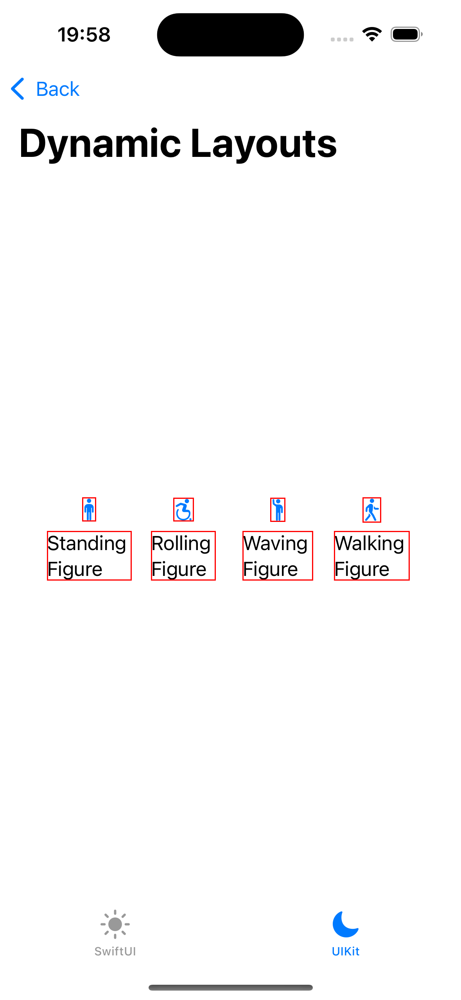

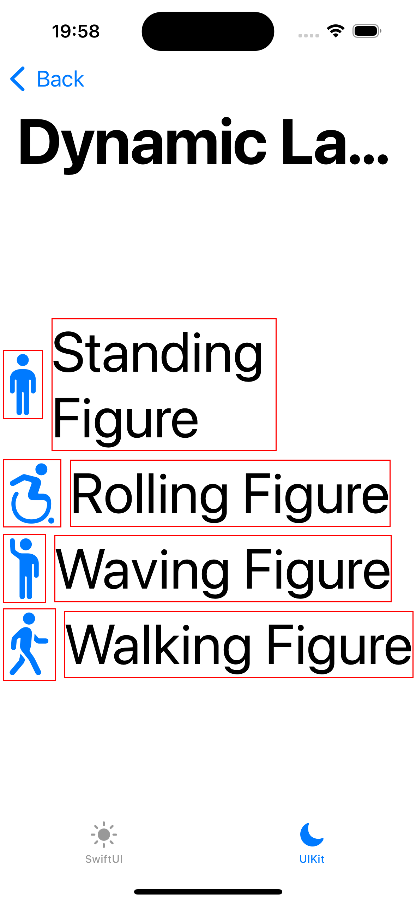

## 如何使用图像与符号

在图文混排中，需要考虑大字体下图文的对齐问题。例如「设置」中的选项，图标和文字是水平对齐的，开启「更大的辅助功能字体」后，文字会变为多行展示，此时如果仍然使用常规的水平布局，图标的下方则会显得空白。此时需要调整图标和文字的对齐方式，令文字的第二行行首对齐图标，以保证图文的整体美观。

在 SwiftUI 中，可以通过 `Label` 控件实现图文混排，如下所示：

```swift
import SwiftUI

struct FigureContentView: View {

    let figures: [Figure]

    var body: some View {
        List(figures) { figure in
            FigureItemView(figure: figure)
        }
    }
}

struct FigureItemView: View {

    let figure: Figure

    var body: some View {
        Label {
            Text(figure.figureName)
                .font(.body)
        } icon: {
            Image(systemName: figure.systemImage)
                .font(.body)
        }
    }
}
```

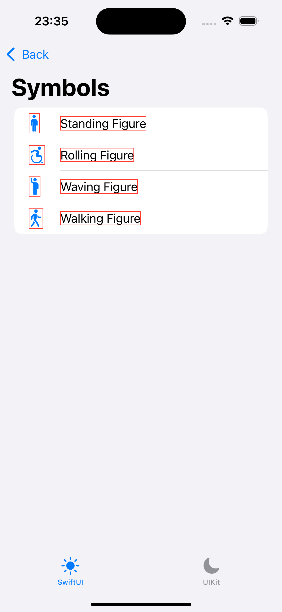

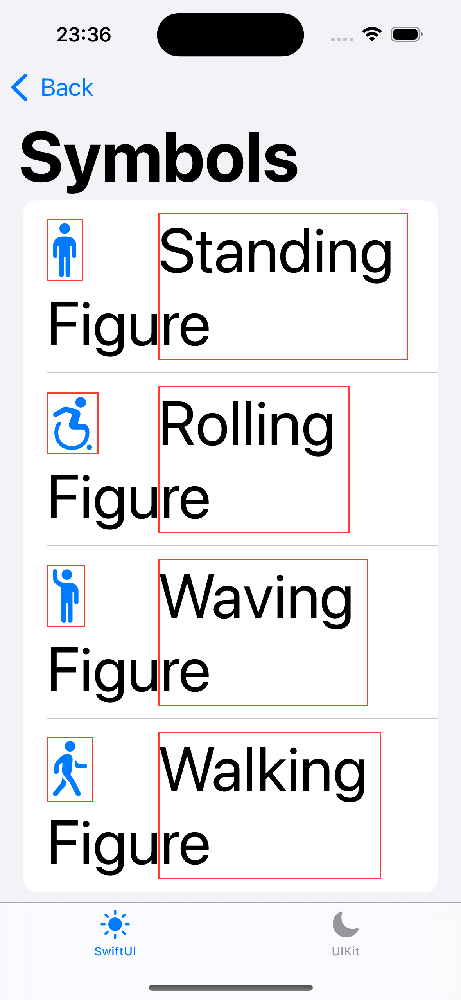

在 UIKit 中，可以通过 `NSTextAttachment` 实现图文混排，如下所示：

```swift
import UIKit

class ViewController: UIViewController {

    let figure: Figure

    override func viewDidLoad() {
        super.viewDidLoad()

        let label = UILabel()
        label.attributedText = attributedText(figure: figure)
        label.adjustsFontForContentSizeCategory = true
        label.font = .preferredFont(forTextStyle: .body)
        label.numberOfLines = 0

        view.addSubview(label)
        setupConstraints()
    }

    private func attributedText(figure: Figure) -> NSAttributedString {
        let attachment = NSTextAttachment()
        attachment.image = UIImage(
            systemName: figure.systemImage,
            withConfiguration: UIImage.SymbolConfiguration(font: .preferredFont(forTextStyle: .body))
        )

        let attributedString = NSMutableAttributedString(attachment: attachment)
        attributedString.append(NSAttributedString(string: "    "))
        attributedString.append(NSAttributedString(string: figure.figureName))

        return attributedString
    }
}
```

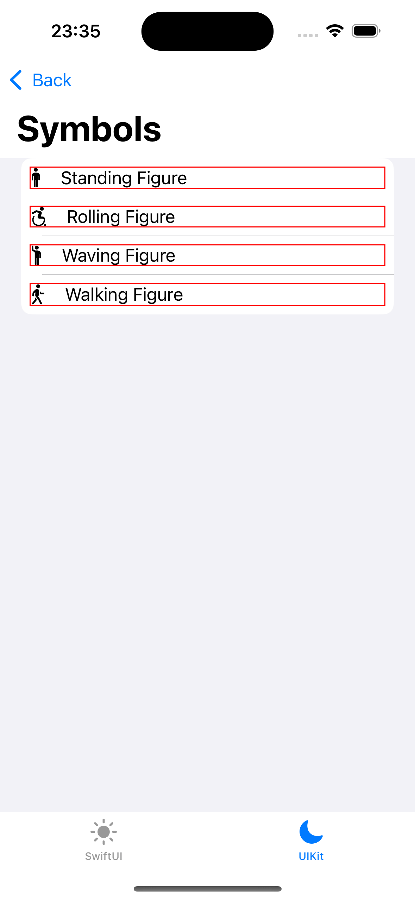

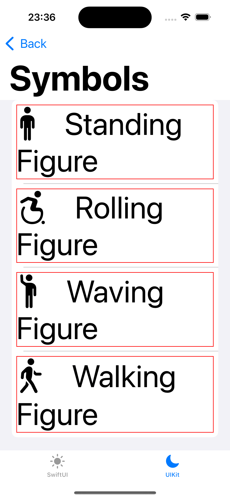

## 如何使用大型内容查看器

在导航栏和底部栏等视图中，文字不会像常规的辅助字体那样变得特别巨大，而是需要考虑版面的整体效果，限制在一定的高度。此时可以使用大型内容查看器，让用户更好地查看核心内容。

在 SwiftUI 中，可以通过 `accessibilityShowsLargeContentViewer` 修饰符设置大型内容查看器，如下所示：

```swift
import SwiftUI

struct FigureContentView: View {

    let figures: [Figure]

    @State
    private var selectedFigure: Figure?

    var body: some View {
        HStack {
            ForEach(figures) { figure in
                FigureItemView(figure: figure)
                    .onTapGesture {
                        selectedFigure = figure
                    }
            }
        }
        .sheet(item: $selectedFigure) { figure in
            FigureItemView(figure: figure)
        }
    }
}

struct FigureItemView: View {

    let figure: Figure

    var body: some View {
        Label {
            Text(figure.figureName)
        } icon: {
            Image(systemName: figure.systemImage)
        }
        .accessibilityShowsLargeContentViewer {
            Label(figure.figureName, systemImage: figure.systemImage)
        }
    }
}
```

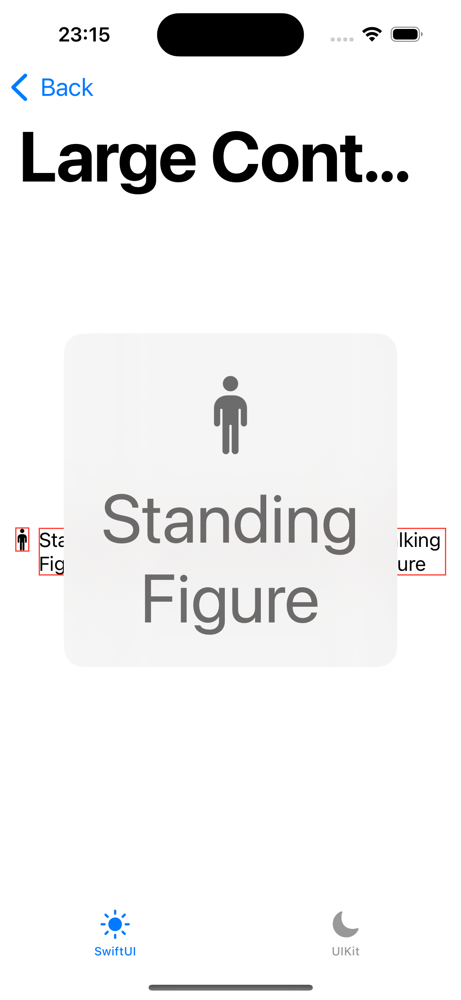

在 UIKit 中，可以通过 `UILargeContentViewerInteraction` 设置大型内容查看器，如下所示：

```swift
import UIKit

class FigureItemView: UIStackView {

    let figure: Figure

    init(figure: Figure) {
        self.figure = figure
        super.init(frame: .zero)
        setupStackView()
        setupInteraction()
    }

    private func setupInteraction() {
        addInteraction(UILargeContentViewerInteraction())
        largeContentImage = UIImage(systemName: figure.systemImage)
        largeContentTitle = figure.figureName
        scalesLargeContentImage = true
        showsLargeContentViewer = true
    }
}
```

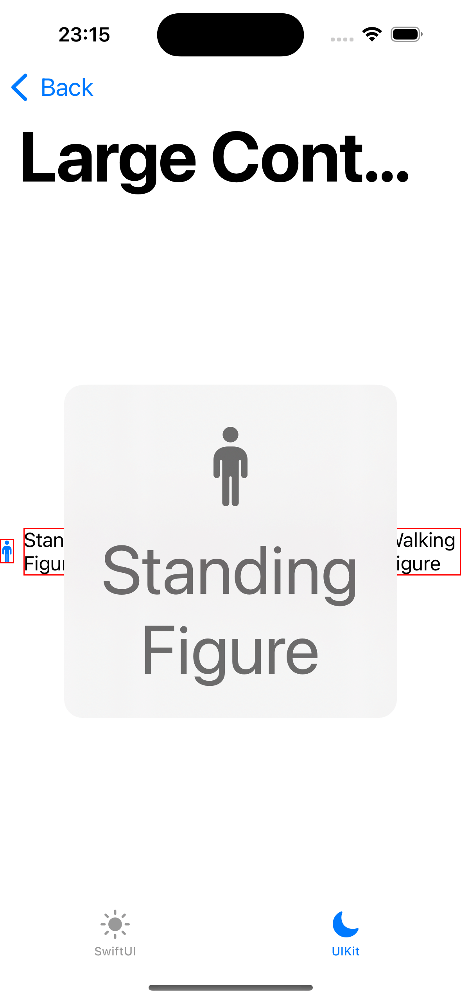

> 需要注意的是，大型内容查看器的功能仅在使用「更大的辅助功能字体」时有效。同时该功能的触发方式为长按，需要处理与长按手势识别器的互斥逻辑。

## 总结

本文简析了在 App 中使用 SwiftUI 和 UIKit 实现动态字体功能，通过对比两者的异同点，希望读者朋友们能够更好地理解动态字体的使用方法。在实际开发中，可以根据需求选择合适的技术方案，提高 App 的使用体验。

## 参考

1. [Apple - Get started with Dynamic Type](https://developer.apple.com/videos/play/wwdc2024/10074/)
2. [Apple - Enhancing the accessibility of your SwiftUI app](https://developer.apple.com/documentation/Accessibility/enhancing-the-accessibility-of-your-swiftui-app)
3. [Moving Parts - SwiftUI under the Hood: Fonts](https://movingparts.io/fonts-in-swiftui)
