# WWDC24 10100 - ARKit 新功能介绍
  
本文是介绍 2024 年 ARKit 的新增内容，基于[Session 10100](https://developer.apple.com/videos/play/wwdc2024/10100)梳理。

## Vision OS 与 ARKit

在 Vision OS 应用程序中实现 AR 功能时，我们能够利用 ARKit 提供的丰富数据。当应用程序展示一个完整的三维空间时，它能够接收来自 ARKit 的锚点数据，这些锚点不仅具有位置信息，还包含方向信息。例如，平面检测功能通过 `PlaneAnchors` 形式提供，它们携带着关于现实世界中检测到的表面的关键信息。

ARKit 通过 Data Provider 接口，将这些锚点传递给应用程序。Data Provider 是一个配置单个 ARKit 功能并接收其数据的接口。特别地，PlaneDetection Provider 负责接收平面锚点，允许开发者更精确地理解和利用现实世界的几何结构。

关系图如下：

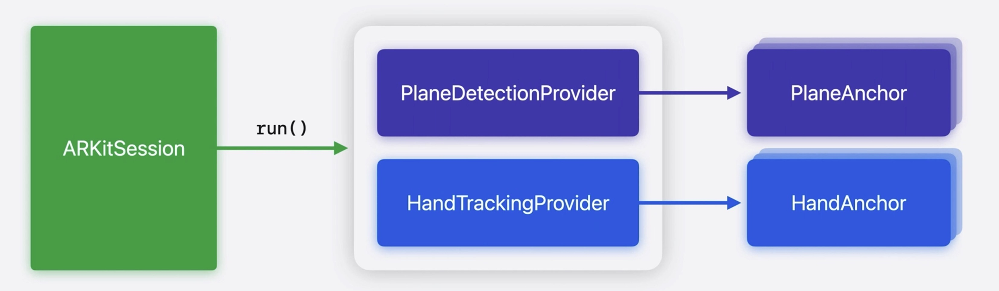


## ARKit 的新内容

在今年的 WWDC 2024 上，ARKit 带来了几项更新，它们分别是：

1. **房间追踪**：识别并适应用户所在的房间环境。
2. **物体追踪**：对物体的识别与追踪。
3. **倾斜平面检测**：新增加斜平面的识别能力。
4. **现实场景追踪**：优化在低光照条件下的追踪稳定性。
5. **手部追踪**：低延迟实时更新，预测未来位置，优化流畅性。


## 房间追踪概述

如图所示，当你在房间内，ARKit 会利用之前的功能，识别垂直平面和水平平面。

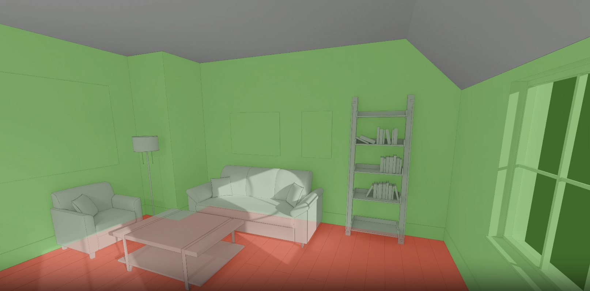


ARKit 不仅能够识别垂直和水平的平面，还可以计算检测到的墙壁和地板的精确几何形状。此外，ARKit 可以识别出房间之间的转换。当您进入一个新区域时，它将切换到为您现在所处的空间并提供数据。这可以帮助您的应用根据您所在的房间展示不同的体验。

### 房间转换示例

如图所示，方便是从右边房间，进入到左边的房间。

| 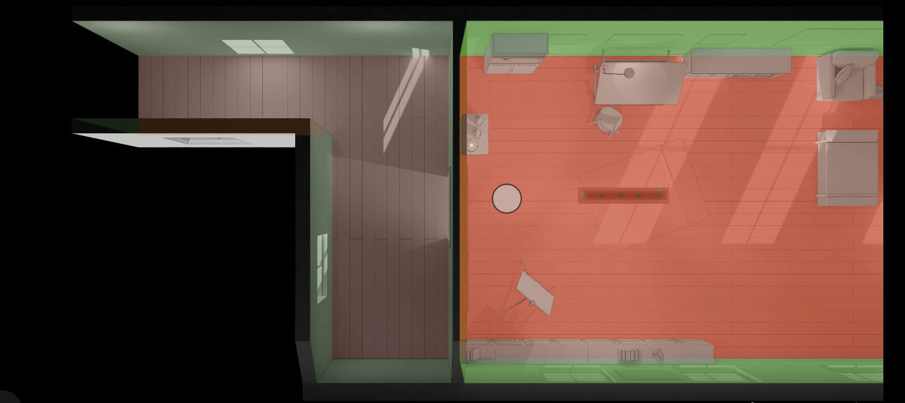 | 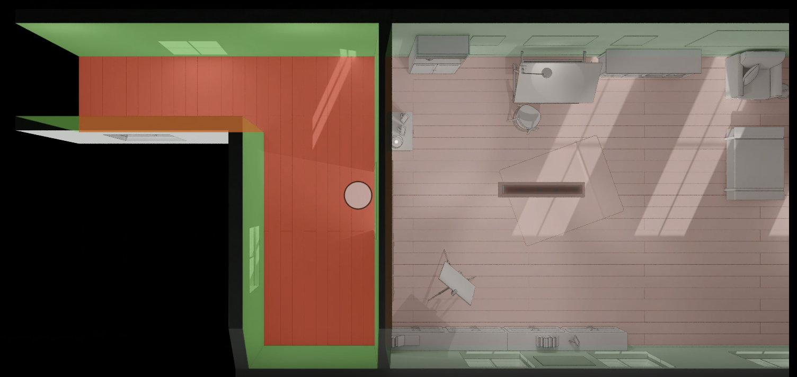 |
| ------------------------------------------------------------ | --------------------------------------------------- |

### 房间追踪的代码实现

在 ARKit 的框架中，房间追踪功能通过 `RoomTrackingProvider` 类和 `RoomAnchor` 结构体来实现。以下是一些关键的代码片段，它们展示了如何使用这些新 API：

#### RoomTrackingProvider 类

`RoomTrackingProvider` 类提供了当前房间的锚点数据，并通过异步序列 `anchorUpdates` 来更新这些数据。

```swift
public final class RoomTrackingProvider: DataProvider, Sendable {
    public var currentRoomAnchor: RoomAnchor? { get }
    public var anchorUpdates: AnchorUpdateSequence<RoomAnchor> { get }
}
```

#### RoomAnchor 结构体

`RoomAnchor` 结构体代表了一个房间的锚点，提供了房间的几何信息、是否为当前房间的标记，以及房间是否包含特定点的检测方法。

```swift
public struct RoomAnchor: Anchor, Sendable, Equatable {
    public var isCurrentRoom: Bool { get }
    public var geometry: MeshAnchor.Geometry { get }
    public func geometries(of classification: MeshAnchor.MeshClassification) -> [MeshAnchor.Geometry]
    public func contains(_ point: SIMD3<Float>) -> Bool
    public var planeAnchorIDs: [UUID] { get }
    public var meshAnchorIDs: [UUID] { get }
}
```

### 房间追踪小结

房间追踪技术利用 ARKit 的 `RoomTrackingProvider` 和 `RoomAnchor` 为开发者带来创新的空间交互体验。它能够精确识别房间边界和结构，同时感知用户在房间间的移动，为个性化空间计算体验提供了可能。


## 倾斜平面检测

ARKit 现在支持了有角度的倾斜平面检测，对之前只支持垂直和水平平面检测的一个扩展。新的功能允许开发者更准确地在倾斜面上放置虚拟物品，增强了用户体验。

如图所示，紫色部分是新加的倾斜平面

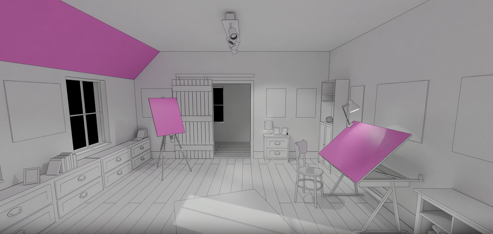

之前添加物品在倾斜面上不是很准确，现在可以更加准确了

开发者可以通过更新 `PlaneDetectionProvider` 配置的对齐方式，加入倾斜对齐方式，从而获取倾斜平面的 `PlaneAnchors`。

```
let planeDetection = PlaneDetectionProvider(alignments: [.horizontal, .vertical, .slanted])
```

### 倾斜平面检测小结

家居设计应用可利用倾斜平面检测技术，模拟家具摆放于倾斜屋顶或墙面，提高视觉真实性和空间评估。游戏开发者可借此技术实现角色和物体在斜坡或楼梯上的自然交互，增强游戏真实感和沉浸感。


## 物体追踪

ARKit 现在可以追踪静态放置在环境中的真实世界物体。通过物体追踪，我们可以获得每个物品的位置和方向。例如，一款教育应用可以在用户观察某些仪器时，展示 3D 可视化效果。

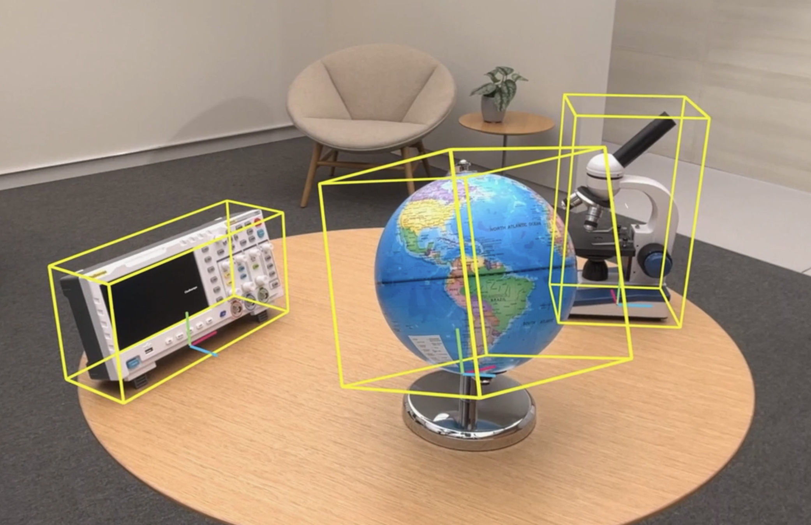

### 物体追踪对象

要让 ARKit 追踪这些项目，您需要提供 `ReferenceObjects`。首先，我们需要以 USDZ 格式制作一个物品的 3D 模型。然后，您可以使用 Create ML 的新空间物体追踪功能，以便从您的资产生成 `ReferenceObjects`。最后，您可以使用 ARKit 来进行追踪。

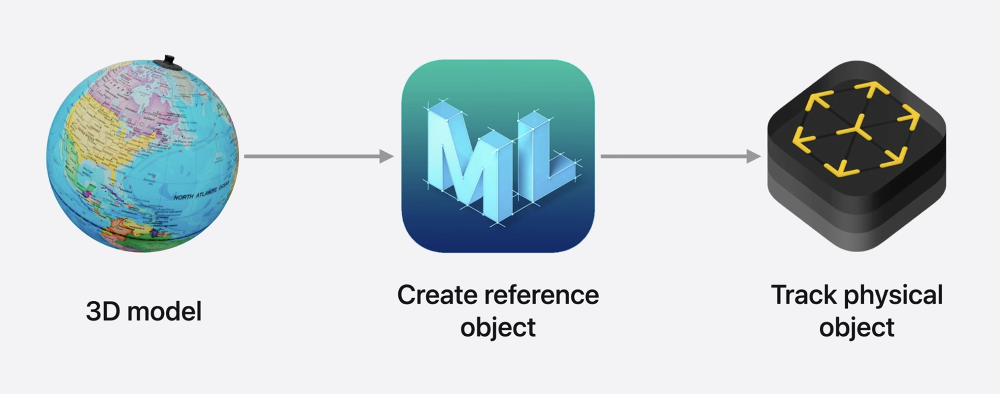


### 物体追踪的代码实现

**1 加载参考对象**：首先，需要从指定路径加载参考对象。

```swift
Task {
    do {
        let url = URL(fileURLWithPath: "/path/to/globe.referenceobject")
        let referenceObject = try await ReferenceObject(from: url)
        let objectTracking = ObjectTrackingProvider(referenceObjects: [referenceObject])
    } catch {
        // 处理参考对象加载错误。
    }
}
```

**2 启动 ARKit 会话**：然后，使用加载的参考对象启动 ARKit 会话，并运行物体追踪提供者。

```swift
let session = ARKitSession()

Task {
    do {
        try await session.run([objectTracking])
    } catch {
        // 处理会话运行错误。
    }
    
    for await event in session.events {
        switch event {
        case .dataProviderStateChanged(_, newState: let newState, _):
            if newState == .running {
                // 准备开始处理锚点更新。
            }
        }
    }
}
```

**3 处理追踪结果**：追踪结果将以 `ObjectAnchors` 的形式交付，每个 `ObjectAnchor` 代表一个被追踪的物体。

```swift
@available(visionOS, introduced: 2.0)
public struct ObjectAnchor: TrackableAnchor, Sendable, Equatable {
    public struct AxisAlignedBoundingBox: Sendable, Equatable {
        // 定义边界框的属性
    }

    public var boundingBox: AxisAlignedBoundingBox { get }
    public var referenceObject: ReferenceObject { get }
}
```

开发者可以通过 `ObjectAnchor` 获取物体的边界框、中心点、范围以及最小和最大的 3D 坐标点，从而在 AR 场景中准确地放置和操作虚拟对象。

### 演示

地球仪上可以添加一个带有阴影效果的轨道天体模型。

<!--<p align="center">-->
<!--    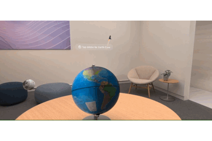-->
<!--</p>-->


此外，还可以观察地心的情况。

<!--<p align="center">-->
<!--    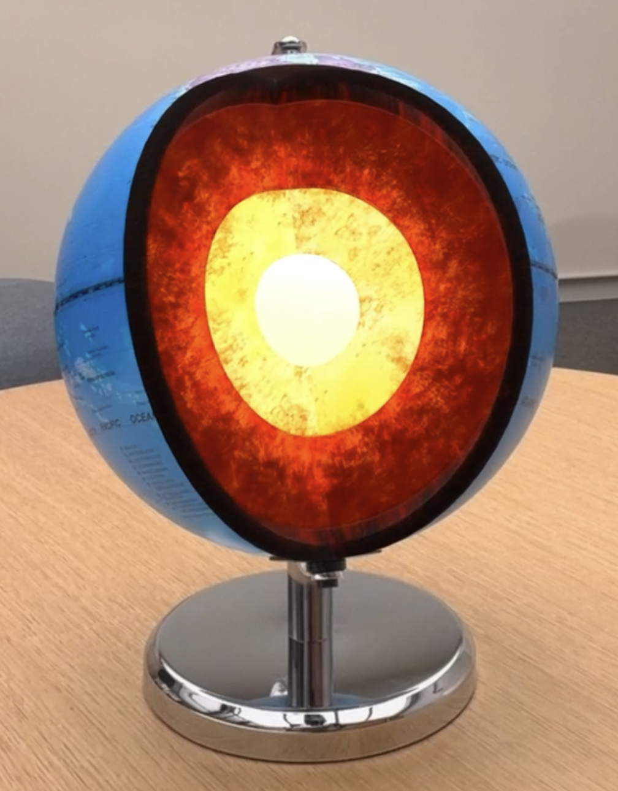-->
<!--</p>-->


### 其他展示

<!--<p align="center">-->
<!--    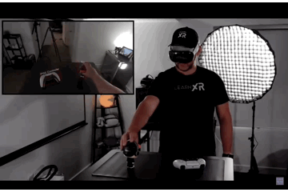-->
<!--</p>-->


物体周围环绕的红色线条，是根据 ARKit 所提供的数据生成的，用以标示物体的边界。

### 物体追踪小结

物体追踪功能让 ARKit 能够精准地在现实世界中定位和追踪静态物体，为增强现实体验带来更丰富的交互性和视觉表现。物体追踪算是苹果开的一个很好的感知世界的口子，开发者从之前的两眼一黑变成了可以主动追踪某个物体。referenceobject 作为一个文件可以做到自由下发，可以发散出很多的玩法。


## 现实场景追踪

ARKit 在 WWDC24 上的更新中，特别针对现实场景追踪进行了优化，以应对不同光照条件下的挑战。这项更新确保了即使在光线不足的环境中，ARKit 依然能够提供稳定和可靠的追踪体验。

如果一个人所在的物理位置光照不足，就会影响传感器数据，并可能导致算法无法流畅运行。例如，在黑暗、无照明的房间中，可能会影响您在体验时的现实场景追踪质量。今年 ARKit 通过一系列的措施来减轻这个问题。如果系统检测到由于低光条件或其他物理因素导致的追踪受限，它将仅追踪其方向的变化，而不追踪其在空间中的位置。您的应用程序将从系统级别的基于方向追踪功能中受益，例如，您可能希望重新排列您放置的内容，而它们的锚定位置不会更新。

### 现实场景追踪的更新描述

在之前的版本中，ARKit 的现实场景追踪可能会因为环境光照不足而受到影响，导致追踪质量下降。为了解决这个问题，苹果引入了一种新的机制。当系统检测到由于低光条件或其他物理因素导致的追踪受限时，ARKit 将切换到仅追踪方向变化的模式，而不追踪对象在空间中的具体位置。

### 改进后的响应机制

在新的机制下，开发者可以通过检查 `deviceAnchor` 的 `trackingState` 属性来了解当前的追踪状态，并据此调整应用的行为：

```swift
// 获取 WorldTrackingProvider 启动后当前时间的设备锚点
let deviceAnchor = worldTracking.queryDeviceAnchor(atTimestamp: CACurrentMediaTime())
if deviceAnchor.trackingState == .tracked { 
    // 追踪状态正常，持久化的世界锚点将被追踪
} else if deviceAnchor.trackingState == .orientationTracked { 
    // 考虑根据方向追踪调整内容展示
}
```

在这个示例中，`.tracked` 表示追踪状态正常，ARKit 能够准确追踪设备在空间中的位置和方向。而 `.orientationTracked` 表示由于环境限制，ARKit 仅能追踪设备的方向变化，此时开发者可能需要调整 AR 内容，以适应这种变化。

### 现实场景追踪小结

ARKit 的更新提升了在低光环境下的追踪稳定性，通过智能切换追踪模式，确保了 AR 体验的连续性和质量。


## 手部追踪

随着 visionOS 的推出，苹果增加了追踪人的手和手指的功能，应用程序可以利用这些信息来检测手势。


### 手部追踪关键代码如下

```swift
public final class HandTrackingProvider: DataProvider, Sendable {
    /// 获取最新的左右手锚点，以元组形式返回
    
    /// 如果手部追踪提供者没有运行，或者自上次访问此变量以来没有追踪到任何一只手，则锚点将为nil
    public var latestAnchors: (leftHand: HandAnchor?, rightHand: HandAnchor?) { get }

    /// 所有锚点更新的异步序列
    public var anchorUpdates: AnchorUpdateSequence<HandAnchor> { get }
}
```

我们可以从 `HandTrackingProvider` 获得最新更新，也可以在 `HandAnchors` 可用时进行异步接收。 `anchorUpdates` 更新有一些延迟，但更加流畅。

效果如下：

<!--<p align="center">-->
<!--    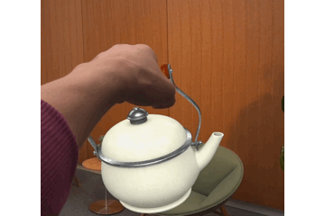-->
<!--</p>-->


苹果通过预测技术来减少延迟问题。
它现在增加了对`HandAnchors`的支持，这使得开发者能够更准确地追踪和预测手部动作。无论是使用 Composite Services  还是 RealityKit 进行渲染，开发者都可以利用这个新的手部预测 API 来提高追踪的速度和准确性。

### 关键代码如下

```swift
func submitFrame(_ frame: LayerRenderer.Frame) {
    ...

    guard let drawable = frame.queryDrawable() else { return }

    // 获取目标追踪锚点时间。
    let trackableAnchorTime = drawable.frameTiming.trackableAnchorTime

    // 将时间戳转换为秒单位。
    let anchorPredictionTime = LayerRenderer.Clock.Instant.epoch.duration(to: trackableAnchorTime).timeInterval

    // 预测提供最佳内容注册时间的 hand anchors。
    let (leftHand, rightHand) = handTracking.handAnchors(at: anchorPredictionTime)
    
    ...
}
```

如果使用的是 Composite Services，应该以“trackable anchor time”作为目标，这是 visionOS 的新功能，在此时间戳预测 `HandAnchors` 将帮助您实现最佳内容注册。可以将该时间戳转换成秒数，然后将其交给 ARKit 进行复杂的前向预测。

效果如下：

<!--<p align="center">-->
<!--    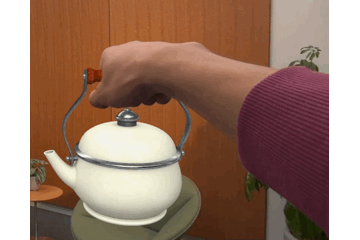-->
<!--</p>-->


可以看出降低了延迟

这两种手部追踪方式适用于不同的场景：与显示屏刷新率同步方案非常适合那些对延迟不太敏感的手势检测和绘制流畅笔画的体验；而手部预测的方案则适用于需要将虚拟内容紧密附着在手部上的场景，尤其是在流畅性不是首要考虑因素的情况下。

### RealityKit 中的 `HandAnchorEntities` 进展

苹果还在 RealityKit 的 `HandAnchorEntities` 方面取得进展。如果您使用 RealityKit 将虚拟内容附加到您的手附近，可以根据需要选择`continuous`或`predicted`手部跟踪。

### 关键代码

```swift
// 请求一个平滑但有延迟的手部锚点实体。
let leftHandAnchor = AnchorEntity(.hand(.left, location: .wrist), trackingMode: .continuous)

// 请求一个预测的、低延迟的手部锚点实体。
let rightHandAnchor = AnchorEntity(.hand(.right, location: .wrist), trackingMode: .predicted)
```

### 手部追踪小结

手部追踪是 ARKit 在 visionOS 上的一个重要更新，它为开发者提供了更自然和直观的交互方式。通过 `HandTrackingProvider`，开发者能够获取到用户的手部位置和姿态信息，进而实现手势识别和虚拟内容的锚定。

苹果公司为了减少手部追踪的延迟，引入了预测机制，允许 ARKit 预测未来的手部位置，从而提供更低延迟的交互体验。这在实时渲染和交互式应用中尤为重要，可以显著提高用户体验。

此外，RealityKit 的 `HandAnchorEntities` 为开发者提供了另一种选择，可以根据应用的具体需求选择连续追踪模式或预测追踪模式。这种灵活性使得开发者能够根据不同场景优化手部追踪的性能和准确性。

更多详细示例,请观看新视频 [Build a spatial drawing app with RealityKit](https://developer.apple.com/videos/play/wwdc2024/10104)


## 整体总结

在 2024 年的苹果全球开发者大会（WWDC）上，ARKit 的升级让开发者们眼前一亮。想象一下，当你打开一款 AR 应用，它不仅能认出你家里的房间布局，还能把虚拟物品放在任何你想放的地方，哪怕是斜着的桌面。这就像是 AR 应用突然变得聪明了，能更好地理解我们周围的世界。

而且，即使在光线不足的情况下，这些应用也能稳稳地工作，不再像以前那样，一暗就“瞎”。手部追踪也变得更流畅，就像你的手机能预测你的下一步动作一样，让交互更加自然。

这些新功能不仅仅是给开发者的玩具，它们让 AR 体验变得更加真实和有趣。
