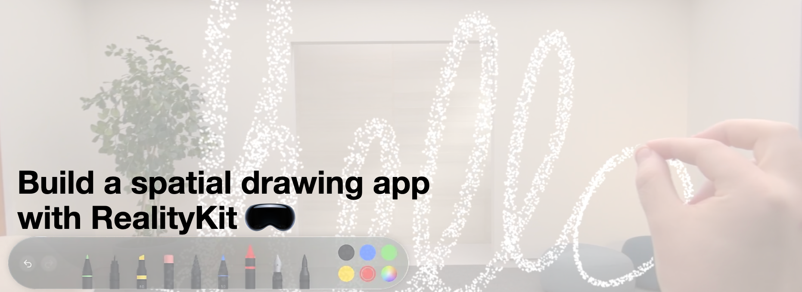

## 个人介绍

Layer，就职于抖音即时通讯团队，APP：**喵喵消烦员** 开发者。

## 审核介绍

BluesJiang，iOS 开发者，老司机技术成员，目前就职于淘宝，负责淘宝原生基础架构。热衷于 Swift/SwiftUI 等基础技术领域。

## 不超过 120 个字的文章简介

RealityKit 是 visionOS 应用空间功能的基础。我们将以空间绘画 App 为例，探索资源在 RealityKit 中的运作方式，通过构建自定义网格、纹理和着色器、使用低级别网格和纹理 API 等，实现精致的视觉设计。

## 公众号/小专栏图文头图

