# WWDC24 10118 - UIKit 新功能

> 摘要:  在 iOS 18 中，UIKit 经历了显著的改进，专注于提升用户界面的直观性和互动性。最引人注目的是全新的文档启动体验，它为应用提供了更多个性化展示的空间，同时优化了用户的首次文档创建流程。标签栏和侧边栏也经过了重新设计，不仅外观更加紧凑，还增加了新的定制功能，使得内容展示更为突出。强化了 SwiftUI 和 UIKit 之间的互操作性，特别是通过统一手势系统和允许 SwiftUI 动画类型直接应用于 UIKit 视图，极大地丰富了开发者在动画和交互设计上的选项。此外，UIKit 的 Trait 系统现在支持自动特性跟踪，简化了视图更新，提高了应用性能。为了进一步增强用户体验，iOS 18 引入了 UIUpdateLink ，它使得周期性的 UI 更新更为高效，并且通过感官反馈的改进，如对 Apple Pencil Pro 的支持，为 iPad 用户提供了更加丰富的交互反馈。文本编辑也得到了提升，新的文本格式化面板和写作工具为用户提供了更直观的编辑体验。总的来说，iOS 18 的 UIKit 更新为开发者提供了更多创新的工具和 API，以构建更加引人入胜和用户友好的应用界面。


本文基于[Session 10118](https://developer.apple.com/videos/play/wwdc2024/10118/)进行梳理，感谢@Vong @ChengzhiHuang 两位老师的 Review，感谢@SwiftOldDriver 社区提供的机会。

> 作者:
>
> 北京，丰台，Sharker，SKR ~，目前在小厂负责支付 iOS SDK 相关研发，对于 UI 展现与编译较为感兴趣，[Github](https://github.com/AkaShark)
>
>
> 审核:
>

UIKit 作为老牌的 UI 框架在很多应用场景中依然有着不可替代的作用，在 iOS 18 中 UIKit 也迎来了一些新的改变，在观看完[Session 10118](https://developer.apple.com/videos/play/wwdc2024/10118/)后对我印象最大的新特性包括了新的缩放转场效果，UIKit 与 SwiftUI 在动画与手势中的交互以及`UITextView`富文本的支持等等。

从 Apple iOS 18 的更新中不难看出来，UIKit 除了常规的更新外越来越注重其与 SwiftUI 的交互以及整个 UI 系统的统一。本文将按照[Session 10118](https://developer.apple.com/videos/play/wwdc2024/10118/)中新特性的顺序逐一的进行介绍，当然读者也可按照兴趣程度选择性阅读，每年的 What's new in UIKit 其实更像是一个"Index"文件，其中会大概介绍涉及 UIKit 的更新，然后引出一篇新的 Session ，在文章中我将尽可能的去补充引入的 Session，但是因为篇幅和时间的原因可能介绍的并不是很完善，感兴趣的读者可以选择继续阅读对应的 Session 当然更推荐选择关注老司机的公众号，最近会不定期推送 WWDC24 中 Session 的介绍。

本文主要围绕以下三个部分展开介绍

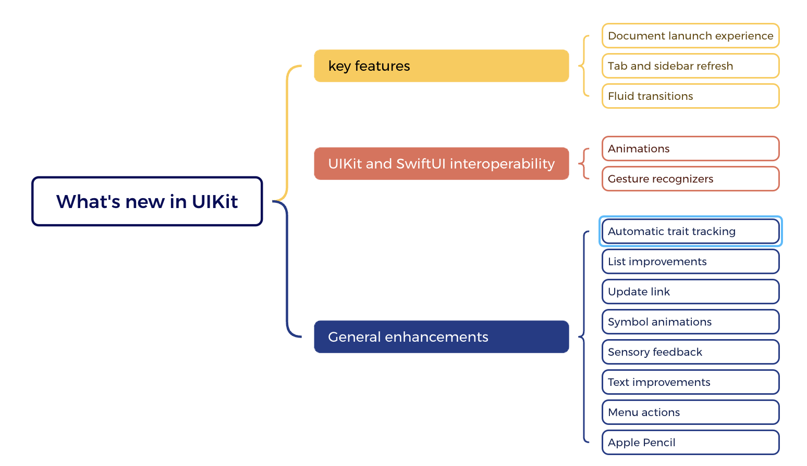


1. UIKit 核心功能更新
2. UIKit 与 SwiftUI 交互
3. 常规功能增强

[toc]

## UIKit 核心功能更新 - key features

### 重设计的文档启动体验 - Document lanunch experience

对于文档类的修改其实在 WWDC23 中的[What's new in UIKit](https://developer.apple.com/videos/play/wwdc2023/10055/)也有提及到，在 iPadOS 17 中，Apple 改进了对文档应用程序的支持，UIKit 提供了一个新的`UIDocumentViewController`作为内容视图控制器的基类，具体可以回看下[WWDC23 Build better document-based apps](https://developer.apple.com/videos/play/wwdc2023/10056)。

在 WWDC24 中 Apple 针对 UIDocumentmentViewController 的文档启动页进行了新的结构化设计。

|  样式示例   |  备注   |
| --- | --- |
|   |  页面样式的头部可以添加前景装饰与背景装饰  |
|   |  页面样式的头部可以自定义背景，设置包括背景色、渐变色、图片等  |
|   |  页面样式的头部中间部分为标题  |
|   |  页面样式标题下面的部分为主 Button，标示着文档应用想要表达的首要行为  |
|   |  页面样式主 Button 下面的部分为次 Button，标示着文档应用想要表达的次要行为  |
|   |  页面样式最下面的部分为文档浏览区域 |


想要使用新的启动页样式，则需要将`UIDocumentViewController`设置为根视图，将原本设置为根视图的`UIDocumentBrowserViewController`替换掉。


当然也可以通过 iOS 18 中更新的 API 来完成更多自定义的样式，具体的细节可以阅读以下两个 Session

[WWDC23 Build better document-based apps](https://developer.apple.com/videos/play/wwdc2023/10056)

[Evolve your document launch experience](https://developer.apple.com/videos/play/wwdc2024/10132/)

### 标签栏和侧边栏的样式更新 - Tab and sidebar refresh

标签栏和侧边栏的应用更多是在 iPadOS 上，在[WWDC23 What's new in UIKit](https://developer.apple.com/videos/play/wwdc2023/10055/)中也有对于侧边栏的更新，在 WWDC23 中为侧边栏提供了新的行为，侧边栏可以自动显隐，当页面宽度减小时，会根据需要隐藏侧边栏，如果在点击侧边栏按钮时没有足够的空间进行平铺，会以覆盖或者位移方式显示次要列与侧边栏，开发者可以使用`preferedDisplayMode`和`preferredSplitBehavior`在应用程序中覆盖此行为。


在 WWDC24 中，Apple 给侧边栏增加了自定义能力的同时对标签栏的 UI 样式也进行了优化。新的标签栏采用了更紧凑的样式，减少了垂直和水平的空白空间，并将其整体浮于应用上其位置和顶部的安全区进行了融合。

### 标签栏

标签栏在 iOS18 上展示的更加紧凑其减少了垂直和水平的空白空间，在位置上标签栏更加向上其与顶部的安全区进行了融合，在 iPad 时钟 App 上标签栏的展示如下所示


### 侧边栏

在 iOS 18 中，侧边栏的功能得到了显著增强，用户现在可以更加灵活地定制侧边栏，包括增加更多自定义功能，调整侧边栏项目的展示顺序。这意味着用户可以根据个人喜好和需求，轻松地管理和访问他们最常用的功能和应用，使整体使用体验更加个性化和高效。这一更新为用户带来了更多便利和自定义选择，让他们能够更好地利用 iOS 系统的各种功能。

### 侧边栏与标签栏结合

在 iOS 18 中加强了侧边栏与标签栏的结合使用，侧边栏应用可以采用新的`UITabBarController`API 来获取组合标签栏和侧边栏的新体验。这种组合标签栏与侧边栏在开发中是非常常见的需求，具体来说是在最小化侧边栏的时候侧边栏会以动画的形式转化为标签栏展示，同样的展开侧边栏时标签栏会以动画的形式变回侧边栏。


从功能上通过侧边栏可以访问应用的更多功能，标签栏可以对应用主要的功能进行快速切换，从体验上在侧边栏变为标签栏展示时可以让应用的主体内容(也就是应用展示的内容)更加突出。

使用新的侧边栏 API 还提供了自定义的能力，可以通过拖拽的方式来自定义侧边栏和标签栏具体功能项的位置与是否展示。

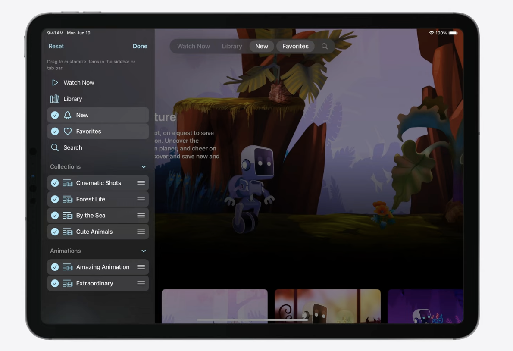

要使用上述功能需要使用新的`UITab`和`UITabGroup` API

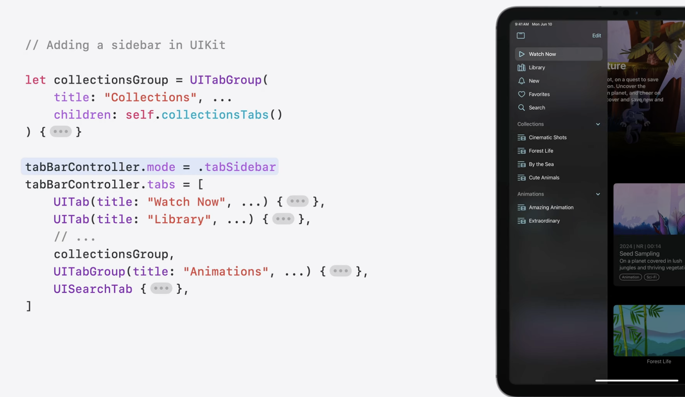

通过这些 API 可以将应用中标签栏与侧边栏进行结构化的描述，此外这些 API 还兼容了多平台，包括了 Mac Catalyst 和 VisionOS，想要了解更多内容可以阅读[Elevate your tab and sidebar experience in iPadOS](https://developer.apple.com/videos/play/wwdc2024/10147/)。

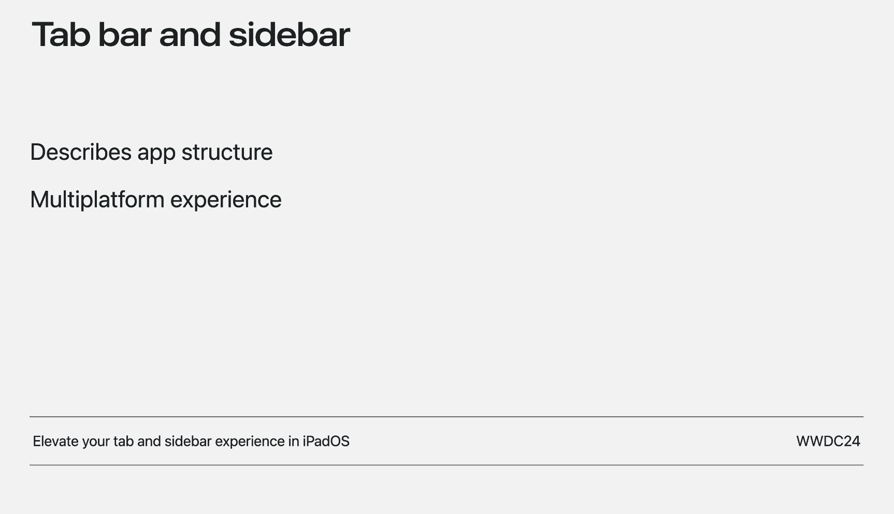

在这篇 Session 具体介绍了在 Tab bar 和 sidebar 在 UIKit 中的更新，以及 Sidebar 中一些新的 API。

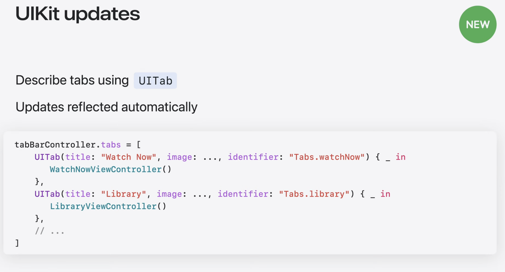


> 在这篇 Session 中以 iPad 中的时钟应用介绍了标签栏的新样式，以 iPadOS 上的 Apple TV 介绍了侧边栏与标签栏的结合，同时在这篇 Session 也给出了关于使用 Tab bar 与 sidebar 的一些实践推荐

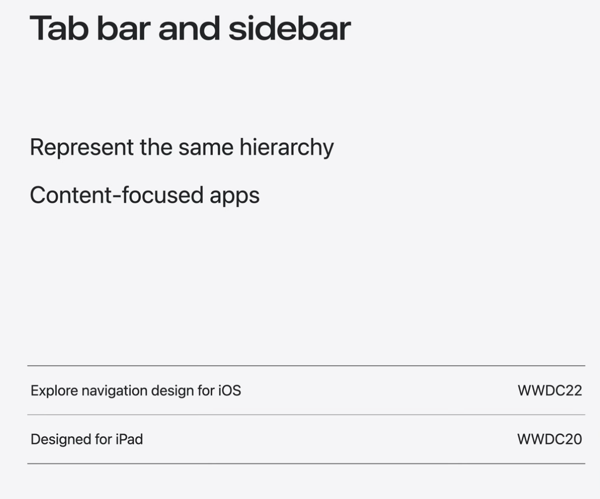

### 全新的转场效果 缩放转场 - Fluid transitions

在 iOS18 UIKit 提供了一种新的转场方式-缩放转场(Zoom Transition)，它适用于通过 push 或者 present 的方式进行转场，缩放转场不仅仅是一种视觉的优化，同时它也可以进行持续的交互，允许使用者通过拖拽的方式移动(缩放转场类似于 Apple Store 中的转场动画，这种转场在 github 上也有通过缩放动画去模拟实现的[例子](https://github.com/baozoudiudiu/AppStoreTodayAnimation))。如果在日常的开发中，从 cell 跳转到其他页面使用了缩放转场，则可以在转场的过程中保持相同的 UI 来增加应用视觉上的连贯性。


在 Apple 的文档中是这样介绍缩放转场

> iOS 18 introduces a fluent, continuously interactive zoom transition. You can use this transition when your app navigates from a large cell or thumbnail to increase the sense of continuity in your app. People can then grab, drag, and control the transitions when they begin and anytime during their animation.

可以看出 Apple 对于缩放转场的定位是为了提高程序的连续性的，在使用缩放转场的时候用户点击缩略图或者 cell 的时候，应用会将相应的 ViewController 推送到导航栈的栈顶，在这个过程中用户可以停止转场、拖动视图来完成转场或者恢复原状态，转场的状态与动画会随着用户的手势进行相应的变化。缩放缩放转场可以在 iPhone 与 iPad 上使用，也包括了在 visionOS 中运行的 iPad 应用，在其他平台 API 是可用的，但是其表现形式会根据当前平台切换为默认的转场。

#### 如何使用

要使用缩放转场首先需要在要 push 到的新 ViewController 中将`preferedTransition`属性设置为`zoom(option: sourceViewProvider:)`，其次传递一个返回要缩放的视图的闭包，最后通过`pushViewController`将新 ViewController 推入导航栈并展示出来。

```swift

// Create a detail view controller for the selected item.
let detailViewController = MyDetailViewController(itemID: itemID)


// Set the preferred transition to zoom.
detailViewController.preferredTransition = .zoom { [self] _ in
    
    // Return the thumbnail view for the selected item. 要缩放展示的View
    return thumbnail(for: itemID)
}


// Push the detail view controller onto the navigation stack. 入栈并展示动画
navigationController?.pushViewController(detailViewController, animated: true) 

```

> [!IMPORTANT]
>
> 由于缩放转场过程中需要对缩放视图不断进行放大与缩小与状态的变换，因此需要使用稳定的(不会轻易随着程序状态而改变的)标识符在闭包中查找视图，而不是捕获 UIVIew 或者 IndexPath 实例。

还有一点需要注意的是假如我们的入口页面是一个轮播图，在我们点击任意一个项进入详情页后，我们上一个页面的轮播图还在滚动，这时我们回退当前的页面，可能会导致想要缩放回的项发生变化，为了找到了正确的项，我们可以闭包中的上下文参数来做对应的处理。

``` swift

// Create a detail view controller for the selected item.
let detailViewController = MyDetailViewController(itemID: itemID)


// Set the preferred transition to zoom.
detailViewController.preferredTransition = .zoom { context in
    
    // Use the context to determine the current item. 找到对应的item位置
    guard let controller = context.zoomedViewController as? MyDetailViewController else {
        fatalError("Unable to access the current view controller.")
    }
    
    // Return the thumbnail for the current item.
    return self.thumbnail(for: controller.itemID)
}


// Push the detail view controller onto the navigation stack.
navigationController?.pushViewController(detailViewController, animated: true)

```

#### 状态流转

作为开发者可能还有一点需要关心，由于缩放视图是跟随着用户的手势进行变化的，从点击到视图出现在栈顶期间 ViewController 可能会经历大量的状态变更，对于这些状态的变更具体的流转流程是什么呢(或者说生命周期函数是如何执行的呢)?


在 ViewController push 或者 pop 的过程中会经历以下几个状态变更，以下例子是 ViewController push 进入导航堆栈，ViewController 由开始的消失状态变为出现状态。


ViewController 会经历以下几个步骤

1. 调用`viewWillAppear`
2. 将 ViewController 对应的 View 添加到视图层级结构中
3. 调用`viewIsAppearing`
4. 通过转场动画过渡到 Appear 状态
5. 调用`viewDidAppear`
6. 视图出现结束

其中`viewIsAppearing`这是在[WWDC23 What's new in UIKit](https://developer.apple.com/videos/play/wwdc2023/10055/)中介绍的其是 ViewController 生命周期中的新 API，`viewIsAppearing`是在`viewWillAppear`与`viewDidAppear`之间新增的一个生命周期回调，`viewIsAppearing`是每次视图出现执行操作的最佳位置，也就是操作依赖于视图的初始集合属性(包括大小、位置等)的最佳回调时机，因为在此时 ViewController 已经完成了初始化，View 也已经添加到了视图层级结构体中并由父视图进行了布局。

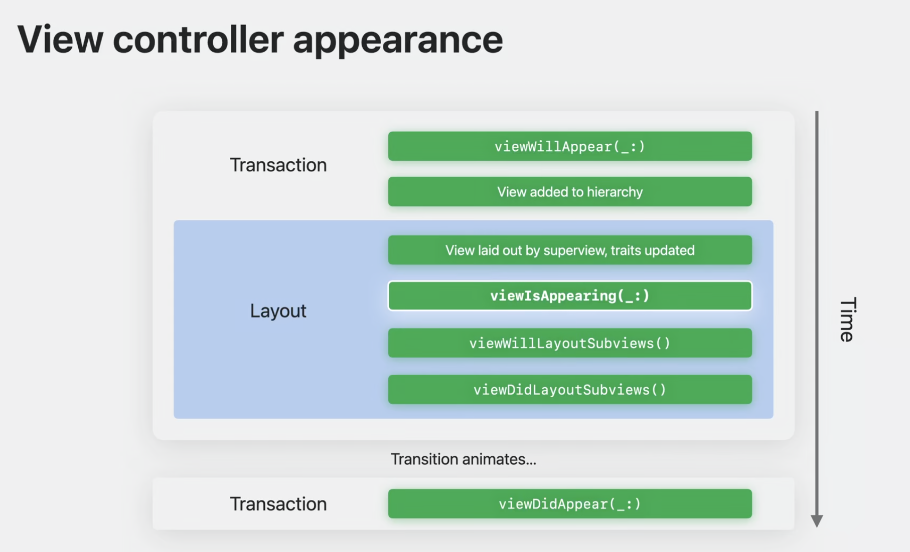

> 这里再补充下 ViewController 的视图出现的生命周期调用

当 ViewController 从导航堆栈中 pop 的时候，他会以出现状态开始，然后执行以下步骤

1. 调用`viewWillDisappear`
2. 通过转场动画过渡到 Disappear 状态
3. 从视图层级结构中删除视图
4. 调用`viewDidDisappear`
5. 视图消失结束

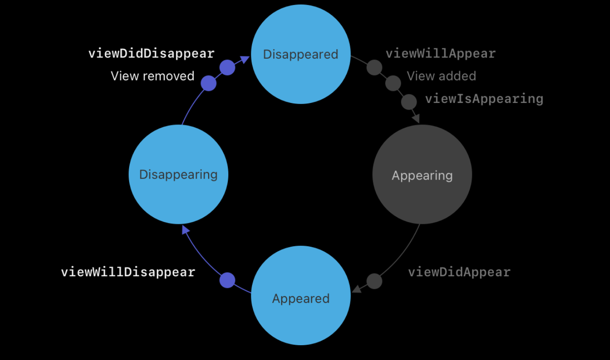

由于在缩放转场中用户可以关闭跳转流程，如果用户主动打断缩放流程，以上事件的顺序将会发生变化。

当用户触发了 pop，紧接着又取消 pop 操作，系统会调用`viewWillDisappear`切换到 Disappearing 状态然后直接切换到 Appearing 状态并调用`viewDidAppear`，然后以 Appeared 状态结束，状态的转化发生在一个 RunLoop 循环中，因此不会被打断。

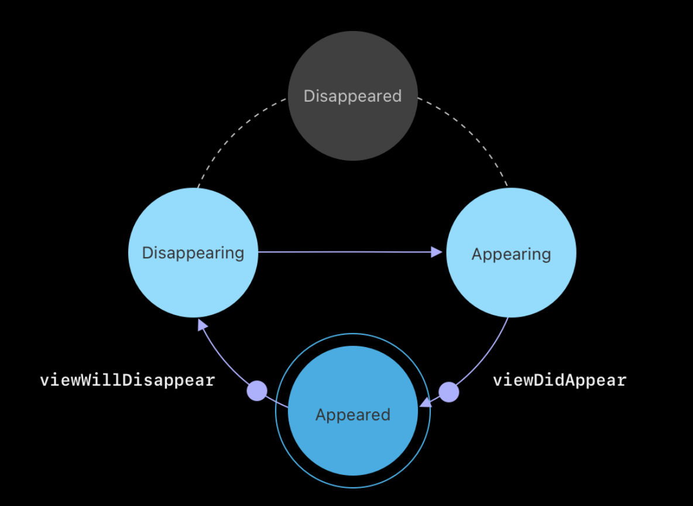


当用户触发 push，紧接着又取消 push 操作，系统不会取消这次 push 操作，取而代之的系统会在一个 RunLoop 循环内完成到 Appeared 状态，然后执行 pop 操作，之后的流程和上述中断 pop 操作一致。


> [!IMPORTANT]
> 系统以不同的方式处理 push 和 pop 转换。在处理 push 的时候，其不会取消 push，而是将其转换为 pop。这确保 ViewControlle 达到出现状态，并完整调用了出现和消失回调的完整生命周期。

对于文字描述不太理解的同学可以看下[Enhance your UI animations and transitions](https://developer.apple.com/videos/play/wwdc2024/10145/)这个 Session 中 6:17 秒开始的动画来加深理解。


## UIKit 与 SwiftUI 交互 - UIKit and SwiftUI interoperability

iOS18 增强了 SwiftUI 与 UIKit 的交互，使得两者可以在开发中很容易的进行交互，这里将主要介绍两方面的更新，动画和手势。

### 动画 - Animations

在 iOS18 中可以使用 SwiftUI 的动画类型来设置 UIKit 视图的动画效果，其中动画类型不但包括了全部的 SwiftUI 系统动画类型，也包括了 SwiftUI 自定义的动画。

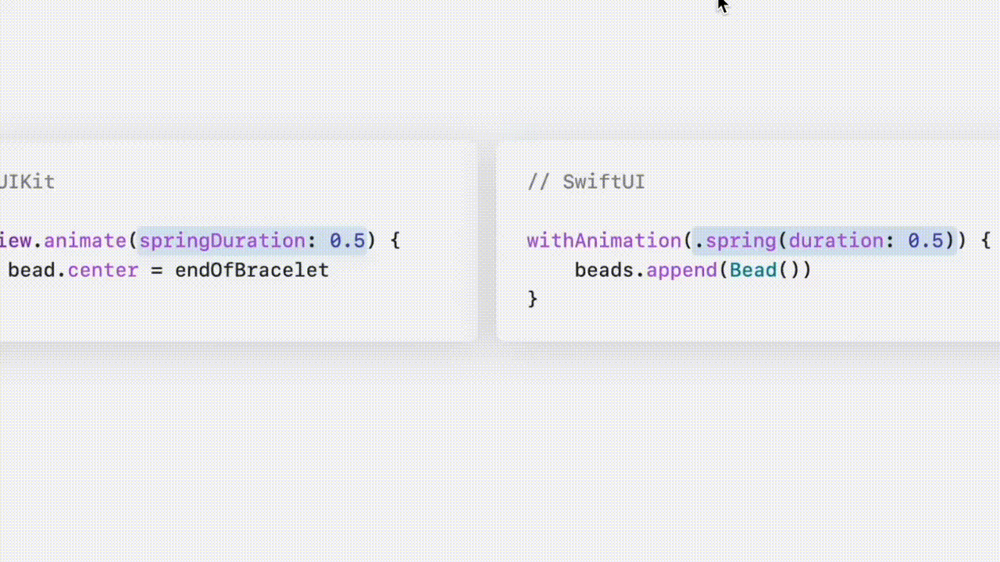

利用 SwiftUI 的 Spring 动画，可以在 UIKit 中轻松创建流畅的手势驱动动画，只需在手势变化和结束时设置动画即可。

```swift
switch gesture.state {
    case .changed: 
        UIView.animate(.interactiveSpring) {
            bead.center = gesture.tanslation
        }
    case .ended: 
        UIView.animate(.spring) {
            bead.center = endOfBracelet
        }
}
```

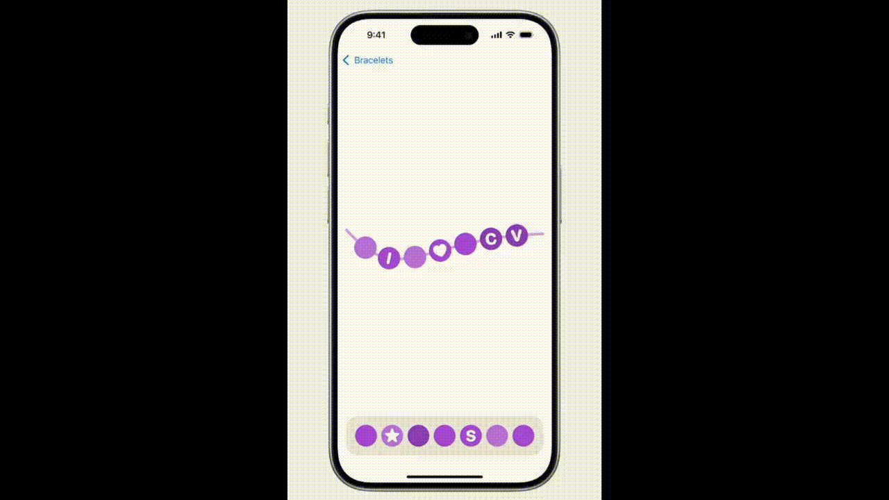

想要了解更多可以阅读[Enhance your UI animations and transitions](https://developer.apple.com/videos/play/wwdc2024/10145/)

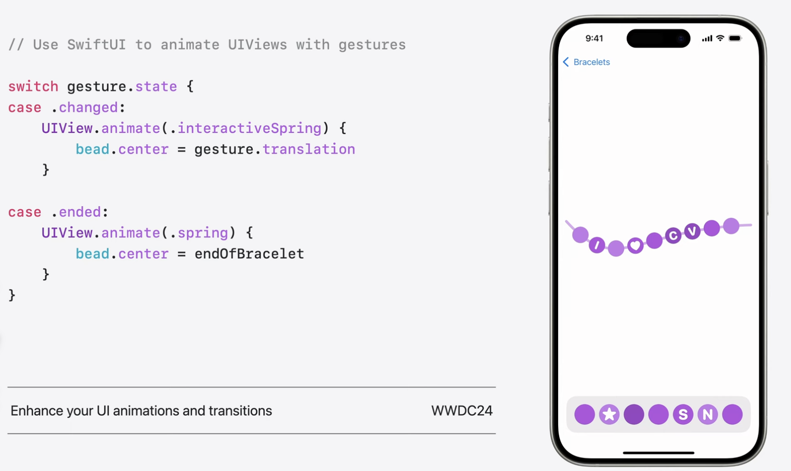

在这篇 Session 除了介绍 UIKit 与 SwiftUI 动画交互外还介绍了我们前面讲到的缩放转场，对于 UIKit 与 SwiftUI 动画交互提供了很多实例，对于缩放转场介绍了整个 ViewControlle 的生命周期流转，同时这篇 Session 也推荐了一些 UIKit 动画和转场动画相关的 Session 继续阅读。

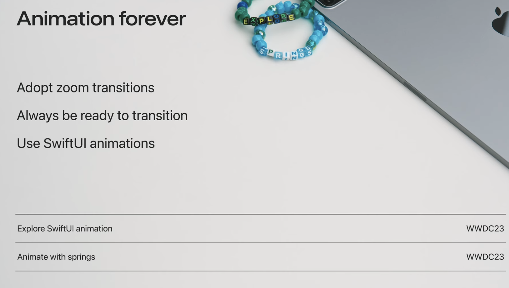


### 手势 - Gesture recognizers

动画通常与手势结合使用，在 WWDC24 中也将 UIKit 与 SwiftUI 中的手势进行了统一，现在它们将遵循统一的规则，在 iOS18 中，可以跨越两个框架(SwiftUI 与 UIKit)定义手势之间的依赖关系，可以通过`name`在 UIKit 中引用 SwiftUI 中的手势。

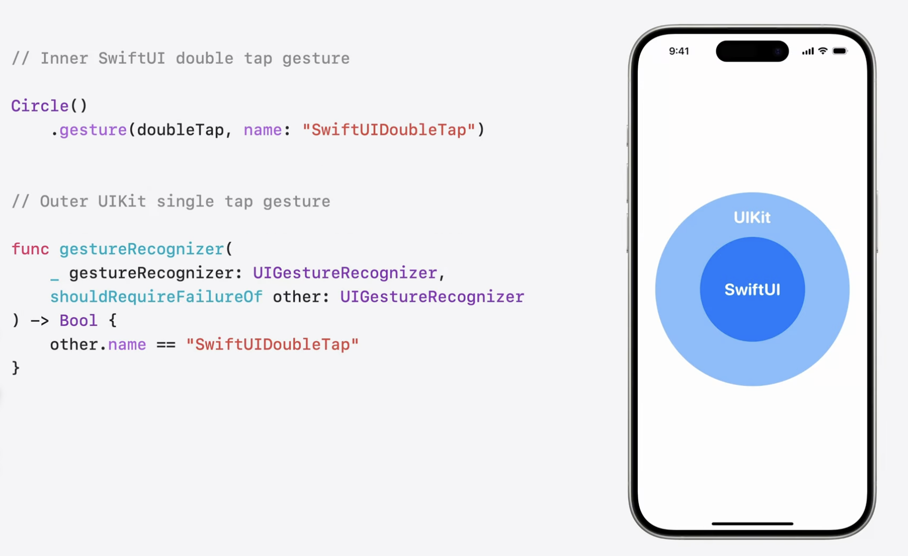

这是一个 SwiftUI 嵌套在 UIKit 的视图的列子，在 UIKit 视图中绑定了单击事件，在 SwiftUI 中绑定了双击事件，现在想让 UIKit 中的手势与 SwiftUI 中的手势共存，但是不添加任何特殊处理的话会发现，当点击 SwiftUI 的视图时 UIKit 的视图也响应了手势。为了避免这种情况的发生，采用如上代码设置，首先在 SwiftUI 中设置手势时指定一个 name 属性为`SwiftUIDoubleTap`，然后再 UIKit 的手势识别代理方法`gestureRecognizer(_ gestureRecognizer: shouldRequireFailureOf other:)`中判断手势是否为 SwiftUI 中的手势，从而达到两种手势共存的效果。

在 iOS18 中可以使用新的`UIGestureRecognizerRepresentable`协议将现用的 UIKit 手势迁移到 SwiftUI 中，关于更多的内容可以阅读[What's new in SwiftUI](https://developer.apple.com/videos/play/wwdc2024/10144/)，这里鉴于篇幅与其他作者对[这篇 Session](https://github.com/SwiftOldDriver/WWDC24/blob/main/session_10144/README.md) 有讲解，就不过多展开了。

## 常规功能增强

### 自动特征跟踪 - Automatic trait tracking

`Trait System`在 WWDC23 中也有过介绍在 iOS17 中的特征系统(Trait Systerm)得到了升级，特征系统会自动通过应用的视图层级来传递数据，在 iOS 17 中特征系统允许开发者编写自定义的特征，并提供了更灵活的 API，同时在特征更改时接受回调而无需在子类重写`traitCollectionDidChange`方法，开发者可以通过将自定义的 UIKit 特征与自定义的 SwiftUI 环境进行桥接，以便在应用程序中无缝传递数据，完成 UIKit 与 SwiftUI 之间的交互操作。

> 这里简单介绍下 Trait System，Trait System 中一个核心组件是 Trait Collection。Trait Collection 是一个描述 iOS 设备特性（如大小、分辨率等）的对象。它提供了一种方式，让应用程序在运行时适应不同的设备和场景，以提供最佳的用户体验。Trait Collection 可以用于自定义视图的布局和样式，响应用户界面的变化。举个简单的例子，当用户在 iPhone/iPad 上旋转设备时，设备的尺寸类别会从 Regular 变为 Compact。这意味着应用程序需要重新调整其用户界面以适配较小的屏幕空间。Trait Collection 可以帮助应用程序检测到这种变化，并根据需要更新其布局。例如，可以使用 Trait Collection 来动态调整文本大小、字体样式、按钮大小和位置等元素。通过 Trait Collection 无论用户在什么设备上使用应用程序，都可以获得最佳的用户体验。

在 iOS 18 之前我们想要使用`Trait System`需要使用相关的监听函数，在 iOS 18 之后使用和处理特征系统变得更加容易，现在 UIKit 支持常见视图和视图控制器的更新方法例如`layoutSubviews`和`drawRect`方法内的自动特征跟踪。在 UIKit 调用这些方法的时候，系统会记录在方法中访问的特征，当这些访问特征值改变时，UIKit 会自动执行方法关联的方法例如`setNeedsLayout`或者`setNeedsDisplay`，从而实现 UI 刷新。

> 简单的理解就是在`layoutSubviews`等支持的访问中记录我们使用的特征，在该特征变化时不需要我们手动调用刷新而是系统会自动调用对应的刷新视图方法。

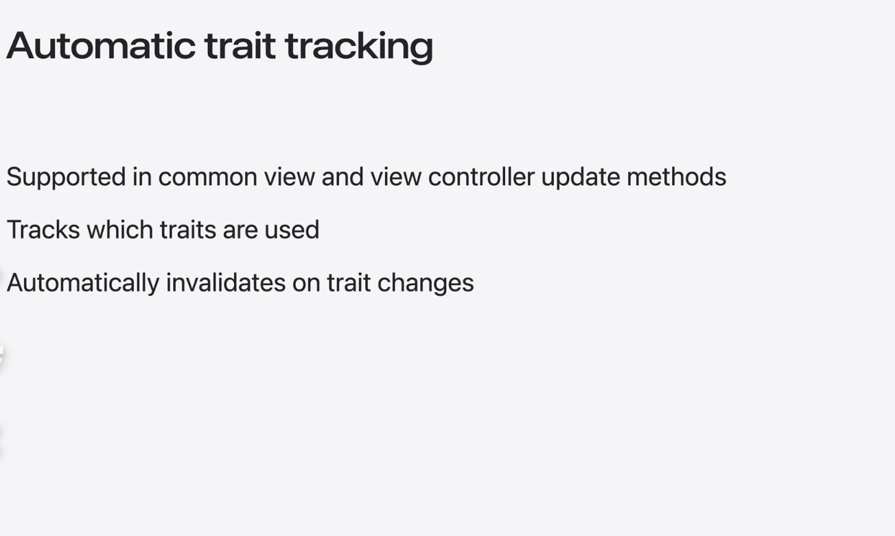

在 iOS18 之前，我们想要监听`UITraitHorizontalSizeClass`，我们需要在`init`方法中使用`registerForTraitChanges`方法注册特征的变化并指定`setNeedsLayout`方法来更新 UI，同时重写`layoutSubviews`在其中读取特征值来展示不同的 UI。

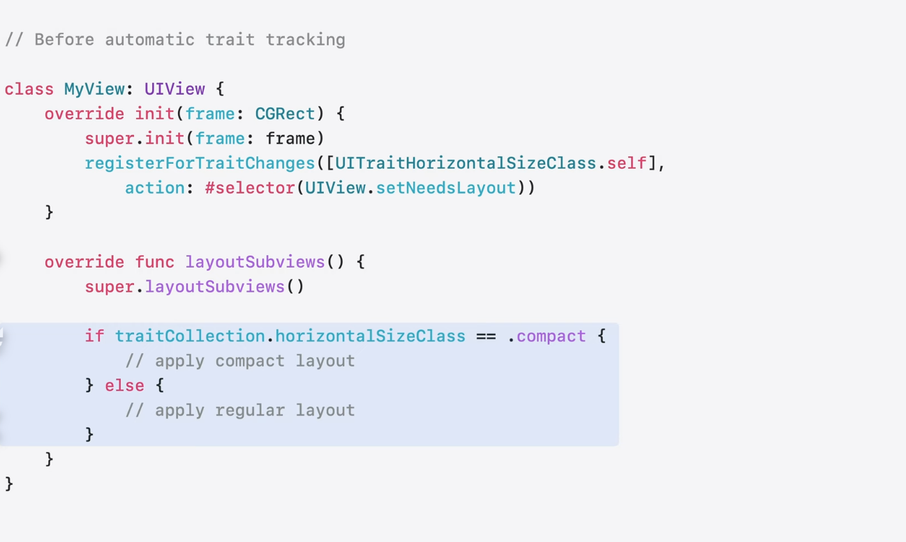

在 iOS 18，UIKit 中这个行为得到了简化，借助自动特征跟踪可以将注册监听的部分完全删除。这正是因为上面介绍的，当调用`layoutSubviews`时，会记录`horizontalSizeClass`特征的使用情况，当特征发生变化时，会自动调用`setNeedsLayout`来更新新的特征值。

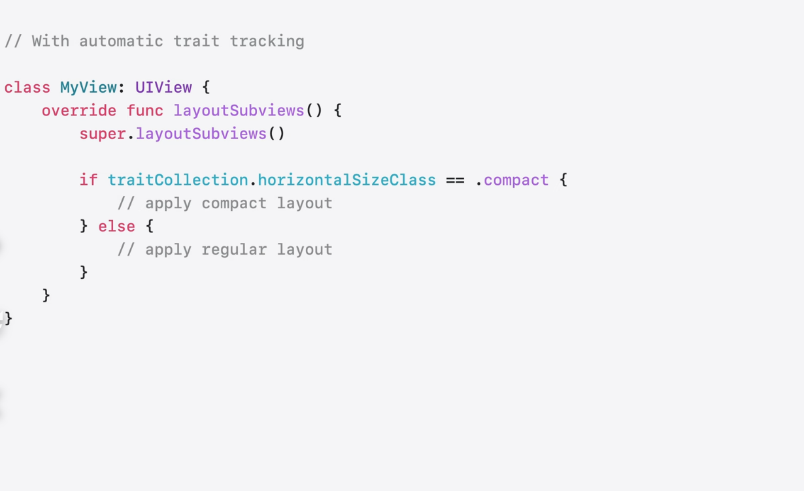

自动特征跟踪仅通过创建所需的特征依赖关系来提供最大的性能优化，新的自动特征跟踪在支持的方法中会始终保持监听的状态。常见的支持方法包括了
View 中的

- layoutSubviews
- updateConstraints
- drawRect:

ViewController 中的

- viewWillLayoutSubviews
- viewDidLayoutSubviews
- updateViewConstraints
- updateContentUnavailableConfigurationUsingState:

更多支持的方法以及细节可以阅读[Automatic trait tracking](https://developer.apple.com/documentation/uikit/app_and_environment/automatic_trait_tracking)获取更多的信息。

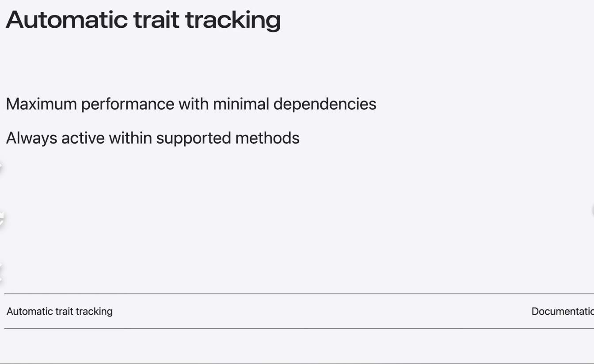


这里也推荐感兴趣的同学也可以阅读[Unleash the UlKit trait system](https://developer.apple.com/videos/play/wwdc2023/10057/)来更多的了解`Trait System`。


### 列表视图改进 - List improvements

在 iOS18 中`UITableView`和`UICollection`的 API 得到了更新使得更新 Cell 的操作变得更加简单，在`UITableView`和`UICollection`中都具备了列表特征集(List environment trait)。列表特征描述了视图所在列表的样式信息，使用特征可以保证 Cell 在任意给定的列表中样式都是正确的。

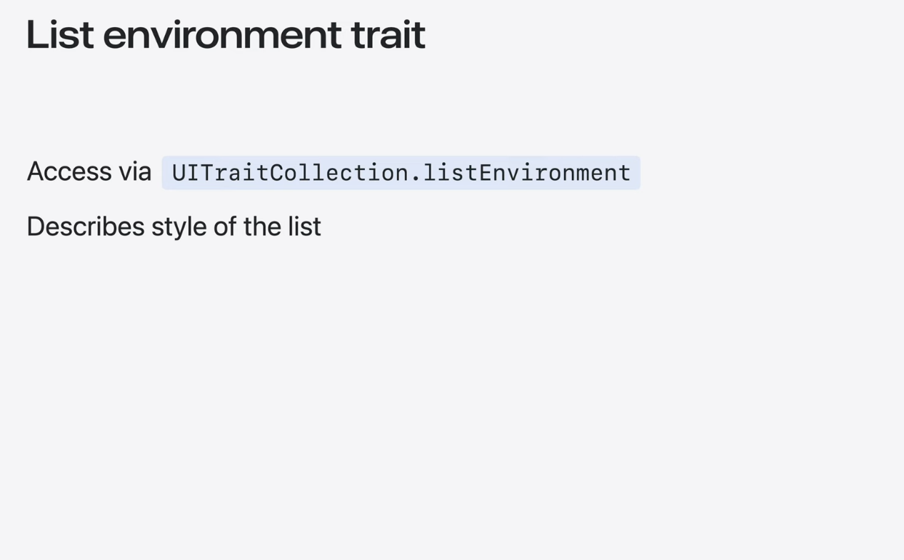

`UIListContentConfiguration`和`UIBackgroundConfiguration`现在都使用了特征，当更新状态时它们会调整其属性以匹配列表特征集中的特征。通过`UIListContentConfiguration`和`UIBackgroundConfiguration`设置的 Cell 并不需要关心其在列表中的样式信息，只需要关注其所展示的内容信息。

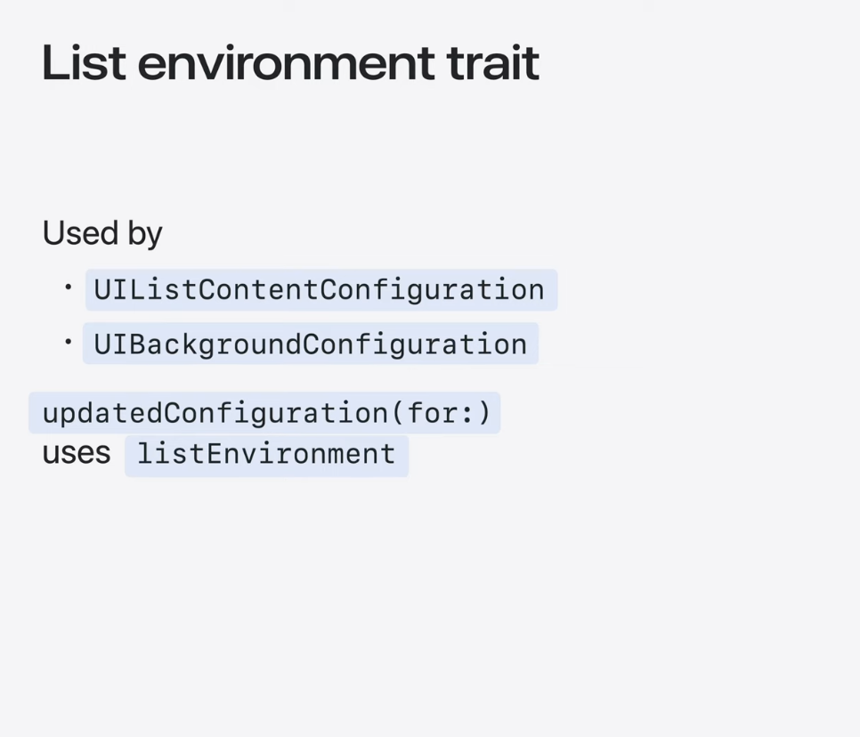

> 这里补充一些关于`UIListContentConfiguration`和`UIBackgroundConfiguration`的内容，这两个类是在 iOS14 提供的，一个负责样式的配置，一个负责内容的配置。相较于之前直接对于 Cell 的操作使用 Configuration 的方式更加符合单一设计的原则。

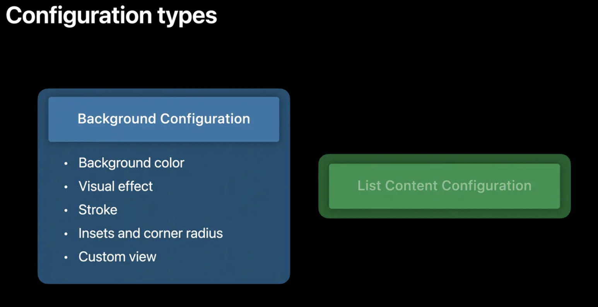

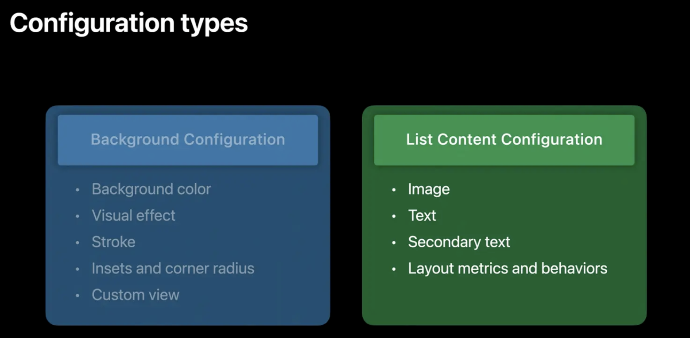


这里以文件 App 的浏览选项为例，在竖屏状态下浏览列表使用了`insetGrouped`样式，在横屏状态下浏览列表显示在侧边栏中，在配置`UICollectionView`的布局时使用了侧边栏样式。

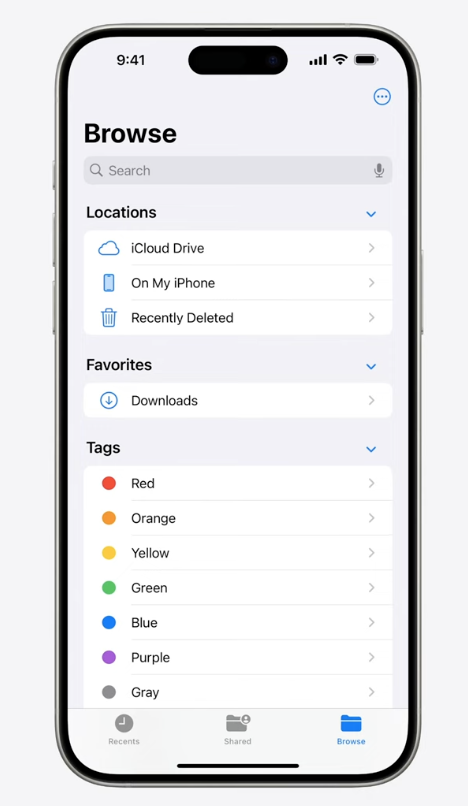

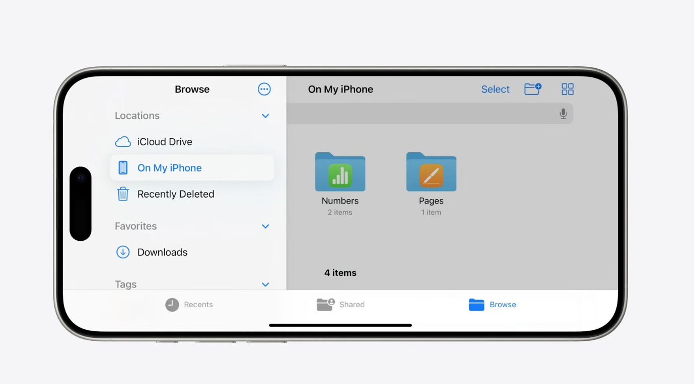


下面的代码是文件 App 浏览列表在 iOS 17`configuration`方法的实现，首先方法中对于当前是否是侧边栏进行了判断并将结果存储在了`isSidebar`变量当中，然后根据`isSidebar`的值配置`contentConfiguration`与`backgroundConfiguration`，但由于是手动设置的两个配置，所以在设备横竖切换时需要手动重新赋值。

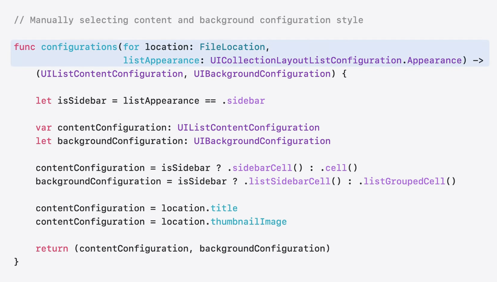

在 iOS18 中这个操作得到了简化，在同样的方法中使用`cell`和`listCell`构造函数进行初始化，当配置应用于 cell 时会针对于 cell 的配置状态进行更新，得益于新的列表特征集，cell 的配置会根据特征进行适配。

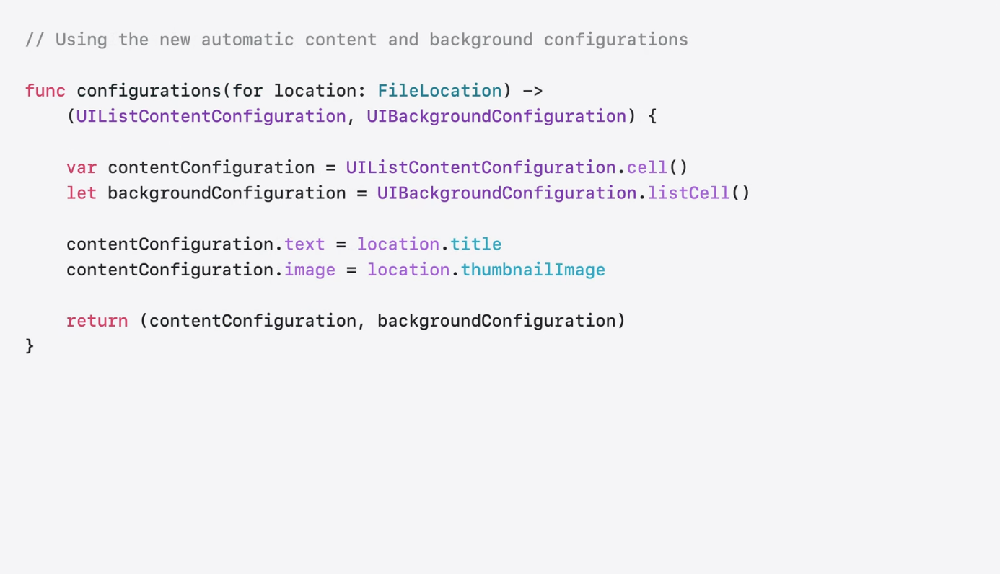

对于`UIListContentConfiguration`，在 iOS18 中会自动根据列表特征来更新样式。

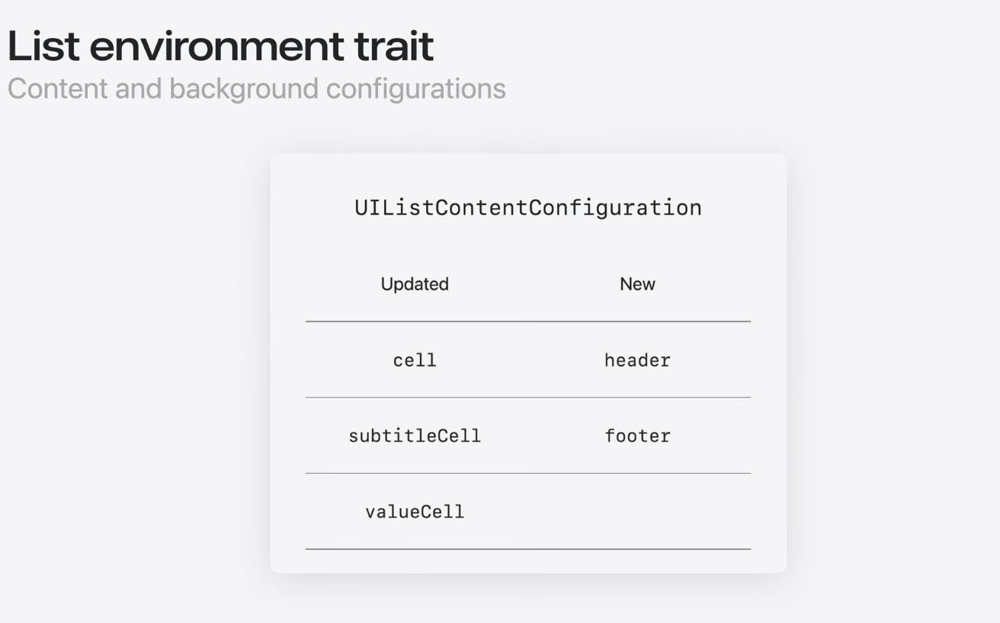

对于`UIBackgroundConfiguration`有三个新的构造函数，其也会根据列表特征来更新样式，使用这些特性来更新列表的 cell 将会大大减少工作量。

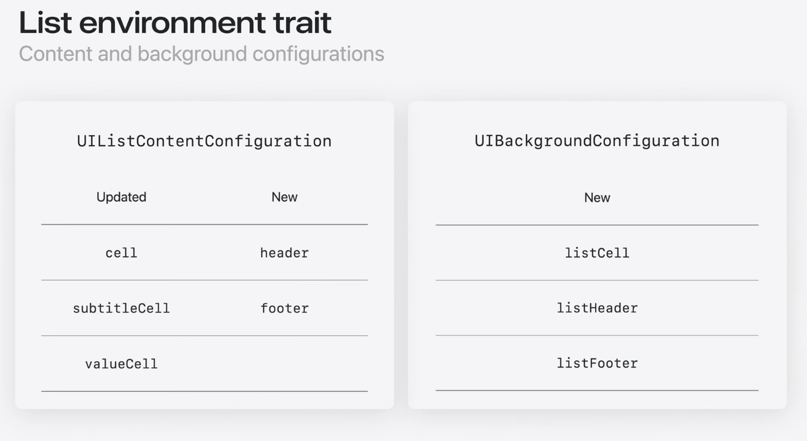

### 定期 UI 更新刷新 - Update link

`UIUpdateLink`是 iOS18 中新增的功能，使用它可以轻松的实现需要定期更新的复杂 UI 动画，其与`CADisplayLink`有些类似，但具有更多的功能例如

- 自动视图跟踪
- 使用低延迟模式
- 具有更好的性能与电池效率

这是一个使用`UIUpdateLink`的例子，可以看到当创建一个`UIUpdateLink`时，指定了一个 UIView 的实例，并指定了其更新的方法。当这个 View 添加到可见窗口时`UIUpdateLink`自动激活，当 View 从可见窗口移除`UIUpdateLink`将会停用。

在本例中还可以看到设置了`requiresContinousUpdates`来设置其是否循环执行以及使用`UIUpdateInfo`中的`modelTime`，对于这些细节以及`UIUpdateLink`的高级用法可以阅读[UIUpdateLink](https://developer.apple.com/documentation/uikit/uiupdatelink)

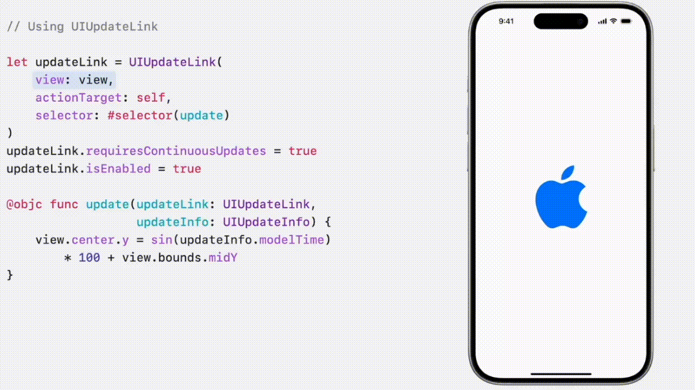

> [!IMPORTANT]
> 由于`UIUpdateLink`涉及到了 UI 的渲染，所以在使用时需要确保在主线程中进行操作

### SF Symbol 动画 - Symbol animations

`SF Symbol`确保了在 Apple 平台上 UI 元素的一致性，在 iOS 17 中也有关于`SF Symbol`动画的介绍，在 iOS 17 中 UIKit 通过新的 API 使得`SF Symbol`支持了动画效果，开发者通过使用`UIImageView`的`addSymbolEffect()`方法来实现动画。

在 iOS 18 中添加了三种新的动画效果预设包括了

- `wiggle`效果
- `breathe`效果
- `rotate`效果

`wiggle`效果可以使得符号以任意方向或者角度振动以引起注意

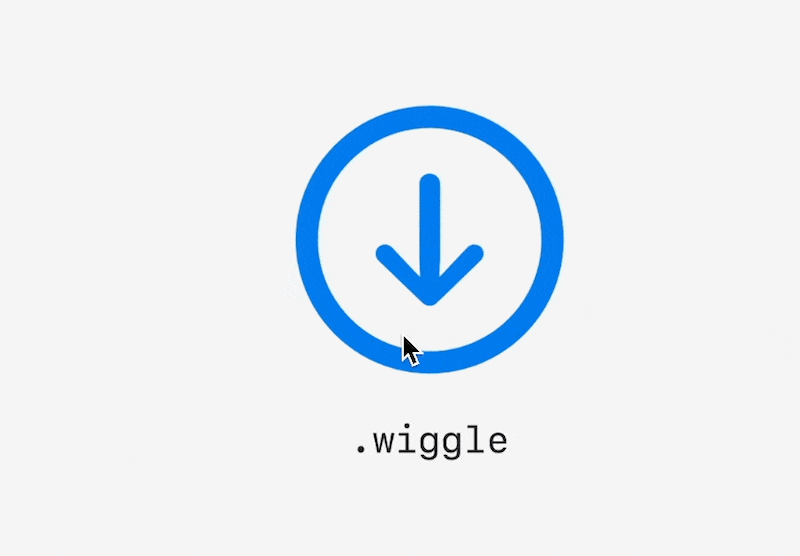

`breathe`效果可以平滑的上下缩放符号以表示正在执行的活动

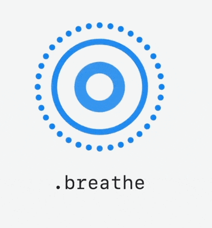

`rotate`效果围绕指定的锚点旋转符号中的一部分

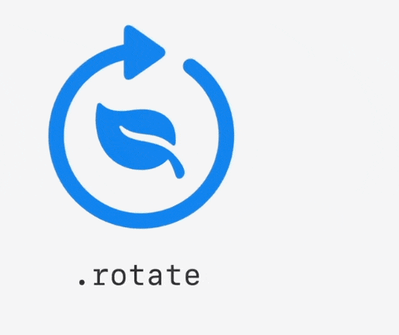

在 iOS18 中也添加了 repeat 方法的新类型`periodic`来允许指定重复次数和重复之间的间隔，以及`continuous`类型可以一直重复动画直到动画结束。

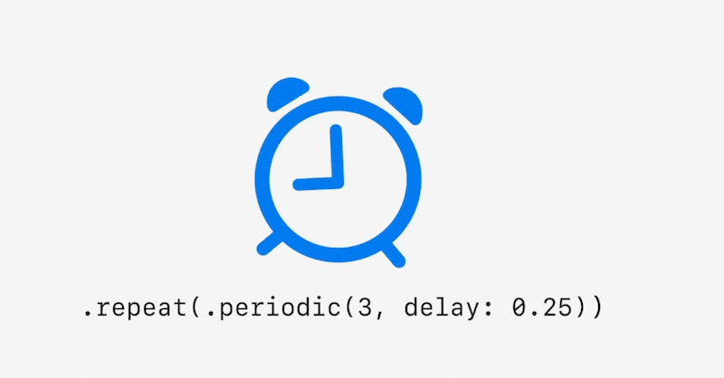

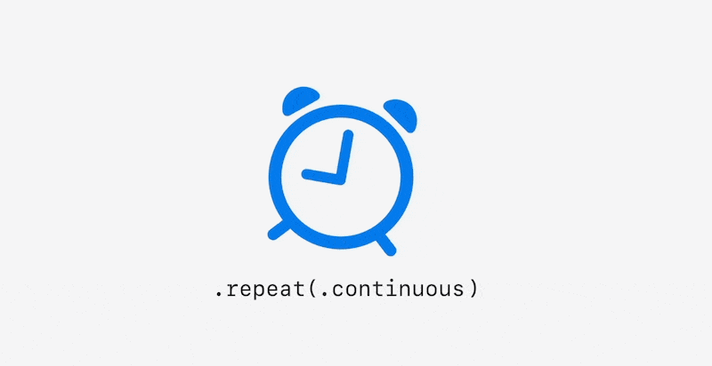

此外在 iOS18 中对于一些现有的预设也进行了增强，现在默认的`.replace`效果使用`Magic replace`，它可以平滑的设置动画，同时它支持自动退回回原本的样式。

现有的预设效果包括了

- AppearEffect iOS 17+
- BounceEffect iOS 17+
- DisappearEffect iOS 17+
- PulseEffect iOS 17+
- ScaleEffect iOS 17+
- VariableColorEffect iOS 17+
- BreatheEffect iOS 18+
- RotateEffect iOS 18+
- WiggleEffect iOS 18+

关于这些效果的细节以及`SF Symbols`细节可以查看[Symbols](https://developer.apple.com/documentation/symbols?language=objc)。

同样的也推荐阅读以下 Session

[What’s new in SF Symbols 6](https://developer.apple.com/videos/play/wwdc2024/10188/)

[Animate symbols in your app](https://developer.apple.com/videos/play/wwdc2023/10258/)

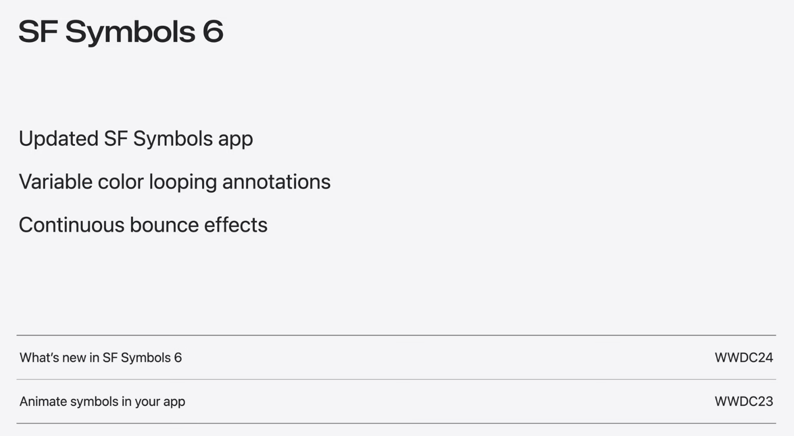

### 感官反馈 - Sensory feedback

在 iPadOS 17.5 中，感官反馈已经通过 Apple Pencil Pro 和 妙控键盘拓展到了 iPad 上。

对于这种新的反馈方式，UIFeedbackGenerator 现在提供了支持并且可以作为交互添加到 View 中，提供反馈时现在应该传递该 View 反馈触发操作的位置，同时提供了新的`UICanvasFeedbackGenerator`其非常适合绘画或者画板视图的 iPad 应用。

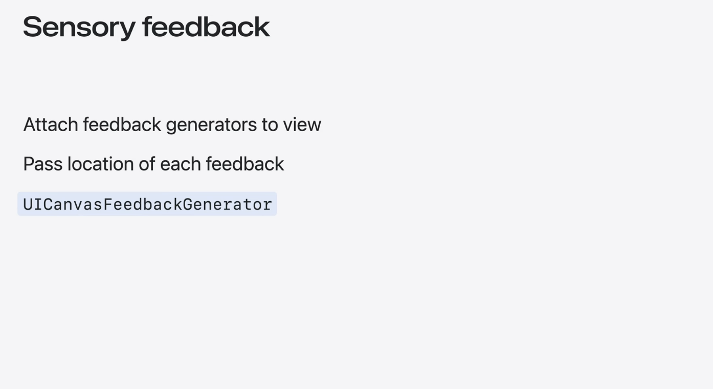

对于`UICanvasFeedbackGenerator`提供了一下的例子

当形状被拖动并与参考线对齐时产生反馈，在创建反馈器后将其与 View 进行关联，当反馈触发时传递触发的位置

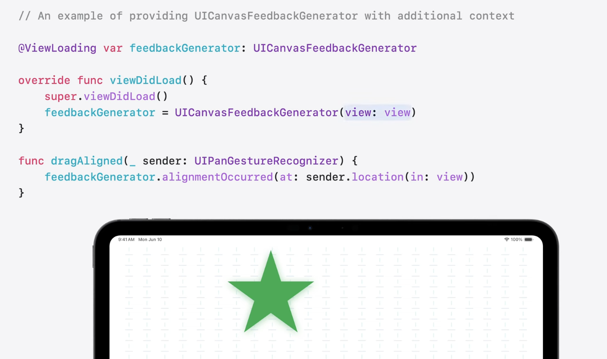

当使用 Apple Pencil Pro 拖动形状与对齐线对齐时，Apple Pencil Pro 会提供触觉反馈。

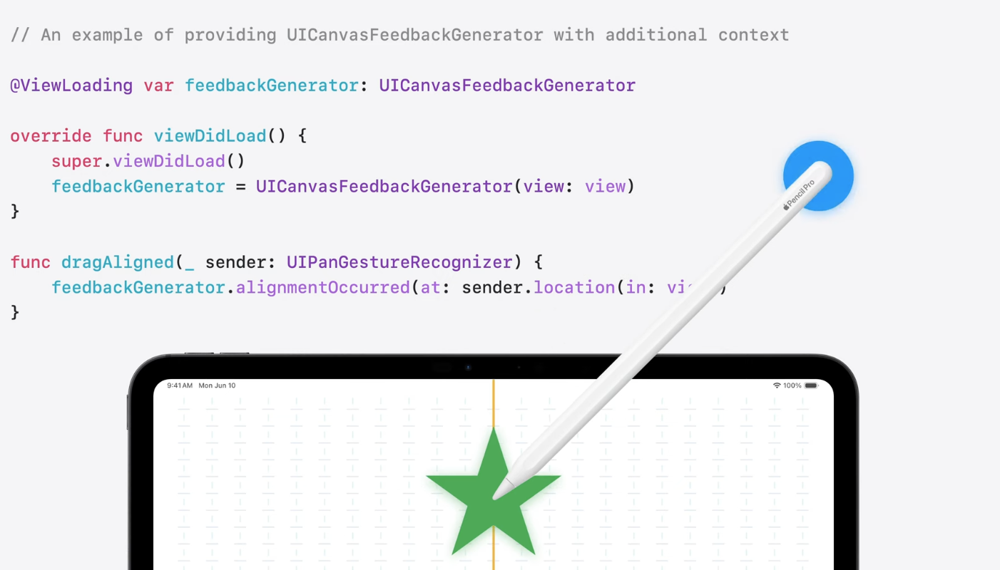

### 文本格式化拓展 - Text improvements

在 iOS17 中也有一章节介绍了文本的提升，在 iOS 17 中，更多的是提升`UITextView`文本的交互。iOS17 Apple 对文本光标和文本选择的用户界面进行了一些重大改进，包括全新设计的选择放大镜等。应用中具有自定义文本视图（例如文字处理器）的开发者可以使用系统提供的 UI 视图，而无需采用完整的 UITextInteraction。

在 iOS18 中，扩展了文本的格式化功能，利用新的文本格式化面板为提供文本格式化的应用提供了一致的，可定义的体验。

通过设置`allowsEditingTextAttributes`为 true，在使用`UITextView`编辑文本时，会有一个新的编辑菜单选项，点击该菜单可以打开格式化面板，并附带一组默认的选项。通过格式化面板可以设置文本格式、字体与字体大小，以及添加列表等。

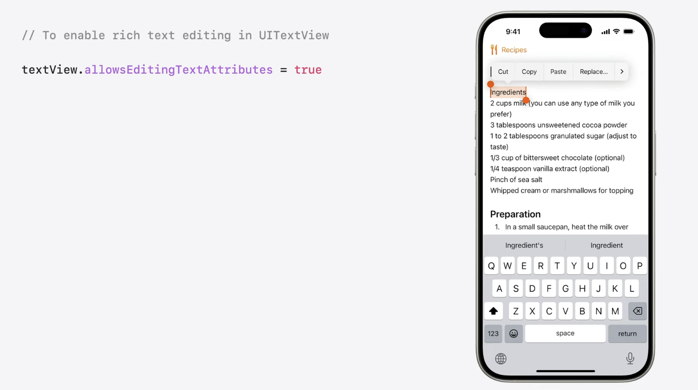

格式化面板还支持文本的高亮显示，其通过使用两个新属性来完成设置

- `textHighlightStyle`用于设置高亮显示的文本范围
- `textHighlightColorScheme`用于设置渲染高亮部分的颜色

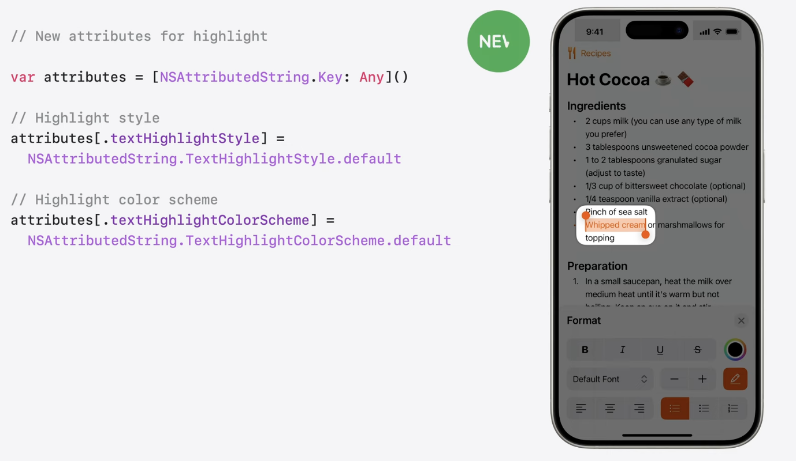

使用`UITextView`的`textFormattingConfiguration`属性设置`UITextFormattingViewController.Congiguration`来自定义格式化面板的可用控件与布局。

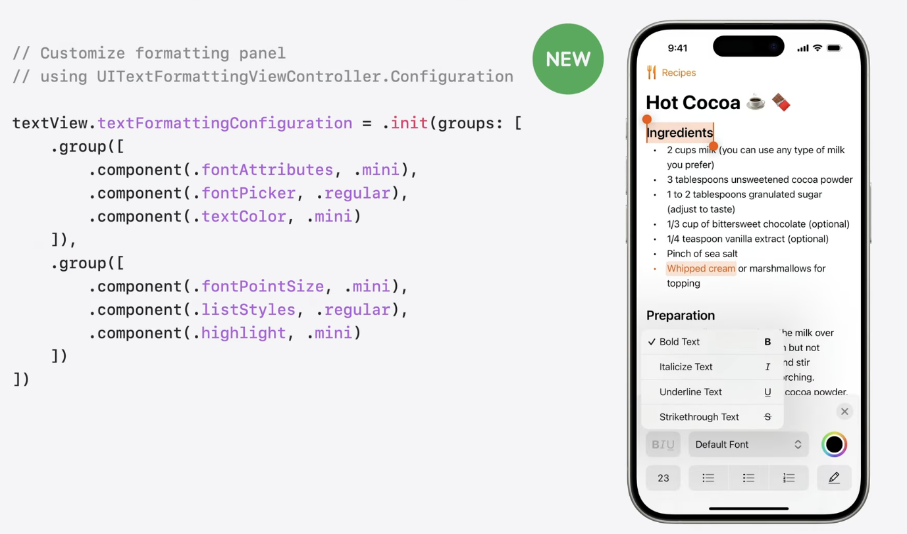

书写工具提供了高级文本编辑体验，`UITextView`默认使用了新的书写工具 UI，同时`UITextView`提供了额外新的 API 用于跟踪、修改书写工具的体验。

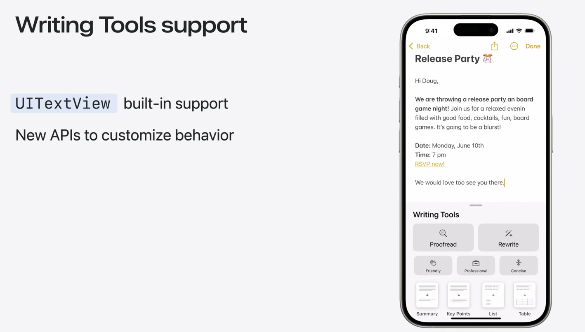

### 菜单操作 - Menu actions

菜单栏提供了 MacOS、iPadOS 以及 VisionOS 中键盘快捷菜单中应用的所有命令。在 iOS 18 中对菜单栏在 iPhone 中的表现做了支持。

这主要是为了适配`iPhone Mirroring`，在 iOS 应用中去添加`UICommand`、`UIKeyCommand`、`UIAction`来适配系统的调用。

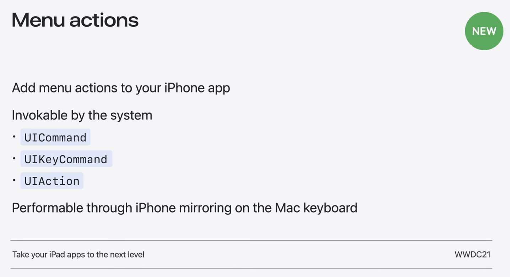

更多细节可以阅读[Take your iPad apps to the next level](https://developer.apple.com/videos/play/wwdc2021/10057/)

### Apple 触控笔 Apple Pencil

在 iPadOS 17.5 中，UIKit 支持所有 Apple Pencil Pro 的新特性。

- 挤压手势是快速切换工具或在需要时显示选择器的一种方式

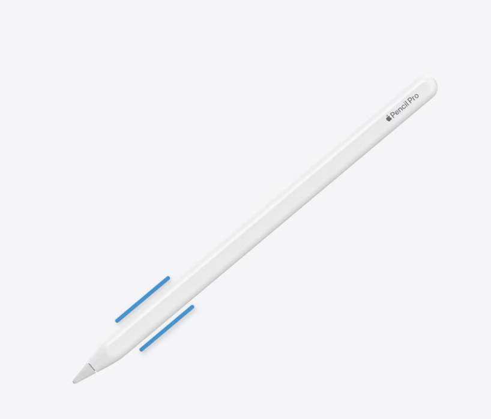

- 更新的反馈生成器与 Apple Pencil Pro 配合得很好，提升了绘图和书写的体验。

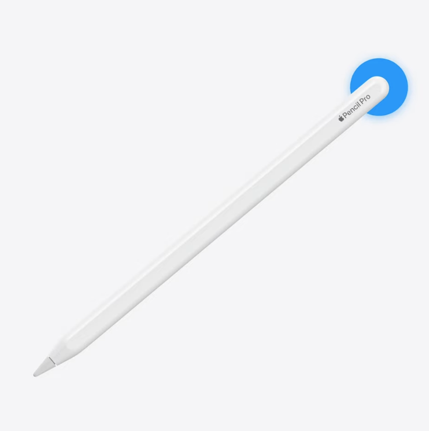

- UITouch 和 UIHoverGestureRecognizer 提供滚轮角度，帮助你的应用的绘图工具更具表现力。

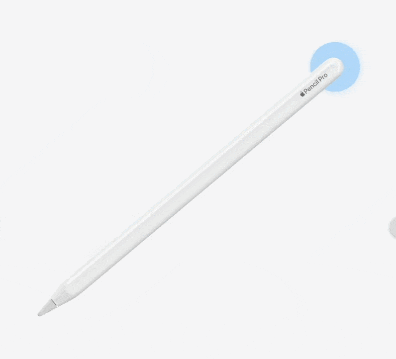

- 对于所有支持撤销的应用，挤压 Apple Pencil Pro 会显示撤销滑块，这是浏览撤销历史记录的最快方式。

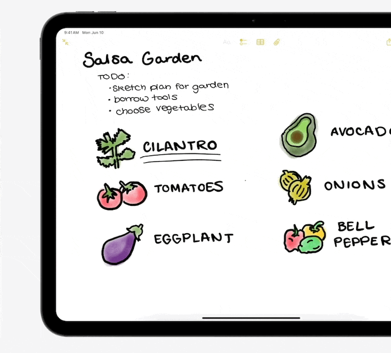

如果需要继续了解 Pencil 相关的更新与 API 可以阅读
[Squeeze the most out of Apple Pencil](https://developer.apple.com/videos/play/wwdc2024/10214/)

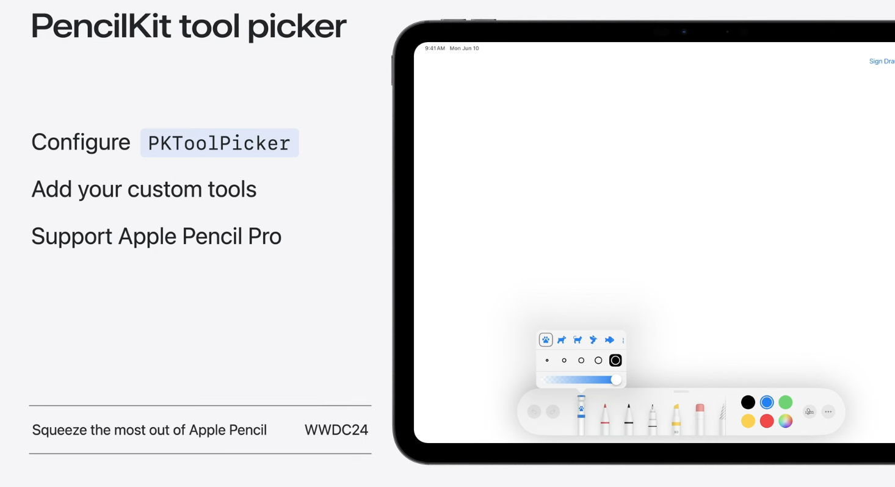

## 总结

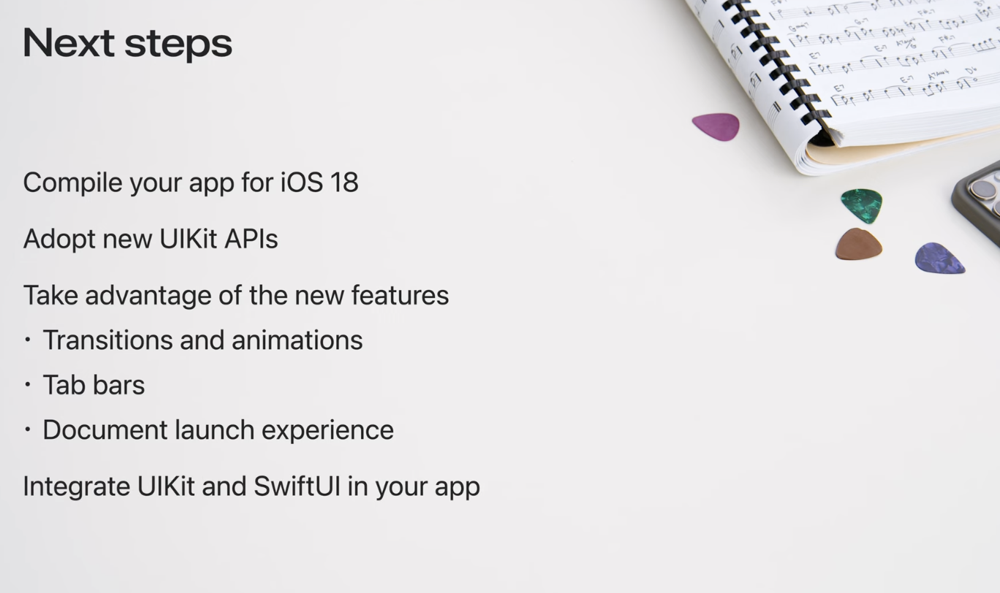

在 iOS 18 的众多改进中，SwiftUI 与 UIKit 的结合显著推进了 SwiftUI 的使用，特征系统的改进展示了 Apple 在推动包括 VisionOS 在内的整个 UI 系统的统一性。这些改进不仅为 UIKit 带来了新功能，还增强了它与其他系统的结合度。可以预见，未来 Apple 的 UI 系统将会更加统一。

接下里要做什么呢！

- 使用 iOS 18 SDK 编译你的应用。
- 采用新的 UIKit 特性
- 利用改进的过渡和动画、标签栏以及新的文档启动体验
- 并继续尝试新的方法来集成 UIKit 和 SwiftUI 在你的应用中！


## 相关 Session 以及 Docs

[WWDC24 What's new in UIKit](https://developer.apple.com/videos/play/wwdc2024/10118/?time=163)

[WWDC23 What's new in UIKit](https://developer.apple.com/videos/play/wwdc2023/10055/)

[Build better document-based apps](https://developer.apple.com/videos/play/wwdc2023/10056)

[Evolve your document launch experience](https://developer.apple.com/videos/play/wwdc2024/10132/)

[Enhancing your app with fluid transitions](https://developer.apple.com/documentation/uikit/animation_and_haptics/view_controller_transitions/enhancing_your_app_with_fluid_transitions?language=objc)

[Unleash the UlKit trait system](https://developer.apple.com/videos/play/wwdc2023/10057/)

[Elevate your tab and sidebar experience in iPadOS](https://developer.apple.com/videos/play/wwdc2024/10147/)

[Enhance your UI animations and transitions](https://developer.apple.com/videos/play/wwdc2024/10145/)

[What’s new in SwiftUI](https://developer.apple.com/videos/play/wwdc2024/10144/)

[What's new in SwiftUI 解读](https://github.com/SwiftOldDriver/WWDC24/blob/main/session_10144/README.md)

[What’s new in SF Symbols 6](https://developer.apple.com/videos/play/wwdc2024/10188/)

[Symbols](https://developer.apple.com/documentation/symbols?language=objc)

[Animate symbols in your app](https://developer.apple.com/videos/play/wwdc2023/10258/)

[Take your iPad apps to the next level](https://developer.apple.com/videos/play/wwdc2021/10057/)

[Squeeze the most out of Apple Pencil](https://developer.apple.com/videos/play/wwdc2024/10214/)
