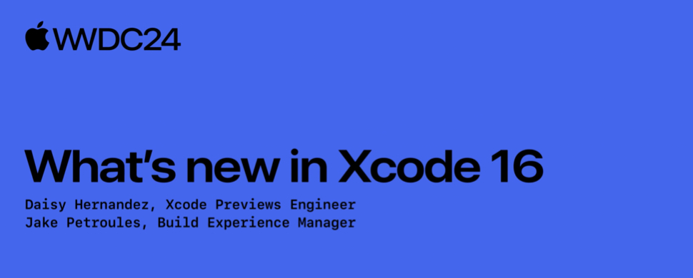

# Other

## 配图

## 自我介绍

元旭，目前在腾讯就职，主要负责 iOS 客户端的开发工作，对 Swift / Rust 语言本身比较感兴趣。

## 审核介绍

皮拉夫大王，目前就职于抖音基础技术团队，负责 iOS 稳定性相关工作。

## 文章简介

和往年一样，今年 Xcode 也迎来了全新版本，Session 10135 从 `Edit`，`Build`，`Debug`，`Test`，`Profile` 几个方面非常简短地讲述了更新的内容，文章针对这些重点特性分别进行了 Session 内容的翻译和部分必要的补充，尽力保证读者都可以对其有清楚的认识和理解；然后从 Xcode Release Note 中整理了部分需要关注的更新点；最终进行总结和探讨。
