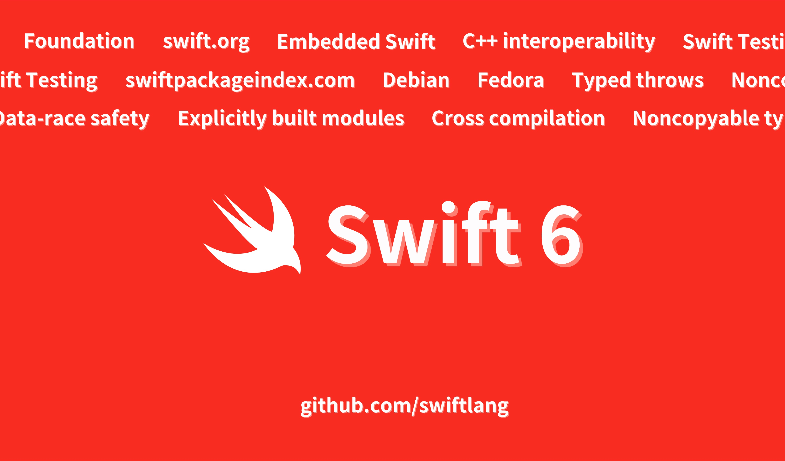

作者：

bq，野生 iOS 开发者，就职于字节剪映团队，喜欢音视频和图像处理，热爱摇滚与爵士，写完这句话就得要去洗菜做饭洗奶瓶了。

审核：

kemchenj(四娘)，老司机技术核心成员 / 开源爱好者 / 最近在做 3D 重建相关的开发工作。

摘要：

文章简要回顾 Swift 过去十年的历史，介绍社区通过工作组、扩展包生态和增加平台支持来促进 Swift 发展。还介绍一种默认实现数据竞争安全的新语言模式，以及一个允许在高度受限系统上运行的 Swift 语言子集。最后将探索一些语言更新，包括不可复制类型、类型化抛出和改进的 C++ 互操作性。
