---

session_ids: [10144]

---

# WWDC24 10144 - What's New in SwiftUI

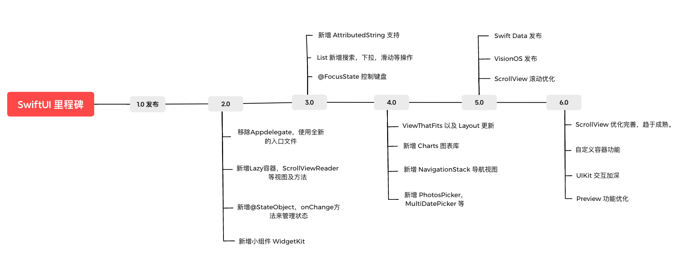

本文基于[Session 10144](https://developer.apple.com/videos/play/wwdc2024/10144/) 梳理。

基于今年 iOS 18，macOS 15，vision 2.0 的发布，SwiftUI 在各个平台也有相应的优化与更新。新的 Symbol Effect 动画，全新的 Preview 框架，更加深入的视图自定义操作，手势的补充和动画的展示等。接下来我们就一起具体了解一下今年苹果在 SwiftUI 能给我们带来哪些让我们开发效率更高的方法和功能。


## ScrollView 的重大更新

以前我们想在 SwiftUI 中监听 ScrollView 的滚动状态，或者手动控制其滚动位置是一件相对麻烦的事情，要么使用 `ScrollViewReader` 配合 View 的 id 进行滚动，要么使用 UIKit 的 UIScrollView 进行替代。通过 id 的方式无法满足部分使用场景，使用 UIScrollView 桥接又相对麻烦。但是在 iOS18 上 ，ScrollView 进行了重大提升，新增 `ScrollGeometry` 以及  `.onScrollGeometryChange` 方法来监听 ScrollView 的状态改变。同时新增了 `ScrollPosition` 来控制 ScrollView 的滚动位置，使我们对 ScrollView 的掌控变的更加简单。


### 新增 ScrollGeometry & .onScrollGeometryChange

`ScrollGeometry` 是 iOS18 引入的全新对象，包含我们在日常开发中所需要 ScrollView 的各种相关参数:

```swift
@available(iOS 18.0, macOS 15.0, tvOS 18.0, watchOS 11.0, *)
public struct ScrollGeometry : Equatable, Sendable {
    /// 偏移量
    public var contentOffset: CGPoint
  
    /// 滚动尺寸
    public var contentSize: CGSize
    /// 滚动视图和容器之间的间距
    public var contentInsets: EdgeInsets
  
    /// 容器大小
    public var containerSize: CGSize
  
    /// 可见范围
    public var visibleRect: CGRect { get }
  
    /// 不包括ContentSize的可见范围
    public var bounds: CGRect { get }
}
```

为配合 `Scroll Geometry` ，还同时新增了 `.onScrollGeometryChange`  API 用于监听其状态改变:

```swift
extension View {
  @available( iOS 18.0, macOS 15.0, tvOS 18.0, watchOS 11.0, *)
  nonisolated public func onScrollGeometryChange<T>(
      /// 最终需要转换的类型
      for type: T.Type, 
      /// 被监听的ScrollGeometry对象
      of transform: @escaping (ScrollGeometry) -> T, 
      /// 根据transform的逻辑，同时返回旧值与新值
      action: @escaping (_ oldValue: T, _ newValue: T) -> Void
  ) -> some View where T : Equatable
}
```

简单来说就是当 ScrollView 状态发生改变，API 会被调用，同时该方法支持开发者传入 `<T : Equatalbe>` 类型来将 Geometry 转换为我们最终需要的类型。例如：我需要监听 ScrollView 是否滚动到顶部，从而来控制部分功能的展示和隐藏。

```swift
ScrollView {
  // ...
}
.onScrollGeometryChange(for: Bool.self) { geometry in
  // 根据判断条件，当旧值与新值不同时，则会触发 action 回调
  geometry.contentOffset.y > geometry.contentInsets.top
} action: { oldValue, newValue in
  // do something 
}
```


### ScrollPosition

在 iOS18 同时还新增了 `ScrollPosition` 对象用来手动控制 ScrollView 的滚动位置，使我们更加方便控制 ScrollView 的滚动位置。而且初始化方法是支持传入 `Hashable` 的 id，这表明我们可以同时对同一页面中不同的 ScrollView 进行单独控制的。

```swift
@available(iOS 18.0, macOS 15.0, tvOS 18.0, watchOS 11.0, visionOS 2.0, *)
public struct ScrollPosition : Sendable {
    public init(id: some Hashable & Sendable, anchor: UnitPoint? = nil)
}

@available(iOS 18.0, macOS 15.0, tvOS 18.0, watchOS 11.0, visionOS 2.0, *)
extension ScrollPosition {
    /// 根据id滚到指定位置
    public mutating func scrollTo(id: some Hashable & Sendable, anchor: UnitPoint? = nil)
  
    /// 滚动到指定edge
    public mutating func scrollTo(edge: Edge)

    /// 滚动到指定point
    public mutating func scrollTo(point: CGPoint)

    /// 滚动到指定的偏移量
    public mutating func scrollTo(x: CGFloat, y: CGFloat)
    public mutating func scrollTo(x: CGFloat)
    public mutating func scrollTo(y: CGFloat)
}
```


所以在 iOS18 上，根据上面新增的方法，我们可以使用少量代码就完成以下功能:  **当 ScrollView 离开顶部时，页面会自动显示回到顶部按钮，点击后 ScrollView 回到顶部，然后按钮自动隐藏**

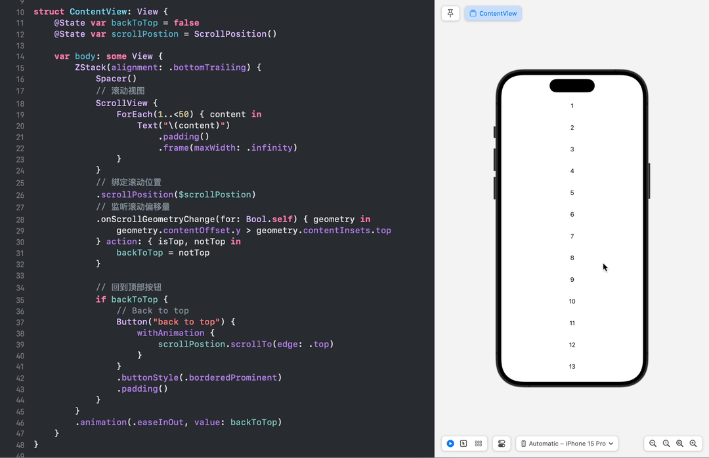


### onScrollVisibilityChange

iOS18 还有新增了当 Scroll 在滚动过程中， Subview 在屏幕上显示和隐藏的时候, 会触发此方法。类似于 UITableView 中的 willDisplayCell 和 didEndDisplayCell 方法。

同时我们可以通过 `threshold` 阀值来控制 action 回调的时机，例如：将数值设置为 0.5 的时候，子视图如果在屏幕展示或者隐藏超过 50% 的时候，则会触发 action。但是当我们设置为 0 的时候，则 action 永远都不会触发。

```swift
extension View {
  @available(iOS 18.0, macOS 15.0, tvOS 18.0, watchOS 11.0, visionOS 2.0, *)
  /// threshold：触发 action 的视图展示比例
  nonisolated public func onScrollVisibilityChange(threshold: Double = 0.5, _ action: @escaping (Bool) -> Void) -> some View
}


/// 官方示例: 用于滚动视图上的视频自动播放和暂停
struct AutoPlayingVideo: View {
  @State private var player: AVPlayer = AVPlayer()

  var body: some View {
    VideoPlayer(player: player)
      .onScrollVisibilityChange(threshold: 0.2) { visible in
        if visible {
          player.play()
        } else {
          player.pause()
        }
      }
  }
}
```


## Custom Container View 自定义容器视图

iOS18，SwiftUI 为 `ForEach` 和 `Group` 新添加了 `subviewOf` 重载方法，可以遍历 View 下面的所有 subview，然后我们可以对遍历出来的 subview 进行属性更新和二次封装。

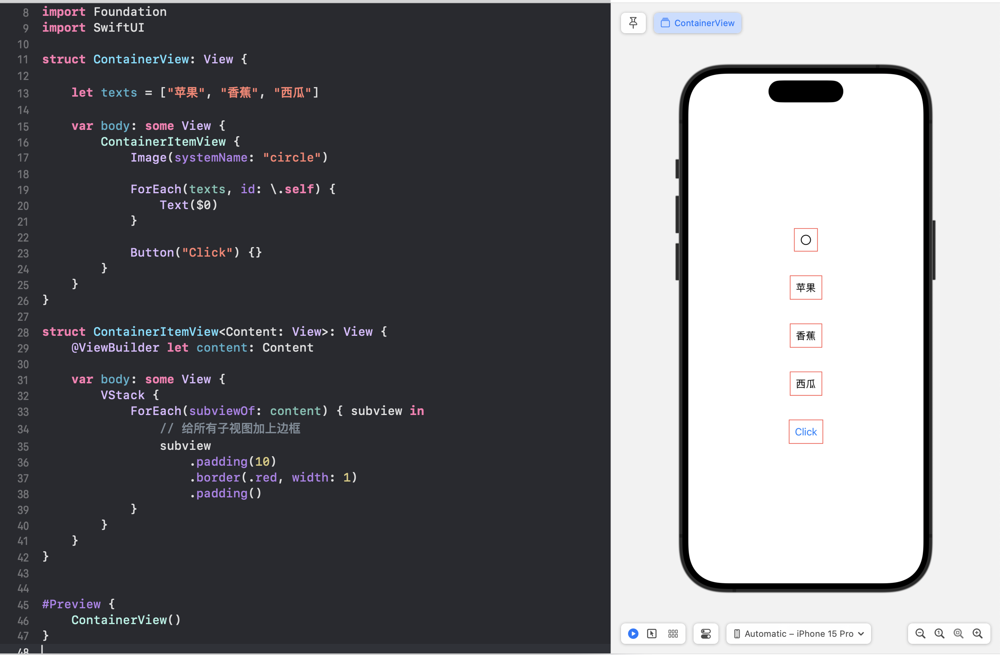

通过上面的例子可以看到，现在我们可以很简单的创建输入我们自己内置容器了。例如：自定义的 List 、 TabView 、以及各种 Stack 类的视图、等等。配合新增的 `Subview` 类型和 `SubviewCollection` 集合，我们可以更加灵活的来实现我们想要的效果和样式的自定义容器了。

更多详细自定义容器的内容，请观看 Session 10146 《 Demystify SwiftUI containers [2] 》


## SwiftUI 与 UIKit 中全新的交互

虽然 SwiftUI 目前能满足大部分页面开发需求，但总有一些复杂或者特殊的功能是 SwiftUI 目前难以实现的，这个时候我们通常会用 `UIViewRepresentable` 来桥接 UIView 和 SwiftUI，让我们可以直接在 SwiftUI 中使用 UIView 来完成这些页面功能。在 iOS18 中，苹果同时也带来了 SwiftUI 与 UIKit 之间全新的交互，进一步提升框架之间协作度和联动性。


### UIKit 与 AppKit 可以使用 SwiftUI 的动画效果了

在 SwiftUI 中，我们可以通过非常简单的 API 来实现一些复杂的动画效果。但是在 UIKit 中，我们想要实现一些复杂的动画则是相对麻烦的一件事情，我们不仅要考虑代码的编写，同时还要配合约束和视图的刷新时机等。

但是在 iOS 18 中，我们只需要一行代码就可以让 UIKit 和 AppKit 拥有 SwiftUI 的动画效果了。

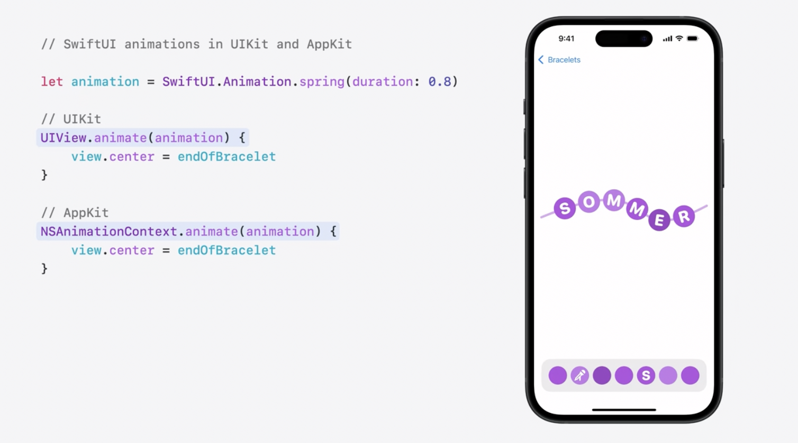

同时也增加了对 `UIViewRepresentable` 的支持，可以直接使用 SwiftUI 的语法来控制 UIView 中动画效果。

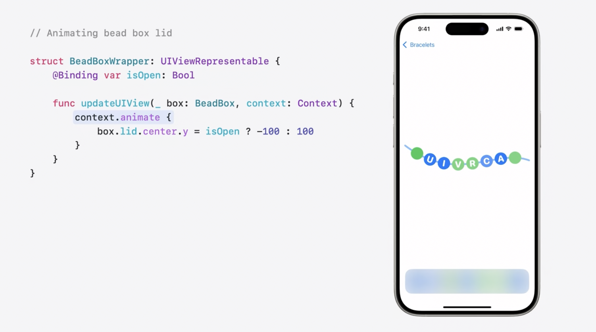


### 新增 UIGestureRecognizerRepresentable 协议

由于 SwiftUI 中的手势不是基于已有的 UIGestureRecognizer 进行包装，而是独立编写的手势方法。虽然在使用上变的更加简洁，但是目前仅支持一些简单的单指操作，所以导致可能我们仅仅只需一些手势的功能，却还是需要通过 UIView 来实现。

在今年 iOS 18 中，新增 `UIGestureRecognizerRepresentable` 协议，使得我们可以单独的对手势进行桥接了，这样我们就只需对手势进行扩充，而不用对整个页面进行桥接了。其使用方法与已有的 `UIViewRepresentable`  协议内容类似，在 `makeUIGestureRecognizer` 方法中创建我们想用的手势，在 `updateUIGestureRecognizer` 中处理事件。

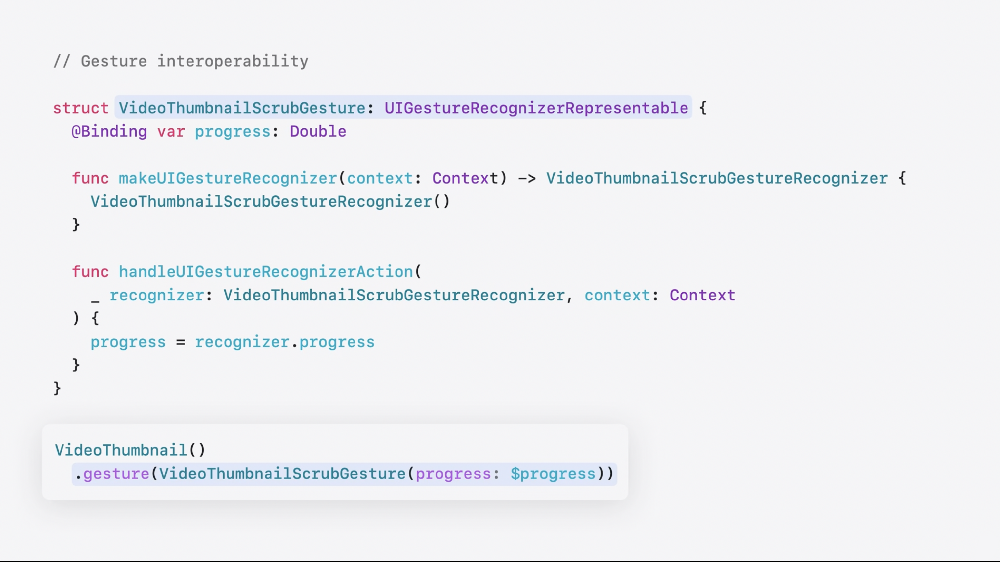


## 小组件

### 全新的小组件类型

iOS 18 上用户可以自定义控制中心上的内容了，配合该功能的发布，小组件也带来了全新的类型 `ControlWidget` 。

而且我们可以直接控制中心完成小组件的点击事件，同时不需要打开 app，只需通过调用新增 `reloadControls` 的方法，就可以实现小组件视图的更新。

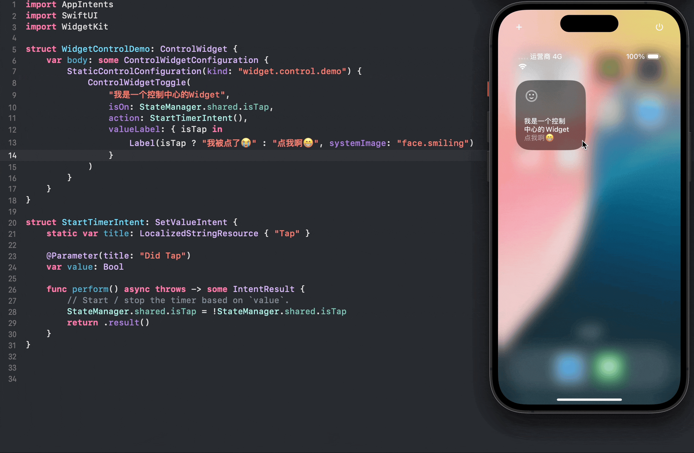


iOS 18 同时新增的还有 `WidgetRelevances` 方法，当我们实现了改方法之后，可以让小组件和实时活动在用户抵达指定位置，或在指定时间的时候再来展示到屏幕上，让小组件变的更加智能且便利。

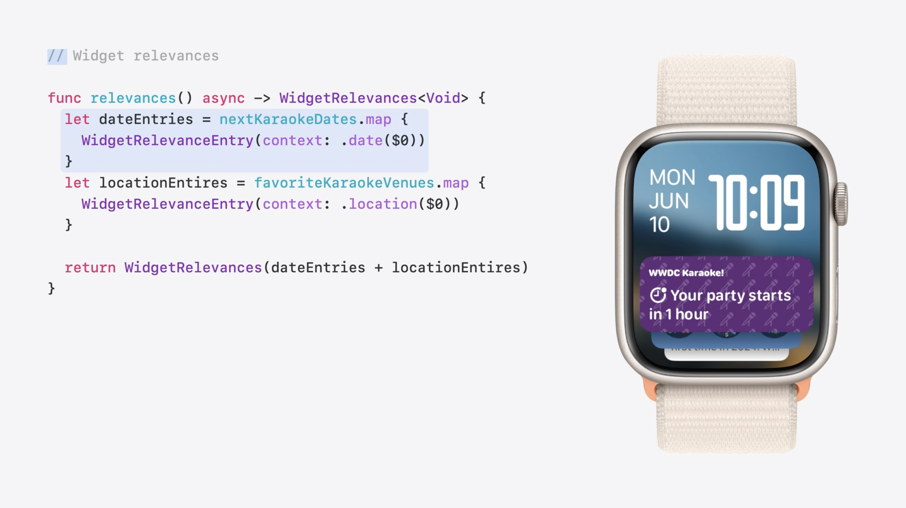


更多关于锁屏和控制中心小组件的交互方法与事件以及新增内容，请观看 Session 10157《 Extend your app’s controls across the system[1] 》


### watchOS 支持实时活动与 iPhone 同步显示

watchOS 在 11.0 版本中支持实时活动了，并且会自动与 iOS 设备进行同步展示。而我们不需要对代码进行太多改变，只需要添加新增方法 `.supplementalActivityFamilies` 来适配在 watch 设备上的显示尺寸，这样就可以实现该功能的实现了。

```swift
@available(iOS 18.0, tvOS 18.0, watchOS 11.0, *)
@available(macOS, unavailable)
@available(macCatalyst, unavailable)
extension WidgetConfiguration {
    // ActivityFamily 目前有两种类型 
    // small: 显示在watchOS上的尺寸
    // medium: 显示在iOS设备上的尺寸
    @MainActor @preconcurrency public func supplementalActivityFamilies(_ families: [ActivityFamily]) -> some WidgetConfiguration
}

```


## 全新 TextRenderer 功能

 iOS 18 ，新增  `.textRenderer`  方法，让 Text 文本可以直接渲染成我们想要的效果了。只需要遵循 `TextRenderer` 协议，我们就可以让 Text 绘制成我们想要的效果。同时我们可以选择整行渲染，也可以选择单个文字渲染，这样在 SwiftUI 中，我们可以很轻松的实现复杂的富文本效果了。

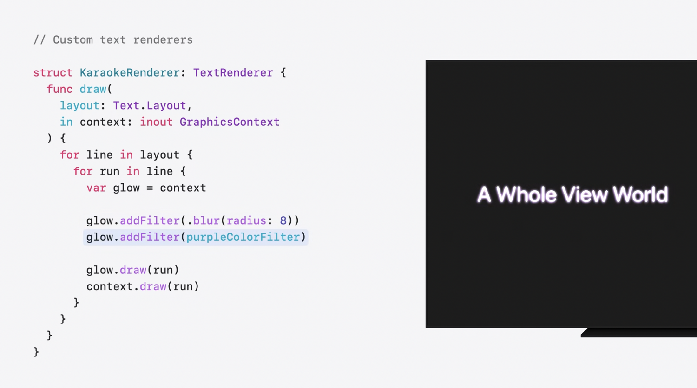

更多关于自定义文本渲染的内容，请观看 Session 10151 《 Create custom visual effects with SwiftUI [3] 》


## 在 macOS 上的更新

### Window 视图新增 API

在 macOS 15 上 Window 终于可以自定义控制层级关系了，通过新增的 `.windowLevel(_ level: WindowLevel)` 方法，我们可以通过 `WindowLevel` 来控制 Window 在屏幕上优先级了。

```swift
@available(macOS 15.0, *)
@available(iOS, unavailable)
@available(tvOS, unavailable)
@available(watchOS, unavailable)
@available(visionOS, unavailable)
public struct WindowLevel : Sendable, Hashable {
    /// 根据scene type和window style来自动选择
    public static var automatic: WindowLevel { get }

     /// 最低优先级，展示在所有其他window的后面
    public static var desktop: WindowLevel { get }

    /// 最高优先级，会一直展示在最前面(例如：画中画的window级别就是floating)
    public static var floating: WindowLevel { get }

    /// 普通优先级
    public static var normal: WindowLevel { get }
}
```


同时还新增了 `.defaultWindowplacement` 用于调整 Window 的位置及大小，还有 `WindowDragGesture` 手势方法让用户可以手动拖拽 Window 的位置。

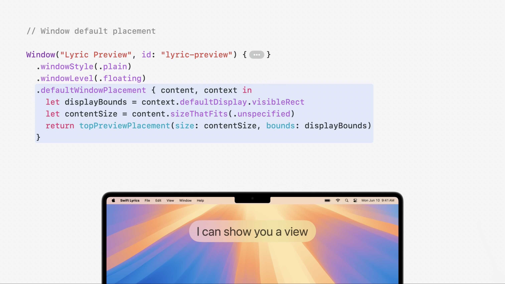

更多详细关于 macOS 中的 window 的内容， 请观看 Session 10148《 Tailor macOS windows with SwiftUI [4] 》


### TextField 新增建议输入功能

TextField 新增 `.textInputSuggestions` 输入建议 API，当用户在输入文本内容时，该功能会根据开发者预先传入的数据进行匹配，如果有匹配内容，则会以下拉菜单的形式展示到 TextField 下面，用户选择之后会自动填充内容。

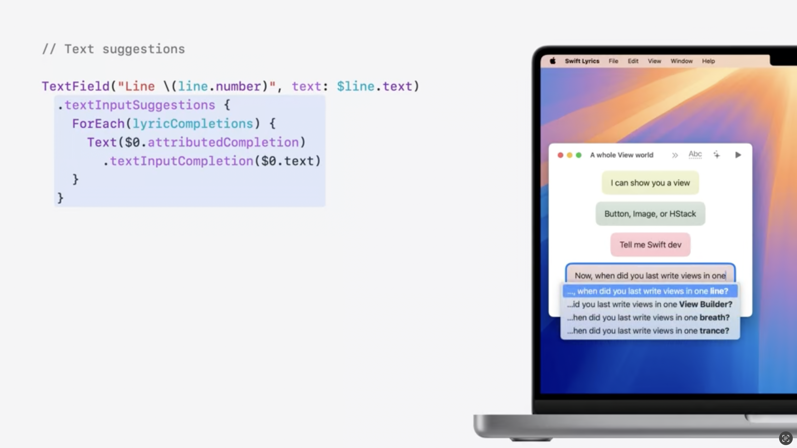


### 新增隐式视图

新增 `.modifierKeyAlternate` 方法让视图拥有隐式视图的功能，当用户按下指定按键后，当前显示的视图会被隐藏，隐式视图则会被展示出来。

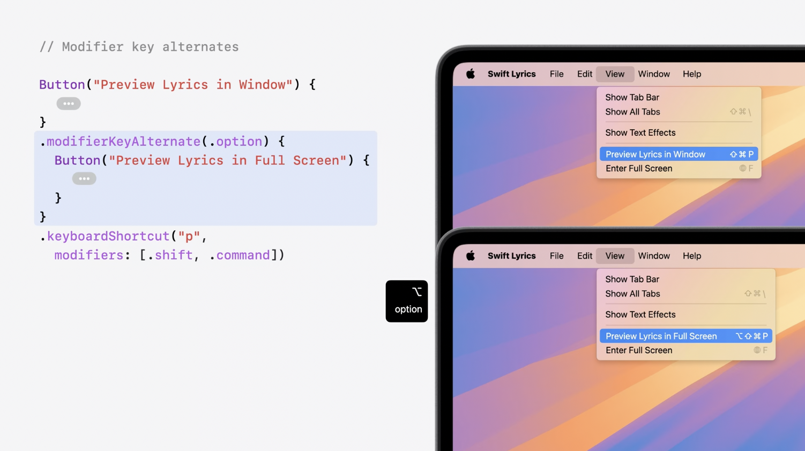

同时还有 `.onModifierKeysChanged` 方法监听用户按下某个指定按键，获取其之前状态以及当前状态，这样就可以在用户按下按钮后，做一些视图上的改变。


## 在 iPadOS 的更新

### 新的 TabView 样式

在 iPadOS 18 中，TabView 新增 `.sidebarAdaptable` 样式。该样式还同时支持 macOS 和 visionOS。

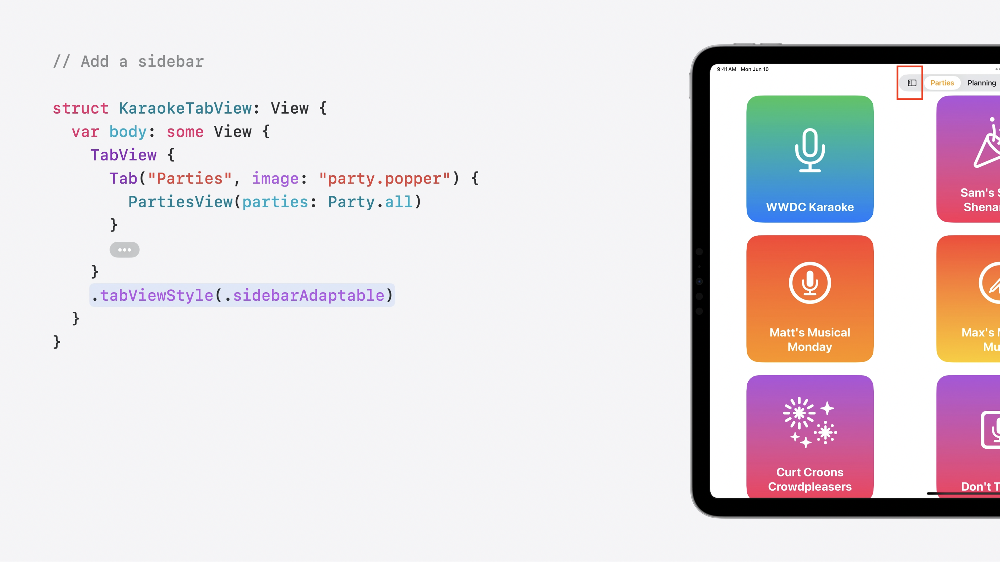

使用该样式之后 TabView 会自动添加一个按钮，提供 TabView 在侧边栏和标签栏样式相互切换的功能。

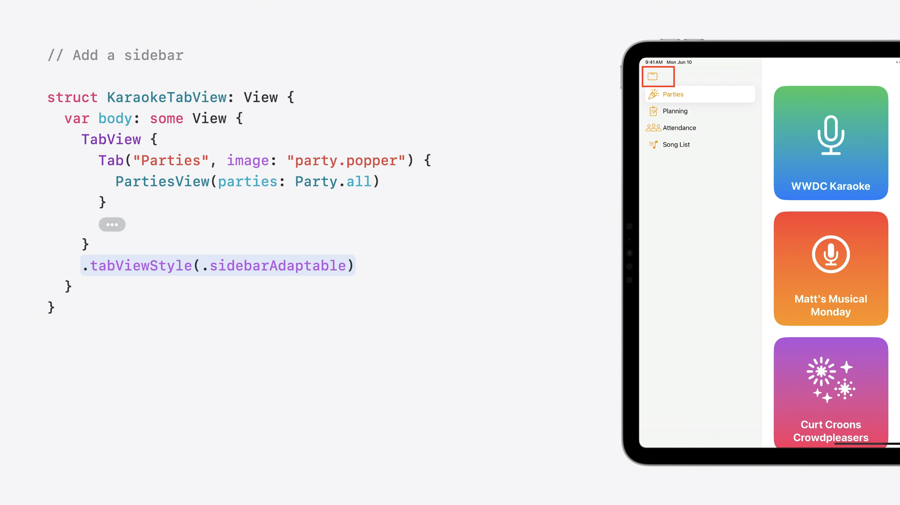

同时在侧边栏状态下，使用 `.tabViewCustomization` 方法来支持自定义操作(删除，排序等)。

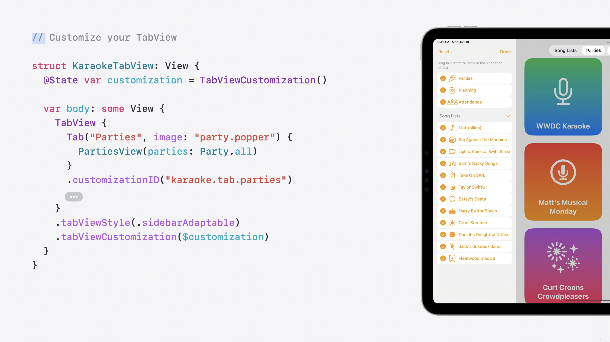

更多关于新的 TabView Style 内容， 请观看 Session 10147 《 Elevate your tab and sidebar experience in iPadOS [5] 》


### 新增文档启动导航视图

iPadOS 18 中新增了 `DocumentGroupLaunchScene` 类型来配合 `DocumentGroup` 一同使用，可以在文档页面上方添加自定义视图。

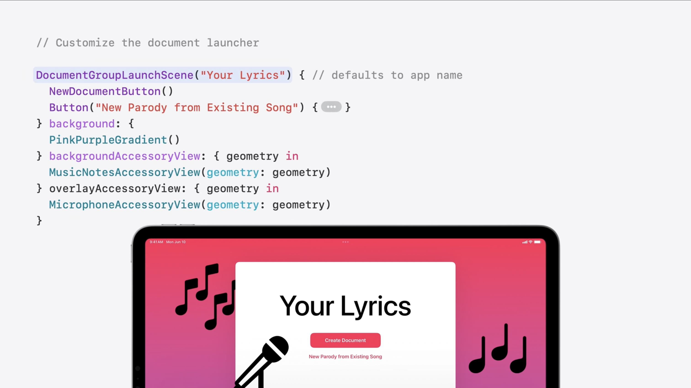

更多内容 Session 10132 《 Evolve your document launch experience [6] 》


### 新增文稿视图弹窗大小

新增了 `.presentationSizing` 方法来统一各个平台的弹窗尺寸大小。 我们可以使用 `.form` 或 `.page` 等预设属性来控制弹窗的大小，而且同时也支持开发者自定义其大小。

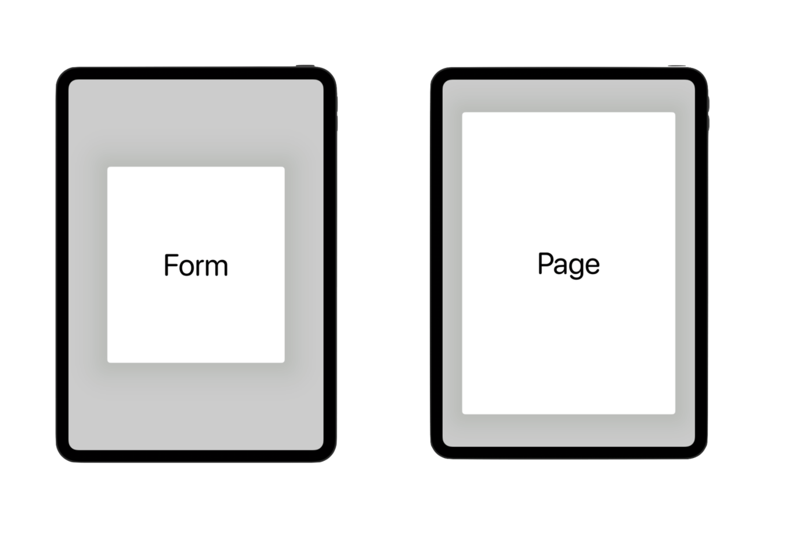

可以看到在 iPad 上 `form` 明显比 `page` 更小，但是 iOS 并没有这种差异化，两种类型在 Sheet 上展示的大小是一致的。


## 在 vision OS 上的更新

### 新增眼部悬停效果

在 vision os 2.0 上新增 `.hoverEffect` 方法，用户眼部悬停在当前视图时，则会触发改方法来展示我们的自定义预设效果。

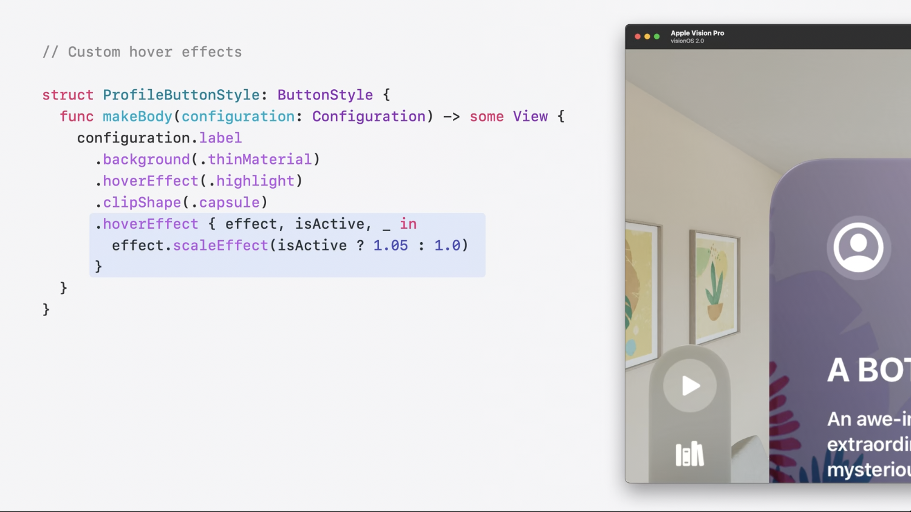

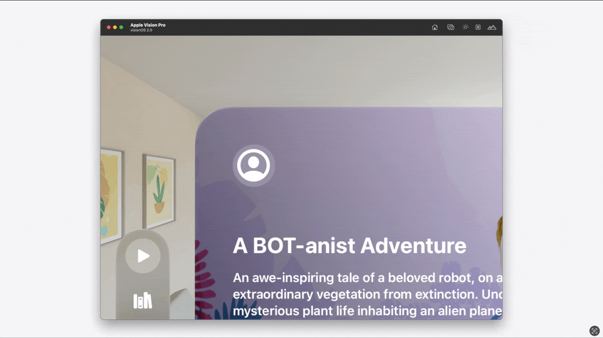

更多详细内容，请观看 Session 10152 《 Create custom hover effects in visionOS [7]  》


### 新增视角变化监听方法

当用户视角发生改变之后，会触发 `.onVolumeViewpointChange` 方法。配合旋转方法，可以让模型对一直面向用户正前方。

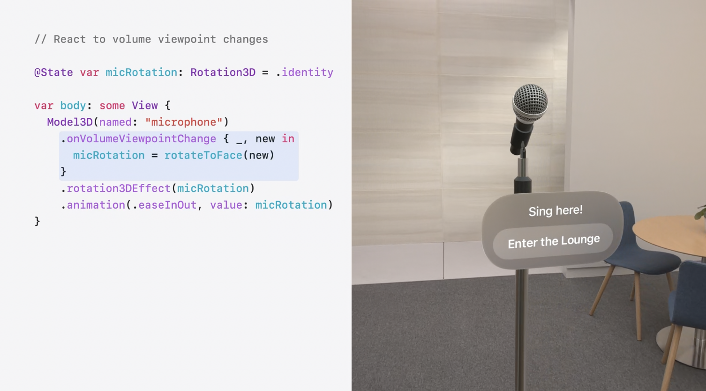


### 新增沉浸式空间效果控制功能

`ImmersionStyle` 新增 `progressive` 方法，用来控制沉浸式空间的效果。

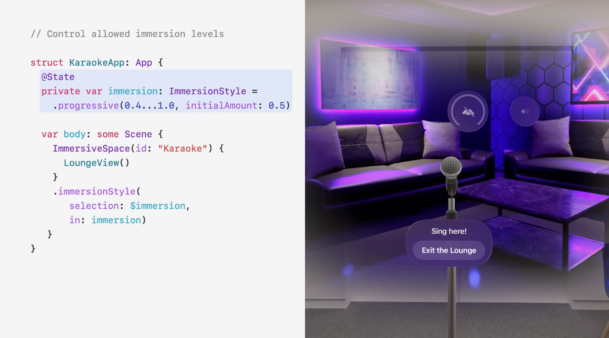

更多关于 vision 中沉浸效果内容，请观看 Session 10153 《 Dive deep into volumes and immersive spaces [8] 》


## 其他新增

### 新增宏@Entry

之前我们如果想自定义 EnvironmentKey，首先需要创建一个需要遵循 `EnvironmentKey` 协议的对象，然后还需要对 `EnvironmentValues` 进行扩展，重写 `get` 和 `set` 方法。现在只需要使用 `@Entry` 宏(最低支持 iOS15 )，就可以完成上述所有步骤。

```swift
/// Before
struct OldDriverKey: EnvironmentKey {
    static var defaultValue: String = "WWDC 2024"
}

extension EnvironmentValues {
    var oldDriver: String {
        get { self[OldDriverKey.self] }
        set { self[OldDriverKey.self] = newValue }
    }
}

/// Now
extension EnvironmentValues {
    @Entry var oldDriver: String = "WWDC 20204"
}
```

**@Entry** 也能同时用于 `Focusvalues` 、`Transaction` 、  `ContainerValues` 以及 `TraitValues` 上。


### Xocde 新增 @previewable & Preview 的性能提升

在 Xcode16 中，Preview 进行了重写，使用动态库链接的方式使项目中的 Preview 和 Run 不再单独进行构建，而是使用统一方式进行 Build。这样项目就不需要在 Preivew 和 Build-Run 中来回切换了，从而提升了 Preivew 的效率。

同时 Preview 中新增了 `@previewable` 宏，在 iOS18 中我们可以在 Preivew 中直接使用 @State 进行预览了。


### View 不在需要声明@MainActor

在 Swift6 中，所有的 View 已经默认隐式的添加了 `MainActor`。意味着在 Swift6 中，我们可以把所有 View 的 @MainActor 修饰移除，因为其默认为线程安全了。

更多关于 SwiftUI 在 Swift6 中的更新，请观看 Session 10169《 Migrate your app to Swift 6 [9] 》


### Charts 新增 LinePlot 折线图类型

图表视图框架中现在新增了折线图类型，该类型支持自定义折线的弧度，粗细等样式。

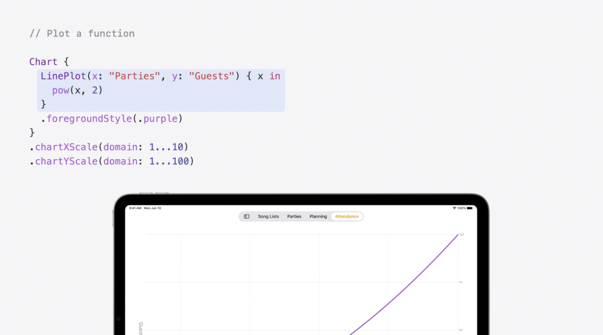

更多关于折线图的方法和自定义功能，请观看 Session 10155《 Swift Charts: Vectorized and function plots [10]  》


### 新增 MeshGradient 网格渐变功能以及颜色混合功能

iOS18 新增 `MeshGradient` 功能，该功能会根据传入的颜色及控制点，线性平滑的绘制颜色。

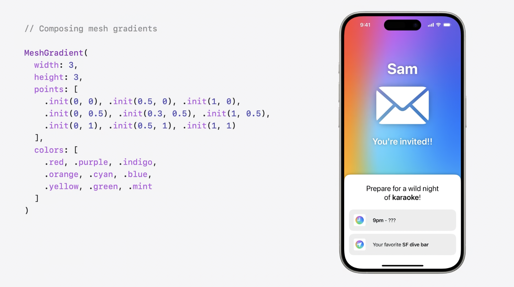

同时在 iOS18 只需要一行代码就能使当前颜色也可以通过一定比例混合另外一种颜色

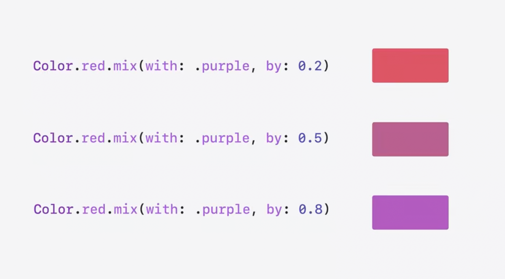


### SF Symbols 6

在 SF Symbol 6 中新增了 3 种动画效果，`.wiggle(晃动效果)`，`.breathe(呼吸渐变效果)`，`.rotate(图标部分旋转动画)`，同时对部分已有动画的效果进行了完善和优化，使得 SF Symbol 能给我们带来更完善的动画体验。

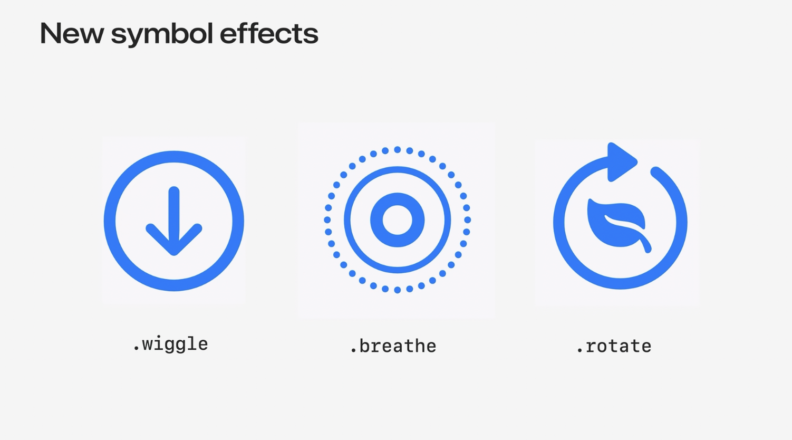

 更多关于 SF Symbol 6 的新增内容，请观看 Session 10188《 What’s new in SF Symbols 6 [11] 》


### Navigation 新的转场动画 & SearchFocused

iOS 18 中 Navigation 添加了新的转场动画 `zoom transition` ，只需要使用 `.matchedTransitionSource` 方法即可使用新的转场动画。

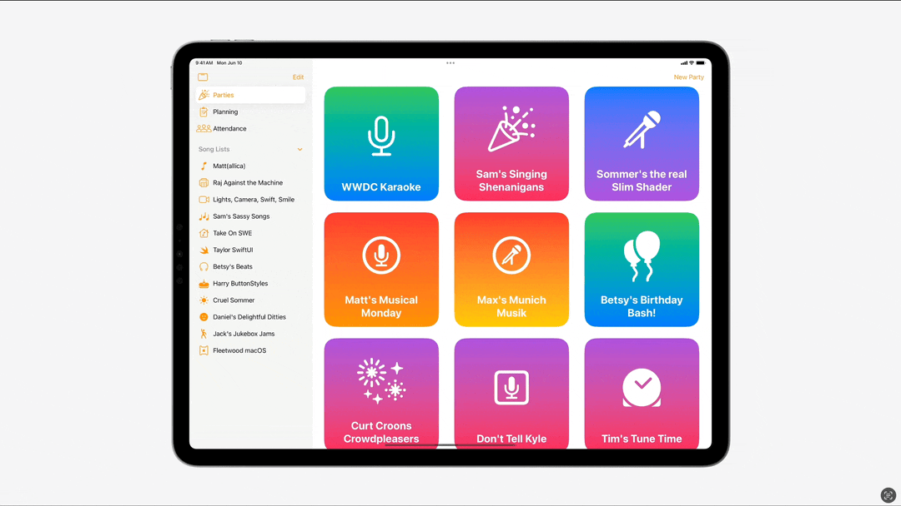


同时在 iOS18 新增了 `.searchFocused`，让我们可以手动控制 Navigation 中的 SearchField 键盘的收起和弹出了。

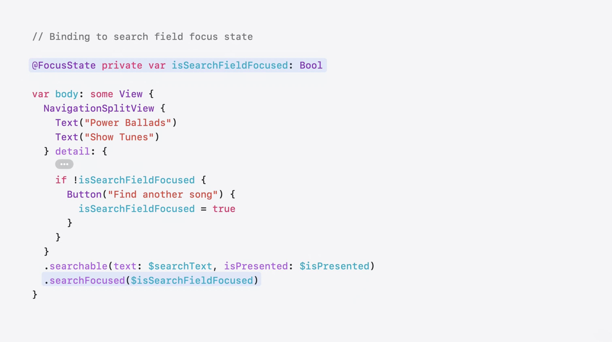


### Apple Pencil 新增手势

在 iPadOS 17.5 和 macOS 14.5 中，新增 Apple Pencil 和 Apple Pencil Pro 的双击以及捏合手势。

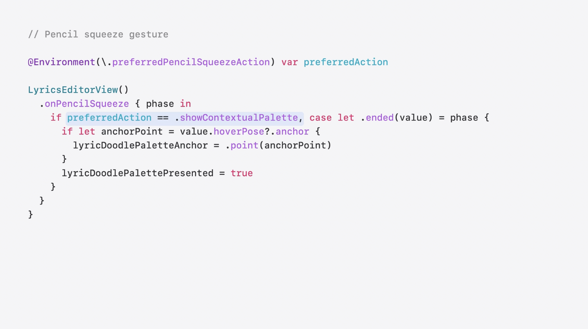

更多关于 Apple Pencil 新增内容，请观看 Session 10214《 Squeeze the most out of Apple Pencil [12] 》


## 总结

因为 SwiftUI 是未来苹果主推的跨平台 UI 框架，所以每年都会加快更新进度来追赶 UIKit 的进度。今年在 iOS 上最重要的更新是 ScrollView 优化，让我们自己终于可以自己监听和控制 Scroll View 了。同时新增的 TextRenderer 方法可以让我们更加简单完成富文本的样式。SwiftUI 和 UIKit 的交互更新，使得两边更加相辅相成，使用更加便捷。但是上述功能最低版本仅支持 iOS18，所以要在项目上想要使用可能还需要多等上一段时间。

同时配合 iOS 18 的控制中心自定义功能，小组件也带来的全新的类型，让我们可以进一步的个性化手机的设置。

今年 SwiftUI 和 UIKit 的交互更新，可以让目前没有用过 SwiftUI 的开发者在 UIView 中提前感受 SwiftUI 简洁的炫丽的动画效果，同时也能让 SwiftUI 完成更加复杂的手势操作了。

由于 SwiftUI 的跨平台特性，所以在 iPad，macOS 以及 visionOS 上也有相应的更新内容，例如 TabView 和 Window 的更新和优化等。配合今年 Swift6 的更新，SwiftUI 在未来可能会增加更多更加便利的新功能和新方法，同时让跨平台开发变的更加方便，简单。

虽然目前 SwiftUI 也逐渐趋于成熟，但是问题还是比较明显，大量 API 仅支持相对较高版本，导致我们无法真正在项目中使用。而且根据开发社区反馈的问题来看，SwiftUI 的更新速度是处于滞后状态的，希望未来苹果能加快 SwiftUI 的更新，让大部分开发者都能参与其中。


如果想更直观看到今年 SwiftUI 有哪些新的 API，可以看看官方的更新文档《 SwiftUI updates 》。 <https://developer.apple.com/documentation/Updates/SwiftUI>


参考资料

[1] Session 10157  《Extend your app’s controls across the system》

<https://developer.apple.com/videos/play/wwdc2024/10157>

[2] Session 10146 《 Demystify SwiftUI containers 》

<https://developer.apple.com/videos/play/wwdc2024/10146>

[3] Session 10151 《 Create custom visual effects with SwiftUI 》

<https://developer.apple.com/videos/play/wwdc2024/10151>

[4] Session 10148 《 Tailor macOS windows with SwiftUI 》

<https://developer.apple.com/videos/play/wwdc2024/10148>

[5] Session 10147 《 Elevate your tab and sidebar experience in iPadOS 》

<https://developer.apple.com/videos/play/wwdc2024/10147>

[6] Session 10132 《 Evolve your document launch experience 》

<https://developer.apple.com/videos/play/wwdc2024/10132>

[7] Session 10152 《 Create custom hover effects in visionOS  》

<https://developer.apple.com/videos/play/wwdc2024/10152>

[8] Session 10153 《 Dive deep into volumes and immersive spaces 》

<https://developer.apple.com/videos/play/wwdc2024/10153>

[9] Session 10169《 Migrate your app to Swift 6 》

<https://developer.apple.com/videos/play/wwdc2024/10169>

[10] Session 10155《 Swift Charts: Vectorized and function plots 》

<https://developer.apple.com/videos/play/wwdc2024/10155>

[11] Session 10188《 What’s new in SF Symbols 6 》

<https://developer.apple.com/videos/play/wwdc2024/10188>

[12] Session 10214《 Squeeze the most out of Apple Pencil 》

<https://developer.apple.com/videos/play/wwdc2024/10214>
