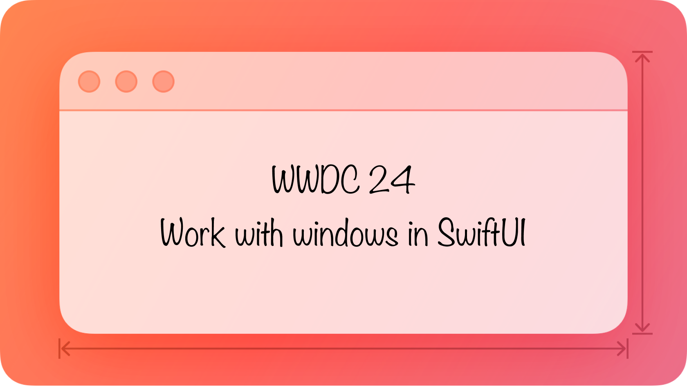

### 配图

### 自我介绍

Rickey：前字节 iOS 开发，现外企摸鱼；独立开发者，运营着一款小众配色 app ——  [iColors](https://apps.apple.com/app/id6448422065)

### 审核介绍

BluesJiang，iOS 开发者，老司机技术成员，目前就职于淘宝，负责淘宝原生基础架构。热衷于 Swift/SwiftUI 等基础技术领域。

### 简介

Window（窗口） 是承载 App 内容的最重要的容器，尤其是在 macOS 和 VisionOS 平台上更是需要优雅地设计和使用窗口。本文将介绍 Windows 组件，并且基于一个 Demo（BOT-anist）从实战角度进行教学。
