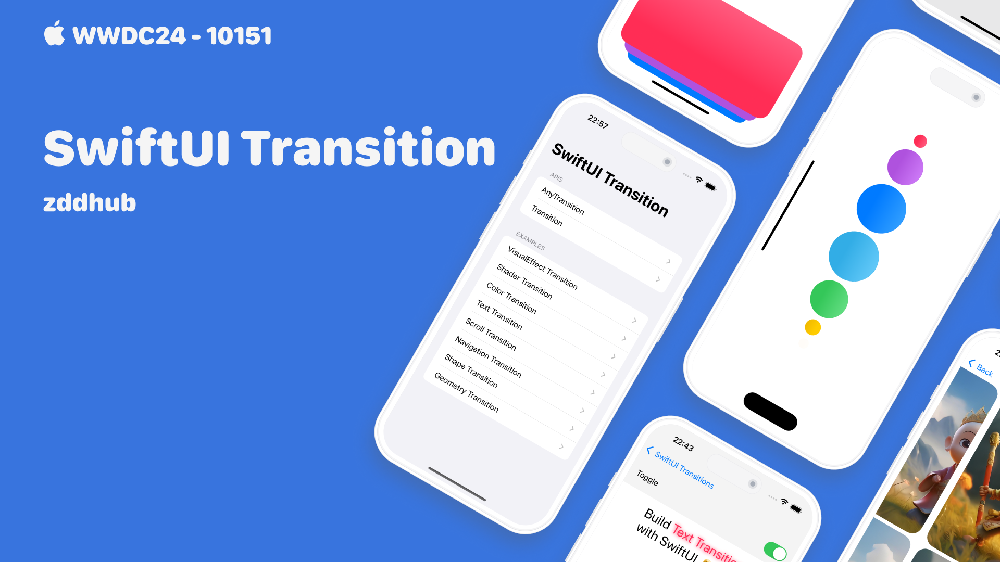

## 个人介绍

zddhub(张东东)，移动开发，MacOS App：[**PixelsMeasure**](https://apps.apple.com/cn/app/pixelsmeasure/id1638740542) 开发者。

## 审核介绍

Jake Lin，在 REA Group 担任 Senior Mobile Tech Lead，负责公司的移动研发和团队建设。喜欢研究 iOS 和 Android 两平台的架构，爱折腾声明式 UI 和响应式编程范式。并编写了 [iOS 开发进阶](https://t2.lagounews.com/lR59RGRBct5E3) 课程。

## 不超过 120 个字的文章简介

本文介绍了 SwiftUI 实现过渡效果的两种方式：AnyTransition 和 Transition，剖析了自定义步骤和注意事项，并通过多个示例展示了视觉、着色器、颜色、文字、滚动和导航等过渡效果，以启发读者创建令人印象深刻的效果。

## 公众号/小专栏图文头图

