# WWDC24 10151 - SwiftUI 过渡效果篇

> 摘要：本文将介绍 SwiftUI 实现过渡效果的两种方式：AnyTransition 和 Transition。并逐步剖析自定义 SwiftUI 过渡效果的步骤和注意事项，最后通过多个示例展示视觉、着色器、颜色、文字、滚动和导航等不同类型过渡效果的应用，旨在启发读者创建令人印象深刻的过渡效果。

本文基于 Session [10151][10151] 再创作。

> 作者：
>
> zddhub(张东东)，移动开发，MacOS App：[**PixelsMeasure**](https://apps.apple.com/cn/app/pixelsmeasure/id1638740542) 开发者。
>
> 审核：
>
> Jake Lin，在 REA Group 担任 Senior Mobile Tech Lead，负责公司的移动研发和团队建设。喜欢研究 iOS 和 Android 两平台的架构，爱折腾声明式 UI 和响应式编程范式。并编写了 [iOS 开发进阶](https://t2.lagounews.com/lR59RGRBct5E3) 课程。

视觉效果对应用的使用体验和感知起着至关重要的作用。优秀的应用会注重创建丰富的视觉效果，从而提升表达力和用户体验。SwiftUI 在过去两年中对视觉效果做出了极大改进。去年我们发表的 [《SwiftUI 动画篇》][SwiftUI_Animation] 中，详细讲解了如何利用动画机制来创建令人印象深刻的视觉效果。今年，我们将重点探讨 SwiftUI 提供的另一种创建视觉效果的机制：过渡效果 (SwiftUI Transition)。

## 过渡效果简介

过渡效果，也称为过渡动画，是指在用户界面中，视图元素从一种状态转换到另一种状态时所采用的动画效果。它能够在视图被插入（显示）或移除（隐藏）时，为用户提供视觉上的平滑过渡，使界面更加动态和吸引人。过渡效果的主要目的是通过更自然的视觉变化来提升用户体验，使用户更容易理解界面状态的变化。

### 过渡效果的主要特性

- **平滑性**：过渡效果可以使视图元素在显示或隐藏时以平滑的方式进行过渡，避免突然出现或消失，减少视觉上的突兀感。
- **视觉反馈**：通过动画效果，用户可以及时获得视觉反馈，清晰地感知视图状态的变化。例如，当一个新视图或一个警告框淡入时，用户能够显而易见地注意到它们。
- **增强用户体验**：通过使应用的界面更具互动性和生机，提高整体用户体验。

### 过渡效果的使用场景

过渡效果在应用开发中广泛用于以下场景，以提升用户体验和界面动态感：

- **视图显隐**：显示或隐藏模态视图和对话框时使用淡入淡出效果；在导航栈中切换视图时使用滑动效果。
- **内容变化**：数据刷新、状态更新时使用动画过渡，例如列表项的插入和删除。
- **控件状态**：表单控件状态变化时提供反馈，比如按钮点击、输入框获取焦点等。
- **提示与通知**：显示或隐藏通知栏、工具提示时使用滑动或淡入淡出效果。
- **动态界面**：切换布局（如从列表视图到网格视图）或显示菜单时使用平滑的过渡效果。

### SwiftUI 提供的过渡效果机制

在 SwiftUI 中，过渡效果处理视图在添加到和移除出视图层次结构时所产生的变化。当视图从无到有，或者从有到无的状态之间变化时，SwiftUI 会插值中间的状态，这与动画机制类似。过渡效果可以看成是一种特殊的动画。SwiftUI 提供了以下三种方式来实现过渡效果：

- **AnyTransition 结构体**（一种类型擦除的过渡): 适用于 iOS 13.0+
- **Transition 协议**：iOS 17.0+
- **含有 `transition` 的修饰符**: 例如: `.transition`, `.scrollTransition`, `.navigationTransition`, `.contentTransition` 等。

SwiftUI 的过渡效果接口随着动画机制一同进化，从 iOS 13.0+ 开始引入，到 iOS 17.0+ 日益完善。

## AnyTransition 结构体

尽管 AnyTransition 是在 SwiftUI 的早期版本中引入的，其功能依然非常强大，并在多种场景下表现出色。

### AnyTransition 基本用法

AnyTransition 是 SwiftUI 中的一个类型擦除(Type Erasure)结构体，用于定义视图在出现和消失时的过渡效果。借助 AnyTransition，开发者不仅可以灵活创建各种自定义过渡效果，还能方便地使用 SwiftUI 提供的内置过渡效果，快速实现丰富的视觉变化。

要使 AnyTransition 定义的过渡效果应用到视图上，需要使用 `.transition` 修饰符。然而，需要注意的是，仅使用 `.transition` 修饰符不足以实现过渡效果，还必须与 `.animation` 修饰符配合使用，才能让过渡效果在视图状态变化时生效。

要使过渡效果生效，需要按照以下三步操作：

1. 使用 `.transition` 指定一种过渡效果。
2. 确保过渡视图的状态发生变化（从无到有，或从有到无）。
3. 关联一个动画来驱动过渡效果的执行。

例如，实现一个滑入滑出的过渡效果：

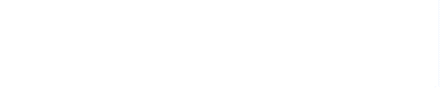

可以这样实现：

```swift
#Preview("Basic Usage of AnyTransition") {
    @Previewable @State var toggle: Bool = false
    VStack {
        if toggle { // 2. 确保视图状态变化
            Text("Hello, SwiftUI Transition!")
                .padding()
                .background(.blue.gradient)
                .foregroundStyle(.white)
                .transition(AnyTransition.slide) // 1. 指定过渡效果
        }
    }
    .animation(.linear, value: toggle) // 3. 关联动画
    .onAppear {
        toggle = true // 2. 确保视图状态变化
    }
}
```

通过上述三步操作，您可以轻松实现 AnyTransition 提供的过渡效果。

AnyTransition 提供了一些默认的过渡效果，例如以下几种：

- `.slide`：视图从一侧滑动到屏幕内，或从屏幕内滑动到屏幕外。
- `.opacity`：视图通过透明度变化来淡入或淡出。
- `.scale`：视图通过缩放变化来显现或消失。
- `.move(edge:)`：视图从指定的边缘移动进出。
- `.push(edge:)`: 试图通过移动淡入或者淡出。
- `.offset(x:y:)`: 视图从指定的偏移位置移动进出。

### 非对称过渡效果

默认情况下，过渡效果在视图添加到层次结构时以一种方式应用，而在视图移除时则产生相反的效果。例如，`.slide` 在视图添加时会从一侧滑动到屏幕内，而在视图移除时会从屏幕内滑动到相反一侧，这是一种对称的效果。然而，这种默认行为是可以修改的。

如果希望在视图的添加和移除过程中使用不同的过渡效果，可以使用 `.asymmetric` 修饰符。例如，可以在视图添加时使用滑动效果，而在移除时使用淡出效果，如下所示：

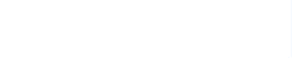

```swift
.transition(AnyTransition.asymmetric(insertion: .slide, removal: .opacity))
```

### 组合过渡效果

AnyTransition 允许开发者将多个过渡效果组合在一起，以实现更复杂的动画效果。这可以通过使用 `.combined(with:)` 方法来实现。例如，通过将透明度变化和滑动过渡效果组合，可以得到更加丰富的动画效果：

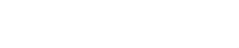

```swift
.transition(AnyTransition.opacity.combined(with: .slide))
```

甚至可以将多个不同的效果叠加，形成更复杂的过渡动画。例如，将非对称的插入滑动效果、移除淡出效果与滑动和缩放效果相结合：

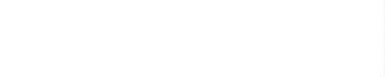

```swift
.transition(AnyTransition.asymmetric(insertion: .slide, removal: .opacity).combined(with: .slide).combined(with: .scale))
```

### 自定义 AnyTransition 过渡效果

AnyTransition 不仅提供了内置的过渡效果，还允许开发者创建自定义的过渡效果。通过实现 `.modifier(active:identity:)` 方法，您可以定义自定义的 `ViewModifier`，并将其封装在 AnyTransition 中。例如，可以实现一个自定义的 `.customSlide` 效果，用法如 (`.transition(AnyTransition.customSlide)`)，来复刻默认的 `.slide` 效果。

如下图所示，"Hello, AnyTransition 1!" 是系统效果，"Hello, AnyTransition 2!" 是自定义效果。


```swift
extension AnyTransition {
    static var customSlide: AnyTransition { // 不带参数的 customSlide
        AnyTransition.asymmetric(insertion: AnyTransition.modifier(
            active: CustomSlideModifier(offset: -UIScreen.main.bounds.width),
            identity: CustomSlideModifier(offset: 0)
        ), removal: AnyTransition.modifier(
            active: CustomSlideModifier(offset: UIScreen.main.bounds.width),
            identity: CustomSlideModifier(offset: 0)
        ))
    }
}

struct CustomSlideModifier: ViewModifier {
    var offset: CGFloat
    func body(content: Content) -> some View {
        content.offset(x: offset)
    }
}
```

由于 AnyTransition 是一个结构体，并且 `customSlide` 不需要参数，所以可以给它定义一个计算属性的扩展。然而，由于我们无法直接获取当前视图的大小，当使用 `UIScreen.main.bounds.width` 来移动时，其效果和默认的 `slide` 有所出入。为了解决这个问题，可以将当前视图的大小传递给 `customSlide`，并扩展一个函数：

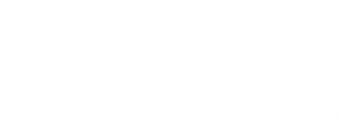

```swift
extension AnyTransition {
    static func customSlide(size: CGSize) -> AnyTransition {
        AnyTransition.asymmetric(insertion: AnyTransition.modifier(
            active: CustomSlideModifier(offset: -size.width),
            identity: CustomSlideModifier(offset: 0)
        ), removal: AnyTransition.modifier(
            active: CustomSlideModifier(offset: size.width),
            identity: CustomSlideModifier(offset: 0)
        ))
    }
}
```

其中，视图大小的获取可以参考 [saveSize][saveSize]。

`.modifier(active:identity:)` 只要求 `active` 和 `identity` 符合 `ViewModifier` 协议，这意味着自定义的过渡效果可以使用 View 上的所有的修饰符。可以说，只有想不到，没有做不到。

## Transition 协议

Transition 协议是 iOS 17+ 中新增的接口，与 AnyTransition 有着相似的功能和用法，但存在以下几方面的区别：

1. **直观的自定义**：Transition 是协议，自定义时需要实现该协议，更符合直觉；而 AnyTransition 是结构体，自定义时需要借助 `.modifier(active:identity:)` 方法。
2. **过渡阶段控制**: Transition 协议开放了 `TransitionPhase`，开发者可以利用该特性知道当前过渡效果所处的阶段 (`identity`, `willAppear`, `didDisappear`)。从而代替了 AnyTransition 的 `.asymmetric` 和 `.modifier` 描述符。
3. **新增过渡效果**: Transition 新增了 `blurReplace` 和 `symbolEffect` 两个过渡效果，进一步丰富了动画的表现力。

同样，使用 Transition 复刻一个带参数的 `.customSlide(size:)` 如下所示：

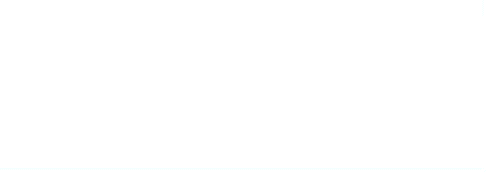

其中，"Hello, Transition 1!" 是系统效果，"Hello, Transition 2!" 是自定义效果。

```swift
extension Transition where Self == CustomSlideTransition {
    static func customSlide(size: CGSize) -> CustomSlideTransition {
        CustomSlideTransition(size: size)
    }
}

struct CustomSlideTransition: Transition {
    let size: CGSize
    public func body(content: Content, phase: TransitionPhase) -> some View {
        let offset: CGFloat = switch phase {
            case .willAppear:
                -size.width
            case .identity:
                0
            case .didDisappear:
                size.width
        }
        content.offset(x: offset)
    }
}
```

自定义的 `CustomSlideTransition` 根据当前的过渡阶段来计算偏移的位置，从而产生预期的动画效果。`TransitionPhase` 还提供了一个名为 `value` 的计算属性，在 `identity` 阶段为 0，在 `willAppear` 阶段为 -1.0，在 `didDisappear` 阶段为 1.0。可以利用 `value` 来简化 `CustomSlideTransition` 如下：

```swift
struct CustomSlideTransition: Transition {
    let size: CGSize
    public func body(content: Content, phase: TransitionPhase) -> some View {
        content.offset(x: phase.value * size.width)
    }
}
```

通过使用 Transition 协议，可以更直接地控制过渡效果，并且编写自定义过渡效果也更加简洁。如果项目支持 iOS 17.0+ 的话，推荐使用 Transitio 来完全替代 AnyTransition。

## 视觉(VisualEffect)过渡效果

在上面自定义的 `customSlide` 中，我们需要调用方提供当前视图的大小。需要使用 `GeometryReader` 来实现一个 [`saveSize` 的描述符][saveSize]，从而获取当前视图的大小，用法如下：

```swift
@State var size: CGSize = .zero
...
Text("Hello, Transition!")
    .saveSize(in: $size)
    .transition(.customSlide(size: size))
```

这样做非常不方便，而且由于 size 默认值为零，在第一帧时，视图会静止在屏幕中轨然不动。SwiftUI 从 iOS 17.0+ 开始提供了 `visualEffect(_:)` 修饰符，这使得开发者可以在获取视图布局信息的同时，向视图添加视觉效果。

接下来我们了解一下功能强大的 `visualEffect(_:)` API，并看看如何使用它来实现自定义的过渡效果。

### `visualEffect(_:)` API

`visualEffect(_:)` API 申明如下：

```swift
func visualEffect(_ effect: @escaping (EmptyVisualEffect, GeometryProxy) -> some VisualEffect) -> some View
```

第一个参数获取当前的视图，第二个参数获取当前视图的几何信息。

`.visualEffect` 中的视图同时拥有当前视图的几何信息和过渡阶段，非常实用。需要注意的是，`visualEffect` 所接受闭包的返回值类型是 `some VisualEffect` 而不是 `some View`。这意味着在 `.visualEffect` 中并不能使用所有 View 上的修饰符。那么，`.visualEffect` 可用的修饰符有哪些呢？

#### visualEffect 上可用的修饰符

在 `visualEffect` 中，可以使用一些特殊的视觉效果修饰符来改变视图的视觉效果，而不改变其父视图或子视图的布局特性。这些修饰符包括：

- 颜色变化：`brightness`, `contrast`, `grayscale`, `hueRotation`, `saturation`，`opacity`
- 仿射变换：`transform`, `offset`, `rotationEffect`, `scaleEffect`
- 高斯模糊：`blur`
- 着色器效果：`colorEffect`, `layerEffect`, `distortionEffect`

你可能已经注意到，这些修饰符在 `View` 上也同样存在。选择使用哪个版本取决于你是否需要当前视图的几何信息。如果需要当前视图的几何信息，请使用 `.visualEffect` 提供的版本。

接下来使用 `.visualEffect` 复刻系统默认的滑动过渡效果。

### 示例：滑动过渡效果

使用 `.visualEffect` 的修饰符可以从 `GeometryProxy` 获取当前视图的大小，从而避免在 `CustomSlideTransition` 中传递大小参数，代码如下：

```swift
struct MyCustomSlideTransition: Transition {
    public func body(content: Content, phase: TransitionPhase) -> some View {
        content.visualEffect { content, geo in
            content.offset(x: phase.value * geo.size.width)
        }
    }
}

extension Transition where Self == MyCustomSlideTransition {
    static var myCustomSlide: MyCustomSlideTransition {
        get {
            MyCustomSlideTransition()
        }
    }
}

Text("Hello, Transition!")
    .transition(.myCustomSlide) // 自定义用法
    // .transition(.slide) // 系统默认用法
```

这样，我们自定义的 `.myCustomSlide` 和系统默认的 `.slide` 用法和效果都一样了。

## 着色器过渡效果

多数视觉效果使用起来简单直观，让我们重点探究一下着色器效果，以及它们如何助力过渡效果。

### 着色器 API

SwiftUI 提供了三个使用 Metal 着色器的修饰符：

- `func colorEffect(_ shader: Shader, isEnabled: Bool = true) -> some View`
- `layerEffectfunc layerEffect(_ shader: Shader, maxSampleOffset: CGSize, isEnabled: Bool = true) -> some View`
- `func distortionEffect(_ shader: Shader, maxSampleOffset: CGSize, isEnabled: Bool = true) -> some View`

注: `.visualEffect` 版本的返回值是 `some VisualEffect`。

它们的第一个参数要求 SwiftUI 创建一个着色器，在 SwiftUI 中，创建着色器是通过 `ShaderLibrary` 调用着色器函数名来实现的。SwiftUI 会为视图的每一个像素调用你的着色器函数。着色器函数是一些直接在设备的 GPU 上计算各种渲染效果的小程序。由于 GPU 针对高并发任务进行了优化，着色器能够高效地处理渲染任务。然而，由于 GPU 编程的特殊性质，着色器不能使用 Swift 编写。而是使用 Metal Shading Language（简称 Metal）编写。在每个着色器修饰符的文档中，你可以找到着色器函数的签名，例如，`colorEffect` 修饰符要求函数的签名如下：

```metal
[[ stitchable ]] half4 name(float2 position, half4 color, args...)
```

SwiftUI 在调用着色器函数时，会传递当前像素的坐标 (float2 position) 和颜色值 (half4 color)，返回经过计算后新的颜色值。后面是一个可变长的参数列表，可以使用 SwiftUI 传递参数给着色器。下面是一个简单的灰度着色器示例：

```cpp
// .metal file
#include <metal_stdlib>
using namespace metal;

[[ stitchable ]] half4 grayColor(float2 position, half4 color) {
    float gray = (color.r + color.g + color.b) / 3;
    return half4(gray, gray, gray, color.a);
}
```

如果懂一些 C/C++ 的话，写这种函数没有任何的难度，也可以阅读参考 [Metal Shading Language Specification][Metal-Shading-Language-Specification]。接着在 SwiftUI 里调用它, 你就能得到一张灰度图：

```swift
Image(.pixelsMeasure)
    .resizable()
    .frame(width: 256, height: 256)
    .padding()
    .colorEffect(
        ShaderLibrary.grayColor() // New
    )
```

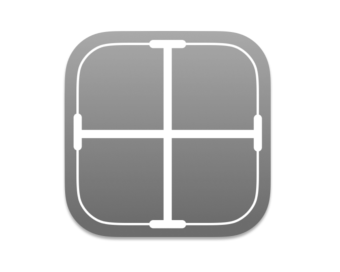

了解完 API以后，接下来一起看看使用着色器实现的过渡效果。

### 示例：透明过渡效果

复刻系统的 API 是学习该 API 的一种有效方式。如果我们能实现一模一样的效果，说明理解的差不多了。当然，如果做完之后能对比一下系统 API 是如何实现的会更有益，但对于闭源的 SwiftUI 来说，目前还无法做到这一点。

实现透明过渡效果，可以选择一个最简单的 `opacity` 着色器。该着色器的 SwiftUI 实现非常直接：

```swift
Image(.pixelsMeasure)
    .resizable()
    .frame(width: 256, height: 256)
    .padding()
    .transition(.myOpacity)

extension Transition where Self == MyOpacityTransition {
    static var myOpacity: MyOpacityTransition {
        MyOpacityTransition()
    }
}

struct MyOpacityTransition: Transition {
    func body(content: Content, phase: TransitionPhase) -> some View {
        content
            .colorEffect(
                ShaderLibrary.myOpacity(
                    .float(phase.value) // Pass value to shader
                )
            )
    }
}
```

唯一不同的是多传递了一个过渡阶段的参数给着色器函数，透明过渡函数的着色器如下：

```cpp
[[ stitchable ]] half4 myOpacity(float2 position, half4 color, float value) {
    float progress = value > 0 ? 1 - value : 1 + value;
    return half4(color.r * progress, color.g * progress, color.b * progress, color.a * progress);
}
```

这时候就得到了一个和系统透明过渡一模一样的效果。

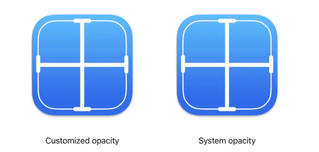

值得一提的是，虽然从 Transition 里获得的 `phase.value` 是 -1， 0， 1 三个值，但实际上，SwiftUI 会对这些值进行插值。因此，对同一个像素点，着色器函数将被多次调用，`phase.value` 在 [-1,1] 区间内连续变化。从 -1 到 0 透明度逐渐降低，从 0 到 1 透明度逐渐升高。然而，透明度的变化实际在 [0,1] 区间内完成，因此需要使用一个转换函数将其映射到该区间。可以使用线性函数、`cos` 函数，或者之前学过的动画过渡函数（参见 [UnitCurve][UnitCurve] 用法）等进行映射。在上述示例中，我们使用了线性转换方法。在编写代码时，转换后的值可以理解为动画的进度，范围在 [0,1] 之间。

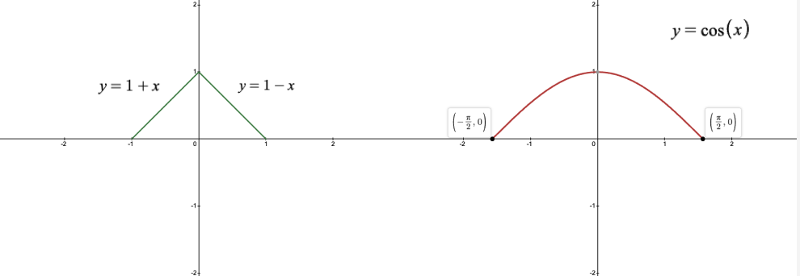

### 示例：马赛克过渡效果

#### 使用 layerEffect 实现马赛克过渡效果

`colorEffect` 是最简单的一种使用着色器函数，它接收当前像素的位置和颜色，返回处理后的颜色值。而 `layerEffect` 接收的参数数是当前像素的位置和整个图层 `SwiftUI::Layer layer`，可以通过 `layer.sample(position)` 获取视图中任意像素点的颜色值，返回处理后的颜色值。可以说 `colorEffect` 是 `layerEffect` 的一个特例。

如果在一个矩形区域内采样第一个点的值，然后将这个值复制给该矩形区域内的所有其它像素，并重复这种步骤，就可以得到一个马赛克效果。

```swift
struct MosaicTransition: Transition {
    func body(content: Content, phase: TransitionPhase) -> some View {
        content.visualEffect { content, proxy in
            return content
                .layerEffect(
                    ShaderLibrary.mosaic(
                        .float(phase.value),
                        .float(32) // 色块大小
                    ),
                    maxSampleOffset: .zero
                )
        }
    }
}
```

```cpp
#include <metal_stdlib>
#include <SwiftUI/SwiftUI_Metal.h>
using namespace metal;

[[ stitchable ]] half4 mosaic(float2 position, SwiftUI::Layer layer, float value, float tileSize) {
    float progress = 1 - cos(value * 3.1415926 / 2);
    float tile = max(progress * tileSize, 0.000001);
    if (progress * tileSize < 0.00000001) {
        return layer.sample(position);
    }
    return layer.sample(round(position / tile) * tile);
}
```

随着动画的进行，tile 会变得越来越大，马赛克效果也会越来越明显。而矩形的大小（tileSize），则采取实验的方法获取，来获得最满意的过渡效果。

#### 使用 distortionEffect 实现马赛克过渡效果

`.distortionEffect` 也是一个很简单的着色器函数，它接收当前像素的位置，要求通过转换后返回新的位置，而 SwiftUi 会获取这个位置的颜色值。对于上例中的马赛克效果，使用 `.distortionEffect` 实现如下所示：

```cpp
[[ stitchable ]] float2 mosaic2(float2 position, float value, float tileSize) {
    float progress = 1 - cos(value * 3.1415926 / 2);
    float tile = max(progress * tileSize, 0.000001);
    if (progress * tileSize < 0.00000001) {
        return position; // Different with layerEffect
    }
    return round(position / tile) * tile; // Different with layerEffects
}
```

两种做法所实现的效果都是一样的，`.distortionEffect` 与 `.layerEffect` 的区别是，`.distortionEffect` 直接返回了位置坐标，而不是层的采样。

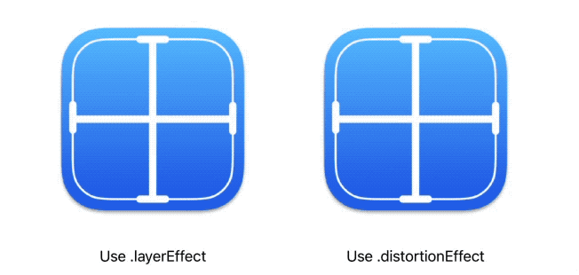


着色器函数简单直接高效，用好着色器，你将能够解锁 GPU 性能，并编写自己的令人印象深刻的过渡效果。

## 颜色过渡效果

合理地利用颜色，可以实现基于颜色 API 的过渡效果。实际上，`.opacity` 也是颜色过渡的一种表现形式，它通过调整透明度来产生过渡效果。iOS 18.0 新引入了一种网格渐变工具 MeshGradient，可以实现基于颜色的过渡效果。MeshGradient 通过设置网格的关键点和对应颜色，能够实现丰富的渐变效果。接下来，我们探讨如何将这种网格渐变工具应用于过渡效果中：

### MeshGradient API

网格渐变近来特别流行，MeshGradient 可以设定网格的个数，关键点位置，和颜色，如下所示：

```swift
MeshGradient(width: 3, height: 3, points: [
    .init(0, 0), .init(0.5, 0), .init(1, 0),
    .init(0, 0.5), .init(0.5, 0.5), .init(1, 0.5),
    .init(0, 1), .init(0.5, 1), .init(1, 1)
], colors: [
    .red, .purple, .indigo,
    .orange, .white, .blue,
    .yellow, .green, .mint
])
```

### 示例：渐变过渡效果

通过 `value` 算出当前过渡的进度，再通过进度控制 MeshGradient 的关键点位置，来实现过渡效果，如下所示：

```swift
struct MeshColorTransition: Transition {
    func body(content: Content, phase: TransitionPhase) -> some View {
        let progress: Float = Float(abs(phase.value) / 2.0)

        return content
            .foregroundStyle(
                MeshGradient(
                    width: 4,
                    height: 3,
                    points: [
                        [0.0, 0.0], [0.5 - progress, 0.0], [0.5 + progress, 0.0], [1.0, 0.0],
                        [0.0, 0.5], [0.5 - progress, 0.5], [0.5 + progress, 0.5], [1.0, 0.5],
                        [0.0, 1.0], [0.5 - progress, 1.0], [0.5 + progress, 1.0], [1.0, 1.0]
                    ],
                    colors: [
                        .red, .white, .white, .blue,
                        .red, .white, .white, .blue,
                        .red, .white, .white, .blue
                    ]
                )
            )
    }
}
```

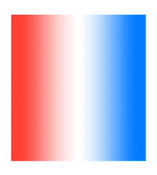

通常来说，实现过渡效果需要不断的调试，以达到预期的效果，使用 Swift Preview 是一个很好的选择。如下所示，通过改变 value 的值，来动态调整 points 的位置，最终达到满意的效果。

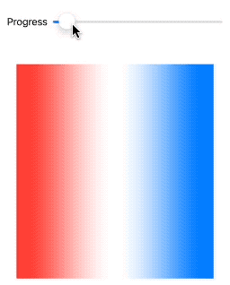

## 文字过渡效果

iOS 18.0 引入了 `TextRenderer` 协议，这是一个功能强大的新协议，允许开发者替换默认的文本绘制方式，实现更多自定义效果。虽然它功能非常强大，但最令我感兴趣的是如何使用它来实现过渡效果。

### TextRenderer API

TextRenderer 协议的核心是 `.draw(layout:in:)` 方法。它的参数类型分别是 `Text.Layout` 和 `GraphicsContext`。

`Text.Layout` 允许我们访问文本的各个组成部分，包括行 (`Line`)、连续单元（`Run`）和最小单元 (`RunSlice`)。最小单元通常指字、字符和图片等。具有相同类型和属性的最小单元连在一起构成一个连续单元 (`Run`)。例如：

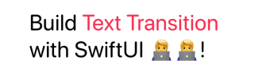

```
第一行："Build Text Transition " // 注意末尾有一个空格
一共三个 Run: "Build ", "Text Transition", " "

第二行："with SwiftUI 🧑‍💻🧑‍💻!"
一共三个 Run: "with SwiftUI ", "🧑‍💻🧑‍💻", "!"
```

可以使用以下帮助函数获取文本中的 `Run` 和 `RunSlice`。

```swift
extension Text.Layout {
    /// A helper function for easier access to all runs in a layout.
    var flattenedRuns: some RandomAccessCollection<Text.Layout.Run> {
        self.flatMap { line in
            line
        }
    }

    /// A helper function for easier access to all run slices in a layout.
    var flattenedRunSlices: some RandomAccessCollection<Text.Layout.RunSlice> {
        flattenedRuns.flatMap(\.self)
    }
}
```

通过 `layout` 获取最小的绘制内容，然后在使用第二个参数 `GraphicsContext` 来绘制它。`GraphicsContext` 与 `Canvas` 中的 `GraphicsContext` 相同。在完成自定义的 TextRenderer 后，调用 `.textRenderer` 方法来使用它。

接下来，我们实现一个打字过渡效果。

### 示例：打字过渡效果

首先自定义一个带打字效果的过渡：

```swift
struct TextKeyboardTransition: Transition {
    func body(content: Content, phase: TransitionPhase) -> some View {
        content.textRenderer(KeyboardEffectRenderer(value: phase.value))
    }
}
```

并将其应用到文本上：

```swift
VStack {
    if toggle {
        let visualEffects = Text("Text Transition")
            .foregroundStyle(.pink)

        Text("Build \(visualEffects) with SwiftUI 🧑‍💻🧑‍💻!")
            .font(.system(.title, design: .rounded, weight: .regular))
            .frame(width: 250)
            .transition(TextKeyboardTransition())
    }
}
.animation(.linear(duration: 1.0), value: toggle)
```

接着，我们来实现 `KeyboardEffectRenderer`, 这里，我们同样使用过渡值来计算当前过渡的进度 `progress`(在 [0,1]之间), 再通过比例计算当前光标的位置 `currentIndex`，仅绘制光标左侧的字符。由于打字效果每次出现一个字，所以使用 `flattenedRunSlices` 获取最小单元，最后将光标绘制出来。如下所示：

```swift
struct KeyboardEffectRenderer: TextRenderer {
    var value: Double

    init(value: Double) {
        self.value = value
    }

    func draw(layout: Text.Layout, in context: inout GraphicsContext) {
        let progress: Double = value > 0 ? 1 - value : 1 + value
        let count = layout.flattenedRunSlices.count
        let currentIndex: Int = Int(round(progress * Double(count)))

        let cursor = Text("|")
            .foregroundStyle(.green)
            .font(.system(.title, design: .rounded, weight: .semibold))

        for (index, slice) in layout.flattenedRunSlices.enumerated() {
            // Make a copy of the context so that individual slices
            // don't affect each other.
            var copy = context
            if index < currentIndex {
                copy.draw(slice)
            } else {
                // Draw cursor
                copy.draw(cursor, in: slice.typographicBounds.rect)
                break;
            }
        }
    }
}
```

当开关 `toggle` 时，你会发现期待的过渡效果并没有如期而至。这是因为 `KeyboardEffectRenderer` 不是可动画属性，它不知道要随着 SwiftUI 插值而重绘，需要给它实现 `Animatable` 协议来解决该问题：

```swift
extension KeyboardEffectRenderer: Animatable {
    var animatableData: Double {
        get { value }
        set { value = newValue }
    }
}
```


另外，文本还支持添加自定义属性，并在自定义的 TextRenderer 中检查该属性是否存在，来绘制更复杂的效果，比如，想通过阴影来进一步强调 `Text Transition`, 效果如下：

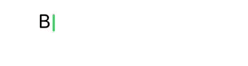

## 滚动过渡效果

在移动设备中，滚动视图经常用于展示大量内容。近两年，SwiftUI 推出了一系列新的滚动相关的 API，极大地扩展了滚动视图的自定义能力。这里主要介绍一个与过渡有关的 API。

### `.scrollTransition(_:axis:transition:)` API

`.scrollTransition` 的第二个参数指定滚动轴，第三个参数有着与 Transition 协议一样的签名，通过获取当前的过渡阶段来应用过渡效果。

与之前的例子不同，随着滑动，当前视图会出现在或消失于滚动视图的可视区域。因此，不需要使用 `toggle` 和 `.animation` 来启动过渡效果。

### 示例: 视差过渡效果

下面是使用 `.scrollTransition` 实现的一个横向滚动的视差效果，当卡片向左划出屏幕时，内容向右偏移，当卡片向右划出屏幕时，内容向左偏移。这样就形成了一个视差效果，每张卡片看起来像一个窗口，你可以透过窗口看到外面的景象。

```swift
ScrollView(.horizontal) {
    LazyHStack(spacing: 16) {
        ForEach(photos) { photo in
            VStack {
                ZStack {
                    Card(photo)
                        .scrollTransition(axis: .horizontal) { content, phase in
                            content
                                .offset(x: phase.isIdentity ? 0 : phase.value * -200)
                        }
                }
                .containerRelativeFrame(.horizontal)
                .clipShape(RoundedRectangle(cornerRadius: 36))
            }
        }
    }
}
.contentMargins(32)
.scrollTargetBehavior(.paging)
```


值得注意的是，`.scrollTransition` 仅对正在进入可视区域或从可视区域消失的元素有效。如果可视区域中间有多个元素，它们不会被调用。因此，`.scrollTransition` 通常用于处理边界的元素。例如，您可以实现一个滚动的小球效果。

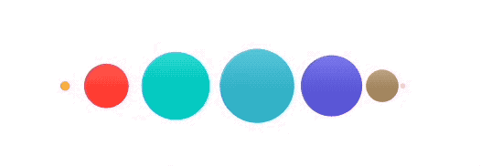

## 导航过渡效果

SwiftUI 可以使用 `.transaction` 来修改默认导航的动画效果，参考[SwiftUI 动画篇][SwiftUI_Animation]，配合 `matchedGeometryEffect(id:in：)` 能实现类似 App Store 的缩放过渡效果。而 WWDC24 新提供了 `NavigationTransition` 协议，其中 zoom 方法能很轻易地实现类似的效果。

### .zoom(sourceID:in:)

`.zoom` 指定源视图的 id 和名字空间，使用 `.matchedTransitionSource(id:namespace:)` 定义源视图。

### 示例: 缩放过渡效果

```swift
NavigationLink {
    PhotoCardDetail(photo: photo)
        .navigationBarBackButtonHidden()
        .navigationTransition(
            .zoom(sourceID: photo.id, in: namespace)
        )
} label: {
    PhotoCard(photo: photo)
}
.matchedTransitionSource(id: photo.id, in: namespace)
```

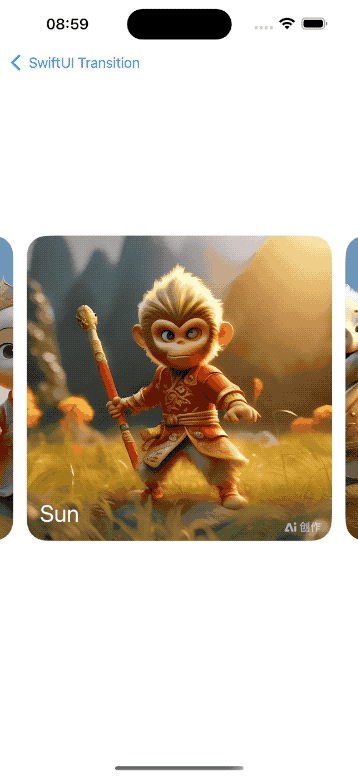

## 总结

本文深入探讨了 SwiftUI 中实现过渡效果的多种方法，从基础的 AnyTransition 和 Transition 开始，到高级的自定义效果。通过详细解读视觉过渡、着色器过渡、颜色过渡、文字过渡、滚动过渡和导航过渡等多种类型的过渡效果，并结合实际示例展示了每种效果的实现过程和应用场景。笔者相信还有诸多功能强大的 API，比如 Geometry、Shape、Canvas 等也可用于制作精美的过渡效果，动手做起来吧。

希望通过本文的介绍和示例，你能掌握 SwiftUI 过渡效果的实现技巧，提升界面交互的视觉美感和用户体验，为应用增添更多动感和趣味。

## 参考资料

- [WWDC24 10151][10151]
- [WWDC24 10145][10145]
- [SwiftUI 动画篇][SwiftUI_Animation]
- [Advanced SwiftUI Transitions][Advanced-Transitions]

[10151]: https://developer.apple.com/wwdc24/10151
[10145]: https://developer.apple.com/wwdc24/10145
[SwiftUI_Animation]: https://github.com/SwiftOldDriver/WWDC23/blob/main/sessions/session_10156/README.md
[saveSize]: https://stackoverflow.com/questions/57577462/get-width-of-a-view-using-in-swiftui
[Metal-Shading-Language-Specification]: https://developer.apple.com/metal/Metal-Shading-Language-Specification.pdf
[UnitCurve]: https://developer.apple.com/documentation/swiftui/unitcurve
[Advanced-Transitions]: https://swiftui-lab.com/advanced-transitions/
