# WWDC 10162 - 多次拍摄保持色彩一致

摘要：色彩一致性是人类视觉感知的一个特性，看苹果如何软硬件结合，在拍摄上重现该“生理”特性。

本文基于 [Session 10162](https://developer.apple.com/videos/play/wwdc2024/10162/) 梳理。

---

大家都知道使用 iPhone 拍摄还原度都很高，光线、场景中的人和物体的颜色和纹理都能很好地保留和呈现，拍出身临其境的效果。

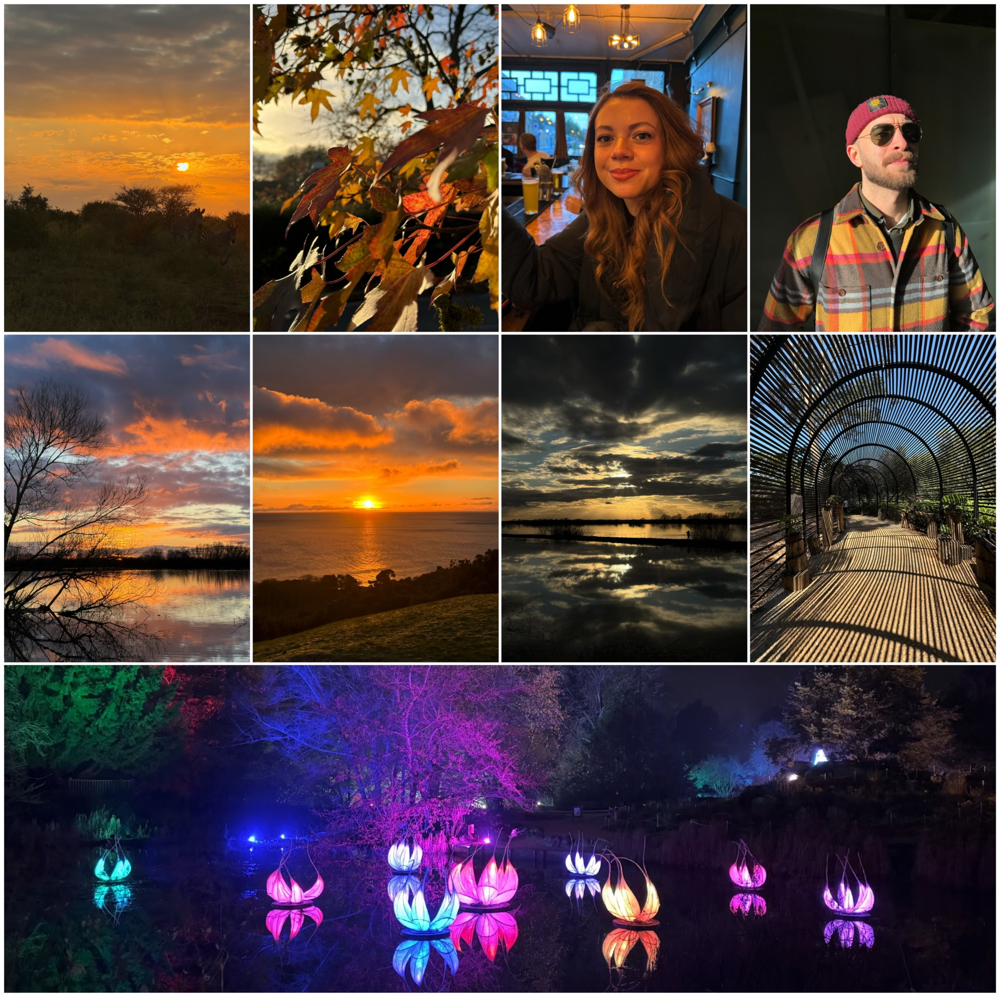

这组照片中我们可以感受到光影在摄影作品中的给大家带来的氛围与情绪，也是 iPhone 摄影的精髓之一。环境光是摄影创作的重要因素之一，但有时候环境光的效果并不是我们想要的，甚至会分散我们的注意力。

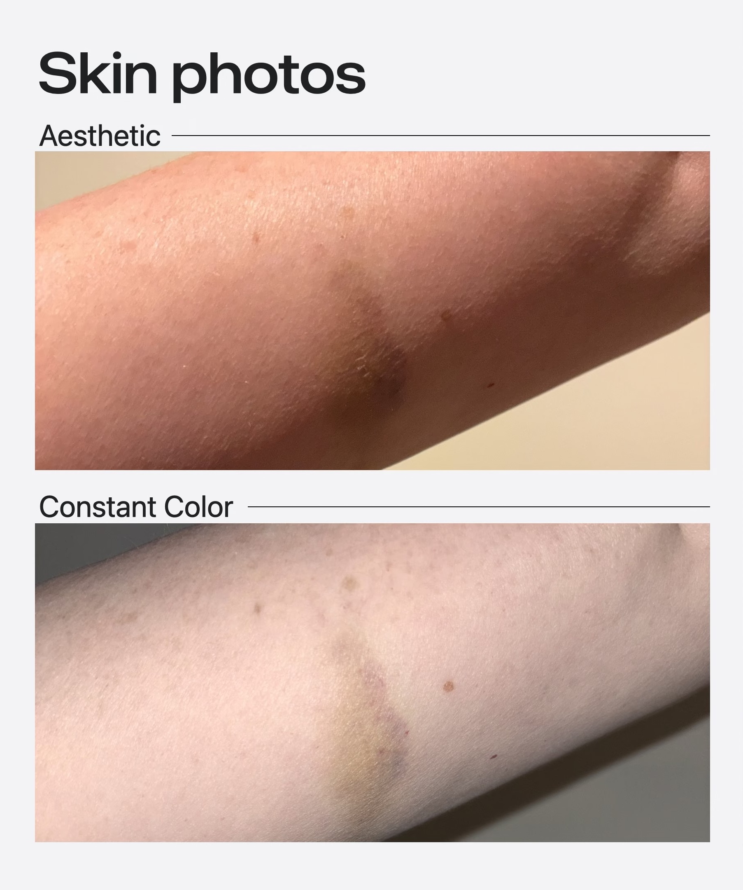

例如你可能想记录皮肤伤口的愈合情况，但不希望环境光影响拍摄成像的颜色，更希望是拍摄出恒定色彩（Constant Color）的图像。

## 色彩一致性

- 色彩一致性是人类视觉感知系统的一种特性。
- 人们对色彩的印象在不同光线下看起来都是一致的。
- 青苹果总是呈现出鲜绿色。
- 人们会自然地适应不断变化的环境光。
- 色彩一致性旨在即使对于新场景也能复制这种行为。

[色彩一致性（color constancy）](https://en.wikipedia.org/wiki/Color_constancy)是人类视觉感知的一个特性，人们能够确保观察的物体在不同光照条件下都是一致的。如果你已知一个物体的颜色，你几乎可以不受环境光的影响辨别物体的颜色。例如一个青苹果我们无论在正午阳光下观察还是在暖色的篝火下观察，对我们来说都是绿色的。这是因为，人类会自动适应周围的光照环境，对环境光的干扰（cast）进行校正。人们大脑能够识别并记住以前见过物体及其颜色。恒定色彩（Constant Color）功能以另一种思路提供了一种全新的拍摄模式，其能够直接确定物体、人和材质的颜色，而且还不用像人脑记住以前的拍摄效果并识别出来。

这里突出了一个该功能的指标：可复制性，即能应对不同的照明条件保持一致的效果。

色彩一致性的应用场景有许多，文本只展开介绍两个场景：产品营销照片和皮肤照片。

### 营销照片

在为产品拍摄营销照片时，就非常注重色彩一致性。尤其是当消费者在现实中购买未见过的产品时，我们更需要照片可以更真实地还原产品原本的颜色。我们在网上购物时经常会看到两种类型的照片：一种是买家秀，消费者分享产品的实际体验，iPhone 相机的常规模式和人像模式就能很轻松地驾驭，拍出想要的效果。另一种是卖家的产品介绍，这类照片是用于帮助消费者清晰了解产品的属性，如尺寸、颜色，便于做出购买决策。恒定色彩可以帮助消费者更好地理解颜色，这样的照片色彩具有一致的照明条件，并适用于用户手机、平板和电脑屏幕，消费者可以不用考虑观看条件下理解产品颜色，也确保产品到手后与预期的一致。

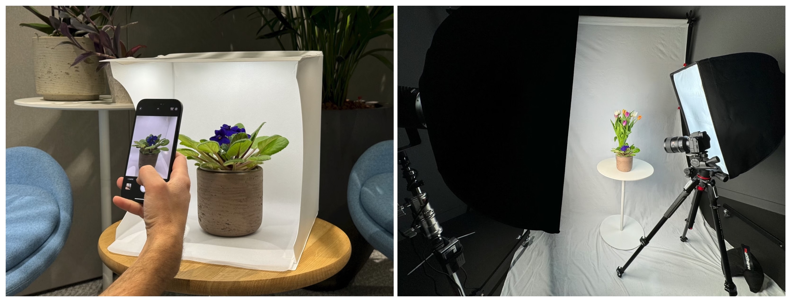

大企业和专业产品摄影师会在专业工作室拍摄这些照片，通常需要多个笨重的照明设备、摄影幕布和专业的数码相机。小公司和家庭创作者则可能需要一个灯箱，用来控制拍摄产品的照明。如今，有了人像模式（Portrait Mode）和新的恒定色彩（Constant Color）API，一个 iPhone 已经可以打包整个摄影工作室了。下面来实际看一个例子。

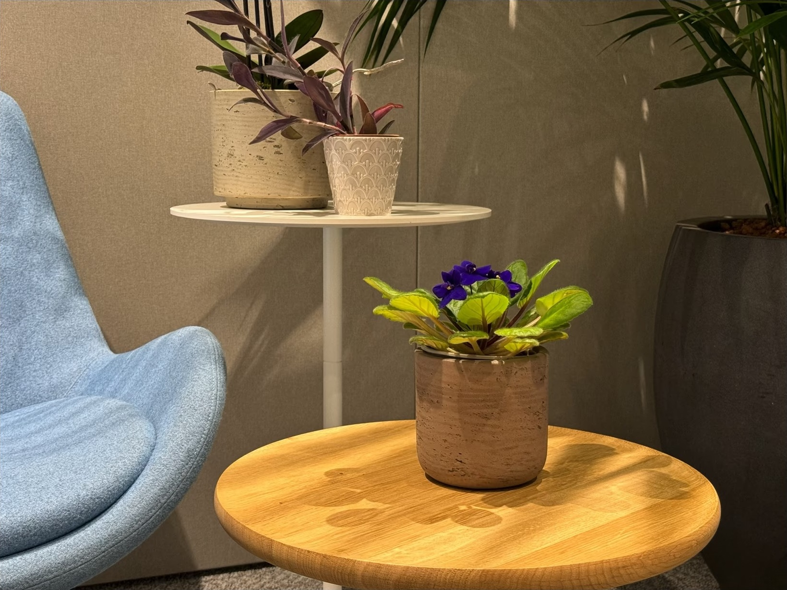

这里有一盆紫罗兰。如你所见，这只是一个普通房间，只有暖白色的室内照明，没有特殊的照明设备。

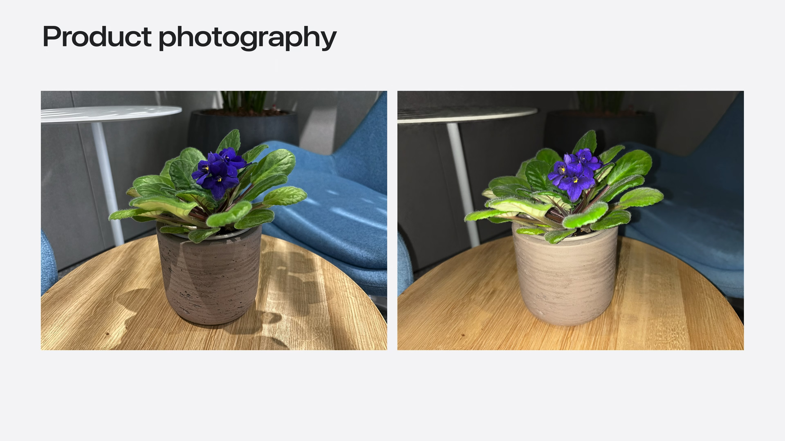

左边是一张普通 iPhone15 的照片。右边是恒定色彩照片，它整个图像光线更中性（neutral cast）、色调更匀称。

进一步地，直接在场景中添加强烈彩色光，分别给室内照明上添加红色、绿色和蓝色的饱和色光照，重新拍摄一组照片。

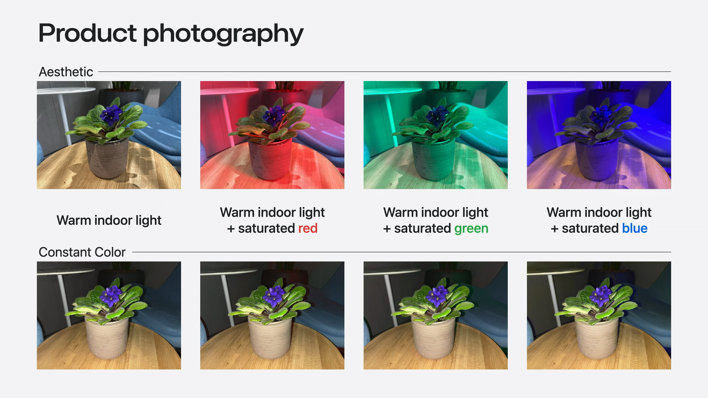

在艺术化照片管线下，可以看到环境光对盆栽的印染（cast），这是常规拍摄模式所期望和想要的效果。而恒定色彩照片管线下，图像则在不同的环境光下都获得了一致的效果。可见，即使在这样极端色彩光照条件下，恒定色彩也能纠正环境光的染色影响。

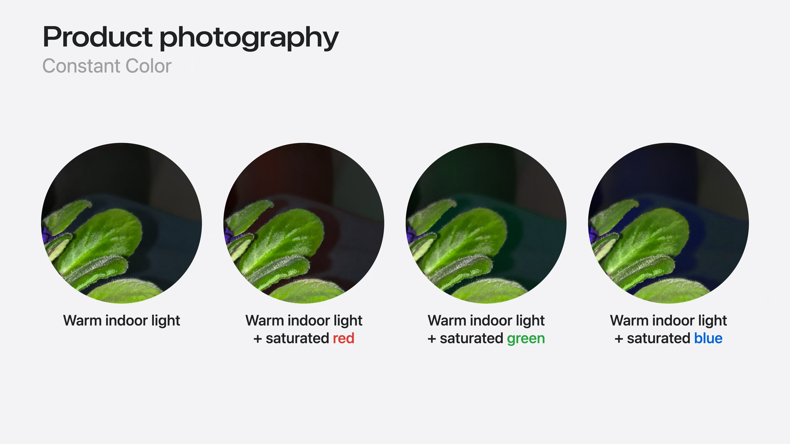

可能你会怀疑效果的真实性，不像是实拍效果。我们可以放大观察叶子阴影的颜色，发现其没有完全校正，还是保留了环境光的色彩。文章后面将展开介绍其中的原因。

### 皮肤照片

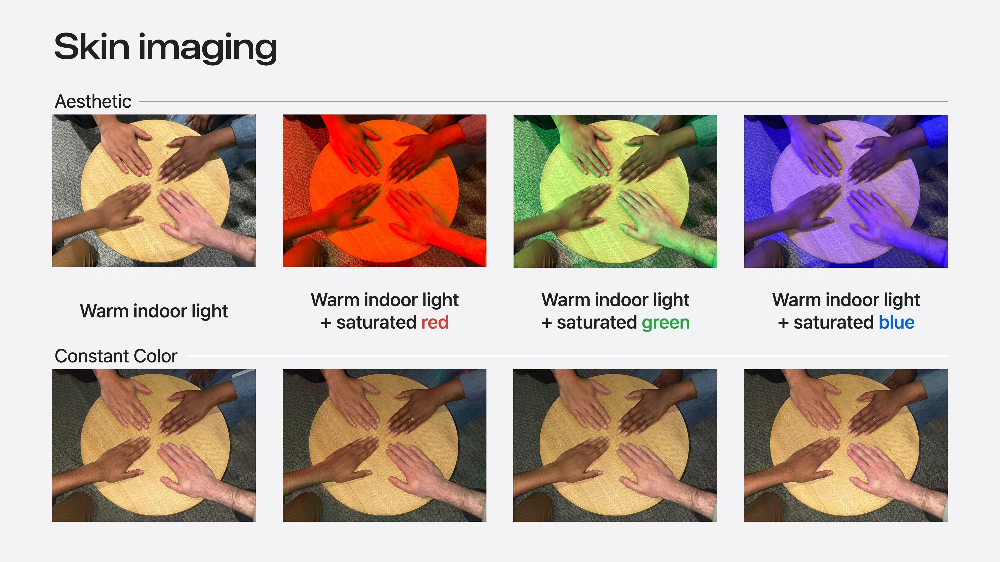

当然，恒定色彩对肤色的拍摄，色彩的还原也是非常准确。颜色一致在不同环境光下，肤色都显得更加一致。恒定色彩非常适合于记录皮肤的变化过程。

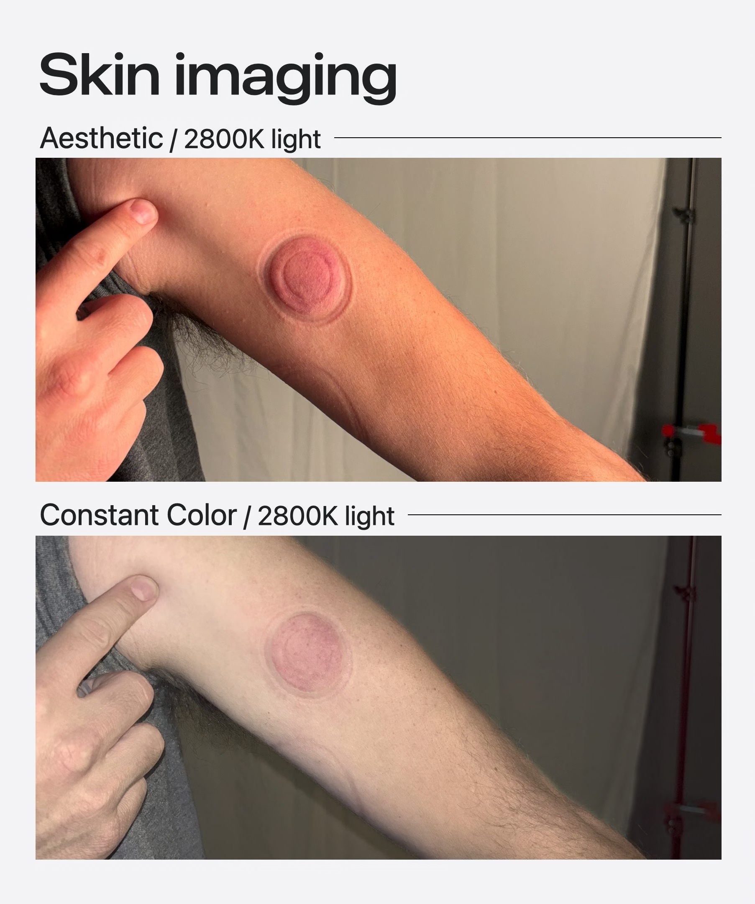

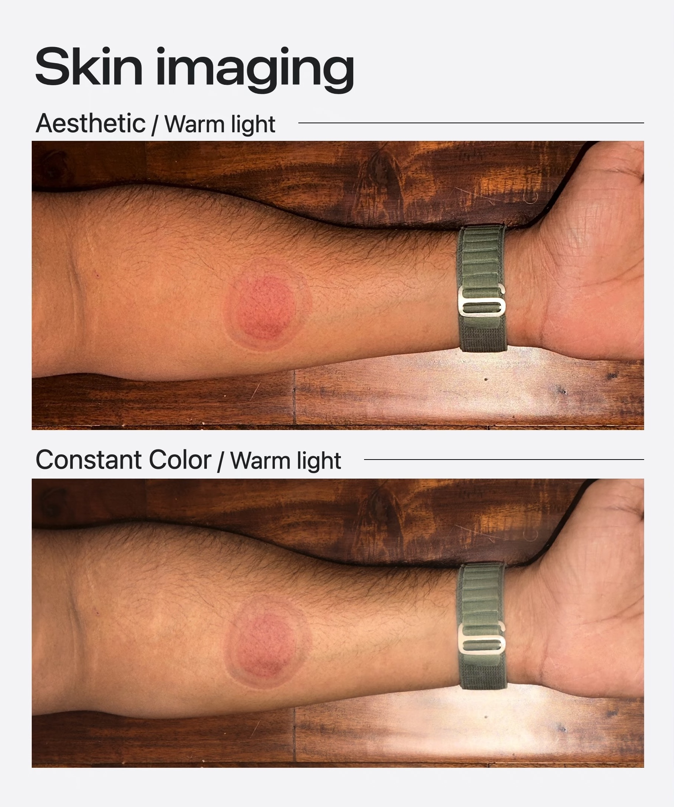

如果你想知道淤伤是在开始消退还是变暗，使用恒定色彩拍摄可能更加合适。如上面例子看到的，2800K 非常暖的室内光线下，普通照片中拔罐痕迹显得非常严重，这对于较深肤色的尤其明显，而恒定色彩照片则表现得比较稳定。

## 恒定色彩图像生成原理

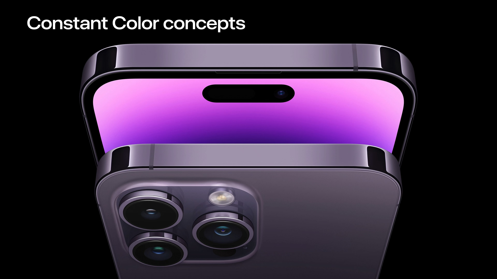

恒定色彩 API 使用了 iPhone14 系列中首次推出的增强型闪光灯，其对闪光灯属性有精确的量化。iPhone 闪光灯每个特性在出厂前都会进行校准，相机也是如此，这确保了设备始终有一份兜底设备状态详细信息。

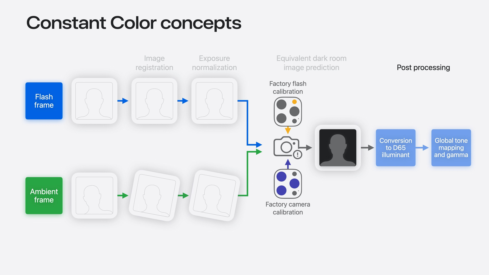

在一个完全黑暗的房间里，闪光灯将是照片中的唯一光源。这种情况下进行拍摄，已知相机和光源的参数信息，因此可以准确确定照片中物体和材质的颜色。

在非暗室环境中拍摄，API 分析闪光灯开启后提升的亮度，来预测等效的暗室图像。API 通过快速连续拍摄闪光灯开启和关闭的图像来尽可能地缩小场景和照明条件的变化。

然后无闪光灯（ambient）图像配准（registered）到闪光灯图像，来减轻运动模糊并确保两个图像中的对应区域有相同的内容。

然后在线性场景参考域，两个图像相对曝光归一化，来比较两帧间的差异。

接下来，使用摄影计算和机器学习，两张图像与闪光灯和相机的校准数据（precision factory calibration）一起被联合处理，输出对等效暗室图像的预测。

最后，暗室图像被渲染，如同被标准 D65 光源照射效果，然后通过接收全局色调映射和 2.2 伽马矫正输出照片。为了保留整个视野中材质亮度的细微变化，这里不应使用局部色调映射。

## API 使用

恒定色彩 API 使用大致分为以下几个操作。

1. 检查设备是否支持恒定色彩 API。
2. 管线必须配置为预期潜在的恒定色彩请求（expect potential Constant Color requests）。
3. 配置 AVCapturePhotoSettings 属性，触发恒定色彩拍摄。
4. 获取和使用置信度信息。API 提供了两种机制来确定恒定色彩图像的哪些部分具有准确率高的色彩，哪些部分可能在颜色渲染中存在更多偏差：二维置信度映射图（confidence map）、单个中心加权置信值。
5. 兜底帧可选项，是常规拍摄效果的图像，用于当你不想使用恒定色彩图像时，展示回滚兜底效果。

### 基础配置

通过检查 AVCapturePhotoOutput 的 `isConstantColorSupported` 属性可以确定设备是否支持恒定色彩 API。但当切换相机或格式，该属性值都可能会不一样。就目前的设备，目前 API 支持 iPhone14 系列、iPhone15 系列和 2024 款 iPad Pro。这里通过判断设备是否支持 API 来开启恒定色彩功能，注意，更改 `isConstantColorEnabled` 会触发渲染管道的耗时配置，因此尽可能地确保只在初始时和值变更时进行配置。若不配置 `isConstantColorEnabled` 属性，渲染管道默认拍摄常规照片。

```Swift
/// captureSession.beginConfiguration()

let photoOutput = AVCapturePhotoOutput()
captureSession.sessionPreset = .photo
captureSession.addOutput(photoOutput)

// Enable constant color on the photo output.
photoOutput.isConstantColorEnabled = photoOutput.isConstantColorSupported

/// captureSession.commitConfiguration()
```

检查设备是否支持恒定色彩后，下一步是配置 AVCapture pipeline 来提供恒定色彩图像。由于恒定色彩需要预闪光灯序列（pre flash sequence），所以需要设置拍摄会话为仅照片模式（`captureSession.sessionPreset = .photo`）。设备类型则需要 `builtInWideAngleCamera` 或 `builtInDualWideCamera`。

```Swift
// The discovery sessions to find the front and back cameras.
private var allCaptureDevices: [AVCaptureDevice] {
    AVCaptureDevice.DiscoverySession(deviceTypes: [.builtInWideAngleCamera, .builtInDualWideCamera], mediaType: .video, position: .back).devices
}

/// captureSession.beginConfiguration()

let captureDevice = captureDevice
let deviceInput = try? AVCaptureDeviceInput(device: captureDevice)
captureSession.addInput(deviceInput)

/// captureSession.commitConfiguration()
```

由于恒定色彩需要使用闪光灯，因此需要设置 AVCaptureFlashMode 为 `auto` 或 `on`，否则当请求恒定色彩图像时将导致异常。

使用恒定色彩 API 也无法拍摄 RAW 图像，因此必须将 `rawPhotoPixelFormatType` 设为 0。恒定色彩 API 是一种可重复的拍摄模式，因此也不支持配置不同的品质（quality），对于所有品质优先级设置，它都具有相同的运行时和输出。

具体完整代码可参考：[Capturing consistent color images](https://developer.apple.com/documentation/avfoundation/photo_capture/capturing_consistent_color_images)。

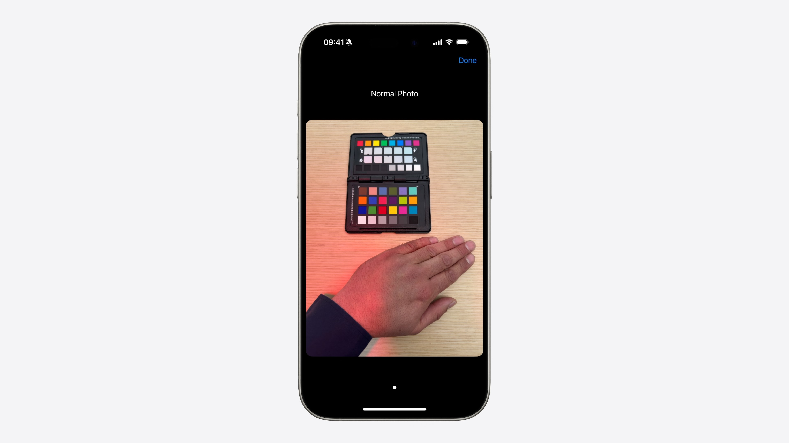

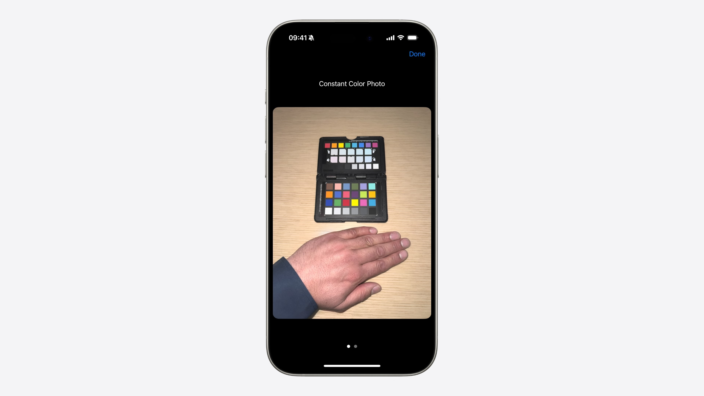

上图是关闭恒定色彩的拍摄结果，能够看到在多个光源照射下手部和色盘的颜色有着微妙的变化；下图是开启恒定色彩的拍摄结果，可见手部肤色是色调均匀的，色盘色泽也都是中性的。其实恒定色彩并不需要色盘参与也能准确运行，甚至都不需要放置任何参考材质。

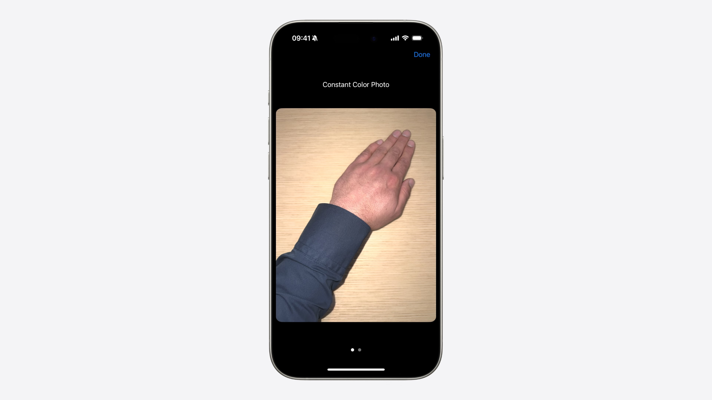

### 置信度

恒定色彩功能使用闪光灯，具体来说，它判断闪光灯让场景变亮了多少，然后分析亮度增加了多少。

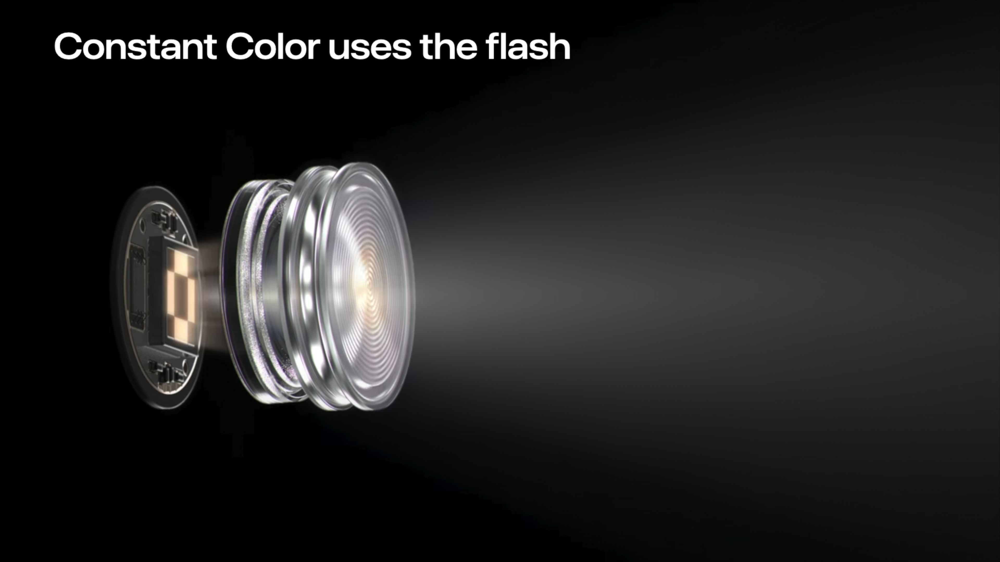

iPhone 闪光灯经过精心优化，来平衡输出功率、物理尺寸和耗电情况。这意味着在某些拍摄环境下，闪光灯可能不够用，无法充分照亮场景让恒定色彩 API 分析差异。当遇到这种情况时，API 产生的恒定色彩性可能会降低，色彩还原程度可能受到影响。闪光灯不够亮的场景可能包括风景拍摄、天文摄影或在阳光下逆光拍摄。恒定色彩 API 提供了检测渲染颜色何时可能不太准确的工具──置信度。

对于每张恒定色彩照片，API 分析图像的每个部分，来查看闪光灯的亮度增加是否具有足够的信噪比，以及是否存在任何反射削减（clipping）。这个过程会创建一个置信度映射图（confidence map），该贴图作为第二个 CVPixelBuffer 输出提供。

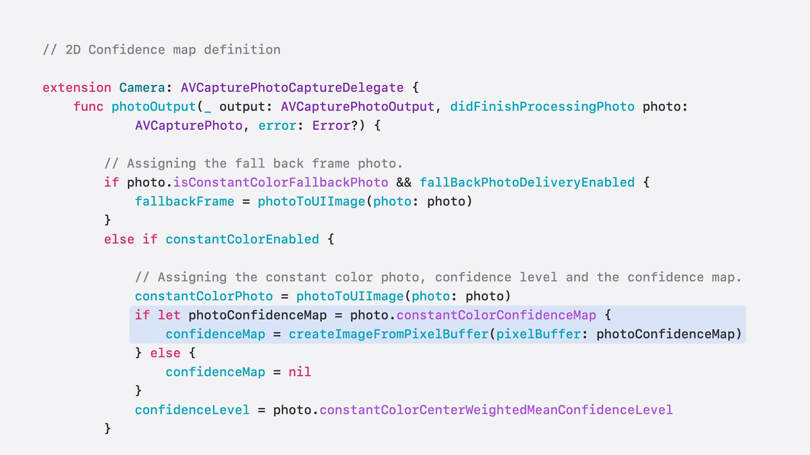

App 可以分析该贴图来确定图像中感兴趣区域是否具有较高置信度。置信度映射图是浮点的二维贴图，范围是 0 到 1，代表原图中相应位置的置信度值。`constantColorConfidenceMap` 中的值 1 表示图像中该像素点的准确度的完全置信，反之值为 0，表示不置信。如果需要确定你所使用场景的置信阈值，可以从 0.8 到 0.9 开始，不断逼近。

置信度映射图提供了最详细的信息，用于确定兴趣区域是否具有准确的颜色。但有时候我们只需要单个置信度值，而不是 2D 贴图，为此，API 也提供了置信度映射图的汇总信息。

当感兴趣区域不确定时，可以使用 `constantColorCenterWeightedMeanConfidenceLevel` 属性值，或者作为指示性指标来确定是否应该对置信度映射图进行更详细的分析。这是一个加权平均值，其中中心像素贡献更多，因为中心是人们更倾向于对拍摄主体构图的地方。除此之外，当然还可以直接使用映射图来计算，将置信度映射图图 reduce 到单个值。

### 兜底帧

如果拍摄的置信度不符合预期的阈值时，可以重新拍摄，或着也可以使用可选的兜底（fall back）照片，即常规拍摄照片。通过设置 AVCapturePhotoSettings 的 `isConstantColorFallbackPhotoDeliveryEnabled` 来开启。

选择接收兜底帧，会让 `didFinishProcessingPhoto` 代理方法回调两次。我们可以通过检查 `isConstantColorFallbackPhoto` 属性来判断当前回调的图片是兜底的常规照片还是恒定色彩照片。

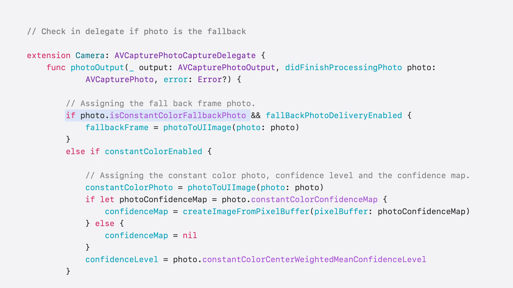

### 置信度映射图实践

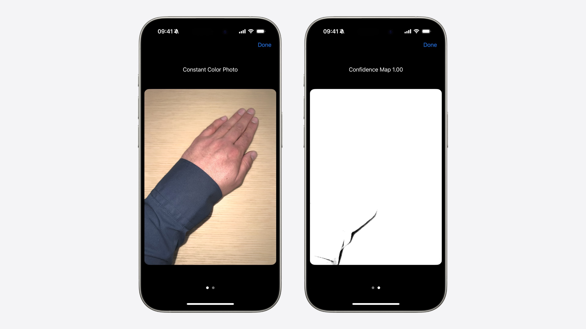

首先把手放在桌面上重复之前的恒定色彩拍摄。可以得到跟之前相似的结果，滑动到置信度映射图，看到图几乎是白色的，所以这个场景画面几乎所有部分都是置信的。由于闪光灯和相机之间的基线，手投下了一些轻微的阴影。

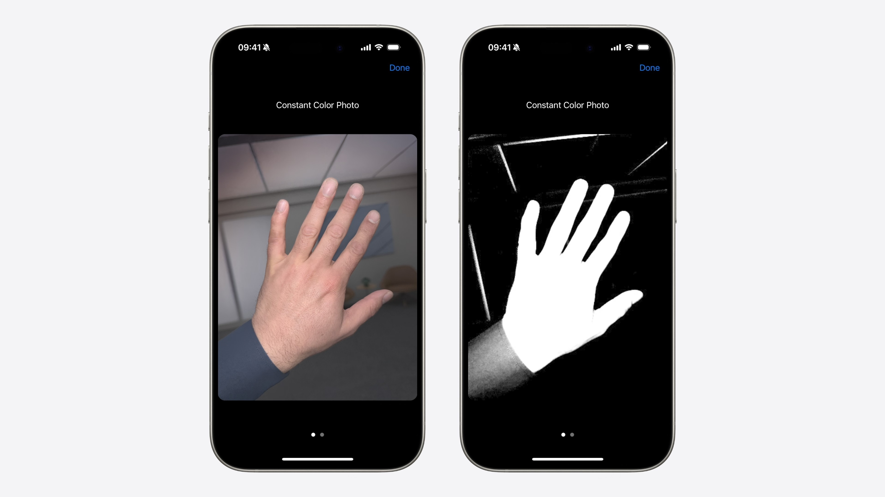

若把背景放远一些，闪光灯只照亮了前景的手，而背景没有被照亮。前景手的肤色看起来仍然是一致的，置信度映射图也如预期一样，手的置信度高，但背景置信度低。

置信度映射图可以用来确定对你重要的部分是否具有准确的颜色。

即使背景中置信度很低，整个图像仍然具有不错的渲染效果，没有奇怪的颜色或过多的噪声。这是因为 API 在计算亮度差之前使用闪光灯的出厂信息来填补了空白。因此，即使恒定色彩输出的某些区域置信度很低，整个图像还是能呈现所有区域。

### 拍摄反光物体

假设拍摄时由闪光灯造成一些高光反射会是什么效果呢？

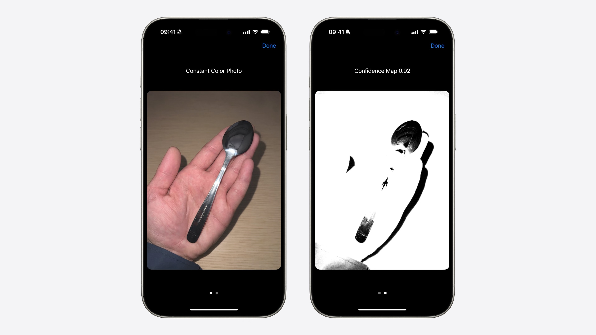

在恒定色彩图像中，可以清楚看到勺子出现了强烈的反光，这些反光正是由于闪光灯造成的。在反光的区域，API 无法准确测算出亮度差异，因为闪光灯亮度被分散（scattered），像素值被削减（clipped）。切换到置信度映射图就能看得更明显。反射引起了置信度降低，散射和削减阻止了亮度的增加。

## 验证测试

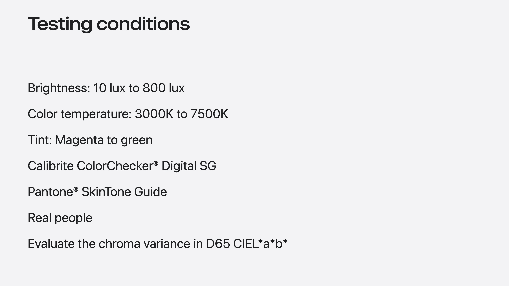

到目前为止，你可能还了解恒定色彩 API 图像的色彩是否真的准确。API 经过了苹果官方全面地测试，基本覆盖了常用的使用场景。

光照环境方面，苹果官方在 10 Lux 到 800 Lux 的一系列室内照明场景下测试该 API。这相当于从一个全黑的房间到像手术室那样光照环境。在每个 Lux 级别，选择色温从暖色的 3000K 到冷色的 7500K 不等切换不同的照明条件。在每个亮度和 Lux 级别，测试了跨轨（locus）的浮游（Plankian）白点、洋红到绿色调的各种标准色卡。

然后是拍摄主体。对于每种照明条件，拍摄一张包含高饱和色、中性色、树叶和肤色的 Calibrite ColorChecker 图像。另外还拍摄了 Pantone SkinTone Guide，其中包含 138 种肤色，涵盖了广泛的反照率（albedo）和底色（undertone）。当然拍摄主体也包含真实的人群。

对于这些数据，将恒定色彩 API 的 P3 RGB 输出转换到 CIELab* 色彩空间，然后计算每种颜色在整个照明条件包裹（envelope）中的变异性（variability）。

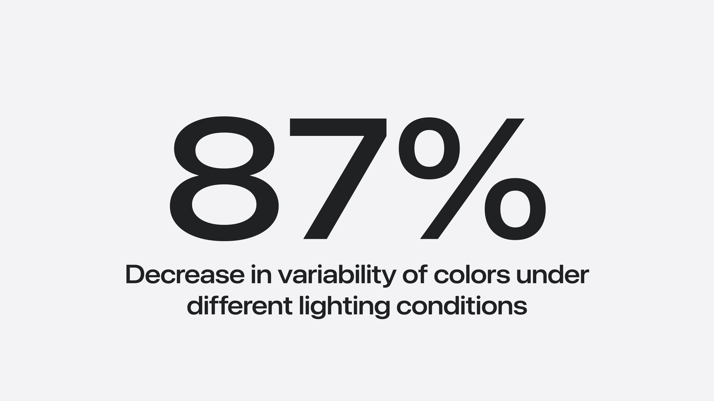

与常规的以摄影为重点的 iPhone 拍摄相比，恒定色彩 API 大幅提高了图像渲染的可重复性，即不同环境光下拍出的图像更加一致。iPhone15 系列使用恒定色彩 API，由于环境光导致的色彩偏差减少了 87%。具体可参阅即将发布的白皮书，了解验证方法和准确性部分。

## One more thing

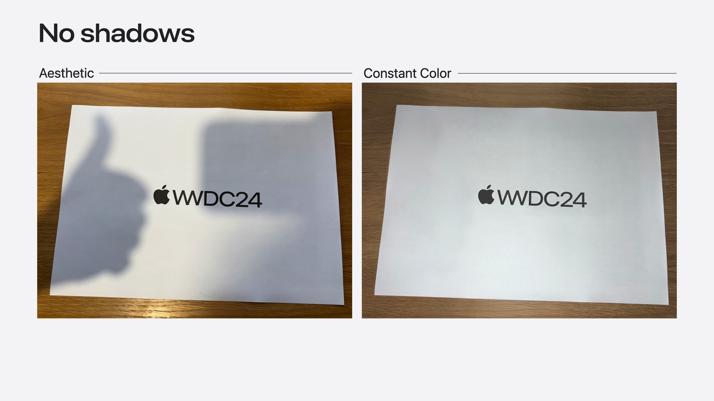

恒定色彩预测没有环境光的暗室闪光灯图像的结果是，环境光照射导致的场景中的阴影被减少或完全消失。看过 2024 iPad 发布会的可能还会记得，新 iPad Pro 文档扫描时能去除阴影，这正是恒定色彩 API 的功劳。作为参考，在文档扫描场景，`constantColorCenterWeightedMeanConfidenceLevel` 设置了 0.9 的阈值。

## 总结

- 恒定色彩是官方提供了一种新的拍摄模式。这种模式优先保留照片主体的颜色，而不是光影印染带来的情绪和氛围感。甚至我们不需要预先把材质和色卡放入拍摄场景中测量颜色，只需要使用闪光灯和恒定色彩 API 就能拍出色彩置信的照片。
- 恒定色彩图像具有高度可重复性，可减轻不同室内照明条件对图像的影响。
- 恒定色彩图像可以减少甚至完全消除环境光引起的阴影。
- API 提供了详细的置信度映射图和兜底常规拍摄图像，方便开发者控制和确定恒定色彩图像的使用。

人类是通过记住颜色和适应环境光实现色彩一致性，而苹果换了一种思路，先入为主，通过闪光灯照亮物体，让拍摄主体光照环境接近甚至一致，分别拍摄开启闪光灯和关闭闪光灯的照片，然后组合设备信息对比两张照片来预测、校正并生成最终的色彩一致的照片。字面上看似模拟了人类的生理特点，实际上则是尝试去采集和输出标准化的色彩。

文中反复提到的“可重复性”也是这样理解，标准化的色彩让我们可以在不同环境都能得出一致的色彩。这让我想起了友友之前做完色斑皮秒后，需要每天观察激光照射位置的皮肤恢复的情况。当时为了比对，每天都要在固定的时间、沙发固定的位置、固定的拍摄角度进行拍照记录。有了色彩恒定 API 就不必关心拍摄环境了，因为都能拍出不受环境光影响的恒定色彩。

个人觉得，恒定色彩 API 完全可以出一个独立的拍摄 App，特别是一些需要排除环境光、需要对比的使用场景，例如科研、取证、纪实类型的拍摄，还是非常实用的。在我们看来苹果在拍摄效果一直是追求写实、还原，这次推出的恒定色彩似乎有些剑走偏锋，让闪光灯成为主角，拍出来的效果或许并不是那么的“好看”，但从宏观的科研角度看何尝不是另一种“还原”呢。
