# WWDC24 10173 - Analyze Heap Memory

## 简介

在开发过程中大家肯定多多少少遇到过 OOM (内存溢出) 的问题，本文将分析内存异常的两类常见模式，并针对性的利用官方提供的 MemoryGraph 和 Instruments 工具对问题进行分析和优化。而在最后的扩展部分，将为大家讲解 Leaks 检测的具体原理，以及 weak 和 unowned 之间有什么性能差异。

## 基础知识

### 认识虚拟内存

现代 App 可以交互的内存都是虚拟内存，下图是 App 进程中虚拟内存的大致分类，我们可以看到有很多的类型：

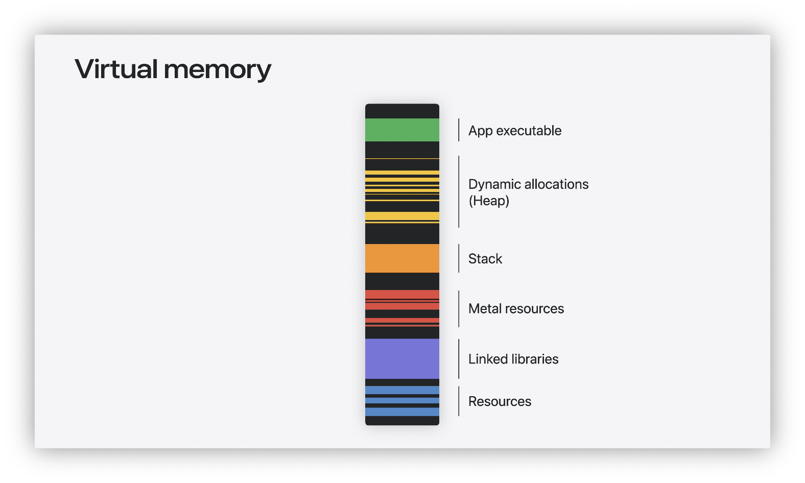
而它们每一块都可以细分为多个 regions，而每个 regions 包含了多个 pages，每种 pages 有三个状态：clean、compressed、dirty，递进的分类关系如下图所示。被申请了但没有被修改过的是 clean pages，并不需要占用真在的物理内存，dirty pages 则是被修改过的内存页，需要占用物理内存保存这些修改，compressed pages 是 dirty pages 被系统策略进行了压缩，使得占用体积更小，但是访问时需要解压缩。

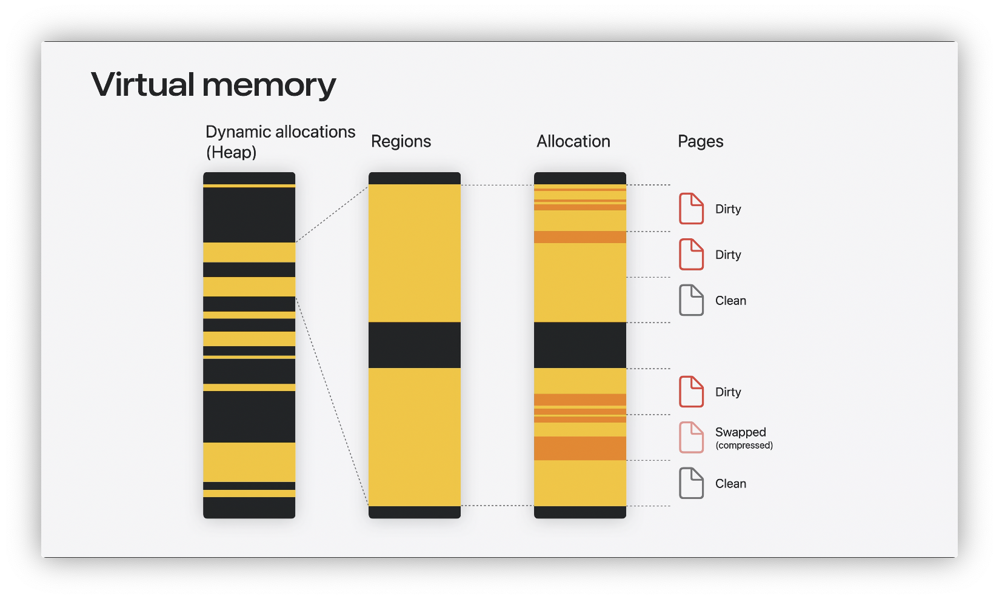


因此，一般我们在说 App 占用了多少（物理）内存时，统计的是 dirty + compress 的部分。在接下来的段落中，我们将这种统计口径的内存占用称之为 app 的 footprint。

### Heap memory 是什么

在编写代码时，我们开发着最常交互的内存区域就是堆和栈，今天我们关注的是堆内存的分析。我们在使用 `malloc`或者使用 `new`等方法时，实际上都会在 Heap 中申请内存。相对应的，如果我们直接使用 `mmap`或者 `vm_allocation`申请虚拟内存，则和 Heap 关系就不大了。

因此，本文的主题 Analyze Heap Memory 可以简单理解为涵盖了除 `mmap` 和  `vm_allocation` 之外大部内存操作。

## 分析工具简介

### Xcode memory report

利用 Xcode memory report 看内存水位上涨的趋势，如下图。通常我们可以发现 App “存在”内存问题，但基于这个宏观判断，并不能发现为什么内存有异常上涨。

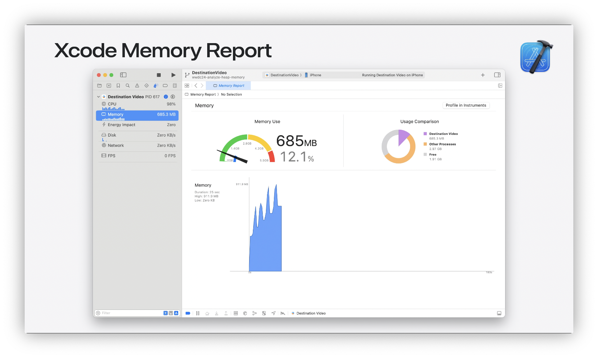


这时候就需要使用官方提供的两个工具 Memory Graph 和 Instrument 帮助我们进一步分析。

### Memory Graph

在 Xcode 中可以随时暂停 App 的运行，使用 memory graph 工具创建当前内存的快照，通过 memory graph 工具可以分析内存节点之间的引用关系，帮助我们定位为什么某一块内存没有被释放。

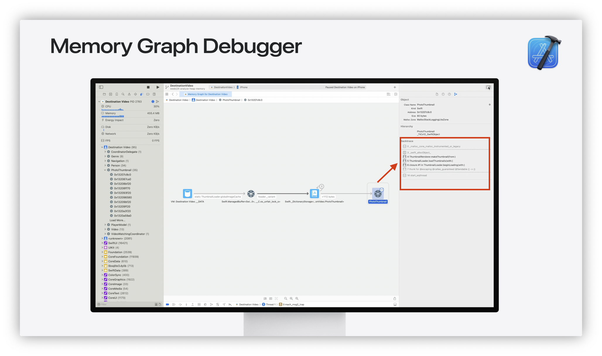


并且，如果在 Xcode 的 scheme -> diagnostics 中勾选了 MallocStackLogging，memory graph 还能显示处每个内存节点创建堆栈。本文接下来利用 memory graph 的内容默认都开启了 MallocStackLogging 选项（位置如下图）。

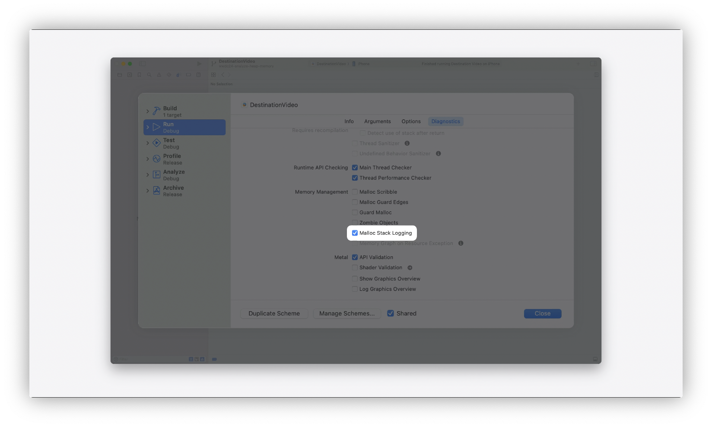


利用 memory graph 虽然可以探明具体节点的引用关系，但针对分析全局内存占用的需求而言，它不能直观的排序展示出哪块内存占用较多，这时需要引处第三个工具 Allocations。

### Instruments - Allocations

在 Instruments 中选择 Allocations 模板，或者将 memory graph 分享保存的 `.graph` 文件利用 Instruments 打开，我们可以看到如下的数据：

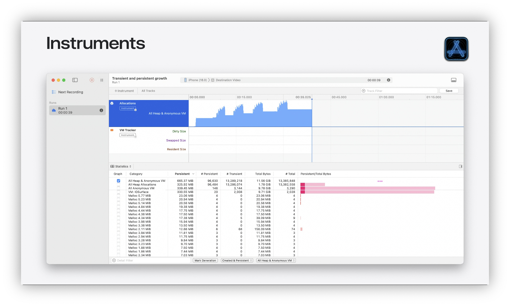


Allocations 可以将 heap 内存按不同方案进行分类排序，常用按内存节点类型排序和按分配堆栈排序。通过排序，我们可以迅速定位到占用内存最大的内存块，然后针对性的进行排查。

## 经典问题排查

### Autoreleasepool 对象堆积

让我们结合一个 Demo 来探究 autoreleasepool 对象堆积这一经典问题。Demo 的逻辑很简单，在 viewDidLoad 中增加一个 UIButton，每次点击后执行 doSomeThings 函数，for 循环创建一百万个 NSString 对象，具体代码如下：

```objectivec
- (void)viewDidLoad {
    [super viewDidLoad];
    UIButton *btn = [[UIButton alloc] initWithFrame:CGRectMake(0, 0, 400, 400)];
    [btn setTitle:@"触发autoreleasepool对象堆积" forState:UIControlStateNormal];
    [btn addTarget:self action:@selector(doSomeThings) forControlEvents:UIControlEventTouchUpInside];
    [self.view addSubview:btn];
}
 
- (void)doSomeThings {
    for (int i = 0; i < 1000000; i++) {
        NSString *tempString = [NSString stringWithFormat:@"Temporary String %d", i];
    }
}

```


运行 Demo 后我们发现每次点击这个按钮都会出现一个内存占用的尖刺，如下图所示。对于不了解 Autoreleasepool 机制的同学，这个现象不太符合直觉，因为 for 循环中的对象离开作用域后理论上应该会马上释放，其中的逻辑不应该导致内存出现激增。

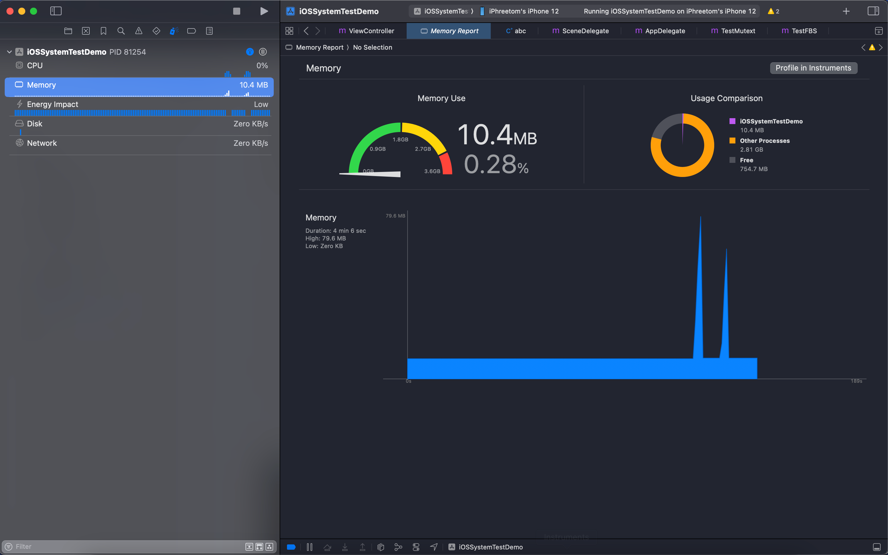


为了进一步探寻原因，我们使用 Allocations 对 Demo 进行采集，在时间线上选取一个尖刺的低点和高点，对下面的统计数据按 Persistent Bytes 进行排序：

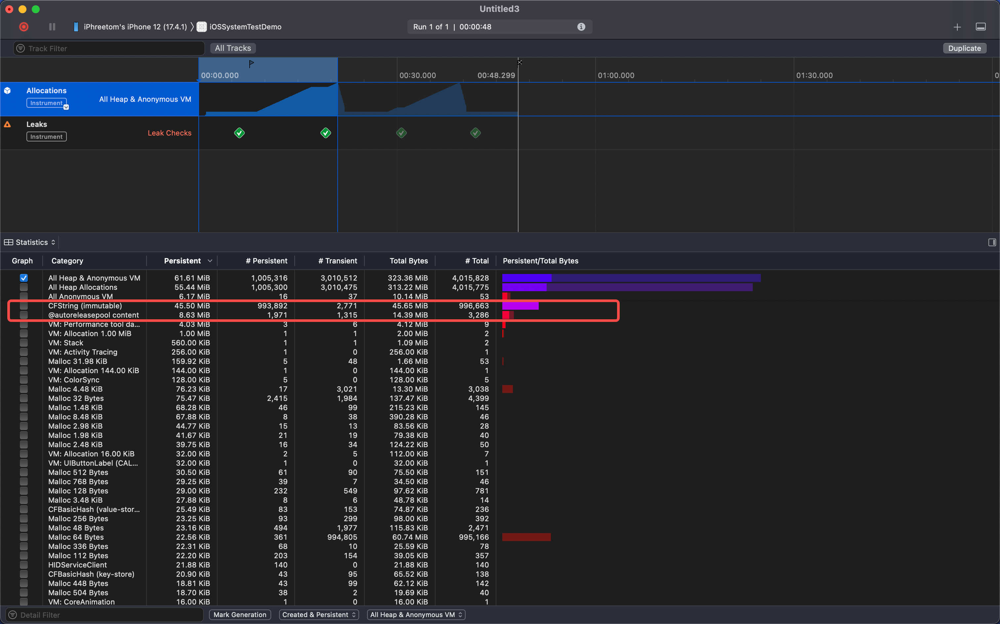


我们会发现，CFString 这类节点占用的内存最多，堆积了 993992 个对象，占用了 45.5 MiB 内存，和代码里创建 NSString 的逻辑可以对上。（同时这里能看到 autoreleasepool content 对象个数很多有 1971 个，当这个数量有几百个的时候基本上就可以确定存在 autoreleasepool 堆积的问题了）

为了进一步确认 CFString 节点是和 Demo 的代码逻辑相关，我们使用 Allocations 的另一个聚类方式 Call Tree，将内存占用按申请时的堆栈进行聚类。在下图可以看到 60 MB 的内存占用中有 54 MiB 来自 demo 中的 doSomeThings 函数。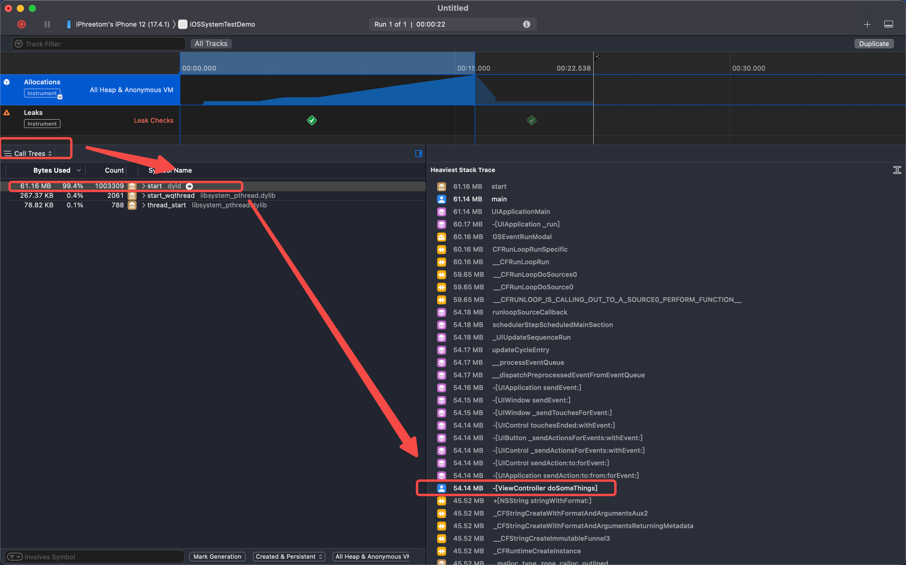


并且我们可以通过双击右侧的函数名称，跳转到源码显示，NSString 这一行总共创建了 281.73 MB 的内存。

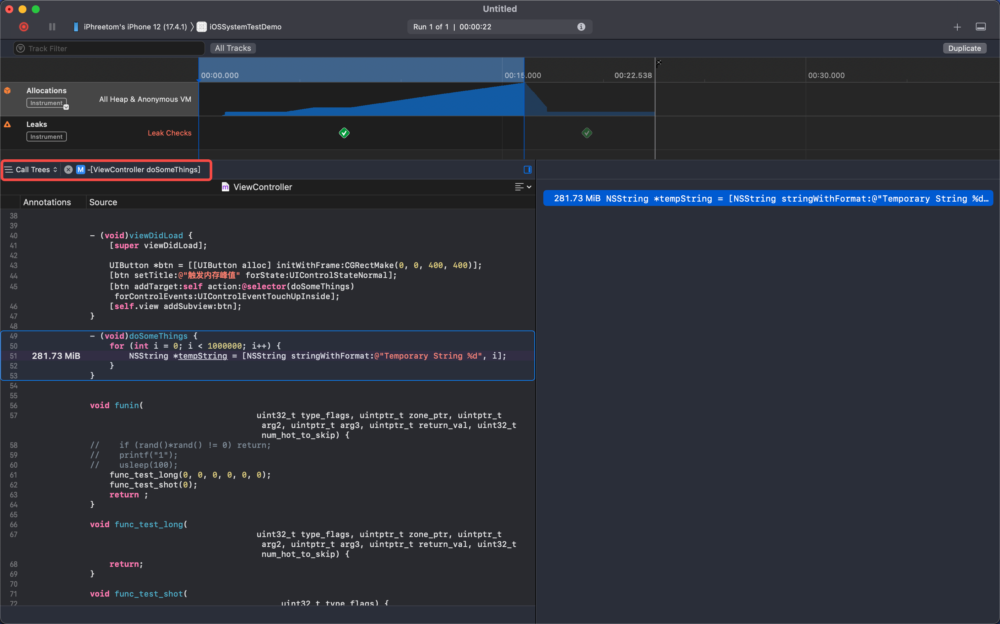


呢嗯？不是上面说 54 MB 么？为什么这边这变成了 280 MB？因为此处显示的是累积创建内存带下，包含了已经释放和没有释放的部分，而前面的 54 MB 的口径是创建了但未释放的部分。重新回到 statistic 类型的统计，按 Total Bytes 进行排序，我们可以看到有四类相关的申请加起来刚好是 280 MB。

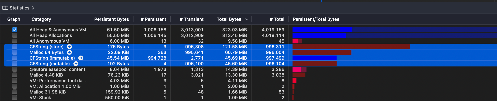


了解使用 Allocations 定位具体代码后，还需要了解一下 Autoreleasepool 的原理才能理解应该如何优化。

Autoreleasepool 通常用于延长函数返回变量的生命周期，被加入 Autoreleasepool 的对象生命周期和 Autoreleasepool 相同。通常每个线程都有一个 Autoreleasepool，但它仅在某些特定的生命周期才会清空 pool 内的对象，比如在线程销毁的时候。

结合我们 Demo 中的例子，for 循环内创建的 CFString 对象会被加入 Autoreleasepool 中，延迟到线程销毁时才被释放，而不是在每轮 for 循环结束时被释放。

```objectivec
// ...
    for (int i = 0; i < 1000000; i++) {
        NSString *tempString = [NSString stringWithFormat:@"Temporary String %d", i];
    }
// release all the obj in the pool
```

要想优化这种堆积的现象，最简单的方法就是在合适位置新增一个自动释放池：

```objectivec
    for (int i = 0; i < 1000000; i++) {
        @autoreleasepool {
            NSString *tempString = [NSString stringWithFormat:@"Temporary String %d", i];
        }
    }
```

再次运行，点击按钮，我们的 Demo 不再出现内存的尖刺，至此我们简单了解了如何通过 Allocations 分析 Autoreleasepool 对象堆积的问题，并通过在合适位置新增 autoreleasepool 标识，使得对象能在合适的生命周期内被释放。

### Leaks 内存泄露

解决了 Autoreleasepool 堆积问题后，我们再来看看另一个经典问题内存泄露 Leaks。首先，要定义什么是 leaks，我们将 App 申请的内存分成 3 中类型，一类是正常申请后使用的内存，第二类是无用内存，申请了但没有使用过（比如错误的缓存策略，一个单例保存了过多的资源），第三类是我们的代码不再可达的内存（比如存在循环引用，导致实例已经被释放的情况下，实例的某个属性一直无法被释放）。三种类型如下图所示：

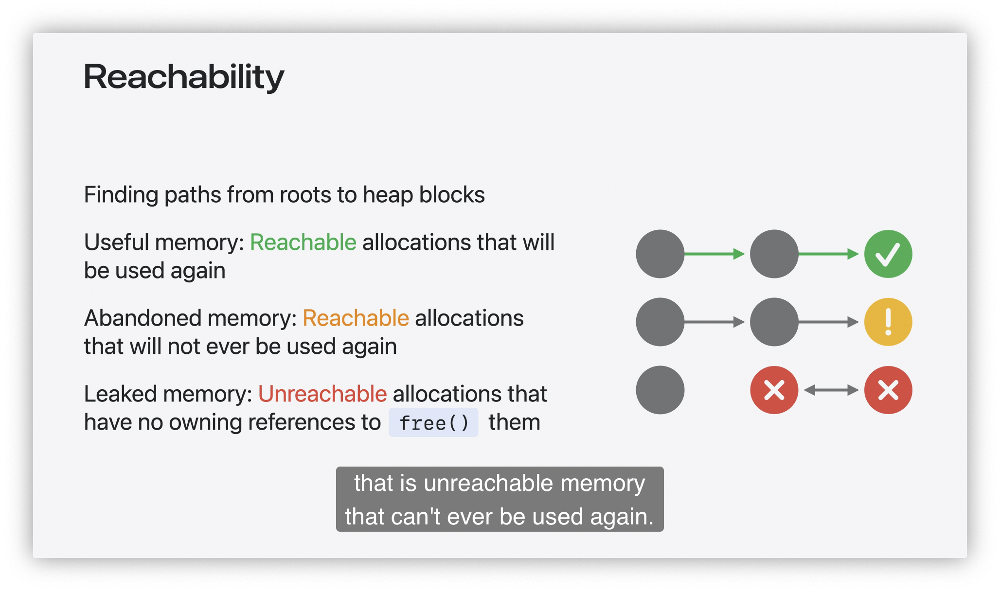


我们将第三类问题称为内存泄露 leaks。

对于大部分 leaks 问题，我们首要的目标都是找到对应的循环引用关系，使用 weak 或者 unowned 方法破除循环引用，使得对象能正常释放：

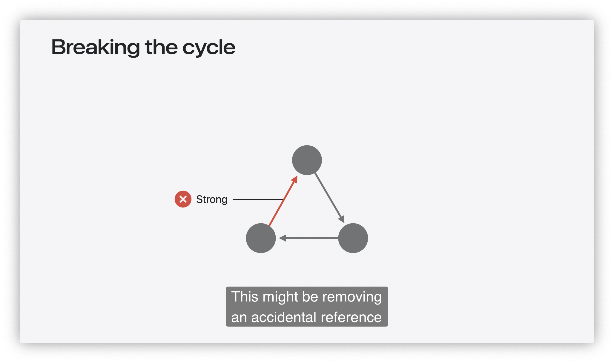


   一般而言，我们会使用 Memory Graph 来帮助我们寻找和解决这类循环引用导致的 leaks 问题。接下来结合 WWDC 的 demo，我们来看看如何使用 Memory Graph 解决这类问题。

在 Xcode 中点击下图右侧箭头对应的图标即可触发 Memory Graph 分析，而左侧箭头对应的图标可以选择仅查看 Leaks 问题和仅看 App Image 导致的 Leaks 问题。  

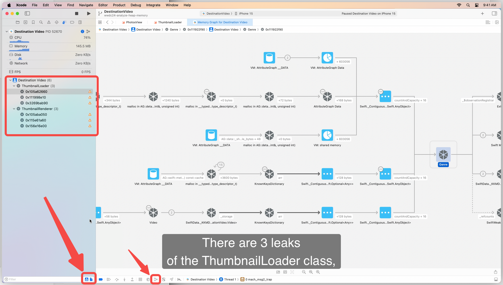


在进行过滤了后，我们点击一个具体的 Leaks 问题，就可以在下图的中间部分看到对象的引用关系，这里`ThumbnailRenderer` 通过 `cacheProvider` 强引用了一个 `ThreadnailLoader` 对象，而`ThreadnailLoader` 对象强引用了一个  `Swift closure context` 对象（也就是 block），最后 `Swift closure context` 对象强引用了`ThumbnailRenderer` 造成了一个循环引用。

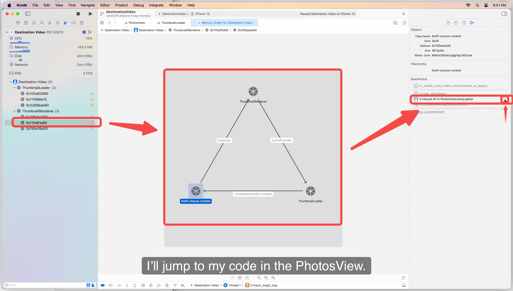


我们点击循环中某一个节点，可以在右侧看到其申请的堆栈，通过最右侧的小箭头可以跳转到源码进行进一步分析。

在下图的源码中，我们可以看到两条引用链 `loader` 强引用 `block` ，而 `block` 强引用 `render` ，通过查看 `render` 的源码应该也能发现最后一条强引用的链条。

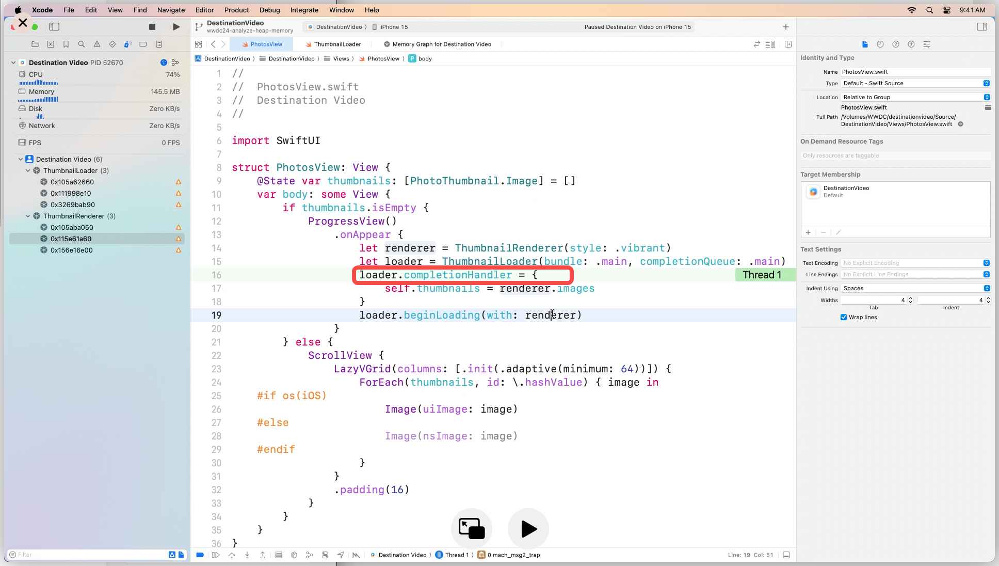


一般而言，这类 `block` 强引用变量导致的循环引用问题，都是将 `block` 中对变量的引用改成 `weak` 来解决，具体的修改如下：

```swift
loader.completionHandler = { [weak renderer] in
  guard let renderer else { return }
  self.thumbnails = renderer.images
}
```

我们将 `render` 变成弱引用，同时在使用 `render` 时判断是否已经被释放，来保障逻辑的正确。
再次运行，就可以发现 Memory Graph 中不再有 Leaks 问题。


## 拓展知识

### Leaks 检测的原理

刚刚我们利用 Memory Graph 的 Leaks 检测解决了一例内存泄露问题，但 Memory Graph 究竟是如何寻找到 Leaks 的呢？让我们来看看 man leaks 中简介：

```plain
NAME
  leaks – Search a process's memory for unreferenced malloc buffers
```

leaks 工具实质上是检测 malloc 出的内存块中（OC、Swift 对象创建最终也会调用到 malloc 系列的方法），哪些不再被引用但仍旧存在。
对这个表述，还可以这样理解：malloc 后未被释放的内存块地址是全集，而 leaks 工具通过扫描全局内存判断出哪些内存块没有被“引用过”是泄露的。

具体而言，leaks 通过一个个字节地扫描进程内的全局内存块、寄存器或者栈区域。如果有数据看上去刚好匹配上某个 malloc 内存块的地址，则认为这块内存引用了某个 malloc 内存块。

这种检测方案在一些特定情况会导致 leaks 无法被检测到，比如设计一块泄露的 malloc 内存块地址是 0x1000abcd，而我们刚好有一个全局的 uint64_t 变量的值为 0x1000abcd，leaks 工具也会认为那个 malloc 内存块被“引用过”因而不算泄露。

但一般而言，泄露的对象个数都是较多的，遗漏一两个并不会影响整体大盘的判断，通过修复工具检测出的问题，就能大幅降低 App 的内存泄露数量。

### “弱引用”之间的性能差异

了解了 leaks 检测的基本原理后，我们再来探索循环引用中常用的“弱引用” weak 和 unowned 之间的区别。

简单而言，使用 weak 比较安全，但消耗更多内存、访问速度更慢。而使用 unowned 速度更快、不消耗额外内存，但需要注意的是当指向的对象被销毁后，再次访问指正会导致 crash 问题。

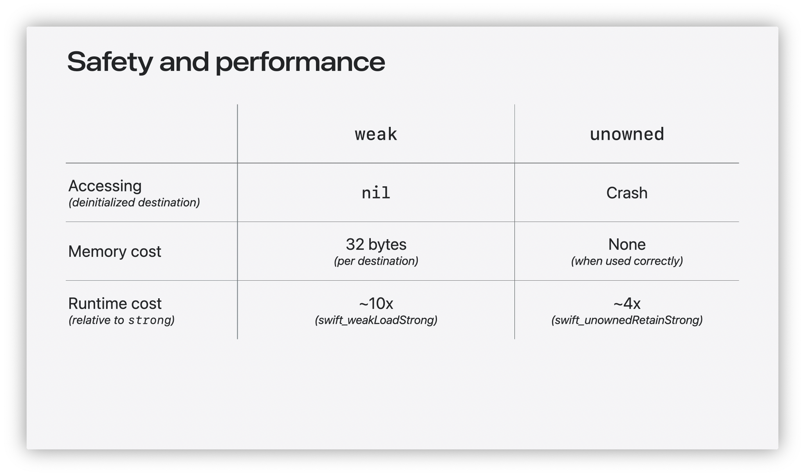


可以将 unowned 比作强制解 optional 的 weak，如果你能够保障 unowned 对象的生命周期小于等于目标对象，则可以使用 unowned 来提高性能。

## 总结

本文从虚拟内存的基础知识开始介绍，带大家了解了应用开发中解决 OOM 问题需要关注哪类型的内存，并简单介绍了三类分析工具的使用场景。分析了对象堆积和内存泄露这两例经典内存问题，探究了 leaks 的检测原理、“弱引用”之间的区别。

