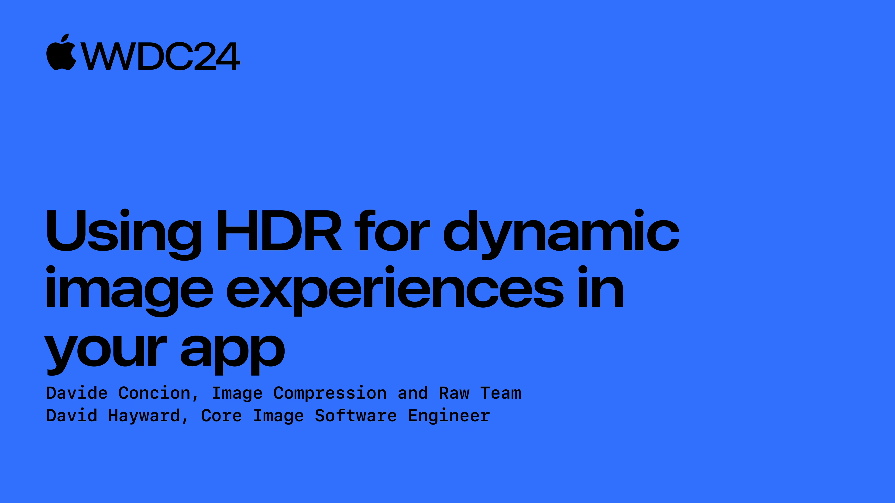
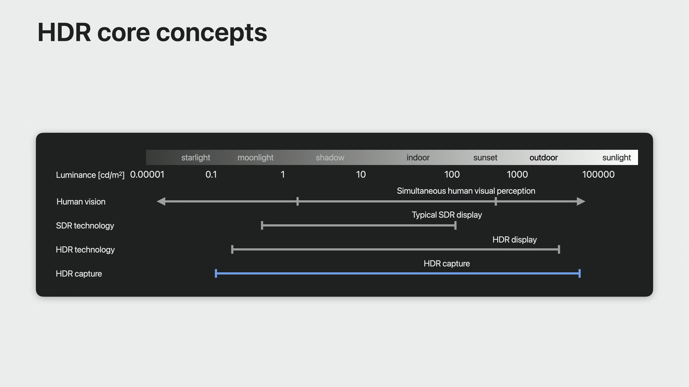
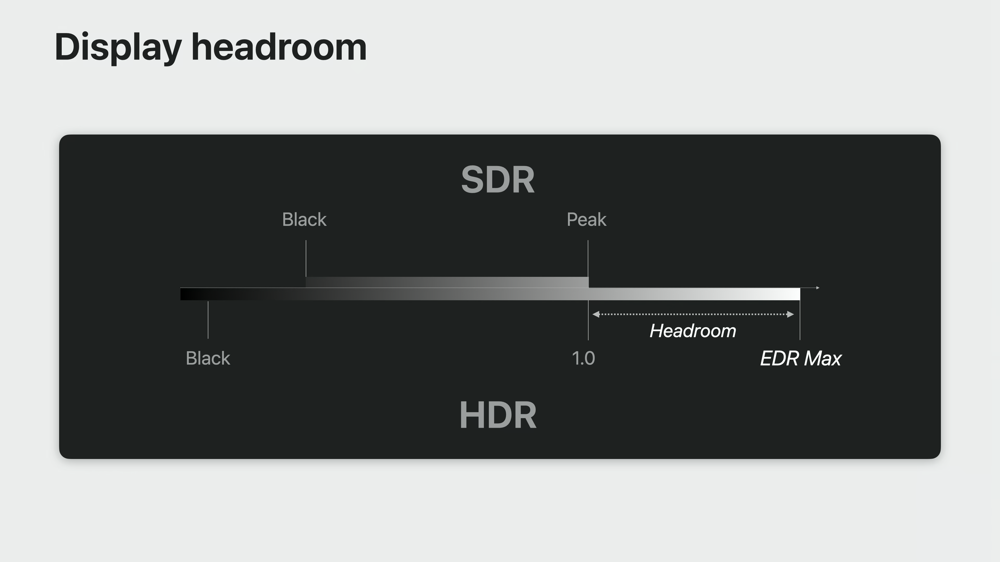
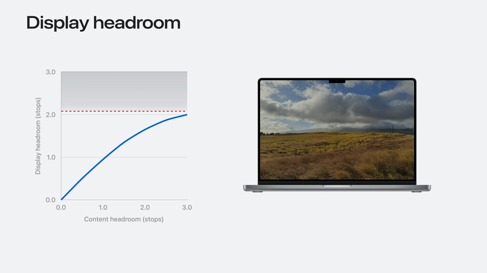

# WWDC24 10177 - 利用 HDR 为 App 打造动态图像体验 Use HDR for dynamic image experiences in your app

本文基于 [Session 10177](https://developer.apple.com/videos/play/wwdc2024/10177/) 整理

WWDC24 主要介绍了苹果新推出的 HDR 图片标准：自适应 HDR （Adaptive HDR）。自适应 HDR 技术通过在同一文件中存储 SDR 基线图以及 HDR 显示所需要的元数据和增益图，实现向后兼容 SDR 系统、解码器和应用程序的能力，且有助于在不同的显示环境下进行色调映射。在介绍如何在自适应 HDR 标准下实现对 HDR 图片的读写和处理前，文本将简要介绍 HDR 的基本概念并回顾往年 WWDC 中与 HDR 有关的内容。

## HDR 基本概念
HDR（High Dynamic Range 高动态范围）是一系列硬件和软件技术的集合，从拍摄、后处理到最终的显示，与传统的 SDR （Standard Dynamic Range 标准动态范围）相比，它能够表达更大的亮度范围，从而更贴近人眼的体验，实现对现实世界高保真的还原。



以下图的落日场景<sup>[1]</sup>为例，人眼能够同时捕获暗部（草地）和亮部（天空）的细节，但使用相机拍摄时，由于传感器可捕获的动态范围远远小于人眼，总会有一些细节因为曝光不足或曝光过度而丢失。


通过 HDR 拍摄技术，拍摄者可以捕捉多张不同曝光度的图像，最终通过软件进行合成，在拍摄设备不变的情况下，这个图片集合相比于单张图片，实际上扩大了捕获的亮度范围，从而给最终还原更多细节留下了空间。


完成 HDR 图片的拍摄后，也依赖显示设备和渲染技术，来还原其所记录的高亮度范围的信息。标准 SDR 的最大亮度通常被称为 reference white，在苹果的 EDR （Extened Dynamic Range 扩展动态范围）渲染技术中，当前显示设备的峰值亮度为 EDR Max，其与 reference white 之间的距离，被称为 headroom。Headroom 的大小一般使用 EDR Max 与 reference white之间的比例或比例的对数来度量，反应了展示 HDR 内容的能力，通常与设备的峰值亮度以及设备当前的亮度设置有关。



HDR 图片也有headroom的概念，反应了图片中最大亮度与 reference white 之间的距离，当显示设备当前的 headroom 小于图片的 headroom 时，超出的部分就面临裁剪（clipping），无论其亮度值为多少，都以当前的最大亮度显示，这样的做法显然会造成这部分信息的丢失。


为了避免这种情况，很自然地会想到将内容的亮度范围通过函数映射到当前显示设备支持的亮度范围，这也是 HDR 中的重要概念：色调映射（Tone mapping）。通过这种技术，HDR 内容甚至可以显示在只支持 SDR 的设备上。为了在映射后获得更好的展示效果，发展出了多种色调映射技术，包括 Reinhard Tone Mapping，Filmic Tone Mapping，ACES（Acadamy Color Encoding System）等<sup>[2]</sup>。



## 往年 WWDC HDR 相关内容回顾

WWDC21 首先在 MacOS 上引入了 EDR，提供对 HDR 内容的渲染支持。在 WWDC22 上进一步将这种技术扩展到 iOS/iPadOS 中，并增加了参考模式（Reference Mode），为专业工作者提供更好的支持，同时也介绍了如何借助Core Image、Metal 和 SwiftUI 显示 EDR 内容以及如何利用 AVFoundation 和 Metal 显示 HDR 视频，可以阅读 [WWDC22 内参](https://xiaozhuanlan.com/topic/1874509623)了解详细情况。

WWDC23 介绍了苹果推动建设的 HDR 图片技术标准：[ISO/TS 22028-5](https://www.iso.org/standard/81863.html)。该标准定义了一种无损编码 HDR 内容的方式，遵循这种标准的 HDR 图片，也被苹果称为 ISO HDR。SwiftUI、UIKit 和 AppKit 能够以极简的 API 显示 ISO HDR 内容，并且通过设置 DynamicRange，将复杂的 色调映射工作交给系统来完成。

```swift
let image = UIImage(contentsOfFile: pathToFile)
let imageView = UIImageView(image: image)
imageView.preferredImageDynamicRange = .high
```

与 ISO HDR 相对应的概念，是苹果一直以来在自己的相机和照片 App 中使用的 Gain map HDR，以往 Gain map HDR 图片仅仅在照片 App 中以 HRD 形态显示，如今开发者可以通过最新提供的 API （例如 UIKit 中的 UIImageReader）来获取 Gain map HDR 图片并在自己的 App中展示。

```swift
var config = UIImageReader.Configuration()
config.prefersHighDynamicRange = true
let image = reader.image(fileURL: url)
```

Gain map HDR 与当今 WWDC24 的主角 Adaptive HDR 有着相同的理念，后者正是苹果在尝试对前者进行标准化时的产物，下面将在介绍 Adaptive HDR 的过程中，简单叙述它们的理念以及两者的不同。

## What's New: Adaptive HDR

长久以来，HDR 图片的一大问题就是兼容性差，兼容性同时体现在生产阶段和消费阶段<sup>[3]</sup>。在生产阶段，传统的 JPEG 格式不能存储 HDR 图像，因为 JPEG 格式只有 8bits 色深，而 HDR 图片通常要求 10bits 或 12bits。在消费阶段，HDR 图片必须经过“色调映射”，才能在 SDR 设备上展示，而这样的展示效果，往往还不如一张简单的 SDR 图片，因为每一张独一无二的图片都使用了相同的映射规则。

Gain map HDR 通过将图像信息拆分成以下3部分存储，解决了上述兼容性问题：
- 一张基线图像（baseline image），通常是 SDR 图像，从而 JPEG 格式也可以存储
- 增益图，Gain map HDR 的核心，并非实际的图像，而是包含了每一个像素应该如何在 SDR 和 HDR 之间转换的信息，相当于存储了图像在两种动态范围之间的映射关系
- 元数据，反映了增益图是如何编码的以及在显式设备上优化渲染所需的关键信息

由于基线图片就是 SDR 图片，对于 SDR 设备的兼容性问题不复存在，甚至由于增益图实际上反映了 HDR 和 SDR 信号之间的插值关系，因此 headroom 不足的 HDR 设备，也能够在任意 headroom 下达到高质量的呈现效果。


如今苹果尝试将 Gain map HDR 技术标准化，这种标准化主要反映在两个方面，一是增益图的生产和消费过程中，HDR 和 SDR 信息应满足特定的对数关系，二是元数据的编码格式以及在不同文件格式（例如 HEIF、JPEG）中的存储应满足特定的规范。这种标准化后的技术被苹果成为 Adaptive HDR。从 iOS18 开始，传统的 Gain map HDR 将全面迁移到符合新标准的 Adaptive HDR，iPhone 15 和 iPhone 15 Pro 将能够拍摄符合新标准的 Adaptive HDR 图片。


除了 Adaptive HDR 外，苹果也针对传统的 ISO HDR 渲染进行了优化，色调映射从默认的 ITU Global Tone Mapping，升级为新研发的 Reference White Tone Mapping，这将减少亮部的裁剪并提升色彩还原的质量，这种新的技术将被用于 iOS，maxOS，tvOS，watchOS 和 visionOS。

## Adaptive HDR 的读取、编辑、保存与展示


### 读取、编辑与保存

对于 Adaptive HDR，除了获取 SDR 图片和 HDR 图片，开发者还能够读取其增益图：

```swift
let sdrImage = CIImage(contentsOf: url)
let hdrImage = CIImage(contentsOf: url, options: [.expandToHDR : true])
let gain = CIImage:(contentsOf: url, options: [.auxiliaryHDRGainMap : true])
```

读取到这三种图片信息后，开发者可以应用如下不同的图片编辑策略

#### 仅编辑 HDR 图像

仅编辑 HDR 实现起来最为简单，只需要保证滤镜能够对 HDR 内容生效，当然这也导致部分仅对 SDR 生效的滤镜在这种策略下无法使用。由于仅编辑了 HDR 图片，SDR 和增益图部分的信息已经无法与编辑后的 HDR 图片保持匹配，在保存时建议直接保存为 ISO HDR 图片。

```swift
// read and edit
let image = CIImage(contentsOf: url, options: [.expandToHDR : true])

let filter = CIFilter.vignetteEffectFilter()
filter.center = CGSize(width: image.extent.size.width/2, height:image.extent.size.height/2)
filter.radius = image.extent.size.height/2
filter.intensity = -1.0

filter.inputImage = image
let editedImage = filter.outputImage

// save
ctx.writeHEIF10Representation(of: editedImage, to: url, colorSpace: pqSpace)
```

#### 同时编辑 SDR 和 HDR 图像

同时编辑 SDR 和 HDR 与单独编辑其中之一在实现上没有区别，需要注意在编辑过程中保持它们的协调。在保存的时候，系统能够根据编辑后的 SDR 和 HDR 图片，重新计算并生成增益图，从而可以继续保存为 Adaptive HDR 形式。
```swift
ctx.writeHEIF10Representation(of: editedSDR, to: url, colorSpace: p3Space, options: [.HDRImage: editedHDR])
```

#### 同时编辑 SDR 和 增益图

在编辑增益图时需要注意它并非真正意义上的图片，它的线性尺寸只有基线 SDR 图片的一半，因此在如下示例代码中做拉伸变换时，首先要进行缩放变换；同时只有少部分滤镜能够作用于增益图，因此这种编辑策略通常用于像旋转和裁剪这样简单的变换。

```swift
// read and edit
let sdr = CIImage(contentsOf: url)
var gain = CIImage:(contentsOf: url, options: [.auxiliaryHDRGainMap : true])
let xform = CGAffineTransform(scaleX: sdr.extent.size.width/gain.extent.size.width, y: sdr.extent.size.height/gain.extent.size.height)
gain = gain.transformd(by: xform)

let filter = CIFilter.strechCropFilter()
filter.size = CGSize(width: 1280, height: 720)
filter.cropAccount = 1.0

filter.inputImage = sdr
let editedSDR filter.outputImage
filter.inputImage = gain
let editedGain = filter.outputImage

// save
ctx.writeHEIF10Representation(of: editedSDR, to: url, colorSpace: p3Space, options: [.HDRGainMapImage: editedGain])
```

下图是对这三种编辑策略各自优缺点的总结，相比于仅编辑 HDR 图片，后两种策略都能保持增益图的有效性从而能够保存为 Adaptive HDR 图片，进而在传播和展示时，维持良好的向后兼容能力与出色的色调映射，其中编辑增益图的策略，由于只有有限的滤镜能够被应用，通常用于比较简单的场景。


### 展示

上文提到，HDR 图片在不同 headroom 的显示设备上展示时，需要进行色调映射。通常来说，开发者只需要设置期望的DynamicRange，就可以将这项复杂的工作交给系统处理：

```swift
let image = UIImageReader.default.image(contentsOfURL: url)
let imageView = UIImageView(image: image)
imageView.preferredImageDynamicRange = .high // .low or .constraindHigh
```

通过新的 API，开发者可以在展示 HDR 图片的时候指定 headroom 甚至增益图，从而获得更大的自由：

```swift
// display HDR image with current display headroom
let headroom = view.window.screen.currentEDRHeadroom
let tonemappedImage = editedHDR.applyingFilter("CIToneMapHeadroom", parameters: ["inputTargetHeadroom" : headroom])
cicontent.startTask(toRender: tonemappedImage, ...)

// display HDR image with SDR image, gain map and headroom
let headroom = view.window.screen.currentEDRHeadroom
let tonemappedImage = editedSDR.applyingGainMap(editedGain, headroom: headroom)
cicontext.startTask(toRender: tonemappedImage, ...)
```

## 结语

尽管 HDR 技术已经有多年的发展历程，苹果也从数年前的 iPhone 机型就开始就支持 HDR 图片的拍摄，但以往在系统 App 中只有照片能够展示 HDR 图片。从 iOS18/macOS15 开始，信息、快速查看、预览也加入了对 HDR 的支持。随着 Adaptive HDR 的推广，兼容性问题得到改善，开发者也对 HDR 图片的操纵拥有了更大的自由度，用户将能够在更多样的设备上体验到更多彩的影像世界。

## 参考资料
[1] https://photographylife.com/hdr-photography-tutorial  
[2] https://64.github.io/tonemapping/  
[3] https://gregbenzphotography.com/hdr-photos/jpg-hdr-gain-maps-in-adobe-camera-raw/
